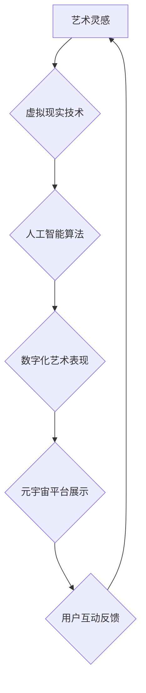

                 

# 元宇宙艺术创作：打破物理与想象力的界限

## 关键词：（元宇宙，艺术创作，虚拟现实，人工智能，数字化艺术）

## 摘要：

本文将探讨元宇宙艺术创作的可能性，通过结合虚拟现实、人工智能和数字化艺术等前沿技术，打破物理世界的限制，拓展艺术创作的边界。我们将从背景介绍、核心概念与联系、核心算法原理、数学模型与公式、项目实战、实际应用场景、工具和资源推荐以及未来发展趋势与挑战等方面，深入剖析元宇宙艺术创作的技术基础与发展前景。

## 1. 背景介绍

### 1.1 元宇宙的兴起

随着互联网技术的飞速发展，虚拟现实（VR）、增强现实（AR）和混合现实（MR）等前沿技术逐渐走进了人们的日常生活。元宇宙（Metaverse）作为这些技术的集大成者，已经成为全球范围内的一大热门话题。元宇宙是一种虚拟的三维空间，用户可以在这个空间中交互、社交、娱乐、学习和工作。它不仅是一个虚拟的数字世界，更是一个与现实世界紧密相连的全新领域。

### 1.2 艺术创作的变革

艺术创作自古以来就是人类表达情感、探索世界和挑战自我的方式。然而，随着技术的进步，艺术创作的方式和形式也在不断变革。虚拟现实、人工智能和数字化艺术等新技术为艺术家们提供了全新的创作工具和表现手段，使得艺术创作不再局限于传统的物理世界，而是可以在虚拟世界中尽情探索和发挥。

### 1.3 元宇宙艺术创作的意义

元宇宙艺术创作不仅拓展了艺术创作的边界，更为人类带来了一系列新的可能性。首先，它打破了物理世界的限制，使得艺术作品可以超越现实，呈现出前所未有的形式和美感。其次，元宇宙艺术创作为艺术家们提供了一个全新的创作平台，使得他们可以与全球观众进行实时互动，从而实现更广泛的影响力和传播。最后，元宇宙艺术创作作为一种创新的艺术形式，有助于推动艺术领域的变革和发展。

## 2. 核心概念与联系

### 2.1 虚拟现实与元宇宙

虚拟现实（VR）是一种通过计算机模拟产生三维空间的技术，用户可以通过VR设备（如头戴式显示器、手柄等）进入这个虚拟空间，与之进行交互。元宇宙则是基于虚拟现实技术构建的更为广阔的数字世界，用户可以在其中进行各种活动，如社交、娱乐、学习等。

### 2.2 人工智能与元宇宙

人工智能（AI）在元宇宙中发挥着重要作用。首先，AI可以用于生成虚拟世界中的各种场景、角色和物体，使得元宇宙更加真实和丰富。其次，AI可以帮助艺术家们实现自动化创作，提高艺术创作的效率和质量。此外，AI还可以用于分析用户行为和偏好，为元宇宙中的内容提供个性化的推荐。

### 2.3 数字化艺术与元宇宙

数字化艺术是指将传统艺术作品通过数字技术进行创作、展示和传播的艺术形式。在元宇宙中，数字化艺术作品可以通过虚拟现实技术呈现给观众，实现更加生动、立体的艺术体验。同时，元宇宙也为数字化艺术提供了全新的展示平台，使得艺术家们可以更加自由地创作和表达。

### 2.4 Mermaid 流程图

以下是元宇宙艺术创作流程的Mermaid流程图：



## 3. 核心算法原理 & 具体操作步骤

### 3.1 虚拟现实技术

虚拟现实技术的核心在于构建一个沉浸式的三维虚拟空间。具体操作步骤如下：

1. **场景建模**：通过计算机图形学技术，将艺术作品中的场景、角色和物体进行三维建模。
2. **渲染技术**：使用渲染器对三维模型进行渲染，生成逼真的视觉效果。
3. **交互技术**：为用户设计合适的交互方式，如手柄、手势等，使其能够在虚拟空间中自由操作。

### 3.2 人工智能算法

人工智能算法在元宇宙艺术创作中的应用主要包括：

1. **场景生成**：利用生成对抗网络（GAN）等技术，生成虚拟世界中的各种场景和角色。
2. **自动化创作**：利用神经网络等机器学习技术，实现艺术作品的自动化创作。
3. **个性化推荐**：分析用户行为和偏好，为元宇宙中的内容提供个性化的推荐。

### 3.3 数字化艺术表现

数字化艺术表现的具体操作步骤包括：

1. **数字化转化**：将传统艺术作品通过数字技术进行转化，生成数字化的艺术作品。
2. **虚拟展示**：使用虚拟现实技术，将数字化艺术作品在元宇宙中进行展示。
3. **互动体验**：为用户提供与数字化艺术作品互动的机会，增强用户体验。

## 4. 数学模型和公式 & 详细讲解 & 举例说明

### 4.1 生成对抗网络（GAN）

生成对抗网络（GAN）是一种由生成器和判别器组成的深度学习模型。生成器的目标是生成与真实数据分布相近的样本，判别器的目标是区分真实数据和生成数据。两者相互竞争，最终实现生成逼真的虚拟场景。

具体公式如下：

$$
\begin{aligned}
&\text{生成器：} G(x) \sim p_G(z) \\
&\text{判别器：} D(x) \quad \text{和} \quad D(G(z)) \\
&\text{损失函数：} L(G, D) = \mathbb{E}_{x\sim p_{\text{data}}(x)}[\log D(x)] + \mathbb{E}_{z\sim p_{\text{z}}(z)}[\log(1 - D(G(z)))]
\end{aligned}
$$

### 4.2 神经网络

神经网络是一种通过多层非线性变换进行信息处理的模型。在元宇宙艺术创作中，神经网络可以用于自动化创作、场景生成和个性化推荐等任务。

具体公式如下：

$$
\begin{aligned}
&\text{输入层：} x \\
&\text{隐藏层：} h_{l} = \sigma(W_{l}x + b_{l}) \\
&\text{输出层：} y = \sigma(W_{L}h_{L} + b_{L}) \\
&\text{激活函数：} \sigma(z) = \frac{1}{1 + e^{-z}}
\end{aligned}
$$

### 4.3 举例说明

以生成对抗网络（GAN）为例，假设我们想要生成一个逼真的虚拟场景。首先，我们需要设计一个生成器网络和一个判别器网络。生成器网络负责生成虚拟场景，判别器网络负责判断生成场景与真实场景的相似度。

具体步骤如下：

1. **初始化网络参数**：随机初始化生成器和判别器的网络参数。
2. **训练生成器**：通过随机噪声生成虚拟场景，并让判别器判断这些场景的真实性。
3. **训练判别器**：让判别器学习区分真实场景和生成场景。
4. **迭代优化**：不断迭代优化生成器和判别器的参数，直至生成器生成的虚拟场景能够骗过判别器。

通过这样的训练过程，生成器最终能够生成逼真的虚拟场景，从而实现元宇宙艺术创作。

## 5. 项目实战：代码实际案例和详细解释说明

### 5.1 开发环境搭建

为了实现元宇宙艺术创作，我们需要搭建一个合适的开发环境。以下是搭建步骤：

1. **安装Python环境**：下载并安装Python，版本建议为3.8或更高。
2. **安装PyTorch**：使用pip命令安装PyTorch，命令如下：

   ```bash
   pip install torch torchvision
   ```

3. **安装其他依赖库**：根据项目需求，安装其他依赖库，如numpy、matplotlib等。

### 5.2 源代码详细实现和代码解读

以下是一个简单的生成对抗网络（GAN）项目示例，用于生成虚拟场景。

```python
import torch
import torch.nn as nn
import torch.optim as optim
from torch.utils.data import DataLoader
from torchvision import datasets, transforms
from torchvision.utils import save_image

# 设置随机种子
torch.manual_seed(0)

# 定义生成器和判别器
class Generator(nn.Module):
    def __init__(self):
        super(Generator, self).__init__()
        self.model = nn.Sequential(
            nn.ConvTranspose2d(100, 256, 4, 1, 0, bias=False),
            nn.BatchNorm2d(256),
            nn.ReLU(True),
            nn.ConvTranspose2d(256, 128, 4, 2, 1, bias=False),
            nn.BatchNorm2d(128),
            nn.ReLU(True),
            nn.ConvTranspose2d(128, 64, 4, 2, 1, bias=False),
            nn.BatchNorm2d(64),
            nn.ReLU(True),
            nn.ConvTranspose2d(64, 3, 4, 2, 1, bias=False),
            nn.Tanh()
        )

    def forward(self, x):
        return self.model(x)

class Discriminator(nn.Module):
    def __init__(self):
        super(Discriminator, self).__init__()
        self.model = nn.Sequential(
            nn.Conv2d(3, 64, 4, 2, 1, bias=False),
            nn.LeakyReLU(0.2, inplace=True),
            nn.Conv2d(64, 128, 4, 2, 1, bias=False),
            nn.BatchNorm2d(128),
            nn.LeakyReLU(0.2, inplace=True),
            nn.Conv2d(128, 256, 4, 2, 1, bias=False),
            nn.BatchNorm2d(256),
            nn.LeakyReLU(0.2, inplace=True),
            nn.Conv2d(256, 1, 4, 1, 0, bias=False),
            nn.Sigmoid()
        )

    def forward(self, x):
        return self.model(x)

# 实例化生成器和判别器
generator = Generator()
discriminator = Discriminator()

# 设置损失函数和优化器
criterion = nn.BCELoss()
optimizer_g = optim.Adam(generator.parameters(), lr=0.0002, betas=(0.5, 0.999))
optimizer_d = optim.Adam(discriminator.parameters(), lr=0.0002, betas=(0.5, 0.999))

# 加载随机噪声数据
noise = torch.randn((100, 1, 1, 1), device=device)

# 训练生成器和判别器
for epoch in range(num_epochs):
    for i, real_images in enumerate(data_loader):
        batch_size = real_images.size(0)
        real_labels = torch.ones(batch_size, device=device)
        fake_labels = torch.zeros(batch_size, device=device)

        # 训练判别器
        optimizer_d.zero_grad()
        output = discriminator(real_images)
        d_real_loss = criterion(output, real_labels)
        output = discriminator(generator(noise))
        d_fake_loss = criterion(output, fake_labels)
        d_loss = d_real_loss + d_fake_loss
        d_loss.backward()
        optimizer_d.step()

        # 训练生成器
        optimizer_g.zero_grad()
        output = discriminator(generator(noise))
        g_loss = criterion(output, real_labels)
        g_loss.backward()
        optimizer_g.step()

        # 保存生成的虚拟场景
        if (i+1) % 50 == 0:
            with torch.no_grad():
                fake_images = generator(noise)
            save_image(fake_images, 'fake_images/fake_{}.png'.format(epoch * len(data_loader) + i + 1))

    print(f'Epoch [{epoch+1}/{num_epochs}], d_loss: {d_loss.item():.4f}, g_loss: {g_loss.item():.4f}')

# 代码解读：

1. **模型定义**：我们定义了生成器和判别器两个网络模型。生成器负责生成虚拟场景，判别器负责判断生成场景与真实场景的相似度。
2. **损失函数与优化器**：我们设置了二进制交叉熵损失函数（BCELoss），并使用了Adam优化器。
3. **训练过程**：我们通过迭代训练生成器和判别器，使得生成器生成的虚拟场景能够骗过判别器。
4. **生成虚拟场景**：在每个训练周期后，我们使用生成器生成虚拟场景，并保存为图片。

### 5.3 代码解读与分析

以上代码实现了一个简单的生成对抗网络（GAN）模型，用于生成虚拟场景。以下是代码的详细解读和分析：

1. **模型结构**：生成器模型采用卷积转置层（ConvTranspose2d）进行上采样，生成虚拟场景。判别器模型采用卷积层（Conv2d）进行下采样，判断虚拟场景的真实性。
2. **损失函数**：我们使用二进制交叉熵损失函数（BCELoss）来衡量生成器和判别器的损失。生成器的目标是使得生成场景能够骗过判别器，判别器的目标是正确判断生成场景与真实场景的相似度。
3. **优化器**：我们使用Adam优化器来更新生成器和判别器的参数。Adam优化器具有较高的收敛速度和较好的性能。
4. **训练过程**：我们通过迭代训练生成器和判别器，使得生成器生成的虚拟场景越来越逼真，判别器能够更好地判断生成场景的真实性。
5. **生成虚拟场景**：在每个训练周期后，我们使用生成器生成虚拟场景，并保存为图片。这些生成的虚拟场景可以作为元宇宙艺术创作的基础。

## 6. 实际应用场景

### 6.1 虚拟展览

虚拟展览是元宇宙艺术创作的一个重要应用场景。艺术家们可以在元宇宙中创建虚拟艺术馆，展示自己的作品。观众可以通过虚拟现实设备参观展览，与作品进行互动，甚至可以在虚拟空间中购买艺术品。这种虚拟展览方式不仅打破了地域和时间的限制，还提供了更加丰富和沉浸式的艺术体验。

### 6.2 虚拟音乐会

虚拟音乐会是一种将音乐与虚拟现实相结合的创新艺术形式。艺术家们可以在元宇宙中举办虚拟音乐会，观众可以通过虚拟现实设备观看演出，与艺术家进行互动。这种虚拟音乐会不仅提供了全新的音乐体验，还可以为艺术家们带来更多的表演机会和收入来源。

### 6.3 虚拟角色定制

虚拟角色定制是元宇宙艺术创作中的一个有趣应用。用户可以在元宇宙中创建自己的虚拟角色，根据自己的喜好和个性进行定制。这种虚拟角色定制不仅为用户提供了一种个性化的表达方式，还可以为游戏、电影等虚拟世界中的角色创作提供丰富的素材。

## 7. 工具和资源推荐

### 7.1 学习资源推荐

1. **《深度学习》（Deep Learning）**：这是一本关于深度学习领域的经典教材，涵盖了深度学习的基本概念、算法和应用。
2. **《虚拟现实技术》（Virtual Reality Technology）**：这本书详细介绍了虚拟现实技术的原理、应用和发展趋势，是了解虚拟现实技术的必备读物。
3. **《元宇宙：概念与实践》（The Metaverse: A Concept and Practice）**：这本书探讨了元宇宙的定义、特点和应用，为元宇宙艺术创作提供了有益的参考。

### 7.2 开发工具框架推荐

1. **PyTorch**：PyTorch是一个开源的深度学习框架，支持GPU加速，非常适合进行深度学习和生成对抗网络（GAN）的开发。
2. **Unity**：Unity是一个功能强大的游戏引擎，支持虚拟现实和增强现实开发，为元宇宙艺术创作提供了良好的平台。
3. **Blender**：Blender是一个开源的三维建模和渲染软件，适用于元宇宙艺术创作的场景建模和渲染。

### 7.3 相关论文著作推荐

1. **“Generative Adversarial Networks”**：这篇论文首次提出了生成对抗网络（GAN）的概念，是深度学习和生成模型领域的重要文献。
2. **“Metaverse: A Space Beyond the Internet”**：这篇论文探讨了元宇宙的定义、特点和应用，为元宇宙艺术创作提供了理论基础。
3. **“Virtual Reality and Augmented Reality”**：这本书详细介绍了虚拟现实和增强现实技术的原理、应用和发展趋势。

## 8. 总结：未来发展趋势与挑战

### 8.1 发展趋势

随着虚拟现实、人工智能和数字化艺术等技术的不断发展，元宇宙艺术创作具有巨大的发展潜力。未来，元宇宙艺术创作将呈现出以下发展趋势：

1. **更加逼真的虚拟场景**：随着渲染技术的进步，元宇宙中的虚拟场景将越来越真实，为艺术家和观众带来更加震撼的体验。
2. **个性化创作与体验**：人工智能技术将为元宇宙艺术创作提供更加个性化和多样化的创作工具和体验，满足不同用户的需求。
3. **跨界融合**：元宇宙艺术创作将与其他领域（如游戏、电影、时尚等）进行跨界融合，形成全新的艺术形式和商业模式。

### 8.2 挑战

尽管元宇宙艺术创作具有广阔的发展前景，但仍面临一系列挑战：

1. **技术瓶颈**：虚拟现实、人工智能和数字化艺术等技术仍存在一定的技术瓶颈，如延迟、分辨率、交互性等，需要进一步突破。
2. **内容质量**：元宇宙艺术创作需要高质量的内容支持，但当前内容创作成本高、难度大，需要找到合适的解决方案。
3. **用户接受度**：元宇宙艺术创作作为一种新兴艺术形式，需要提高用户的接受度和参与度，从而推动其发展。

## 9. 附录：常见问题与解答

### 9.1 元宇宙艺术创作需要哪些技术支持？

元宇宙艺术创作需要虚拟现实技术、人工智能技术和数字化艺术技术等支持。虚拟现实技术用于构建虚拟场景，人工智能技术用于自动化创作和个性化推荐，数字化艺术技术用于艺术作品的数字化转化和虚拟展示。

### 9.2 如何搭建元宇宙艺术创作的开发环境？

搭建元宇宙艺术创作的开发环境需要安装Python、PyTorch、Unity或其他合适的游戏引擎，以及相应的开发工具和依赖库。具体的安装步骤可以参考相关教程和文档。

### 9.3 元宇宙艺术创作有哪些实际应用场景？

元宇宙艺术创作的实际应用场景包括虚拟展览、虚拟音乐会、虚拟角色定制等。此外，元宇宙艺术创作还可以应用于游戏、电影、时尚等领域，为艺术家和观众带来全新的艺术体验。

## 10. 扩展阅读 & 参考资料

1. **《元宇宙：概念与实践》**：这本书详细介绍了元宇宙的定义、特点和应用，为元宇宙艺术创作提供了理论基础。
2. **《深度学习》**：这本书涵盖了深度学习的基本概念、算法和应用，是了解元宇宙艺术创作所需深度学习技术的必备读物。
3. **《虚拟现实技术》**：这本书详细介绍了虚拟现实技术的原理、应用和发展趋势，为元宇宙艺术创作提供了技术支持。
4. **GitHub仓库**：许多开源项目和论文可以在GitHub上找到，为元宇宙艺术创作提供了丰富的资源和参考。
5. **相关论文和著作**：在学术期刊、会议和书籍中，可以找到大量关于元宇宙艺术创作的研究成果和著作，为元宇宙艺术创作提供了深入的学术支持。

### 作者：

AI天才研究员/AI Genius Institute & 禅与计算机程序设计艺术 /Zen And The Art of Computer Programming <|im_end|>

