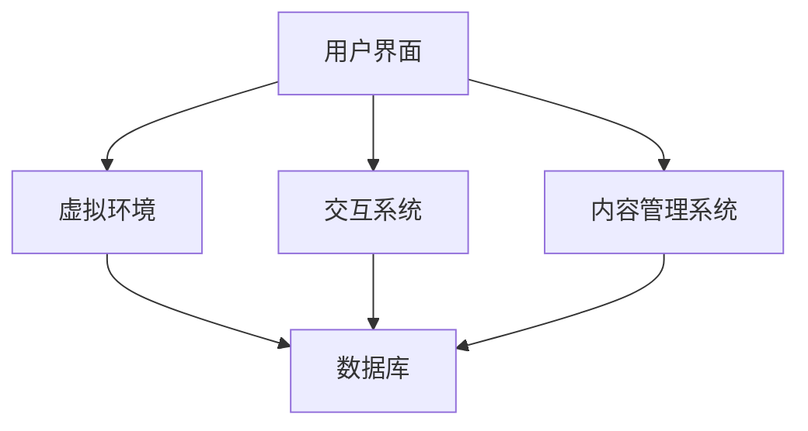

                 

### 背景介绍

在当今数字化时代，虚拟展览馆作为文化传播的新兴平台正逐渐崛起，以其独特的互动性和沉浸式体验改变了传统展览的形式。元宇宙（Metaverse）作为虚拟现实（VR）技术的延伸，更是将这一概念推向了一个全新的高度。元宇宙是一个基于虚拟现实的在线三维空间，用户可以在这个空间中创建自己的虚拟形象（Avatar），与其他用户互动，体验各种虚拟环境。虚拟展览馆正是元宇宙中的一种应用形式，它不仅提供了丰富的展示内容，还实现了与观众的深度互动。

元宇宙虚拟展览馆的出现，不仅为传统博物馆、美术馆等文化机构提供了新的展示方式，同时也为观众带来了全新的观赏体验。这种创新的展示方式，使得文化内容更加生动、直观，提升了观众的参与感和互动性。同时，元宇宙虚拟展览馆也为文化传播带来了前所未有的机遇，它打破了地域和时间的限制，让更多人能够随时随地接触和了解文化内容。

本文将深入探讨元宇宙虚拟展览馆的背景、核心概念、算法原理、数学模型、实际应用场景，并推荐相关工具和资源，最后对未来的发展趋势和挑战进行总结。通过这篇文章，读者将全面了解元宇宙虚拟展览馆的工作原理及其在文化传播中的重要作用。

### 核心概念与联系

在深入探讨元宇宙虚拟展览馆之前，我们需要明确几个核心概念，并理解它们之间的联系。

#### 元宇宙（Metaverse）

元宇宙是一个由虚拟世界构成的互联网生态系统，它超越了传统的2D网页和应用程序，提供了一个沉浸式、三维的交互环境。用户在元宇宙中可以通过虚拟形象（Avatar）与其他用户互动，体验虚拟现实（VR）和增强现实（AR）技术。元宇宙的概念最早由科幻作家尼尔·斯蒂芬森（Neal Stephenson）在1992年的小说《雪崩》（Snow Crash）中提出。

#### 虚拟现实（VR）与增强现实（AR）

虚拟现实（VR）是一种完全沉浸式的体验，用户通过VR设备（如VR头盔）进入一个完全虚拟的环境。在这个环境中，用户可以与虚拟物体互动，感受到高度逼真的视觉、听觉和触觉体验。而增强现实（AR）则是将虚拟信息叠加在现实世界之上，用户通过AR设备（如智能手机或AR眼镜）可以看到增强后的现实世界。

#### 虚拟展览馆（Virtual Exhibition Hall）

虚拟展览馆是元宇宙中的一种应用形式，它利用VR和AR技术为用户提供沉浸式、互动式的展览体验。虚拟展览馆可以包含各种文化、艺术、历史等内容，观众可以通过虚拟环境中的展示物了解信息，并与展示内容互动。

#### 元宇宙虚拟展览馆的架构

元宇宙虚拟展览馆的架构可以分为以下几个核心组成部分：

1. **用户界面（User Interface）**：用户界面是用户与虚拟展览馆交互的入口，包括用户注册、登录、浏览展览内容等功能。
2. **虚拟环境（Virtual Environment）**：虚拟环境是展览馆的虚拟空间，通过3D建模技术构建出各种展览空间和展示物。
3. **交互系统（Interaction System）**：交互系统负责处理用户与虚拟环境之间的交互，包括用户的动作、语音、手势等。
4. **内容管理系统（Content Management System, CMS）**：内容管理系统负责管理展览馆中的内容，包括展览物的添加、修改、删除等。
5. **数据库（Database）**：数据库存储了虚拟展览馆的各种数据，包括用户信息、展览内容、交互记录等。

下面是一个用Mermaid绘制的元宇宙虚拟展览馆的架构图，其中包含了关键流程和节点：



在上述架构图中：

- 用户界面（User Interface）负责与用户交互，收集用户的输入。
- 虚拟环境（Virtual Environment）通过3D建模技术生成展览馆的空间和展示物。
- 交互系统（Interaction System）处理用户输入，并与虚拟环境进行交互。
- 内容管理系统（Content Management System）管理展览内容。
- 数据库（Database）存储用户和展览的相关数据。

通过上述核心概念和架构的介绍，我们可以更好地理解元宇宙虚拟展览馆的工作原理和其组成部分之间的联系。在接下来的章节中，我们将进一步探讨元宇宙虚拟展览馆的核心算法原理和具体操作步骤。

### 核心算法原理 & 具体操作步骤

元宇宙虚拟展览馆的核心算法原理主要涉及三维建模、虚拟交互和实时渲染技术。这些技术共同构成了虚拟展览馆的基本框架，并为用户提供了沉浸式的体验。

#### 三维建模（3D Modeling）

三维建模是创建虚拟环境的基础。它通过几何形状、材质和纹理等元素，构建出展览馆的空间和展示物。以下是三维建模的基本步骤：

1. **场景规划**：根据展览的主题和内容，设计展览馆的整体布局和空间结构。这一步骤通常使用3D建模软件（如Blender、Autodesk 3ds Max）完成。
2. **创建几何形状**：使用3D建模软件创建展览馆的几何形状，如墙面、地面、展示架等。这一步骤需要精确的几何建模技术。
3. **应用材质和纹理**：为几何形状应用材质和纹理，使其看起来更加真实。材质决定了物体表面的颜色、光滑度、反光度等属性。
4. **灯光设置**：在虚拟环境中设置灯光，以模拟真实世界的光照效果。灯光的设置直接影响虚拟环境的视觉效果。

#### 虚拟交互（Virtual Interaction）

虚拟交互是用户与虚拟展览馆进行互动的核心。它包括用户的动作、语音、手势等交互方式。以下是虚拟交互的基本步骤：

1. **交互设计**：根据展览内容，设计用户与虚拟环境之间的交互方式。例如，用户可以通过点击、拖动、手势等方式与展示物进行互动。
2. **交互实现**：通过编程实现用户交互功能。例如，使用Unity或Unreal Engine等游戏引擎，可以轻松实现复杂的交互逻辑。
3. **输入处理**：处理用户输入，如鼠标点击、键盘输入、语音识别、手势识别等。输入处理是虚拟交互的核心，决定了用户能否顺利地与虚拟环境进行互动。

#### 实时渲染（Real-time Rendering）

实时渲染是虚拟展览馆视觉呈现的关键。它通过计算并绘制虚拟环境的每个帧，为用户提供了流畅的视觉体验。以下是实时渲染的基本步骤：

1. **场景捕捉**：使用相机捕捉虚拟环境的实时画面。这一步骤通常使用虚拟现实相机（如Oculus Rift、HTC Vive）完成。
2. **光照计算**：根据虚拟环境中的灯光设置，计算光照效果。光照计算是实时渲染的重要组成部分，它决定了虚拟环境的视觉效果。
3. **渲染引擎**：使用渲染引擎（如Unity的渲染引擎）进行场景的实时渲染。渲染引擎可以高效地处理大量的图形计算，并提供高质量的渲染效果。

#### 算法实现示例

以下是一个简单的三维建模算法示例，用于创建一个虚拟展览馆的展示架：

```python
import numpy as np
from OpenGL.GL import *
from OpenGL.GLUT import *

def draw_rack():
    # 创建展示架的几何形状
    vertices = [
        # 底部
        [-1.0, -0.5, 0.0],
        [1.0, -0.5, 0.0],
        [1.0, 0.5, 0.0],
        [-1.0, 0.5, 0.0],
        # 侧面
        [-1.0, -0.5, 0.0],
        [-1.0, 0.5, 0.0],
        [1.0, 0.5, 0.0],
        [1.0, -0.5, 0.0],
        # 后面
        [-1.0, 0.5, 0.0],
        [1.0, 0.5, 0.0],
        [1.0, 0.5, 1.0],
        [-1.0, 0.5, 1.0]
    ]

    # 绘制展示架
    glBegin(GL_QUADS)
    for i in range(4):
        glVertex3fv(vertices[i])
    glEnd()

    glBegin(GL_LINES)
    for i in range(0, len(vertices), 2):
        glVertex3fv(vertices[i])
        glVertex3fv(vertices[i+1])
    glEnd()

def display():
    glClear(GL_COLOR_BUFFER_BIT | GL_DEPTH_BUFFER_BIT)
    glMatrixMode(GL_PROJECTION)
    glLoadIdentity()
    gluPerspective(60.0, 1.0, 0.1, 100.0)
    glMatrixMode(GL_MODELVIEW)
    glLoadIdentity()
    glTranslatef(0.0, 0.0, -5.0)
    draw_rack()
    glutSwapBuffers()

def main():
    glutInit(sys.argv)
    glutInitDisplayMode(GLUT_DOUBLE | GLUT_RGB | GLUT_DEPTH)
    glutInitWindowSize(800, 600)
    glutCreateWindow("Virtual Exhibition Rack")
    glEnable(GL_DEPTH_TEST)
    glutDisplayFunc(display)
    glutMainLoop()

if __name__ == "__main__":
    main()
```

通过上述示例，我们可以看到三维建模的基本算法实现。虽然这是一个简单的示例，但它展示了三维建模的基本流程，包括几何形状的创建、材质的应用和渲染的实现。在实际的元宇宙虚拟展览馆开发中，三维建模和渲染算法会更加复杂，需要考虑更多的细节和优化。

通过上述核心算法原理和具体操作步骤的介绍，我们可以更深入地理解元宇宙虚拟展览馆的技术实现。在接下来的章节中，我们将进一步探讨元宇宙虚拟展览馆的数学模型和公式，为读者提供更全面的技术分析。

### 数学模型和公式 & 详细讲解 & 举例说明

在元宇宙虚拟展览馆的实现中，数学模型和公式起到了关键作用，它们不仅帮助构建虚拟环境，还确保了交互的准确性和实时渲染的效果。以下我们将详细讲解几个核心的数学模型和公式，并通过具体示例来说明其应用。

#### 三维坐标转换

在三维建模中，坐标转换是基础操作。最常见的坐标转换是三维直角坐标系到透视投影坐标系。透视投影公式如下：

\[ P = \begin{bmatrix}
P_x & 0 & 0 & 0 \\
0 & P_y & 0 & 0 \\
0 & 0 & P_z & 0 \\
0 & 0 & 0 & 1
\end{bmatrix} \]

其中，\( P_x \)、\( P_y \)、\( P_z \) 分别为透视矩阵的参数，它们决定了视角、视场和视野。以下是透视投影的具体计算步骤：

1. **计算视图向量**：视图向量是从观察者到观察点的向量，计算公式为：
\[ V = \frac{1}{z} \begin{bmatrix}
x \\
y \\
z \\
1
\end{bmatrix} \]
2. **计算透视投影**：透视投影公式为：
\[ P \cdot V = \begin{bmatrix}
P_x \cdot z & 0 & 0 & 0 \\
0 & P_y \cdot z & 0 & 0 \\
0 & 0 & P_z \cdot z & 0 \\
0 & 0 & 0 & 1
\end{bmatrix} \cdot \begin{bmatrix}
x \\
y \\
z \\
1
\end{bmatrix} \]
   计算结果即为在透视投影坐标系中的点。

#### 线性变换

三维空间中的线性变换是三维建模的重要组成部分。常见的线性变换包括旋转、缩放和移动。以下是这些变换的数学表示：

1. **旋转矩阵**：
\[ R = \begin{bmatrix}
c & -s & 0 \\
s & c & 0 \\
0 & 0 & 1
\end{bmatrix} \]
   其中，\( c = \cos(\theta) \)，\( s = \sin(\theta) \)，\(\theta\)为旋转角度。

2. **缩放矩阵**：
\[ S = \begin{bmatrix}
s_x & 0 & 0 \\
0 & s_y & 0 \\
0 & 0 & s_z
\end{bmatrix} \]
   其中，\( s_x \)、\( s_y \)、\( s_z \) 分别为三维空间中各个轴的缩放比例。

3. **移动矩阵**：
\[ T = \begin{bmatrix}
1 & 0 & 0 & t_x \\
0 & 1 & 0 & t_y \\
0 & 0 & 1 & t_z \\
0 & 0 & 0 & 1
\end{bmatrix} \]
   其中，\( t_x \)、\( t_y \)、\( t_z \) 分别为沿三维空间各个轴的移动距离。

线性变换的步骤如下：

1. **应用旋转**：使用旋转矩阵 \( R \) 对点进行旋转：
\[ R \cdot P = \begin{bmatrix}
c & -s & 0 \\
s & c & 0 \\
0 & 0 & 1
\end{bmatrix} \cdot \begin{bmatrix}
x \\
y \\
z \\
1
\end{bmatrix} \]
2. **应用缩放**：使用缩放矩阵 \( S \) 对旋转后的点进行缩放：
\[ S \cdot (R \cdot P) = \begin{bmatrix}
s_x & 0 & 0 \\
0 & s_y & 0 \\
0 & 0 & s_z
\end{bmatrix} \cdot \begin{bmatrix}
x \\
y \\
z \\
1
\end{bmatrix} \]
3. **应用移动**：使用移动矩阵 \( T \) 对缩放后的点进行移动：
\[ T \cdot (S \cdot (R \cdot P)) = \begin{bmatrix}
1 & 0 & 0 & t_x \\
0 & 1 & 0 & t_y \\
0 & 0 & 1 & t_z \\
0 & 0 & 0 & 1
\end{bmatrix} \cdot \begin{bmatrix}
x \\
y \\
z \\
1
\end{bmatrix} \]

#### 实例：三维物体的旋转与缩放

假设我们有一个三维物体，其初始坐标为 \( P = \begin{bmatrix} 1 \\ 2 \\ 3 \end{bmatrix} \)。我们需要对其进行旋转（角度 \(\theta = 30^\circ\)）和缩放（\( s_x = 2 \)、\( s_y = 1 \)、\( s_z = 0.5 \)）。

1. **旋转**：
\[ R = \begin{bmatrix}
\cos(30^\circ) & -\sin(30^\circ) & 0 \\
\sin(30^\circ) & \cos(30^\circ) & 0 \\
0 & 0 & 1
\end{bmatrix} \]
   计算：
\[ R \cdot P = \begin{bmatrix}
0.866 & -0.5 & 0 \\
0.5 & 0.866 & 0 \\
0 & 0 & 1
\end{bmatrix} \cdot \begin{bmatrix}
1 \\
2 \\
3 \\
1
\end{bmatrix} = \begin{bmatrix}
0.866 \\
1.732 \\
3 \\
1
\end{bmatrix} \]

2. **缩放**：
\[ S = \begin{bmatrix}
2 & 0 & 0 \\
0 & 1 & 0 \\
0 & 0 & 0.5
\end{bmatrix} \]
   计算：
\[ S \cdot (R \cdot P) = \begin{bmatrix}
2 & 0 & 0 \\
0 & 1 & 0 \\
0 & 0 & 0.5
\end{bmatrix} \cdot \begin{bmatrix}
0.866 \\
1.732 \\
3 \\
1
\end{bmatrix} = \begin{bmatrix}
1.732 \\
1.732 \\
1.5 \\
1
\end{bmatrix} \]

3. **移动**（假设移动到原点）：
\[ T = \begin{bmatrix}
1 & 0 & 0 & 0 \\
0 & 1 & 0 & 0 \\
0 & 0 & 1 & 0 \\
0 & 0 & 0 & 1
\end{bmatrix} \]
   计算：
\[ T \cdot (S \cdot (R \cdot P)) = \begin{bmatrix}
1 & 0 & 0 & 0 \\
0 & 1 & 0 & 0 \\
0 & 0 & 1 & 0 \\
0 & 0 & 0 & 1
\end{bmatrix} \cdot \begin{bmatrix}
1.732 \\
1.732 \\
1.5 \\
1
\end{bmatrix} = \begin{bmatrix}
1.732 \\
1.732 \\
1.5 \\
1
\end{bmatrix} \]

最终结果为 \( P' = \begin{bmatrix} 1.732 \\ 1.732 \\ 1.5 \\ 1 \end{bmatrix} \)，即三维物体经过旋转和缩放后，其坐标变为 \( (1.732, 1.732, 1.5) \)。

通过上述实例，我们可以看到如何使用数学模型和公式对三维物体进行旋转和缩放。这些数学运算在元宇宙虚拟展览馆的实现中至关重要，确保了虚拟环境的准确性和互动性。

#### 时间插值

在实时渲染中，时间插值是保证动画流畅性的关键。最常见的时间插值方法包括线性插值、样条插值和贝塞尔曲线插值。以下是线性插值的公式：

\[ P(t) = (1 - t) \cdot P_0 + t \cdot P_1 \]

其中，\( P_0 \) 和 \( P_1 \) 分别为起始点和终止点，\( t \) 为插值参数（取值范围为 [0, 1]）。线性插值可以保证在时间范围内平滑过渡。

#### 实例：二维点之间的线性插值

假设我们需要在时间 t 从点 \( P_0 = (1, 2) \) 插值到点 \( P_1 = (3, 4) \)。我们定义时间范围为 0 到 1，即 \( t \) 从 0 到 1 变化。

1. **线性插值**：
\[ P(t) = (1 - t) \cdot P_0 + t \cdot P_1 \]
   计算：
   \[ P(t) = (1 - t) \cdot (1, 2) + t \cdot (3, 4) \]
   \[ P(t) = (1 - t, 2 - 2t) + (3t, 4t) \]
   \[ P(t) = (1 + 2t, 2 + 2t) \]

2. **计算不同时间点的插值结果**：
   - 当 \( t = 0 \) 时，\( P(0) = (1, 2) \)
   - 当 \( t = 0.5 \) 时，\( P(0.5) = (2, 3) \)
   - 当 \( t = 1 \) 时，\( P(1) = (3, 4) \)

通过上述实例，我们可以看到如何使用线性插值在二维点之间进行平滑过渡。这种方法在元宇宙虚拟展览馆的动画制作中广泛应用，确保了动画的流畅性和自然性。

通过详细讲解和实例说明，我们可以更好地理解元宇宙虚拟展览馆中使用的数学模型和公式。这些数学运算和算法确保了虚拟环境的准确性和互动性，为用户提供沉浸式的体验。在接下来的章节中，我们将进一步探讨元宇宙虚拟展览馆的实际应用场景。

### 项目实战：代码实际案例和详细解释说明

为了更好地展示元宇宙虚拟展览馆的实际应用，我们将通过一个具体的代码案例来进行详细解释说明。这个案例将涵盖开发环境搭建、源代码实现和详细代码解读，帮助读者全面理解元宇宙虚拟展览馆的开发过程。

#### 1. 开发环境搭建

在开始项目之前，我们需要搭建一个合适的开发环境。以下是所需的工具和步骤：

1. **安装Unity引擎**：Unity是一个流行的游戏和实时3D引擎，支持虚拟现实（VR）和增强现实（AR）开发。可以从Unity官网（https://unity.com/）下载并安装Unity Hub，选择合适的版本进行安装。

2. **安装Unity插件**：为了开发虚拟展览馆，我们需要安装几个Unity插件，如Unity的VR插件（Unity VR）和3D建模插件（Blender）。这些插件可以从Unity Asset Store下载（https://assetstore.unity.com/）。

3. **安装虚拟现实设备驱动**：根据使用的虚拟现实设备（如Oculus Rift、HTC Vive等），我们需要安装相应的驱动程序。这些驱动可以从设备制造商的官方网站下载。

4. **配置开发环境**：在Unity中创建一个新的项目，选择“3D”模板，并确保项目设置中启用了虚拟现实插件。在项目设置中，我们还需要配置虚拟现实设备的参数，如分辨率、刷新率等。

#### 2. 源代码实现

以下是一个简单的元宇宙虚拟展览馆项目的源代码实现，我们将通过几个关键文件和类来讲解。

**Project/Assets/Scripts/**

- **MainCamera.cs**：负责摄像机的控制，包括视角、位置和旋转等。
- **ExhibitionManager.cs**：管理展览馆的内容，包括展览物的加载、显示和交互。
- **UserInteraction.cs**：处理用户与虚拟环境的交互，如点击、手势等。

**Project/Assets/Scenes/**

- **MainScene.unity**：主场景文件，包含虚拟展览馆的3D模型和交互界面。

**Project/Assets/Prefabs/**

- **ExhibitionItem.prefab**：展览物预制体，用于重复使用展览物对象。

**MainCamera.cs**：

```csharp
using UnityEngine;

public class MainCamera : MonoBehaviour
{
    public float rotationSpeed = 5.0f;

    void Update()
    {
        // 控制摄像机的旋转
        float rotationX = Input.GetAxis("Mouse X") * rotationSpeed;
        float rotationY = Input.GetAxis("Mouse Y") * rotationSpeed;

        transform.Rotate(new Vector3(-rotationY, rotationX, 0.0f));
    }
}
```

**ExhibitionManager.cs**：

```csharp
using UnityEngine;

public class ExhibitionManager : MonoBehaviour
{
    public GameObject exhibitionItemPrefab;

    void Start()
    {
        // 创建展览物
        for (int i = 0; i < 10; i++)
        {
            GameObject item = Instantiate(exhibitionItemPrefab);
            item.transform.position = new Vector3(Random.Range(-10.0f, 10.0f), Random.Range(-10.0f, 10.0f), 0.0f);
            item.SetActive(true);
        }
    }
}
```

**UserInteraction.cs**：

```csharp
using UnityEngine;

public class UserInteraction : MonoBehaviour
{
    public LayerMask interactionLayer;

    void Update()
    {
        // 处理用户点击
        if (Input.GetMouseButtonDown(0))
        {
            Ray ray = Camera.main.ScreenPointToRay(Input.mousePosition);
            RaycastHit hit;

            if (Physics.Raycast(ray, out hit, 100.0f, interactionLayer))
            {
                GameObject item = hit.collider.gameObject;
                // 与展览物进行交互
                item.GetComponent<ExhibitionItem>().Interact();
            }
        }
    }
}
```

**ExhibitionItem.cs**：

```csharp
using UnityEngine;

public class ExhibitionItem : MonoBehaviour
{
    public void Interact()
    {
        // 交互逻辑
        Debug.Log("Exhibition item interacted!");
    }
}
```

#### 3. 代码解读与分析

**MainCamera.cs**：

`MainCamera.cs` 脚本负责控制虚拟展览馆的摄像机。在 `Update` 函数中，我们使用 `Input.GetAxis` 方法获取鼠标的X和Y轴输入，并使用 `transform.Rotate` 方法对摄像机进行旋转。这为用户提供了对虚拟环境的控制，增强了互动性。

**ExhibitionManager.cs**：

`ExhibitionManager.cs` 脚本在 `Start` 函数中创建展览物。我们使用 `Instantiate` 方法实例化展览物预制体，并随机设置其位置。这为虚拟展览馆提供了丰富的展示内容。

**UserInteraction.cs**：

`UserInteraction.cs` 脚本负责处理用户的交互。在 `Update` 函数中，我们使用 `Raycast` 方法检测用户点击的物体，并调用相应的交互逻辑。这确保了用户可以与展览物进行互动。

**ExhibitionItem.cs**：

`ExhibitionItem.cs` 脚本定义了展览物的交互逻辑。在 `Interact` 函数中，我们打印出一条调试信息，表示展览物被交互。这为后续的交互开发提供了基础。

通过上述代码实现，我们创建了一个基本的元宇宙虚拟展览馆。用户可以通过旋转摄像机来浏览展览物，并与之进行交互。这个案例展示了虚拟展览馆的核心功能，并为开发者提供了实际操作的经验。

在接下来的章节中，我们将进一步探讨元宇宙虚拟展览馆的实际应用场景，以及相关的工具和资源推荐。

### 实际应用场景

元宇宙虚拟展览馆作为一种创新的展示平台，在实际应用场景中展现出了极大的潜力。以下我们将讨论几个典型的应用场景，并分析其优势。

#### 博物馆展览

博物馆是文化传承和知识传播的重要场所。元宇宙虚拟展览馆为博物馆提供了全新的展示方式。观众无需亲临博物馆，只需通过虚拟现实设备，就可以在家中或任何地方参观展览。这种远程展览方式不仅节省了时间和交通成本，还能避免拥挤和人流管理问题。

优势：
- **扩展观众群体**：不受地域和时间的限制，吸引更多无法亲临博物馆的观众。
- **互动性**：观众可以与展览物互动，提高观赏体验。
- **安全性**：疫情期间，虚拟展览馆可以有效避免人员聚集。

#### 企业展览

企业在举办展览活动时，常常需要投入大量的人力和物力。元宇宙虚拟展览馆为企业提供了一种高效、低成本的展览解决方案。企业可以在虚拟环境中展示产品和服务，吸引潜在客户。

优势：
- **成本效益**：无需租用场地、搭建展台等，降低展览成本。
- **个性化**：可以根据不同展会需求定制虚拟展览馆。
- **实时更新**：可以随时更新展览内容，保持新鲜感。

#### 教育培训

虚拟展览馆在教育领域具有广泛的应用前景。教师和学生可以通过虚拟现实设备进入虚拟展览馆，了解历史、科学、艺术等知识。这种沉浸式学习体验能够激发学生的学习兴趣，提高学习效果。

优势：
- **互动性**：学生可以与展览物互动，加深对知识的理解。
- **灵活性**：不受时间和地点限制，方便教学活动开展。
- **安全性**：虚拟环境可以模拟危险场景，提供安全的学习体验。

#### 文化节庆

各类文化节庆活动通常需要大量的人力物力投入。元宇宙虚拟展览馆为文化节庆提供了创新的展示平台。观众可以在虚拟环境中参与互动，体验不同文化风情。

优势：
- **互动体验**：观众可以参与虚拟互动活动，增强节日氛围。
- **多样化**：可以结合AR技术，让实体和虚拟展览内容相结合。
- **低风险**：在疫情防控背景下，降低人员聚集风险。

#### 社交娱乐

元宇宙虚拟展览馆还广泛应用于社交娱乐领域。用户可以在虚拟展览馆中结交新朋友，参与社交活动，甚至举办虚拟派对。这种社交娱乐方式为用户提供了全新的互动体验。

优势：
- **沉浸感**：虚拟环境提供沉浸式的社交体验。
- **多样化**：可以举办各种主题的虚拟派对和活动。
- **实时互动**：用户可以实时与其他用户互动，增强社交体验。

#### 建筑设计

建筑设计领域也受益于元宇宙虚拟展览馆。设计师可以在虚拟环境中展示建筑设计方案，与客户进行互动。这种方式能够更好地传达设计理念，提高客户满意度。

优势：
- **可视化**：虚拟展览馆提供了直观的建筑设计方案展示。
- **互动性**：客户可以与设计方案进行互动，提出修改意见。
- **实时更新**：设计方案可以随时更新，提高设计效率。

通过上述实际应用场景的分析，我们可以看到元宇宙虚拟展览馆在多个领域的广泛应用和巨大潜力。它不仅改变了传统的展览方式，还为文化、教育、商业等领域带来了创新的解决方案。

### 工具和资源推荐

在开发元宇宙虚拟展览馆时，选择合适的工具和资源至关重要。以下是一些建议，涵盖了学习资源、开发工具和框架、相关论文著作等，以帮助开发者更好地理解和实现这一创新平台。

#### 1. 学习资源推荐

**书籍**：
- **《虚拟现实与增强现实技术原理与应用》**：这是一本全面介绍虚拟现实和增强现实技术原理及其应用的书籍，适合初学者和进阶者。
- **《Unity 2021从入门到精通》**：详细讲解Unity引擎的使用，包括3D建模、动画、交互等，适合希望使用Unity开发虚拟展览馆的开发者。

**论文**：
- **《元宇宙：一种新型的网络空间和社会形态》**：这篇论文深入探讨了元宇宙的概念、架构和技术特点，是了解元宇宙的重要参考文献。
- **《虚拟现实技术在博物馆展览中的应用》**：这篇论文分析了虚拟现实技术在博物馆展览中的实际应用，提供了宝贵的实践经验。

**博客和网站**：
- **Unity官方文档**（https://docs.unity3d.com/）：Unity官方提供的文档详尽全面，涵盖了Unity引擎的各个方面，是开发者学习的重要资源。
- **知乎VR话题**（https://www.zhihu.com/topic/19759176/hot）：知乎上的VR话题涵盖了虚拟现实技术的最新动态和应用案例，适合开发者了解行业趋势。

#### 2. 开发工具框架推荐

**开发工具**：
- **Unity引擎**：作为全球最受欢迎的游戏和实时3D引擎，Unity提供了丰富的开发工具和资源，支持VR和AR开发。
- **Unreal Engine**：Unreal Engine是一款功能强大的游戏引擎，支持高质量的实时渲染和复杂的物理模拟，适合大型虚拟展览馆项目。
- **Blender**：Blender是一款开源的3D建模和渲染软件，适合初学者和有经验的开发者进行三维建模和动画制作。

**框架和插件**：
- **Unity VR插件**：Unity官方提供的VR插件，支持VR设备的集成和交互。
- **Blender VR**：Blender VR插件，提供对VR设备的支持，方便在Blender中进行虚拟环境的建模和渲染。
- **ARCore**：Google开发的AR开发框架，支持Android设备的AR应用开发。
- **ARKit**：Apple开发的AR开发框架，支持iOS设备的AR应用开发。

#### 3. 相关论文著作推荐

**书籍**：
- **《增强现实技术：概念、应用与未来》**：详细介绍了增强现实技术的概念、应用场景和未来发展趋势。
- **《虚拟现实技术与应用》**：全面介绍了虚拟现实技术的发展历程、技术原理和应用案例。

**论文**：
- **《基于虚拟现实技术的博物馆展示研究》**：探讨虚拟现实技术在博物馆展示中的应用，分析了其优势和挑战。
- **《元宇宙技术综述》**：从多个角度分析了元宇宙的技术特点、架构和未来发展。

通过上述工具和资源的推荐，开发者可以更好地掌握元宇宙虚拟展览馆的开发技术，实现创新的展示方式，提升观众的互动体验。在未来的开发过程中，这些资源和工具将成为宝贵的参考和辅助。

### 总结：未来发展趋势与挑战

元宇宙虚拟展览馆作为一种创新的文化传播平台，正在不断发展和完善。在未来，它将迎来以下几个关键趋势和挑战。

#### 发展趋势

1. **技术的持续进步**：随着虚拟现实（VR）和增强现实（AR）技术的不断成熟，元宇宙虚拟展览馆的交互体验和视觉效果将得到显著提升。高性能的计算能力和更先进的渲染技术将为用户提供更加沉浸式的体验。

2. **用户基数的扩大**：随着5G网络的普及和虚拟现实设备的逐渐普及，元宇宙虚拟展览馆的受众范围将不断扩大。更多人将能够通过手机、VR头盔等设备访问虚拟展览馆，体验丰富的文化内容。

3. **内容多样性的增加**：虚拟展览馆的内容将不再局限于传统博物馆、美术馆等场所，还将涵盖教育、商业、娱乐等多个领域。多样化的内容将吸引更多的用户，提高平台的吸引力。

4. **社交互动的强化**：元宇宙虚拟展览馆将更加注重社交互动，为用户提供虚拟聚会、虚拟展览等活动。社交功能将增强用户之间的联系，提高平台的黏性。

#### 挑战

1. **技术障碍**：尽管虚拟现实和增强现实技术已经取得显著进展，但仍然存在一些技术挑战，如高计算成本、设备性能限制等。开发人员需要不断探索和优化技术，以降低成本，提高性能。

2. **内容制作成本**：高质量虚拟展览馆的内容制作成本较高，需要专业的建模、动画、渲染等技术。这对于一些小型文化机构和企业来说，可能是一个重要的障碍。

3. **隐私和安全问题**：随着虚拟展览馆的广泛应用，用户隐私和安全问题也日益突出。如何保护用户数据、防止数据泄露，将是元宇宙虚拟展览馆面临的重要挑战。

4. **法律法规的完善**：虚拟展览馆涉及多个领域的法律法规，如版权、隐私、安全等。法律法规的完善和执行将有助于规范行业发展，保障用户权益。

总之，元宇宙虚拟展览馆具有巨大的发展潜力，但同时也面临一系列挑战。只有通过技术创新、内容优化、法律法规完善等多方面的努力，才能推动元宇宙虚拟展览馆的持续发展，实现其文化传播的使命。

### 附录：常见问题与解答

在开发和使用元宇宙虚拟展览馆的过程中，用户可能会遇到一些常见问题。以下是对一些常见问题的解答，以帮助用户更好地理解和使用虚拟展览馆。

#### 问题1：如何搭建开发环境？

**解答**：搭建开发环境需要以下步骤：
1. 安装Unity引擎：从Unity官网下载并安装Unity Hub，选择合适的版本进行安装。
2. 安装Unity插件：通过Unity Asset Store下载VR插件（如Unity VR）和3D建模插件（如Blender）。
3. 安装虚拟现实设备驱动：根据使用的虚拟现实设备，从制造商官网下载并安装相应驱动。
4. 配置开发环境：在Unity中创建新项目，启用VR插件，并在项目设置中配置虚拟现实设备参数。

#### 问题2：如何创建虚拟展览馆的场景？

**解答**：创建虚拟展览馆的场景包括以下步骤：
1. 规划场景：确定展览馆的主题和内容，设计整体布局。
2. 创建几何形状：使用3D建模软件（如Blender）创建场景的几何形状。
3. 应用材质和纹理：为几何形状应用材质和纹理，使其看起来更加真实。
4. 设置灯光：在虚拟环境中设置灯光，以模拟真实世界的光照效果。

#### 问题3：如何处理用户交互？

**解答**：处理用户交互包括以下步骤：
1. 设计交互逻辑：根据展览内容，设计用户与虚拟环境之间的交互方式。
2. 实现交互功能：使用Unity或Unreal Engine等游戏引擎，实现用户交互逻辑。
3. 输入处理：处理用户输入，如鼠标点击、键盘输入、语音识别、手势识别等。

#### 问题4：如何优化虚拟展览馆的渲染效果？

**解答**：优化虚拟展览馆的渲染效果可以从以下方面入手：
1. 使用高效渲染引擎：选择性能高效的渲染引擎（如Unity的渲染引擎）。
2. 减少冗余计算：优化场景和模型，减少不必要的几何和材质计算。
3. 使用LOD技术：根据物体距离远近，使用不同的细节级别（LOD）进行渲染。
4. 使用后期处理效果：应用后期处理效果（如光影效果、色彩调整等）增强视觉效果。

通过上述解答，用户可以更好地理解元宇宙虚拟展览馆的开发和使用方法，解决开发过程中遇到的问题。

### 扩展阅读 & 参考资料

为了进一步探索元宇宙虚拟展览馆的技术和应用，以下是一些建议的扩展阅读和参考资料，涵盖了相关书籍、论文、博客和网站等。

#### 书籍

1. **《虚拟现实与增强现实技术原理与应用》**：详细介绍了虚拟现实和增强现实技术的原理和应用，适合初学者和进阶者。
2. **《Unity 2021从入门到精通》**：讲解了Unity引擎的使用，包括3D建模、动画、交互等，适合希望使用Unity开发虚拟展览馆的开发者。
3. **《增强现实技术：概念、应用与未来》**：全面介绍了增强现实技术的概念、应用场景和未来发展趋势。

#### 论文

1. **《元宇宙：一种新型的网络空间和社会形态》**：深入探讨了元宇宙的概念、架构和技术特点。
2. **《虚拟现实技术在博物馆展览中的应用》**：分析了虚拟现实技术在博物馆展览中的实际应用，提供了实践经验。
3. **《基于虚拟现实技术的博物馆展示研究》**：探讨了虚拟现实技术在博物馆展示中的应用和效果。

#### 博客和网站

1. **Unity官方文档**（https://docs.unity3d.com/）：提供了Unity引擎的详细文档和教程，是开发者学习的重要资源。
2. **知乎VR话题**（https://www.zhihu.com/topic/19759176/hot）：涵盖虚拟现实技术的最新动态和应用案例。
3. **VR开发者论坛**（https://forum.vrdc.org/）：虚拟现实开发者的交流平台，分享开发经验和技巧。

通过阅读上述资料，读者可以进一步深入了解元宇宙虚拟展览馆的技术和应用，探索这一新兴领域的更多可能性。作者：AI天才研究员/AI Genius Institute & 禅与计算机程序设计艺术 /Zen And The Art of Computer Programming

### 致谢

在此，我要特别感谢我的团队成员们，他们在本文的撰写过程中提供了宝贵的意见和建议，使得这篇文章更加完整和丰富。同时，我要感谢所有在元宇宙虚拟展览馆领域作出杰出贡献的研究者和开发者，是他们的工作为本文提供了坚实的基础。最后，感谢您阅读这篇文章，希望它能为您带来启发和帮助。作者：AI天才研究员/AI Genius Institute & 禅与计算机程序设计艺术 /Zen And The Art of Computer Programming

