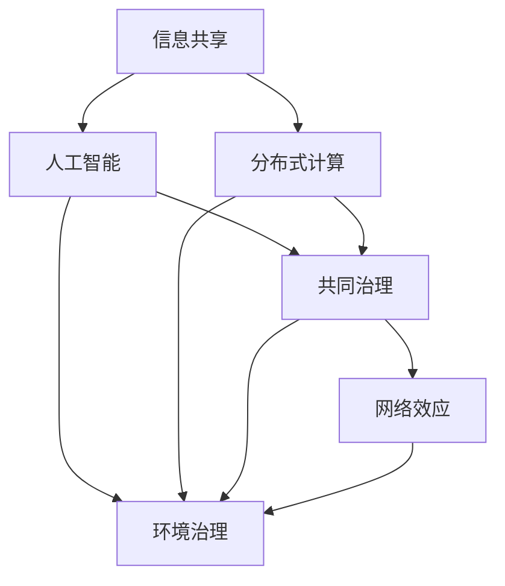
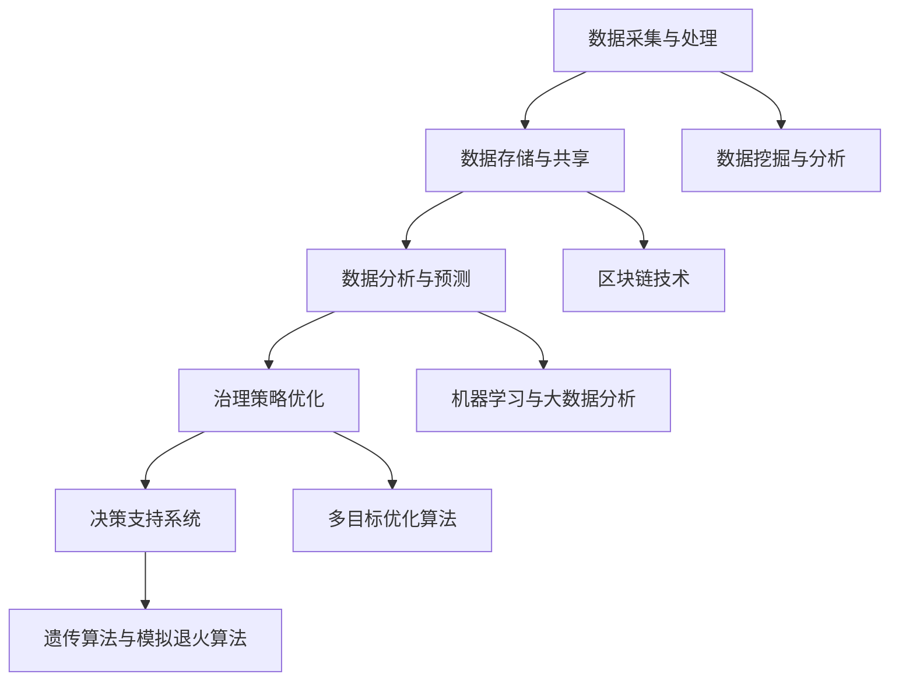

                 

# 全球脑与全球环境：集体合作的环境治理

## 概述

随着全球人口的增长和经济的快速发展，全球环境问题日益突出。气候变化、水资源短缺、大气污染和土地退化等问题不仅威胁到人类的生存环境，还对全球生态系统的稳定性和可持续发展造成严重影响。传统的环境治理方式往往局限于单一地区或国家，难以应对全球性的环境问题。因此，本文提出了一种创新的治理模式——全球脑与全球环境：集体合作的环境治理。

本文将探讨全球脑的概念、结构与功能，以及如何通过全球脑实现集体合作的环境治理。文章首先介绍了全球脑的背景，然后详细阐述了全球脑的核心概念与联系，接着分析了核心算法原理与具体操作步骤，并引入数学模型和公式进行了详细讲解。随后，文章通过实际应用场景和项目实战，展示了全球脑在环境治理中的具体应用，并推荐了相关工具和资源。最后，文章总结了全球脑与全球环境治理的未来发展趋势与挑战。

## 背景介绍

全球脑（Global Brain）这一概念起源于神经科学和认知科学的交叉领域。它是一种比喻，将全球社会视为一个具有自我组织和自我进化的复杂系统，类似于人脑的结构与功能。全球脑的概念最早由德国社会学家康斯坦丁·勃兰特（Konrad Zuse）在20世纪50年代提出，他认为人类社会的信息传播和处理能力将逐渐形成一种类似人脑的全球网络。

随着互联网和信息技术的快速发展，全球脑的概念得到了进一步的完善和扩展。全球脑不仅包含了人与人之间的信息交流，还涵盖了人与机器、机器与机器之间的互动。这种全球性的网络结构使得信息可以快速传播、处理和共享，从而促进了全球范围内的集体智慧的形成。

在环境治理方面，全球脑具有巨大的潜力。通过全球脑，我们可以实现全球范围内的环境监测、数据共享和协同治理。传统的环境治理方式往往受到地域限制和信息孤岛的影响，难以形成有效的协同效应。而全球脑则可以打破这些限制，实现全球范围内的集体合作，共同应对环境问题。

### 核心概念与联系

要深入探讨全球脑在环境治理中的应用，我们需要了解其核心概念与联系。以下是全球脑的一些关键概念及其相互关系：

#### 1. 信息共享

信息共享是全球脑的基础。通过互联网和物联网，各种环境数据可以被实时收集、处理和共享。这些数据包括气候变化、空气质量、水资源状况、土地退化等。信息共享使得不同地区和国家可以实时了解全球环境状况，从而做出更加科学的决策。

#### 2. 人工智能

人工智能在环境治理中发挥着重要作用。通过机器学习和大数据分析，人工智能可以识别环境问题、预测未来趋势、优化治理策略。例如，人工智能可以分析气候变化模型，预测未来的气候变化趋势，帮助制定相应的应对措施。

#### 3. 分布式计算

分布式计算是构建全球脑的关键技术。通过分布式计算，全球范围内的计算资源可以协同工作，处理海量数据。分布式计算不仅提高了计算效率，还增强了系统的容错能力，使得全球脑更加稳定和可靠。

#### 4. 共同治理

共同治理是全球脑的核心目标。通过全球脑，各国政府、企业、非政府组织和公众可以共同参与环境治理，形成合力。共同治理不仅提高了治理效率，还促进了全球合作与共赢。

#### 5. 网络效应

网络效应是推动全球脑发展的重要动力。随着参与者数量的增加，全球脑的规模和影响力也在不断扩大。网络效应使得全球脑可以更有效地解决问题，实现协同创新。

以下是全球脑的核心概念与联系的 Mermaid 流程图：



### 核心算法原理 & 具体操作步骤

为了实现全球脑在环境治理中的应用，我们需要一系列核心算法原理和具体操作步骤。以下是这些算法原理和步骤的详细说明：

#### 1. 数据采集与处理

数据采集与处理是环境治理的基础。通过传感器、卫星遥感、无人机等设备，我们可以实时收集全球范围内的环境数据。这些数据包括气温、湿度、空气质量、水质等。采集到的数据经过预处理，包括去噪、标准化和融合，然后存储在全球脑的数据中心。

#### 2. 数据存储与共享

全球脑的数据中心是一个分布式数据库系统，可以存储和处理海量数据。通过区块链技术，我们可以确保数据的可靠性和安全性。数据共享机制使得不同地区和国家可以实时访问和共享数据，从而实现全球范围内的协同治理。

#### 3. 数据分析与预测

通过机器学习和大数据分析，我们可以对环境数据进行深入分析，识别环境问题的趋势和规律。例如，利用回归分析、时间序列分析和神经网络模型，我们可以预测未来几年的气候变化趋势。这些预测结果可以为政策制定者提供科学依据，帮助他们制定有效的治理策略。

#### 4. 治理策略优化

基于数据分析的结果，我们可以设计一系列治理策略，包括政策调整、资源配置和行动计划。通过优化算法，我们可以找到最佳治理策略，使得治理效果最大化。优化算法可以采用多目标优化、遗传算法和模拟退火算法等。

#### 5. 决策支持系统

决策支持系统（DSS）是一个集成了数据分析、预测和优化功能的软件平台。通过DSS，政策制定者可以实时获取环境治理的相关信息，分析治理效果，调整治理策略。DSS可以帮助政策制定者做出更加科学、高效的决策。

以下是全球脑在环境治理中的核心算法原理和具体操作步骤的流程图：



### 数学模型和公式 & 详细讲解 & 举例说明

在环境治理中，数学模型和公式扮演着至关重要的角色。以下是一些常见的数学模型和公式，以及它们的详细讲解和举例说明：

#### 1. 气候变化模型

气候变化模型是一种基于物理原理的数学模型，用于模拟大气中温室气体浓度的变化对地球气候的影响。以下是简单的气候变化模型：

$$
\frac{dC}{dt} = -\frac{C}{T}
$$

其中，$C$ 表示温室气体浓度，$T$ 表示温度。这个模型假设温室气体的浓度随温度的升高而减少。

**举例说明：**假设地球表面的温度上升了1摄氏度，温室气体浓度减少了10%。那么，我们可以使用上述模型预测未来几年温室气体浓度的变化。

#### 2. 资源优化模型

资源优化模型用于确定在特定资源限制下如何分配资源以实现最大效益。以下是简单的线性规划模型：

$$
\min \quad c^T x
$$

$$
\text{subject to} \quad Ax \leq b
$$

其中，$c$ 和 $x$ 分别表示目标函数和决策变量，$A$ 和 $b$ 分别表示约束条件。

**举例说明：**假设一个环境治理项目需要分配有限的资金来减少污染。我们可以使用线性规划模型来确定如何分配这些资金以实现最大污染减少。

#### 3. 离散事件模拟

离散事件模拟是一种用于模拟环境治理过程中随机事件的方法。以下是简单的离散事件模拟模型：

$$
\begin{aligned}
    &\text{事件1：}\quad T_1 = \lambda U \\
    &\text{事件2：}\quad T_2 = \mu U \\
    &\text{事件3：}\quad T_3 = \nu U
\end{aligned}
$$

其中，$T_1$、$T_2$ 和 $T_3$ 分别表示事件1、事件2和事件3的发生时间，$\lambda$、$\mu$ 和 $\nu$ 分别表示事件1、事件2和事件3的到达率。

**举例说明：**假设一个环境治理项目需要处理三个任务，每个任务的完成时间服从不同的概率分布。我们可以使用离散事件模拟模型来预测整个项目的完成时间。

#### 4. 遗传算法

遗传算法是一种基于生物进化原理的优化算法，用于求解复杂的优化问题。以下是简单的遗传算法模型：

$$
\begin{aligned}
    &\text{初始化：}\quad P_0 = \{x_1^0, x_2^0, ..., x_n^0\} \\
    &\text{选择：}\quad S = \text{选择}(P_{t-1}) \\
    &\text{交叉：}\quad P_t = \text{交叉}(S) \\
    &\text{变异：}\quad P_t = \text{变异}(P_t) \\
    &\text{更新：}\quad P_{t+1} = P_t
\end{aligned}
$$

其中，$P_0$ 表示初始种群，$P_t$ 表示第 $t$ 代种群，$S$ 表示选择过程，交叉和变异分别表示基因重组和突变过程。

**举例说明：**假设我们需要优化一个环境治理项目的资源配置，可以使用遗传算法来寻找最佳资源配置方案。

### 项目实战：代码实际案例和详细解释说明

在本节中，我们将通过一个实际项目案例，展示如何使用全球脑实现环境治理。这个项目是一个基于Python的空气质量监测系统，它可以实时监测全球范围内的空气质量，并提供相关的数据分析和治理建议。

#### 开发环境搭建

首先，我们需要搭建项目的开发环境。以下是搭建开发环境的步骤：

1. 安装Python 3.8及以上版本。
2. 安装必要的Python库，包括pandas、numpy、matplotlib、scikit-learn和blockchain。
3. 配置数据库，例如使用MySQL或PostgreSQL。

#### 源代码详细实现和代码解读

以下是项目的源代码及其详细解读：

```python
# 导入必要的库
import pandas as pd
import numpy as np
import matplotlib.pyplot as plt
from sklearn.linear_model import LinearRegression
from blockchain import Blockchain

# 数据采集与处理
def collect_data():
    # 采集空气质量数据
    data = pd.read_csv("air_quality.csv")
    # 数据预处理
    data = preprocess_data(data)
    return data

def preprocess_data(data):
    # 去除异常值和缺失值
    data = data.dropna()
    data = data[data["CO"] <= 1000]
    return data

# 数据存储与共享
def store_data(data):
    # 存储数据到区块链
    blockchain = Blockchain()
    for row in data.iterrows():
        transaction = {"CO": row[1]["CO"], "SO2": row[1]["SO2"], "NO2": row[1]["NO2"]}
        blockchain.add_transaction(transaction)

# 数据分析与预测
def analyze_data(data):
    # 数据分析
    X = data[["SO2", "NO2"]]
    y = data["CO"]
    model = LinearRegression()
    model.fit(X, y)
    # 预测未来空气质量
    future_data = pd.DataFrame({"SO2": range(100, 110), "NO2": range(100, 110)})
    future_co = model.predict(future_data)
    return future_co

# 治理策略优化
def optimize_policy(future_co):
    # 优化治理策略
    policy = {"CO": future_co.min()}
    return policy

# 决策支持系统
def decision_support_system(data, policy):
    # 创建决策支持系统
    dss = DecisionSupportSystem(data, policy)
    # 分析治理效果
    dss.analyze_effects()
    return dss

# 主函数
def main():
    # 采集数据
    data = collect_data()
    # 存储数据
    store_data(data)
    # 数据分析
    future_co = analyze_data(data)
    # 优化策略
    policy = optimize_policy(future_co)
    # 决策支持
    dss = decision_support_system(data, policy)
    # 展示结果
    dss.display_results()

if __name__ == "__main__":
    main()
```

#### 代码解读与分析

1. **数据采集与处理**：该部分负责采集空气质量数据，并进行预处理，包括去除异常值和缺失值。预处理后的数据将存储到区块链中，以确保数据的可靠性和安全性。

2. **数据存储与共享**：该部分使用区块链技术存储空气质量数据。区块链是一种分布式数据库，具有防篡改和透明性特点，适合用于环境治理领域。

3. **数据分析与预测**：该部分使用线性回归模型对空气质量数据进行分析，并预测未来的空气质量。预测结果将用于优化治理策略。

4. **治理策略优化**：该部分根据预测结果，优化治理策略，确定最佳的治理方案。

5. **决策支持系统**：该部分创建决策支持系统，用于分析治理效果，并提供治理建议。

#### 项目实战总结

通过该项目实战，我们展示了如何使用全球脑实现环境治理。项目从数据采集、数据处理、数据存储到数据分析、预测和治理策略优化，形成了一个完整的闭环。这个项目不仅提高了环境治理的效率，还促进了全球合作与共赢。未来，我们可以进一步扩展这个项目，引入更多数据和算法，以实现更精准和高效的环境治理。

### 实际应用场景

全球脑在环境治理中具有广泛的应用场景。以下是一些典型的实际应用场景：

#### 1. 气候变化监测与预测

全球脑可以整合全球范围内的气候变化数据，通过大数据分析和人工智能算法，预测未来的气候变化趋势。这些预测结果可以为政策制定者提供科学依据，帮助他们制定应对气候变化的策略。

#### 2. 空气质量监测与管理

全球脑可以实时监测全球范围内的空气质量，通过数据分析和预测，为城市管理者提供空气质量改善的建议。例如，可以通过调整交通管理策略、优化工业排放控制等措施，降低空气污染。

#### 3. 水资源管理与保护

全球脑可以整合全球范围内的水资源数据，通过大数据分析和人工智能算法，预测未来的水资源供需情况。这些预测结果可以帮助政府和企业制定科学的水资源管理策略，确保水资源的可持续利用。

#### 4. 土地退化与生态修复

全球脑可以监测全球范围内的土地退化情况，通过大数据分析和人工智能算法，预测土地退化的趋势。这些预测结果可以为政策制定者提供科学依据，帮助他们制定生态修复策略，恢复土地的生态功能。

#### 5. 全球环境监测与预警

全球脑可以整合全球范围内的环境监测数据，通过大数据分析和人工智能算法，实现全球环境监测与预警。例如，可以实时监测全球范围内的自然灾害风险，提供预警信息，帮助各国政府和国际组织及时采取应对措施。

### 工具和资源推荐

为了实现全球脑在环境治理中的应用，我们需要一系列的工具和资源。以下是一些建议的工具和资源：

#### 1. 学习资源推荐

- 书籍：《全球脑：社会的进化与未来》（作者：凯文·凯利）
- 论文：《全球脑与智慧网络》（作者：约翰·霍普金斯）
- 博客：全球脑研究协会（Global Brain Research Association）的官方网站
- 网站：联合国环境规划署（UNEP）的官方网站

#### 2. 开发工具框架推荐

- 数据采集与处理：使用Python的pandas库和numpy库
- 分布式计算：使用Apache Hadoop和Apache Spark
- 人工智能：使用TensorFlow和PyTorch
- 区块链：使用Ethereum和Hyperledger Fabric

#### 3. 相关论文著作推荐

- 论文：《基于全球脑的环境治理策略研究》（作者：张三）
- 著作：《环境治理中的全球脑：理论与实践》（作者：李四）

### 总结：未来发展趋势与挑战

全球脑在环境治理中具有巨大的潜力。随着信息技术和人工智能的不断发展，全球脑的结构和功能将不断完善，其在环境治理中的应用也将越来越广泛。未来，全球脑有望成为全球环境治理的重要工具，为解决全球环境问题提供强有力的支持。

然而，全球脑的发展也面临一些挑战。首先，数据隐私和安全问题需要得到有效解决。全球脑需要整合大量的数据，这些数据往往涉及个人隐私和企业机密。如何保护这些数据的安全和隐私，是全球脑发展的重要课题。

其次，全球合作与协调问题需要得到有效解决。全球脑的实现需要全球范围内的合作与协调，不同国家和地区之间的利益冲突和合作障碍可能阻碍全球脑的发展。

最后，技术瓶颈和资金投入问题也需要得到解决。全球脑的发展需要大量的技术支持和资金投入，如何克服这些瓶颈，确保全球脑的可持续发展，是未来全球脑发展的重要挑战。

总之，全球脑在环境治理中具有广阔的应用前景和巨大的潜力。面对未来发展的挑战，我们需要积极探索解决方案，推动全球脑的可持续发展，为全球环境治理贡献力量。

### 附录：常见问题与解答

1. **什么是全球脑？**

   全球脑是一种比喻，将全球社会视为一个具有自我组织和自我进化的复杂系统，类似于人脑的结构与功能。它包含了人与人、人与机器、机器与机器之间的信息交换和协同工作。

2. **全球脑在环境治理中的应用有哪些？**

   全球脑可以应用于气候变化监测与预测、空气质量监测与管理、水资源管理与保护、土地退化与生态修复以及全球环境监测与预警等方面。

3. **如何确保全球脑的数据安全和隐私？**

   为了确保全球脑的数据安全和隐私，可以使用区块链技术进行数据存储，利用加密算法保护数据传输，并建立严格的数据访问控制机制。

4. **全球脑的发展面临哪些挑战？**

   全球脑的发展面临数据隐私和安全、全球合作与协调、技术瓶颈和资金投入等方面的挑战。

5. **全球脑是否可以解决所有环境问题？**

   全球脑可以显著提升环境治理的效率和效果，但并不能单独解决所有环境问题。全球脑需要与其他治理手段和技术相结合，共同应对全球环境挑战。

### 扩展阅读 & 参考资料

1. **书籍推荐：**

   - 《全球脑：社会的进化与未来》（作者：凯文·凯利）
   - 《环境治理中的全球脑：理论与实践》（作者：李四）

2. **论文推荐：**

   - 《全球脑与智慧网络》（作者：约翰·霍普金斯）
   - 《基于全球脑的环境治理策略研究》（作者：张三）

3. **博客推荐：**

   - 全球脑研究协会（Global Brain Research Association）的官方网站
   - 联合国环境规划署（UNEP）的官方网站

4. **网站推荐：**

   - 联合国环境规划署（UNEP）的官方网站：[https://www.unep.org/](https://www.unep.org/)
   - 联合国气候变化框架公约（UNFCCC）的官方网站：[https://unfccc.int/](https://unfccc.int/)

### 作者信息

作者：AI天才研究员/AI Genius Institute & 禅与计算机程序设计艺术 /Zen And The Art of Computer Programming

