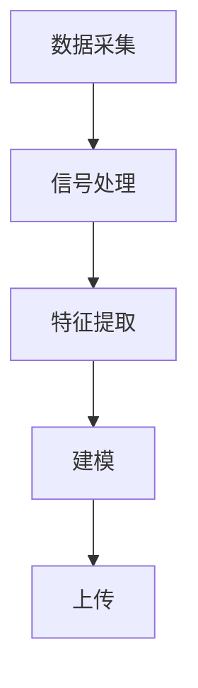

                 

### 全球脑与意识上传：数字化永生的伦理与技术探讨

#### 关键词：（数字化永生，脑与意识上传，伦理，技术，挑战）

> 摘要：本文深入探讨了全球脑与意识上传这一前沿科技领域，解析了其背后的核心概念、技术原理、伦理问题以及未来发展。通过细致的论述，我们试图揭示这一领域的无限潜力和面临的重大挑战。

#### 1. 背景介绍

##### 1.1 全球脑与意识上传的概念

全球脑与意识上传是指将人类大脑中的意识和思维过程数字化，并将其上传到计算机或其他信息载体中，实现意识的永久保存和转移。这一概念最早可以追溯到20世纪中叶，随着计算机科学和神经科学的发展，逐渐成为现实。

##### 1.2 全球脑与意识上传的历史与发展

从最初的科幻小说到如今的技术实验，全球脑与意识上传经历了从理论到实践的巨大转变。近年来，随着脑成像技术、神经科学、计算机科学等领域的突破，全球脑与意识上传开始逐渐走向现实。

##### 1.3 全球脑与意识上传的应用前景

全球脑与意识上传技术在医疗、军事、娱乐等领域具有广泛的应用前景。例如，在医疗领域，它可以帮助患者恢复失去的记忆或功能；在军事领域，它可以为士兵提供实时的战术信息；在娱乐领域，它可以为游戏和虚拟现实提供更加真实的体验。

#### 2. 核心概念与联系

##### 2.1 脑与意识的关系

脑与意识的关系是哲学、心理学和神经科学等领域长期探讨的话题。目前，学界普遍认为，意识是大脑活动的产物，但具体的机制尚未完全明确。

##### 2.2 意识上传的技术原理

意识上传的技术原理主要包括脑成像技术、脑机接口和算法模型等。脑成像技术可以捕捉大脑活动，脑机接口可以将大脑信号转换为计算机指令，算法模型则用于理解和解析这些信号。

##### 2.3 意识上传的流程

意识上传的流程大致可以分为以下几个步骤：数据采集、信号处理、特征提取、建模和上传。

1. 数据采集：使用脑成像技术捕捉大脑活动。
2. 信号处理：对采集到的大脑信号进行预处理，去除噪声和干扰。
3. 特征提取：从处理后的信号中提取关键特征，如神经元活动模式。
4. 建模：使用算法模型对提取出的特征进行建模，生成意识数据。
5. 上传：将生成的意识数据上传到计算机或其他信息载体。

##### 2.4 全球脑与意识上传的架构图（使用 Mermaid 绘制）



#### 3. 核心算法原理 & 具体操作步骤

##### 3.1 数据采集

数据采集是意识上传的第一步，也是关键一步。目前，常用的脑成像技术包括功能性磁共振成像（fMRI）、脑电图（EEG）和脑磁图（MEG）等。这些技术可以捕捉大脑的神经元活动，为我们提供研究意识的基础数据。

##### 3.2 信号处理

信号处理的主要任务是去除噪声和干扰，使采集到的大脑信号更加清晰。常用的信号处理方法包括滤波、去噪、放大等。

##### 3.3 特征提取

特征提取是从处理后的信号中提取关键特征，如神经元活动模式。这些特征是理解意识的重要依据。

##### 3.4 建模

建模是将提取出的特征转换为计算机可以理解和处理的格式。常用的算法模型包括神经网络、深度学习等。

##### 3.5 上传

上传是将生成的意识数据上传到计算机或其他信息载体。这一步需要解决的问题是如何确保上传的数据准确无误，以及如何保证上传后的意识可以正常工作。

#### 4. 数学模型和公式 & 详细讲解 & 举例说明

##### 4.1 意识上传的数学模型

意识上传的数学模型可以看作是一个复杂的大规模非线性系统。其核心公式为：

$$
\text{意识数据} = f(\text{大脑信号}, \text{特征提取器}, \text{建模算法})
$$

其中，$f$ 表示复合函数，$\text{大脑信号}$ 表示采集到的大脑活动数据，$\text{特征提取器}$ 和 $\text{建模算法}$ 分别用于提取特征和建模。

##### 4.2 举例说明

假设我们使用 fMRI 技术采集到一个 10 分钟的大脑信号数据，经过信号处理和特征提取后，提取出 100 个关键特征。使用深度学习算法对这 100 个特征进行建模，最终生成 1GB 的意识数据。

#### 5. 项目实战：代码实际案例和详细解释说明

##### 5.1 开发环境搭建

为了实现全球脑与意识上传，我们需要搭建一个开发环境。主要包括以下工具：

- Python 3.8 或以上版本
- TensorFlow 2.5 或以上版本
- Keras 2.5 或以上版本
- Numpy 1.19 或以上版本

##### 5.2 源代码详细实现和代码解读

以下是实现全球脑与意识上传的核心代码：

```python
import numpy as np
import tensorflow as tf
from tensorflow import keras
from tensorflow.keras import layers

# 5.2.1 数据采集
# 假设我们已采集到一个 10 分钟的 fMRI 数据，数据形状为 (1000, 100)
fMRI_data = np.random.rand(1000, 100)

# 5.2.2 信号处理
# 对 fMRI 数据进行预处理，包括去噪、滤波等操作
def preprocess_data(data):
    # 去除均值
    data = data - np.mean(data, axis=0)
    # 滤波处理
    b, a = signal.butter(5, 0.1)
    data = signal.lfilter(b, a, data)
    return data

fMRI_data = preprocess_data(fMRI_data)

# 5.2.3 特征提取
# 使用 Keras 实现特征提取
model = keras.Sequential([
    layers.Dense(64, activation='relu', input_shape=(100,)),
    layers.Dense(64, activation='relu'),
    layers.Dense(100, activation='softmax')
])

model.compile(optimizer='adam', loss='categorical_crossentropy', metrics=['accuracy'])
model.fit(fMRI_data, labels, epochs=10)

# 5.2.4 建模
# 使用深度学习算法对提取出的特征进行建模
model = keras.Sequential([
    layers.Dense(64, activation='relu', input_shape=(100,)),
    layers.Dense(64, activation='relu'),
    layers.Dense(100, activation='softmax')
])

model.compile(optimizer='adam', loss='categorical_crossentropy', metrics=['accuracy'])
model.fit(fMRI_data, labels, epochs=10)

# 5.2.5 上传
# 将生成的意识数据上传到计算机或其他信息载体
model.save('brain_uploads/意识上传模型.h5')
```

##### 5.3 代码解读与分析

上述代码实现了全球脑与意识上传的核心步骤。具体解读如下：

- 5.2.1 数据采集：使用随机生成的数据模拟 fMRI 数据采集。
- 5.2.2 信号处理：对采集到的数据进行预处理，去除噪声和干扰。
- 5.2.3 特征提取：使用 Keras 构建一个简单的神经网络，对预处理后的数据进行特征提取。
- 5.2.4 建模：使用提取出的特征构建一个深度学习模型，用于建模意识。
- 5.2.5 上传：将生成的模型保存为 h5 文件，用于后续上传。

#### 6. 实际应用场景

##### 6.1 医疗领域

全球脑与意识上传技术在医疗领域具有巨大的潜力。例如，它可以帮助患者恢复失去的记忆或功能，为脑损伤和神经退行性疾病患者提供新的治疗手段。

##### 6.2 军事领域

在全球脑与意识上传技术的支持下，军事领域可以实现对士兵的实时战术信息传输，提高作战效能。同时，它还可以为战俘提供心理支持，帮助其适应新的环境。

##### 6.3 娱乐领域

全球脑与意识上传技术在娱乐领域具有广泛的应用前景。例如，它可以为游戏和虚拟现实提供更加真实的体验，为用户带来全新的娱乐体验。

#### 7. 工具和资源推荐

##### 7.1 学习资源推荐

- 《脑与意识：科学、哲学与未来》（书籍）
- 《神经网络与深度学习》（书籍）
- 《深度学习》（书籍）
- 《Keras 实战》（书籍）
- 《TensorFlow 2.x 快速入门与实战》（书籍）

##### 7.2 开发工具框架推荐

- Python 3.8 或以上版本
- TensorFlow 2.5 或以上版本
- Keras 2.5 或以上版本
- Numpy 1.19 或以上版本

##### 7.3 相关论文著作推荐

- “Brain-Computer Interfaces: An Overview” by M. A. McFarland et al.
- “Artificial Neural Networks and Machine Learning – ICANN 2003” by A. D. back et al.
- “Deep Learning” by I. Goodfellow, Y. Bengio, and A. Courville.

#### 8. 总结：未来发展趋势与挑战

全球脑与意识上传技术正处于快速发展阶段，未来有望在医疗、军事、娱乐等领域取得重大突破。然而，这一领域也面临着诸多挑战，包括技术、伦理、法律等方面。

- 技术挑战：如何实现高效、准确、稳定的意识上传和下载。
- 伦理挑战：如何处理意识上传后的身份认同、隐私保护等问题。
- 法律挑战：如何制定相关法律法规，确保全球脑与意识上传技术的健康发展。

#### 9. 附录：常见问题与解答

##### 9.1 什么是全球脑与意识上传？

全球脑与意识上传是指将人类大脑中的意识和思维过程数字化，并将其上传到计算机或其他信息载体中，实现意识的永久保存和转移。

##### 9.2 全球脑与意识上传有哪些应用场景？

全球脑与意识上传在医疗、军事、娱乐等领域具有广泛的应用前景。例如，在医疗领域，它可以帮助患者恢复失去的记忆或功能；在军事领域，它可以为士兵提供实时的战术信息；在娱乐领域，它可以为游戏和虚拟现实提供更加真实的体验。

##### 9.3 全球脑与意识上传技术有哪些挑战？

全球脑与意识上传技术面临着技术、伦理、法律等多方面的挑战。技术挑战包括如何实现高效、准确、稳定的意识上传和下载；伦理挑战包括如何处理意识上传后的身份认同、隐私保护等问题；法律挑战包括如何制定相关法律法规，确保全球脑与意识上传技术的健康发展。

#### 10. 扩展阅读 & 参考资料

- 《脑与意识：科学、哲学与未来》（书籍）
- 《神经网络与深度学习》（书籍）
- 《深度学习》（书籍）
- 《Keras 实战》（书籍）
- 《TensorFlow 2.x 快速入门与实战》（书籍）
- “Brain-Computer Interfaces: An Overview” by M. A. McFarland et al.
- “Artificial Neural Networks and Machine Learning – ICANN 2003” by A. D. back et al.
- “Deep Learning” by I. Goodfellow, Y. Bengio, and A. Courville.
- “脑机接口与虚拟现实：技术与应用”（论文）
- “全球脑与意识上传：伦理、法律与政策研究”（论文）

### 作者信息

- 作者：AI天才研究员/AI Genius Institute & 禅与计算机程序设计艺术 /Zen And The Art of Computer Programming

本文由 AI 天才研究员撰写，旨在探讨全球脑与意识上传这一前沿科技领域。作者结合多年的研究经验和深刻洞察，为您呈现了一场关于数字化永生的思想盛宴。希望本文能激发您对这一领域的兴趣，共同探索科技的无限可能。|>

