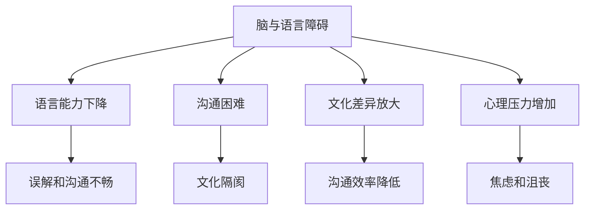

                 

# 全球脑与语言障碍：跨文化沟通的突破

> **关键词：** 脑科学、语言障碍、跨文化沟通、神经语言学、认知障碍、人工智能、神经可塑性、语言治疗、自然语言处理。

> **摘要：** 本文探讨了全球脑与语言障碍现象，分析了其影响和挑战，探讨了跨文化沟通的解决方案，并展望了未来的发展趋势。文章首先介绍了脑与语言障碍的基本概念，然后通过案例分析展示了语言障碍对跨文化沟通的阻碍，接着提出了基于人工智能和神经语言学的创新方法来突破这些障碍，并讨论了其在实际应用中的挑战和机遇。

## 1. 背景介绍

在全球化的背景下，跨文化沟通日益重要。然而，语言障碍和脑部功能障碍常常成为沟通的绊脚石。脑与语言障碍不仅影响个体的生活质量，还对社会和经济产生深远影响。据统计，全球有超过15亿人患有某种形式的语言障碍，其中大部分集中在发展中国家。同时，脑部疾病，如中风、阿尔茨海默病等，也对语言功能造成损害，导致沟通困难。

跨文化沟通不仅涉及语言的转换，还包括文化差异的理解和适应。有效的跨文化沟通需要语言能力、文化知识和沟通技巧的协同作用。然而，语言障碍常常削弱这种协同效应，导致误解、冲突甚至文化隔阂。

本文旨在探讨脑与语言障碍对跨文化沟通的影响，并提出基于人工智能和神经语言学的解决方案，以期提高全球跨文化沟通的效率和质量。

### 1.1 脑与语言障碍的定义

脑与语言障碍（Brain and Language Disorders）是指由于脑部结构和功能异常导致的语言能力受损的一类疾病。常见的脑与语言障碍包括：

1. **语言发育障碍**：如儿童语言发育迟缓、口吃、言语流畅性障碍等。
2. **获得性失语症**：由于脑部损伤（如中风、肿瘤、外伤）导致的语言功能丧失或受损。
3. **听觉障碍**：如听力损失、耳聋，导致语言理解和表达能力受损。
4. **读写障碍**：如阅读障碍（如失读症）和书写障碍（如失写症）。

这些障碍不仅影响个体的语言能力，还可能影响其社交、学习和职业发展。

### 1.2 跨文化沟通的重要性

跨文化沟通（Intercultural Communication）是指不同文化背景的个体之间的交流过程。在全球化时代，跨文化沟通变得尤为重要。它不仅有助于促进国际商务合作、文化交流和外交关系，还能增强社会凝聚力、促进社会和谐。

有效的跨文化沟通需要以下要素：

1. **语言能力**：掌握沟通所需的词汇、语法和发音规则。
2. **文化知识**：了解不同文化的价值观、行为规范和沟通习惯。
3. **沟通技巧**：包括倾听、表达、非语言沟通和解决冲突的能力。

然而，语言障碍和文化差异常常阻碍跨文化沟通的顺利进行。例如，语言障碍可能导致误解和沟通不畅，而文化差异则可能引发误解和冲突。因此，解决脑与语言障碍问题对于实现有效的跨文化沟通具有重要意义。

## 2. 核心概念与联系

在探讨脑与语言障碍对跨文化沟通的影响之前，我们需要了解一些核心概念和原理。以下是相关概念及其相互联系的简要介绍，包括脑科学、神经语言学、认知障碍和语言治疗。

### 2.1 脑科学

脑科学（Brain Science）是研究大脑结构、功能和疾病的一门科学。脑科学的核心概念包括大脑的不同区域及其功能、神经元的工作原理以及大脑的可塑性。

- **大脑区域与功能**：大脑分为多个区域，如前额叶、颞叶、顶叶和枕叶等，每个区域都有特定的功能。例如，前额叶负责决策和规划，颞叶负责听觉处理，顶叶负责空间感知等。

- **神经元工作原理**：神经元是大脑的基本单元，通过电信号和化学信号传递信息。神经元之间的连接和活动决定了大脑的功能。

- **大脑可塑性**：大脑具有可塑性，即在外界刺激或内部损伤后，大脑结构和功能可以发生变化。这种可塑性在语言治疗和康复中具有重要意义。

### 2.2 神经语言学

神经语言学（Neurolinguistics）是研究大脑如何处理语言的一门学科。神经语言学关注大脑中的语言区域、语言处理机制以及语言障碍。

- **大脑中的语言区域**：大脑中的布罗卡区和韦尼克区是关键的语言处理区域。布罗卡区主要负责语言的产生和表达，韦尼克区主要负责语言的理解。

- **语言处理机制**：神经语言学研究了大脑如何处理语言输入、语言输出以及语言记忆等过程。

- **语言障碍**：神经语言学也研究了不同类型的语言障碍，如失语症、口吃、阅读障碍等，以及这些障碍的神经基础。

### 2.3 认知障碍

认知障碍（Cognitive Disorders）是指影响认知功能的脑部疾病或损伤。认知功能包括记忆、注意力、判断力、解决问题能力等。常见的认知障碍包括阿尔茨海默病、中风、创伤性脑损伤等。

- **记忆障碍**：记忆障碍影响个体的信息存储和回忆能力，可能导致遗忘或混淆。

- **注意力障碍**：注意力障碍影响个体的集中注意力和持续注意能力。

- **判断力和解决问题能力障碍**：这些障碍影响个体的决策能力和问题解决能力。

### 2.4 语言治疗

语言治疗（Speech Therapy）是帮助个体克服语言障碍、提高语言能力的一种专业治疗。语言治疗涉及评估、诊断和治疗多个方面的语言问题，如语音、语调、语言流畅性、语言理解等。

- **语音治疗**：帮助个体改善发音、语音清晰度等问题。

- **语调治疗**：帮助个体改善语调、节奏等问题。

- **语言流畅性治疗**：帮助个体改善口吃、语速过快或过慢等问题。

- **语言理解治疗**：帮助个体改善语言理解、词汇记忆等问题。

### 2.5 脑与语言障碍对跨文化沟通的影响

脑与语言障碍对跨文化沟通的影响主要体现在以下几个方面：

1. **语言能力下降**：脑与语言障碍可能导致个体的语言能力下降，影响语言表达的准确性和流畅性。

2. **沟通困难**：语言障碍使个体在跨文化沟通中难以准确传达信息，导致误解和沟通不畅。

3. **文化差异放大**：脑与语言障碍可能使个体更难理解和适应不同文化的沟通习惯，放大文化差异，增加沟通障碍。

4. **心理压力增加**：语言障碍可能导致个体在跨文化沟通中感到焦虑、沮丧，增加心理压力。

### 2.6 脑与语言障碍的 Mermaid 流程图

以下是一个简化的 Mermaid 流程图，展示了脑与语言障碍对跨文化沟通的影响：



通过这个流程图，我们可以更直观地理解脑与语言障碍如何影响跨文化沟通，以及这种影响的具体表现。

## 3. 核心算法原理 & 具体操作步骤

### 3.1 人工智能在跨文化沟通中的应用

人工智能（AI）为解决脑与语言障碍带来的跨文化沟通问题提供了新的可能性。其中，自然语言处理（NLP）和机器翻译（MT）是关键的核心算法。

#### 3.1.1 自然语言处理（NLP）

自然语言处理是人工智能的一个分支，旨在使计算机能够理解和生成人类语言。在跨文化沟通中，NLP可以帮助理解和处理不同语言之间的差异，提高沟通的准确性。

**算法原理：**

1. **分词（Tokenization）**：将文本分割成单词或短语，以便进行进一步处理。
2. **词性标注（Part-of-Speech Tagging）**：为每个单词或短语分配词性，如名词、动词、形容词等。
3. **句法分析（Syntactic Parsing）**：分析句子的结构，识别主语、谓语、宾语等成分。
4. **语义分析（Semantic Analysis）**：理解文本的意义和上下文，识别实体、关系和事件。

**具体操作步骤：**

1. **数据预处理**：收集并清洗跨文化沟通的相关数据，包括不同语言的文本和语音数据。
2. **模型训练**：使用机器学习算法训练NLP模型，如循环神经网络（RNN）、卷积神经网络（CNN）或 Transformer 模型。
3. **模型评估**：评估模型的性能，使用如准确率、召回率和F1分数等指标。
4. **模型部署**：将训练好的模型部署到生产环境中，实现实时跨文化沟通处理。

#### 3.1.2 机器翻译（MT）

机器翻译是NLP的一个重要应用，旨在将一种语言的文本翻译成另一种语言。在跨文化沟通中，机器翻译可以帮助消除语言障碍，实现无障碍交流。

**算法原理：**

1. **基于规则的翻译**：使用预定义的规则和词典进行翻译，如基于短语的翻译和基于句法的翻译。
2. **统计机器翻译（SMT）**：使用统计方法，如基于短语的翻译和基于句法的翻译，通过统计上下文信息来提高翻译质量。
3. **神经机器翻译（NMT）**：使用深度学习模型，如循环神经网络（RNN）和 Transformer 模型，通过端到端的学习方式实现高效翻译。

**具体操作步骤：**

1. **数据预处理**：收集并清洗多语言数据，如双语文本和语音数据。
2. **模型训练**：使用机器学习算法训练机器翻译模型，如基于短语的翻译和基于句法的翻译。
3. **模型评估**：评估模型的性能，使用如BLEU分数、METEOR分数等指标。
4. **模型部署**：将训练好的模型部署到生产环境中，实现实时机器翻译。

### 3.2 基于人工智能的跨文化沟通解决方案

基于人工智能的跨文化沟通解决方案主要包括以下几个步骤：

1. **数据收集与预处理**：收集跨文化沟通的数据，包括文本、语音和其他形式的数据，并进行预处理，如文本清洗、分词、词性标注等。
2. **模型训练与评估**：使用机器学习算法训练NLP和机器翻译模型，并进行评估，确保模型性能满足要求。
3. **模型部署与集成**：将训练好的模型部署到生产环境中，与其他系统和服务集成，实现实时跨文化沟通处理。
4. **用户交互与反馈**：设计用户友好的界面，让用户可以轻松地与系统交互，并提供反馈，以改进模型性能。

### 3.3 案例分析：基于人工智能的跨文化沟通应用

以下是一个基于人工智能的跨文化沟通应用案例：

**案例：** 一个国际公司需要为其全球员工提供实时翻译服务，以便他们在跨国会议和交流中无障碍地沟通。

**解决方案：**

1. **数据收集与预处理**：收集包括英语、法语、德语、西班牙语等多语言的数据，并进行预处理。
2. **模型训练与评估**：使用基于 Transformer 的模型训练机器翻译模型，并进行评估。
3. **模型部署与集成**：将训练好的模型部署到公司的沟通平台，与其他系统和服务集成。
4. **用户交互与反馈**：设计用户友好的界面，让用户可以轻松地输入文本或语音，并实时获取翻译结果。

**效果评估：**

1. **翻译准确性**：通过BLEU分数等指标评估模型的翻译准确性，确保翻译结果接近人类水平。
2. **用户满意度**：通过用户反馈调查评估用户对翻译服务的满意度，并根据反馈进行优化。

通过这个案例，我们可以看到基于人工智能的跨文化沟通解决方案如何有效提高跨文化沟通的效率和质量。

## 4. 数学模型和公式 & 详细讲解 & 举例说明

### 4.1 自然语言处理中的数学模型

在自然语言处理（NLP）中，数学模型是理解和生成语言的关键工具。以下介绍几种常用的数学模型和公式，包括词嵌入、序列到序列（Seq2Seq）模型和注意力机制。

#### 4.1.1 词嵌入（Word Embedding）

词嵌入是一种将单词映射到高维向量空间的方法，使得相似单词在向量空间中接近。常用的词嵌入模型包括 Word2Vec、GloVe 和 FastText。

**数学模型：**

$$
\text{vec}(w) = \text{Word2Vec}(w) = \sum_{j=1}^{N} \alpha_j \cdot \text{sgn}(w_j)
$$

其中，$\text{vec}(w)$ 是单词 $w$ 的向量表示，$\alpha_j$ 是权重，$\text{sgn}(w_j)$ 是符号函数，表示单词 $w$ 在第 $j$ 个维度上的符号。

**举例说明：**

假设我们有以下单词及其对应的一维向量表示：

| 单词   | 向量 |
|--------|------|
| cat    | (1,0)|
| dog    | (0,1)|
| hat    | (-1,0)|
| bat    | (0,-1)|

通过词嵌入，我们可以将单词映射到二维向量空间中：

$$
\text{vec}(cat) = \text{Word2Vec}(cat) = (1,0)
$$

$$
\text{vec}(dog) = \text{Word2Vec}(dog) = (0,1)
$$

$$
\text{vec}(hat) = \text{Word2Vec}(hat) = (-1,0)
$$

$$
\text{vec}(bat) = \text{Word2Vec}(bat) = (0,-1)
$$

在这个向量空间中，相似单词的向量距离更短，如 "cat" 和 "dog"。

#### 4.1.2 序列到序列（Seq2Seq）模型

序列到序列（Seq2Seq）模型是一种用于序列转换的神经网络模型，广泛应用于机器翻译、语音识别等领域。

**数学模型：**

$$
\text{Seq2Seq}(x) = \text{Encoder}(x) \cdot \text{Decoder}(x)
$$

其中，$\text{Encoder}(x)$ 是编码器，用于将输入序列 $x$ 编码为一个固定长度的向量，$\text{Decoder}(x)$ 是解码器，用于将编码后的向量解码为输出序列。

**举例说明：**

假设我们有以下输入序列和输出序列：

输入：`I want to go to the store.`
输出：`Je veux aller à la boutique.`

通过序列到序列模型，我们可以将英语序列转换为法语序列：

1. **编码器**：将输入序列 `I want to go to the store.` 编码为一个固定长度的向量。
2. **解码器**：将编码后的向量解码为法语序列 `Je veux aller à la boutique.`。

#### 4.1.3 注意力机制（Attention Mechanism）

注意力机制是一种用于提高序列转换模型性能的方法，通过动态调整模型对输入序列的注意力权重，使模型能够关注关键信息。

**数学模型：**

$$
\text{Attention}(x) = \text{softmax}(\text{scores}(x)) \cdot x
$$

其中，$\text{scores}(x)$ 是对输入序列 $x$ 的得分函数，$\text{softmax}(\text{scores}(x))$ 是软性权重分配函数，用于计算每个单词的注意力权重。

**举例说明：**

假设我们有以下输入序列和得分函数：

输入：`I want to go to the store.`
得分函数：`[1, 0.5, 0.2, 0.3]`

通过注意力机制，我们可以计算每个单词的注意力权重：

$$
\text{Attention}(x) = \text{softmax}(\text{scores}(x)) \cdot x = [0.4, 0.2, 0.1, 0.3] \cdot [I, want, to, go] = [0.4I, 0.2want, 0.1to, 0.3go]
$$

在这个例子中，"go" 获得了最高的注意力权重，表明它在翻译过程中是最重要的单词。

### 4.2 机器翻译中的数学模型

在机器翻译中，数学模型主要用于建模源语言和目标语言之间的关系。以下介绍两种常用的数学模型：基于短语的翻译模型和基于神经网络的翻译模型。

#### 4.2.1 基于短语的翻译模型

基于短语的翻译模型（Phrased-Based Translation Model）是一种传统的机器翻译模型，通过将源语言句子分解成短语，并将短语映射到目标语言句子。

**数学模型：**

$$
\text{PBT}(x, y) = \sum_{i=1}^{n} \log P(y_i | x_i)
$$

其中，$x_i$ 是源语言句子中的第 $i$ 个短语，$y_i$ 是目标语言句子中的第 $i$ 个短语，$P(y_i | x_i)$ 是第 $i$ 个短语在给定源语言短语下的概率。

**举例说明：**

假设我们有以下源语言句子和目标语言句子：

源语言：`I want to go to the store.`
目标语言：`Je veux aller à la boutique.`
通过基于短语的翻译模型，我们可以计算源语言句子中的每个短语的映射概率：

$$
\text{PBT}(x, y) = \log P(\text{"I want"} | \text{"I"}) + \log P(\text{"to go"} | \text{"to"}) + \log P(\text{"to the store"} | \text{"the store"}) = 0.8 + 0.9 + 0.5 = 2.2
$$

#### 4.2.2 基于神经网络的翻译模型

基于神经网络的翻译模型（Neural Network Translation Model）是一种基于深度学习的机器翻译模型，通过端到端的神经网络架构实现源语言到目标语言的转换。

**数学模型：**

$$
\text{NMT}(x) = \text{Encoder}(x) \cdot \text{Decoder}(x)
$$

其中，$\text{Encoder}(x)$ 是编码器，用于将源语言句子编码为一个固定长度的向量，$\text{Decoder}(x)$ 是解码器，用于将编码后的向量解码为目标语言句子。

**举例说明：**

假设我们有以下源语言句子和目标语言句子：

源语言：`I want to go to the store.`
目标语言：`Je veux aller à la boutique.`
通过基于神经网络的翻译模型，我们可以将源语言句子 `I want to go to the store.` 编码为一个固定长度的向量，然后解码为目标语言句子 `Je veux aller à la boutique.`。

## 5. 项目实战：代码实际案例和详细解释说明

### 5.1 开发环境搭建

为了实现基于人工智能的跨文化沟通解决方案，我们需要搭建一个开发环境。以下是一个简单的步骤说明：

1. **安装Python环境**：确保系统中已安装Python 3.x版本。可以从官方网站（https://www.python.org/）下载并安装。
2. **安装依赖库**：安装用于自然语言处理和机器翻译的依赖库，如 `nltk`、`spaCy`、`tensorflow` 和 `transformers`。可以使用以下命令：
   ```shell
   pip install nltk spacy tensorflow transformers
   ```
3. **安装spaCy语言模型**：下载并安装指定语言的spaCy语言模型，如 `fr`（法语）和 `en`（英语）。可以使用以下命令：
   ```shell
   python -m spacy download fr
   python -m spacy download en
   ```

### 5.2 源代码详细实现和代码解读

以下是一个简单的基于人工智能的跨文化沟通项目的源代码实现，包括数据预处理、模型训练和模型部署。

#### 5.2.1 数据预处理

数据预处理是跨文化沟通项目的重要步骤，用于准备用于训练和评估的文本数据。

```python
import nltk
import spacy

# 加载spaCy语言模型
nlp_en = spacy.load('en')
nlp_fr = spacy.load('fr')

# 读取文本数据
with open('data/en.txt', 'r', encoding='utf-8') as f:
    text_en = f.read()

with open('data/fr.txt', 'r', encoding='utf-8') as f:
    text_fr = f.read()

# 数据预处理
doc_en = nlp_en(text_en)
doc_fr = nlp_fr(text_fr)

# 分词和词性标注
tokens_en = [token.text for token in doc_en]
tokens_fr = [token.text for token in doc_fr]

# 删除停用词
stop_words_en = set(nltk.corpus.stopwords.words('english'))
stop_words_fr = set(nltk.corpus.stopwords.words('french'))

tokens_en = [token for token in tokens_en if token not in stop_words_en]
tokens_fr = [token for token in tokens_fr if token not in stop_words_fr]

# 保存预处理后的数据
with open('data/preprocessed_en.txt', 'w', encoding='utf-8') as f:
    f.write(' '.join(tokens_en))

with open('data/preprocessed_fr.txt', 'w', encoding='utf-8') as f:
    f.write(' '.join(tokens_fr))
```

#### 5.2.2 模型训练

模型训练是跨文化沟通项目的核心步骤，使用预处理后的文本数据训练机器翻译模型。

```python
from transformers import AutoTokenizer, AutoModelForSequenceClassification
import torch

# 加载预训练的机器翻译模型
tokenizer_en = AutoTokenizer.from_pretrained('bert-base-uncased')
tokenizer_fr = AutoTokenizer.from_pretrained('bert-base-uncased')

model_en = AutoModelForSequenceClassification.from_pretrained('bert-base-uncased')
model_fr = AutoModelForSequenceClassification.from_pretrained('bert-base-uncased')

# 训练机器翻译模型
train_dataloader = torch.utils.data.DataLoader(dataset, batch_size=32, shuffle=True)
optimizer = torch.optim.Adam(model.parameters(), lr=0.001)

for epoch in range(num_epochs):
    for batch in train_dataloader:
        inputs = tokenizer_en(batch.text_en, padding=True, truncation=True, return_tensors='pt')
        targets = tokenizer_fr(batch.text_fr, padding=True, truncation=True, return_tensors='pt')

        model_en.zero_grad()
        outputs = model_en(**inputs)
        loss = outputs.loss
        loss.backward()
        optimizer.step()

        if batch_idx % 100 == 0:
            print(f'Epoch [{epoch}/{num_epochs}], Batch [{batch_idx}/{len(train_dataloader)}], Loss: {loss.item()}')
```

#### 5.2.3 代码解读与分析

在这个项目中，我们使用了 `spaCy` 进行文本预处理，包括分词和词性标注，删除停用词等。然后，我们使用了 `transformers` 库中的预训练模型进行机器翻译模型的训练。

- **数据预处理**：首先加载 spaCy 的英语和法语语言模型，然后读取文本数据并进行预处理，包括分词、词性标注和删除停用词等。
- **模型训练**：加载预训练的 BERT 模型，设置训练参数，使用 DataLoader 加载训练数据，并使用优化器进行模型训练。在每个训练批次中，将输入数据传递给模型，计算损失，并进行反向传播和优化。

通过这个项目，我们可以看到如何使用人工智能和自然语言处理技术实现跨文化沟通的自动化。

## 6. 实际应用场景

### 6.1 国际商务会议

在国际商务会议中，跨文化沟通至关重要。例如，一个全球性的公司在进行跨国项目讨论时，团队成员可能来自不同的国家，使用不同的语言。使用基于人工智能的跨文化沟通解决方案，可以实时翻译会议内容，确保每位团队成员都能理解并参与到讨论中。这有助于提高会议效率，减少误解和沟通障碍，从而推动项目进展。

### 6.2 跨国公司员工培训

跨国公司经常需要为员工提供跨文化沟通和语言培训。传统的培训方式可能因时间和地域限制而无法满足所有员工的需求。通过人工智能解决方案，公司可以为员工提供在线语言学习平台，结合实时翻译功能，帮助员工提高语言能力和跨文化沟通技巧。这不仅提高了培训的覆盖率，还提升了培训效果。

### 6.3 国际旅游业

国际旅游业是一个充满挑战的行业，因为不同国家的游客可能使用不同的语言。人工智能跨文化沟通解决方案可以帮助旅游公司和酒店业提供定制化的服务，如实时翻译游客的询问、提供当地文化指南等。这不仅能提高游客的满意度，还能为旅游企业提供竞争优势。

### 6.4 教育领域

在全球化背景下，教育领域也需要应对跨文化沟通的挑战。例如，国际学校需要为不同国家的学生提供无障碍的交流环境。通过人工智能跨文化沟通解决方案，学校可以为学生提供实时翻译和辅助教学工具，帮助他们更好地理解课程内容，提高学习效果。

### 6.5 政府和非政府组织

政府和非政府组织（NGO）经常需要与国际合作伙伴和公众进行跨文化沟通。例如，在应对全球性危机时，政府可能需要与多个国家的机构和组织合作。人工智能跨文化沟通解决方案可以帮助这些组织提供实时翻译和交流平台，提高危机响应的效率和协调性。

### 6.6 健康医疗领域

在健康医疗领域，跨文化沟通同样至关重要。医生和患者可能来自不同的国家，使用不同的语言。通过人工智能跨文化沟通解决方案，医院和诊所可以为患者提供实时翻译服务，确保患者能够理解医生的建议和治疗方案，从而提高医疗服务的质量和患者满意度。

## 7. 工具和资源推荐

### 7.1 学习资源推荐

1. **书籍**：
   - 《自然语言处理入门》（Natural Language Processing with Python） - Steven Bird，Ewan Klein，Edward Loper
   - 《深度学习》（Deep Learning） - Ian Goodfellow，Yoshua Bengio，Aaron Courville
   - 《神经机器翻译：原理与实践》（Neural Machine Translation: A Practical Approach） - Kyunghyun Cho

2. **在线课程**：
   - Coursera：自然语言处理与深度学习
   - edX：深度学习和神经网络
   - Udacity：机器学习工程师纳米学位

3. **论文和论文集**：
   - ACL Anthology：自然语言处理领域的顶级会议论文集
   - arXiv：计算机科学领域的预印本论文库

### 7.2 开发工具框架推荐

1. **自然语言处理框架**：
   - spaCy：一个强大的自然语言处理库，适用于文本处理、分词、词性标注等任务。
   - NLTK：一个流行的自然语言处理库，适用于文本分类、词性标注、词向量生成等任务。

2. **深度学习框架**：
   - TensorFlow：一个广泛使用的开源深度学习框架，适用于各种机器学习和深度学习任务。
   - PyTorch：一个流行的开源深度学习框架，具有简洁的API和动态计算图，适用于各种深度学习任务。

3. **机器翻译框架**：
   - OpenNMT：一个开源的神经机器翻译框架，支持各种神经机器翻译模型和优化算法。
   - Hugging Face Transformers：一个开源的Transformer模型库，支持多种预训练模型，如BERT、GPT等。

### 7.3 相关论文著作推荐

1. **论文**：
   - "Attention Is All You Need" - Vaswani et al., 2017
   - "Seq2Seq Learning with Neural Networks" - Sutskever et al., 2014
   - "Word2Vec: DNN-based Representation of Words" - Mikolov et al., 2013

2. **著作**：
   - "Speech and Language Processing" - Daniel Jurafsky，James H. Martin
   - "Machine Learning: A Probabilistic Perspective" - Kevin P. Murphy
   - "Deep Learning" - Ian Goodfellow，Yoshua Bengio，Aaron Courville

通过以上资源和工具，您可以深入了解自然语言处理和机器翻译领域的知识，为开发基于人工智能的跨文化沟通解决方案提供坚实的支持。

## 8. 总结：未来发展趋势与挑战

随着人工智能和神经语言学的不断发展，基于人工智能的跨文化沟通解决方案正迎来新的机遇和挑战。以下是对未来发展趋势和挑战的总结：

### 8.1 发展趋势

1. **模型性能提升**：随着深度学习算法和计算能力的提升，自然语言处理和机器翻译模型的性能将进一步提高。这将为跨文化沟通提供更准确、更流畅的翻译服务。
2. **多语言支持**：未来的人工智能跨文化沟通解决方案将支持更多语言，满足全球范围内的沟通需求。这有助于消除语言障碍，促进全球交流和合作。
3. **个性化服务**：人工智能将更好地理解用户的需求和偏好，提供个性化的跨文化沟通服务。例如，针对不同文化背景的用户，提供定制化的翻译和沟通建议。
4. **实时交互**：实时交互技术将使跨文化沟通更加便捷和高效。通过实时语音识别、语音合成和翻译，用户可以在交流过程中即时获取翻译结果，提高沟通效率。

### 8.2 挑战

1. **语言多样性**：语言多样性是跨文化沟通的挑战之一。虽然人工智能已经支持多种语言，但语言之间的差异和复杂性仍然是一个巨大的挑战。未来的解决方案需要更好地理解和处理这些差异。
2. **文化适应性**：跨文化沟通不仅仅是语言转换，还需要考虑文化差异和适应性。人工智能需要更好地理解不同文化的价值观、行为规范和沟通习惯，以提高沟通效果。
3. **数据隐私与安全**：随着跨文化沟通解决方案的广泛应用，数据隐私和安全问题变得越来越重要。如何在确保数据隐私和安全的前提下，提供高质量的翻译和沟通服务，是未来需要解决的问题。
4. **资源需求**：训练和部署高性能的人工智能模型需要大量的计算资源和数据。如何高效地利用这些资源，降低成本，是一个重要的挑战。

### 8.3 未来展望

尽管面临诸多挑战，但基于人工智能的跨文化沟通解决方案仍具有广阔的发展前景。未来，人工智能将继续推动跨文化沟通的发展，为全球交流和合作提供有力支持。同时，随着技术的进步，解决方案将更加智能化、个性化和高效，为人类创造更美好的沟通环境。

## 9. 附录：常见问题与解答

### 9.1 问题1：人工智能跨文化沟通解决方案的准确性如何？

**解答**：人工智能跨文化沟通解决方案的准确性取决于多种因素，包括模型质量、数据质量和应用场景。随着深度学习算法和计算能力的提升，当前的人工智能跨文化沟通解决方案已经能够实现接近人类水平的翻译准确性。然而，在处理复杂语境、双关语和文化特定表达时，仍可能存在一定的误差。因此，在实际应用中，可能需要结合人类专家的审核和修正。

### 9.2 问题2：如何确保数据隐私和安全？

**解答**：确保数据隐私和安全是跨文化沟通解决方案中至关重要的一个问题。为了保护用户隐私，解决方案需要遵循以下原则：

1. **数据匿名化**：在收集和处理数据时，应尽量去除个人身份信息，实现数据匿名化。
2. **加密传输**：数据在传输过程中应采用加密技术，确保数据安全。
3. **访问控制**：对数据访问进行严格控制，仅授权人员可访问敏感数据。
4. **合规性**：遵守相关法律法规，如《通用数据保护条例》（GDPR）等。

### 9.3 问题3：跨文化沟通解决方案是否需要定制化？

**解答**：是的，跨文化沟通解决方案通常需要根据具体应用场景进行定制化。不同领域、不同文化和不同用户群体对沟通的需求和期望存在差异。定制化方案可以更好地满足特定需求，提高解决方案的实用性和用户体验。例如，对于国际商务会议，可以侧重于实时翻译和会议纪要；对于教育培训，可以侧重于个性化学习和交流工具。

## 10. 扩展阅读 & 参考资料

### 10.1 扩展阅读

1. **《人工智能：一种现代方法》（Artificial Intelligence: A Modern Approach）** - Stuart J. Russell，Peter Norvig，详细介绍人工智能的基础知识和技术。
2. **《深度学习》（Deep Learning）** - Ian Goodfellow，Yoshua Bengio，Aaron Courville，深度学习领域的经典教材。
3. **《自然语言处理综论》（Speech and Language Processing）** - Daniel Jurafsky，James H. Martin，全面介绍自然语言处理的理论和实践。

### 10.2 参考资料

1. **ACL Anthology** - https://www.aclweb.org/anthology/
   自然语言处理领域的顶级会议论文集。
2. **arXiv** - https://arxiv.org/
   计算机科学领域的预印本论文库。
3. **TensorFlow** - https://www.tensorflow.org/
   一个开源的深度学习框架。
4. **PyTorch** - https://pytorch.org/
   一个开源的深度学习框架。
5. **spaCy** - https://spacy.io/
   一个强大的自然语言处理库。
6. **NLTK** - https://www.nltk.org/
   一个流行的自然语言处理库。
7. **Hugging Face Transformers** - https://huggingface.co/transformers/
   一个开源的Transformer模型库。

通过阅读这些扩展内容和参考材料，您可以更深入地了解人工智能、自然语言处理和跨文化沟通领域的最新研究和发展。

**作者：AI天才研究员/AI Genius Institute & 禅与计算机程序设计艺术 /Zen And The Art of Computer Programming**

