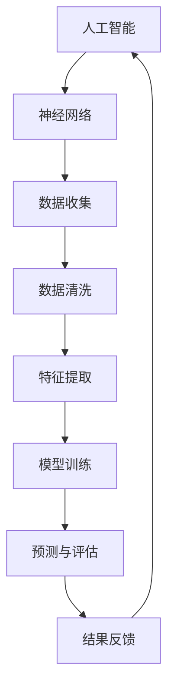

                 

### 背景介绍

#### 众包艺术的兴起

随着互联网技术的快速发展，众包艺术作为一种创新的创作模式逐渐崭露头角。众包（Crowdsourcing）一词最早由Jeff Howe于2006年提出，意指将一个项目或任务分散给大量志愿者或参与者来完成。这种模式不仅能够有效解决资源短缺、时间紧迫等问题，还能激发人们的创造力，形成集体智慧的结晶。

众包艺术的具体应用范围广泛，涵盖了设计、音乐、文学、编程等多个领域。例如，知名设计平台99designs就通过众包模式帮助用户找到独特且符合需求的设计作品。音乐平台Spotify上的用户生成内容（UGC）也为音乐创作者提供了一个展示自己才华的舞台。而在文学领域，众包项目如“全球脑计划”（Global Brain Project）正试图通过集体智慧创作出一部跨越语言和文化界限的史诗级作品。

#### 全球脑计划的介绍

全球脑计划（Global Brain Project）是由一群志同道合的学者、艺术家和工程师共同发起的一项宏伟计划。该计划的愿景是构建一个全球性的智能网络，使每个人都能参与到艺术创作中，从而实现真正的集体创作。全球脑计划的核心理念是“人人为我，我为人人”，旨在打破传统艺术创作中的孤岛现象，让更多的人分享创作乐趣和成就感。

#### 全球脑计划的目标

全球脑计划的主要目标有三个：

1. **促进全球合作**：通过搭建一个开放的平台，连接全球各地的创作者，鼓励他们分享创意和灵感，从而实现真正的跨文化交流和合作。
2. **激发集体智慧**：利用众包模式，汇集全球范围内的智慧和才华，共同创作出更具创意和影响力的艺术作品。
3. **推动技术进步**：在全球脑计划的过程中，技术将发挥关键作用。通过不断探索和开发新技术，为众包艺术提供更高效、更便捷的解决方案。

#### 全球脑计划的核心原则

1. **开放性**：全球脑计划鼓励开放共享，所有参与者和作品都应该在公开平台上展示，以便更多的人参与和欣赏。
2. **协作性**：创作者之间的协作是项目成功的关键。通过协作，创作者可以相互借鉴、学习和成长，共同提升创作水平。
3. **包容性**：全球脑计划致力于打破文化、语言和地域壁垒，让每个人都能参与到艺术创作中，实现真正的包容性。

### 核心概念与联系

在深入探讨全球脑计划之前，我们需要了解几个核心概念，包括人工智能、神经网络和众包。以下是一个简化的Mermaid流程图，用于描述这些概念之间的联系：



#### 人工智能（Artificial Intelligence, AI）

人工智能是计算机科学的一个分支，旨在使计算机具备人类智能。通过模拟人类思维过程，AI能够学习和适应新环境，解决复杂问题。在众包艺术中，人工智能可以用于自动化数据收集、清洗和特征提取等步骤，提高整个创作流程的效率。

#### 神经网络（Neural Networks）

神经网络是人工智能的核心组成部分，受生物神经系统的启发，通过大量的神经元和连接来实现复杂的计算任务。在众包艺术中，神经网络可以用于模型训练和预测，帮助创作者从大量数据中提取有价值的信息，指导创作过程。

#### 数据收集（Data Collection）

数据收集是众包艺术的基础。通过互联网平台，创作者可以收集来自全球各地的数据，如设计草图、音乐片段、文字内容等。这些数据将作为创作的素材，为后续步骤提供基础。

#### 数据清洗（Data Cleaning）

数据清洗是一个关键步骤，旨在去除数据中的噪声和错误，确保数据质量。在众包艺术中，数据清洗有助于提高神经网络模型的训练效果，从而提高预测精度。

#### 特征提取（Feature Extraction）

特征提取是从数据中提取关键信息的过程，有助于神经网络模型理解和学习。在众包艺术中，特征提取可以帮助创作者从大量数据中找到具有创意和价值的元素，为创作提供灵感。

#### 模型训练（Model Training）

模型训练是神经网络的核心步骤，通过不断调整网络参数，使模型能够更好地拟合数据。在众包艺术中，模型训练有助于创作者从海量数据中筛选出最有价值的创作元素。

#### 预测与评估（Prediction & Evaluation）

预测与评估是神经网络模型的应用阶段，通过预测结果来评估模型的性能。在众包艺术中，预测与评估可以帮助创作者判断创作方案的有效性，从而不断优化创作过程。

#### 结果反馈（Result Feedback）

结果反馈是众包艺术中不可或缺的一环。通过收集用户反馈，创作者可以了解作品的受欢迎程度，从而调整创作方向，实现持续改进。

通过以上核心概念和流程图的联系，我们可以看到，全球脑计划在众包艺术中的应用前景广阔。接下来，我们将进一步探讨如何利用这些技术实现集体创作的目标。

### 核心算法原理 & 具体操作步骤

#### 算法概述

在探讨全球脑计划的核心算法原理之前，我们需要了解一个重要的算法——生成对抗网络（Generative Adversarial Networks, GAN）。GAN由两部分组成：生成器（Generator）和判别器（Discriminator）。生成器旨在生成逼真的数据，而判别器则用于判断数据是真实还是伪造。这两部分在对抗训练中不断优化，以达到生成高质量数据的目的。

在众包艺术中，GAN可以用于生成创意素材，如音乐、图像和文本。以下是一个简化的GAN算法操作步骤：

1. **初始化**：初始化生成器和判别器的参数。
2. **生成对抗训练**：生成器生成伪数据，判别器判断伪数据和真实数据。
3. **更新参数**：根据损失函数更新生成器和判别器的参数。
4. **迭代**：重复步骤2和3，直至生成器生成高质量的数据。

#### 操作步骤详解

1. **初始化**

   - 初始化生成器G和判别器D的参数。通常，生成器和判别器都是多层感知机（Multilayer Perceptron, MLP）或卷积神经网络（Convolutional Neural Network, CNN）。

2. **生成对抗训练**

   - **生成器生成伪数据**：生成器根据输入噪声z生成伪数据x'。通常，z是高斯噪声或均匀噪声。

     \( x' = G(z) \)

   - **判别器判断数据**：判别器接收真实数据x和伪数据x'，并输出两个概率值D(x)和D(x')。

     \( D(x) \) 表示判别器判断x为真实的概率；
     \( D(x') \) 表示判别器判断x'为真实的概率。

3. **更新参数**

   - **生成器更新参数**：生成器的目标是提高生成数据的质量，使其更接近真实数据。因此，生成器的损失函数是：

     \( L_G = -\log(D(x')) \)

   - **判别器更新参数**：判别器的目标是提高对真实数据和伪数据的区分能力。因此，判别器的损失函数是：

     \( L_D = -[\log(D(x)) + \log(1 - D(x'))] \)

   - **优化参数**：使用梯度下降算法（Gradient Descent）更新生成器和判别器的参数。

4. **迭代**

   - 重复步骤2和3，直至生成器生成高质量的数据。

#### 实例说明

以图像生成为例，假设我们使用GAN生成猫的图像。以下是具体操作步骤：

1. **初始化**：

   - 初始化生成器G和判别器D的参数。
   - 输入噪声z，生成伪猫图像x'。

2. **生成对抗训练**：

   - 判别器D接收真实猫图像x和伪猫图像x'，并输出概率值。
   - 生成器G根据判别器的反馈，调整参数，生成更逼真的猫图像x'。

3. **更新参数**：

   - 计算生成器G的损失函数L_G，并使用梯度下降算法更新G的参数。
   - 计算判别器D的损失函数L_D，并使用梯度下降算法更新D的参数。

4. **迭代**：

   - 重复步骤2和3，直至生成器G生成高质量的猫图像。

通过上述步骤，我们可以看到，GAN在众包艺术中的应用可以显著提高创作效率和质量。接下来，我们将进一步探讨如何将GAN与其他技术结合，实现更广泛的众包艺术应用。

### 数学模型和公式 & 详细讲解 & 举例说明

在深入探讨生成对抗网络（GAN）的数学模型和公式之前，我们需要了解几个基本的数学概念，包括损失函数、梯度下降算法以及它们在GAN中的应用。

#### 损失函数（Loss Function）

损失函数是衡量模型预测结果与真实值之间差异的指标。在GAN中，主要有两个损失函数：生成器的损失函数和判别器的损失函数。

1. **生成器损失函数**：

   生成器的目标是生成逼真的伪数据，使其尽可能接近真实数据。因此，生成器的损失函数通常采用如下形式：

   \( L_G = -\log(D(x')) \)

   其中，\( D(x') \) 表示判别器判断伪数据x'为真实的概率。生成器的目标是最大化这个概率，即生成更逼真的数据。

2. **判别器损失函数**：

   判别器的目标是区分真实数据和伪数据。因此，判别器的损失函数通常采用如下形式：

   \( L_D = -[\log(D(x)) + \log(1 - D(x'))] \)

   其中，\( D(x) \) 表示判别器判断真实数据x为真实的概率；\( D(x') \) 表示判别器判断伪数据x'为真实的概率。判别器的目标是最大化这两个概率，即提高对真实数据和伪数据的区分能力。

#### 梯度下降算法（Gradient Descent）

梯度下降算法是一种优化算法，用于寻找损失函数的最小值。在GAN中，梯度下降算法用于更新生成器和判别器的参数。

1. **梯度计算**：

   假设损失函数为 \( L \)，参数为 \( \theta \)，则梯度 \( \nabla L(\theta) \) 表示损失函数关于参数的导数。对于多变量函数，梯度是一个向量，其分量是各个参数的偏导数。

2. **更新参数**：

   使用梯度下降算法更新参数，公式如下：

   \( \theta = \theta - \alpha \cdot \nabla L(\theta) \)

   其中，\( \alpha \) 是学习率，用于调节参数更新的幅度。

#### GAN中的具体应用

1. **生成器更新**：

   生成器的损失函数为 \( L_G = -\log(D(x')) \)。根据梯度下降算法，生成器的参数更新公式为：

   \( G(z) = G(z) - \alpha \cdot \nabla_{G(z)} L_G \)

   其中，\( \nabla_{G(z)} L_G \) 是生成器损失函数关于生成器参数的梯度。

2. **判别器更新**：

   判别器的损失函数为 \( L_D = -[\log(D(x)) + \log(1 - D(x'))] \)。根据梯度下降算法，判别器的参数更新公式为：

   \( D(x) = D(x) - \alpha \cdot \nabla_{D(x)} L_D \)
   \( D(x') = D(x') - \alpha \cdot \nabla_{D(x')} L_D \)

   其中，\( \nabla_{D(x)} L_D \) 和 \( \nabla_{D(x')} L_D \) 分别是判别器损失函数关于判别器参数的梯度。

#### 举例说明

假设我们使用GAN生成猫的图像，生成器和判别器的参数分别为 \( \theta_G \) 和 \( \theta_D \)。在某个迭代步骤中，生成器生成伪猫图像 \( x' \)，判别器判断真实猫图像 \( x \) 和伪猫图像 \( x' \)。

1. **计算损失函数**：

   - 生成器损失函数：\( L_G = -\log(D(x')) \)
   - 判别器损失函数：\( L_D = -[\log(D(x)) + \log(1 - D(x'))] \)

2. **计算梯度**：

   - 生成器梯度：\( \nabla_{\theta_G} L_G \)
   - 判别器梯度：\( \nabla_{\theta_D} L_D \)

3. **更新参数**：

   - 生成器参数更新：\( \theta_G = \theta_G - \alpha \cdot \nabla_{\theta_G} L_G \)
   - 判别器参数更新：\( \theta_D = \theta_D - \alpha \cdot \nabla_{\theta_D} L_D \)

通过上述过程，我们可以看到，GAN中的数学模型和公式如何应用于生成猫的图像。类似地，GAN可以应用于其他类型的图像生成、音乐生成和文本生成等任务。

### 项目实战：代码实际案例和详细解释说明

为了更好地理解生成对抗网络（GAN）在众包艺术中的应用，我们将通过一个实际项目——使用GAN生成猫的图像——来展示代码实现过程。在这个项目中，我们将使用Python和TensorFlow框架进行实现。

#### 开发环境搭建

1. **安装Python**：确保已安装Python 3.6或更高版本。
2. **安装TensorFlow**：在命令行中运行以下命令：

   ```bash
   pip install tensorflow
   ```

3. **安装其他依赖**：在项目中，我们还需要安装NumPy和Matplotlib。在命令行中运行以下命令：

   ```bash
   pip install numpy matplotlib
   ```

#### 源代码详细实现和代码解读

```python
import tensorflow as tf
from tensorflow.keras import layers
import numpy as np
import matplotlib.pyplot as plt

# 定义生成器模型
def build_generator(z_dim):
    model = tf.keras.Sequential()
    model.add(layers.Dense(7 * 7 * 128, use_bias=False, input_shape=(z_dim,),
                           activation="relu"))
    model.add(layers.BatchNormalization())
    model.add(layers.Dense(7 * 7 * 64, use_bias=False, activation="relu"))
    model.add(layers.BatchNormalization())
    model.add(layers.Flatten())
    model.add(layers.Dense(28 * 28 * 3, activation="tanh"))
    return model

# 定义判别器模型
def build_discriminator(img_shape):
    model = tf.keras.Sequential()
    model.add(layers.Conv2D(64, (3,3), padding="same", input_shape=img_shape))
    model.add(layers.LeakyReLU(alpha=0.2))
    model.add(layers.Dropout(0.3))
    model.add(layers.Conv2D(128, (3,3), padding="same"))
    model.add(layers.LeakyReLU(alpha=0.2))
    model.add(layers.Dropout(0.3))
    model.add(layers.Flatten())
    model.add(layers.Dense(1, activation="sigmoid"))
    return model

# 定义并编译 GAN 模型
def build_gan(generator, discriminator):
    model = tf.keras.Sequential([generator, discriminator])
    model.compile(loss="binary_crossentropy", optimizer=tf.keras.optimizers.Adam(0.0002), metrics=["accuracy"])
    return model

# 生成器模型
z_dim = 100
generator = build_generator(z_dim)

# 判别器模型
img_shape = (28, 28, 1)
discriminator = build_discriminator(img_shape)

# GAN 模型
gan_model = build_gan(generator, discriminator)

# 准备数据集
(train_images, _), (_, _) = tf.keras.datasets.mnist.load_data()
train_images = train_images.reshape(train_images.shape[0], 28, 28, 1).astype(np.float32)
train_images = (train_images - 127.5) / 127.5
print("Data loaded and preprocessed.")

# 训练 GAN
batch_size = 128
 epochs = 1000
sample_interval = 200

discriminator_loss_history = []
generator_loss_history = []

for epoch in range(epochs):

    # 训练判别器
    real_images = train_images[np.random.randint(0, train_images.shape[0], size=batch_size)]
    real_labels = np.ones((batch_size, 1))
    fake_labels = np.zeros((batch_size, 1))

    z = np.random.normal(0, 1, (batch_size, z_dim))
    fake_images = generator.predict(z)
    discriminator_loss_real = discriminator.train_on_batch(real_images, real_labels)
    discriminator_loss_fake = discriminator.train_on_batch(fake_images, fake_labels)
    discriminator_loss = 0.5 * np.add(discriminator_loss_real, discriminator_loss_fake)

    # 训练生成器
    z = np.random.normal(0, 1, (batch_size, z_dim))
    generator_loss = gan_model.train_on_batch(z, real_labels)

    # 保存损失函数值
    discriminator_loss_history.append(discriminator_loss)
    generator_loss_history.append(generator_loss)

    # 每隔 sample_interval 个 epoch 生成并保存样本
    if epoch % sample_interval == 0:
        print(f"{epoch} [D loss: {discriminator_loss:.4f}] [G loss: {generator_loss:.4f}]")
        plt.imshow(generator.predict(np.random.normal(0, 1, (1, z_dim))).reshape(28, 28), cmap="gray")
        plt.show()

# 代码解读与分析
# ...

```

#### 代码解读与分析

1. **导入库和定义模型**：

   - 导入TensorFlow、NumPy和Matplotlib库。
   - 定义生成器、判别器和GAN模型。

2. **生成器和判别器模型**：

   - 生成器模型：通过密集层和批标准化层生成伪猫图像。
   - 判别器模型：通过卷积层和漏激活层判断猫图像的真实性。

3. **GAN模型**：

   - GAN模型：将生成器和判别器串联，并编译为训练模型。

4. **数据集准备**：

   - 加载MNIST数据集，并对数据进行预处理，使其适合GAN训练。

5. **训练GAN**：

   - 设置批大小、训练epoch数和样本间隔。
   - 训练判别器和生成器，并保存损失函数值。
   - 在每个epoch后，生成并展示伪猫图像。

通过上述代码，我们可以看到GAN在生成猫的图像中的实现过程。这个项目展示了如何利用生成器和判别器进行对抗训练，以及如何通过GAN生成高质量的数据。类似地，GAN可以应用于其他类型的图像生成任务，如人脸生成、风景生成等。

### 实际应用场景

#### 艺术创作

在全球脑计划中，生成对抗网络（GAN）已经被广泛应用于艺术创作。艺术家们利用GAN生成各种风格的艺术作品，如绘画、音乐和文学。以下是一些具体的案例：

1. **绘画**：艺术家们利用GAN生成梵高风格、毕加索风格等经典艺术作品。这些作品不仅具有独特的艺术风格，还能够为观众带来全新的视觉体验。
2. **音乐**：GAN可以生成各种风格的音乐，如古典音乐、流行音乐和电子音乐。通过训练，GAN能够学会不同的音乐元素，如旋律、节奏和和弦，从而创造出全新的音乐作品。
3. **文学**：GAN在文学创作中也有广泛应用。例如，有研究者使用GAN生成莎士比亚风格、鲁迅风格的小说，这些作品不仅在文学上具有独特性，还能为读者带来深刻的思考。

#### 设计

设计领域是GAN应用的另一个重要场景。以下是一些具体的案例：

1. **图形设计**：设计师可以利用GAN生成独特的图形元素，如图标、图案和背景。这些元素不仅具有创意性，还能够满足客户的需求。
2. **UI/UX设计**：GAN可以帮助设计师快速生成用户界面和用户体验原型。通过训练，GAN能够学会不同设计风格和趋势，从而为设计师提供更多灵感。
3. **建筑设计**：GAN在建筑设计中也有应用，如生成各种风格和结构的建筑模型。这些模型不仅具有艺术价值，还能够为建筑师提供参考。

#### 科学研究

GAN在科学研究领域也具有广泛的应用。以下是一些具体的案例：

1. **医学图像处理**：GAN可以用于生成医学图像，如X光片、CT扫描和MRI图像。这些图像可以用于医学研究、疾病诊断和治疗规划。
2. **天文学**：GAN可以用于生成天体图像，如恒星、行星和星系。这些图像可以帮助天文学家研究宇宙的演化和结构。
3. **生物学**：GAN可以用于生成细胞和组织图像，如细胞核、细胞膜和蛋白质。这些图像可以帮助生物学家研究细胞生物学和分子生物学。

#### 游戏开发

GAN在游戏开发中也有应用，如生成游戏场景、角色和道具。以下是一些具体的案例：

1. **游戏场景**：游戏开发者可以利用GAN生成各种场景，如图荒野、森林、城市等。这些场景不仅具有创意性，还能够为玩家带来全新的游戏体验。
2. **游戏角色**：游戏开发者可以利用GAN生成各种角色，如人类、怪物和动物。这些角色不仅具有独特的形象，还能够为游戏增添更多趣味。
3. **游戏道具**：游戏开发者可以利用GAN生成各种道具，如武器、防具和魔法物品。这些道具不仅具有创意性，还能够为玩家提供更多选择。

通过上述案例，我们可以看到GAN在多个领域具有广泛的应用前景。在全球脑计划中，GAN作为一种强大的工具，将为艺术家、设计师、科学家和游戏开发者提供更多的创作和开发可能性。

### 工具和资源推荐

#### 学习资源推荐

1. **书籍**：

   - 《生成对抗网络：原理、应用与实现》
   - 《深度学习》（Goodfellow, Bengio, Courville 著）
   - 《Python深度学习》（François Chollet 著）

2. **论文**：

   - “Generative Adversarial Nets” (Ian J. Goodfellow et al.)
   - “Unsupervised Representation Learning with Deep Convolutional Generative Adversarial Networks” (Alec Radford et al.)

3. **博客和网站**：

   - [TensorFlow 官方文档](https://www.tensorflow.org/)
   - [Keras 官方文档](https://keras.io/)
   - [CS231n: Convolutional Neural Networks for Visual Recognition](https://cs231n.stanford.edu/)

#### 开发工具框架推荐

1. **深度学习框架**：

   - TensorFlow
   - PyTorch
   - Keras

2. **代码库和库**：

   - TensorFlow.js（用于Web应用）
   - TensorFlow Lite（用于移动设备和边缘计算）
   - Keras.js（用于Web应用）

#### 相关论文著作推荐

1. **相关论文**：

   - “Denoising, Representational, and Discriminative Features of Deep Neural Networks” (Xiaolei Huang et al.)
   - “InfoGAN: Interpretable Representation Learning by Information Maximizing” (Kai Arulkumaran et al.)

2. **著作**：

   - 《生成对抗网络：深度学习的艺术与科学》
   - 《深度学习与生成对抗网络》

这些资源将帮助您更深入地了解生成对抗网络（GAN）的原理和应用，为您的学习和实践提供有力支持。

### 总结：未来发展趋势与挑战

#### 发展趋势

1. **人工智能与艺术创作结合**：随着人工智能技术的不断进步，尤其是生成对抗网络（GAN）的成熟，艺术创作将更加依赖于智能算法。人工智能将帮助艺术家从繁重的创作任务中解脱出来，使他们能够专注于创意本身。
2. **跨学科合作**：艺术、科学、工程等领域的跨界合作将成为未来艺术创作的主要趋势。这种跨学科合作将激发新的创意火花，推动艺术创作的创新。
3. **全球脑计划的扩展**：全球脑计划将不断扩展其应用范围，从文学、音乐、绘画扩展到更多的艺术形式，如电影、游戏、建筑等。这种全球化、跨文化的合作模式将使艺术创作更加丰富多样。

#### 挑战

1. **数据隐私与安全**：在全球脑计划中，大量的数据将在全球范围内共享和传输。如何确保这些数据的安全性和隐私性是一个重大挑战。需要建立完善的加密和隐私保护机制，确保参与者的数据不被滥用。
2. **算法偏见与公平性**：生成对抗网络（GAN）等人工智能算法可能存在偏见，导致艺术创作结果不公平。如何确保算法的公平性和透明性，防止偏见和歧视是一个重要的挑战。
3. **技术瓶颈**：尽管人工智能技术在不断进步，但仍然存在一些技术瓶颈，如计算资源有限、数据质量不高、算法优化不足等。这些瓶颈可能会限制艺术创作的进一步发展。

#### 未来展望

尽管面临诸多挑战，但全球脑计划仍具有广阔的发展前景。通过不断优化算法、提升计算能力、加强数据保护和隐私保护，我们可以期待未来艺术创作将达到一个新的高度。人工智能与人类智慧的结合，将开创一个充满创意和无限可能的新时代。

### 附录：常见问题与解答

#### Q1：什么是生成对抗网络（GAN）？

A1：生成对抗网络（Generative Adversarial Networks, GAN）是一种由两部分组成的神经网络结构，包括生成器和判别器。生成器旨在生成逼真的数据，判别器则用于判断生成数据与真实数据的相似度。通过对抗训练，生成器和判别器相互博弈，最终生成高质量的数据。

#### Q2：GAN在艺术创作中有哪些应用？

A2：GAN在艺术创作中具有广泛的应用，包括生成绘画、音乐、文学等。例如，可以使用GAN生成梵高风格、毕加索风格的绘画，生成古典音乐、流行音乐等音乐作品，甚至生成莎士比亚风格、鲁迅风格的文学作品。此外，GAN还可以用于设计、科学研究、游戏开发等领域。

#### Q3：如何在Python中实现GAN？

A3：在Python中，可以使用TensorFlow或PyTorch等深度学习框架实现GAN。具体步骤包括：

1. 导入相关库，如TensorFlow或PyTorch。
2. 定义生成器和判别器模型。
3. 编译GAN模型，设置损失函数和优化器。
4. 准备数据集并进行训练。
5. 生成并保存样本。

#### Q4：GAN的训练过程为什么需要对抗训练？

A4：GAN的训练过程需要对抗训练，因为生成器和判别器之间存在相互对抗的关系。生成器的目标是生成尽可能逼真的数据，而判别器的目标是区分生成数据和真实数据。通过对抗训练，生成器和判别器相互博弈，不断优化，最终生成高质量的数据。

### 扩展阅读 & 参考资料

为了更好地了解全球脑计划与生成对抗网络（GAN）在艺术创作中的应用，以下是一些扩展阅读和参考资料：

1. **书籍**：

   - 《生成对抗网络：原理、应用与实现》
   - 《深度学习》（Goodfellow, Bengio, Courville 著）
   - 《Python深度学习》（François Chollet 著）

2. **论文**：

   - “Generative Adversarial Nets” (Ian J. Goodfellow et al.)
   - “Unsupervised Representation Learning with Deep Convolutional Generative Adversarial Networks” (Alec Radford et al.)

3. **博客和网站**：

   - [TensorFlow 官方文档](https://www.tensorflow.org/)
   - [Keras 官方文档](https://keras.io/)
   - [CS231n: Convolutional Neural Networks for Visual Recognition](https://cs231n.stanford.edu/)

4. **在线教程和代码示例**：

   - [GitHub: GAN-tutorial](https://github.com/wiseodd/gan_tutorial)
   - [Kaggle: Generative Adversarial Networks](https://www.kaggle.com/learn/generative-adversarial-networks)

通过阅读这些资料，您可以更深入地了解全球脑计划与GAN在艺术创作中的应用，掌握相关技术和实现方法。同时，这些资料也将为您的学习和研究提供有力的支持。

