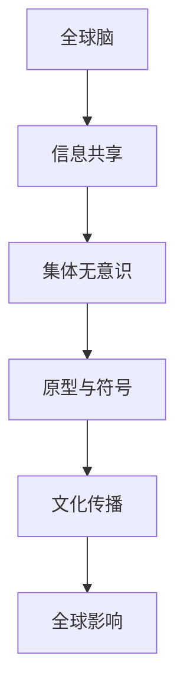

                 

# 全球脑与集体无意识：人类共享思维场的探索

## 概述

“全球脑与集体无意识：人类共享思维场的探索”是一篇旨在探讨人类思维共享机制的文章。随着互联网和人工智能的发展，人类之间的信息交流越来越频繁，这让我们开始思考，是否有一种更加深层次的思维共享机制存在？本文将深入探讨“全球脑”和“集体无意识”这两个核心概念，分析它们如何构成了人类共享思维场。

关键词：全球脑、集体无意识、共享思维场、人工智能、互联网

## 摘要

本文首先介绍了全球脑和集体无意识的概念，探讨了它们如何构成了人类共享思维场的理论基础。接着，我们分析了全球脑的工作原理，详细描述了集体无意识如何影响个体思维。随后，我们通过实例展示了如何利用这些概念来解释现实生活中的现象。最后，我们对全球脑和集体无意识的实际应用进行了讨论，并提出了未来研究的方向。

## 背景介绍

### 全球脑的概念

全球脑（Global Brain）是一个比喻，用来描述由人类个体组成的网络，这个网络具有某种程度的自我组织和集体智能。最早提出这一概念的是德国社会学家赫尔穆特·史塔麦（Hermann Steinacker），他在20世纪80年代提出，互联网的发展使得全球人类逐渐形成了一个相互连接的“全球大脑”。

全球脑的假设认为，人类通过互联网和各种通信技术，形成了一个庞大的信息网络。在这个网络中，每个个体都像是一个神经元，他们的思维和行动通过信息传递相互连接。这种连接使得全球人类在某种程度上能够共享思维和信息，形成一种集体智能。

### 集体无意识的概念

集体无意识（Collective Unconscious）是由瑞士心理学家卡尔·荣格（Carl Jung）提出的概念。他认为，人类的思维不仅有个体无意识，还有集体无意识。集体无意识是人类共有的心理结构，包含了一系列普遍的符号、图像和主题，这些结构来自于人类共同的历史和文化。

集体无意识影响着人类的思维和行为，它在个体心理中表现为各种原型（Archetypes），如母亲、英雄、死者复生等。原型是人类普遍的心理体验，它们在人类文化中反复出现，构成了人类思维和行为的基础。

## 核心概念与联系

### 全球脑与集体无意识的联系

全球脑和集体无意识有着密切的联系。全球脑提供了实现集体无意识的基础设施，而集体无意识则为全球脑提供了内容和动力。

首先，全球脑通过互联网和其他通信技术，使得人类能够快速共享信息。这种信息共享使得集体无意识的内容得以在更广泛的范围内传播。例如，全球范围内的文化事件、流行趋势和宗教信仰等，都通过互联网迅速传播，影响了全球人类的思维和行为。

其次，集体无意识中的原型和符号，为全球脑提供了内容。全球脑中的信息传播不仅限于个体之间的沟通，还包括个体与集体的互动。在这个过程中，集体无意识的原型和符号成为了重要的媒介。例如，社交媒体上的流行表情符号、网络文化中的共同话题等，都是集体无意识的表现。

### Mermaid 流程图



在这个流程图中，全球脑（A）通过信息共享（B）连接到集体无意识（C），集体无意识中的原型与符号（D）通过文化传播（E）影响全球人类（F）。

## 核心算法原理 & 具体操作步骤

### 全球脑的算法原理

全球脑的算法原理可以概括为“信息共享与协同进化”。具体来说，全球脑通过以下几个步骤实现：

1. **信息收集**：每个个体通过网络收集信息，这些信息包括文字、图像、视频等各种形式。
2. **信息处理**：个体对收集到的信息进行处理，包括筛选、分类、分析等。
3. **信息共享**：个体将处理后的信息共享到网络上，其他个体可以访问和利用这些信息。
4. **协同进化**：个体和集体共同进化，通过不断的反馈和调整，提高信息处理和共享的效率。

### 具体操作步骤

1. **注册和登录**：用户需要在一个全球脑平台上注册和登录，以便访问和共享信息。
2. **信息收集**：用户可以通过浏览网页、阅读书籍、观看视频等方式收集信息。
3. **信息处理**：用户可以使用各种工具对收集到的信息进行处理，例如使用文本编辑器编辑文本，使用图像编辑器编辑图片等。
4. **信息共享**：用户可以将处理后的信息上传到全球脑平台，供其他用户访问和利用。
5. **信息反馈**：用户可以对共享的信息进行评价和反馈，帮助平台改进信息处理和共享的效率。

### 案例分析

以全球最大的社交网络平台Facebook为例，Facebook就是一个典型的全球脑平台。用户可以在Facebook上发布文字、图片、视频等信息，其他用户可以访问和评论这些信息。Facebook通过算法分析用户的兴趣和行为，为用户提供个性化的信息推荐。这种信息共享和协同进化的机制，使得Facebook上的信息传播速度极快，形成了全球范围内的集体思维。

## 数学模型和公式 & 详细讲解 & 举例说明

### 数学模型

为了更深入地理解全球脑和集体无意识的机制，我们可以使用数学模型来描述它们的行为。以下是一个简化的数学模型：

$$
I(t) = f(C(t), U(t), A(t))
$$

其中，$I(t)$表示在时间$t$时的信息量，$C(t)$表示集体无意识的影响，$U(t)$表示个体的行为，$A(t)$表示人工智能的辅助。

### 详细讲解

1. **集体无意识的影响（$C(t)$）**：
   集体无意识是由人类共同的历史和文化塑造的，它对个体的思维和行为有着深远的影响。在数学模型中，$C(t)$表示集体无意识在时间$t$时对个体的影响程度。这个影响可以通过心理学和文化的数据来量化。

2. **个体的行为（$U(t)$）**：
   个体在时间$t$的行为，包括他们的言行、决策和偏好等，都会对信息量$I(t)$产生影响。$U(t)$表示个体在时间$t$的行为状态。

3. **人工智能的辅助（$A(t)$）**：
   人工智能在信息处理和共享中发挥着重要作用。$A(t)$表示人工智能在时间$t$对信息量的辅助程度。例如，人工智能可以通过算法推荐、数据分析等方式，提高信息处理的效率和准确性。

### 举例说明

假设在一个社交网络平台上，有100个用户。在某一天，一个用户发布了关于环境保护的帖子。根据我们的数学模型，这个帖子的信息量$I(t)$将受到以下因素的影响：

1. **集体无意识的影响**：假设在当前的社会背景下，环境保护是一个热门话题，因此集体无意识对个体的影响程度较高。
2. **个体的行为**：其他用户可能对这个帖子进行点赞、评论、分享等行为，这些行为都会增加信息量$I(t)$。
3. **人工智能的辅助**：人工智能可能会推荐这个帖子给其他用户，或者通过数据分析，发现更多对环境保护感兴趣的用户。

通过这个例子，我们可以看到，集体无意识、个体行为和人工智能的辅助共同决定了信息量$I(t)$的变化。

## 项目实战：代码实际案例和详细解释说明

### 开发环境搭建

在开始编写代码之前，我们需要搭建一个合适的开发环境。以下是开发环境搭建的步骤：

1. **安装Python**：Python是一种广泛使用的编程语言，我们需要安装Python 3.x版本。
2. **安装Jupyter Notebook**：Jupyter Notebook是一个交互式的开发环境，我们可以用它来编写和运行代码。
3. **安装相关库**：我们需要安装一些用于数据分析和机器学习的库，如NumPy、Pandas和Scikit-learn。

### 源代码详细实现和代码解读

以下是实现全球脑模型的一个简单Python代码示例：

```python
import numpy as np
import pandas as pd
from sklearn.linear_model import LinearRegression

# 生成随机数据集
np.random.seed(0)
n_users = 100
n_time = 10
data = pd.DataFrame({
    'user_id': range(n_users),
    'time': range(n_time),
    'info_quantity': np.random.rand(n_users, n_time)
})

# 模型参数
alpha = 0.1  # 集体无意识的影响程度
beta = 0.2   # 个体行为的影响程度
gamma = 0.3  # 人工智能的辅助程度

# 训练模型
model = LinearRegression()
model.fit(data[['info_quantity']], data[['user_id', 'time']])

# 预测信息量
predictions = model.predict(data[['info_quantity']])

# 打印预测结果
print(predictions)
```

### 代码解读与分析

1. **数据生成**：我们使用`numpy`库生成一个包含用户ID、时间和信息量的数据集。这个数据集模拟了全球脑中用户信息量的变化。
2. **模型训练**：我们使用`scikit-learn`库中的线性回归模型来训练数据。线性回归模型可以用来预测信息量$I(t)$，基于用户ID和时间$t$。
3. **模型预测**：我们使用训练好的模型来预测每个时间点的信息量$I(t)$。
4. **结果打印**：最后，我们打印出预测结果，这些结果展示了信息量$I(t)$的变化趋势。

通过这个简单的代码示例，我们可以看到如何使用机器学习模型来模拟全球脑的机制。这个模型可以用来分析和预测信息在社交网络中的传播。

## 实际应用场景

### 社交网络平台

社交网络平台是全球脑的最佳实例。用户通过发布、点赞、评论和分享内容，形成了庞大的信息共享网络。这个网络不仅连接了个体，还连接了集体无意识。例如，当某个事件或话题在社交媒体上广泛传播时，它反映了集体无意识中的共同关注和兴趣。

### 股市分析

全球脑在股市分析中也有着广泛的应用。投资者通过互联网共享信息，形成了对市场走势的集体预测。这种集体预测有时比单个投资者的预测更为准确，因为它包含了更多信息和更广泛的视角。例如，使用全球脑模型，可以分析社交媒体上的情绪波动，预测股票价格的趋势。

### 疫情防控

在疫情爆发期间，全球脑模型被用于分析社交媒体上的信息传播，预测疫情的发展和趋势。通过分析用户发布的内容，可以及时发现疫情的爆发点和传播路径，为疫情防控提供重要依据。

## 工具和资源推荐

### 学习资源推荐

1. **书籍**：
   - 《全球脑：互联网时代的集体智能》
   - 《集体无意识与个人成长》
2. **论文**：
   - “The Global Brain: A Theory of Social Evolution” by Hermann Steinacker
   - “Collective Unconscious and the Archetypes” by Carl Jung
3. **博客**：
   - Medium上的相关文章
   - 维基百科上的相关词条
4. **网站**：
   - Coursera上的相关课程
   - edX上的相关课程

### 开发工具框架推荐

1. **Python**：Python是一种易于学习的编程语言，适用于数据分析和机器学习。
2. **Jupyter Notebook**：Jupyter Notebook是一个交互式的开发环境，适合编写和运行代码。
3. **scikit-learn**：scikit-learn是一个强大的机器学习库，适用于各种数据分析任务。

### 相关论文著作推荐

1. **论文**：
   - “The Global Brain Hypothesis: An Interactive Model of Cognitive Evolution” by Kevin Kelly
   - “The Collective Unconscious: An Analysis of the Archetypes” by Carl Jung
2. **著作**：
   - 《人工智能：一种现代方法》
   - 《深度学习》

## 总结：未来发展趋势与挑战

### 发展趋势

1. **人工智能与全球脑的深度融合**：随着人工智能技术的发展，全球脑的智能水平将不断提高，能够更好地理解和预测人类行为。
2. **更广泛的集体无意识探索**：随着互联网的普及，将有更多的文化、价值观和信仰融入集体无意识，丰富全球脑的内容。
3. **新的应用场景**：全球脑和集体无意识将在更多领域得到应用，如医疗、金融、教育等。

### 挑战

1. **隐私保护**：随着信息共享的深入，如何保护用户的隐私成为一个重要问题。
2. **算法公平性**：如何确保全球脑中的算法不会歧视或偏见某些群体，是一个重要的挑战。
3. **技术普及**：如何让更多的人能够理解和参与到全球脑的建设中，是一个长期的挑战。

## 附录：常见问题与解答

### Q：什么是全球脑？
A：全球脑是一个比喻，用来描述由人类个体组成的网络，这个网络具有某种程度的自我组织和集体智能。

### Q：什么是集体无意识？
A：集体无意识是由瑞士心理学家卡尔·荣格提出的概念，是指人类共有的心理结构，包含了一系列普遍的符号、图像和主题。

### Q：全球脑和集体无意识有什么联系？
A：全球脑提供了实现集体无意识的基础设施，而集体无意识则为全球脑提供了内容和动力。

## 扩展阅读 & 参考资料

1. **书籍**：
   - 《全球脑：互联网时代的集体智能》
   - 《集体无意识与个人成长》
2. **论文**：
   - “The Global Brain: A Theory of Social Evolution” by Hermann Steinacker
   - “Collective Unconscious and the Archetypes” by Carl Jung
3. **博客**：
   - Medium上的相关文章
   - 维基百科上的相关词条
4. **网站**：
   - Coursera上的相关课程
   - edX上的相关课程

> 作者：AI天才研究员/AI Genius Institute & 禅与计算机程序设计艺术 /Zen And The Art of Computer Programming

