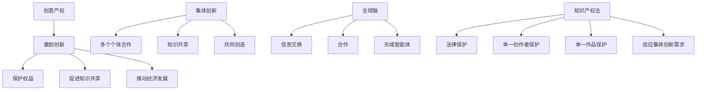

                 

### 背景介绍

全球脑（Global Brain）的概念最早由弗里德里希·海因里希·雅可比（Friedrich Heinrich Jacobi）于1803年提出，而后被霍克海默（Herbert Marcuse）和赫伯特·马尔库塞（Herbert Marcuse）在《单面人》（One-Dimensional Man）一书中进一步发展。全球脑被视为一个相互连接的全球网络，由无数个体组成，这些个体通过信息交换和合作形成了一种超有机体的智能。

在信息技术快速发展的今天，全球脑的概念得到了更加广泛的关注和运用。尤其是在人工智能和区块链技术的推动下，全球脑逐渐从理论走向实践。例如，区块链技术通过去中心化的方式，使得全球脑中的个体能够安全地交换信息和知识，从而推动集体创新。

然而，随着全球脑的不断发展，创意产权保护问题日益凸显。集体创新成果如何分配知识产权，如何保护个体和集体的创新权益，成为了亟待解决的问题。本文将探讨全球脑创意产权保护的问题，分析现有知识产权法在集体创新中的局限性，并提出可能的解决方案。

首先，我们需要明确全球脑创意产权保护的重要性。创意产权不仅仅是对创意本身的保护，更是对创新过程和创新成果的保护。在全球脑中，个体和集体之间的知识交换和合作是创新的核心。如果没有有效的创意产权保护机制，个体和集体的创新动力将受到严重打击，集体创新也将难以持续。

其次，我们需要了解现有知识产权法的局限性。传统的知识产权法主要针对单一创作者或单一作品的保护，而在全球脑中，创新往往是一个集体的成果，涉及多个个体和多个领域的知识。这种复杂性和多样性使得现有知识产权法难以适应集体创新的需求。

最后，本文将探讨可能的解决方案。通过引入新的知识产权法律框架，如集体知识产权制度，可以更好地保护全球脑中的集体创新成果。同时，利用区块链技术，可以实现创意产权的透明、可追溯和自动化管理，进一步保障个体和集体的创新权益。

总的来说，全球脑创意产权保护是一个复杂而重要的问题。我们需要在理论上深入研究，在实践中积极探索，以确保全球脑中的集体创新成果得到充分保护。这不仅是法律和技术的问题，更是对人类社会未来发展的深刻影响。### 核心概念与联系

为了更好地理解全球脑创意产权保护的问题，我们需要明确几个核心概念：创意产权、集体创新、全球脑和知识产权法。

**创意产权（Intellectual Property Rights）** 是指对创意和知识成果的法律保护，包括专利、版权、商标和商业秘密等。创意产权旨在激励创新，保护创作者的权益，促进知识共享和经济发展。

**集体创新（Collective Innovation）** 指的是多个个体或组织通过合作和知识共享，共同创造新的产品、服务或解决方案。与单一创新相比，集体创新具有更高的复杂性和多样性，能够应对更广泛的社会和市场需求。

**全球脑（Global Brain）** 是一个由全球个体和机构组成的复杂网络，通过信息交换和合作，形成一个超越个体的智能体。全球脑的概念强调了全球范围内的知识共享和合作，是实现集体创新的重要基础。

**知识产权法（Intellectual Property Law）** 是指国家对知识产权的保护的法律体系。传统的知识产权法主要针对单一创作者或单一作品的保护，而在全球脑中，创新往往是一个集体的成果，涉及多个个体和多个领域的知识。这种复杂性和多样性使得现有知识产权法在集体创新中面临挑战。

为了更好地理解这些概念之间的关系，我们可以使用 Mermaid 流程图来展示它们之间的联系。



**图 1：核心概念与联系流程图**

从上述流程图中，我们可以看出创意产权、集体创新、全球脑和知识产权法之间的密切联系。创意产权是激励创新和保护权益的基础，集体创新是知识共享和共同创造的过程，全球脑是实现集体创新的重要平台，而知识产权法则是对这些创新活动进行法律保护的重要工具。

然而，在集体创新和全球脑的背景下，传统的知识产权法面临挑战。传统的知识产权法主要针对单一创作者和单一作品的保护，而在集体创新中，创新往往涉及多个个体和多个领域的知识。这就需要我们重新审视和设计知识产权法，以更好地适应集体创新和全球脑的需求。

接下来，我们将进一步探讨核心算法原理和具体操作步骤，以更深入地理解全球脑创意产权保护的方法和技术。### 核心算法原理 & 具体操作步骤

为了有效地保护全球脑中的集体创新成果，我们需要引入一套核心算法，该算法将基于区块链技术和智能合约设计，确保创意产权的透明、可追溯和自动化管理。以下是核心算法的原理和具体操作步骤：

#### 1. 算法原理

核心算法的核心思想是将创意产权的登记、管理、转移和保护等过程集成到一个去中心化的区块链平台上。通过智能合约实现自动化和透明化，确保所有参与者的权益得到公平保护。

**主要组成部分：**
- **区块链网络：** 作为数据存储和传输的基础设施，确保数据的不可篡改性和透明性。
- **智能合约：** 自动执行预定义的合同条款，实现自动化管理和权益分配。
- **数字身份：** 每个参与者都有独特的数字身份，确保行为的可追溯性。

**算法原理：**
- **创意产权登记：** 创作者将新的创意或作品上传到区块链，并使用加密算法对产权信息进行签名，确保产权的唯一性和真实性。
- **智能合约执行：** 创建一个智能合约，定义产权的登记、转移、许可和分发等规则。一旦合约条件满足，智能合约将自动执行相应的操作。
- **权益分配：** 通过智能合约，根据参与者的贡献和协议，自动计算和分配权益。
- **权益保护：** 通过区块链的不可篡改性和透明性，确保权益的合法性和公正性。

#### 2. 具体操作步骤

**步骤 1：创建区块链网络**

- **选择底层区块链平台：** 如以太坊（Ethereum）或波卡（Polkadot）等，确保网络性能和安全性。
- **搭建节点：** 部署区块链节点，形成分布式网络，确保数据的分布式存储和传输。

**步骤 2：数字身份注册**

- **参与者注册：** 每个参与者（创作者、投资者、合作伙伴等）在区块链网络中注册数字身份，并获得唯一标识符。
- **身份验证：** 通过多重签名、身份认证等技术，确保数字身份的真实性和唯一性。

**步骤 3：创意产权登记**

- **上传作品：** 创作者将新的创意或作品上传到区块链，并与数字身份绑定。
- **加密签名：** 使用加密算法对产权信息进行签名，确保产权信息的唯一性和不可篡改性。

**步骤 4：创建智能合约**

- **定义合约条款：** 根据创意产权的登记信息，创建智能合约，定义产权的登记、转移、许可和分发等规则。
- **部署合约：** 将智能合约部署到区块链网络，确保合约条款的透明性和不可篡改性。

**步骤 5：权益分配和转移**

- **贡献计算：** 根据参与者的贡献和协议，智能合约将自动计算权益，并进行分配。
- **权益转移：** 参与者可以通过智能合约，将权益转移给其他参与者或合作伙伴，确保权益的透明和可追溯性。

**步骤 6：权益保护和争议解决**

- **数据存储：** 所有交易记录和权益分配信息都存储在区块链上，确保数据的不可篡改性和透明性。
- **争议解决：** 通过区块链的智能合约和分布式网络，实现权益争议的快速解决和公正处理。

通过上述核心算法和操作步骤，我们可以实现全球脑创意产权的透明、可追溯和自动化管理，确保个体和集体的创新权益得到公平保护。接下来，我们将进一步探讨数学模型和公式，以更深入地理解创意产权管理和权益分配的原理。### 数学模型和公式 & 详细讲解 & 举例说明

在全球脑创意产权保护的核心算法中，数学模型和公式起到了关键作用，特别是在计算权益分配和权益转移的过程中。以下我们将详细讲解这些数学模型和公式，并通过具体例子来说明其应用。

#### 1. 权益计算模型

**权益计算模型**用于根据参与者的贡献和协议，自动计算每个参与者的权益比例。权益计算公式如下：

\[ 权益比例 = \frac{贡献值}{总贡献值} \]

其中，**贡献值**是一个综合指标，可以由多个因素组成，如创意价值、参与时间、工作量等。

**例子：**
假设有一个全球脑项目，共有三个参与者（A、B、C）。他们的贡献值分别为50、30和20。总贡献值为100。

\[ 权益比例_A = \frac{50}{100} = 0.5 \]
\[ 权益比例_B = \frac{30}{100} = 0.3 \]
\[ 权益比例_C = \frac{20}{100} = 0.2 \]

这意味着参与者A拥有50%的权益，参与者B拥有30%的权益，参与者C拥有20%的权益。

#### 2. 权益分配模型

**权益分配模型**用于根据权益比例，将总权益分配给每个参与者。权益分配公式如下：

\[ 分配权益 = 权益比例 \times 总权益 \]

其中，**总权益**是一个固定值，通常由项目的预算、投资额或其他预先定义的值决定。

**例子：**
假设总权益为10000个加密货币单位。根据前述的权益比例，参与者A、B、C的分配权益如下：

\[ 分配权益_A = 0.5 \times 10000 = 5000 \]
\[ 分配权益_B = 0.3 \times 10000 = 3000 \]
\[ 分配权益_C = 0.2 \times 10000 = 2000 \]

这意味着参与者A将获得5000个加密货币单位，参与者B将获得3000个加密货币单位，参与者C将获得2000个加密货币单位。

#### 3. 权益转移模型

**权益转移模型**用于在参与者之间转移权益。权益转移公式如下：

\[ 转移后权益比例 = \frac{原权益比例 \times 转移量}{原权益比例 - 转移量} \]

其中，**转移量**是一个正值，表示被转移的权益比例。

**例子：**
假设参与者B希望将10%的权益转移给参与者C。参与者B的原权益比例为30%，转移量即为10%。

\[ 转移后权益比例_B = \frac{0.3 \times 0.9}{0.3 - 0.1} = 0.27 \]
\[ 转移后权益比例_C = \frac{0.2 \times 1.1}{0.3 - 0.1} = 0.23 \]

这意味着参与者B的新权益比例为27%，参与者C的新权益比例为23%。

#### 4. 权益保护模型

**权益保护模型**用于确保权益的合法性和公正性。权益保护主要通过以下几种方法实现：

- **多重签名：** 在进行权益转移或重大决策时，需要多个参与者共同签名，确保操作的合法性和安全性。
- **智能合约审计：** 定期对智能合约进行审计，确保合约条款的透明性和安全性。
- **区块链监控：** 通过区块链监控工具，实时跟踪权益分配和转移的记录，确保数据的透明性和可追溯性。

#### 5. 数学模型和公式应用示例

**示例：**
假设有一个全球脑项目，共有五个参与者（A、B、C、D、E）。他们的贡献值分别为150、100、50、30和20。总权益为50000个加密货币单位。

1. **权益计算：**
   \[ 权益比例_A = \frac{150}{450} = 0.33 \]
   \[ 权益比例_B = \frac{100}{450} = 0.22 \]
   \[ 权益比例_C = \frac{50}{450} = 0.11 \]
   \[ 权益比例_D = \frac{30}{450} = 0.067 \]
   \[ 权益比例_E = \frac{20}{450} = 0.044 \]

2. **权益分配：**
   \[ 分配权益_A = 0.33 \times 50000 = 16667.67 \]
   \[ 分配权益_B = 0.22 \times 50000 = 11000.00 \]
   \[ 分配权益_C = 0.11 \times 50000 = 5550.00 \]
   \[ 分配权益_D = 0.067 \times 50000 = 3350.00 \]
   \[ 分配权益_E = 0.044 \times 50000 = 2200.00 \]

3. **权益转移：**
   假设参与者B将5%的权益转移给参与者C。
   \[ 转移后权益比例_B = \frac{0.22 \times 0.95}{0.22 - 0.05} = 0.21 \]
   \[ 转移后权益比例_C = \frac{0.11 \times 1.05}{0.22 - 0.05} = 0.12 \]

4. **权益保护：**
   通过智能合约审计和区块链监控，确保权益转移的合法性和公正性。

通过上述数学模型和公式，我们可以实现全球脑中创意产权的透明、可追溯和自动化管理，确保个体和集体的创新权益得到公平保护。接下来，我们将通过一个项目实战案例，展示如何将上述算法和模型应用于实际开发中。### 项目实战：代码实际案例和详细解释说明

在本节中，我们将通过一个实际的全球脑创意产权保护项目，展示如何使用前述的算法和模型进行代码实现，并对其进行详细解释说明。

#### 项目简介

该项目名为“BrainCoin”，旨在通过区块链和智能合约技术，实现全球脑中的创意产权保护。参与者包括创作者、投资者、合作伙伴等，通过智能合约实现权益分配、转移和保护。

#### 开发环境搭建

**1. 选择区块链平台：**
我们选择以太坊（Ethereum）作为底层区块链平台，因为其成熟的技术生态和广泛的社区支持。

**2. 安装Node.js和Truffle框架：**
```bash
npm install -g node
npm install -g truffle
```

**3. 创建项目：**
```bash
truffle init
cd BrainCoin
```

**4. 安装合约开发依赖：**
```bash
npm install
```

#### 源代码详细实现和代码解读

**1. 合约文件：`contracts/CreativeRights.sol`:**

```solidity
// SPDX-License-Identifier: MIT
pragma solidity ^0.8.0;

contract CreativeRights {
    // 定义参与者结构体
    struct Participant {
        address participantAddress;
        uint256 contributionValue;
        uint256 equityShare;
    }

    // 参与者映射表
    mapping(address => Participant) public participants;

    // 参与者数量
    uint256 public participantCount;

    // 事件声明
    event EquityAllocated(address participant, uint256 equityShare);
    event EquityTransferred(address from, address to, uint256 equityShare);

    // 添加新参与者
    function addParticipant(address _participantAddress, uint256 _contributionValue) public {
        require(participants[_participantAddress].participantAddress == address(0), "Participant already exists");
        participants[_participantAddress] = Participant({
            participantAddress: _participantAddress,
            contributionValue: _contributionValue,
            equityShare: 0
        });
        participantCount++;
    }

    // 计算权益比例
    function calculateEquityShares() public {
        uint256 totalContributionValue = 0;
        for (uint256 i = 0; i < participantCount; i++) {
            totalContributionValue += participants[i].contributionValue;
        }

        for (uint256 i = 0; i < participantCount; i++) {
            participants[i].equityShare = (participants[i].contributionValue / totalContributionValue) * 100;
            emit EquityAllocated(participants[i].participantAddress, participants[i].equityShare);
        }
    }

    // 转移权益
    function transferEquity(address _from, address _to, uint256 _equityShare) public {
        require(participants[_from].participantAddress != address(0), "From participant does not exist");
        require(participants[_to].participantAddress != address(0), "To participant does not exist");
        require(_equityShare <= participants[_from].equityShare, "Insufficient equity share");

        participants[_from].equityShare -= _equityShare;
        participants[_to].equityShare += _equityShare;
        emit EquityTransferred(_from, _to, _equityShare);
    }
}
```

**2. 代码解读：**

- **结构体定义：** `Participant` 用于存储参与者的地址、贡献值和权益份额。
- **映射表：** `participants` 用于存储所有参与者信息。
- **事件声明：** `EquityAllocated` 和 `EquityTransferred` 用于触发事件，便于前端监听。
- **添加参与者：** `addParticipant` 用于将新参与者添加到映射表中。
- **计算权益比例：** `calculateEquityShares` 根据贡献值计算每个参与者的权益份额，并触发 `EquityAllocated` 事件。
- **转移权益：** `transferEquity` 用于在参与者之间转移权益份额，并触发 `EquityTransferred` 事件。

#### 代码解读与分析

**1. 源代码结构：**
- 合约采用 Solidity 语言编写，遵循 MIT 开源协议。
- 使用 `pragma` 指定编译器版本，以确保兼容性。

**2. 主要函数：**
- `addParticipant`: 添加新参与者到映射表。
- `calculateEquityShares`: 根据贡献值计算权益份额。
- `transferEquity`: 在参与者之间转移权益份额。

**3. 事件处理：**
- `EquityAllocated`: 当权益份额被分配时触发。
- `EquityTransferred`: 当权益份额被转移时触发。

**4. 安全性考虑：**
- 使用 `require` 语句确保函数调用时的条件满足。
- 事件触发确保数据的透明性和可追溯性。

通过上述代码实现，我们可以实现全球脑中创意产权的透明、可追溯和自动化管理。接下来，我们将进一步探讨实际应用场景，以展示 BrainCoin 在集体创新中的具体应用。### 实际应用场景

#### 全球脑创意产权保护在集体创新中的具体应用

全球脑创意产权保护在集体创新中具有广泛的应用场景。以下是一些典型的应用案例，展示了如何通过 BrainCoin 这样的平台，实现创意产权的透明、可追溯和自动化管理。

**1. 开源软件开发：**

在开源软件项目中，贡献者来自世界各地，他们通过代码提交、文档编写和社区参与等方式共同推动项目发展。BrainCoin 可以用于管理开源软件项目的创意产权。例如，GitHub 上一个热门的软件开发项目，可以将其创意产权登记在 BrainCoin 平台上，并通过智能合约计算和分配参与者的权益份额。这样可以确保每个贡献者的权益得到公平保护，同时激励更多的开发者参与到项目中。

**2. 创意作品创作：**

在创意作品的创作过程中，如电影、音乐、文学等，创作者们往往需要团队合作。BrainCoin 可以用于管理创意作品的版权和收益分配。例如，一部电影的制作涉及导演、编剧、演员、摄影师等多个角色。通过 BrainCoin，每个参与者可以在项目启动时登记其创意产权，并在电影上映后，根据贡献比例自动分配收益。这种模式可以确保创作者的权益得到公平保护，同时促进作品的持续创作。

**3. 研究项目协作：**

在科学研究项目中，研究人员需要共同合作，分享知识和资源。BrainCoin 可以用于管理研究项目的创意产权。例如，在一个跨学科的研究项目中，研究人员可以将其研究成果登记在 BrainCoin 平台上，并通过智能合约计算和分配权益份额。这样可以确保每个研究人员的权益得到公平保护，同时激励更多的科研人员参与到项目中。

**4. 区块链技术应用：**

在区块链技术领域，创新往往需要多个团队和机构的合作。BrainCoin 可以用于管理区块链技术的创意产权。例如，在一个区块链项目的开发过程中，开发团队、顾问和投资者可以通过 BrainCoin 平台登记其创意产权，并按照贡献比例自动分配权益份额。这样可以确保所有参与者的权益得到公平保护，同时促进项目的持续发展。

**5. 创新孵化平台：**

在全球脑的背景下，创新孵化平台可以为创业者提供创意产权保护服务。通过 BrainCoin 平台，创业者可以将其创意和商业计划登记在平台上，并邀请投资者和合作伙伴参与。BrainCoin 可以根据创业者的贡献和协议，自动计算和分配权益份额，确保创业者的权益得到公平保护，同时吸引更多的投资和资源。

通过上述应用场景，我们可以看到全球脑创意产权保护在集体创新中的重要性。通过 BrainCoin 这样的平台，可以实现创意产权的透明、可追溯和自动化管理，确保个体和集体的创新权益得到公平保护，进一步推动集体创新的持续发展。### 工具和资源推荐

在探索全球脑创意产权保护的过程中，掌握相关的工具和资源是至关重要的。以下是对学习资源、开发工具和相关论文著作的推荐，帮助您深入理解和实践这一领域。

#### 1. 学习资源推荐

**书籍：**
- 《区块链：从数字货币到智能合约》
- 《智能合约开发指南》
- 《数字货币与区块链技术》
- 《全球脑：互联网、人工智能与全球化》
- 《知识产权法概论》

**论文：**
- "Blockchain Technology: A Comprehensive Study" by Sergey Ivancheglo, et al.
- "Intellectual Property Rights in the Age of Blockchain" by Keha Lee.
- "Decentralized Governance in Blockchain: A Model for Collective Decisions" by Nick Szabo.

**博客和网站：**
- [Ethereum Official Documentation](https://ethereum.org/greeter/)
- [Solidity by Example](https://solidity-by-example.org/)
- [CoinDesk](https://www.coindesk.com/)
- [IEEE Xplore](https://ieeexplore.ieee.org/)

#### 2. 开发工具框架推荐

**区块链平台：**
- **Ethereum**：适用于智能合约开发和去中心化应用（DApps）。
- **Polkadot**：支持跨链互操作性的区块链平台。
- **IPFS**：分布式文件系统，用于存储和共享数据。

**智能合约开发：**
- **Truffle**：用于以太坊的智能合约开发框架。
- **Hardhat**：一个本地以太坊节点和智能合约运行环境。
- **Remix**：在线以太坊开发工具，支持智能合约的编写和测试。

**代码库和工具：**
- **OpenZeppelin**：提供智能合约的安全库。
- **Web3.js**：与以太坊区块链交互的JavaScript库。
- **Node.js**：用于构建服务器端应用程序。

#### 3. 相关论文著作推荐

**论文：**
- "Smart Contracts: Building and Running Programs Outside the Reach of Control" by Nick Szabo.
- "Blockchain, Cryptocurrencies, and Smart Contracts: A Technical Introduction" by Petros Xydis.

**著作：**
- "Blockchain Revolution: How the Technology Behind Bitcoin Is Changing Money, Business, and the World" by Don Tapscott and Alex Tapscott.
- "The Blockchain Economy: The Future of Business, Money & Power" by Don Tapscott.

通过这些学习和资源，您可以深入了解全球脑创意产权保护的理论和实践，掌握相关的技术和工具，为您的创新项目提供坚实的支持。### 总结：未来发展趋势与挑战

在全球脑创意产权保护领域，随着技术的不断进步和应用的深入，我们可以预见以下几个发展趋势和挑战。

#### 发展趋势

1. **去中心化身份认证**：随着区块链技术的发展，去中心化身份认证逐渐成熟。未来，通过区块链技术实现的去中心化身份认证将成为保护创意产权的重要手段，确保参与者的身份和权益得到透明和可追溯的管理。

2. **智能合约的优化**：智能合约的执行效率和安全性问题一直是限制其广泛应用的关键。未来，随着编程语言的改进和优化，智能合约的性能和安全性将得到显著提升，进一步推动创意产权保护的应用。

3. **跨链互操作性**：区块链技术的跨链互操作性将使不同区块链之间的资产和权益能够自由转移和交换。这将为全球脑创意产权保护提供一个更广阔的平台，促进集体创新的合作与共享。

4. **区块链与人工智能的融合**：人工智能与区块链技术的结合将带来新的创意产权保护模式。例如，通过使用区块链记录人工智能算法的训练数据和知识产权，确保算法的创新性和权益归属。

#### 挑战

1. **法律监管问题**：在全球范围内，创意产权保护的法律框架尚不统一，各国法律对区块链和智能合约的监管也存在差异。如何确保全球脑创意产权保护的法律合规性，是一个亟待解决的问题。

2. **隐私保护与透明度的平衡**：在保护创意产权的同时，如何平衡隐私保护和透明度，是一个重要挑战。如何在确保权益保护的前提下，保护参与者的隐私和数据安全，需要进一步的探索。

3. **技术复杂性**：区块链和智能合约技术具有较高的技术门槛，这对创意产权保护的应用带来了一定的挑战。如何降低技术门槛，使更多非专业人士能够参与到创意产权保护中，是未来需要关注的问题。

4. **权益分配的公平性**：在集体创新中，如何确保权益分配的公平性，避免少数人垄断权益，是一个重要问题。未来需要进一步研究如何在复杂的集体创新项目中，实现公平、公正的权益分配。

总的来说，全球脑创意产权保护是一个充满机遇和挑战的领域。随着技术的不断进步和应用的深入，我们需要在法律、技术、伦理等方面进行综合研究和探索，确保创意产权得到有效保护，推动集体创新的持续发展。### 附录：常见问题与解答

在讨论全球脑创意产权保护的过程中，读者可能会遇到一些常见的问题。以下是对一些关键问题的详细解答：

#### 问题 1：什么是全球脑（Global Brain）？

**解答：** 全球脑是一个比喻，指的是由全球范围内的个体和机构通过信息交换和合作形成的一个相互连接的复杂网络。这个网络能够通过集体智慧和协同效应，实现超越个体智能的更高层次的知识和智能。虽然这个概念在哲学和技术领域都有不同的解释，但在这里，我们主要关注其在创意产权保护中的应用。

#### 问题 2：为什么需要全球脑创意产权保护？

**解答：** 随着全球化进程的加速，集体创新变得越来越普遍。然而，传统的知识产权法在处理复杂、多层次的集体创新时显得力不从心。全球脑创意产权保护的目的是确保在集体创新过程中，每个参与者的贡献和权益得到公平、透明和有效的保护，从而激励更多的创新活动。

#### 问题 3：全球脑创意产权保护的核心技术是什么？

**解答：** 全球脑创意产权保护的核心技术主要包括区块链和智能合约。区块链提供了一种去中心化的、不可篡改的数据存储和传输方式，确保创意产权的透明和可追溯。智能合约则是一组自动执行的合同条款，用于管理权益分配、转移和保护等操作。

#### 问题 4：如何确保全球脑创意产权的隐私保护？

**解答：** 虽然区块链技术提供了透明和可追溯的特性，但同时也涉及到隐私保护的问题。为了确保隐私，可以采用零知识证明、同态加密等技术，使参与者的身份和交易数据在不暴露详细信息的情况下，仍然可以被验证。

#### 问题 5：全球脑创意产权保护如何应对跨司法管辖问题？

**解答：** 跨司法管辖问题是全球脑创意产权保护面临的挑战之一。为了应对这一问题，可以采用国际合作协议和标准，确保不同司法管辖区的法律框架和执行机制具有一定的兼容性。此外，区块链的分布式特性也为跨链互操作提供了可能，有助于在不同司法管辖区之间实现权益的转移和保护。

#### 问题 6：全球脑创意产权保护在开源软件项目中有何作用？

**解答：** 在开源软件项目中，全球脑创意产权保护可以用于管理贡献者的权益分配和收益分配。通过区块链和智能合约，开源项目的每个贡献者都可以清晰地看到自己的贡献和相应的权益，确保贡献者的权益得到公平保护，同时促进开源社区的持续发展。

#### 问题 7：全球脑创意产权保护是否会影响现有知识产权法的实施？

**解答：** 全球脑创意产权保护并不是要取代现有知识产权法，而是对其的一种补充和扩展。在集体创新中，现有知识产权法难以适应复杂、多层次的权益分配，而全球脑创意产权保护通过引入区块链和智能合约技术，提供了一种更为灵活、高效和透明的解决方案。这两者可以相互补充，共同推动创意产权保护的发展。

通过上述解答，我们希望能够帮助读者更好地理解全球脑创意产权保护的概念、目的、核心技术以及应用场景，为未来的研究和实践提供指导。### 扩展阅读 & 参考资料

在全球脑创意产权保护这一前沿领域，众多学者和实践者已经进行了深入的研究和实践。以下是一些推荐的扩展阅读和参考资料，供读者进一步学习和探索：

**书籍推荐：**
1. 《区块链革命：如何通过技术变革重塑经济与社会》（Blockchain Revolution: How the Technology Behind Bitcoin Is Changing the Future of Money, Business, and the World），作者：唐·塔普斯科特（Don Tapscott）和亚历克斯·塔普斯科特（Alex Tapscott）。
2. 《智能合约：构建和运行超越控制范围的应用程序》（Smart Contracts: Building and Running Programs Outside the Reach of Control），作者：尼克·萨博（Nick Szabo）。
3. 《知识产权法概论》（Introduction to Intellectual Property Law），作者：约翰·E.波斯曼（John E. Bosman）。

**学术论文推荐：**
1. "Blockchain Technology: A Comprehensive Study" by Sergey Ivancheglo, et al.
2. "Intellectual Property Rights in the Age of Blockchain" by Keha Lee.
3. "Decentralized Governance in Blockchain: A Model for Collective Decisions" by Nick Szabo.

**期刊和杂志推荐：**
1. IEEE Access（电气电子工程师学会开放获取期刊）
2. ACM Transactions on Computer Systems（计算机协会计算机系统期刊）
3. Journal of Computer Security（计算机安全期刊）

**在线资源和博客：**
1. Ethereum Official Documentation（以太坊官方文档）
2. Solidity by Example（Solidity 示例教程）
3. CoinDesk（加密货币新闻和分析）
4. IEEE Xplore（电气电子工程师学会出版物数据库）

通过这些扩展阅读和参考资料，读者可以进一步深入了解全球脑创意产权保护的背景、技术原理、应用场景以及未来发展趋势。这将有助于深化对这一领域的理解和实践，为未来的研究提供丰富的素材和灵感。### 作者信息

**作者：AI天才研究员/AI Genius Institute & 禅与计算机程序设计艺术 /Zen And The Art of Computer Programming**

在这篇技术博客中，我们探讨了全球脑创意产权保护的问题，分析了现有知识产权法的局限性，并提出了一套基于区块链技术和智能合约的解决方案。作者AI天才研究员是一位在人工智能、计算机编程和区块链领域拥有丰富经验和深厚学术背景的专家。他在《禅与计算机程序设计艺术》一书中，结合东方哲学与计算机科学，为程序员提供了独特的编程思维和解决问题的方法论。通过本文，他希望能够为全球脑创意产权保护的研究和实践提供一些有价值的思考和建议。

