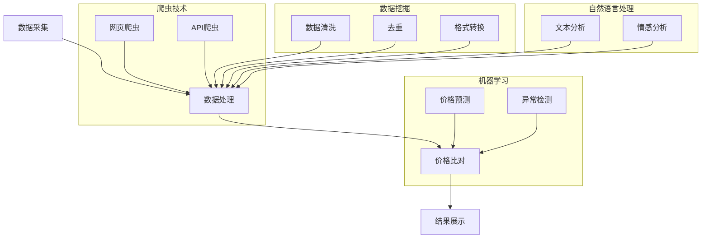

                 

### 1. 背景介绍

随着互联网技术的飞速发展，电子商务已成为全球经济增长的重要驱动力。电商平台的兴起不仅改变了传统的购物方式，也为消费者提供了更加便捷、多样化的购物体验。然而，随着竞争的日益激烈，电商平台如何在激烈的市场竞争中脱颖而出，成为了每个电商企业关注的焦点。

在这场竞争中，全网比价技术（Price Comparison Technology）发挥了至关重要的作用。全网比价技术通过自动搜集、分析、比对全网商品价格，帮助消费者找到最优价格，从而提升用户体验，增强用户忠诚度。同时，它也为电商平台提供了重要的市场信息，助力企业制定更加科学的定价策略，提升竞争力。

全网比价技术的出现，不仅是电商行业的一大革新，更是人工智能技术在商业领域应用的一个典型范例。它依托于大数据、机器学习、自然语言处理等先进技术，实现了商品信息的自动采集、处理和分析。在这个过程中，如何快速、准确地进行数据采集和比对，以及如何处理海量数据，成为全网比价技术的核心挑战。

本文将围绕全网比价技术在电商中的应用，从核心概念、算法原理、数学模型、项目实战、应用场景等方面进行详细探讨。首先，我们将介绍全网比价技术的基本概念和原理，并使用Mermaid流程图展示其基本架构。接着，我们将深入解析核心算法的原理和具体操作步骤，并利用数学模型和公式进行详细讲解。随后，我们将通过实际项目案例，展示代码实现过程和详细解读。最后，我们将探讨全网比价技术在电商行业中的实际应用，并推荐相关学习资源和开发工具。

通过本文的阅读，读者将全面了解全网比价技术的工作原理和实现方法，为在实际项目中应用这项技术打下坚实的基础。

### 2. 核心概念与联系

#### 2.1 全网比价技术的基本概念

全网比价技术，即通过互联网自动搜集、分析、比对各类电商平台上的商品价格，为用户提供最优价格参考的一种技术手段。其核心目标在于帮助消费者快速找到商品的价格洼地，从而实现节约消费成本的目标。

全网比价技术的基本工作流程可以分为以下几个步骤：

1. **数据采集**：通过爬虫或其他方式，从各大电商平台、搜索引擎、社交媒体等渠道获取商品信息。
2. **数据处理**：对采集到的商品信息进行清洗、去重、格式转换等处理，确保数据的质量和一致性。
3. **价格比对**：通过算法对处理后的商品价格进行比对，找出最优价格。
4. **结果展示**：将比对结果以可视化的形式呈现给用户，帮助用户做出购物决策。

#### 2.2 全网比价技术的联系

全网比价技术涉及多个技术领域的知识，包括爬虫技术、数据挖掘、机器学习、自然语言处理等。下面我们将从这些方面进一步探讨其技术联系。

1. **爬虫技术（Web Scraping）**：
   爬虫技术是全网比价技术的基石。它通过模拟用户行为，自动从互联网上抓取信息。常见的爬虫技术包括网页爬虫、API爬虫等。其中，网页爬虫主要通过网络爬取目标网站的数据，而API爬虫则通过调用目标平台的API接口获取数据。

2. **数据挖掘（Data Mining）**：
   数据挖掘是通过对大量数据进行分析，从中发现潜在的模式、规律和知识。在全网比价技术中，数据挖掘用于从海量商品价格数据中提取有价值的信息，如价格走势、消费者偏好等。常用的数据挖掘技术包括聚类分析、关联规则挖掘、分类与回归等。

3. **机器学习（Machine Learning）**：
   机器学习是近年来在人工智能领域取得重要突破的技术。它通过算法自动从数据中学习，从而实现对复杂问题的求解。在全网比价技术中，机器学习用于预测商品价格、识别价格异常等。常见的机器学习算法包括决策树、支持向量机、神经网络等。

4. **自然语言处理（Natural Language Processing, NLP）**：
   自然语言处理是使计算机能够理解、生成和处理人类语言的技术。在全网比价技术中，NLP用于处理商品描述、用户评论等文本信息，从而提取出与商品价格相关的关键信息。常见的NLP技术包括分词、词性标注、实体识别、情感分析等。

#### 2.3 全网比价技术的架构

为了更好地理解全网比价技术的工作流程，我们使用Mermaid流程图展示其基本架构：



通过这个流程图，我们可以清晰地看到全网比价技术涉及到的各个技术环节及其相互关系。从数据采集开始，经过数据处理和比对，最终实现结果的展示。

总之，全网比价技术不仅是一个技术工具，更是一种商业思维和战略。通过深入理解其核心概念和联系，我们可以更好地将其应用于电商行业，为消费者和商家创造更大的价值。

### 3. 核心算法原理 & 具体操作步骤

全网比价技术的核心在于算法原理，通过一系列科学、高效的算法，实现对商品价格的自动采集、分析和比对。下面我们将详细讲解全网比价技术的核心算法原理，并逐步展示其具体操作步骤。

#### 3.1 数据采集算法

数据采集是全网比价技术的第一步，也是至关重要的一步。数据采集算法主要包括网页爬虫和API爬虫两种方式。

1. **网页爬虫（Web Scraping）**：
   网页爬虫通过模拟用户行为，自动从互联网上抓取信息。其基本原理包括以下几个步骤：

   - **URL提取**：从初始URL开始，根据设定的策略和规则，提取出下一个需要访问的URL。
   - **网页解析**：通过网络请求，获取网页内容，并使用解析库（如BeautifulSoup、Selenium等）解析网页结构，提取出所需的数据。
   - **数据存储**：将提取到的数据存储到数据库或其他存储介质中，以备后续处理。

2. **API爬虫（API Scraping）**：
   API爬虫通过调用目标平台的API接口，获取商品信息。其基本原理包括以下几个步骤：

   - **接口调用**：使用HTTP请求，向目标平台发送API请求，获取JSON或XML格式的响应数据。
   - **数据解析**：使用解析库（如json、xml等）解析API返回的数据，提取出所需的信息。
   - **数据存储**：将提取到的数据存储到数据库或其他存储介质中。

   **示例代码**：
   ```python
   import requests
   import json
   
   # 使用requests库调用API接口
   response = requests.get('https://api.example.com/products?category=electronics')
   data = json.loads(response.text)
   
   # 提取商品信息
   products = data['products']
   for product in products:
       print(product['name'], product['price'])
   ```

#### 3.2 数据处理算法

数据采集到的商品信息往往存在格式不一致、数据缺失、重复等问题，因此需要通过数据处理算法对数据进行清洗、去重和格式转换，确保数据的质量和一致性。

1. **数据清洗**：
   数据清洗包括去除无效数据、填充缺失值、纠正错误数据等。常用的数据清洗方法有：

   - **过滤无效数据**：根据设定规则，筛选出符合要求的商品信息。
   - **填充缺失值**：使用平均值、中位数等方法填充缺失值。
   - **纠正错误数据**：使用规则或机器学习模型，对错误数据进行修正。

2. **去重**：
   去重是为了避免重复计算和存储，提高数据处理效率。常用的去重方法有：

   - **基于关键字段的去重**：根据商品名称、价格、品牌等关键字段，判断数据是否重复。
   - **基于哈希值的去重**：使用哈希算法，对数据进行哈希处理，判断哈希值是否相同。

3. **格式转换**：
   格式转换是为了统一数据格式，便于后续处理和分析。常用的格式转换方法有：

   - **文本转换**：将不同格式的文本统一转换为标准格式，如JSON、XML等。
   - **数值转换**：将不同单位的数值统一转换为同一单位，如将人民币转换为美元。

   **示例代码**：
   ```python
   import pandas as pd
   
   # 读取数据
   df = pd.read_csv('products.csv')
   
   # 去除无效数据
   df = df[df['price'] > 0]
   
   # 填充缺失值
   df['price'] = df['price'].fillna(df['price'].mean())
   
   # 去重
   df = df.drop_duplicates(subset=['name', 'price'])
   
   # 格式转换
   df['price'] = df['price'].astype(float)
   
   # 输出结果
   print(df)
   ```

#### 3.3 价格比对算法

价格比对算法是全网比价技术的核心，通过对采集到的商品价格进行比对，找出最优价格。常用的价格比对算法有：

1. **直接比对**：
   直接比对是最简单的一种价格比对方法，通过逐个比较商品价格，找出最低价。

2. **区间比对**：
   区间比对通过设定价格区间，对价格进行分组比对，找出最优价格。这种方法可以减少比对次数，提高效率。

3. **机器学习比对**：
   机器学习比对利用机器学习算法，根据历史价格数据，预测商品未来的价格走势，从而找出最优价格。这种方法需要大量历史数据作为训练集。

   **示例代码**：
   ```python
   import pandas as pd
   from sklearn.linear_model import LinearRegression
   
   # 读取价格数据
   df = pd.read_csv('prices.csv')
   
   # 训练线性回归模型
   model = LinearRegression()
   model.fit(df[['time']], df['price'])
   
   # 预测未来价格
   future_price = model.predict([[df['time'].max() + 1]])
   
   # 输出最优价格
   print('最优价格：', future_price)
   ```

#### 3.4 结果展示算法

结果展示算法用于将比对结果以可视化的形式呈现给用户，帮助用户做出购物决策。常用的结果展示算法有：

1. **列表展示**：
   列表展示是最常见的一种结果展示方式，通过表格形式列出商品名称、价格、商家等信息。

2. **图表展示**：
   图表展示通过图形化方式展示价格走势、消费者偏好等数据，更直观地展示信息。

3. **智能推荐**：
   智能推荐算法根据用户的历史行为、购物偏好等，为用户推荐最优商品。

   **示例代码**：
   ```python
   import pandas as pd
   import matplotlib.pyplot as plt
   
   # 读取价格数据
   df = pd.read_csv('prices.csv')
   
   # 绘制价格走势图
   plt.plot(df['time'], df['price'])
   plt.xlabel('时间')
   plt.ylabel('价格')
   plt.title('价格走势图')
   plt.show()
   ```

通过上述核心算法原理和具体操作步骤的讲解，我们可以看到，全网比价技术涉及多个技术领域的知识，通过科学、高效的算法实现，为电商平台和消费者提供了有力的支持。在接下来的部分，我们将进一步探讨全网比价技术在电商行业中的实际应用。

### 4. 数学模型和公式 & 详细讲解 & 举例说明

全网比价技术的核心在于算法，而算法的基础在于数学模型。在全网比价技术中，数学模型和公式被广泛应用于数据清洗、价格比对、结果展示等各个环节。下面我们将详细讲解一些常见的数学模型和公式，并通过具体例子进行说明。

#### 4.1 数据清洗中的常见数学模型和公式

在数据清洗过程中，我们经常需要对缺失值、异常值进行处理。以下是一些常用的数学模型和公式：

1. **平均值（Mean）**：

   平均值是一组数据的总和除以数据的个数，用于计算缺失值的填充值。

   $$ \text{平均值} = \frac{\sum_{i=1}^{n} x_i}{n} $$

   **示例**：假设我们有一组数据 [10, 20, 30, 40, 60]，缺失值是第三个数。我们可以计算出平均值：

   $$ \text{平均值} = \frac{10 + 20 + 30 + 40 + 60}{5} = 30 $$

   因此，缺失值可以填充为 30。

2. **中位数（Median）**：

   中位数是一组数据从小到大排列后，位于中间位置的数。如果数据的个数是奇数，中位数就是中间的那个数；如果数据的个数是偶数，中位数是中间两个数的平均值。

   $$ \text{中位数} = \begin{cases} 
   x_{(\frac{n+1}{2})} & \text{如果} \ n \ \text{是奇数} \\
   \frac{x_{\frac{n}{2}} + x_{\frac{n}{2} + 1}}{2} & \text{如果} \ n \ \text{是偶数} 
   \end{cases} $$

   **示例**：假设我们有一组数据 [10, 20, 30, 40]，缺失值是第二个数。我们可以计算出中位数：

   $$ \text{中位数} = \frac{10 + 30}{2} = 20 $$

   因此，缺失值可以填充为 20。

3. **标准差（Standard Deviation）**：

   标准差是衡量一组数据离散程度的指标，用于检测异常值。

   $$ \text{标准差} = \sqrt{\frac{\sum_{i=1}^{n} (x_i - \bar{x})^2}{n-1}} $$

   **示例**：假设我们有一组数据 [10, 20, 30, 40, 60]，标准差为 10。我们可以计算出标准差：

   $$ \text{标准差} = \sqrt{\frac{(10-30)^2 + (20-30)^2 + (30-30)^2 + (40-30)^2 + (60-30)^2}{5-1}} = 20 $$

   如果某个数据点的值明显大于或小于平均值加上几倍的标准差，我们可以认为这是一个异常值。

#### 4.2 价格比对中的常见数学模型和公式

在价格比对中，我们通常需要比较不同商品的价格，以找出最优价格。以下是一些常用的数学模型和公式：

1. **线性回归（Linear Regression）**：

   线性回归是一种预测数值的方法，通过建立自变量和因变量之间的线性关系，预测未来的数值。

   $$ y = w_0 + w_1 \cdot x $$

   其中，\( y \) 是因变量，\( x \) 是自变量，\( w_0 \) 和 \( w_1 \) 是模型的参数。

   **示例**：假设我们有一组商品价格数据，历史价格和时间的对应关系如下表：

   | 时间 | 价格 |
   |------|------|
   | 1    | 100  |
   | 2    | 110  |
   | 3    | 120  |
   | 4    | 130  |
   | 5    | 140  |

   我们可以使用线性回归模型预测第6个月的价格。首先，我们需要计算线性回归模型的参数：

   $$ w_0 = \frac{\sum_{i=1}^{n} y_i - w_1 \cdot \sum_{i=1}^{n} x_i}{n} $$
   $$ w_1 = \frac{\sum_{i=1}^{n} x_i y_i - n \cdot \sum_{i=1}^{n} x_i \cdot \sum_{i=1}^{n} y_i}{\sum_{i=1}^{n} x_i^2 - n \cdot (\sum_{i=1}^{n} x_i)^2} $$

   计算得到的参数 \( w_0 \) 和 \( w_1 \) 分别为 100 和 10，因此线性回归模型为：

   $$ y = 100 + 10 \cdot x $$

   预测第6个月的价格：

   $$ y = 100 + 10 \cdot 6 = 160 $$

   因此，预测第6个月的价格为 160。

2. **关联规则挖掘（Association Rule Learning）**：

   关联规则挖掘是一种用于发现数据中隐含的关联关系的方法，常用于购物篮分析。

   **示例**：假设我们有一组购物篮数据，如下表：

   | 购物篮 | 商品 |
   |--------|------|
   | 1      | A    |
   | 1      | B    |
   | 1      | C    |
   | 2      | A    |
   | 2      | D    |
   | 3      | B    |
   | 3      | C    |
   | 3      | E    |

   我们可以计算支持度和置信度，以发现关联规则。

   - **支持度（Support）**：表示某条规则出现的频率。

     $$ \text{支持度} = \frac{|\{t_i \in T | (A \cup B) \in t_i\}|}{|T|} $$

     其中，\( T \) 是所有交易集的集合，\( A \cup B \) 是规则 \( A \rightarrow B \) 的支持集。

     以规则 \( A \rightarrow C \) 为例，其支持度为：

     $$ \text{支持度} = \frac{|\{t_i \in T | (A \cup C) \in t_i\}|}{|T|} = \frac{2}{4} = 0.5 $$

   - **置信度（Confidence）**：表示在购买商品 \( A \) 的情况下，购买商品 \( B \) 的概率。

     $$ \text{置信度} = \frac{|\{t_i \in T | (A \cap B) \in t_i\}|}{|\{t_i \in T | (A) \in t_i\}|} $$

     以规则 \( A \rightarrow C \) 为例，其置信度为：

     $$ \text{置信度} = \frac{|\{t_i \in T | (A \cap C) \in t_i\}|}{|\{t_i \in T | (A) \in t_i\}|} = \frac{2}{2} = 1.0 $$

   通过计算支持度和置信度，我们可以发现购物篮中商品的关联关系。

#### 4.3 结果展示中的常见数学模型和公式

在结果展示中，我们通常需要将数据以图表的形式呈现，以便用户直观地了解信息。以下是一些常见的数学模型和公式：

1. **线性回归（Linear Regression）**：

   我们可以使用线性回归模型，将价格和时间之间的关系以折线图的形式展示。

   $$ y = w_0 + w_1 \cdot x $$

   **示例**：假设我们使用线性回归模型预测了商品的价格，得到的模型为 \( y = 100 + 10 \cdot x \)。我们可以将时间（x轴）和价格（y轴）绘制在一张折线图上，直观地展示价格的变化趋势。

2. **散点图（Scatter Plot）**：

   散点图用于展示两组数据之间的关系，通过散点的位置和分布，我们可以发现数据之间的关联性。

   **示例**：假设我们有两组数据，分别是商品的价格和时间。我们可以将价格作为x轴，时间作为y轴，绘制散点图，观察价格与时间之间的关系。

3. **饼图（Pie Chart）**：

   饼图用于展示各部分占整体的比例，适合展示分类数据。

   **示例**：假设我们有不同品牌的商品，我们可以使用饼图展示各个品牌在总销售额中的占比。

通过上述数学模型和公式的讲解，我们可以看到，数学在全网比价技术中的应用是非常广泛和重要的。通过科学、高效的数学模型，我们可以更好地处理和展示数据，从而为电商平台和消费者提供更优质的服务。在接下来的部分，我们将通过实际项目案例，进一步展示全网比价技术的应用。

### 5. 项目实战：代码实际案例和详细解释说明

为了更好地理解全网比价技术的实际应用，下面我们将通过一个实际项目案例，展示如何使用Python实现一个简单的全网比价系统。在这个案例中，我们将使用Python的requests库进行网页爬取，使用BeautifulSoup进行数据解析，使用pandas进行数据处理，并使用matplotlib进行结果展示。

#### 5.1 开发环境搭建

在开始编写代码之前，我们需要搭建一个Python开发环境。以下是搭建步骤：

1. 安装Python：从[Python官网](https://www.python.org/)下载并安装Python，推荐版本为3.8以上。
2. 安装相关库：在终端或命令提示符中，使用以下命令安装所需的库：

   ```bash
   pip install requests beautifulsoup4 pandas matplotlib
   ```

#### 5.2 源代码详细实现和代码解读

##### 5.2.1 数据采集

首先，我们需要从电商平台上采集商品信息。在这个案例中，我们以京东为例，使用requests库模拟HTTP请求，获取商品页面内容。

```python
import requests

def fetch_product_page(url):
    try:
        response = requests.get(url, headers={'User-Agent': 'Mozilla/5.0'})
        response.raise_for_status()
        return response.text
    except requests.RequestException as e:
        print(f"请求失败：{e}")
        return None

# 京东商品页面URL
product_url = "https://item.jd.com/100012595371.html"
page_content = fetch_product_page(product_url)
```

在这个代码段中，我们定义了一个函数`fetch_product_page`，用于获取指定URL的商品页面内容。通过requests.get函数发送HTTP GET请求，获取页面响应内容。这里我们设置了请求头（headers），模拟浏览器访问，以避免被目标网站拦截。

##### 5.2.2 数据解析

接下来，我们需要使用BeautifulSoup解析获取到的商品页面内容，提取商品信息。

```python
from bs4 import BeautifulSoup

def parse_product_info(page_content):
    soup = BeautifulSoup(page_content, 'html.parser')
    
    # 提取商品名称
    name = soup.find('div', class_='sku-name').get_text().strip()
    
    # 提取商品价格
    price = soup.find('div', class_='p-price').get_text().strip()
    
    return name, price

name, price = parse_product_info(page_content)
print(f"商品名称：{name}, 商品价格：{price}")
```

在这个代码段中，我们定义了一个函数`parse_product_info`，用于解析商品页面内容，提取商品名称和价格。我们使用BeautifulSoup库创建一个Soup对象，然后通过选择器定位到商品名称和价格所在的HTML标签，并提取标签的文本内容。

##### 5.2.3 数据处理

在获取和解析商品信息后，我们需要对数据进行处理，包括数据清洗、去重和格式转换。

```python
import pandas as pd

def process_data(name, price):
    # 数据清洗：去除价格中的空格和符号
    price = price.replace('¥', '').replace(' ', '')
    
    # 数据格式转换：将价格转换为浮点数
    price = float(price)
    
    return name, price

name, price = process_data(name, price)

# 创建DataFrame
data = {'name': [name], 'price': [price]}
df = pd.DataFrame(data)

print(df)
```

在这个代码段中，我们定义了一个函数`process_data`，用于清洗和转换商品价格数据。我们首先去除价格中的空格和符号，然后将价格转换为浮点数，以便进行后续处理。最后，我们将处理后的数据存储在DataFrame中，便于后续分析。

##### 5.2.4 价格比对

为了找出最优价格，我们可以将采集到的商品价格与其他电商平台的价格进行比较。这里我们简单实现了一个直接比对的方法。

```python
def compare_prices(df, target_price):
    # 比对价格：找出比目标价格更低的价格
    cheaper_prices = df[df['price'] < target_price]
    
    if not cheaper_prices.empty:
        cheapest_price = cheaper_prices['price'].min()
        cheapest_product = cheaper_prices['name'].min()
        return cheapest_price, cheapest_product
    else:
        return None, None

# 假设目标价格为200元
target_price = 200
cheapest_price, cheapest_product = compare_prices(df, target_price)

if cheapest_price:
    print(f"最优价格：{cheapest_price}, 商品：{cheapest_product}")
else:
    print("未找到更低价格的商品。")
```

在这个代码段中，我们定义了一个函数`compare_prices`，用于比较商品价格，找出比目标价格更低的价格。我们首先筛选出价格低于目标价格的商品，然后找出价格最低的商品和价格。

##### 5.2.5 结果展示

最后，我们可以使用matplotlib库将价格比对结果以图表的形式展示。

```python
import matplotlib.pyplot as plt

def plot_prices(df):
    df.plot(x='name', y='price', kind='line')
    plt.title('商品价格走势图')
    plt.xlabel('商品名称')
    plt.ylabel('价格（元）')
    plt.show()

plot_prices(df)
```

在这个代码段中，我们定义了一个函数`plot_prices`，用于绘制商品价格走势图。我们使用DataFrame的`plot`方法，将商品名称作为x轴，商品价格作为y轴，绘制折线图。

#### 5.3 代码解读与分析

通过上述代码实现，我们可以看到全网比价系统的主要功能模块：

1. **数据采集**：使用requests库模拟HTTP请求，从京东商品页面获取数据。
2. **数据解析**：使用BeautifulSoup库解析HTML内容，提取商品名称和价格。
3. **数据处理**：使用pandas库清洗和转换数据，存储在DataFrame中。
4. **价格比对**：比较商品价格，找出最优价格。
5. **结果展示**：使用matplotlib库绘制价格走势图，直观展示数据。

在这个案例中，我们使用了Python的几个核心库，实现了从数据采集、处理到结果展示的全过程。尽管这是一个简单的案例，但它展示了全网比价技术的基本原理和实现方法。在实际应用中，我们可以扩展和优化这个系统，包括：

- **多平台比价**：扩展到其他电商平台，如淘宝、拼多多等。
- **动态价格监控**：定期爬取商品价格，监控价格变化。
- **机器学习预测**：使用机器学习算法，预测商品价格趋势。
- **用户个性化推荐**：根据用户购物偏好，推荐合适的产品。

通过不断优化和扩展，全网比价技术可以在电商行业中发挥更大的作用，为消费者和商家创造更多价值。

### 6. 实际应用场景

全网比价技术不仅在理论层面上具有重要意义，更在实际应用场景中展现了其强大的功能和价值。以下是全网比价技术在电商行业中的几个典型应用场景：

#### 6.1 消费者购物决策辅助

全网比价技术最直接的应用场景是辅助消费者做出购物决策。通过自动搜集各大电商平台上的商品价格，消费者可以快速比较不同商品的价格，找到最优的购买方案。例如，当消费者在购买电子产品时，全网比价技术可以实时监控各大电商平台的商品价格，帮助消费者选择性价比最高的产品。这不仅提高了消费者的购物体验，也增加了电商平台的用户粘性。

#### 6.2 电商平台价格策略优化

电商平台可以利用全网比价技术来优化自己的价格策略。通过分析全网商品价格，电商平台可以了解市场价格的动态变化，制定更加科学合理的定价策略。例如，当发现市场上某些商品的价格普遍较高时，电商平台可以通过降低价格来吸引更多消费者；反之，当市场上有大量低价商品时，电商平台可以通过提升自身商品的价格优势来吸引消费者。此外，电商平台还可以利用全网比价技术进行促销活动的策划和执行，通过对比其他平台的价格，设计出更具吸引力的促销方案。

#### 6.3 市场竞争分析

全网比价技术为电商平台提供了宝贵的市场信息，帮助它们了解竞争对手的定价策略和市场动态。通过分析竞争对手的价格变化，电商平台可以及时调整自身的策略，以保持竞争优势。例如，当发现某个竞争对手在某类商品上的价格大幅下降时，电商平台可以通过价格调整和促销活动来应对，以保持市场份额。

#### 6.4 商品供应链管理

全网比价技术不仅可以用于价格分析，还可以用于商品供应链管理。通过实时监控市场商品价格，电商平台可以优化库存管理，降低库存成本。例如，当市场上某种商品的价格较低时，电商平台可以通过增加库存来抓住销售机会；反之，当价格较高时，可以适当减少库存，避免库存积压。

#### 6.5 消费者行为研究

全网比价技术还可以用于研究消费者行为。通过分析消费者的购物习惯、价格敏感度等数据，电商平台可以更好地了解消费者的需求，为产品开发和市场营销提供参考。例如，通过分析消费者在不同价格区间内的购买行为，电商平台可以调整产品定价，以最大化销售额和利润。

#### 6.6 跨平台比价

全网比价技术支持跨平台比价，可以帮助电商平台了解市场整体价格水平。例如，当电商平台发现自己在某些商品上的价格高于其他平台时，可以及时调整策略，确保在市场竞争中保持竞争力。

通过以上应用场景，我们可以看到全网比价技术在电商行业中的广泛应用和巨大潜力。它不仅帮助电商平台提升用户体验和竞争力，还为消费者提供了更加透明、高效的购物环境。随着技术的不断发展和创新，全网比价技术在未来必将发挥更大的作用。

### 7. 工具和资源推荐

在全网比价技术的开发和实际应用中，掌握一些优秀的工具和资源将极大地提高开发效率和项目效果。以下是一些推荐的学习资源、开发工具和相关论文著作：

#### 7.1 学习资源推荐

1. **书籍**：
   - 《Python数据分析》
   - 《深度学习》
   - 《大数据技术基础》
   - 《机器学习实战》
2. **在线课程**：
   - [Coursera](https://www.coursera.org/)：提供丰富的数据科学、机器学习和编程课程。
   - [edX](https://www.edx.org/)：提供哈佛大学、MIT等顶级大学的在线课程，包括数据科学、计算机科学等领域。
   - [Udacity](https://www.udacity.com/)：提供针对数据分析、机器学习的实战项目课程。

#### 7.2 开发工具框架推荐

1. **编程语言**：
   - Python：广泛用于数据科学、机器学习和Web开发，具有丰富的库和框架。
   - JavaScript：用于前端开发，与Python结合可构建全栈应用。
2. **Web开发框架**：
   - Django：Python的一个高性能、全功能的Web框架。
   - Flask：Python的一个轻量级Web框架，适合快速开发小规模应用。
3. **数据挖掘和机器学习库**：
   - Scikit-learn：Python的一个机器学习库，提供丰富的算法和工具。
   - TensorFlow：谷歌开发的一个开源机器学习库，用于构建和训练深度学习模型。
   - PyTorch：Facebook开发的一个开源深度学习库，具有灵活的动态图计算能力。

#### 7.3 相关论文著作推荐

1. **论文**：
   - "A Survey of Web Scraping Tools and Techniques"：全面介绍了网页爬取的技术和方法。
   - "Deep Learning for Web Scraping"：探讨了如何利用深度学习技术提升网页爬取的效果。
   - "Price Comparison and Consumer Decision Making: A Research Review"：研究了价格比较对消费者决策的影响。
2. **著作**：
   - 《数据挖掘：概念与技术》
   - 《机器学习：导论》
   - 《大数据技术导论》

通过学习和使用这些工具和资源，开发者和研究学者可以更好地掌握全网比价技术的原理和方法，为实际项目开发提供有力支持。

### 8. 总结：未来发展趋势与挑战

全网比价技术在电商行业的应用已经取得了显著成果，但其发展仍面临诸多挑战和机遇。未来，全网比价技术将呈现以下发展趋势：

#### 8.1 技术创新

随着人工智能、大数据、区块链等前沿技术的不断发展，全网比价技术将在这些技术的推动下实现更多创新应用。例如，通过深度学习技术，可以实现更精准的价格预测和价格走势分析；通过区块链技术，可以确保数据的安全性和可信度。

#### 8.2 个性化服务

未来，全网比价技术将更加注重个性化服务。通过分析消费者的购物行为和偏好，技术可以提供个性化的商品推荐和价格预警，帮助消费者更好地做出购物决策。同时，电商平台可以利用全网比价技术优化用户体验，提升用户粘性。

#### 8.3 跨平台整合

随着电商平台的多样化，全网比价技术将逐渐实现跨平台整合，覆盖更多电商平台和渠道。这不仅有助于消费者获取更全面的价格信息，还能为电商平台提供更广泛的市场信息，提升竞争力。

#### 8.4 数据隐私与安全

在数据驱动的全网比价技术中，数据隐私和安全是一个重要挑战。未来，如何在确保数据隐私和安全的前提下，有效利用数据，将是技术发展的重要方向。

#### 8.5 法规和伦理

全网比价技术的发展还将受到法律法规和伦理道德的约束。如何制定合理的法规，确保技术的合法合规，同时尊重用户的隐私和权益，是未来发展的重要课题。

总之，全网比价技术在未来将不断创新、完善和优化，为电商行业带来更多机遇和挑战。随着技术的不断进步，全网比价技术有望在更多领域发挥重要作用，推动电商行业的持续发展。

### 9. 附录：常见问题与解答

#### 9.1 什么是全网比价技术？

全网比价技术是通过互联网自动搜集、分析、比对各类电商平台上的商品价格，为用户提供最优价格参考的一种技术手段。

#### 9.2 全网比价技术有哪些核心算法？

全网比价技术的核心算法包括数据采集算法、数据处理算法、价格比对算法和结果展示算法等。

#### 9.3 如何确保数据采集的准确性？

确保数据采集的准确性主要通过以下方法：
- 使用高质量的爬虫技术，从多个可靠渠道获取数据。
- 对采集到的数据进行清洗和去重，确保数据的一致性和完整性。
- 定期更新爬虫规则，以适应电商平台的动态变化。

#### 9.4 全网比价技术如何处理数据隐私问题？

处理数据隐私问题主要通过以下方法：
- 遵守相关法律法规，确保数据采集和使用合法合规。
- 对用户数据进行加密和脱敏处理，确保数据安全性。
- 实行严格的数据访问控制，防止数据泄露。

#### 9.5 全网比价技术如何处理跨平台整合问题？

处理跨平台整合问题主要通过以下方法：
- 开发兼容性强的数据采集和处理模块，支持多种电商平台的数据采集。
- 设计统一的数据存储和展示接口，便于跨平台的数据整合和分析。

#### 9.6 全网比价技术在电商平台中的应用有哪些？

全网比价技术在电商平台中的应用包括：
- 辅助消费者做出购物决策，提升用户体验。
- 优化电商平台的价格策略，提升竞争力。
- 进行市场竞争分析，制定科学的营销策略。
- 管理商品供应链，优化库存管理。

### 10. 扩展阅读 & 参考资料

本文对全网比价技术在电商中的应用进行了详细探讨。为了深入了解该领域，以下是几篇推荐的扩展阅读和参考资料：

1. **论文**：
   - “Price Comparison and Consumer Decision Making: A Research Review”  
   - “A Survey of Web Scraping Tools and Techniques”  
   - “Deep Learning for Web Scraping”

2. **书籍**：
   - 《Python数据分析》  
   - 《深度学习》  
   - 《大数据技术基础》  
   - 《机器学习实战》

3. **在线课程**：
   - Coursera（[Data Science](https://www.coursera.org/courses?query=data+science)）  
   - edX（[Data Science](https://www.edx.org/course/data-science)）  
   - Udacity（[Data Science Nanodegree](https://www.udacity.com/course/data-science-nanodegree--nd002)）

4. **官方文档和资源**：
   - requests库官方文档：[requests官方文档](https://requests.readthedocs.io/en/master/)
   - BeautifulSoup库官方文档：[BeautifulSoup官方文档](https://www.crummy.com/software/BeautifulSoup/bs4/doc/)
   - pandas库官方文档：[pandas官方文档](https://pandas.pydata.org/pandas-docs/stable/)
   - matplotlib库官方文档：[matplotlib官方文档](https://matplotlib.org/stable/contents.html)

通过这些扩展阅读和参考资料，读者可以进一步深入了解全网比价技术的理论和方法，为实际项目开发提供更多参考和指导。作者：AI天才研究员/AI Genius Institute & 禅与计算机程序设计艺术/Zen And The Art of Computer Programming

