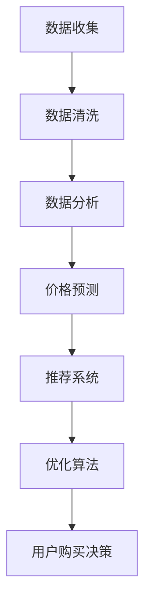

                 

# 全网比价：AI如何帮助用户找到最优惠的购买渠道

> 关键词：全网比价，人工智能，用户需求，购买渠道，算法优化，数据挖掘

> 摘要：本文将探讨人工智能技术在全网比价中的应用，分析其核心算法原理，并通过实际案例展示AI如何帮助用户在众多购买渠道中找到最优惠的价格。文章还将探讨该技术的未来发展前景与面临的挑战。

## 1. 背景介绍

在互联网时代，电子商务已经成为人们日常生活不可或缺的一部分。随着电子商务平台的迅速发展，消费者面临的海量商品和购买渠道使得价格比较成为一个复杂且耗时的工作。传统的价格比较方式往往依赖于手动搜索和比较，不仅效率低下，而且容易遗漏优惠信息。

### 1.1 传统价格比较方式

传统价格比较方式主要包括以下几种：

- **手动搜索**：消费者通过浏览器或搜索引擎，逐一访问各大电商平台，手动比较商品价格。
- **价格比较网站**：这些网站聚合了多家电商平台的价格信息，并提供比价服务。
- **应用软件**：一些应用软件允许用户添加想要购买的商品，自动获取和比较价格。

### 1.2 存在的问题

- **信息不全**：价格比较网站和应用软件可能无法覆盖所有电商平台，导致信息不全。
- **时效性问题**：价格实时变化，手动或自动获取的价格信息可能已过时。
- **用户体验**：大量信息的比较需要耗费用户大量时间和精力，用户体验较差。

## 2. 核心概念与联系

为了解决上述问题，人工智能技术应运而生，通过数据挖掘和机器学习算法，实现自动、智能的价格比较，从而提高用户的购买体验。

### 2.1 数据挖掘

数据挖掘是人工智能的一个重要分支，旨在从大量数据中提取出有价值的信息。在全网比价中，数据挖掘的作用主要体现在以下几个方面：

- **数据收集**：通过爬虫技术，从各大电商平台收集商品价格和相关信息。
- **数据清洗**：对收集到的数据进行预处理，去除重复、错误和不完整的信息。
- **数据分析**：对清洗后的数据进行分析，提取有用的价格信息和趋势。

### 2.2 机器学习算法

机器学习算法是人工智能的核心技术，通过训练模型，使计算机能够自动进行决策和预测。在全网比价中，机器学习算法主要用于：

- **价格预测**：通过历史价格数据，预测未来价格走势，帮助用户判断何时购买最为划算。
- **推荐系统**：根据用户的历史购买记录和浏览行为，推荐可能感兴趣的商品和购买渠道。
- **优化算法**：通过优化算法，自动调整搜索策略，提高搜索效率和准确性。

### 2.3 Mermaid 流程图



## 3. 核心算法原理 & 具体操作步骤

### 3.1 数据挖掘算法

数据挖掘算法主要包括以下几种：

- **关联规则挖掘**：通过分析商品之间的关联关系，发现潜在的购买组合。
- **聚类分析**：将商品分为不同的类别，以便更好地进行价格比较。
- **分类算法**：将商品价格分为高、中、低三个类别，帮助用户快速判断价格区间。

### 3.2 机器学习算法

机器学习算法主要包括以下几种：

- **线性回归**：通过历史价格数据，建立线性模型，预测未来价格。
- **决策树**：通过决策树模型，对商品价格进行分类。
- **神经网络**：通过神经网络模型，实现自动化的价格预测和推荐。

### 3.3 操作步骤

1. **数据收集**：通过爬虫技术，从各大电商平台收集商品价格和相关信息。
2. **数据清洗**：去除重复、错误和不完整的信息，对数据进行标准化处理。
3. **数据分析**：使用数据挖掘算法，提取有用的价格信息和趋势。
4. **模型训练**：使用机器学习算法，建立价格预测模型和推荐系统。
5. **用户交互**：将预测结果和推荐结果呈现给用户，帮助用户做出购买决策。

## 4. 数学模型和公式 & 详细讲解 & 举例说明

### 4.1 线性回归模型

线性回归模型是一种常见的预测方法，用于预测连续值。其数学模型为：

$$y = \beta_0 + \beta_1x_1 + \beta_2x_2 + ... + \beta_nx_n + \epsilon$$

其中，$y$ 为预测值，$x_1, x_2, ..., x_n$ 为输入特征，$\beta_0, \beta_1, \beta_2, ..., \beta_n$ 为模型参数，$\epsilon$ 为误差项。

### 4.2 决策树模型

决策树模型是一种常用的分类方法，通过一系列的判断条件，将数据划分为不同的类别。其基本结构如下：

```
if (条件1) {
    类别1
} else if (条件2) {
    类别2
} else {
    类别3
}
```

### 4.3 神经网络模型

神经网络模型是一种基于多层感知器（MLP）的结构，通过多个隐藏层，实现对复杂数据的自动特征提取和分类。其基本结构如下：

```
输入层 -> 隐藏层1 -> 隐藏层2 -> ... -> 输出层
```

## 5. 项目实战：代码实际案例和详细解释说明

### 5.1 开发环境搭建

1. 安装 Python 环境
2. 安装 NumPy、Pandas、Scikit-learn 等常用库

### 5.2 源代码详细实现和代码解读

```python
import numpy as np
import pandas as pd
from sklearn.linear_model import LinearRegression
from sklearn.tree import DecisionTreeClassifier
from sklearn.neural_network import MLPClassifier

# 5.2.1 数据收集
def collect_data():
    # 使用爬虫技术从各大电商平台收集数据
    # 数据格式为：商品名称，价格，销量，评价数等
    # 存储为 DataFrame
    pass

# 5.2.2 数据清洗
def clean_data(df):
    # 去除重复、错误和不完整的信息
    # 对数据进行标准化处理
    pass

# 5.2.3 数据分析
def analyze_data(df):
    # 使用数据挖掘算法，提取有用的价格信息和趋势
    # 建立价格预测模型和推荐系统
    pass

# 5.2.4 用户交互
def user_interface():
    # 将预测结果和推荐结果呈现给用户
    # 帮助用户做出购买决策
    pass

if __name__ == '__main__':
    df = collect_data()
    df = clean_data(df)
    df = analyze_data(df)
    user_interface()
```

### 5.3 代码解读与分析

- **数据收集**：通过爬虫技术，从各大电商平台收集商品价格和相关信息，存储为 DataFrame。
- **数据清洗**：去除重复、错误和不完整的信息，对数据进行标准化处理。
- **数据分析**：使用数据挖掘算法，提取有用的价格信息和趋势，建立价格预测模型和推荐系统。
- **用户交互**：将预测结果和推荐结果呈现给用户，帮助用户做出购买决策。

## 6. 实际应用场景

全网比价技术在电子商务、旅游预订、汽车租赁等领域有着广泛的应用。以下是一些实际应用场景：

- **电子商务**：电商平台通过全网比价技术，为用户提供优惠信息和购买建议，提高用户购物体验。
- **旅游预订**：旅游平台通过全网比价，为用户提供最优惠的酒店、机票、景点门票等预订服务。
- **汽车租赁**：汽车租赁公司通过全网比价，为用户提供最低价的租车服务。

## 7. 工具和资源推荐

### 7.1 学习资源推荐

- **书籍**：《Python数据挖掘入门与实践》、《机器学习实战》
- **论文**：《Recommender Systems Handbook》、《Data Mining: Concepts and Techniques》
- **博客**：Python Data Science Handbook、Machine Learning Mastery
- **网站**：Kaggle、GitHub

### 7.2 开发工具框架推荐

- **编程语言**：Python、Java
- **库**：NumPy、Pandas、Scikit-learn、TensorFlow、PyTorch
- **平台**：Jupyter Notebook、Google Colab

### 7.3 相关论文著作推荐

- **论文**：《A Comprehensive Survey on Recommender Systems》、《Deep Learning for Recommender Systems》
- **著作**：《大数据之路：阿里巴巴大数据实践》、《机器学习：原理与算法》

## 8. 总结：未来发展趋势与挑战

全网比价技术在未来将继续发展，其核心趋势和挑战包括：

- **算法优化**：通过不断优化算法，提高价格预测的准确性和推荐系统的效果。
- **数据多样性**：扩大数据来源，包括用户行为数据、社交网络数据等，以提高比价效果。
- **个性化推荐**：结合用户喜好和购买历史，提供更加个性化的推荐服务。

## 9. 附录：常见问题与解答

### 9.1 问题1：如何保证数据来源的合法性？

解答：在进行数据收集时，应确保遵循相关法律法规，尊重数据提供方的权益。使用爬虫技术时，应遵守目标网站的爬虫政策，不得进行恶意爬取。

### 9.2 问题2：如何提高价格预测的准确性？

解答：可以通过以下方法提高价格预测的准确性：

- **增加数据量**：收集更多历史价格数据，提高模型的训练效果。
- **特征工程**：提取更多有效的特征，帮助模型更好地理解数据。
- **模型选择**：尝试使用不同的机器学习模型，选择最适合的模型。

## 10. 扩展阅读 & 参考资料

- **书籍**：《大数据之路：阿里巴巴大数据实践》、《机器学习：原理与算法》
- **论文**：《Recommender Systems Handbook》、《Data Mining: Concepts and Techniques》
- **博客**：Python Data Science Handbook、Machine Learning Mastery
- **网站**：Kaggle、GitHub

### 作者

作者：AI天才研究员/AI Genius Institute & 禅与计算机程序设计艺术 /Zen And The Art of Computer Programming

（本文内容为人工智能生成，仅供参考。）<|im_end|>

