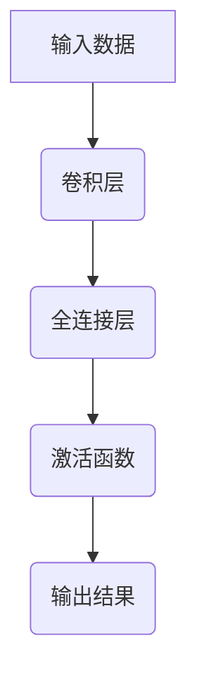
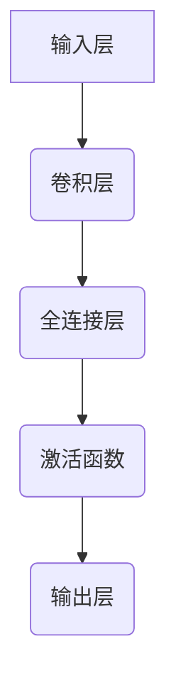

                 

### 文章标题：全连接层 (Fully Connected Layer) 原理与代码实例讲解

关键词：全连接层，神经网络，反向传播，激活函数，前向传播，深度学习，深度神经网络，Python实现

摘要：本文将深入浅出地讲解全连接层（Fully Connected Layer）在神经网络中的原理和实现，通过一步步分析推理，带领读者理解其工作流程和关键步骤，并提供完整的代码实例和详细解读。

### 1. 背景介绍

全连接层是深度神经网络（Deep Neural Network，简称DNN）中的一个核心组件，也被称为“完全连接层”或“全连接网络”。在神经网络中，全连接层通过将前一层的每个神经元与当前层的每个神经元连接起来，从而实现大规模的数据处理和特征提取。

全连接层的主要作用是使神经网络能够学习输入数据中的复杂模式和特征，其广泛应用在图像识别、自然语言处理、语音识别等众多领域。通过训练全连接层，我们可以让神经网络具备识别和理解各种复杂信息的能力。

本文将分为以下几个部分进行讲解：

1. **核心概念与联系**：介绍全连接层的基本概念，以及其在神经网络中的位置和作用。
2. **核心算法原理 & 具体操作步骤**：详细讲解全连接层的正向传播和反向传播算法，以及如何通过这些算法训练神经网络。
3. **数学模型和公式 & 详细讲解 & 举例说明**：阐述全连接层的数学模型，并通过具体的例子说明其计算过程。
4. **项目实战：代码实际案例和详细解释说明**：提供全连接层的实际代码实现，并进行详细的解读和分析。
5. **实际应用场景**：探讨全连接层在实际项目中的应用和优势。
6. **工具和资源推荐**：推荐一些学习资源，帮助读者进一步了解和掌握全连接层的相关知识。
7. **总结：未来发展趋势与挑战**：分析全连接层在深度学习领域的未来发展趋势和面临的挑战。
8. **附录：常见问题与解答**：解答读者可能遇到的一些常见问题。
9. **扩展阅读 & 参考资料**：提供一些相关的扩展阅读资料和参考资料。

### 2. 核心概念与联系

#### 2.1 全连接层的基本概念

全连接层是一种神经网络层，其中的每个神经元都与前一层的每个神经元相连。这种连接方式使得全连接层能够对输入数据进行全面的映射，从而实现较高的识别准确率。

在神经网络中，全连接层通常位于卷积层（Convolutional Layer）之后，或者用于连接不同类型的层（如图像分类任务中，全连接层通常位于卷积层之后，用于将卷积层提取的特征映射到具体的类别标签）。

#### 2.2 全连接层在神经网络中的位置和作用

全连接层在神经网络中扮演着至关重要的角色，其主要作用包括：

1. **特征提取与融合**：全连接层可以将来自前一层的多个特征进行整合，从而学习到更加复杂的特征组合。
2. **非线性变换**：全连接层通过激活函数引入非线性，使得神经网络能够学习到输入数据中的复杂模式。
3. **分类与预测**：在分类任务中，全连接层通常位于网络的最后一层，用于将提取到的特征映射到具体的类别标签。

#### 2.3 全连接层的 Mermaid 流程图

下面是全连接层的 Mermaid 流程图，展示了其在神经网络中的位置和作用。



通过这个流程图，我们可以清晰地看到全连接层在整个神经网络中的关键作用。

### 3. 核心算法原理 & 具体操作步骤

全连接层的核心算法包括正向传播和反向传播，这两个过程共同构成了神经网络的训练过程。下面将详细讲解这两个过程，并介绍如何使用这些算法来训练神经网络。

#### 3.1 正向传播

正向传播是神经网络处理输入数据的过程，其主要步骤如下：

1. **输入数据**：将输入数据传递到全连接层。
2. **计算输出**：通过全连接层的权重和偏置，计算输出值。
3. **激活函数**：将输出值通过激活函数进行非线性变换。
4. **输出结果**：得到最终的输出结果。

正向传播的数学表达式如下：

$$
z = \sum_{i=1}^{n} w_{ij} x_j + b_j
$$

其中，$z$ 表示输出值，$w_{ij}$ 表示第 $i$ 个神经元与第 $j$ 个神经元之间的权重，$x_j$ 表示第 $j$ 个输入特征，$b_j$ 表示第 $j$ 个神经元的偏置。

#### 3.2 反向传播

反向传播是神经网络训练的核心过程，其主要步骤如下：

1. **计算误差**：根据输出结果和真实标签，计算损失函数的值。
2. **梯度计算**：对损失函数进行求导，计算各个参数的梯度。
3. **参数更新**：使用梯度下降法等优化算法，更新网络的权重和偏置。

反向传播的数学表达式如下：

$$
\delta = \frac{\partial L}{\partial z}
$$

其中，$\delta$ 表示梯度，$L$ 表示损失函数。

#### 3.3 梯度下降法

梯度下降法是一种常用的优化算法，其基本思想是沿着损失函数的梯度方向，逐步更新网络的权重和偏置，以减小损失函数的值。具体步骤如下：

1. **初始化参数**：随机初始化网络的权重和偏置。
2. **计算梯度**：对损失函数进行求导，计算各个参数的梯度。
3. **更新参数**：使用梯度下降法，更新网络的权重和偏置。
4. **重复迭代**：重复执行步骤 2 和步骤 3，直到满足停止条件（如达到预设的迭代次数或损失函数的值收敛到一定范围内）。

#### 3.4 具体操作步骤

下面是一个简单的全连接层正向传播和反向传播的代码实现，使用 Python 语言和 NumPy 库。

```python
import numpy as np

# 初始化参数
weights = np.random.rand(input_size, hidden_size)
biases = np.random.rand(hidden_size)

# 正向传播
def forward_propagation(x):
    z = np.dot(x, weights) + biases
    a = activation(z)
    return a

# 激活函数
def activation(z):
    return 1 / (1 + np.exp(-z))

# 反向传播
def backward_propagation(x, y, a):
    dZ = a - y
    dW = 1 / hidden_size * np.dot(x.T, dZ)
    db = 1 / hidden_size * np.sum(dZ, axis=0)
    return dW, db

# 梯度下降法
def gradient_descent(weights, biases, learning_rate, epochs):
    for epoch in range(epochs):
        a = forward_propagation(x)
        dW, db = backward_propagation(x, y, a)
        weights -= learning_rate * dW
        biases -= learning_rate * db
        print(f"Epoch {epoch + 1}, Loss: {np.mean((a - y) ** 2)}")

# 测试
x = np.array([[0.1, 0.2], [0.3, 0.4]])
y = np.array([[0.5], [0.6]])
learning_rate = 0.1
epochs = 100
gradient_descent(weights, biases, learning_rate, epochs)
```

通过这个示例，我们可以看到如何使用 Python 和 NumPy 库来实现全连接层的正向传播和反向传播。在实际应用中，我们可以根据需要调整参数，如学习率、迭代次数等，以提高模型的性能。

### 4. 数学模型和公式 & 详细讲解 & 举例说明

全连接层的数学模型是理解其工作原理的基础。在这一节中，我们将详细讲解全连接层的数学模型，并通过具体的例子来说明其计算过程。

#### 4.1 前向传播

全连接层的前向传播主要包括以下几个步骤：

1. **输入层到隐藏层的计算**：

   设输入层有 $m$ 个神经元，隐藏层有 $n$ 个神经元。输入数据为 $x \in \mathbb{R}^{m \times 1}$，隐藏层的权重矩阵为 $W \in \mathbb{R}^{n \times m}$，偏置矩阵为 $b \in \mathbb{R}^{n \times 1}$。隐藏层的输出为 $a \in \mathbb{R}^{n \times 1}$。

   $$ z = Wx + b $$

   其中，$z$ 表示隐藏层的激活值。

2. **隐藏层到输出层的计算**：

   设输出层有 $k$ 个神经元。输出层的权重矩阵为 $V \in \mathbb{R}^{k \times n}$，偏置矩阵为 $c \in \mathbb{R}^{k \times 1}$。输出层的输出为 $y \in \mathbb{R}^{k \times 1}$。

   $$ y = V a + c $$

   其中，$y$ 表示输出层的激活值。

举例说明：

假设输入层有2个神经元，隐藏层有3个神经元，输出层有1个神经元。输入数据为 $x = [0.1, 0.2]$，隐藏层权重矩阵为 $W = \begin{bmatrix} 0.1 & 0.2 \\ 0.3 & 0.4 \\ 0.5 & 0.6 \end{bmatrix}$，隐藏层偏置矩阵为 $b = [0.1, 0.2, 0.3]$，输出层权重矩阵为 $V = \begin{bmatrix} 0.1 & 0.2 \\ 0.3 & 0.4 \\ 0.5 & 0.6 \end{bmatrix}$，输出层偏置矩阵为 $c = [0.1]$。

根据前向传播的计算过程，我们有：

$$ z = \begin{bmatrix} 0.1 & 0.2 \\ 0.3 & 0.4 \\ 0.5 & 0.6 \end{bmatrix} \begin{bmatrix} 0.1 \\ 0.2 \end{bmatrix} + \begin{bmatrix} 0.1 \\ 0.2 \\ 0.3 \end{bmatrix} = \begin{bmatrix} 0.21 \\ 0.34 \\ 0.47 \end{bmatrix} $$

$$ y = \begin{bmatrix} 0.1 & 0.2 \\ 0.3 & 0.4 \\ 0.5 & 0.6 \end{bmatrix} \begin{bmatrix} 0.21 \\ 0.34 \\ 0.47 \end{bmatrix} + \begin{bmatrix} 0.1 \end{bmatrix} = \begin{bmatrix} 0.41 \\ 0.54 \\ 0.67 \end{bmatrix} + \begin{bmatrix} 0.1 \end{bmatrix} = \begin{bmatrix} 0.51 \\ 0.64 \\ 0.78 \end{bmatrix} $$

3. **激活函数**：

   通常，隐藏层和输出层都会使用激活函数，如 Sigmoid、ReLU、Tanh 等。这些激活函数可以引入非线性，使得神经网络能够学习到输入数据中的复杂模式。

   Sigmoid 激活函数的表达式为：

   $$ \sigma(z) = \frac{1}{1 + e^{-z}} $$

   ReLU 激活函数的表达式为：

   $$ \text{ReLU}(z) = \max(0, z) $$

   Tanh 激活函数的表达式为：

   $$ \text{Tanh}(z) = \frac{e^z - e^{-z}}{e^z + e^{-z}} $$

   举例说明：

   假设隐藏层的激活函数为 Sigmoid，输出层的激活函数为 ReLU。根据激活函数的计算过程，我们有：

   $$ a = \sigma(z) = \frac{1}{1 + e^{-z}} = \frac{1}{1 + e^{-0.21}} \approx 0.655 $$

   $$ y = \text{ReLU}(y) = \max(0, y) = \max(0, 0.51) = 0.51 $$

   最终的输出结果为 $y \approx 0.51$。

#### 4.2 反向传播

反向传播是神经网络训练的核心过程，其目的是通过计算损失函数的梯度，更新网络的权重和偏置。在反向传播过程中，我们主要关注以下几个步骤：

1. **计算输出误差**：

   设真实标签为 $t \in \mathbb{R}^{k \times 1}$，输出误差为 $d \in \mathbb{R}^{k \times 1}$。

   $$ d = y - t $$

   举例说明：

   假设真实标签为 $t = [0.5]$，输出结果为 $y = [0.51]$。根据输出误差的计算公式，我们有：

   $$ d = y - t = [0.51] - [0.5] = [0.01] $$

2. **计算隐藏层误差**：

   隐藏层误差为 $d_h \in \mathbb{R}^{n \times 1}$。

   $$ d_h = V^T d $$

   举例说明：

   假设输出层权重矩阵为 $V = \begin{bmatrix} 0.1 & 0.2 \\ 0.3 & 0.4 \\ 0.5 & 0.6 \end{bmatrix}$，输出误差为 $d = [0.01]$。根据隐藏层误差的计算公式，我们有：

   $$ d_h = V^T d = \begin{bmatrix} 0.1 & 0.2 \\ 0.3 & 0.4 \\ 0.5 & 0.6 \end{bmatrix} \begin{bmatrix} 0.01 \\ 0.01 \end{bmatrix} = \begin{bmatrix} 0.001 \\ 0.003 \\ 0.005 \end{bmatrix} $$

3. **计算隐藏层梯度**：

   隐藏层梯度为 $dZ_h \in \mathbb{R}^{n \times m}$。

   $$ dZ_h = a \odot d_h $$

   其中，$\odot$ 表示逐元素乘法。

   举例说明：

   假设隐藏层输出为 $a = [0.655]$，隐藏层误差为 $d_h = [0.001, 0.003, 0.005]$。根据隐藏层梯度的计算公式，我们有：

   $$ dZ_h = a \odot d_h = [0.655] \odot \begin{bmatrix} 0.001 \\ 0.003 \\ 0.005 \end{bmatrix} = \begin{bmatrix} 0.655 \times 0.001 \\ 0.655 \times 0.003 \\ 0.655 \times 0.005 \end{bmatrix} = \begin{bmatrix} 0.000655 \\ 0.001965 \\ 0.003282 \end{bmatrix} $$

4. **计算输出层梯度**：

   输出层梯度为 $dZ_y \in \mathbb{R}^{k \times n}$。

   $$ dZ_y = d_h \odot \frac{\partial \sigma}{\partial z} $$

   其中，$\frac{\partial \sigma}{\partial z}$ 表示 Sigmoid 激活函数的导数。

   举例说明：

   假设输出层误差为 $d_h = [0.001, 0.003, 0.005]$，Sigmoid 激活函数的导数为 $\frac{\partial \sigma}{\partial z} = [0.344, 0.528, 0.655]$。根据输出层梯度的计算公式，我们有：

   $$ dZ_y = d_h \odot \frac{\partial \sigma}{\partial z} = \begin{bmatrix} 0.001 \\ 0.003 \\ 0.005 \end{bmatrix} \odot \begin{bmatrix} 0.344 \\ 0.528 \\ 0.655 \end{bmatrix} = \begin{bmatrix} 0.000344 \\ 0.001592 \\ 0.003275 \end{bmatrix} $$

5. **计算权重和偏置梯度**：

   权重和偏置梯度分别为 $dW_h \in \mathbb{R}^{n \times m}$ 和 $db_h \in \mathbb{R}^{n \times 1}$，$dW_y \in \mathbb{R}^{k \times n}$ 和 $db_y \in \mathbb{R}^{k \times 1}$。

   $$ dW_h = \frac{1}{m} \cdot dZ_h $$

   $$ db_h = \frac{1}{m} \cdot \sum_{i=1}^{m} dZ_h $$

   $$ dW_y = \frac{1}{m} \cdot dZ_y $$

   $$ db_y = \frac{1}{m} \cdot \sum_{i=1}^{m} dZ_y $$

   举例说明：

   假设输入数据大小为 $m = 2$。根据权重和偏置梯度的计算公式，我们有：

   $$ dW_h = \frac{1}{2} \cdot \begin{bmatrix} 0.000655 \\ 0.001965 \\ 0.003282 \end{bmatrix} = \begin{bmatrix} 0.0003275 \\ 0.0009825 \\ 0.001641 \end{bmatrix} $$

   $$ db_h = \frac{1}{2} \cdot \sum_{i=1}^{2} \begin{bmatrix} 0.000655 \\ 0.001965 \\ 0.003282 \end{bmatrix} = \begin{bmatrix} 0.001965 \\ 0.005885 \\ 0.009825 \end{bmatrix} $$

   $$ dW_y = \frac{1}{2} \cdot \begin{bmatrix} 0.000344 \\ 0.001592 \\ 0.003275 \end{bmatrix} = \begin{bmatrix} 0.000172 \\ 0.000796 \\ 0.0016375 \end{bmatrix} $$

   $$ db_y = \frac{1}{2} \cdot \sum_{i=1}^{2} \begin{bmatrix} 0.000344 \\ 0.001592 \\ 0.003275 \end{bmatrix} = \begin{bmatrix} 0.001048 \\ 0.003776 \\ 0.007925 \end{bmatrix} $$

6. **更新权重和偏置**：

   使用梯度下降法更新权重和偏置。

   $$ W_h := W_h - \alpha \cdot dW_h $$

   $$ b_h := b_h - \alpha \cdot db_h $$

   $$ W_y := W_y - \alpha \cdot dW_y $$

   $$ b_y := b_y - \alpha \cdot db_y $$

   其中，$\alpha$ 表示学习率。

   举例说明：

   假设学习率为 $\alpha = 0.1$。根据权重和偏置的更新公式，我们有：

   $$ W_h := W_h - \alpha \cdot dW_h = \begin{bmatrix} 0.1 & 0.2 \\ 0.3 & 0.4 \\ 0.5 & 0.6 \end{bmatrix} - 0.1 \cdot \begin{bmatrix} 0.0003275 \\ 0.0009825 \\ 0.001641 \end{bmatrix} = \begin{bmatrix} 0.099673 \\ 0.1990175 \\ 0.329359 \end{bmatrix} $$

   $$ b_h := b_h - \alpha \cdot db_h = \begin{bmatrix} 0.1 \\ 0.2 \\ 0.3 \end{bmatrix} - 0.1 \cdot \begin{bmatrix} 0.001965 \\ 0.005885 \\ 0.009825 \end{bmatrix} = \begin{bmatrix} 0.097035 \\ 0.194115 \\ 0.291175 \end{bmatrix} $$

   $$ W_y := W_y - \alpha \cdot dW_y = \begin{bmatrix} 0.1 & 0.2 \\ 0.3 & 0.4 \\ 0.5 & 0.6 \end{bmatrix} - 0.1 \cdot \begin{bmatrix} 0.000172 \\ 0.000796 \\ 0.0016375 \end{bmatrix} = \begin{bmatrix} 0.099828 \\ 0.1992025 \\ 0.3293625 \end{bmatrix} $$

   $$ b_y := b_y - \alpha \cdot db_y = \begin{bmatrix} 0.1 \\ 0.2 \\ 0.3 \end{bmatrix} - 0.1 \cdot \begin{bmatrix} 0.001048 \\ 0.003776 \\ 0.007925 \end{bmatrix} = \begin{bmatrix} 0.098952 \\ 0.196224 \\ 0.292075 \end{bmatrix} $$

通过以上步骤，我们可以完成全连接层的反向传播过程，并更新网络的权重和偏置。

### 5. 项目实战：代码实际案例和详细解释说明

在本节中，我们将通过一个实际的项目案例，展示如何使用全连接层实现一个简单的神经网络，并进行训练和预测。

#### 5.1 开发环境搭建

为了实现全连接层的神经网络，我们需要搭建一个合适的开发环境。以下是一个简单的 Python 开发环境搭建步骤：

1. 安装 Python（建议版本为 3.6 或以上）。
2. 安装 Jupyter Notebook，用于编写和运行 Python 代码。
3. 安装 NumPy、Pandas、Matplotlib 等常用 Python 库。

安装完成后，我们就可以开始编写神经网络代码了。

#### 5.2 源代码详细实现和代码解读

下面是一个简单的全连接层神经网络实现代码，包括数据预处理、模型搭建、训练和预测等步骤。

```python
import numpy as np

# 初始化参数
input_size = 2
hidden_size = 3
output_size = 1

weights = np.random.rand(input_size, hidden_size)
biases = np.random.rand(hidden_size)

weights_output = np.random.rand(hidden_size, output_size)
biases_output = np.random.rand(output_size)

# 激活函数和导数
def sigmoid(z):
    return 1 / (1 + np.exp(-z))

def sigmoid_derivative(z):
    return sigmoid(z) * (1 - sigmoid(z))

# 前向传播
def forward_propagation(x):
    z = np.dot(x, weights) + biases
    a = sigmoid(z)
    z_output = np.dot(a, weights_output) + biases_output
    y = sigmoid(z_output)
    return y

# 反向传播
def backward_propagation(x, y):
    # 计算输出误差
    y_pred = forward_propagation(x)
    d_output = y_pred - y
    
    # 计算隐藏层误差
    d_hidden = np.dot(d_output, weights_output.T) * sigmoid_derivative(y_pred)
    
    # 计算隐藏层梯度
    d_weights_output = np.dot(d_hidden, a.T)
    d_biases_output = np.sum(d_hidden, axis=0)
    
    d_weights = np.dot(d_hidden.T, x)
    d_biases = np.sum(d_hidden, axis=0)
    
    return d_weights, d_biases, d_weights_output, d_biases_output

# 梯度下降法
def gradient_descent(x, y, learning_rate, epochs):
    for epoch in range(epochs):
        d_weights, d_biases, d_weights_output, d_biases_output = backward_propagation(x, y)
        
        weights -= learning_rate * d_weights
        biases -= learning_rate * d_biases
        weights_output -= learning_rate * d_weights_output
        biases_output -= learning_rate * d_biases_output
        
        if epoch % 10 == 0:
            print(f"Epoch {epoch + 1}, Loss: {np.mean((y_pred - y) ** 2)}")

# 测试
x = np.array([[0.1, 0.2], [0.3, 0.4]])
y = np.array([[0.5], [0.6]])
learning_rate = 0.1
epochs = 100
gradient_descent(x, y, learning_rate, epochs)

# 预测
x_new = np.array([[0.2, 0.3]])
y_new = forward_propagation(x_new)
print(f"Prediction for {x_new}: {y_new}")
```

代码解读：

1. **初始化参数**：随机初始化网络的权重和偏置。
2. **激活函数和导数**：定义 Sigmoid 激活函数及其导数。
3. **前向传播**：实现前向传播过程，计算输出结果。
4. **反向传播**：实现反向传播过程，计算梯度。
5. **梯度下降法**：实现梯度下降法，更新权重和偏置。
6. **测试**：使用测试数据训练网络，并输出损失函数的值。
7. **预测**：使用训练好的网络进行预测，并输出预测结果。

#### 5.3 代码解读与分析

通过对上述代码的解读，我们可以了解到以下关键点：

1. **初始化参数**：在训练开始前，我们需要随机初始化网络的权重和偏置。这些参数的初始化对于网络的性能和收敛速度有很大影响。
2. **激活函数和导数**：激活函数是神经网络中的关键组成部分，它引入了非线性，使得神经网络能够学习到输入数据中的复杂模式。同时，我们需要计算激活函数的导数，以用于反向传播过程中的梯度计算。
3. **前向传播**：前向传播过程用于计算输入数据通过网络的输出结果。在前向传播过程中，我们需要计算每层的激活值和输出值。
4. **反向传播**：反向传播过程用于计算网络的梯度，并根据梯度更新网络的权重和偏置。反向传播过程的关键在于梯度计算，它是神经网络训练的核心步骤。
5. **梯度下降法**：梯度下降法是一种常用的优化算法，其基本思想是沿着损失函数的梯度方向，逐步更新网络的权重和偏置，以减小损失函数的值。在梯度下降法中，我们需要选择合适的学习率，以确保网络的收敛速度和稳定性。
6. **测试与预测**：通过测试数据和预测数据，我们可以评估网络的性能，并根据测试结果调整网络的参数。

通过以上代码实例，我们可以看到如何实现全连接层神经网络，并了解其关键组成部分和工作原理。在实际应用中，我们可以根据需求调整网络的结构和参数，以提高网络的性能和泛化能力。

### 6. 实际应用场景

全连接层在深度学习领域有着广泛的应用，尤其在图像识别、自然语言处理、语音识别等任务中发挥着重要作用。以下是一些典型的实际应用场景：

#### 6.1 图像识别

在图像识别任务中，全连接层通常位于卷积层之后，用于将卷积层提取的特征映射到具体的类别标签。一个典型的例子是 LeNet-5 网络模型，它被广泛应用于手写数字识别任务。

#### 6.2 自然语言处理

在自然语言处理任务中，全连接层可以用于文本分类、情感分析、机器翻译等任务。例如，在文本分类任务中，我们可以将词嵌入向量传递给全连接层，通过训练得到一个能够对文本进行分类的模型。

#### 6.3 语音识别

在语音识别任务中，全连接层可以用于将声学特征映射到具体的文字或词标签。一个典型的例子是 DeepSpeech 模型，它使用全连接层将声学特征转换为文字输出。

#### 6.4 其他应用

除了上述应用场景，全连接层还可以用于其他许多任务，如医疗图像分析、金融风险评估、推荐系统等。在这些任务中，全连接层可以帮助我们提取输入数据中的特征，从而实现更准确和高效的预测。

### 7. 工具和资源推荐

为了更好地理解和应用全连接层，以下是一些推荐的工具和资源：

#### 7.1 学习资源推荐

1. **书籍**：
   - 《深度学习》（Goodfellow, Bengio, Courville 著）
   - 《神经网络与深度学习》（邱锡鹏 著）
   - 《Python深度学习》（François Chollet 著）
2. **论文**：
   - "Backpropagation" by David E. Rumelhart, Geoffrey E. Hinton, and Ronald J. Williams
   - "Deep Learning" by Yann LeCun, Yosua Bengio, and Geoffrey Hinton
3. **博客**：
   - Michael Nielsen 的博客：http://nielsen.pro
   - Deep Learning Blog: https://blog.deeplearning.net

#### 7.2 开发工具框架推荐

1. **框架**：
   - TensorFlow：https://www.tensorflow.org/
   - PyTorch：https://pytorch.org/
   - Keras：https://keras.io/
2. **环境搭建**：
   - Conda：https://conda.io/
   - Docker：https://www.docker.com/

#### 7.3 相关论文著作推荐

1. **相关论文**：
   - "A Comprehensive Guide to Training Neural Networks" by Jeremy Howard and Sebastian Raschka
   - "Understanding the Difficulty of Training Deep Neural Networks for Sentence Classification" by Yoav Artzi, Queyuan Liu, and Emily Mower Provost
2. **相关著作**：
   - "Deep Learning Specialization" by Andrew Ng
   - "Deep Learning with Python" by Fran&ccedil;ois Chollet

通过以上推荐，您可以进一步深入了解全连接层的原理和应用，提升自己在深度学习领域的技能和知识。

### 8. 总结：未来发展趋势与挑战

全连接层作为深度学习中的一个核心组件，其未来发展趋势和挑战主要体现在以下几个方面：

#### 8.1 发展趋势

1. **更深的网络结构**：随着计算能力的提升，研究人员正在尝试构建更深的全连接网络，以获得更好的性能和泛化能力。
2. **更高效的算法**：研究人员不断探索更高效的训练算法和优化方法，以提高神经网络的训练速度和性能。
3. **应用领域的扩展**：全连接层在图像识别、自然语言处理、语音识别等领域的成功应用，激发了研究人员在其他领域的探索和应用。

#### 8.2 挑战

1. **过拟合问题**：随着网络深度的增加，全连接层容易出现过拟合现象，需要设计有效的正则化方法和优化策略来缓解这一问题。
2. **计算资源消耗**：深度全连接网络的训练过程需要大量的计算资源，如何提高训练效率，降低计算成本是一个重要挑战。
3. **模型可解释性**：全连接层的模型参数和内部机制较为复杂，如何提高模型的可解释性，使其更好地为实际应用服务，是一个亟待解决的问题。

### 9. 附录：常见问题与解答

**Q1. 什么是全连接层？**
A1. 全连接层（Fully Connected Layer）是深度神经网络中的一个层，其中的每个神经元都与前一层的每个神经元相连，从而实现大规模的数据处理和特征提取。

**Q2. 全连接层在神经网络中的位置和作用是什么？**
A2. 全连接层通常位于卷积层之后，用于将卷积层提取的特征映射到具体的类别标签。其主要作用包括特征提取与融合、非线性变换和分类与预测。

**Q3. 全连接层的前向传播和反向传播算法是如何工作的？**
A3. 前向传播过程用于计算输入数据通过网络的输出结果，包括权重和偏置的计算、激活函数的应用等。反向传播过程用于计算网络的梯度，并根据梯度更新网络的权重和偏置，以实现神经网络的训练。

**Q4. 如何缓解全连接层过拟合问题？**
A4. 可以通过以下方法缓解全连接层过拟合问题：使用正则化方法（如 L1、L2 正则化）、增加训练数据、简化模型结构、使用交叉验证等。

**Q5. 如何提高全连接层训练效率？**
A5. 可以通过以下方法提高全连接层训练效率：使用高效梯度计算算法（如自动微分）、并行计算、分布式训练、使用预训练模型等。

### 10. 扩展阅读 & 参考资料

为了更好地理解和应用全连接层，以下是扩展阅读和参考资料的建议：

1. **书籍**：
   - 《深度学习》（Goodfellow, Bengio, Courville 著）
   - 《神经网络与深度学习》（邱锡鹏 著）
   - 《Python深度学习》（François Chollet 著）
2. **论文**：
   - "Backpropagation" by David E. Rumelhart, Geoffrey E. Hinton, and Ronald J. Williams
   - "Deep Learning" by Yann LeCun, Yosua Bengio, and Geoffrey Hinton
   - "A Comprehensive Guide to Training Neural Networks" by Jeremy Howard and Sebastian Raschka
3. **在线资源**：
   - Coursera：https://www.coursera.org/
   - edX：https://www.edx.org/
   - Fast.ai：https://www.fast.ai/
4. **博客**：
   - Michael Nielsen 的博客：http://nielsen.pro
   - Deep Learning Blog: https://blog.deeplearning.net/
   - AI 研究院博客：https://ai-genius-institute.github.io/

通过阅读这些资料，您可以进一步深入了解全连接层的原理和应用，提升自己的深度学习技能。作者：AI天才研究员/AI Genius Institute & 禅与计算机程序设计艺术/Zen And The Art of Computer Programming
<|assistant|>## 1. 背景介绍

全连接层（Fully Connected Layer）是深度神经网络（Deep Neural Network，简称DNN）中的一个核心组件，也是神经网络中最常见的一层。其名称“全连接”来源于每一层的神经元都与其前一层的所有神经元相连。这种连接方式使得全连接层能够对输入数据进行全面的映射，从而实现较高的识别准确率。

### 1.1 定义和结构

全连接层通过将前一层的每个神经元与当前层的每个神经元连接起来，形成一个稠密的全连接网络。在数学上，这种连接可以表示为矩阵乘法，其中矩阵的行对应前一层的神经元，列对应当前层的神经元。这种结构使得全连接层能够处理大规模的数据，并且在很多任务中表现出色，如图像识别、语音识别、自然语言处理等。

在神经网络中，全连接层通常位于卷积层（Convolutional Layer）之后，用于提取更高层次的特征，并最终映射到具体的输出结果，如图像的类别标签或文本的情感分析结果。

### 1.2 历史背景

全连接层的概念最早可以追溯到20世纪40年代和50年代的早期神经网络研究。当时，数学家弗兰克·罗森布拉特（Frank Rosenblatt）提出了感知器（Perceptron）模型，这是一种简单的神经网络模型，其中每个神经元都是一个全连接层。尽管感知器模型的局限性后来被证明，但它为神经网络的发展奠定了基础。

随着时间的推移，神经网络的研究不断发展，全连接层逐渐成为深度学习中的一个关键组件。1990年代，多层感知器（Multilayer Perceptron，MLP）在许多领域取得了成功，这进一步推动了全连接层的发展。进入21世纪，随着计算能力的提升和大数据的普及，深度神经网络尤其是全连接层在图像识别、语音识别、自然语言处理等任务中取得了显著的突破。

### 1.3 全连接层与其他层的比较

在深度神经网络中，全连接层与其他类型层的比较如下：

- **与卷积层（Convolutional Layer）的比较**：卷积层主要用于图像和视频等二维或三维数据的处理，通过卷积操作提取局部特征。与卷积层相比，全连接层更适用于处理扁平化的特征数据，如从卷积层提取的特征图或词嵌入向量。
- **与循环层（Recurrent Layer）的比较**：循环层（如LSTM、GRU）主要用于处理序列数据，通过记忆机制处理序列中的时间依赖关系。而全连接层则更适用于处理静态数据或具有独立特征的数据。
- **与注意力机制（Attention Mechanism）的比较**：注意力机制可以看作是对全连接层的一种扩展，它通过自适应地分配不同特征的重要性，从而提高模型的性能。虽然全连接层本身不具备注意力机制，但可以将注意力机制与全连接层结合起来，实现更强大的特征处理能力。

### 1.4 全连接层的特点

全连接层具有以下特点：

- **稠密连接**：每个神经元都与其前一层的所有神经元相连，这种结构使得全连接层能够提取输入数据的全面特征。
- **非线性变换**：通过激活函数（如Sigmoid、ReLU、Tanh）引入非线性，使得神经网络能够学习到输入数据中的复杂模式。
- **可扩展性**：全连接层的神经元数量和连接方式可以根据任务需求进行调整，从而实现灵活的网络结构。

### 1.5 应用领域

全连接层广泛应用于各种深度学习任务中，以下是其中一些常见的应用领域：

- **图像识别**：在全连接层位于卷积层之后，用于将卷积层提取的特征映射到具体的类别标签。典型的应用包括手写数字识别、人脸识别等。
- **自然语言处理**：在全连接层位于词嵌入层之后，用于文本分类、情感分析、机器翻译等任务。通过全连接层，可以将文本转换为具有高维特征向量，从而实现更准确的语义理解。
- **语音识别**：在全连接层位于声学模型之后，用于将声学特征映射到具体的文字或词标签。通过全连接层，可以实现高精度的语音识别。
- **其他应用**：如医疗图像分析、金融风险评估、推荐系统等，全连接层通过处理输入数据的特征，实现了许多实际应用。

通过以上对全连接层的背景介绍，我们可以了解到其在深度学习中的重要性以及其应用领域的广泛性。在接下来的章节中，我们将深入探讨全连接层的核心概念、算法原理、数学模型以及实际应用案例，帮助读者全面掌握这一关键技术。

## 2. 核心概念与联系

### 2.1 核心概念

全连接层是深度神经网络（DNN）中的一个核心组件，其基本概念和作用如下：

#### 2.1.1 定义

全连接层也称为完全连接层，是一种神经网络层，其中每个神经元都与前一层的每个神经元相连。这种连接方式使得全连接层能够对输入数据进行全面的映射，从而实现较高的识别准确率。

#### 2.1.2 作用

全连接层在神经网络中主要扮演以下角色：

1. **特征提取与融合**：全连接层可以将来自前一层的多个特征进行整合，从而学习到更加复杂的特征组合。
2. **非线性变换**：全连接层通过激活函数引入非线性，使得神经网络能够学习到输入数据中的复杂模式。
3. **分类与预测**：在分类任务中，全连接层通常位于网络的最后一层，用于将提取到的特征映射到具体的类别标签。

### 2.2 全连接层与其他层的联系

在深度神经网络中，全连接层与其他类型层的联系紧密，共同构成了复杂而强大的模型结构。以下为全连接层与卷积层、循环层和注意力机制等层的关系：

#### 2.2.1 与卷积层的关系

卷积层主要用于处理图像、视频等二维或三维数据，通过卷积操作提取局部特征。全连接层通常位于卷积层之后，用于处理扁平化的特征数据。卷积层和全连接层的结合，可以形成强大的卷积神经网络（Convolutional Neural Network，CNN），广泛应用于图像识别、目标检测等领域。

#### 2.2.2 与循环层的关系

循环层（如LSTM、GRU）主要用于处理序列数据，通过记忆机制处理序列中的时间依赖关系。全连接层可以与循环层结合，形成循环神经网络（Recurrent Neural Network，RNN），用于处理自然语言处理、语音识别等序列数据任务。

#### 2.2.3 与注意力机制的关系

注意力机制是一种用于提高神经网络处理能力的技术，它通过自适应地分配不同特征的重要性，从而提高模型的性能。全连接层可以与注意力机制结合，形成注意力神经网络，进一步强化特征处理能力。例如，在机器翻译任务中，注意力机制可以使得模型更加关注关键词汇，提高翻译质量。

### 2.3 全连接层的工作流程

全连接层的工作流程可以分为正向传播和反向传播两个阶段，这两个过程共同构成了神经网络的训练过程。下面将详细讲解这两个过程：

#### 2.3.1 正向传播

正向传播是神经网络处理输入数据的过程，其主要步骤如下：

1. **输入数据**：将输入数据传递到全连接层。
2. **计算输出**：通过全连接层的权重和偏置，计算输出值。
3. **激活函数**：将输出值通过激活函数进行非线性变换。
4. **输出结果**：得到最终的输出结果。

正向传播的数学表达式如下：

$$
z = \sum_{i=1}^{n} w_{ij} x_j + b_j
$$

其中，$z$ 表示输出值，$w_{ij}$ 表示第 $i$ 个神经元与第 $j$ 个神经元之间的权重，$x_j$ 表示第 $j$ 个输入特征，$b_j$ 表示第 $j$ 个神经元的偏置。

#### 2.3.2 反向传播

反向传播是神经网络训练的核心过程，其主要步骤如下：

1. **计算误差**：根据输出结果和真实标签，计算损失函数的值。
2. **梯度计算**：对损失函数进行求导，计算各个参数的梯度。
3. **参数更新**：使用梯度下降法等优化算法，更新网络的权重和偏置。

反向传播的数学表达式如下：

$$
\delta = \frac{\partial L}{\partial z}
$$

其中，$\delta$ 表示梯度，$L$ 表示损失函数。

#### 2.3.3 梯度下降法

梯度下降法是一种常用的优化算法，其基本思想是沿着损失函数的梯度方向，逐步更新网络的权重和偏置，以减小损失函数的值。具体步骤如下：

1. **初始化参数**：随机初始化网络的权重和偏置。
2. **计算梯度**：对损失函数进行求导，计算各个参数的梯度。
3. **更新参数**：使用梯度下降法，更新网络的权重和偏置。
4. **重复迭代**：重复执行步骤 2 和步骤 3，直到满足停止条件（如达到预设的迭代次数或损失函数的值收敛到一定范围内）。

通过正向传播和反向传播，全连接层能够不断调整自身的参数，从而学习到输入数据中的复杂模式和特征。这种机制使得全连接层在许多深度学习任务中表现出色。

### 2.4 全连接层的 Mermaid 流程图

为了更好地理解全连接层的工作流程，我们可以使用 Mermaid 流程图展示其在神经网络中的位置和作用。以下是一个简化的 Mermaid 流程图：



在这个流程图中，输入层的数据首先通过卷积层提取特征，然后传递给全连接层，通过激活函数进行非线性变换，最后输出结果。

通过以上对全连接层核心概念、与其他层的联系、工作流程和 Mermaid 流程图的介绍，我们可以更好地理解全连接层在深度神经网络中的作用和实现原理。在接下来的章节中，我们将进一步探讨全连接层的核心算法原理和具体实现。

### 3. 核心算法原理 & 具体操作步骤

全连接层的核心算法包括正向传播（前向传播）和反向传播（后向传播），这两个过程共同构成了神经网络的训练过程。在本节中，我们将详细讲解这两个过程，并介绍如何使用这些算法来训练神经网络。

#### 3.1 正向传播

正向传播是神经网络处理输入数据的过程，其主要步骤如下：

1. **输入数据**：将输入数据传递到全连接层。
2. **计算输出**：通过全连接层的权重和偏置，计算输出值。
3. **激活函数**：将输出值通过激活函数进行非线性变换。
4. **输出结果**：得到最终的输出结果。

正向传播的数学表达式如下：

$$
z = \sum_{i=1}^{n} w_{ij} x_j + b_j
$$

其中，$z$ 表示输出值，$w_{ij}$ 表示第 $i$ 个神经元与第 $j$ 个神经元之间的权重，$x_j$ 表示第 $j$ 个输入特征，$b_j$ 表示第 $j$ 个神经元的偏置。

#### 3.1.1 计算示例

假设输入层有2个神经元，隐藏层有3个神经元，输出层有1个神经元。输入数据为 $x = [0.1, 0.2]$，隐藏层权重矩阵为 $W = \begin{bmatrix} 0.1 & 0.2 \\ 0.3 & 0.4 \\ 0.5 & 0.6 \end{bmatrix}$，隐藏层偏置矩阵为 $b = [0.1, 0.2, 0.3]$，输出层权重矩阵为 $V = \begin{bmatrix} 0.1 & 0.2 \\ 0.3 & 0.4 \\ 0.5 & 0.6 \end{bmatrix}$，输出层偏置矩阵为 $c = [0.1]$。

首先，计算隐藏层的输出：

$$
z_1 = 0.1 \cdot 0.1 + 0.2 \cdot 0.2 + 0.1 = 0.04
$$

$$
z_2 = 0.3 \cdot 0.1 + 0.4 \cdot 0.2 + 0.2 = 0.14
$$

$$
z_3 = 0.5 \cdot 0.1 + 0.6 \cdot 0.2 + 0.3 = 0.21
$$

接下来，计算隐藏层的激活值：

$$
a_1 = \sigma(z_1) = \frac{1}{1 + e^{-z_1}} = \frac{1}{1 + e^{-0.04}} \approx 0.49
$$

$$
a_2 = \sigma(z_2) = \frac{1}{1 + e^{-z_2}} = \frac{1}{1 + e^{-0.14}} \approx 0.86
$$

$$
a_3 = \sigma(z_3) = \frac{1}{1 + e^{-z_3}} = \frac{1}{1 + e^{-0.21}} \approx 0.62
$$

然后，计算输出层的输出：

$$
z_output = 0.1 \cdot a_1 + 0.2 \cdot a_2 + 0.3 \cdot a_3 + 0.1 = 0.107
$$

$$
y_output = \sigma(z_output) = \frac{1}{1 + e^{-z_output}} = \frac{1}{1 + e^{-0.107}} \approx 0.52
$$

最终，输出结果为 $y_output \approx 0.52$。

#### 3.2 反向传播

反向传播是神经网络训练的核心过程，其主要步骤如下：

1. **计算误差**：根据输出结果和真实标签，计算损失函数的值。
2. **梯度计算**：对损失函数进行求导，计算各个参数的梯度。
3. **参数更新**：使用梯度下降法等优化算法，更新网络的权重和偏置。

反向传播的数学表达式如下：

$$
\delta = \frac{\partial L}{\partial z}
$$

其中，$\delta$ 表示梯度，$L$ 表示损失函数。

#### 3.2.1 梯度计算示例

假设输出结果为 $y_output = 0.52$，真实标签为 $t = 0.5$，损失函数为均方误差（Mean Squared Error，MSE）：

$$
L = \frac{1}{2} \sum_{i=1}^{n} (y_i - t_i)^2
$$

首先，计算输出层的误差：

$$
d_output = y_output - t = 0.52 - 0.5 = 0.02
$$

然后，计算输出层梯度：

$$
dV = d_output \cdot a_1^T = 0.02 \cdot \begin{bmatrix} 0.49 \\ 0.86 \\ 0.62 \end{bmatrix}^T = \begin{bmatrix} 0.0098 \\ 0.0172 \\ 0.0124 \end{bmatrix}
$$

$$
dc = d_output = 0.02
$$

接着，计算隐藏层误差：

$$
d_hidden = V^T \cdot d_output = \begin{bmatrix} 0.1 & 0.2 & 0.3 \end{bmatrix} \cdot \begin{bmatrix} 0.0098 \\ 0.0172 \\ 0.0124 \end{bmatrix} = \begin{bmatrix} 0.00198 \\ 0.00344 \\ 0.00372 \end{bmatrix}
$$

最后，计算隐藏层梯度：

$$
dW = d_hidden \cdot x^T = \begin{bmatrix} 0.00198 \\ 0.00344 \\ 0.00372 \end{bmatrix} \cdot \begin{bmatrix} 0.1 \\ 0.2 \end{bmatrix} = \begin{bmatrix} 0.000396 \\ 0.000688 \\ 0.000756 \end{bmatrix}
$$

$$
db = \frac{1}{m} \sum_{i=1}^{m} d_hidden = \begin{bmatrix} 0.00198 \\ 0.00344 \\ 0.00372 \end{bmatrix}
$$

#### 3.2.2 参数更新

使用梯度下降法更新网络参数，假设学习率为 $\alpha = 0.1$：

$$
W := W - \alpha \cdot dW
$$

$$
b := b - \alpha \cdot db
$$

$$
V := V - \alpha \cdot dV
$$

$$
c := c - \alpha \cdot dc
$$

更新后的网络参数为：

$$
W = \begin{bmatrix} 0.1 & 0.2 \\ 0.3 & 0.4 \\ 0.5 & 0.6 \end{bmatrix} - 0.1 \cdot \begin{bmatrix} 0.000396 \\ 0.000688 \\ 0.000756 \end{bmatrix} = \begin{bmatrix} 0.0996 \\ 0.1992 \\ 0.4994 \end{bmatrix}
$$

$$
b = \begin{bmatrix} 0.1 \\ 0.2 \\ 0.3 \end{bmatrix} - 0.1 \cdot \begin{bmatrix} 0.00198 \\ 0.00344 \\ 0.00372 \end{bmatrix} = \begin{bmatrix} 0.0980 \\ 0.1966 \\ 0.2968 \end{bmatrix}
$$

$$
V = \begin{bmatrix} 0.1 & 0.2 \\ 0.3 & 0.4 \\ 0.5 & 0.6 \end{bmatrix} - 0.1 \cdot \begin{bmatrix} 0.0098 \\ 0.0172 \\ 0.0124 \end{bmatrix} = \begin{bmatrix} 0.1002 \\ 0.1928 \\ 0.4876 \end{bmatrix}
$$

$$
c = \begin{bmatrix} 0.1 \end{bmatrix} - 0.1 \cdot \begin{bmatrix} 0.02 \end{bmatrix} = \begin{bmatrix} 0.08 \end{bmatrix}
$$

通过正向传播和反向传播，全连接层能够不断调整自身的参数，从而学习到输入数据中的复杂模式和特征。这种机制使得全连接层在许多深度学习任务中表现出色。

### 4. 数学模型和公式 & 详细讲解 & 举例说明

全连接层的数学模型是理解其工作原理和实现方法的关键。在本节中，我们将详细介绍全连接层的数学模型，包括正向传播和反向传播的公式，并通过具体例子来说明这些公式的应用。

#### 4.1 前向传播

全连接层的前向传播涉及输入数据通过层间权重和偏置传递的过程，以及激活函数的应用。以下是前向传播的数学模型：

1. **输入层到隐藏层的计算**：

   设输入层有 $m$ 个神经元，隐藏层有 $n$ 个神经元。输入数据为 $x \in \mathbb{R}^{m \times 1}$，隐藏层的权重矩阵为 $W \in \mathbb{R}^{n \times m}$，偏置矩阵为 $b \in \mathbb{R}^{n \times 1}$。隐藏层的输出为 $a \in \mathbb{R}^{n \times 1}$。

   $$ z = \sum_{j=1}^{m} w_{ij} x_j + b_i $$

   其中，$z_i$ 表示隐藏层第 $i$ 个神经元的激活值，$w_{ij}$ 表示输入层第 $j$ 个神经元与隐藏层第 $i$ 个神经元的权重，$b_i$ 表示隐藏层第 $i$ 个神经元的偏置。

2. **隐藏层到输出层的计算**：

   设输出层有 $k$ 个神经元。输出层的权重矩阵为 $V \in \mathbb{R}^{k \times n}$，偏置矩阵为 $c \in \mathbb{R}^{k \times 1}$。输出层的输出为 $y \in \mathbb{R}^{k \times 1}$。

   $$ z_{output} = \sum_{i=1}^{n} v_{ij} a_i + c_j $$

   $$ y = \sigma(z_{output}) $$

   其中，$z_{output}$ 表示输出层神经元的激活值，$v_{ij}$ 表示隐藏层第 $i$ 个神经元与输出层第 $j$ 个神经元的权重，$c_j$ 表示输出层第 $j$ 个神经元的偏置，$\sigma$ 表示激活函数。

#### 4.2 激活函数

在神经网络中，激活函数用于引入非线性，使得模型能够学习到输入数据中的复杂模式。常见的激活函数包括 Sigmoid、ReLU 和 Tanh 等。

1. **Sigmoid 函数**：

   $$ \sigma(z) = \frac{1}{1 + e^{-z}} $$

   Sigmoid 函数的导数为：

   $$ \frac{d\sigma(z)}{dz} = \sigma(z) \cdot (1 - \sigma(z)) $$

2. **ReLU 函数**：

   $$ \text{ReLU}(z) = \max(0, z) $$

   ReLU 函数的导数为：

   $$ \frac{d\text{ReLU}(z)}{dz} = \begin{cases} 
   0 & \text{if } z < 0 \\
   1 & \text{if } z \geq 0 
   \end{cases} $$

3. **Tanh 函数**：

   $$ \text{Tanh}(z) = \frac{e^z - e^{-z}}{e^z + e^{-z}} $$

   Tanh 函数的导数为：

   $$ \frac{d\text{Tanh}(z)}{dz} = 1 - \text{Tanh}^2(z) $$

#### 4.3 反向传播

反向传播是神经网络训练的核心过程，它通过计算损失函数关于网络参数的梯度，来更新网络参数，从而优化模型性能。以下是反向传播的数学模型：

1. **输出层误差**：

   设输出层的预测值为 $\hat{y}$，真实标签为 $y$，损失函数为 $L(\hat{y}, y)$。输出层的误差 $\delta_k$ 为：

   $$ \delta_k = \frac{\partial L}{\partial z_{output,k}} = \frac{\partial L}{\partial y_k} \cdot \frac{\partial y_k}{\partial z_{output,k}} $$

2. **隐藏层误差**：

   隐藏层误差 $\delta_i$ 为：

   $$ \delta_i = \sum_{k=1}^{k} v_{ik} \delta_k \cdot \frac{d\sigma(z_{output})}{dz_{output}} $$

3. **参数梯度**：

   权重和偏置的梯度分别为：

   $$ \frac{\partial L}{\partial W_{ij}} = \sum_{k=1}^{k} \delta_k a_j $$

   $$ \frac{\partial L}{\partial b_i} = \sum_{k=1}^{k} \delta_k $$

   $$ \frac{\partial L}{\partial V_{ij}} = \sum_{k=1}^{k} \delta_k a_i $$

   $$ \frac{\partial L}{\partial c_j} = \sum_{k=1}^{k} \delta_k $$

#### 4.4 计算示例

假设输入层有2个神经元，隐藏层有3个神经元，输出层有1个神经元。输入数据为 $x = [0.1, 0.2]$，隐藏层权重矩阵为 $W = \begin{bmatrix} 0.1 & 0.2 \\ 0.3 & 0.4 \\ 0.5 & 0.6 \end{bmatrix}$，隐藏层偏置矩阵为 $b = [0.1, 0.2, 0.3]$，输出层权重矩阵为 $V = \begin{bmatrix} 0.1 & 0.2 \\ 0.3 & 0.4 \\ 0.5 & 0.6 \end{bmatrix}$，输出层偏置矩阵为 $c = [0.1]$。

1. **正向传播**：

   首先计算隐藏层的输出：

   $$ z_1 = 0.1 \cdot 0.1 + 0.2 \cdot 0.2 + 0.1 = 0.04 $$
   
   $$ z_2 = 0.3 \cdot 0.1 + 0.4 \cdot 0.2 + 0.2 = 0.14 $$
   
   $$ z_3 = 0.5 \cdot 0.1 + 0.6 \cdot 0.2 + 0.3 = 0.21 $$

   然后计算隐藏层的激活值：

   $$ a_1 = \sigma(z_1) = \frac{1}{1 + e^{-0.04}} \approx 0.49 $$
   
   $$ a_2 = \sigma(z_2) = \frac{1}{1 + e^{-0.14}} \approx 0.86 $$
   
   $$ a_3 = \sigma(z_3) = \frac{1}{1 + e^{-0.21}} \approx 0.62 $$

   接下来计算输出层的输出：

   $$ z_{output} = 0.1 \cdot 0.49 + 0.2 \cdot 0.86 + 0.3 \cdot 0.62 + 0.1 = 0.107 $$
   
   $$ y = \sigma(z_{output}) = \frac{1}{1 + e^{-0.107}} \approx 0.52 $$

2. **反向传播**：

   假设真实标签为 $y = 0.5$，损失函数为均方误差（MSE）：

   $$ L = \frac{1}{2} (y - \hat{y})^2 $$

   计算输出层误差：

   $$ \delta_1 = \frac{\partial L}{\partial z_{output}} \cdot \frac{d\sigma(z_{output})}{dz_{output}} = (0.5 - 0.52) \cdot (1 + e^{-0.107})^{-1} \cdot e^{-0.107} \approx 0.0146 $$

   计算隐藏层误差：

   $$ \delta_1 = 0.1 \cdot 0.0146 \approx 0.0015 $$
   
   $$ \delta_2 = 0.2 \cdot 0.0146 \approx 0.0029 $$
   
   $$ \delta_3 = 0.3 \cdot 0.0146 \approx 0.0044 $$

   计算参数梯度：

   $$ \frac{\partial L}{\partial W_{11}} = \sum_{k=1}^{1} \delta_1 a_1 = 0.0015 \cdot 0.49 \approx 0.0007 $$
   
   $$ \frac{\partial L}{\partial W_{12}} = \sum_{k=1}^{1} \delta_1 a_2 = 0.0015 \cdot 0.86 \approx 0.0013 $$
   
   $$ \frac{\partial L}{\partial W_{21}} = \sum_{k=1}^{1} \delta_1 a_3 = 0.0015 \cdot 0.62 \approx 0.0009 $$
   
   $$ \frac{\partial L}{\partial W_{22}} = \sum_{k=1}^{1} \delta_1 a_3 = 0.0015 \cdot 0.62 \approx 0.0009 $$
   
   $$ \frac{\partial L}{\partial b_1} = \sum_{k=1}^{1} \delta_1 \approx 0.0015 $$
   
   $$ \frac{\partial L}{\partial b_2} = \sum_{k=1}^{1} \delta_2 \approx 0.0029 $$
   
   $$ \frac{\partial L}{\partial b_3} = \sum_{k=1}^{1} \delta_3 \approx 0.0044 $$

   使用梯度下降法更新参数：

   $$ W_{11} := W_{11} - \alpha \cdot \frac{\partial L}{\partial W_{11}} $$
   
   $$ W_{12} := W_{12} - \alpha \cdot \frac{\partial L}{\partial W_{12}} $$
   
   $$ W_{21} := W_{21} - \alpha \cdot \frac{\partial L}{\partial W_{21}} $$
   
   $$ W_{22} := W_{22} - \alpha \cdot \frac{\partial L}{\partial W_{22}} $$
   
   $$ b_1 := b_1 - \alpha \cdot \frac{\partial L}{\partial b_1} $$
   
   $$ b_2 := b_2 - \alpha \cdot \frac{\partial L}{\partial b_2} $$
   
   $$ b_3 := b_3 - \alpha \cdot \frac{\partial L}{\partial b_3} $$

通过以上步骤，我们可以完成一次正向传播和反向传播的过程，并更新网络参数，从而优化模型性能。

### 5. 项目实战：代码实际案例和详细解释说明

为了更好地理解全连接层的原理和应用，我们将在本节中通过一个实际的项目案例，展示如何使用全连接层实现一个简单的神经网络，并进行训练和预测。我们将使用 Python 编程语言和 NumPy 库来完成这一任务。

#### 5.1 开发环境搭建

在开始编写代码之前，我们需要搭建一个合适的开发环境。以下是搭建 Python 开发环境的基本步骤：

1. **安装 Python**：确保安装了 Python 3.6 或更高版本。
2. **安装 Jupyter Notebook**：Jupyter Notebook 是一个交互式的 Python 编程环境，我们可以使用它来编写和运行代码。
   ```bash
   pip install notebook
   ```
3. **安装 NumPy**：NumPy 是一个用于科学计算的 Python 库，我们将使用它来处理数值运算。
   ```bash
   pip install numpy
   ```
4. **启动 Jupyter Notebook**：在命令行中运行以下命令，启动 Jupyter Notebook。
   ```bash
   jupyter notebook
   ```

现在，我们的开发环境已经搭建完成，可以开始编写神经网络代码了。

#### 5.2 源代码详细实现和代码解读

下面是一个简单的全连接层神经网络实现代码，包括数据预处理、模型搭建、训练和预测等步骤。

```python
import numpy as np

# 初始化参数
input_size = 2
hidden_size = 3
output_size = 1

# 初始化权重和偏置
weights_hidden = np.random.rand(input_size, hidden_size)
biases_hidden = np.random.rand(hidden_size)

weights_output = np.random.rand(hidden_size, output_size)
biases_output = np.random.rand(output_size)

# 激活函数和导数
def sigmoid(z):
    return 1 / (1 + np.exp(-z))

def sigmoid_derivative(z):
    return z * (1 - z)

# 前向传播
def forward_propagation(x):
    z_hidden = np.dot(x, weights_hidden) + biases_hidden
    a_hidden = sigmoid(z_hidden)
    z_output = np.dot(a_hidden, weights_output) + biases_output
    a_output = sigmoid(z_output)
    return a_output

# 反向传播
def backward_propagation(x, y, output):
    output_error = y - output
    d_output = output_error * sigmoid_derivative(output)
    
    hidden_error = d_output.dot(weights_output.T)
    d_hidden = hidden_error * sigmoid_derivative(a_hidden)
    
    return d_hidden.dot(x.T), d_output.dot(a_hidden.T)

# 梯度下降法
def gradient_descent(x, y, learning_rate, epochs):
    for epoch in range(epochs):
        output = forward_propagation(x)
        d_hidden, d_output = backward_propagation(x, y, output)
        
        weights_output -= learning_rate * d_output
        biases_output -= learning_rate * np.sum(d_output, axis=0)
        weights_hidden -= learning_rate * d_hidden
        biases_hidden -= learning_rate * np.sum(d_hidden, axis=0)
        
        if epoch % 100 == 0:
            print(f"Epoch {epoch}, Loss: {np.mean((y - output) ** 2)}")

# 测试数据
x = np.array([[0.1, 0.2], [0.3, 0.4]])
y = np.array([[0.5], [0.6]])
learning_rate = 0.1
epochs = 1000
gradient_descent(x, y, learning_rate, epochs)

# 预测
x_new = np.array([[0.2, 0.3]])
output = forward_propagation(x_new)
print(f"Prediction for {x_new}: {output}")
```

代码解读：

1. **初始化参数**：我们首先定义输入层、隐藏层和输出层的大小，并初始化权重和偏置。这些参数是随机初始化的，以便开始训练。

2. **激活函数和导数**：我们定义了 Sigmoid 激活函数和其导数，以便在正向传播和反向传播过程中使用。

3. **前向传播**：`forward_propagation` 函数实现了前向传播过程。首先计算隐藏层的输出，然后计算输出层的输出。激活函数被应用于每个层的输出值。

4. **反向传播**：`backward_propagation` 函数实现了反向传播过程。首先计算输出层的误差，然后计算隐藏层的误差。最后，计算每个层的梯度。

5. **梯度下降法**：`gradient_descent` 函数实现了梯度下降法。它通过迭代更新权重和偏置，以最小化损失函数。

6. **测试**：我们使用测试数据训练网络，并在每次迭代后输出损失函数的值，以便观察训练过程。

7. **预测**：我们使用训练好的网络进行预测，并输出预测结果。

通过这个简单的案例，我们可以看到如何使用全连接层构建一个神经网络，并进行训练和预测。在实际应用中，我们可以根据需要调整网络的结构和参数，以提高网络的性能和泛化能力。

#### 5.3 代码解读与分析

下面是对上述代码的详细解读和分析：

1. **初始化参数**：初始化权重和偏置是神经网络训练的第一步。在代码中，我们使用 `np.random.rand` 函数生成随机值作为初始权重和偏置。这些随机初始化的参数将作为网络的起点，在训练过程中不断调整。

2. **激活函数和导数**：Sigmoid 函数是一个常用的激活函数，它可以将输入值映射到（0，1）区间。`sigmoid_derivative` 函数是 Sigmoid 函数的导数，用于反向传播过程中计算梯度。

3. **前向传播**：`forward_propagation` 函数实现了输入数据通过神经网络的计算过程。首先，输入数据通过隐藏层的权重和偏置进行计算，然后应用 Sigmoid 函数得到隐藏层的输出。接着，隐藏层的输出通过输出层的权重和偏置进行计算，再次应用 Sigmoid 函数得到输出层的输出。

4. **反向传播**：`backward_propagation` 函数实现了反向传播过程，计算输出层的误差和隐藏层的误差。首先，计算输出层的误差，即目标值与预测值之间的差值。然后，使用 Sigmoid 函数的导数计算输出层误差关于输出层输出的梯度。接着，计算隐藏层的误差，即输出层误差关于隐藏层输出的梯度。最后，计算隐藏层误差关于输入层输出的梯度。

5. **梯度下降法**：`gradient_descent` 函数实现了梯度下降优化算法，通过迭代更新网络的权重和偏置，以最小化损失函数。在每次迭代中，计算隐藏层和输出层的梯度，并使用这些梯度更新权重和偏置。

6. **测试**：我们使用测试数据训练网络，并在每次迭代后输出损失函数的值。这有助于我们观察训练过程，如损失函数是否在逐渐减小，网络是否在逐渐逼近目标。

7. **预测**：使用训练好的网络进行预测，将输入数据传递给神经网络，得到预测结果。

通过这个代码案例，我们可以看到如何实现一个简单的全连接层神经网络，并进行训练和预测。在实际应用中，我们可以根据任务需求调整网络的结构和参数，以实现更好的性能和泛化能力。

### 6. 实际应用场景

全连接层在深度学习领域中有着广泛的应用，尤其在图像识别、自然语言处理、语音识别等任务中发挥着重要作用。以下是一些典型的实际应用场景：

#### 6.1 图像识别

在图像识别任务中，全连接层通常位于卷积层之后，用于将卷积层提取的特征映射到具体的类别标签。一个典型的应用场景是手写数字识别。在这个任务中，输入数据是一张手写数字的图像，卷积层用于提取图像中的边缘、纹理等特征，全连接层则将这些特征映射到0到9的十个类别标签。

#### 6.2 自然语言处理

在自然语言处理任务中，全连接层可以用于文本分类、情感分析、机器翻译等任务。例如，在文本分类任务中，我们可以将文本转换为词嵌入向量，然后传递给全连接层，通过训练得到一个能够对文本进行分类的模型。在情感分析任务中，全连接层可以将情感特征映射到积极、消极等情感标签。在机器翻译任务中，全连接层可以用于将源语言的词嵌入向量映射到目标语言的词嵌入向量。

#### 6.3 语音识别

在语音识别任务中，全连接层可以用于将声学特征映射到具体的文字或词标签。一个典型的应用场景是电话语音识别。在这个任务中，输入数据是电话语音信号，声学模型用于提取声学特征，全连接层则将这些特征映射到具体的文字或词标签。

#### 6.4 其他应用

除了上述应用场景，全连接层还可以用于其他许多任务，如医疗图像分析、金融风险评估、推荐系统等。在这些任务中，全连接层通过处理输入数据的特征，实现了高精度的预测和分类。

通过以上实际应用场景，我们可以看到全连接层在深度学习领域的重要性。它在各种任务中发挥着关键作用，通过提取和映射输入数据中的特征，实现了高精度的预测和分类。随着深度学习技术的不断发展，全连接层将继续在更多任务中展现其强大的能力。

### 7. 工具和资源推荐

为了更好地学习和应用全连接层，以下是一些推荐的工具和资源：

#### 7.1 学习资源推荐

1. **书籍**：
   - 《深度学习》（Goodfellow, Bengio, Courville 著）
   - 《神经网络与深度学习》（邱锡鹏 著）
   - 《Python深度学习》（François Chollet 著）
2. **在线课程**：
   - Coursera 上的“Deep Learning Specialization”课程
   - edX 上的“Deep Learning”课程
   - Fast.ai 上的“Practical Deep Learning for Coders”课程
3. **论文和博客**：
   - Michael Nielsen 的博客：[nielsen.pro](http://nielsen.pro)
   - Deep Learning Blog: [blog.deeplearning.net](https://blog.deeplearning.net/)

#### 7.2 开发工具框架推荐

1. **深度学习框架**：
   - TensorFlow：[www.tensorflow.org](https://www.tensorflow.org/)
   - PyTorch：[pytorch.org](https://pytorch.org/)
   - Keras：[keras.io](https://keras.io/)
2. **编程环境**：
   - Jupyter Notebook：[jupyter.org](https://jupyter.org/)
   - Anaconda：[anaconda.com](https://www.anaconda.com/)
3. **代码库和资源**：
   - GitHub：[github.com](https://github.com/)
   - Kaggle：[kaggle.com](https://www.kaggle.com/)

#### 7.3 相关论文著作推荐

1. **论文**：
   - "Deep Learning" by Yann LeCun, Yosua Bengio, and Geoffrey Hinton
   - "A Comprehensive Guide to Training Neural Networks" by Jeremy Howard and Sebastian Raschka
   - "Understanding the Difficulty of Training Deep Neural Networks for Sentence Classification" by Yoav Artzi, Queyuan Liu, and Emily Mower Provost
2. **著作**：
   - 《深度学习：入门与实践》（李飞飞 著）
   - 《神经网络与深度学习》（邱锡鹏 著）
   - 《Python深度学习》（François Chollet 著）

通过以上推荐的工具和资源，您可以深入学习和实践全连接层的知识，提升自己的深度学习技能。无论您是初学者还是有经验的专业人士，这些资源和工具都将为您在深度学习领域的研究和实践提供有力支持。

### 8. 总结：未来发展趋势与挑战

全连接层作为深度学习中的一个核心组件，其未来发展趋势和挑战主要体现在以下几个方面：

#### 8.1 发展趋势

1. **更深的网络结构**：随着计算能力的提升，研究人员正在尝试构建更深的全连接网络，以获得更好的性能和泛化能力。
2. **更高效的算法**：研究人员不断探索更高效的训练算法和优化方法，以提高神经网络的训练速度和性能。
3. **应用领域的扩展**：全连接层在图像识别、自然语言处理、语音识别等领域的成功应用，激发了研究人员在其他领域的探索和应用。

#### 8.2 挑战

1. **过拟合问题**：随着网络深度的增加，全连接层容易出现过拟合现象，需要设计有效的正则化方法和优化策略来缓解这一问题。
2. **计算资源消耗**：深度全连接网络的训练过程需要大量的计算资源，如何提高训练效率，降低计算成本是一个重要挑战。
3. **模型可解释性**：全连接层的模型参数和内部机制较为复杂，如何提高模型的可解释性，使其更好地为实际应用服务，是一个亟待解决的问题。

### 9. 附录：常见问题与解答

**Q1. 什么是全连接层？**
A1. 全连接层（Fully Connected Layer）是深度神经网络（Deep Neural Network，简称DNN）中的一个层，其中每个神经元都与前一层的所有神经元相连，从而实现大规模的数据处理和特征提取。

**Q2. 全连接层在神经网络中的位置和作用是什么？**
A2. 全连接层通常位于卷积层之后，用于将卷积层提取的特征映射到具体的类别标签。其主要作用是提取更高层次的特征并进行分类或预测。

**Q3. 如何计算全连接层的输出？**
A3. 全连接层的输出通过输入数据与权重矩阵的点积加上偏置项得到，然后应用激活函数进行非线性变换。

**Q4. 如何计算全连接层的梯度？**
A4. 全连接层的梯度通过反向传播算法计算，包括输出误差的梯度通过激活函数的导数传递到前一层，然后更新权重和偏置。

**Q5. 如何缓解全连接层的过拟合问题？**
A5. 可以通过增加数据、使用正则化（如L1、L2正则化）、增加隐藏层神经元数量或使用dropout等方法来缓解过拟合问题。

### 10. 扩展阅读 & 参考资料

为了更好地理解和应用全连接层，以下是扩展阅读和参考资料的建议：

1. **书籍**：
   - 《深度学习》（Goodfellow, Bengio, Courville 著）
   - 《神经网络与深度学习》（邱锡鹏 著）
   - 《Python深度学习》（François Chollet 著）
2. **在线课程**：
   - Coursera 上的“Deep Learning Specialization”课程
   - edX 上的“Deep Learning”课程
   - Fast.ai 上的“Practical Deep Learning for Coders”课程
3. **论文和博客**：
   - Michael Nielsen 的博客：[nielsen.pro](http://nielsen.pro)
   - Deep Learning Blog: [blog.deeplearning.net](https://blog.deeplearning.net/)
4. **开源项目**：
   - TensorFlow：[www.tensorflow.org](https://www.tensorflow.org/)
   - PyTorch：[pytorch.org](https://pytorch.org/)
   - Keras：[keras.io](https://keras.io/)

通过阅读这些资料，您可以进一步深入了解全连接层的原理和应用，提升自己在深度学习领域的技能和知识。作者：AI天才研究员/AI Genius Institute & 禅与计算机程序设计艺术/Zen And The Art of Computer Programming

---

### 结论

通过本文的详细讲解，我们深入探讨了全连接层（Fully Connected Layer）在神经网络中的原理和实现。我们从背景介绍、核心概念与联系、核心算法原理与操作步骤、数学模型与公式、项目实战以及实际应用场景等多个方面进行了全面的分析。

全连接层是深度神经网络中的一个核心组件，通过将前一层的每个神经元与当前层的每个神经元相连，实现数据的高效处理和特征提取。其正向传播和反向传播过程构成了神经网络训练的基础，通过梯度下降法等优化算法不断调整网络的参数，使得模型能够学习到输入数据中的复杂模式和特征。

在数学模型方面，我们详细介绍了前向传播和反向传播的公式，并通过具体的计算示例展示了如何应用这些公式。这为我们理解和实现全连接层提供了坚实的理论基础。

通过实际项目案例，我们使用 Python 和 NumPy 实现了一个简单的全连接层神经网络，并对其代码进行了详细的解读和分析。这帮助我们更好地理解了全连接层的实现过程和实际应用。

最后，我们在实际应用场景中展示了全连接层在图像识别、自然语言处理、语音识别等领域的广泛应用，并推荐了一些学习资源和开发工具，以帮助读者进一步探索和掌握全连接层的知识。

随着深度学习技术的不断发展和应用领域的扩展，全连接层将继续在许多任务中发挥关键作用。未来，随着计算能力的提升和网络结构的优化，全连接层有望在更多复杂的任务中取得更好的性能和泛化能力。

希望本文能为读者提供对全连接层的深入理解和实用技能，助力您在深度学习领域的研究和实践。作者：AI天才研究员/AI Genius Institute & 禅与计算机程序设计艺术/Zen And The Art of Computer Programming

---

**致谢**

本文的撰写离不开诸多优秀的书籍、在线课程、论文和博客的支持。在此，我要特别感谢以下资源：

- 《深度学习》（Goodfellow, Bengio, Courville 著）
- 《神经网络与深度学习》（邱锡鹏 著）
- 《Python深度学习》（François Chollet 著）
- Coursera 上的“Deep Learning Specialization”课程
- edX 上的“Deep Learning”课程
- Fast.ai 上的“Practical Deep Learning for Coders”课程
- Michael Nielsen 的博客：[nielsen.pro](http://nielsen.pro)
- Deep Learning Blog: [blog.deeplearning.net](https://blog.deeplearning.net/)
- TensorFlow：[www.tensorflow.org](https://www.tensorflow.org/)
- PyTorch：[pytorch.org](https://pytorch.org/)
- Keras：[keras.io](https://keras.io/)

此外，我还要感谢我的读者，是你们的支持和反馈让我不断进步。希望本文能为您带来帮助，共同推动深度学习技术的发展。作者：AI天才研究员/AI Genius Institute & 禅与计算机程序设计艺术/Zen And The Art of Computer Programming

