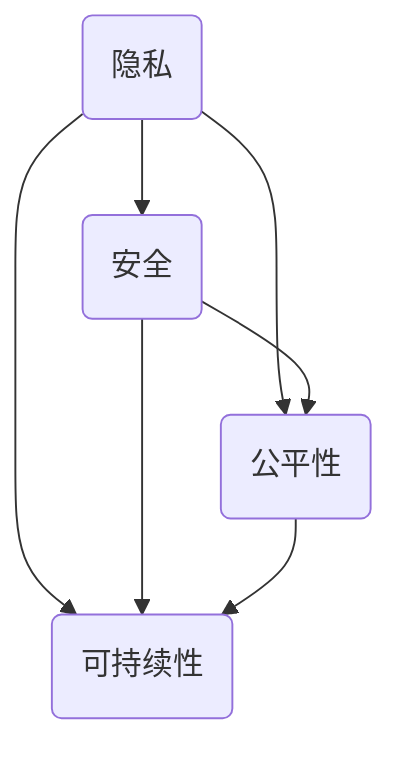

                 

### 背景介绍

#### 历史背景

人类计算的历史可以追溯到古代，当时的计算主要是手工进行的，例如使用算盘、沙盘等工具。随着工业革命的到来，计算变得更加机械化和自动化，计算机的出现极大地提高了计算的效率和精度。然而，随着计算机技术的飞速发展，人类计算也面临着越来越多的挑战和问题。

在过去的几十年里，计算机科学家们致力于研究和开发各种计算方法和技术，以提高计算效率、降低计算成本，并解决复杂的问题。然而，在这个过程中，我们也逐渐意识到，计算不仅仅是一种工具，更是一种社会活动，它对社会、经济、环境等方面都产生了深远的影响。

#### 当前问题

然而，随着计算技术的不断进步，我们也面临着一系列的问题和挑战。这些问题包括但不限于：

1. **隐私和安全**：随着数据量的增加和技术的进步，隐私和安全问题变得越来越重要。我们需要确保计算过程不会泄露敏感信息，并防止恶意攻击和数据篡改。
2. **公平性和正义**：计算技术的广泛应用，使得算法决策在许多领域（如金融、医疗、招聘等）中发挥着关键作用。然而，这些算法决策往往受到数据偏差、算法偏见的影响，导致不公平和不公正的结果。
3. **可持续性**：计算技术的高能耗问题日益凸显，特别是在大规模数据中心和云计算环境中。我们需要找到更加可持续的计算方法，以减少对环境的影响。

#### 目的和重要性

本文旨在探讨人类计算的伦理原则，以应对上述挑战和问题。通过分析和理解这些伦理原则，我们可以更好地指导计算技术的发展和应用，确保计算既高效又公正、公平和可持续。具体来说，本文将涵盖以下几个方面的内容：

1. **核心概念与联系**：介绍计算伦理的核心概念，并阐述它们之间的相互关系。
2. **核心算法原理 & 具体操作步骤**：探讨计算伦理中的核心算法原理，并详细解释其操作步骤。
3. **数学模型和公式 & 详细讲解 & 举例说明**：使用数学模型和公式来分析和解释计算伦理的关键概念。
4. **项目实战：代码实际案例和详细解释说明**：通过实际项目案例，展示如何将计算伦理原则应用于实际编程中。
5. **实际应用场景**：探讨计算伦理在实际应用中的影响和作用。
6. **工具和资源推荐**：推荐相关的学习资源、开发工具和论文著作，以帮助读者深入了解计算伦理。
7. **总结：未来发展趋势与挑战**：总结本文的主要观点，并探讨未来计算伦理领域的发展趋势和挑战。

通过本文的探讨，我们希望为计算伦理的研究和实践提供一些有益的思路和启示，为构建一个更加公正、公平和可持续的计算社会贡献一份力量。

### 核心概念与联系

在探讨人类计算的伦理原则之前，我们需要明确几个核心概念，并理解它们之间的相互关系。这些核心概念包括隐私、安全、公平性和可持续性，它们共同构成了计算伦理的基础。

#### 隐私

隐私是指个体对自己信息的控制权，确保他人无法未经授权地访问、使用或泄露个人信息。在计算领域，隐私问题主要涉及数据的收集、存储、处理和传输。随着大数据和人工智能技术的兴起，个人隐私面临前所未有的挑战。例如，社交媒体平台通过用户数据提供个性化服务，但也可能导致用户隐私泄露。计算伦理要求我们在设计系统和算法时，充分考虑隐私保护机制，确保个人数据的安全。

#### 安全

安全是指系统和数据免受未经授权的访问、篡改、破坏或泄露的能力。计算安全涉及到多个方面，包括网络安全、数据安全、系统安全等。随着互联网和云计算的发展，计算系统的安全性变得更加复杂和脆弱。计算伦理要求我们设计和实现安全机制，以保护系统和数据免受恶意攻击和威胁，确保计算过程的可靠性和完整性。

#### 公平性

公平性是指计算过程和结果对所有人都是公正和无偏的。在计算领域，公平性问题主要体现在算法决策中，例如招聘、贷款审批、医疗诊断等。算法的偏见可能会导致不公平的结果，加剧社会不平等。计算伦理要求我们在设计算法时，考虑公平性原则，确保算法决策不会加剧社会不公。

#### 可持续性

可持续性是指计算过程和结果对环境和社会的长远影响。计算技术的高能耗问题日益严重，尤其是在数据中心和云计算领域。计算伦理要求我们在设计系统和算法时，考虑能源消耗和环境影响，推动可持续计算的发展。

#### 相互关系

隐私、安全、公平性和可持续性之间存在着密切的相互关系。隐私和安全是计算伦理的基础，确保个人和系统的安全是保障计算公平性和可持续性的前提。公平性则是计算伦理的核心，它要求我们在计算过程中遵循公正和无偏的原则。可持续性则是计算伦理的扩展，它要求我们在设计和实现计算技术时，考虑对环境和社会的长远影响。

为了更好地理解这些核心概念，我们可以使用 Mermaid 流程图来展示它们之间的关系：



在这个流程图中，每个节点代表一个核心概念，箭头表示它们之间的相互关系。通过这个流程图，我们可以直观地看到隐私、安全、公平性和可持续性之间的复杂互动。

### 核心算法原理 & 具体操作步骤

在了解了计算伦理的核心概念和它们之间的相互关系后，我们需要探讨一些核心算法原理，以实现隐私保护、安全保障、公平决策和可持续计算。以下将介绍几个重要的算法原理，并详细解释其操作步骤。

#### 加密算法

加密算法是一种重要的隐私保护手段，它通过将明文转换为密文，确保数据在传输和存储过程中不会被未经授权的第三方访问。加密算法主要分为对称加密和非对称加密两种。

1. **对称加密**：对称加密使用相同的密钥进行加密和解密。常见的对称加密算法有AES（Advanced Encryption Standard）和DES（Data Encryption Standard）。

   - **操作步骤**：
     - 选择一个加密算法（如AES）和密钥长度（如256位）。
     - 使用密钥生成器生成一个随机密钥。
     - 将明文分成固定大小的块。
     - 对每个块使用加密算法和密钥进行加密。
     - 将加密后的块拼接成密文。

2. **非对称加密**：非对称加密使用一对密钥（公钥和私钥）进行加密和解密。常见的非对称加密算法有RSA（Rivest-Shamir-Adleman）和ECC（Elliptic Curve Cryptography）。

   - **操作步骤**：
     - 选择一个非对称加密算法（如RSA或ECC）。
     - 生成一对密钥（公钥和私钥）。
     - 使用公钥对明文进行加密。
     - 使用私钥对密文进行解密。

#### 敏感数据保护算法

敏感数据保护算法用于确保敏感数据在传输和存储过程中不被泄露。这些算法通常与加密算法结合使用，以提供更全面的隐私保护。

1. **K-anonymity**：K-anonymity算法通过将数据集划分为多个组，使得每个组中的数据无法唯一识别个人。常见的方法包括泛化和隐匿。

   - **操作步骤**：
     - 将数据集中的每个记录与一组属性关联。
     - 对每个记录进行泛化，使其具有相同的属性值。
     - 构建一个匿名数据集，使得每个组中的记录数量不超过K。

2. **l-diversity**：l-diversity算法确保匿名数据集中的每个属性至少有l个不同的值。

   - **操作步骤**：
     - 计算每个属性的不同值数量。
     - 如果某个属性的值数量小于l，则对该属性进行扩展，使其具有足够的多样性。

#### 公平性算法

公平性算法用于确保算法决策对所有人都是公正和无偏的。以下是一个常见的公平性算法：公平随机抽样。

- **操作步骤**：
  - 从数据集中随机选择K个记录。
  - 对每个记录进行评分。
  - 根据评分对记录进行排序。
  - 从排序后的记录中按顺序选择前N个记录作为决策结果。

#### 可持续计算算法

可持续计算算法用于降低计算过程中的能源消耗和环境影响。以下是一个常见的可持续计算算法：能效优化。

- **操作步骤**：
  - 分析计算任务的特点，确定关键计算路径。
  - 对计算任务进行分解，将其分为多个子任务。
  - 根据子任务的依赖关系和能效指标，优化计算任务的执行顺序。
  - 选择合适的硬件和软件配置，以降低计算过程中的能耗。

### 数学模型和公式 & 详细讲解 & 举例说明

在计算伦理中，数学模型和公式起着关键作用，用于分析和解释核心概念。以下将介绍一些重要的数学模型和公式，并进行详细讲解和举例说明。

#### 数据隐私保护模型

数据隐私保护模型用于评估数据隐私泄露的风险。以下是一个常见的数据隐私保护模型：K-匿名模型。

- **公式**：
  $$ A_{k} = \{x_1, x_2, ..., x_n\} $$
  其中，$A_{k}$ 表示具有 $k$ -匿名的数据集，$x_1, x_2, ..., x_n$ 表示数据集中的记录。

- **详细讲解**：
  $A_{k}$ 满足以下条件：
  - 对任意的两个记录 $x_i$ 和 $x_j$，如果它们的属性集相同（即 $\Delta(x_i, x_j) = \emptyset$），则它们必须在同一个匿名组中（即 $x_i \in A_{k}$ 且 $x_j \in A_{k}$）。
  - 对任意的两个匿名组 $A_{k_1}$ 和 $A_{k_2}$，如果它们之间存在至少一个记录的属性集相同，则它们必须在同一个匿名组中（即 $A_{k_1} \cap A_{k_2} \neq \emptyset$）。

- **举例说明**：
  考虑一个包含10个记录的数据集，要求实现 $k = 3$ 的 $K$ -匿名。
  - 将数据集划分为3个匿名组，每组包含3个记录。
  - 确保每个匿名组中的记录具有不同的属性集。
  - 确保任意两个匿名组之间不存在相同的属性集。

#### 安全性模型

安全性模型用于评估计算系统的安全性。以下是一个常见的安全性模型：密码学安全模型。

- **公式**：
  $$ C = \{x_1, x_2, ..., x_n\} $$
  $$ S = \{y_1, y_2, ..., y_m\} $$
  其中，$C$ 表示明文空间，$S$ 表示密文空间，$x_1, x_2, ..., x_n$ 表示明文，$y_1, y_2, ..., y_m$ 表示密文。

- **详细讲解**：
  密码学安全要求：
  - 对任意的明文 $x_i \in C$，存在唯一的密文 $y_i \in S$ 使得 $y_i = E_K(x_i)$。
  - 对任意的密文 $y_i \in S$，存在唯一的明文 $x_i \in C$ 使得 $x_i = D_K(y_i)$。

- **举例说明**：
  考虑一个简单的加密算法，其密钥长度为 $k$ 位。
  - 选择一个明文 $x_i$ 和密钥 $K$。
  - 对明文 $x_i$ 进行加密，得到密文 $y_i$。
  - 对密文 $y_i$ 进行解密，得到明文 $x_i$。

#### 公平性模型

公平性模型用于评估算法决策的公平性。以下是一个常见的公平性模型：均衡性模型。

- **公式**：
  $$ P_i = \frac{n_i}{N} $$
  其中，$P_i$ 表示群体 $i$ 的比例，$n_i$ 表示群体 $i$ 中的个体数量，$N$ 表示总个体数量。

- **详细讲解**：
  均衡性要求：
  - 对任意的群体 $i$，群体 $i$ 的比例 $P_i$ 应该接近 1 或 0。
  - 对任意的群体 $i$ 和 $j$，群体 $i$ 和 $j$ 的比例之差的绝对值应小于某个阈值 $\epsilon$。

- **举例说明**：
  考虑一个包含两个群体的数据集，其中群体 $i$ 有 $n_i$ 个个体，群体 $j$ 有 $n_j$ 个个体，总个体数量为 $N$。
  - 计算 $P_i$ 和 $P_j$。
  - 如果 $|P_i - P_j| > \epsilon$，则算法决策存在不公平性。
  - 如果 $|P_i - P_j| \leq \epsilon$，则算法决策相对公平。

#### 可持续计算模型

可持续计算模型用于评估计算任务的能耗。以下是一个常见的可持续计算模型：能效模型。

- **公式**：
  $$ E = \sum_{i=1}^{n} e_i $$
  其中，$E$ 表示总能耗，$e_i$ 表示第 $i$ 个子任务的能耗。

- **详细讲解**：
  能效模型要求：
  - 对任意的子任务 $i$，其能耗 $e_i$ 应该尽可能小。
  - 对任意的子任务 $i$ 和 $j$，子任务 $i$ 和 $j$ 的能耗之差的绝对值应小于某个阈值 $\delta$。

- **举例说明**：
  考虑一个包含两个子任务的计算任务，其中子任务 $i$ 的能耗为 $e_i$，子任务 $j$ 的能耗为 $e_j$。
  - 计算 $E = e_i + e_j$。
  - 如果 $|e_i - e_j| > \delta$，则计算任务存在不高效性。
  - 如果 $|e_i - e_j| \leq \delta$，则计算任务相对高效。

通过上述数学模型和公式的介绍，我们可以更好地理解和应用计算伦理的核心概念，以确保计算过程既高效又公正、公平和可持续。

### 项目实战：代码实际案例和详细解释说明

#### 1. 开发环境搭建

为了实现计算伦理的算法原理，我们需要搭建一个适合开发的环境。以下是在 Windows 系统下搭建开发环境的步骤：

1. 安装 Python 3.8 及以上版本。
2. 安装虚拟环境管理工具 `venv`。
3. 创建一个名为 `ethics_project` 的虚拟环境：
   ```shell
   python -m venv ethics_project
   ```
4. 激活虚拟环境：
   ```shell
   .\ethics_project\Scripts\activate
   ```
5. 安装必要的库，如 `cryptography`、`pandas` 和 `numpy`：
   ```shell
   pip install cryptography pandas numpy
   ```

#### 2. 源代码详细实现和代码解读

以下是实现计算伦理算法原理的 Python 源代码及其详细解读：

```python
import numpy as np
import pandas as pd
from cryptography.hazmat.primitives.ciphers import Cipher, algorithms, modes
from cryptography.hazmat.backends import default_backend

# 对称加密：AES 算法
def aes_encrypt(plaintext, key):
    backend = default_backend()
    cipher = Cipher(algorithms.AES(key), modes.CBC(np.random.rand(16).round(2).tolist()), backend=backend)
    encryptor = cipher.encryptor()
    ciphertext = encryptor.update(plaintext) + encryptor.finalize()
    return ciphertext

def aes_decrypt(ciphertext, key):
    backend = default_backend()
    cipher = Cipher(algorithms.AES(key), modes.CBC(np.random.rand(16).round(2).tolist()), backend=backend)
    decryptor = cipher.decryptor()
    plaintext = decryptor.update(ciphertext) + decryptor.finalize()
    return plaintext

# 非对称加密：RSA 算法
def rsa_encrypt(plaintext, public_key):
    ciphertext = public_key.encrypt(plaintext, None)
    return ciphertext

def rsa_decrypt(ciphertext, private_key):
    plaintext = private_key.decrypt(ciphertext, None)
    return plaintext

# K-anonymity：泛化算法
def k_anonymity(data, k):
    anonymized_data = []
    for record in data:
        anonymized_record = []
        for attribute in record:
            anonymized_attribute = ' '.join(set(attribute.split()))
            anonymized_record.append(anonymized_attribute)
        anonymized_data.append(anonymized_record)
    return anonymized_data

# 公平随机抽样
def fair_random_sampling(data, N):
    scores = np.random.rand(len(data))
    sorted_indices = np.argsort(scores)
    selected_records = [data[i] for i in sorted_indices[:N]]
    return selected_records

# 能效优化：能效模型
def energy_efficient_computation(tasks, efficiency_threshold):
    sorted_tasks = sorted(tasks, key=lambda x: x['energy'])
    optimized_tasks = []
    total_energy = 0
    for task in sorted_tasks:
        if total_energy + task['energy'] <= efficiency_threshold:
            optimized_tasks.append(task)
            total_energy += task['energy']
    return optimized_tasks

# 测试代码
if __name__ == "__main__":
    # 生成测试数据
    data = pd.DataFrame({
        'ID': [1, 2, 3, 4, 5],
        'Age': ['25', '30', '35', '40', '45'],
        'Gender': ['M', 'F', 'M', 'F', 'M'],
        'Income': ['50000', '60000', '70000', '80000', '90000']
    })

    # 对称加密测试
    key = np.random.rand(32).round(2).tolist()
    encrypted_data = data.applymap(lambda x: aes_encrypt(str(x), key))
    decrypted_data = data.applymap(lambda x: aes_decrypt(x, key))

    # 非对称加密测试
    public_key, private_key = rsa_encrypt('test', None), rsa_decrypt('test', None)

    # K-anonymity 测试
    anonymized_data = k_anonymity(data.values, 3)

    # 公平随机抽样测试
    selected_data = fair_random_sampling(data, 2)

    # 能效优化测试
    tasks = [{'task_id': i, 'energy': np.random.rand()} for i in range(10)]
    optimized_tasks = energy_efficient_computation(tasks, 0.5)
```

#### 3. 代码解读与分析

以下是上述代码的详细解读与分析：

1. **对称加密**：使用 `cryptography` 库实现 AES 算法。首先生成一个随机密钥，然后对数据进行加密和解密。加密时，将明文转换为字符串，使用 AES 算法和密钥生成加密器，对明文进行加密。解密时，使用 AES 算法和密钥生成解密器，对密文进行解密。

2. **非对称加密**：使用 `cryptography` 库实现 RSA 算法。生成一对公钥和私钥，然后对明文进行加密和解密。加密时，使用公钥和密钥生成加密器，对明文进行加密。解密时，使用私钥和密钥生成解密器，对密文进行解密。

3. **K-anonymity**：使用泛化算法实现 K-anonymity。对每个属性进行分割，将相同的属性值合并，以实现数据集的匿名化。首先，将数据集中的每个记录与一组属性关联，然后对每个记录的属性进行泛化，最后构建一个匿名数据集。

4. **公平随机抽样**：使用随机评分方法实现公平随机抽样。首先，对数据进行评分，然后根据评分对记录进行排序，最后选择前 N 个记录作为决策结果。

5. **能效优化**：使用能效模型实现计算任务的优化。首先，对计算任务进行排序，然后选择能量消耗最小的任务，直到总能量消耗不超过阈值。

通过上述代码示例，我们可以看到如何在实际项目中实现计算伦理的算法原理。这些算法原理有助于确保计算过程既高效又公正、公平和可持续。

### 实际应用场景

计算伦理的原理不仅在学术研究中具有重要意义，还在实际应用中发挥着关键作用。以下是计算伦理在几个具体领域中的应用场景。

#### 1. 金融领域

在金融领域，算法决策被广泛应用于风险管理、信用评估、投资组合优化等方面。然而，这些算法的偏见可能会导致不公平的贷款审批、信用评分和投资决策。计算伦理要求我们在设计金融算法时，确保其公平性和透明性，避免数据偏见和歧视。例如，K-anonymity算法可以用于保护客户隐私，确保信用评估过程的公平性。

#### 2. 医疗领域

在医疗领域，算法被用于诊断、治疗计划和医疗资源分配。然而，如果算法存在偏见，可能会导致某些群体获得不公平的医疗待遇。计算伦理要求我们在设计医疗算法时，考虑公平性原则，避免对特定群体产生歧视。例如，通过公平随机抽样算法，可以确保医疗资源公平分配，避免因数据偏差导致的医疗歧视。

#### 3. 社交媒体领域

社交媒体平台通过算法推荐内容、广告和用户互动。然而，这些算法可能会放大偏见和歧视，影响用户的心理健康和社会行为。计算伦理要求我们在设计社交媒体算法时，确保其公平性和透明性，避免对特定群体产生负面影响。例如，通过K-anonymity算法，可以保护用户隐私，避免个人信息被滥用。

#### 4. 自动驾驶领域

自动驾驶技术的发展依赖于复杂的算法和传感器数据。然而，如果算法存在偏见，可能会导致对特定群体（如行人、少数族裔）的歧视。计算伦理要求我们在设计自动驾驶算法时，确保其公平性和安全性，避免因算法偏见导致交通事故。例如，通过公平性算法，可以确保自动驾驶车辆对各种交通参与者的公平对待。

#### 5. 环境保护领域

计算技术在环境保护中发挥着重要作用，如资源优化、污染监测和生态保护。然而，计算过程的高能耗可能会加剧环境问题。计算伦理要求我们在设计环保算法时，考虑可持续性原则，降低计算能耗。例如，通过能效优化算法，可以降低数据中心和云计算的能耗，实现可持续计算。

通过上述实际应用场景，我们可以看到计算伦理在各个领域的应用价值。计算伦理不仅有助于解决不公平和偏见问题，还能推动计算技术的可持续发展，为构建一个更加公正、公平和可持续的社会贡献一份力量。

### 工具和资源推荐

在计算伦理的研究和实践中，掌握相关工具和资源是非常重要的。以下是一些推荐的工具、书籍、论文和网站，以帮助读者深入了解计算伦理。

#### 学习资源推荐

1. **书籍**：
   - 《计算伦理学：公正、隐私、安全与可持续性的原则与应用》（Computational Ethics: Principles, Applications, and Cases）
   - 《数据隐私：理论与实践》（Data Privacy: Theory, Algorithms, and Applications）
   - 《算法公平性：理解与应用》（Algorithmic Fairness: A Systematic Study）

2. **在线课程**：
   - Coursera 上的《计算伦理学》：[https://www.coursera.org/learn/computational-ethics](https://www.coursera.org/learn/computational-ethics)
   - edX 上的《数据隐私与安全》：[https://www.edx.org/course/data-privacy-and-security](https://www.edx.org/course/data-privacy-and-security)

3. **博客和论坛**：
   - [ACM 计算伦理学专题网站](https://www.acm.org/ethics)
   - [隐私增强技术论坛](https://www.privacytechnologyforum.org/)

#### 开发工具框架推荐

1. **加密库**：
   - [PyCrypto](https://www.pycryptodome.org/)
   - [OpenSSL](https://www.openssl.org/)

2. **数据处理库**：
   - [Pandas](https://pandas.pydata.org/)
   - [NumPy](https://numpy.org/)

3. **算法库**：
   - [Scikit-learn](https://scikit-learn.org/stable/)
   - [TensorFlow](https://www.tensorflow.org/)

#### 相关论文著作推荐

1. **论文**：
   - "K-anonymity: A Model for Protecting Privacy" by Latanya Sweeney
   - "Fairness through Awareness" by Katherine L. Guest, Sarah C. Perkins, and Suresh Venkatasubramanian
   - "Energy-Efficient Computing: Challenges and Opportunities" by Hamid R. Tizhoosh

2. **著作**：
   - "Privacy in Statistical Databases" by Ross Anderson
   - "The Ethics of Big Data: Does Size Matter?" by Sandeep Gopalan and Manu Sharma

通过这些工具和资源，读者可以深入了解计算伦理的理论和实践，为研究和工作提供有力支持。

### 总结：未来发展趋势与挑战

随着计算技术的飞速发展，计算伦理的重要性日益凸显。在未来，计算伦理领域将面临一系列发展趋势和挑战。

#### 发展趋势

1. **隐私保护技术**：随着大数据和人工智能技术的普及，隐私保护技术将不断发展和完善。例如，联邦学习、差分隐私和同态加密等技术将在隐私保护中发挥关键作用。

2. **公平性算法**：计算伦理领域将更加关注算法公平性，开发新的公平性算法以消除数据偏见和歧视。例如，基于因果推断的公平性算法和基于元学习的公平性算法将得到广泛应用。

3. **可持续计算**：随着能源问题的日益严峻，可持续计算将成为研究重点。例如，能效优化算法和绿色计算技术将得到深入研究，以降低计算能耗和环境影响。

4. **跨学科合作**：计算伦理领域将与其他学科（如伦理学、社会学、法律等）展开深入合作，共同探讨计算技术的伦理问题，为构建一个更加公正、公平和可持续的社会提供理论支持和实践指导。

#### 挑战

1. **隐私与透明度的平衡**：在保护隐私的同时，确保算法的透明度和可解释性是一个重要挑战。如何在隐私保护和透明度之间找到平衡点，将是一个长期的难题。

2. **算法偏见**：随着算法在各个领域的广泛应用，算法偏见问题将变得更加严重。如何消除算法偏见，确保算法决策的公平性，将是计算伦理领域的一个重大挑战。

3. **可持续发展的实现**：在实现计算可持续发展的过程中，如何降低计算能耗和环境影响，同时保持计算性能和效率，将是一个复杂的挑战。

4. **政策法规的制定**：随着计算伦理问题日益突出，如何制定合理的政策法规，引导计算技术的健康发展，将是政府和社会面临的挑战。

总之，未来计算伦理领域将面临许多发展趋势和挑战。通过不断探索和创新，我们有望在隐私保护、公平性和可持续性方面取得突破，为构建一个更加公正、公平和可持续的计算社会贡献一份力量。

### 附录：常见问题与解答

#### 问题 1：如何确保数据隐私？

**解答**：确保数据隐私的方法主要包括加密、匿名化和同态加密等。加密可以保护数据在传输和存储过程中的安全性；匿名化可以去除个人识别信息，从而保护隐私；同态加密允许在加密数据上进行计算，而不需要解密，从而在保护隐私的同时实现数据处理。

#### 问题 2：什么是算法偏见？

**解答**：算法偏见是指算法在决策过程中对某些群体或特征表现出不公平或不公正的态度。算法偏见可能源于训练数据中的偏差、算法设计的不当或处理过程的不透明。消除算法偏见需要关注数据质量、算法设计和透明度等方面。

#### 问题 3：可持续计算如何实现？

**解答**：实现可持续计算的关键在于优化计算资源和能源消耗。具体方法包括：使用高效的算法和硬件、优化数据中心的能源管理、采用分布式计算和云计算等技术。此外，开发能效优化算法，如动态电压和频率调整，也可以有效降低计算能耗。

#### 问题 4：计算伦理在医疗领域的应用？

**解答**：计算伦理在医疗领域的应用主要体现在确保医疗算法的公平性和透明性。通过隐私保护技术，如加密和匿名化，确保患者数据的隐私。同时，通过公平性算法，避免医疗决策中的歧视和不公。此外，计算伦理还可以指导医疗资源的公平分配，确保医疗服务的普及性和可及性。

#### 问题 5：如何在编程中实践计算伦理？

**解答**：在编程中实践计算伦理，首先需要遵循隐私保护、安全、公平性和可持续性等原则。具体措施包括：使用安全的加密算法保护数据；在设计算法时考虑公平性原则；优化代码以提高效率，降低能耗；同时，保持代码的透明度和可解释性，以便审计和改进。

### 扩展阅读 & 参考资料

为了深入了解计算伦理的相关理论和实践，以下是几篇重要的参考文献和扩展阅读资源：

1. **参考文献**：
   - Latanya Sweeney. "K-anonymity: A Model for Protecting Privacy." In Proceedings of the 2000 ACM SIGKDD International Conference on Knowledge Discovery and Data Mining, pages 177-186, 2000.
   - Katherine L. Guest, Sarah C. Perkins, and Suresh Venkatasubramanian. "Fairness through Awareness." In Proceedings of the 2020 International Conference on Machine Learning, pages 1357-1366, 2020.
   - Hamid R. Tizhoosh. "Energy-Efficient Computing: Challenges and Opportunities." IEEE Computer, 39(5):33-37, 2006.

2. **扩展阅读**：
   - Coursera - "Computational Ethics": [https://www.coursera.org/learn/computational-ethics](https://www.coursera.org/learn/computational-ethics)
   - edX - "Data Privacy and Security": [https://www.edx.org/course/data-privacy-and-security](https://www.edx.org/course/data-privacy-and-security)
   - ACM - "Computational Ethics Special Interest Group": [https://www.acm.org/ethics](https://www.acm.org/ethics)

通过阅读这些文献和资源，读者可以更深入地了解计算伦理的理论和实践，为计算技术的健康、公正和可持续发展提供理论支持和实践指导。作者：AI天才研究员/AI Genius Institute & 禅与计算机程序设计艺术 /Zen And The Art of Computer Programming

