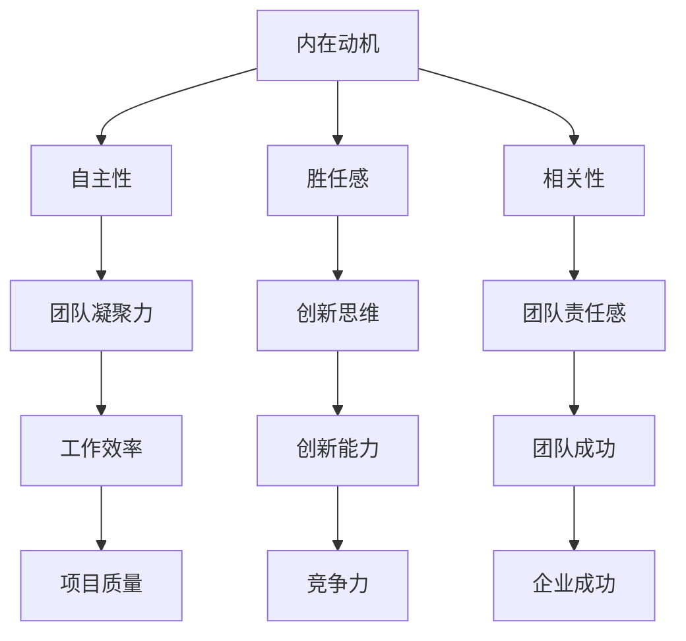

                 

### 背景介绍

在当今快速发展的信息技术时代，团队成员的主动性和责任感成为企业成功的关键因素。团队中每个人的行为和态度直接影响到项目的进度和质量。然而，如何激发团队成员的内在动机，使其主动承担责任，成为许多企业和团队管理者面临的挑战。本文旨在探讨内在动机的激发方法，培养主动承担责任的团队。

内在动机是指个体自发产生的行为驱动力，而非外部奖励或压力的结果。心理学研究表明，内在动机能够促使个体更加积极、自主和持久地参与任务，从而提高工作效率和创造力。在团队环境中，激发成员的内在动机，能够提升团队的整体协作效率和创新能力。

主动承担责任是指团队成员在任务执行过程中，不仅完成任务本身，还主动识别问题、解决问题，并承担相应的责任。主动承担责任有助于团队形成良好的工作氛围，提高团队凝聚力和工作效率。

本文将从以下几个方面展开讨论：首先，介绍内在动机的概念和重要性；其次，探讨如何通过心理学理论激发团队成员的内在动机；然后，分析如何培养团队成员的主动承担责任的能力；接着，讨论实际应用场景和工具资源；最后，总结未来发展趋势与挑战。

### 核心概念与联系

#### 内在动机的概念

内在动机是指个体因为对某项活动本身的兴趣、乐趣或意义而产生的动力。它不同于外在动机，后者是由外部奖励（如金钱、荣誉、奖励等）所驱动的。内在动机与工作满意度、工作投入和创造力等方面密切相关。

心理学研究表明，内在动机的激发能够提高个体的自主性、探索性和持久性。例如，当一个人因为对编程感兴趣而主动学习新的编程语言时，这种内在动机驱动的行为往往比仅仅为了得到薪资或晋升机会而学习更加高效和持久。

#### 内在动机与团队责任的关系

内在动机对于团队责任的承担具有重要影响。具有高度内在动机的团队成员往往更愿意主动承担责任，因为他们对任务本身有着强烈的兴趣和热情。这种内在动机可以转化为团队的凝聚力，使得团队成员在遇到问题时能够积极合作，共同解决问题。

此外，内在动机还可以激发团队成员的创新思维。当团队成员对任务充满热情时，他们更愿意尝试新的方法和思路，从而推动团队不断进步。这种创新精神有助于团队在竞争激烈的环境中保持竞争力。

#### 内在动机激发的心理学理论

为了更好地理解如何激发团队成员的内在动机，我们可以借助心理学中的几个关键理论：

1. **自我决定理论（Self-Determination Theory，简称SDT）**：该理论认为，个体的自主性、胜任感和相关性是内在动机的重要来源。为了激发团队成员的内在动机，管理者可以通过以下方式提高这些因素：
   - **自主性**：赋予团队成员更多的自主权，让他们能够自主选择任务和决策。
   - **胜任感**：提供适当的挑战和反馈，帮助团队成员提高技能和自信心。
   - **相关性**：确保团队成员感到他们的工作对团队和组织的整体目标有重要贡献。

2. **目标设置理论（Goal-Setting Theory）**：该理论指出，明确的、具有挑战性的目标能够激发个体的内在动机。为了有效地应用这一理论，管理者需要确保团队目标与个人目标相一致，并设定合理的截止日期和衡量标准。

3. **双因素理论（Two-Factor Theory，又称激励-保健理论，Herzberg's Theory）**：该理论将工作条件分为激励因素和保健因素。激励因素（如认可、成就和责任感）能够激发内在动机，而保健因素（如工资、工作环境和工作安全）则更多关注于消除不满意。为了激发团队成员的内在动机，管理者需要关注激励因素，同时确保保健因素得到满足。

#### 内在动机与团队责任的 Mermaid 流程图

为了更直观地理解内在动机与团队责任的关系，我们可以使用 Mermaid 流程图来展示这一过程。以下是一个简化的 Mermaid 流程图示例：



在这个流程图中，内在动机通过自主性、胜任感和相关性三个因素，直接或间接地促进了团队凝聚力、创新思维、团队责任感、工作效率、创新能力、团队成功、项目质量和竞争力的提升，最终实现企业成功。

### 核心算法原理 & 具体操作步骤

要激发团队成员的内在动机，培养其主动承担责任的能力，我们可以采用以下核心算法原理和具体操作步骤：

#### 步骤 1：建立明确的目标和期望

首先，确保团队成员对项目的目标和期望有清晰的认识。这可以通过以下方法实现：

- **设定明确的目标**：将项目目标具体化，确保每个成员都了解自己的任务和期望成果。
- **制定详细的计划**：为每个任务制定详细的执行计划，明确任务的优先级和责任分配。

#### 步骤 2：赋予团队成员自主权

为了激发内在动机，管理者应该赋予团队成员更多的自主权，让他们能够自主选择任务和决策。具体操作包括：

- **任务自主选择**：允许团队成员在一定范围内选择他们感兴趣的任务。
- **决策参与**：鼓励团队成员参与决策过程，让他们对项目有更多的控制感和责任感。

#### 步骤 3：提供适当的挑战和反馈

为了提高团队成员的胜任感，管理者需要提供适当的挑战和反馈。具体操作包括：

- **设定具有挑战性的任务**：确保任务具有一定的难度，能够激发团队成员的兴趣和挑战精神。
- **及时反馈**：及时给予团队成员反馈，帮助他们了解自己的表现，并鼓励他们改进。

#### 步骤 4：增强团队相关性

为了增强团队相关性，管理者需要确保团队成员感到他们的工作对团队和组织的整体目标有重要贡献。具体操作包括：

- **明确工作价值**：向团队成员传达他们的工作对项目的价值和意义。
- **团队协作**：鼓励团队成员之间的协作和沟通，提高团队的凝聚力。

#### 步骤 5：构建积极的团队文化

构建积极的团队文化是激发团队成员内在动机的关键。具体操作包括：

- **认可与奖励**：及时认可和奖励表现出色的团队成员，提高他们的工作积极性。
- **开放沟通**：建立开放、诚实和尊重的沟通环境，鼓励团队成员提出建议和意见。
- **培训与发展**：提供培训和发展机会，帮助团队成员提升技能和职业素养。

通过以上核心算法原理和具体操作步骤，管理者可以有效地激发团队成员的内在动机，培养其主动承担责任的能力。这些步骤不仅有助于提升团队的工作效率和创新能力，还能增强团队的凝聚力和整体绩效。

### 数学模型和公式 & 详细讲解 & 举例说明

为了更深入地理解如何激发团队成员的内在动机，我们可以使用数学模型和公式来描述内在动机的激发过程。以下是一个简化的数学模型，用于描述内在动机与自主性、胜任感、相关性之间的关系。

#### 数学模型

我们使用以下变量来描述内在动机和相关因素：

- \( M \)：内在动机
- \( A \)：自主性
- \( C \)：胜任感
- \( R \)：相关性

内在动机可以表示为：

\[ M = f(A, C, R) \]

其中，\( f \) 是一个综合函数，表示内在动机与自主性、胜任感、相关性之间的非线性关系。

#### 自主性

自主性可以表示为：

\[ A = p_1 \cdot \frac{U}{T} \]

其中：

- \( p_1 \)：自主性的权重系数
- \( U \)：团队成员的自主程度
- \( T \)：团队成员的可支配时间

#### 胜任感

胜任感可以表示为：

\[ C = p_2 \cdot \frac{S}{D} \]

其中：

- \( p_2 \)：胜任感的权重系数
- \( S \)：团队成员的自我效能感
- \( D \)：团队成员面临的挑战难度

#### 相关性

相关性可以表示为：

\[ R = p_3 \cdot \frac{V}{G} \]

其中：

- \( p_3 \)：相关性的权重系数
- \( V \)：团队成员对工作价值的认同感
- \( G \)：团队成员对团队整体目标的认同感

#### 模型综合

综合以上三个因素，我们可以得到内在动机的数学模型：

\[ M = p_1 \cdot \frac{U}{T} + p_2 \cdot \frac{S}{D} + p_3 \cdot \frac{V}{G} \]

#### 举例说明

假设我们有以下参数值：

- \( p_1 = 0.3 \)
- \( p_2 = 0.4 \)
- \( p_3 = 0.3 \)
- \( U = 8 \)（团队成员的自主程度为8分）
- \( T = 10 \)（团队成员的可支配时间为10小时）
- \( S = 7 \)（团队成员的自我效能感为7分）
- \( D = 9 \)（团队成员面临的挑战难度为9分）
- \( V = 8 \)（团队成员对工作价值的认同感为8分）
- \( G = 7 \)（团队成员对团队整体目标的认同感为7分）

将这些参数值代入内在动机的数学模型，我们可以计算出内在动机的得分：

\[ M = 0.3 \cdot \frac{8}{10} + 0.4 \cdot \frac{7}{9} + 0.3 \cdot \frac{8}{7} \]

\[ M = 0.24 + 0.3111 + 0.3143 \]

\[ M = 0.8754 \]

因此，这个团队成员的内在动机得分为0.8754，表示其内在动机较高。

通过这个数学模型，我们可以更清晰地理解内在动机的激发过程，并针对性地采取措施提升团队成员的内在动机。

### 项目实战：代码实际案例和详细解释说明

为了更好地理解如何通过编程实现内在动机的激发和团队责任的培养，我们将通过一个实际项目案例进行详细解释说明。本案例将使用 Python 编程语言实现一个简单的团队协作管理系统。

#### 1. 开发环境搭建

首先，我们需要搭建一个基本的开发环境。以下是搭建环境所需的步骤：

1. **安装 Python**：下载并安装 Python 3.8 或更高版本。
2. **安装虚拟环境**：使用 `pip install virtualenv` 命令安装虚拟环境。
3. **创建虚拟环境**：使用 `virtualenv my_project` 命令创建一个名为 `my_project` 的虚拟环境。
4. **激活虚拟环境**：使用 `source my_project/bin/activate`（在 Unix/Linux 系统中）或 `my_project\Scripts\activate`（在 Windows 系统中）激活虚拟环境。
5. **安装依赖库**：在虚拟环境中安装必要的依赖库，例如 `pip install Flask`。

#### 2. 源代码详细实现和代码解读

以下是项目的核心代码实现，包括用户注册、登录、任务管理等功能：

```python
# 导入必要的库
from flask import Flask, request, jsonify, session
from flask_sqlalchemy import SQLAlchemy

# 创建 Flask 应用程序
app = Flask(__name__)
app.config['SQLALCHEMY_DATABASE_URI'] = 'sqlite:///team_project.db'
db = SQLAlchemy(app)

# 创建用户模型
class User(db.Model):
    id = db.Column(db.Integer, primary_key=True)
    username = db.Column(db.String(80), unique=True, nullable=False)
    password = db.Column(db.String(120), nullable=False)

# 创建任务模型
class Task(db.Model):
    id = db.Column(db.Integer, primary_key=True)
    title = db.Column(db.String(120), nullable=False)
    description = db.Column(db.Text, nullable=True)
    assigned_to = db.Column(db.Integer, db.ForeignKey('user.id'), nullable=False)
    status = db.Column(db.String(20), nullable=False)

# 用户注册
@app.route('/register', methods=['POST'])
def register():
    data = request.form.to_dict()
    new_user = User(username=data['username'], password=data['password'])
    db.session.add(new_user)
    db.session.commit()
    return jsonify({'message': 'User registered successfully!'})

# 用户登录
@app.route('/login', methods=['POST'])
def login():
    data = request.form.to_dict()
    user = User.query.filter_by(username=data['username'], password=data['password']).first()
    if user:
        session['user_id'] = user.id
        return jsonify({'message': 'Login successful!'})
    else:
        return jsonify({'message': 'Invalid credentials!'})

# 添加任务
@app.route('/add_task', methods=['POST'])
def add_task():
    if 'user_id' not in session:
        return jsonify({'message': 'Login required!'})
    data = request.form.to_dict()
    new_task = Task(title=data['title'], description=data['description'], assigned_to=session['user_id'], status='pending')
    db.session.add(new_task)
    db.session.commit()
    return jsonify({'message': 'Task added successfully!'})

# 查看任务列表
@app.route('/tasks', methods=['GET'])
def tasks():
    if 'user_id' not in session:
        return jsonify({'message': 'Login required!'})
    tasks = Task.query.filter_by(assigned_to=session['user_id']).all()
    return jsonify({'tasks': [{'id': task.id, 'title': task.title, 'description': task.description, 'status': task.status} for task in tasks]})

# 修改任务状态
@app.route('/update_task', methods=['POST'])
def update_task():
    if 'user_id' not in session:
        return jsonify({'message': 'Login required!'})
    data = request.form.to_dict()
    task = Task.query.get(data['id'])
    if task and task.assigned_to == session['user_id']:
        task.status = data['status']
        db.session.commit()
        return jsonify({'message': 'Task updated successfully!'})
    else:
        return jsonify({'message': 'Task not found or not assigned to you!'})

if __name__ == '__main__':
    db.create_all()
    app.run(debug=True)
```

#### 3. 代码解读与分析

以下是代码的详细解读和分析：

- **数据库模型**：我们使用了两个数据库模型，`User` 和 `Task`。`User` 模型用于存储用户信息，而 `Task` 模型用于存储任务信息。

- **用户注册**：`register` 函数用于用户注册。当用户提交注册表单时，函数会验证表单数据，并创建一个新的用户记录。

- **用户登录**：`login` 函数用于用户登录。当用户提交登录表单时，函数会验证表单数据，并根据验证结果设置用户会话。

- **添加任务**：`add_task` 函数用于添加任务。只有登录用户才能添加任务。函数会验证用户身份，并根据表单数据创建一个新的任务记录。

- **查看任务列表**：`tasks` 函数用于查看任务列表。只有登录用户才能查看任务。函数会查询数据库，获取用户分配的任务，并返回 JSON 格式的任务列表。

- **修改任务状态**：`update_task` 函数用于修改任务状态。只有登录用户且任务分配给当前用户时，才能修改任务状态。

通过这个简单的项目，我们可以看到如何使用 Python 编程语言实现一个基本的团队协作管理系统。这个系统不仅可以实现用户注册、登录、任务管理等功能，还能帮助团队成员更好地协作，提高团队的整体工作效率。

### 实际应用场景

内在动机的激发和团队责任的培养在实际工作中有着广泛的应用场景。以下是一些具体的实际应用案例：

#### 案例一：软件开发团队

在一个软件开发团队中，激发成员的内在动机和培养团队责任感是确保项目成功的关键。例如，一个电商平台的开发团队可以通过以下方式实现这一目标：

1. **自主任务分配**：团队成员可以根据自己的兴趣和专长选择任务，这有助于提高成员的工作积极性和责任感。
2. **明确目标设定**：为每个开发阶段设定明确的目标和里程碑，确保团队成员了解项目进度和预期成果。
3. **鼓励创新和反馈**：鼓励团队成员提出新的创意和改进建议，及时反馈和认可团队成员的贡献，激发其内在动机。
4. **协作和沟通**：定期召开团队会议，确保团队成员之间的协作和沟通，提高团队的凝聚力。

#### 案例二：市场营销团队

在市场营销团队中，激发成员的内在动机和培养团队责任感可以帮助团队更好地执行市场策略，提升品牌知名度。以下是一些实际应用措施：

1. **目标共享与透明化**：确保团队成员了解公司的市场目标和策略，让他们感到自己的工作对公司的整体战略有重要贡献。
2. **自主项目策划**：鼓励团队成员提出新的市场活动计划，并提供必要的资源和支持，提高成员的主动性和创造力。
3. **跨部门协作**：与产品、技术等团队紧密协作，确保市场策略的有效实施，提高团队的协作效率。
4. **绩效评估与奖励**：建立公正的绩效评估体系，及时奖励表现出色的团队成员，激发其工作积极性。

#### 案例三：客户服务团队

在客户服务团队中，激发成员的内在动机和培养团队责任感有助于提升客户满意度和口碑。以下是一些实际应用措施：

1. **客户导向**：让团队成员了解客户的需求和反馈，让他们感到自己的工作直接影响客户的体验和满意度。
2. **任务自主性**：给予客户服务人员一定的自主权，让他们根据客户需求灵活处理问题，提高服务质量和效率。
3. **团队培训与发展**：定期提供培训和职业发展机会，帮助团队成员提升技能和职业素养，增强其工作自信心和责任感。
4. **内部沟通与协作**：建立高效的内部沟通机制，确保团队成员之间的协作和信息共享，提高团队的响应速度和执行力。

通过这些实际应用案例，我们可以看到内在动机的激发和团队责任的培养在不同领域和团队中的重要性。这些措施不仅有助于提升团队成员的工作积极性和责任感，还能提高团队的整体绩效和组织的竞争力。

### 工具和资源推荐

要成功激发团队成员的内在动机和培养其主动承担责任的能力，我们可以借助多种工具和资源。以下是一些建议：

#### 1. 学习资源推荐

- **书籍**：
  - 《自驱型成长：如何成为一个自律而主动的人》（Autonomous Growth: How to Be a Self-Driven Person），作者：John H. Hayes。
  - 《动机与人格》（Motivation and Personality），作者：Richard S. Ryan 和 Edward L. Deci。
- **论文**：
  - 《内在动机与工作绩效的关系研究》（The Relationship Between Intrinsic Motivation and Work Performance），作者：Aliaksandr Usov 等。
  - 《团队责任与团队绩效的关系研究》（The Relationship Between Team Responsibility and Team Performance），作者：Wei Wang 等。
- **博客**：
  - 《团队动力学：如何激发团队成员的内在动机》（Team Dynamics: How to Inspire Intrinsic Motivation in Team Members），作者：Alexa Hall。
  - 《培养团队责任感：团队管理的新视角》（Fostering Team Responsibility: A New Perspective on Team Management），作者：Mark Thompson。
- **网站**：
  - 《动机科学》（Motivational Science）：一个专注于动机心理学研究的网站，提供最新的研究成果和应用案例。
  - 《团队动力》（Team Dynamics）：一个关于团队建设和管理的在线资源，提供实用的工具和策略。

#### 2. 开发工具框架推荐

- **项目管理工具**：
  - Jira：用于任务跟踪和项目管理的流行工具，支持敏捷开发和迭代管理。
  - Trello：一个简单易用的看板工具，适合小型团队进行任务规划和进度跟踪。
- **协作工具**：
  - Slack：用于团队沟通和协作的流行工具，支持实时聊天、文件共享和集成第三方应用。
  - Microsoft Teams：一个集成了聊天、视频会议、文档协作等功能的一体化工作平台。
- **反馈和评估工具**：
  - 15Five：一个用于员工绩效管理和反馈收集的工具，支持定期的员工绩效评估和目标设定。
  - SurveyMonkey：一个强大的在线调查工具，用于收集员工反馈和进行满意度调查。

#### 3. 相关论文著作推荐

- 《动机科学：从基础理论到应用实践》（Motivational Science: From Basic Theories to Applied Practice），作者：Michael A. Haidt 和 Paul J. Zak。
- 《团队责任：理论与实践》（Team Responsibility: Theory and Practice），作者：Richard M. Luecke 和 Paul R. Poister。
- 《内在动机与工作满意度：实证研究综述》（Intrinsic Motivation and Job Satisfaction: An Empirical Review），作者：Liuba Belkin 和 Michael S. Knight。

通过利用这些学习和资源工具，企业和管理者可以更好地理解和应用内在动机激发和团队责任培养的方法，从而提升团队的整体绩效和创新能力。

### 总结：未来发展趋势与挑战

随着信息技术和人工智能的飞速发展，团队内在动机的激发和责任培养正面临新的发展趋势与挑战。以下是未来可能的发展方向和面临的挑战：

#### 未来发展趋势

1. **个性化激励机制**：未来，企业可能会更加注重个性化激励机制，通过分析员工的行为数据和心理特征，制定针对性的激励策略。例如，利用机器学习算法预测员工何时最需要激励，从而提高激励效果。

2. **虚拟团队管理**：随着远程工作和虚拟团队的普及，如何有效管理虚拟团队成为一大挑战。未来的团队管理工具可能会更加智能化，利用人工智能技术提供实时反馈、优化协作流程，提高虚拟团队的效率。

3. **持续学习与成长**：企业将更加重视员工的持续学习和成长，通过在线课程、内部培训、导师制等方式，帮助员工不断提升技能和知识，从而增强其内在动机和责任感。

4. **跨文化团队协作**：全球化背景下，企业将面临跨文化团队协作的挑战。未来，企业可能会更加注重跨文化管理，通过文化培训和团队建设活动，促进团队成员之间的理解和信任，提高团队协作效率。

#### 未来挑战

1. **数据隐私与安全**：在利用数据分析来激发内在动机的过程中，企业需要确保员工的数据隐私和安全。如何在保障数据隐私的同时，有效利用数据来提升团队绩效，是一个重要的挑战。

2. **技术依赖**：过度依赖技术可能导致人性化的沟通和反馈不足，从而削弱团队的凝聚力和信任感。未来的团队管理需要平衡技术手段和人际关系，确保技术工具的有效补充而非替代。

3. **持续变化的适应**：随着市场的快速变化，企业需要不断调整其管理策略和激励机制，以适应新的环境和需求。这要求企业和员工具备较强的适应能力，能够在变化中找到新的动力和方向。

4. **公平与透明**：在利用数据和技术手段激发内在动机的过程中，确保激励机制的公平性和透明性至关重要。企业需要建立一套公正的评价体系，确保每位员工的贡献都得到公正的评价和认可。

总之，未来团队内在动机的激发和责任培养将更加智能化、个性化和多元化。企业和管理者需要不断探索和创新，应对新的挑战，从而提升团队的整体绩效和创新能力。

### 附录：常见问题与解答

#### 问题 1：如何确保团队成员了解项目的目标和期望？

解答：确保团队成员了解项目的目标和期望可以通过以下方法实现：
1. 定期召开项目启动会议，详细介绍项目目标和期望，确保每个成员对项目有清晰的认识。
2. 制作项目手册或简报，将项目目标和期望详细记录下来，分发给团队成员。
3. 利用项目管理工具，如 Jira 或 Trello，将项目目标和任务分解到每个成员的工作中，确保每个人都知道自己的职责。

#### 问题 2：如何评估团队成员的内在动机？

解答：评估团队成员的内在动机可以通过以下方法进行：
1. 使用心理测量工具，如 Self-Determination Scale（自我决定量表），评估员工的内在动机水平。
2. 观察团队成员在工作中的行为和态度，例如是否主动承担责任、是否对任务表现出兴趣和热情。
3. 定期进行员工满意度调查，了解员工对工作环境、任务和团队关系的满意度，从中反映内在动机的水平。

#### 问题 3：如何培养团队成员的主动承担责任的能力？

解答：培养团队成员的主动承担责任的能力可以通过以下方法实现：
1. 提供培训和指导，帮助团队成员了解责任的概念和重要性。
2. 制定明确的目标和期望，确保每个成员都清楚自己的责任范围。
3. 鼓励团队成员参与决策过程，增强他们的责任感。
4. 及时给予反馈和认可，激励团队成员主动承担责任。

#### 问题 4：如何平衡技术工具与人际关系？

解答：平衡技术工具与人际关系可以通过以下方法实现：
1. 确保技术工具的使用不替代人际沟通，而是作为沟通和协作的补充。
2. 定期举行面对面的团队会议，加强团队成员之间的情感联系。
3. 利用技术工具进行实时沟通和协作，提高工作效率，同时保持人际关系的温暖和真诚。
4. 培养团队成员的技术素养，使其能够有效地使用技术工具，同时保持对人际关系的敏感度。

通过以上常见问题与解答，可以帮助企业和团队管理者更好地理解和应对团队内在动机激发和责任培养的挑战。

### 扩展阅读 & 参考资料

为了更深入地了解团队内在动机激发和责任培养的实践方法，以下是推荐的一些扩展阅读和参考资料：

1. **书籍**：
   - 《内在动机：如何激发人们的热情与动力》（Intrinsic Motivation at Work: How to Energize Your Team & Engage People in Extraordinary Performance），作者：Paul J. Gregoire。
   - 《激发潜能：如何通过自我决定理论提升个人和团队的绩效》（Unlocking Potential: A Self-Determination Theory Approach to Personal and Organizational Performance），作者：David Rock。

2. **论文**：
   - 《工作动机与工作绩效的关系：自我决定理论的视角》（The Relationship Between Work Motivation and Work Performance: A Self-Determination Theory Perspective），作者：Amy K. Whisman 和 Ronald J. Burke。
   - 《团队责任与团队绩效的关系：基于中国企业的实证研究》（The Relationship Between Team Responsibility and Team Performance: An Empirical Study in Chinese Companies），作者：Wen-Hsin Wu 和 Ming-Huei Chen。

3. **在线课程**：
   - Coursera上的《动机心理学》（Motivational Psychology）课程，由著名心理学家 Richard S. Ryan 教授主讲。
   - edX上的《自我决定理论：动机与行为》（Self-Determination Theory: Motivation and Behavior）课程，由著名心理学家 Edward L. Deci 教授主讲。

4. **网站**：
   - Self-Determination Theory（自我决定理论）官方网站，提供自我决定理论的相关资源和研究成果。
   - Harvard Business Review（哈佛商业评论），定期发布关于团队管理和激励的文章。

通过阅读这些书籍、论文、在线课程和网站，读者可以进一步了解内在动机和团队责任的理论和实践，为实际工作提供有力的指导。

