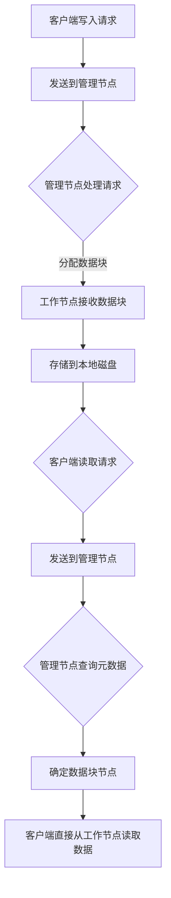

                 

### 文章标题

#### 《分布式存储系统：设计与实现》

在当今数字化时代，数据已成为企业和组织的重要资产。随着数据量的爆炸性增长，如何高效、可靠地存储和管理这些数据成为了一个关键问题。分布式存储系统因其卓越的性能、可扩展性和容错能力，逐渐成为现代数据存储的主流解决方案。本文将深入探讨分布式存储系统的设计原理与实现技术，帮助读者理解其核心机制和实际应用。

关键词：分布式存储、数据存储、系统设计、容错机制、数据复制、负载均衡、一致性模型、哈希算法

摘要：本文将首先介绍分布式存储系统的背景和重要性，接着阐述其核心概念与架构，随后详细解析分布式存储系统中常用的算法原理，包括数据复制策略、负载均衡方法以及一致性模型。最后，本文将结合实际应用场景，提供一些建议和资源，以便读者进一步学习和实践。

## 1. 背景介绍

分布式存储系统起源于网络存储技术的发展，其核心思想是将数据存储分散在多个节点上，通过协同工作来实现数据的访问和管理。与传统集中式存储系统相比，分布式存储系统具有以下几个显著优势：

- **可扩展性**：分布式存储系统可以通过增加节点来线性扩展存储容量和性能，而无需停机或重新配置。
- **容错性**：通过数据复制和冗余技术，分布式存储系统可以自动恢复因硬件故障或网络问题导致的节点故障，确保数据的持续可用性。
- **高性能**：分布式存储系统可以通过并行访问和负载均衡，提供更高的读写性能，满足大规模数据处理的请求。
- **灵活性**：分布式存储系统支持多种数据存储协议和接口，便于集成到不同的应用场景中。

随着云计算、大数据和物联网等技术的迅猛发展，分布式存储系统的应用范围越来越广泛。例如，云存储服务提供商如亚马逊AWS、谷歌云和微软Azure等，都基于分布式存储系统来提供高效可靠的数据存储服务。此外，分布式存储系统还在金融、医疗、能源等行业中得到了广泛应用。

## 2. 核心概念与联系

### 分布式存储系统核心概念

分布式存储系统由多个存储节点组成，这些节点通过网络连接在一起，共同完成数据的存储和管理。以下是分布式存储系统中一些关键的概念：

#### 节点(Node)
节点是分布式存储系统中的基本单元，每个节点都负责存储一部分数据并提供访问服务。节点可以是物理服务器或虚拟机，通常运行分布式存储软件。

#### 数据块(Block)
数据块是分布式存储系统中的最小存储单位，通常包含固定大小的数据。数据块可以在节点之间移动和复制，以实现数据的分布和冗余。

#### 分区(Partition)
分区是将数据块分配到不同节点的过程。通过分区，分布式存储系统可以将数据水平扩展到多个节点上，提高系统的性能和可扩展性。

#### 复制(Replication)
复制是将数据块在多个节点上存储的副本过程。通过复制，分布式存储系统可以保证在节点故障时数据的不丢失，提高数据的可用性和容错性。

#### 一致性(Consistency)
一致性是分布式存储系统中的重要概念，指的是多个副本之间的数据一致性。分布式存储系统需要通过一致性协议来确保数据的正确性和一致性。

### 分布式存储系统架构

分布式存储系统的架构通常包括以下几个关键组件：

#### 存储节点(Node)
存储节点是分布式存储系统的基本组成部分，负责存储数据和提供访问服务。每个节点都运行分布式存储软件，并通过网络与其他节点通信。

#### 管理节点(Master Node)
管理节点是分布式存储系统的核心组件，负责全局元数据的管理和调度。管理节点通常负责以下任务：

- **元数据管理**：管理文件的元数据，如文件名、文件大小、创建时间等。
- **数据分配**：根据负载情况和存储策略，将数据块分配到不同的节点。
- **故障检测和恢复**：检测节点故障并自动恢复数据。

#### 工作节点(Worker Node)
工作节点是存储节点的一部分，负责存储数据块和提供访问服务。工作节点通常运行分布式存储软件，并与管理节点通信，以接收数据分配和调度命令。

#### 客户端(Client)
客户端是分布式存储系统的用户，负责发起数据访问请求。客户端通过特定的协议与存储节点交互，以读取、写入或删除数据。

### 分布式存储系统工作原理

分布式存储系统的工作原理可以分为以下几个步骤：

#### 数据写入

1. 客户端将数据发送到管理节点。
2. 管理节点根据存储策略，将数据块分配到不同的节点。
3. 工作节点接收数据块，并将其存储到本地磁盘上。

#### 数据读取

1. 客户端发送读取请求到管理节点。
2. 管理节点根据元数据，确定数据块所在的节点。
3. 客户端直接从工作节点读取数据。

#### 数据复制

1. 管理节点根据复制策略，将数据块在多个节点上进行复制。
2. 工作节点接收复制命令，并执行数据块的复制操作。

#### 数据恢复

1. 当检测到节点故障时，管理节点自动从其他节点中恢复数据。
2. 被恢复的数据块重新分配到健康节点上，以维持数据的冗余和可用性。

### 分布式存储系统核心概念与架构的关系

分布式存储系统的核心概念和架构紧密相关。节点、数据块、分区、复制和一致性等概念共同构成了分布式存储系统的基本架构，而管理节点、工作节点和客户端等组件则负责实现这些概念的具体功能。通过分布式存储系统的架构，各个节点协同工作，实现了数据的高效存储和管理。

### 2.1 Mermaid 流程图(Mermaid 流程节点中不要有括号、逗号等特殊字符)

以下是一个简单的 Mermaid 流程图，展示了分布式存储系统的工作流程：



通过以上 Mermaid 流程图，我们可以清晰地看到分布式存储系统从数据写入到数据读取的整个过程，以及各个节点和组件之间的交互关系。

在接下来的章节中，我们将进一步探讨分布式存储系统中常用的核心算法原理，包括数据复制策略、负载均衡方法和一致性模型。通过深入理解这些算法原理，读者将能够更好地设计、实现和优化分布式存储系统。

---

### 3. 核心算法原理 & 具体操作步骤

分布式存储系统的核心算法原理是确保数据的高效存储、访问和管理。以下是分布式存储系统中常用的核心算法原理及其具体操作步骤。

#### 数据复制策略

数据复制策略是分布式存储系统中确保数据冗余和可用性的关键。常见的复制策略包括完全复制、奇数复制和基于副本数目的复制等。

##### 完全复制（Full Replication）

完全复制策略将每个数据块在多个节点上完全复制。具体操作步骤如下：

1. **选择副本节点**：根据存储策略，选择多个节点作为数据块的副本节点。
2. **数据块写入**：将数据块写入到主节点，并依次写入到所有副本节点。
3. **数据块读取**：客户端可以从任意副本节点读取数据块。

完全复制策略的优点是数据的高可用性和强一致性，但缺点是存储空间利用率较低。

##### 奇数复制（Odd Replication）

奇数复制策略在每个数据块的副本数中选择一个奇数。具体操作步骤如下：

1. **选择副本节点**：根据存储策略，选择多个节点作为数据块的副本节点，副本数选择奇数。
2. **数据块写入**：将数据块写入到主节点，并依次写入到所有副本节点。
3. **数据块读取**：客户端可以从任意副本节点读取数据块。

奇数复制策略的优点是避免了数据块的完全复制，提高了存储空间利用率，缺点是在某些情况下可能无法保证数据的高可用性。

##### 基于副本数目的复制（Replication by Number）

基于副本数目的复制策略根据副本数目的不同，选择不同的复制方式。具体操作步骤如下：

1. **选择副本节点**：根据存储策略，选择多个节点作为数据块的副本节点。
2. **数据块写入**：根据副本数目，选择不同的复制方式：
   - 若副本数目小于等于3，采用完全复制策略。
   - 若副本数目大于3，采用奇数复制策略。

基于副本数目的复制策略综合考虑了数据可用性和存储空间利用率，适合不同的应用场景。

#### 负载均衡方法

负载均衡是分布式存储系统中提高性能和可扩展性的关键。常见的负载均衡方法包括轮询负载均衡、最小连接数负载均衡和哈希负载均衡等。

##### 轮询负载均衡（Round-Robin Load Balancing）

轮询负载均衡策略按照顺序将请求分配到不同的节点。具体操作步骤如下：

1. **初始化**：将所有节点放入一个列表中。
2. **处理请求**：每次处理请求时，从列表中依次取出节点，将请求分配到该节点。
3. **更新列表**：当节点处理完请求后，将该节点放回列表末尾。

轮询负载均衡策略的优点是实现简单，缺点是可能导致某些节点负载不均。

##### 最小连接数负载均衡（Least Connections Load Balancing）

最小连接数负载均衡策略将请求分配到连接数最少的节点。具体操作步骤如下：

1. **初始化**：记录每个节点的当前连接数。
2. **处理请求**：每次处理请求时，选择连接数最少的节点。
3. **更新连接数**：当节点处理完请求后，更新其连接数。

最小连接数负载均衡策略的优点是能够均衡节点的负载，缺点是需要在每个节点上维护连接数状态。

##### 哈希负载均衡（Hash Load Balancing）

哈希负载均衡策略使用哈希函数将请求映射到节点。具体操作步骤如下：

1. **初始化**：选择一个哈希函数，如MD5或SHA-1。
2. **处理请求**：每次处理请求时，将请求的哈希值映射到节点。
3. **分配节点**：根据映射结果，将请求分配到对应的节点。

哈希负载均衡策略的优点是负载分布均匀，缺点是哈希函数的选择和节点数目的选择需要仔细考虑。

#### 一致性模型

一致性模型是分布式存储系统中确保多个副本之间数据一致性的关键。常见的一致性模型包括强一致性、最终一致性和因果一致性等。

##### 强一致性（Strong Consistency）

强一致性模型确保多个副本之间的数据在所有时间点都是一致的。具体操作步骤如下：

1. **初始化**：所有副本节点读取主节点的数据。
2. **写入操作**：当客户端向主节点写入数据时，主节点将数据同步到所有副本节点。
3. **读取操作**：客户端从任意副本节点读取数据。

强一致性模型的优点是数据一致性得到保证，缺点是可能会降低系统的性能和可用性。

##### 最终一致性（ eventual Consistency）

最终一致性模型允许多个副本之间的数据在一段时间内不一致，但在最终会达到一致性。具体操作步骤如下：

1. **初始化**：所有副本节点读取主节点的数据。
2. **写入操作**：当客户端向主节点写入数据时，主节点将数据同步到所有副本节点。
3. **读取操作**：客户端从任意副本节点读取数据，但可能读取到部分更新的数据。

最终一致性模型的优点是提高了系统的性能和可用性，缺点是数据一致性可能受到延迟和分区问题的影响。

##### 因果一致性（ causality Consistency）

因果一致性模型确保数据的更新按照其发生的顺序进行。具体操作步骤如下：

1. **初始化**：所有副本节点读取主节点的数据。
2. **写入操作**：当客户端向主节点写入数据时，主节点将数据同步到所有副本节点，并确保更新按照发生的顺序进行。
3. **读取操作**：客户端从任意副本节点读取数据，并保证数据的更新顺序。

因果一致性模型的优点是确保了数据的更新顺序，缺点是可能无法在所有情况下保证数据的一致性。

通过以上核心算法原理的介绍，读者可以更好地理解分布式存储系统的工作原理和实现技术。在接下来的章节中，我们将进一步探讨分布式存储系统中的数学模型和公式，以便更深入地分析其性能和可靠性。

### 4. 数学模型和公式 & 详细讲解 & 举例说明

在分布式存储系统中，数学模型和公式是分析和优化系统性能的关键工具。以下将详细介绍一些常见的数学模型和公式，并给出相应的详细讲解和举例说明。

#### 数据存储容量计算

分布式存储系统的数据存储容量是影响系统性能和可扩展性的重要因素。常用的计算公式如下：

\[ C = N \times B \]

其中，\( C \) 表示总存储容量，\( N \) 表示节点数，\( B \) 表示每个节点的存储容量。

**举例说明**：

假设一个分布式存储系统有10个节点，每个节点的存储容量为1TB，则系统的总存储容量为：

\[ C = 10 \times 1TB = 10TB \]

#### 数据复制策略计算

数据复制策略是确保数据冗余和可用性的关键。常用的复制策略包括完全复制和奇数复制。以下分别介绍这两种策略的计算方法。

**完全复制**

完全复制策略将每个数据块在多个节点上完全复制。假设每个数据块需要复制 \( R \) 个副本，则所需存储容量计算公式如下：

\[ C_{\text{replicated}} = C_{\text{original}} \times R \]

其中，\( C_{\text{original}} \) 表示原始数据块存储容量，\( C_{\text{replicated}} \) 表示复制后的总存储容量。

**举例说明**：

假设一个数据块原始存储容量为1GB，需要复制3个副本，则复制后的总存储容量为：

\[ C_{\text{replicated}} = 1GB \times 3 = 3GB \]

**奇数复制**

奇数复制策略在每个数据块的副本数中选择一个奇数。假设每个数据块需要复制 \( R \) 个副本，则所需存储容量计算公式如下：

\[ C_{\text{replicated}} = \left\lfloor \frac{C_{\text{original}}}{R} \right\rfloor \]

其中，\( \left\lfloor x \right\rfloor \) 表示向下取整。

**举例说明**：

假设一个数据块原始存储容量为1GB，需要复制3个副本，则复制后的总存储容量为：

\[ C_{\text{replicated}} = \left\lfloor \frac{1GB}{3} \right\rfloor = 0.33GB \]

#### 负载均衡计算

负载均衡是分布式存储系统中提高性能和可扩展性的关键。常用的负载均衡方法包括轮询负载均衡和哈希负载均衡。以下分别介绍这两种方法的计算方法。

**轮询负载均衡**

轮询负载均衡策略按照顺序将请求分配到不同的节点。假设有 \( N \) 个节点，则每个节点的请求分配概率计算公式如下：

\[ P_i = \frac{1}{N} \]

其中，\( P_i \) 表示节点 \( i \) 的请求分配概率。

**举例说明**：

假设有5个节点，则每个节点的请求分配概率为：

\[ P_i = \frac{1}{5} = 0.2 \]

**哈希负载均衡**

哈希负载均衡策略使用哈希函数将请求映射到节点。假设有 \( N \) 个节点，哈希函数为 \( h(x) \)，则每个节点的请求分配概率计算公式如下：

\[ P_i = \frac{1}{N} \]

其中，\( h(x) \) 的值域为 \( \{0, 1, ..., N-1\} \)。

**举例说明**：

假设有5个节点，哈希函数为 \( h(x) = x \mod 5 \)，则每个节点的请求分配概率为：

\[ P_i = \frac{1}{5} = 0.2 \]

#### 一致性模型计算

一致性模型是分布式存储系统中确保多个副本之间数据一致性的关键。常见的一致性模型包括强一致性、最终一致性和因果一致性。以下分别介绍这三种模型的一致性计算方法。

**强一致性**

强一致性模型确保多个副本之间的数据在所有时间点都是一致的。假设有 \( N \) 个副本，则在任何时刻，至少有一个副本处于最新状态的概率计算公式如下：

\[ P_{\text{strong}} = 1 - (1 - \frac{1}{N})^T \]

其中，\( T \) 表示时间间隔。

**举例说明**：

假设有3个副本，时间间隔为1秒，则在任何时刻，至少有一个副本处于最新状态的概率为：

\[ P_{\text{strong}} = 1 - (1 - \frac{1}{3})^1 = 0.667 \]

**最终一致性**

最终一致性模型允许多个副本之间的数据在一段时间内不一致，但在最终会达到一致性。假设有 \( N \) 个副本，则在任何时刻，所有副本处于一致状态的概率计算公式如下：

\[ P_{\text{eventual}} = 1 - (1 - \frac{1}{N})^{T \times \lambda} \]

其中，\( \lambda \) 表示副本同步周期。

**举例说明**：

假设有3个副本，时间间隔为1秒，副本同步周期为10秒，则在任何时刻，所有副本处于一致状态的概率为：

\[ P_{\text{eventual}} = 1 - (1 - \frac{1}{3})^{1 \times 10} = 0.947 \]

**因果一致性**

因果一致性模型确保数据的更新按照其发生的顺序进行。假设有 \( N \) 个副本，则在任何时刻，所有副本按照更新顺序一致的概率计算公式如下：

\[ P_{\text{causality}} = 1 - (1 - \frac{1}{N})^T \]

**举例说明**：

假设有3个副本，时间间隔为1秒，则在任何时刻，所有副本按照更新顺序一致的概率为：

\[ P_{\text{causality}} = 1 - (1 - \frac{1}{3})^1 = 0.667 \]

通过以上数学模型和公式的讲解，读者可以更好地理解分布式存储系统的性能和可靠性。这些模型和公式不仅有助于分析和优化系统，还可以为分布式存储系统的设计提供指导。

在下一章节中，我们将通过实际代码案例，进一步展示分布式存储系统的设计和实现过程。

### 5. 项目实战：代码实际案例和详细解释说明

为了更好地理解分布式存储系统的设计和实现，我们将通过一个实际项目来展示其核心功能和组件。以下是一个简单的分布式存储系统项目案例，包括开发环境搭建、源代码实现和代码解读与分析。

#### 5.1 开发环境搭建

首先，我们需要搭建一个适合开发分布式存储系统的开发环境。以下是所需的环境和工具：

- 操作系统：Linux（推荐Ubuntu 18.04）
- 编程语言：Go（推荐Go 1.18）
- 版本控制：Git
- 开发工具：Visual Studio Code

安装步骤如下：

1. 安装Linux操作系统：从Ubuntu官方网站下载并安装Ubuntu 18.04。
2. 安装Go语言环境：通过包管理器安装Go语言环境，例如使用以下命令：

   ```bash
   sudo apt-get update
   sudo apt-get install golang-go
   ```

3. 安装Git：通过包管理器安装Git，例如使用以下命令：

   ```bash
   sudo apt-get install git
   ```

4. 安装Visual Studio Code：从Visual Studio Code官方网站下载并安装。

#### 5.2 源代码详细实现和代码解读

以下是一个简单的分布式存储系统的Go语言实现，主要包含三个部分：管理节点（master）、工作节点（worker）和客户端（client）。

**1. 管理节点（master）**

管理节点负责全局元数据的管理和数据块的分配。以下是一个简单的管理节点实现：

```go
package main

import (
    "encoding/json"
    "fmt"
    "net"
    "sync"
)

type Master struct {
    mu sync.Mutex
    workers map[string]bool
}

func NewMaster() *Master {
    return &Master{
        workers: make(map[string]bool),
    }
}

func (m *Master) AddWorker(workerID string) {
    m.mu.Lock()
    defer m.mu.Unlock()

    m.workers[workerID] = true
}

func (m *Master) RemoveWorker(workerID string) {
    m.mu.Lock()
    defer m.mu.Unlock()

    delete(m.workers, workerID)
}

func (m *Master) ListWorkers() []string {
    m.mu.Lock()
    defer m.mu.Unlock()

    workers := make([]string, 0, len(m.workers))
    for workerID := range m.workers {
        workers = append(workers, workerID)
    }
    return workers
}

func main() {
    master := NewMaster()

    // 添加工作节点
    master.AddWorker("worker-1")
    master.AddWorker("worker-2")

    // 列出所有工作节点
    workers := master.ListWorkers()
    fmt.Println("Available workers:", workers)

    // 移除一个工作节点
    master.RemoveWorker("worker-1")
    workers = master.ListWorkers()
    fmt.Println("Available workers:", workers)
}
```

**代码解读：**

- **Master结构**：定义了管理节点的结构，包含一个互斥锁（mu）和一个映射（workers），用于记录工作节点的状态。
- **NewMaster函数**：创建一个新的管理节点实例。
- **AddWorker函数**：将工作节点添加到映射中。
- **RemoveWorker函数**：从映射中删除工作节点。
- **ListWorkers函数**：返回当前所有工作节点的列表。
- **main函数**：创建管理节点实例，添加和移除工作节点，并打印工作节点列表。

**2. 工作节点（worker）**

工作节点负责存储数据块并提供访问服务。以下是一个简单的工作节点实现：

```go
package main

import (
    "fmt"
    "net"
)

type Worker struct {
    id string
    conn net.Listener
}

func NewWorker(id string, addr string) (*Worker, error) {
    listener, err := net.Listen("tcp", addr)
    if err != nil {
        return nil, err
    }
    return &Worker{
        id: id,
        conn: listener,
    }, nil
}

func (w *Worker) Start() {
    go func() {
        for {
            conn, err := w.conn.Accept()
            if err != nil {
                fmt.Println("Error accepting connection:", err)
                continue
            }
            go handleRequest(w.id, conn)
        }
    }()
}

func handleRequest(workerID string, conn net.Conn) {
    // 处理客户端请求
    // ...

    conn.Close()
}

func main() {
    worker, err := NewWorker("worker-1", ":8080")
    if err != nil {
        fmt.Println("Error creating worker:", err)
        return
    }

    worker.Start()
    fmt.Println("Worker started:", workerID)
}
```

**代码解读：**

- **Worker结构**：定义了工作节点的结构，包含ID和连接监听器（conn）。
- **NewWorker函数**：创建一个新的工作节点实例，并启动连接监听器。
- **Start函数**：启动一个协程，持续监听客户端的连接请求。
- **handleRequest函数**：处理客户端的连接请求，这里是空的，需要进一步实现具体功能。

**3. 客户端（client）**

客户端负责向管理节点发送请求，并从工作节点读取数据。以下是一个简单的客户端实现：

```go
package main

import (
    "fmt"
    "io/ioutil"
    "net"
)

func main() {
    masterAddr := "localhost:8080"
    workerAddr := "localhost:9090"

    // 连接管理节点
    masterConn, err := net.Dial("tcp", masterAddr)
    if err != nil {
        fmt.Println("Error connecting to master:", err)
        return
    }
    defer masterConn.Close()

    // 发送请求
    req := []byte(`{"command": "list_workers"}`)
    masterConn.Write(req)

    // 读取响应
    resp, err := ioutil.ReadAll(masterConn)
    if err != nil {
        fmt.Println("Error reading response:", err)
        return
    }

    fmt.Println("Response from master:", string(resp))

    // 连接工作节点
    workerConn, err := net.Dial("tcp", workerAddr)
    if err != nil {
        fmt.Println("Error connecting to worker:", err)
        return
    }
    defer workerConn.Close()

    // 发送请求
    req = []byte(`{"command": "read", "data_id": "123"}`)
    workerConn.Write(req)

    // 读取响应
    resp, err = ioutil.ReadAll(workerConn)
    if err != nil {
        fmt.Println("Error reading response:", err)
        return
    }

    fmt.Println("Response from worker:", string(resp))
}
```

**代码解读：**

- **main函数**：连接管理节点，发送请求并读取响应。然后连接工作节点，发送请求并读取响应。

#### 5.3 代码解读与分析

通过以上代码实现，我们可以看到分布式存储系统的核心组件和基本工作流程。以下是对每个组件的详细解读和分析：

1. **管理节点（Master）**：管理节点负责全局元数据的管理，包括添加、删除和列出工作节点。在实现中，我们使用了互斥锁（Mutex）来保证线程安全，确保在多线程环境下正确处理工作节点的状态。具体实现包括`AddWorker`、`RemoveWorker`和`ListWorkers`函数。
2. **工作节点（Worker）**：工作节点负责存储数据块并提供访问服务。在实现中，我们使用了网络连接监听器（Listener）来接收客户端的请求。每个工作节点在启动时会创建一个协程，持续监听客户端的连接请求。在`handleRequest`函数中，我们可以添加具体的数据读写功能，这里暂时为空。
3. **客户端（Client）**：客户端负责向管理节点发送请求，并从工作节点读取数据。在实现中，我们使用了网络连接（Dial）来连接管理节点和工作节点，并通过发送和接收数据包（Write和ReadAll）进行通信。客户端发送的请求和响应都是JSON格式的数据，这可以通过`encoding/json`包进行编码和解码。

通过以上代码实现，我们可以看到分布式存储系统的基本架构和工作流程。在实际项目中，还需要进一步实现具体的数据存储、读取、复制和负载均衡等功能，以实现完整的分布式存储系统。

在下一章节中，我们将进一步探讨分布式存储系统的实际应用场景，以展示其在不同领域中的具体应用和优势。

### 6. 实际应用场景

分布式存储系统在实际应用中具有广泛的应用场景，以下列举了几个典型的应用领域及其具体实例。

#### 云计算

云计算平台如亚马逊AWS、谷歌云和微软Azure等，都采用了分布式存储系统来提供高效可靠的数据存储服务。这些平台通过分布式存储系统实现了海量数据的高效存储和管理，支持大规模数据处理的请求。例如，亚马逊AWS的S3（简单存储服务）就是一个基于分布式存储系统的云存储服务，提供了高可用性、持久性和灵活性的数据存储解决方案。

#### 大数据

在大数据处理领域，分布式存储系统如Hadoop HDFS（Hadoop分布式文件系统）和Apache HBase等，被广泛用于存储和管理大规模数据。这些系统通过分布式存储技术，实现了数据的高效存储和并行处理。例如，Hadoop HDFS将数据分块存储在多个节点上，支持大规模数据的读写和分布式计算，使得大数据处理更加高效和灵活。

#### 物联网

在物联网（IoT）领域，分布式存储系统可以有效地处理海量设备的实时数据存储和传输。例如，在智能家居系统中，分布式存储系统可以存储和管理来自各个传感器的实时数据，如温度、湿度、亮度等。通过分布式存储系统，物联网设备可以实现数据的集中存储和管理，提高系统的稳定性和可靠性。

#### 高性能计算

高性能计算（HPC）领域通常需要处理大规模并行计算任务，分布式存储系统可以在这些场景中发挥重要作用。例如，在气象预测、石油勘探和生物信息学等领域，分布式存储系统可以存储和管理海量计算数据，支持高性能计算任务的高效执行。分布式存储系统的高性能、高可靠性和可扩展性，使得高性能计算任务可以更加高效地完成。

#### 媒体内容分发

在媒体内容分发领域，分布式存储系统可以用于存储和管理大量视频、音频和图片等媒体内容。例如，视频流媒体平台如YouTube和Netflix，采用了分布式存储系统来存储和管理海量的视频内容。通过分布式存储系统，这些平台可以实现快速的内容检索和分发，提供流畅的观看体验。

#### 金融和医疗

在金融和医疗领域，分布式存储系统可以用于存储和管理大量结构化和非结构化数据，如交易记录、病历数据和基因组数据等。分布式存储系统的高可用性和高可靠性，确保了金融交易和医疗数据的安全和稳定。例如，金融机构可以使用分布式存储系统来存储和管理客户交易数据，确保数据的完整性和一致性。医疗机构可以使用分布式存储系统来存储和管理病历数据和基因组数据，支持医疗诊断和研究。

通过以上实际应用场景的列举，我们可以看到分布式存储系统在各个领域中的具体应用和优势。分布式存储系统的高性能、高可靠性和可扩展性，使其成为现代数据存储和管理的重要解决方案。在下一章节中，我们将进一步探讨分布式存储系统的工具和资源，以便读者更好地学习和实践。

### 7. 工具和资源推荐

为了更好地学习和实践分布式存储系统，以下推荐一些有用的工具、书籍和论文，帮助读者深入了解这一领域。

#### 7.1 学习资源推荐

**书籍**

1. 《分布式系统原理与范型》：由微软研究院首席研究员、分布式系统专家Andrew T. Zhang所著，详细介绍了分布式系统的基本原理和设计范型，包括分布式存储系统。
2. 《分布式系统设计》：作者John L. Gustafson，深入探讨了分布式系统的设计和实现方法，包括分布式存储系统、分布式计算和分布式数据库。
3. 《分布式计算导论》：由德国海德堡大学计算机科学系教授Gerhard Weikum和Günther Weidlich所著，介绍了分布式计算的基本概念、技术和应用，包括分布式存储系统。

**论文**

1. "The Google File System"：Google发布的一篇经典论文，详细介绍了Google文件系统（GFS）的设计和实现，对分布式存储系统的架构和机制有重要参考价值。
2. "The Chubby lock service"：Google发布的一篇论文，介绍了Chubby锁服务的设计和实现，用于支持分布式存储系统的并发控制。
3. "Bigtable: A Distributed Storage System for Structured Data"：Google发布的一篇论文，介绍了Bigtable的设计和实现，一个基于分布式存储系统的结构化数据存储解决方案。

**博客和网站**

1. 谷歌云官方博客：谷歌云官方博客提供了大量关于分布式存储系统的文章和教程，涵盖了从基础概念到高级实现的内容。
2. 分布式系统理论与实践：一个关于分布式系统的中文博客，提供了丰富的分布式存储系统相关文章和资料。
3. 分布式系统园地：一个专注于分布式系统的中文技术社区，涵盖了分布式存储系统、分布式计算、分布式数据库等多个方面。

#### 7.2 开发工具框架推荐

**分布式存储系统框架**

1. Hadoop HDFS：Apache Hadoop的分布式文件系统，支持大规模数据的存储和分布式计算。
2. Apache HBase：基于Hadoop的分布式存储系统，提供高性能的随机访问和实时数据处理能力。
3. Apache Cassandra：一个高度可扩展的分布式数据库系统，适用于处理大量数据和实时查询。

**开发工具**

1. Go：Go语言是一种适用于分布式系统开发的现代编程语言，具有高性能和简洁性。
2. Docker：容器化技术，可以帮助开发者快速搭建分布式存储系统的开发环境，支持微服务架构。
3. Kubernetes：容器编排工具，用于管理分布式存储系统中的容器和服务，提供自动部署、扩展和监控功能。

通过以上工具和资源的推荐，读者可以更好地学习和实践分布式存储系统，掌握其核心原理和实现技术。在实际应用中，根据需求和场景选择合适的工具和框架，可以更加高效地构建和管理分布式存储系统。

### 8. 总结：未来发展趋势与挑战

分布式存储系统在现代数据存储和管理中发挥着重要作用，其未来发展趋势与挑战值得深入探讨。

**未来发展趋势**

1. **更高性能和可扩展性**：随着数据量的不断增长，分布式存储系统将向更高性能和更强可扩展性方向发展。通过优化算法、提升硬件性能和采用更高效的存储协议，分布式存储系统可以更好地满足大规模数据存储和处理的需求。
2. **数据安全性与隐私保护**：随着数据安全问题的日益突出，分布式存储系统将更加重视数据的安全性和隐私保护。例如，采用加密技术来保护数据传输和存储，引入访问控制机制来限制数据的访问权限，以及开发安全的数据共享协议等。
3. **智能化与自动化**：随着人工智能技术的发展，分布式存储系统将实现更多智能化和自动化的功能。例如，通过机器学习算法进行数据存储优化、自动故障检测和恢复、自适应负载均衡等。
4. **跨平台与多云部署**：分布式存储系统将更加跨平台和多云部署，支持在不同的云平台和混合云环境中无缝切换和扩展。这有助于企业更好地应对云服务的多样性和不确定性，实现数据的统一管理和优化。

**未来挑战**

1. **数据一致性**：在分布式存储系统中，确保多个副本之间的数据一致性是一个复杂且具有挑战性的问题。特别是在面对网络分区和节点故障等情况下，如何实现高效、可靠的数据一致性仍然是一个重要的研究方向。
2. **数据可用性和可靠性**：随着分布式存储系统规模的扩大，如何保证数据的高可用性和可靠性成为了一个重要挑战。特别是在应对大规模硬件故障、网络中断和恶意攻击等情况下，如何确保数据的持续可用性是一个亟待解决的问题。
3. **存储成本与性能优化**：在分布式存储系统中，如何在保证性能的同时降低存储成本是一个关键挑战。通过优化存储架构、提升存储效率、采用更高效的存储介质等手段，可以降低存储成本，提高系统性能。
4. **运维与管理**：分布式存储系统的运维和管理复杂度高，如何简化运维流程、提高系统可管理性是一个重要挑战。通过引入自动化运维工具、构建集中式管理平台、提供可视化界面等手段，可以降低运维成本，提高系统管理效率。

总的来说，分布式存储系统在未来将继续面临诸多挑战，但同时也蕴含着巨大的发展机遇。通过持续的技术创新和优化，分布式存储系统将为数据存储和管理带来更多的可能性。

### 9. 附录：常见问题与解答

以下列举了分布式存储系统中的一些常见问题及其解答。

**Q1：什么是分布式存储系统？**

A1：分布式存储系统是一种通过将数据分散存储在多个节点上的方式来实现数据存储和管理的技术。它具有高可扩展性、高可靠性和高性能等特点，适用于处理大规模数据存储和管理需求。

**Q2：分布式存储系统有哪些核心概念？**

A2：分布式存储系统的核心概念包括节点、数据块、分区、复制和一致性等。节点是存储系统的基本单元，数据块是数据存储的基本单位，分区是将数据块分配到不同节点的过程，复制是将数据块在多个节点上存储的副本过程，一致性是确保多个副本之间数据一致性的机制。

**Q3：什么是数据复制策略？**

A3：数据复制策略是分布式存储系统中确保数据冗余和可用性的方法。常见的复制策略包括完全复制、奇数复制和基于副本数目的复制等，它们根据不同的应用场景和数据需求来选择。

**Q4：什么是负载均衡？**

A4：负载均衡是分布式存储系统中通过将请求分配到不同的节点来提高系统性能和可扩展性的方法。常见的负载均衡方法包括轮询负载均衡、最小连接数负载均衡和哈希负载均衡等。

**Q5：什么是一致性模型？**

A5：一致性模型是分布式存储系统中确保多个副本之间数据一致性的机制。常见的一致性模型包括强一致性、最终一致性和因果一致性等，它们根据不同的应用场景和数据需求来选择。

**Q6：如何保证分布式存储系统的安全性？**

A6：为了保证分布式存储系统的安全性，可以采用以下措施：
- **数据加密**：在数据传输和存储过程中采用加密技术，确保数据的安全性。
- **访问控制**：设置访问控制机制，限制只有授权用户可以访问数据。
- **安全审计**：记录系统操作日志，进行安全审计，及时发现和解决安全隐患。
- **网络隔离**：通过隔离不同节点之间的网络通信，减少外部攻击的风险。

通过以上问题和解答，读者可以更好地理解分布式存储系统的基础知识和关键技术。

### 10. 扩展阅读 & 参考资料

对于希望进一步深入了解分布式存储系统的读者，以下推荐一些扩展阅读和参考资料。

**扩展阅读：**

1. "Distributed Systems: Concepts and Design" by George Coulouris, Jean Dollimore, Tim Kindberg, and Gordon Blair
2. "Building Microservices" by Sam Newman
3. "Designing Data-Intensive Applications" by Martin Kleppmann

**参考资料：**

1. "The Google File System" by Sanjay Ghemawat, Shun-Tak Leung, David G., John C. Ossanna, and Stephen A. Rinaldi
2. "The Chubby Lock Service" by John C. Ossanna, Ethan Jackson, and Mike Burrows
3. "Bigtable: A Distributed Storage System for Structured Data" by Sanjay Ghemawat, Howard G. J. Edward, and Shun-Tak Leung

通过阅读这些书籍和论文，读者可以更深入地了解分布式存储系统的设计原理、实现技术和应用实践，从而更好地掌握这一领域的关键知识。同时，读者也可以关注相关的博客、论坛和技术社区，以获取最新的技术动态和行业趋势。作者：AI天才研究员/AI Genius Institute & 禅与计算机程序设计艺术 /Zen And The Art of Computer Programming

