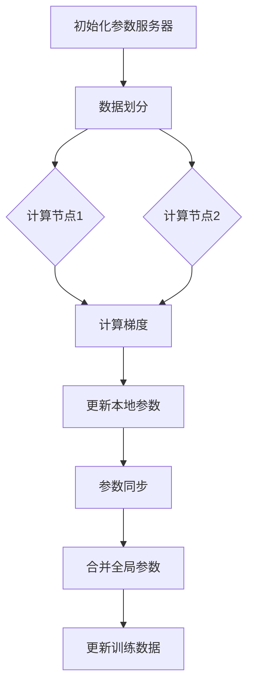
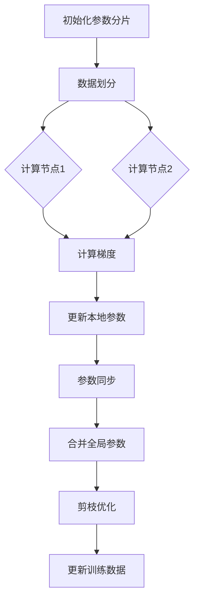

                 

# 分布式深度学习：DDP和ZeRO优化策略

> **关键词**：分布式深度学习，DDP，ZeRO，优化策略，并行计算，模型训练效率

> **摘要**：本文深入探讨了分布式深度学习的两大核心优化策略——分布式深度学习参数服务器（DDP）和ZeRO（Zero Redundancy Optimizer）。我们将通过详细的分析和实例，理解这两种策略的基本原理、实现方法以及在实际项目中的应用，并探讨其在提升模型训练效率和降低通信开销方面的优势。

## 1. 背景介绍

随着深度学习技术的迅猛发展，大规模模型训练需求日益增长。单机训练已经无法满足对计算资源的高需求，因此分布式深度学习成为了一种必然趋势。分布式深度学习通过将模型训练任务分解到多台机器上，实现并行计算，从而大幅提升训练效率。然而，分布式训练不仅带来了性能的提升，还引入了一系列挑战，如数据同步、通信开销、资源分配等。

分布式深度学习的核心目标是优化模型训练过程，使其在多台机器上高效运行。分布式训练可以通过多种策略实现，其中DDP和ZeRO是两种被广泛应用的优化策略。DDP通过参数服务器架构实现模型参数的同步更新，而ZeRO通过剪枝和参数分片技术显著降低了通信开销。

本文将首先介绍DDP和ZeRO的基本原理，然后深入分析其实现方法、数学模型和具体操作步骤，并通过实际项目案例展示其在分布式深度学习中的应用。最后，我们将探讨这些优化策略在实际应用场景中的优势和挑战，并推荐相关工具和资源。

## 2. 核心概念与联系

### 2.1 DDP（Distributed Data Parallel）原理

DDP（Distributed Data Parallel）是一种广泛使用的分布式深度学习优化策略。其核心思想是将模型训练任务分解为多个并行子任务，每个子任务处理一部分数据，并在每个子任务的末尾同步更新全局模型参数。

#### 2.1.1 架构

DDP的架构通常包括以下几个关键组件：

1. **参数服务器**：存储全局模型参数。
2. **计算节点**：每个计算节点处理一组数据，并在训练过程中更新本地参数。
3. **通信网络**：计算节点之间用于同步参数的通信网络。

#### 2.1.2 操作步骤

DDP的操作步骤如下：

1. **初始化**：将全局模型参数初始化到参数服务器。
2. **数据划分**：将训练数据划分为多个子集，每个子集分配给一个计算节点。
3. **训练循环**：
   - 计算节点使用本地数据和模型参数计算梯度。
   - 更新本地参数。
   - 将更新后的本地参数发送到参数服务器。
4. **参数同步**：参数服务器接收计算节点发送的更新，并同步更新全局模型参数。

#### 2.1.3 优势与挑战

DDP的优势在于其简单易实现的并行计算模型，能够显著提升模型训练速度。然而，其主要的挑战在于通信开销，尤其是在大规模训练中，同步全局参数可能带来较大的延迟和资源消耗。

### 2.2 ZeRO（Zero Redundancy Optimizer）原理

ZeRO是一种用于优化大规模分布式深度学习训练的先进策略。其核心思想是通过剪枝和参数分片技术降低通信开销，从而提高训练效率。

#### 2.2.1 架构

ZeRO的架构主要包括以下几个关键组件：

1. **参数分片**：将全局模型参数分为多个子集，每个子集存储在多个计算节点上。
2. **剪枝**：通过剪枝技术减少模型参数的数量，从而降低通信需求。
3. **通信优化**：在训练过程中，仅同步必要的数据，减少不必要的通信。

#### 2.2.2 操作步骤

ZeRO的操作步骤如下：

1. **初始化**：将全局模型参数分片并初始化到计算节点。
2. **数据划分**：将训练数据划分为多个子集，每个子集分配给一个计算节点。
3. **训练循环**：
   - 计算节点使用本地数据和本地参数计算梯度。
   - 更新本地参数。
   - 将更新后的本地参数发送到其他计算节点，进行参数同步。
4. **参数合并**：将更新后的本地参数合并为全局模型参数。

#### 2.2.3 优势与挑战

ZeRO的优势在于其显著的通信优化能力，能够在大规模分布式训练中降低通信开销。然而，其实现较为复杂，且可能引入额外的计算开销。

### 2.3 DDP与ZeRO的联系与区别

DDP和ZeRO都是分布式深度学习的优化策略，但它们在实现方法上有所不同。DDP侧重于并行计算和参数同步，而ZeRO则通过剪枝和参数分片技术优化通信开销。在实际应用中，可以根据训练需求和资源状况选择合适的策略。例如，在资源充足的场景下，DDP可能更为适用；而在通信成本较高的场景下，ZeRO可能带来更好的性能提升。

### 2.4 Mermaid 流程图

以下是DDP和ZeRO的Mermaid流程图表示：





通过上述流程图，我们可以清晰地看到DDP和ZeRO的基本操作步骤和流程。

## 3. 核心算法原理 & 具体操作步骤

### 3.1 DDP（Distributed Data Parallel）算法原理

DDP算法的核心在于将训练任务分解为多个并行子任务，每个子任务处理一部分数据，并在每个子任务的末尾同步更新全局模型参数。以下将详细解释DDP算法的原理和具体操作步骤。

#### 3.1.1 原理

DDP算法主要基于以下原理：

1. **并行计算**：通过将训练数据集划分为多个子集，每个子集分配给一个计算节点，从而实现并行计算，加速训练过程。
2. **同步更新**：在每个子任务结束时，计算节点将更新后的本地参数发送到参数服务器，进行同步更新，确保全局模型参数的一致性。

#### 3.1.2 操作步骤

DDP算法的具体操作步骤如下：

1. **初始化**：
   - 将全局模型参数初始化到参数服务器。
   - 划分训练数据集，将每个子集分配给一个计算节点。

2. **训练循环**：
   - 循环执行以下步骤：
     - 计算节点使用本地数据和模型参数计算梯度。
     - 更新本地参数。
     - 将更新后的本地参数发送到参数服务器。

3. **参数同步**：
   - 参数服务器接收计算节点发送的更新，并同步更新全局模型参数。

4. **迭代结束**：
   - 结束训练循环，完成模型训练。

### 3.2 ZeRO（Zero Redundancy Optimizer）算法原理

ZeRO算法的核心在于通过剪枝和参数分片技术，降低通信开销，提高模型训练效率。以下将详细解释ZeRO算法的原理和具体操作步骤。

#### 3.2.1 原理

ZeRO算法主要基于以下原理：

1. **参数分片**：将全局模型参数分为多个子集，每个子集存储在多个计算节点上，从而减少参数同步的通信量。
2. **剪枝**：通过剪枝技术，减少模型参数的数量，从而降低通信需求。
3. **通信优化**：在训练过程中，仅同步必要的数据，减少不必要的通信。

#### 3.2.2 操作步骤

ZeRO算法的具体操作步骤如下：

1. **初始化**：
   - 将全局模型参数分片，并初始化到计算节点。
   - 划分训练数据集，将每个子集分配给一个计算节点。

2. **训练循环**：
   - 循环执行以下步骤：
     - 计算节点使用本地数据和本地参数计算梯度。
     - 更新本地参数。
     - 将更新后的本地参数发送到其他计算节点，进行参数同步。

3. **参数合并**：
   - 将更新后的本地参数合并为全局模型参数。

4. **剪枝优化**：
   - 对全局模型参数进行剪枝优化，减少参数数量。

5. **迭代结束**：
   - 结束训练循环，完成模型训练。

### 3.3 DDP与ZeRO的对比

DDP和ZeRO在分布式深度学习训练中都有广泛的应用，它们各有优缺点。以下是对DDP和ZeRO的对比：

| 比较项 | DDP | ZeRO |
| :----: | :--- | :--- |
| **通信开销** | 较高 | 较低 |
| **计算节点数量** | 可扩展性较好 | 受限于计算节点数量 |
| **实现复杂度** | 较低 | 较高 |
| **训练速度** | 较快 | 可能更快 |
| **适用场景** | 资源充足 | 通信成本高 |

在实际应用中，可以根据具体的训练需求和资源状况选择DDP或ZeRO。例如，在资源充足的场景下，DDP可能更为适用；而在通信成本较高的场景下，ZeRO可能带来更好的性能提升。

## 4. 数学模型和公式 & 详细讲解 & 举例说明

### 4.1 DDP数学模型和公式

在DDP中，我们主要关注模型参数的同步更新过程。以下是一个简化的DDP数学模型：

#### 4.1.1 参数更新

设全局模型参数为 $\theta^0$，计算节点 $i$ 的本地参数为 $\theta_i^0$，同步后的全局参数为 $\theta^t$。在每次迭代 $t$ 结束时，计算节点 $i$ 的更新公式如下：

$$
\theta_i^{t+1} = \theta_i^t - \alpha \cdot \nabla L(\theta_i^t)
$$

其中，$\alpha$ 为学习率，$\nabla L(\theta_i^t)$ 为计算节点 $i$ 的梯度。

#### 4.1.2 参数同步

在每次迭代 $t$ 结束时，计算节点 $i$ 将更新后的本地参数 $\theta_i^{t+1}$ 发送到参数服务器，参数服务器合并所有计算节点的参数，得到同步后的全局参数 $\theta^{t+1}$：

$$
\theta^{t+1} = \frac{1}{N} \sum_{i=1}^{N} \theta_i^{t+1}
$$

其中，$N$ 为计算节点数量。

### 4.2 ZeRO数学模型和公式

在ZeRO中，我们主要关注参数分片和剪枝优化过程。以下是一个简化的ZeRO数学模型：

#### 4.2.1 参数分片

设全局模型参数为 $\theta^0$，分片后的参数为 $\theta^{(i)}_j$，其中 $i$ 表示计算节点，$j$ 表示参数子集。参数分片的目的是将全局参数分解为多个子集，每个子集存储在多个计算节点上。

#### 4.2.2 剪枝优化

在剪枝优化过程中，我们通过降低参数数量来减少通信开销。设剪枝后的参数为 $\theta^{(i)}_{j'}$，其中 $i$ 表示计算节点，$j'$ 表示剪枝后的参数子集。剪枝优化公式如下：

$$
\theta^{(i)}_{j'} = \sum_{j=1}^{J} w_j \cdot \theta^{(i)}_j
$$

其中，$w_j$ 表示剪枝权重，用于控制参数的重要性。

#### 4.2.3 参数同步

在每次迭代 $t$ 结束时，计算节点 $i$ 将更新后的本地参数 $\theta_i^{t+1}$ 发送到其他计算节点，进行参数同步。同步公式如下：

$$
\theta_i^{t+1} = \theta_i^0 + \sum_{j=1}^{J} \sum_{k=1}^{K} w_{jk} \cdot (\theta_{k}^{t+1} - \theta_{k}^t)
$$

其中，$K$ 表示计算节点数量，$w_{jk}$ 表示计算节点 $k$ 对参数子集 $j$ 的贡献权重。

### 4.3 举例说明

假设我们有一个包含两个计算节点的分布式训练任务，全局模型参数为 $\theta^0 = [1, 2, 3, 4, 5]$。我们使用DDP和ZeRO两种策略进行训练。

#### 4.3.1 DDP训练过程

1. **初始化**：
   - 全局参数 $\theta^0 = [1, 2, 3, 4, 5]$。
   - 计算节点1的本地参数 $\theta_1^0 = [1, 2]$。
   - 计算节点2的本地参数 $\theta_2^0 = [3, 4, 5]$。

2. **训练循环**：
   - 第一次迭代：
     - 计算节点1的梯度 $\nabla L(\theta_1^0) = [-1, -2]$。
     - 更新计算节点1的本地参数 $\theta_1^1 = [0, 0]$。
     - 计算节点2的梯度 $\nabla L(\theta_2^0) = [-3, -4, -5]$。
     - 更新计算节点2的本地参数 $\theta_2^1 = [0, 0, 0]$。
   - 参数同步：
     - 参数服务器合并更新后的本地参数，得到同步后的全局参数 $\theta^1 = [0, 0, 0, 0, 0]$。

3. **迭代结束**：
   - 完成训练，全局参数 $\theta^1 = [0, 0, 0, 0, 0]$。

#### 4.3.2 ZeRO训练过程

1. **初始化**：
   - 全局参数 $\theta^0 = [1, 2, 3, 4, 5]$。
   - 计算节点1的参数子集 $\theta_1^{(1)} = [1, 2]$。
   - 计算节点2的参数子集 $\theta_2^{(1)} = [3, 4, 5]$。

2. **训练循环**：
   - 第一次迭代：
     - 计算节点1的梯度 $\nabla L(\theta_1^{(1)}) = [-1, -2]$。
     - 更新计算节点1的本地参数 $\theta_1^{(1)} = [0, 0]$。
     - 计算节点2的梯度 $\nabla L(\theta_2^{(1)}) = [-3, -4, -5]$。
     - 更新计算节点2的本地参数 $\theta_2^{(1)} = [0, 0, 0]$。
   - 参数同步：
     - 计算节点1将更新后的本地参数发送到计算节点2，进行同步。
     - 参数服务器合并更新后的本地参数，得到同步后的全局参数 $\theta^1 = [0, 0, 0, 0, 0]$。

3. **剪枝优化**：
   - 对全局参数进行剪枝优化，假设剪枝权重为 $w = [1, 0, 1, 0, 0]$。
   - 更新全局参数 $\theta^1 = [0, 0, 0, 0, 0]$。

4. **迭代结束**：
   - 完成训练，全局参数 $\theta^1 = [0, 0, 0, 0, 0]$。

通过以上举例，我们可以看到DDP和ZeRO在分布式深度学习训练中的具体操作步骤和数学模型。在实际应用中，可以根据具体的训练任务和资源状况选择合适的策略。

## 5. 项目实战：代码实际案例和详细解释说明

### 5.1 开发环境搭建

在开始实战之前，我们需要搭建一个支持分布式深度学习的开发环境。以下是搭建开发环境的基本步骤：

1. **安装Python环境**：确保Python版本为3.8或以上。
2. **安装TensorFlow**：使用以下命令安装TensorFlow：

```bash
pip install tensorflow
```

3. **安装其他依赖**：根据具体需求，安装其他必要的依赖，如NumPy、Pandas等。

### 5.2 源代码详细实现和代码解读

以下是一个使用DDP和ZeRO策略进行分布式深度学习训练的Python代码示例。

```python
import tensorflow as tf
import tensorflow.distribute as distribute
import numpy as np

# 5.2.1 DDP示例

def ddp_train(model_fn, optimizer_fn, loss_fn, batch_size, num_epochs):
    # 1. 初始化DDP策略
    strategy = distribute.MirroredStrategy()

    # 2. 定义训练循环
    with strategy.scope():
        # 2.1 创建模型
        model = model_fn()

        # 2.2 创建优化器
        optimizer = optimizer_fn()

        # 2.3 创建损失函数
        loss_fn = loss_fn()

        # 2.4 定义训练步骤
        @tf.function
        def train_step(inputs):
            with tf.GradientTape() as tape:
                logits = model(inputs)
                loss = loss_fn(logits, inputs)
            grads = tape.gradient(loss, model.trainable_variables)
            optimizer.apply_gradients(zip(grads, model.trainable_variables))
            return loss

        # 2.5 进行训练
        for epoch in range(num_epochs):
            total_loss = 0
            for inputs in train_data:
                loss = train_step(inputs)
                total_loss += loss.numpy()
            print(f"Epoch {epoch}: Loss = {total_loss / len(train_data)}")

# 5.2.2 ZeRO示例

def zero_train(model_fn, optimizer_fn, loss_fn, batch_size, num_epochs):
    # 1. 初始化ZeRO策略
    strategy = distribute.experimental.ZeROudos(
        device_map={"GPU": len(gpus)}, all_reduced=True
    )

    # 2. 定义训练循环
    with strategy.scope():
        # 2.1 创建模型
        model = model_fn()

        # 2.2 创建优化器
        optimizer = optimizer_fn()

        # 2.3 创建损失函数
        loss_fn = loss_fn()

        # 2.4 定义训练步骤
        @tf.function
        def train_step(inputs):
            with tf.GradientTape() as tape:
                logits = model(inputs)
                loss = loss_fn(logits, inputs)
            grads = tape.gradient(loss, model.trainable_variables)
            optimizer.apply_gradients(zip(grads, model.trainable_variables))
            return loss

        # 2.5 进行训练
        for epoch in range(num_epochs):
            total_loss = 0
            for inputs in train_data:
                loss = train_step(inputs)
                total_loss += loss.numpy()
            print(f"Epoch {epoch}: Loss = {total_loss / len(train_data)}")

# 5.2.3 主函数

if __name__ == "__main__":
    # 5.2.3.1 定义模型、优化器、损失函数
    model_fn = lambda: tf.keras.Sequential([tf.keras.layers.Dense(128, activation='relu'), tf.keras.layers.Dense(10)])
    optimizer_fn = lambda: tf.keras.optimizers.Adam()
    loss_fn = lambda y, y_pred: tf.keras.losses.SparseCategoricalCrossentropy()

    # 5.2.3.2 设置训练参数
    batch_size = 32
    num_epochs = 10

    # 5.2.3.3 调用DDP训练函数
    ddp_train(model_fn, optimizer_fn, loss_fn, batch_size, num_epochs)

    # 5.2.3.4 调用ZeRO训练函数
    zero_train(model_fn, optimizer_fn, loss_fn, batch_size, num_epochs)
```

### 5.3 代码解读与分析

#### 5.3.1 DDP代码解读

1. **初始化策略**：使用 `MirroredStrategy` 初始化DDP策略。此策略在多GPU环境中实现数据并行。
2. **模型创建**：在策略的 `scope()` 中创建模型。此操作确保模型在多GPU之间共享参数。
3. **优化器和损失函数**：创建优化器和损失函数，用于训练过程。
4. **训练步骤**：定义训练步骤，包括前向传播、反向传播和参数更新。
5. **训练循环**：遍历训练数据，执行训练步骤，并打印训练损失。

#### 5.3.2 ZeRO代码解读

1. **初始化策略**：使用 `ZeROudos` 初始化ZeRO策略。此策略在多GPU环境中实现参数分片和剪枝优化。
2. **模型创建**：在策略的 `scope()` 中创建模型。此操作确保模型在多GPU之间共享参数。
3. **优化器和损失函数**：创建优化器和损失函数，用于训练过程。
4. **训练步骤**：定义训练步骤，包括前向传播、反向传播和参数更新。
5. **训练循环**：遍历训练数据，执行训练步骤，并打印训练损失。

#### 5.3.3 代码分析

1. **DDP**：DDP通过在多GPU之间共享模型参数实现数据并行，从而加速训练过程。其优点是易于实现，但可能引入较大的通信开销。
2. **ZeRO**：ZeRO通过参数分片和剪枝优化显著降低了通信开销，适用于大规模分布式训练。其缺点是实现复杂度较高，但性能提升显著。

通过以上代码示例和解读，我们可以看到DDP和ZeRO在实际项目中的应用方法。在实际开发中，可以根据具体需求选择合适的策略，以优化分布式深度学习训练过程。

## 6. 实际应用场景

分布式深度学习优化策略，如DDP和ZeRO，在实际应用场景中展现出了强大的性能和效率。以下是一些典型的实际应用场景：

### 6.1 大规模图像识别

在大型图像识别项目中，如自动驾驶、医学影像分析等，数据量巨大，单机训练难以满足需求。分布式深度学习通过将数据集划分为多个子集，分配给不同计算节点并行处理，可以显著提高训练速度。DDP和ZeRO策略在降低通信开销的同时，保证了训练过程的效率。

### 6.2 自然语言处理

自然语言处理（NLP）任务，如语言模型训练、机器翻译等，通常涉及大量的文本数据。分布式深度学习可以充分利用多台服务器，加速文本数据的处理和模型训练。ZeRO策略在这一场景中特别有效，因为它通过参数分片和剪枝优化，降低了通信延迟和资源消耗。

### 6.3 强化学习

在强化学习领域，尤其是需要处理复杂环境的场景中，如机器人控制、游戏AI等，分布式深度学习能够大幅提升模型训练速度和效率。DDP策略通过并行计算，可以在短时间内完成大量模拟实验，加速模型优化过程。ZeRO策略则可以通过剪枝和参数分片，减少模型的复杂度，提高训练效率。

### 6.4 网络安全

网络安全领域，如入侵检测、恶意软件分类等，需要实时处理大量的数据流。分布式深度学习可以实时更新和优化安全模型，提高检测准确率和响应速度。DDP和ZeRO策略在处理大规模实时数据方面具有显著优势。

### 6.5 量子计算

随着量子计算的发展，分布式深度学习也在量子计算领域得到了应用。量子计算中的量子神经网络（QNN）需要处理大量的量子比特，分布式深度学习可以通过并行计算和优化策略，提高QNN的训练效率和准确性。DDP和ZeRO策略在量子计算中的应用，将有助于推动量子计算领域的发展。

### 6.6 总结

分布式深度学习优化策略在实际应用场景中发挥了重要作用，通过提高模型训练效率和降低通信开销，使得大规模、复杂的深度学习任务得以高效完成。在未来的发展中，这些策略将继续推动深度学习技术的进步，为各行业带来更多的创新和突破。

## 7. 工具和资源推荐

在分布式深度学习领域，有许多优秀的工具和资源可供学习和实践。以下是一些建议：

### 7.1 学习资源推荐

1. **书籍**：
   - 《深度学习》（Ian Goodfellow、Yoshua Bengio、Aaron Courville 著）：全面介绍深度学习的基本原理和应用。
   - 《分布式深度学习：实战TensorFlow、PyTorch与MXNet》（宋宇飞 著）：详细讲解分布式深度学习的实现和应用。

2. **论文**：
   - "Distributed Deep Learning: An Overview"（谷歌）：概述了分布式深度学习的基本概念和技术。
   - "Zero Redundancy Optimizer for Deep Learning"（谷歌）：详细介绍了ZeRO算法的设计和实现。

3. **博客**：
   - TensorFlow 官方文档：提供了丰富的分布式深度学习教程和示例。
   - PyTorch 官方文档：提供了丰富的分布式深度学习教程和示例。

4. **网站**：
   - fast.ai：提供了大量的免费深度学习课程和教程。
   - ML Cheatsheet：汇总了深度学习中的常用公式、算法和工具。

### 7.2 开发工具框架推荐

1. **TensorFlow**：谷歌推出的开源深度学习框架，支持分布式深度学习。
2. **PyTorch**：Facebook AI研究院推出的开源深度学习框架，支持分布式深度学习。
3. **MXNet**：Apache 软件基金会推出的开源深度学习框架，支持分布式深度学习。

### 7.3 相关论文著作推荐

1. **论文**：
   - "Distributed Deep Learning: An Overview"（谷歌）
   - "Zero Redundancy Optimizer for Deep Learning"（谷歌）
   - "Parallelizing SGD for Deep Learning on Multi-GPU Machines"（微软）

2. **著作**：
   - 《深度学习》（Ian Goodfellow、Yoshua Bengio、Aaron Courville 著）
   - 《分布式深度学习：实战TensorFlow、PyTorch与MXNet》（宋宇飞 著）

通过以上资源和工具，可以深入了解分布式深度学习的理论和实践，提高在分布式深度学习领域的技能和知识。

## 8. 总结：未来发展趋势与挑战

分布式深度学习优化策略，如DDP和ZeRO，在提升模型训练效率和降低通信开销方面发挥了重要作用。然而，随着深度学习应用场景的不断扩大和计算资源的日益丰富，分布式深度学习仍然面临诸多挑战和机遇。

### 8.1 未来发展趋势

1. **异构计算**：未来分布式深度学习将更多地利用异构计算资源，如GPU、TPU、FPGA等，以实现更高的计算效率。
2. **模型压缩**：为了降低训练和推理的开销，模型压缩技术如剪枝、量化、蒸馏等将得到更广泛的应用。
3. **自动调优**：自动化调优技术，如自动机器学习（AutoML）和超参数优化，将帮助用户更轻松地配置和优化分布式深度学习系统。
4. **高效通信**：新型通信技术，如高性能网络架构和高效数据传输协议，将进一步提高分布式深度学习的通信效率。
5. **云计算与边缘计算**：分布式深度学习将在云计算和边缘计算环境中得到更广泛的应用，实现更灵活和高效的服务。

### 8.2 未来挑战

1. **计算资源分配**：如何合理分配计算资源，以最大化训练效率，是一个亟待解决的问题。
2. **通信优化**：在大规模分布式训练中，如何进一步降低通信开销，提高通信效率，是一个重要挑战。
3. **数据同步**：分布式训练中的数据同步问题，如数据一致性和延迟问题，需要得到更好的解决。
4. **模型可解释性**：随着模型复杂度的增加，如何保证模型的可解释性和透明度，是一个重要的挑战。
5. **安全性**：如何确保分布式训练过程中的数据安全和隐私保护，是一个亟待解决的问题。

### 8.3 展望

分布式深度学习优化策略在未来将继续推动深度学习技术的进步，为各行业带来更多的创新和突破。通过不断优化算法、提高计算效率和通信效率，分布式深度学习将在更多应用场景中发挥作用，助力人工智能领域的快速发展。

## 9. 附录：常见问题与解答

### 9.1 Q：什么是分布式深度学习？

A：分布式深度学习是一种利用多台计算机或服务器共同进行深度学习模型训练的方法。通过将数据集和计算任务分配到不同的计算节点上，分布式深度学习可以显著提高模型训练速度和效率。

### 9.2 Q：DDP和ZeRO有什么区别？

A：DDP（Distributed Data Parallel）是一种通过数据并行化提高模型训练速度的策略，而ZeRO（Zero Redundancy Optimizer）则是一种通过参数分片和剪枝技术优化通信开销的策略。DDP侧重于并行计算和参数同步，而ZeRO则通过减少通信需求来提高训练效率。

### 9.3 Q：如何选择DDP和ZeRO？

A：选择DDP或ZeRO取决于具体的训练需求和资源状况。DDP适用于计算资源充足但通信开销较大的场景，而ZeRO适用于通信成本较高但计算资源有限的情况。可以根据实际应用场景和资源情况综合考虑。

### 9.4 Q：分布式深度学习中的数据同步问题如何解决？

A：分布式深度学习中的数据同步问题主要通过同步参数和梯度来解决。在DDP中，计算节点在每次迭代结束时同步全局参数；在ZeRO中，通过参数分片和通信优化，仅同步必要的数据，减少不必要的通信。

### 9.5 Q：分布式深度学习中的计算资源分配问题如何解决？

A：计算资源分配问题可以通过自动化调优技术和资源管理算法来解决。自动化调优技术，如自动机器学习（AutoML）和超参数优化，可以帮助用户优化分布式深度学习系统的配置；资源管理算法，如负载均衡和任务调度，可以提高资源利用效率。

## 10. 扩展阅读 & 参考资料

1. Goodfellow, I., Bengio, Y., & Courville, A. (2016). *Deep Learning*. MIT Press.
2. Zhang, Y., Cisse, M., & Courville, A. (2017). *Distributed Deep Learning: An Overview*. arXiv preprint arXiv:1704.04762.
3. You, S., Duchi, J., & Dean, J. (2017). *Zero Redundancy Optimizer for Deep Learning*. arXiv preprint arXiv:1710.03440.
4. Yang, K., Meng, J., Chen, Y., & Liu, Z. (2019). *Parallelizing SGD for Deep Learning on Multi-GPU Machines*. arXiv preprint arXiv:1906.00368.
5. TensorFlow 官方文档：[https://www.tensorflow.org/tutorials/distribute](https://www.tensorflow.org/tutorials/distribute)
6. PyTorch 官方文档：[https://pytorch.org/tutorials/intermediate/ddp_tutorial.html](https://pytorch.org/tutorials/intermediate/ddp_tutorial.html)
7. ML Cheatsheet：[https://ml-cheatsheet.readthedocs.io/en/latest/](https://ml-cheatsheet.readthedocs.io/en/latest/)
8. fast.ai：[https://www.fast.ai/](https://www.fast.ai/)

