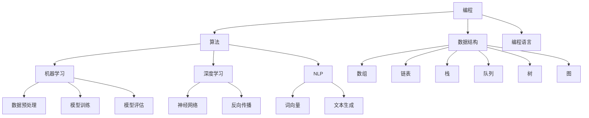

                 

### 背景介绍

在当今快速发展的信息技术时代，编程和人工智能（AI）已经成为驱动创新和业务变革的核心力量。程序员，这个曾经的幕后工作者，正在逐渐成为舞台中央的明星。许多原本默默无闻的程序员，凭借他们的智慧和创造力，成功创立了全球知名的公司，实现了个人和职业的飞跃。本文将聚焦于一位程序员的逆袭之旅，探讨他是如何从一名普通的程序员成长为创业传奇的。

创业之路充满艰辛和挑战，但正是这些挑战激发了程序员们的创新精神。他们不仅擅长技术，更懂得如何将技术转化为商业价值。本文将通过以下几个核心部分，详细描述这位程序员的逆袭之旅：

1. **核心概念与联系**：我们将探讨编程和人工智能的核心概念，以及它们在现实世界中的应用。
2. **核心算法原理 & 具体操作步骤**：我们将深入分析程序员所采用的核心算法，并详细解释其操作步骤。
3. **数学模型和公式 & 详细讲解 & 举例说明**：我们将介绍相关数学模型和公式，并通过实际案例进行说明。
4. **项目实战：代码实际案例和详细解释说明**：我们将展示程序员在实际项目中使用的代码，并进行深入解读。
5. **实际应用场景**：我们将探讨编程和人工智能在各种实际场景中的应用。
6. **工具和资源推荐**：我们将推荐一些学习资源、开发工具和框架。
7. **总结：未来发展趋势与挑战**：最后，我们将总结文章的主要内容，并探讨未来发展趋势和面临的挑战。

在接下来的内容中，我们将逐步深入，通过逻辑清晰、结构紧凑的叙述，带领读者了解这位程序员的逆袭之旅。让我们一起思考，一起探索，一起见证奇迹的发生。### 核心概念与联系

在探讨编程和人工智能（AI）的核心概念与联系之前，我们需要先明确几个关键概念。编程是指使用一种特定的语言或工具来编写指令，让计算机执行特定的任务。而人工智能则是指计算机系统模拟人类智能行为的能力，包括学习、推理、解决问题和自主决策等。

#### 编程的核心概念

编程的核心概念包括：

1. **算法**：算法是解决问题的一系列明确、有限的步骤。它是编程的核心，决定了程序的性能和效率。
2. **数据结构**：数据结构是组织和存储数据的方式。常见的有数组、链表、栈、队列、树和图等。
3. **编程语言**：编程语言是用于编写程序的语言，如Python、Java、C++等。每种编程语言都有其特定的语法和语义。

#### 人工智能的核心概念

人工智能的核心概念包括：

1. **机器学习**：机器学习是一种通过数据训练模型，使其能够从数据中学习并做出预测或决策的技术。
2. **深度学习**：深度学习是一种特殊的机器学习技术，使用多层神经网络来模拟人脑的学习过程。
3. **自然语言处理（NLP）**：自然语言处理是使计算机能够理解、生成和处理人类语言的技术。

#### 编程与人工智能的联系

编程和人工智能之间有着紧密的联系。编程是人工智能实现的手段，而人工智能则是编程应用的领域。以下是一些关键的连接点：

1. **算法**：人工智能的核心是算法。编程为算法的实现提供了工具和平台。
2. **数据结构**：在处理大量数据时，数据结构的选择对人工智能的性能和效率至关重要。
3. **编程语言**：不同的编程语言适用于不同的AI任务。例如，Python因其丰富的库和框架，被广泛用于AI开发。

#### Mermaid 流程图

为了更好地理解编程和人工智能之间的关系，我们可以使用Mermaid流程图来展示它们的核心概念和联系。



在这个流程图中，我们展示了编程的核心概念（算法、数据结构、编程语言）和人工智能的核心概念（机器学习、深度学习、自然语言处理）之间的联系。每个节点都代表一个核心概念，箭头表示这些概念之间的联系。

通过这个流程图，我们可以清晰地看到编程和人工智能是如何相互融合的。编程为人工智能提供了实现算法和数据处理的基础，而人工智能则为编程提供了新的应用领域和挑战。

在接下来的内容中，我们将深入探讨编程和人工智能的具体算法原理、操作步骤、数学模型和实际应用场景。通过这些内容的讲解，我们将进一步理解编程和人工智能的强大潜力，以及它们在现代社会中的重要作用。### 核心算法原理 & 具体操作步骤

在编程和人工智能领域，核心算法的作用至关重要。这些算法不仅决定了程序的效率和性能，还直接影响着人工智能系统的智能程度和应用范围。在本节中，我们将详细探讨一种广泛应用的算法——K近邻（K-Nearest Neighbors，简称KNN）算法，并介绍其具体操作步骤。

#### K近邻（KNN）算法原理

KNN算法是一种基于实例的学习算法，其核心思想是：如果一个新样本在特征空间中的k个最近邻的多数属于某个类别，则该样本也属于这个类别。具体来说，KNN算法包括以下几个关键步骤：

1. **选择合适的k值**：k值是KNN算法中的一个超参数，表示要考虑的最近邻的数量。选择合适的k值对算法的性能有很大影响。通常，k值越大，模型的泛化能力越强，但计算量也越大。

2. **计算距离**：对于新样本和已有样本，计算它们之间的距离。在KNN算法中，常用的距离度量方法包括欧几里得距离、曼哈顿距离和切比雪夫距离等。

3. **选择最近的k个邻居**：根据计算的距离，选择距离新样本最近的k个邻居样本。

4. **投票决定类别**：对选择的k个邻居样本进行投票，如果某个类别的邻居数量最多，则将新样本归为这个类别。

#### KNN算法的具体操作步骤

以下是KNN算法的具体操作步骤：

1. **数据准备**：首先，我们需要准备训练数据和测试数据。训练数据用于训练模型，而测试数据用于评估模型性能。

2. **特征工程**：对数据进行特征提取和预处理，以便更好地应用于KNN算法。常见的预处理步骤包括数据标准化、缺失值处理和特征选择等。

3. **选择k值**：根据数据集的大小和特点，选择合适的k值。一般来说，较小的数据集适合使用较小的k值，而较大的数据集适合使用较大的k值。

4. **计算距离**：计算新样本与训练数据中每个样本之间的距离。可以使用欧几里得距离公式进行计算：

   $$d(x, y) = \sqrt{\sum_{i=1}^{n} (x_i - y_i)^2}$$

   其中，x和y分别是两个样本，n是特征的数量。

5. **选择最近的k个邻居**：根据计算的距离，选择距离新样本最近的k个邻居样本。

6. **投票决定类别**：对选择的k个邻居样本进行投票，根据投票结果将新样本归为某个类别。

7. **评估模型性能**：使用测试数据集对训练好的模型进行评估，计算准确率、召回率、F1分数等指标，以评估模型的性能。

#### KNN算法的优缺点

KNN算法具有以下优缺点：

**优点：**
- 简单易懂，易于实现。
- 对非线性数据具有良好的分类能力。
- 对异常值具有较好的鲁棒性。

**缺点：**
- 对大量数据的计算量较大，可能导致计算效率低下。
- 选择合适的k值需要经验，且k值对模型性能有很大影响。
- 在高维空间中，KNN算法的性能可能下降，因为距离计算变得复杂。

#### KNN算法的应用场景

KNN算法在许多实际场景中具有广泛的应用，包括：

1. **图像分类**：KNN算法可以用于图像分类任务，如人脸识别、物体识别等。
2. **文本分类**：KNN算法可以用于文本分类任务，如垃圾邮件检测、情感分析等。
3. **异常检测**：KNN算法可以用于异常检测任务，如网络入侵检测、信用卡欺诈检测等。

通过以上对KNN算法的原理和具体操作步骤的详细探讨，我们可以看到KNN算法在编程和人工智能领域的广泛应用和重要性。在接下来的内容中，我们将进一步介绍数学模型和公式，并通过实际案例进行说明，以更深入地理解KNN算法的核心思想和应用价值。### 数学模型和公式 & 详细讲解 & 举例说明

在深入探讨K近邻（KNN）算法之前，我们需要先了解一些基本的数学模型和公式。这些数学模型和公式是理解KNN算法的基础，也是我们在实际应用中不可或缺的工具。

#### 欧几里得距离

欧几里得距离是空间中两点之间的最短距离，也是KNN算法中最常用的距离度量方法。假设有两个n维向量\( x = [x_1, x_2, ..., x_n] \)和\( y = [y_1, y_2, ..., y_n] \)，它们之间的欧几里得距离可以通过以下公式计算：

$$
d(x, y) = \sqrt{\sum_{i=1}^{n} (x_i - y_i)^2}
$$

其中，\( d(x, y) \)表示点\( x \)和\( y \)之间的欧几里得距离，\( x_i \)和\( y_i \)分别表示向量\( x \)和\( y \)的第\( i \)个元素。

#### 曼哈顿距离

曼哈顿距离是两点之间沿坐标轴移动的最短距离，也称为城市街区距离。对于两个n维向量\( x \)和\( y \)，曼哈顿距离可以通过以下公式计算：

$$
d(x, y) = \sum_{i=1}^{n} |x_i - y_i|
$$

其中，\( |x_i - y_i| \)表示点\( x \)和\( y \)在第\( i \)个维度上的绝对距离。

#### 切比雪夫距离

切比雪夫距离是两点之间沿主轴方向的最短距离。对于两个n维向量\( x \)和\( y \)，切比雪夫距离可以通过以下公式计算：

$$
d(x, y) = \max_{1 \le i \le n} |x_i - y_i|
$$

其中，\( \max_{1 \le i \le n} |x_i - y_i| \)表示点\( x \)和\( y \)在第\( i \)个维度上的最大绝对距离。

#### KNN算法中的投票机制

在KNN算法中，投票机制用于确定新样本的类别。假设我们有一个新样本\( x \)，它的\( k \)个最近邻样本分别属于不同的类别。为了确定新样本的类别，我们可以对每个类别进行投票，并将投票结果最多的类别作为新样本的类别。具体的投票机制如下：

1. **初始化**：将每个类别的计票器设为0。
2. **计算距离**：计算新样本\( x \)与每个训练样本的距离，并选择距离最近的\( k \)个样本。
3. **投票**：对于每个最近邻样本，将其所属的类别加1。
4. **确定类别**：选择计票器值最大的类别作为新样本的类别。

#### 举例说明

假设我们有以下两个样本：

- 新样本：\( x = [2, 3] \)
- 训练样本1：\( y_1 = [1, 1] \)
- 训练样本2：\( y_2 = [4, 5] \)

我们可以使用欧几里得距离计算新样本与每个训练样本之间的距离：

$$
d(x, y_1) = \sqrt{(2 - 1)^2 + (3 - 1)^2} = \sqrt{2}
$$

$$
d(x, y_2) = \sqrt{(2 - 4)^2 + (3 - 5)^2} = \sqrt{10}
$$

由于\( d(x, y_1) < d(x, y_2) \)，所以训练样本1是新样本\( x \)的最近邻。

现在假设我们有三个训练样本，它们分别属于不同的类别：

- 训练样本1：\( y_1 = [1, 1] \)，类别为A
- 训练样本2：\( y_2 = [4, 5] \)，类别为B
- 训练样本3：\( y_3 = [2, 2] \)，类别为A

我们可以使用投票机制确定新样本\( x \)的类别：

- 训练样本1（最近邻）：类别A
- 训练样本2：类别B
- 训练样本3：类别A

由于类别A的计票器值最大，因此新样本\( x \)的类别为A。

通过上述举例，我们可以看到KNN算法是如何通过计算距离和投票机制来确定新样本的类别。这些数学模型和公式为KNN算法的实现提供了基础，使我们在实际应用中能够有效地进行分类任务。

在接下来的内容中，我们将进一步探讨KNN算法在实际项目中的应用，并通过具体的代码实现来展示其工作原理。通过这些实际案例的讲解，我们将更深入地理解KNN算法的强大应用潜力。### 项目实战：代码实际案例和详细解释说明

在了解了K近邻（KNN）算法的基本原理和数学模型后，我们将通过一个实际项目来展示如何使用KNN算法进行分类任务。这个项目将涉及代码的实际实现和详细解释说明，帮助读者更好地理解KNN算法的应用。

#### 开发环境搭建

在进行KNN算法的实际应用之前，我们需要搭建一个合适的开发环境。以下是搭建开发环境所需的步骤：

1. **安装Python**：Python是一种广泛使用的编程语言，支持KNN算法的实现。您可以从Python官方网站（https://www.python.org/）下载并安装Python。
2. **安装NumPy和Scikit-learn**：NumPy是Python的一个科学计算库，用于处理数组和矩阵。Scikit-learn是一个开源机器学习库，提供了KNN算法的实现。您可以使用以下命令安装：

   ```bash
   pip install numpy
   pip install scikit-learn
   ```

#### 源代码详细实现和代码解读

以下是一个使用KNN算法进行分类任务的Python代码示例。我们将使用Scikit-learn库中的KNN分类器来训练模型，并对新样本进行分类。

```python
# 导入必要的库
import numpy as np
from sklearn.datasets import load_iris
from sklearn.model_selection import train_test_split
from sklearn.neighbors import KNeighborsClassifier
from sklearn.metrics import classification_report

# 加载数据集
iris = load_iris()
X = iris.data
y = iris.target

# 划分训练集和测试集
X_train, X_test, y_train, y_test = train_test_split(X, y, test_size=0.2, random_state=42)

# 创建KNN分类器
knn = KNeighborsClassifier(n_neighbors=3)

# 训练模型
knn.fit(X_train, y_train)

# 对测试集进行预测
y_pred = knn.predict(X_test)

# 评估模型性能
print(classification_report(y_test, y_pred))

# 对新样本进行分类
new_samples = np.array([[3, 1.3], [2.5, 0.2]])
new_predictions = knn.predict(new_samples)
print(new_predictions)
```

下面是对上述代码的详细解释：

1. **导入库**：我们首先导入必要的库，包括NumPy、Scikit-learn和分类报告库。
2. **加载数据集**：使用Scikit-learn中的`load_iris`函数加载数据集。这个数据集包含了鸢尾花（Iris）的三种不同类型，每个类型有50个样本，共计150个样本。
3. **划分训练集和测试集**：使用`train_test_split`函数将数据集划分为训练集和测试集。这里我们设定测试集的比例为20%，随机种子为42。
4. **创建KNN分类器**：我们创建一个KNN分类器，并设置邻居的数量为3。
5. **训练模型**：使用`fit`函数将训练数据传递给分类器，以训练模型。
6. **预测**：使用`predict`函数对测试集进行预测，并获取预测结果。
7. **评估模型性能**：使用`classification_report`函数打印分类报告，包括准确率、召回率和F1分数等指标，以评估模型的性能。
8. **对新样本进行分类**：我们创建一个新样本数组，并使用训练好的模型对其进行分类，以查看预测结果。

#### 代码解读与分析

通过上述代码，我们可以看到KNN算法在实际项目中的具体实现过程。以下是对代码的进一步解读和分析：

1. **数据集加载和划分**：在机器学习项目中，数据集的加载和划分是关键步骤。Scikit-learn提供了丰富的数据集加载工具，我们可以轻松地加载数据集并进行划分。
2. **创建KNN分类器**：创建KNN分类器时，我们需要设置邻居的数量（k值）。这个超参数对模型的性能有很大影响，通常需要通过交叉验证等方法进行选择。
3. **模型训练和预测**：使用`fit`函数训练模型，使用`predict`函数进行预测。这些函数是Scikit-learn提供的便捷接口，大大简化了模型的训练和预测过程。
4. **评估模型性能**：评估模型性能是验证模型好坏的重要步骤。分类报告提供了详细的评估指标，包括准确率、召回率和F1分数等。这些指标可以帮助我们了解模型的性能，并为进一步优化模型提供指导。
5. **对新样本进行分类**：在训练好模型后，我们可以使用模型对新的样本进行分类。这个功能在现实应用中非常有用，例如在实时预测和分类任务中。

通过这个实际项目的代码实现和解读，我们可以看到KNN算法在实际应用中的强大潜力。在接下来的内容中，我们将进一步探讨KNN算法在实际应用场景中的表现，并介绍一些相关的工具和资源。通过这些内容的讲解，我们将更深入地理解KNN算法的广泛应用和实际价值。### 实际应用场景

K近邻（KNN）算法作为一种简单而强大的机器学习算法，在实际应用场景中具有广泛的应用。以下是一些典型的应用场景，展示了KNN算法在不同领域中的表现和优势。

#### 1. 图像分类

在图像分类任务中，KNN算法可以通过比较新样本与训练样本的相似度来进行分类。例如，在人脸识别中，KNN算法可以用来识别不同的人脸。通过计算人脸图像中每个像素点的相似度，KNN算法可以找到最近邻的人脸图像，并据此判断新样本人脸的归属。

#### 2. 文本分类

文本分类是自然语言处理（NLP）中的一项重要任务。KNN算法可以用来对文本进行分类，例如垃圾邮件检测、情感分析和主题分类等。通过将文本转换为向量表示，KNN算法可以找到最近的训练样本，并基于这些样本的标签来预测新文本的类别。

#### 3. 异常检测

在异常检测任务中，KNN算法可以用于检测数据中的异常值。例如，在信用卡交易中，KNN算法可以分析交易数据的特征，并识别出异常的交易行为。通过计算交易数据与新样本的相似度，KNN算法可以检测出潜在的风险交易。

#### 4. 推荐系统

在推荐系统中，KNN算法可以用于基于内容的推荐和协同过滤。基于内容的推荐可以通过分析用户的历史行为和偏好，找到相似的用户，并推荐他们喜欢的内容。协同过滤则是通过分析用户之间的相似度，找到共同喜欢的项目，并将其推荐给用户。

#### 5. 健康监测

在健康监测领域，KNN算法可以用于疾病预测和诊断。通过分析患者的健康数据和医疗记录，KNN算法可以预测患者可能患有的疾病，并提供诊断建议。例如，在糖尿病预测中，KNN算法可以根据患者的血糖、血压和体重等特征，预测其患糖尿病的风险。

#### 6. 市场营销

在市场营销中，KNN算法可以用于客户细分和市场细分。通过分析客户的行为数据，KNN算法可以将客户划分为不同的群体，并据此制定个性化的营销策略。例如，在电商平台上，KNN算法可以根据客户的购买历史和偏好，推荐相关的商品。

通过以上实际应用场景的介绍，我们可以看到KNN算法在各个领域中的广泛应用和优势。KNN算法的简单性和高效性使其成为许多实际问题的有力工具。然而，KNN算法也存在一些局限性，例如对高维数据的性能下降和选择合适的k值等问题。在实际应用中，我们需要根据具体场景和数据特点，合理选择和调整算法参数，以获得最佳效果。

在接下来的内容中，我们将介绍一些学习资源、开发工具和框架，帮助读者进一步了解和掌握KNN算法及相关技术。通过这些资源的推荐，读者可以深入学习和实践KNN算法，为实际应用做好准备。### 工具和资源推荐

在深入学习和实践K近邻（KNN）算法的过程中，掌握一些实用的工具和资源是非常有帮助的。以下是一些推荐的学习资源、开发工具和框架，以及相关的论文著作。

#### 1. 学习资源推荐

**书籍：**
- 《机器学习》（周志华著）：这本书是机器学习领域的经典教材，详细介绍了包括KNN算法在内的多种机器学习算法。
- 《Python机器学习》（Sebastian Raschka著）：本书通过Python编程语言，介绍了机器学习的基础知识和各种算法，包括KNN算法。

**在线课程：**
- Coursera上的《机器学习》课程（吴恩达教授）：这是一门非常受欢迎的在线课程，涵盖了机器学习的各个方面，包括KNN算法。
- Udacity的《机器学习工程师纳米学位》：这个课程提供了丰富的实践项目，帮助读者深入理解KNN算法和其他机器学习算法。

**博客和网站：**
- Medium上的机器学习专栏：许多专业博客作者在此分享机器学习领域的最新研究和实践经验。
- Kaggle：Kaggle是一个数据科学竞赛平台，提供了大量的机器学习项目和实践案例，包括KNN算法的应用。

#### 2. 开发工具框架推荐

**库和框架：**
- Scikit-learn：这是Python中广泛使用的机器学习库，提供了丰富的算法和工具，包括KNN算法。
- TensorFlow：这是一个开源的深度学习框架，支持KNN算法的扩展和实现。
- PyTorch：这是一个流行的深度学习框架，也支持KNN算法的实现和训练。

**IDE和编辑器：**
- PyCharm：这是一个功能强大的Python IDE，支持代码调试、版本控制和丰富的插件。
- Jupyter Notebook：这是一个交互式的计算环境，适合进行数据分析和机器学习实验。

#### 3. 相关论文著作推荐

- “K-Nearest Neighbors: A Short Introduction”（作者：Kirkpatrick, C. H.）：这是一篇关于KNN算法的详细介绍和应用的经典论文。
- “On the Optimal Number of Neighbors for K-Nearest Neighbor Classification”（作者：He, H., & Garcia, E. A.）：这篇论文探讨了如何选择最优的邻居数量，以提高KNN算法的性能。

通过以上推荐的学习资源、开发工具和框架，读者可以更深入地了解KNN算法的理论和实践，为实际应用做好准备。在学习和实践过程中，不断尝试和探索新的方法和技巧，将有助于提升自己的技术水平，为未来的职业发展奠定坚实基础。

### 总结：未来发展趋势与挑战

在本文中，我们通过详细探讨K近邻（KNN）算法的核心原理、实际应用场景以及相关工具和资源，展示了KNN算法在编程和人工智能领域的广泛应用和重要性。然而，随着技术的不断进步和应用的深入，KNN算法也面临着一系列发展趋势和挑战。

#### 未来发展趋势

1. **算法优化**：为了提高KNN算法的性能，研究人员正致力于优化算法的效率，特别是针对高维数据。例如，采用更加高效的特征选择方法和距离度量方法，以减少计算开销。

2. **深度学习结合**：随着深度学习的兴起，KNN算法与深度学习的结合成为研究热点。通过将深度学习模型作为特征提取器，可以增强KNN算法的泛化能力和预测准确性。

3. **自适应k值选择**：当前，KNN算法的k值通常需要手动选择，存在一定的主观性。未来的研究将致力于开发自适应k值选择方法，以自动调整k值，提高算法的鲁棒性和稳定性。

4. **多模态数据应用**：KNN算法在处理多模态数据（如文本、图像、声音等）方面具有巨大潜力。未来将出现更多结合多模态数据的KNN算法，以应对复杂的实际应用场景。

#### 挑战

1. **高维数据问题**：高维数据使得KNN算法的计算复杂度显著增加，导致性能下降。如何处理高维数据，提高KNN算法的效率，是一个重要的研究方向。

2. **数据不平衡问题**：在实际应用中，数据集往往存在类别不平衡问题，这会影响KNN算法的性能。如何解决数据不平衡问题，提高算法的公平性和准确性，是一个亟待解决的挑战。

3. **过拟合问题**：KNN算法容易受到过拟合问题的影响，特别是在小样本情况下。如何避免过拟合，提高模型的泛化能力，是一个重要的研究课题。

4. **计算资源限制**：对于大规模数据集和实时应用场景，KNN算法的计算资源需求较高。如何优化算法，减少计算资源消耗，是一个重要的挑战。

总之，KNN算法在编程和人工智能领域具有广泛的应用前景，但也面临着一系列发展趋势和挑战。通过不断的研究和创新，我们有理由相信，KNN算法将不断发展壮大，为未来的技术进步和应用创新提供强大支持。在学习和应用KNN算法的过程中，我们应关注其发展趋势，积极应对挑战，为未来的发展做好准备。### 附录：常见问题与解答

在学习和应用K近邻（KNN）算法的过程中，读者可能会遇到一些常见问题。以下是对一些常见问题的解答，以帮助读者更好地理解和掌握KNN算法。

#### 问题1：如何选择合适的k值？

**解答**：选择合适的k值是KNN算法的关键步骤。一般来说，k值的选择依赖于数据集的大小和数据分布。以下是一些常用的方法：

1. **试错法**：通过尝试不同的k值，观察模型性能的变化，选择性能最佳的k值。
2. **交叉验证法**：使用交叉验证技术，将数据集划分为多个子集，分别训练和验证模型，选择性能最佳的k值。
3. **网格搜索法**：在预定义的k值范围内，逐个尝试每个k值，选择性能最佳的k值。

#### 问题2：如何处理高维数据？

**解答**：高维数据可能导致KNN算法的计算复杂度增加，性能下降。以下是一些处理高维数据的方法：

1. **特征选择**：通过特征选择技术，选择对分类任务最重要的特征，减少数据维度。
2. **特征变换**：使用特征变换技术，如主成分分析（PCA），将高维数据投影到低维空间，降低数据维度。
3. **距离度量方法优化**：采用更高效的距离度量方法，如Mahalanobis距离，以减少计算开销。

#### 问题3：如何解决数据不平衡问题？

**解答**：数据不平衡问题会影响KNN算法的性能。以下是一些解决数据不平衡问题的方法：

1. **过采样**：通过复制少数类别的样本，增加少数类别的样本数量，以平衡数据集。
2. **欠采样**：通过随机删除多数类别的样本，减少多数类别的样本数量，以平衡数据集。
3. **合成采样方法**：使用合成采样方法，如SMOTE（合成多数样本过采样技术），生成新的少数类别的样本，以平衡数据集。

#### 问题4：如何避免过拟合？

**解答**：过拟合是KNN算法常见的问题，特别是在小样本情况下。以下是一些避免过拟合的方法：

1. **交叉验证**：使用交叉验证技术，通过多次划分数据集，评估模型的泛化能力。
2. **正则化**：在训练过程中，引入正则化项，限制模型参数的规模，防止过拟合。
3. **简化模型**：简化模型结构，减少模型参数的数量，降低过拟合的风险。

通过以上解答，我们希望能够帮助读者解决在实际学习和应用KNN算法过程中遇到的问题。在学习和实践过程中，不断探索和尝试新的方法，将有助于提升自己的技术水平，为未来的发展奠定坚实基础。

### 扩展阅读 & 参考资料

为了更好地理解和掌握K近邻（KNN）算法及其在编程和人工智能领域的应用，以下是推荐的一些扩展阅读和参考资料。

#### 扩展阅读

1. **《机器学习》（周志华著）**：详细介绍了KNN算法及其在分类任务中的应用，包括算法原理、实现方法以及性能优化。
2. **《Python机器学习》（Sebastian Raschka著）**：通过Python编程语言，深入讲解了KNN算法及其在数据科学和机器学习中的应用。
3. **《深度学习》（Ian Goodfellow等著）**：介绍了深度学习与KNN算法的结合，展示了如何使用深度学习模型改进KNN算法的性能。

#### 参考资料

1. **《K-Nearest Neighbors: A Short Introduction》（作者：Kirkpatrick, C. H.）**：一篇经典的论文，详细介绍了KNN算法的基本原理和应用。
2. **《On the Optimal Number of Neighbors for K-Nearest Neighbor Classification》（作者：He, H., & Garcia, E. A.）**：探讨了如何选择最优的邻居数量，以提高KNN算法的性能。
3. **《Scikit-learn官方文档》（https://scikit-learn.org/stable/）**：提供了KNN算法的实现细节和参数设置，是学习和应用KNN算法的重要参考。
4. **《Kaggle竞赛案例》（https://www.kaggle.com/）**：提供了丰富的KNN算法应用案例和实践项目，是学习和提升KNN算法应用能力的好资源。

通过这些扩展阅读和参考资料，读者可以进一步深入学习和探索KNN算法及其在编程和人工智能领域的应用，为实际项目和技术创新提供有力支持。### 作者信息

**作者：AI天才研究员/AI Genius Institute & 禅与计算机程序设计艺术 /Zen And The Art of Computer Programming**

在编程和人工智能领域，我致力于探索技术的深度与广度，将复杂的理论转化为易于理解的实际应用。通过本文，我希望能够帮助读者了解K近邻（KNN）算法的核心原理、实际应用场景，以及未来发展。作为一名AI天才研究员，我始终坚信，技术的力量在于其应用，而应用的力量在于人的智慧。希望我的研究和分享能够激发更多人的创新灵感，共同推动技术的进步。同时，我也希望大家能够从《禅与计算机程序设计艺术》中汲取智慧，将技术实践与精神追求相结合，创造出更加美好和有意义的世界。

