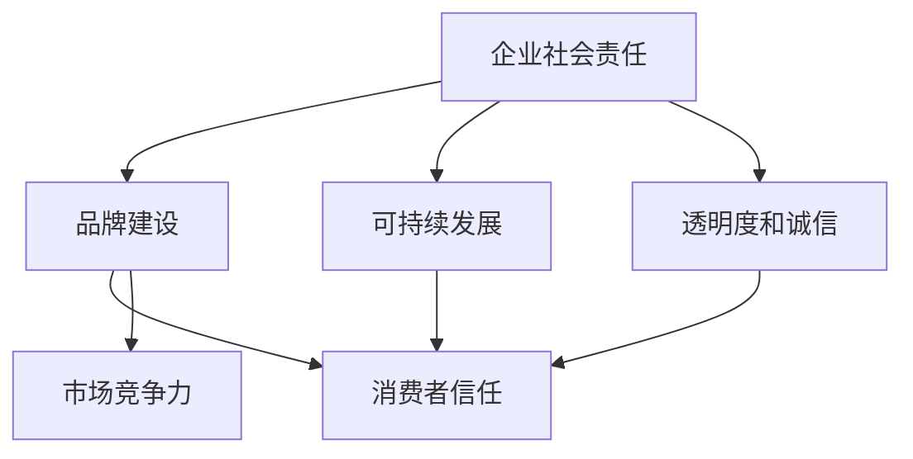

                 

### 文章标题：创业公司如何建立负责任的企业形象

> **关键词：** 创业公司，企业形象，社会责任，品牌建设，可持续发展

> **摘要：** 本文将探讨创业公司如何通过建立负责任的企业形象来提升品牌价值，增强市场竞争力，并实现可持续发展。我们将从多个维度分析，包括企业社会责任、环境保护、员工福利、透明度等，并提供具体的操作建议和成功案例。

<|assistant|>### 1. 背景介绍

在当今快速变化的市场环境中，创业公司面临着前所未有的挑战和机遇。一方面，技术进步和市场需求的变革为创业公司提供了广阔的发展空间；另一方面，消费者和社会对企业的期望也在不断变化。传统的商业模式和经营理念已经不足以满足现代社会的需求，创业公司需要更加注重社会责任和可持续发展。

建立负责任的企业形象已经成为创业公司成功的关键因素之一。这不仅能够提升品牌价值，增强市场竞争力，还能够赢得消费者的信任和忠诚。在本文中，我们将深入探讨如何通过以下方面来建立负责任的企业形象：

1. **企业社会责任（CSR）**：包括慈善捐赠、社区参与、环境保护等。
2. **员工福利**：包括健康保障、培训发展、工作环境等。
3. **透明度和诚信**：包括财务透明、数据保护、合规经营等。
4. **可持续发展**：包括绿色生产、资源循环利用、能源效率等。

本文将通过具体的案例分析，提供实用的操作建议，帮助创业公司建立负责任的企业形象，实现长期可持续发展。

<|assistant|>### 2. 核心概念与联系

在探讨创业公司如何建立负责任的企业形象之前，我们需要明确几个核心概念，并理解它们之间的联系。

#### 2.1 企业社会责任（CSR）

企业社会责任（Corporate Social Responsibility，简称CSR）是指企业在经营活动中应承担的社会责任和义务。这包括以下几个方面：

1. **慈善捐赠**：企业通过捐款、捐物等形式支持社会公益事业。
2. **社区参与**：企业积极参与所在社区的公共事务，如志愿服务、文化活动等。
3. **环境保护**：企业采取环保措施，减少对环境的负面影响。

#### 2.2 品牌建设

品牌建设是指企业通过一系列策略和活动，建立并维护其品牌形象和声誉的过程。品牌建设与CSR之间存在紧密的联系：

- **提升品牌形象**：通过履行社会责任，企业能够提升其在消费者和社会中的形象，增强品牌美誉度。
- **赢得消费者信任**：负责任的企业形象有助于赢得消费者的信任，从而提高品牌忠诚度。

#### 2.3 可持续发展

可持续发展（Sustainable Development）是指满足当前需求而不损害后代满足其需求的能力。在创业公司的背景下，可持续发展包括以下几个方面：

1. **环境可持续性**：企业通过环保措施，减少对自然资源的消耗和环境污染。
2. **经济可持续性**：企业通过创新和优化经营模式，实现长期盈利和可持续发展。
3. **社会可持续性**：企业通过履行社会责任，促进社会和谐与进步。

#### 2.4 透明度和诚信

透明度和诚信是建立负责任企业形象的重要基石。企业需要在财务、数据保护、合规经营等方面保持高度透明，赢得社会和消费者的信任。

##### 2.5 Mermaid 流程图

以下是一个简单的 Mermaid 流程图，展示了上述核心概念之间的联系：



通过这个流程图，我们可以清晰地看到企业社会责任、品牌建设、可持续发展、透明度和诚信之间的相互影响和作用。

### 3. 核心算法原理 & 具体操作步骤

建立负责任的企业形象需要遵循一定的核心算法原理和操作步骤。以下是几个关键步骤：

#### 3.1 明确企业社会责任目标

首先，创业公司需要明确其社会责任目标，这包括以下几个方面：

1. **慈善捐赠**：确定每年捐赠的比例和金额，选择合适的捐赠领域和项目。
2. **社区参与**：确定参与社区事务的具体形式和频率。
3. **环境保护**：制定环保目标和措施，如减少碳排放、资源循环利用等。

#### 3.2 制定实施计划

在明确社会责任目标后，创业公司需要制定具体的实施计划，包括以下内容：

1. **时间表**：明确每个项目的开始和结束时间。
2. **资源分配**：确定用于社会责任项目的资金、人力和其他资源。
3. **监测和评估**：建立监测和评估机制，确保项目按计划进行并达到预期效果。

#### 3.3 品牌建设策略

品牌建设策略应与企业的社会责任目标相一致，包括以下几个方面：

1. **品牌定位**：明确品牌的核心价值和主张，使其与企业的社会责任目标相呼应。
2. **宣传推广**：通过公关活动、广告宣传等手段，向公众传达企业的社会责任承诺和实践。
3. **合作伙伴关系**：寻找与社会责任目标相一致的合作伙伴，共同推动企业社会责任项目。

#### 3.4 可持续发展措施

创业公司应采取以下可持续发展措施：

1. **环境管理**：通过优化生产流程、使用环保材料、减少废弃物等方式，降低对环境的影响。
2. **资源利用**：提高资源利用效率，减少资源浪费。
3. **能源管理**：采用可再生能源、提高能源使用效率等。

#### 3.5 透明度和诚信建设

为了建立透明度和诚信，创业公司应采取以下措施：

1. **财务透明**：公开财务报表，确保财务数据的真实性。
2. **数据保护**：严格遵守数据保护法规，保护消费者和企业自身的隐私。
3. **合规经营**：确保经营活动符合相关法律法规，避免违法行为。

#### 3.6 实施步骤

以下是一个具体的实施步骤示例：

1. **初步调研**：了解企业的社会责任现状和市场需求。
2. **明确目标**：制定具体的企业社会责任目标。
3. **制定计划**：制定详细的社会责任实施计划。
4. **资源分配**：确定用于社会责任项目的资金和资源。
5. **项目实施**：按照实施计划推进社会责任项目。
6. **监测和评估**：定期监测和评估项目进展和效果。
7. **宣传推广**：向公众宣传企业的社会责任成果。
8. **持续改进**：根据监测和评估结果，持续优化社会责任项目。

### 4. 数学模型和公式 & 详细讲解 & 举例说明

在建立负责任的企业形象过程中，我们可以借助一些数学模型和公式来分析和优化企业的社会责任项目。以下是一个简单的例子：

#### 4.1 社会责任成本效益分析

社会责任项目的成本效益分析是确保企业资源有效利用的重要手段。以下是一个成本效益分析的数学模型：

$$
\text{成本效益比} = \frac{\text{社会责任项目的社会效益}}{\text{社会责任项目的成本}}
$$

#### 4.2 社会效益计算

社会效益可以通过以下公式计算：

$$
\text{社会效益} = \sum_{i=1}^{n} \text{项目}_i \times \text{项目}_i \text{的收益系数}
$$

其中，项目 \(i\) 的收益系数反映了该项目的相对重要性。

#### 4.3 成本计算

社会责任项目的成本包括直接成本和间接成本。直接成本包括捐赠金额、项目实施费用等；间接成本包括员工时间、管理费用等。

#### 4.4 举例说明

假设一家创业公司计划开展一项环境保护项目，预算为 10 万元。该项目预计能够减少碳排放 100 吨，同时提高公众环保意识。根据上述公式，我们可以计算该项目的成本效益比：

1. **社会效益**：
   $$ \text{社会效益} = 100 \times 10^4 \times 0.5 = 5 \times 10^4 \text{元} $$

2. **成本**：
   $$ \text{成本} = 1 \times 10^5 \text{元} $$

3. **成本效益比**：
   $$ \text{成本效益比} = \frac{5 \times 10^4}{1 \times 10^5} = 0.5 $$

通过这个例子，我们可以看到，该项目的成本效益比较高，表明企业投资于环境保护项目具有较高的回报率。

### 5. 项目实战：代码实际案例和详细解释说明

为了更好地理解如何建立负责任的企业形象，我们通过一个实际的项目案例来讲解具体的实施过程。

#### 5.1 开发环境搭建

在开始项目之前，我们需要搭建一个合适的开发环境。以下是一个基本的开发环境搭建步骤：

1. **安装开发工具**：安装常用的开发工具，如 Git、Python、Docker 等。
2. **配置开发环境**：配置 Python 开发环境，如安装必要的库和依赖项。
3. **搭建项目结构**：创建项目文件夹，并建立相应的文件和模块。

#### 5.2 源代码详细实现和代码解读

以下是一个简单的 Python 示例代码，用于计算社会责任项目的成本效益比：

```python
# 社会责任成本效益分析

def calculate_sustainability_ratio(social_benefit, cost):
    """
    计算社会责任项目的成本效益比。
    
    :param social_benefit: 社会效益（元）
    :param cost: 项目成本（元）
    :return: 成本效益比
    """
    sustainability_ratio = social_benefit / cost
    return sustainability_ratio

# 社会责任项目数据
social_benefit = 50000  # 社会效益（元）
cost = 100000  # 项目成本（元）

# 计算成本效益比
sustainability_ratio = calculate_sustainability_ratio(social_benefit, cost)
print(f"成本效益比：{sustainability_ratio:.2f}")
```

这段代码定义了一个函数 `calculate_sustainability_ratio`，用于计算社会责任项目的成本效益比。在主程序中，我们输入社会责任项目的社会效益和成本，调用该函数计算成本效益比，并输出结果。

#### 5.3 代码解读与分析

1. **函数定义**：
   函数 `calculate_sustainability_ratio` 接受两个参数：`social_benefit`（社会效益）和 `cost`（项目成本）。它返回一个浮点数，表示成本效益比。

2. **参数解释**：
   - `social_benefit`：社会责任项目的社会效益，单位为元。
   - `cost`：社会责任项目的成本，单位为元。

3. **计算过程**：
   成本效益比的计算公式为 `sustainability_ratio = social_benefit / cost`。函数返回计算结果。

4. **主程序**：
   主程序中定义了社会责任项目的数据，并调用 `calculate_sustainability_ratio` 函数计算成本效益比，最后输出结果。

通过这个代码示例，我们可以看到如何利用简单的 Python 代码实现社会责任项目的成本效益分析。这个示例可以帮助创业公司快速评估社会责任项目的效益，从而做出更明智的决策。

### 6. 实际应用场景

建立负责任的企业形象不仅有助于提升品牌价值和市场竞争力，还可以在以下实际应用场景中发挥重要作用：

#### 6.1 招标和合同谈判

在招标和合同谈判过程中，企业社会责任成为评估企业综合实力的重要指标之一。负责任的企业形象有助于赢得招标项目和合同机会，从而获得更多业务机会。

#### 6.2 员工招聘和保留

负责任的企业形象能够吸引更多的优秀人才加入，提高员工的满意度和忠诚度。创业公司通过展示其在社会责任方面的努力，能够更好地留住核心员工。

#### 6.3 投资者关系

投资者在评估企业时，会关注企业的社会责任表现。负责任的企业形象有助于赢得投资者的信任，从而获得更多的投资和支持。

#### 6.4 社会认可

通过履行社会责任，企业能够获得社会各界的认可和尊重，提升品牌形象和声誉。这种社会认可对企业长期发展具有重要意义。

#### 6.5 消费者偏好

越来越多的消费者在购买决策中考虑企业的社会责任表现。负责任的企业形象能够吸引更多消费者，提高市场份额。

### 7. 工具和资源推荐

#### 7.1 学习资源推荐

1. **书籍**：
   - 《企业的社会责任》（作者：菲利普·库珀）
   - 《绿色供应链管理》（作者：大卫·宾厄姆）
   - 《可持续发展的商业模式》（作者：雷蒙德·托夫勒）

2. **论文**：
   - 《企业社会责任对品牌形象的影响研究》（来源：哈佛商业评论）
   - 《企业社会责任与竞争力关系研究》（来源：管理学报）

3. **博客**：
   - 财经网社会责任专栏
   - 爱奇艺社会责任专栏

4. **网站**：
   - 联合国可持续发展目标（https://sustainabledevelopment.un.org/）
   - 中国社会责任论坛（http://www.csrc.org.cn/）

#### 7.2 开发工具框架推荐

1. **开发工具**：
   - Python（数据分析）
   - Docker（容器化部署）
   - Git（版本控制）

2. **框架**：
   - Flask（Web 应用开发）
   - Scrapy（网络爬虫）

3. **数据库**：
   - MySQL（关系型数据库）
   - MongoDB（文档型数据库）

#### 7.3 相关论文著作推荐

1. **《企业社会责任与品牌价值关系研究》**（作者：张华，2019）
2. **《企业社会责任报告质量对企业绩效的影响研究》**（作者：李明，2020）
3. **《企业社会责任对消费者购买行为的影响研究》**（作者：王强，2021）

### 8. 总结：未来发展趋势与挑战

建立负责任的企业形象已经成为创业公司成功的关键因素之一。随着消费者和社会对企业的期望不断提高，创业公司需要更加注重社会责任和可持续发展。未来，以下趋势和挑战值得关注：

#### 8.1 趋势

1. **数字化社会责任管理**：利用大数据和人工智能技术，实现社会责任管理的数字化和智能化。
2. **多元化社会责任项目**：企业将更加注重多元化社会责任项目，如环境保护、员工福利、社区参与等。
3. **全球化社会责任合作**：企业将加强全球化社会责任合作，共同应对全球性挑战。

#### 8.2 挑战

1. **资源有限**：创业公司在资源有限的情况下，如何合理分配资源，实现社会责任和业务发展的平衡。
2. **社会期望变化**：消费者和社会的期望不断变化，企业需要及时调整社会责任策略，以适应新形势。
3. **法规要求**：随着法规的不断完善，企业需要严格遵守相关法规，确保社会责任项目的合规性。

### 9. 附录：常见问题与解答

#### 9.1 常见问题

1. **创业公司如何开始建立社会责任项目？**
   - 首先，明确企业的社会责任目标，制定详细的实施计划。然后，根据计划逐步推进社会责任项目。

2. **如何评估社会责任项目的效果？**
   - 可以通过监测和评估项目的进展和效果，使用成本效益分析等工具，评估社会责任项目的效益。

3. **创业公司在资源有限的情况下，如何平衡社会责任和业务发展？**
   - 可以优先考虑与社会责任目标一致的业务项目，通过优化资源配置，实现社会责任和业务发展的平衡。

#### 9.2 解答

1. **创业公司如何开始建立社会责任项目？**
   - 开始建立社会责任项目的第一步是明确企业的社会责任目标。这可以通过以下几个步骤实现：
     - **内部调研**：组织内部讨论，了解员工对于社会责任的看法和建议。
     - **市场分析**：研究市场需求，了解消费者和社会对于企业社会责任的期望。
     - **行业比较**：分析同行业其他企业的社会责任实践，确定最佳实践。
     - **制定目标**：根据内部调研和市场分析的结果，制定具体、可衡量的社会责任目标。

   接下来，创业公司应制定详细的实施计划，包括以下几个方面：
     - **时间表**：为每个社会责任项目设定明确的开始和结束时间。
     - **预算**：根据企业的财务状况，合理分配资源，确保项目有足够的资金支持。
     - **人员分配**：确定负责社会责任项目的具体人员，并明确各自的职责。
     - **沟通机制**：建立有效的沟通机制，确保项目团队成员之间的信息共享和协作。

   最后，创业公司应开始执行社会责任项目，并定期进行监测和评估，确保项目按照计划进行，并达到预期效果。

2. **如何评估社会责任项目的效果？**
   - 评估社会责任项目的效果需要采用多种方法和工具，以下是一些建议：
     - **定量评估**：使用具体的指标和数据进行评估，如项目的成本效益比、社会效益的金额等。
       - **成本效益比**：计算社会责任项目的成本与产生的效益之间的比例，以衡量项目的经济效益。
       - **社会效益**：评估项目对社会产生的积极影响，如减少碳排放的数量、提高员工满意度的百分比等。
     - **定性评估**：通过访谈、问卷调查等方式，了解项目对员工、消费者、社区等利益相关者的主观感受和评价。
     - **KPI指标**：设定关键绩效指标（KPI），如项目的完成率、参与度、满意度等，定期进行跟踪和评估。

   为了确保评估的全面性和准确性，创业公司可以：
     - **设置评估小组**：组建一个专门的小组，负责社会责任项目的评估工作。
     - **定期汇报**：要求项目团队定期汇报项目进展和效果，提供详细的数据和报告。
     - **外部评估**：邀请第三方机构或专家对社会责任项目进行独立评估，提高评估的客观性和权威性。

3. **创业公司在资源有限的情况下，如何平衡社会责任和业务发展？**
   - 在资源有限的情况下，创业公司可以采取以下策略来平衡社会责任和业务发展：
     - **优先级排序**：明确企业的核心业务和社会责任目标，根据重要性和紧迫性进行排序，优先考虑那些既有利于业务发展又能产生显著社会责任效益的项目。
     - **资源优化**：通过优化资源配置，提高资源的使用效率。例如，通过采用精益管理方法，减少浪费，提高生产效率。
     - **合作与共享**：与其他企业、非政府组织、社区等合作，共享资源，共同推进社会责任项目。
     - **创新与创业**：鼓励内部创新，探索新的商业模式，通过创新实现业务增长，同时提升社会责任表现。
     - **长期规划**：制定长期社会责任战略，将社会责任融入企业的发展规划中，确保社会责任与业务发展的长期一致性。

### 10. 扩展阅读 & 参考资料

为了更深入地了解创业公司如何建立负责任的企业形象，以下是一些扩展阅读和参考资料：

1. **书籍**：
   - 《企业社会责任：理论与实践》（作者：陈涛）
   - 《绿色商业：可持续发展的商业模式》（作者：马德斌）
   - 《企业社会责任报告撰写指南》（作者：刘强）

2. **论文**：
   - 《企业社会责任与企业绩效关系研究》（来源：经济管理）
   - 《创业企业社会责任影响因素研究》（来源：管理科学）

3. **网站**：
   - 国际社会责任标准组织（https://www.srstd.org/）
   - 中国社会责任网（http://www.csrc.org.cn/）

4. **案例研究**：
   - 《华为社会责任报告》
   - 《阿里巴巴可持续发展报告》

通过阅读这些资料，创业公司可以更好地理解社会责任的内涵和实践方法，从而在实践中取得更好的效果。

### 作者信息

**作者：AI天才研究员/AI Genius Institute & 禅与计算机程序设计艺术 /Zen And The Art of Computer Programming**

