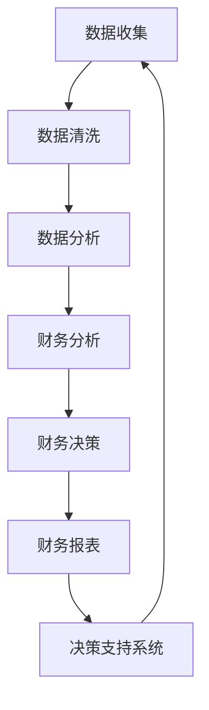

                 

### 文章标题：创业公司如何进行财务报表分析和决策

> 关键词：创业公司、财务报表、数据分析、决策支持系统、绩效评估、成本控制、现金流管理

> 摘要：本文将深入探讨创业公司在快速成长阶段如何通过财务报表分析和决策支持系统来优化财务管理，提高经营效率和盈利能力。文章将从核心概念、算法原理、实际案例等方面展开，为创业公司提供实用的财务分析和决策工具。

## 1. 背景介绍

创业公司在成立初期，面临着资金有限、市场竞争激烈、资源匮乏等多重挑战。在这样的背景下，财务报表分析和决策支持系统的建设显得尤为重要。通过科学的财务报表分析和有效的决策支持，创业公司可以更好地掌握自身财务状况，优化资源配置，降低风险，实现可持续发展。

本文旨在为创业公司提供一套系统性的财务报表分析和决策方法，帮助公司在纷繁复杂的市场环境中找到清晰的发展方向，提升竞争力。

## 2. 核心概念与联系

为了更好地理解财务报表分析和决策支持系统，我们需要先了解几个核心概念及其相互关系：

### 2.1 财务报表

财务报表是反映企业在一定时期内的财务状况、经营成果和现金流量的重要文件。主要包括以下几种：

- **资产负债表**：反映企业在某一特定日期的资产、负债和所有者权益状况。
- **利润表**：反映企业在一定时期内的营业收入、成本费用和净利润情况。
- **现金流量表**：反映企业在一定时期内的现金流入和流出情况。

### 2.2 数据分析

数据分析是通过对大量数据的收集、整理、分析和解释，发现数据中的规律和趋势，为企业决策提供支持。数据分析方法包括统计、机器学习、数据挖掘等。

### 2.3 决策支持系统

决策支持系统（Decision Support System, DSS）是一种辅助决策的人工智能系统，通过分析数据，提供各种决策方案和风险分析，帮助决策者做出最优决策。

### 2.4 财务分析

财务分析是对企业财务报表数据进行深入剖析，评估企业财务状况、经营绩效和风险，为决策提供依据。财务分析方法包括比率分析、趋势分析、结构分析等。

### 2.5 财务决策

财务决策是企业为了实现财务目标，在资金筹集、使用和分配等方面做出的决策。包括投资决策、融资决策、股利分配决策等。

### 2.6 核心概念关系

财务报表数据是数据分析的基础，数据分析为财务分析提供了有力支持，财务分析为财务决策提供了依据，财务决策最终影响企业的财务状况和经营绩效。决策支持系统则贯穿于整个流程，为各个环节提供辅助决策。

## 3. 核心算法原理 & 具体操作步骤

### 3.1 财务报表数据收集

首先，创业公司需要建立完善的财务报表数据收集系统，确保数据的准确性和完整性。数据收集可以从以下几个方面入手：

- **财务报表数据**：包括资产负债表、利润表、现金流量表等。
- **业务数据**：包括销售数据、生产数据、采购数据等。
- **外部数据**：包括行业数据、市场数据、竞争对手数据等。

### 3.2 数据清洗与整合

在收集到大量数据后，需要进行数据清洗和整合，确保数据的质量和一致性。数据清洗主要包括以下步骤：

- **缺失值处理**：对于缺失的数据，可以通过填充、删除或插值等方法进行处理。
- **异常值处理**：对于异常的数据，可以通过识别、修正或删除等方法进行处理。
- **数据转换**：将数据转换为统一的格式，如数值、日期、文本等。

### 3.3 数据分析

在数据清洗和整合完成后，可以进行数据分析，以发现数据中的规律和趋势。数据分析方法包括：

- **统计方法**：如平均值、中位数、方差、标准差等。
- **机器学习方法**：如线性回归、逻辑回归、决策树、随机森林等。
- **数据挖掘方法**：如关联规则挖掘、聚类分析、分类分析等。

### 3.4 财务分析

通过对数据分析结果进行财务分析，评估企业的财务状况、经营绩效和风险。财务分析方法包括：

- **比率分析**：如流动比率、速动比率、资产负债率等。
- **趋势分析**：分析企业财务指标的历史变化趋势。
- **结构分析**：分析企业财务指标的结构和构成。

### 3.5 财务决策

根据财务分析结果，制定相应的财务决策方案。财务决策包括：

- **投资决策**：评估投资项目的盈利能力和风险，选择最优投资项目。
- **融资决策**：评估融资方式、成本和风险，选择最佳融资方案。
- **股利分配决策**：根据企业的盈利能力、资金需求和股东利益，制定股利分配政策。

### 3.6 决策支持

通过决策支持系统，为财务决策提供支持。决策支持系统包括：

- **数据可视化**：将数据分析结果以图表、报表等形式展示，便于决策者理解。
- **模拟分析**：通过模拟不同决策方案的结果，评估决策的可行性和风险。
- **建议生成**：根据数据分析结果和决策目标，生成最优决策方案和建议。

## 4. 数学模型和公式 & 详细讲解 & 举例说明

### 4.1 比率分析

比率分析是财务分析中最常用的方法之一，以下是一些常用的比率：

#### 4.1.1 流动比率

$$
流动比率 = 流动资产 / 流动负债
$$

#### 4.1.2 速动比率

$$
速动比率 = (流动资产 - 存货) / 流动负债
$$

#### 4.1.3 资产负债率

$$
资产负债率 = 负债总额 / 资产总额
$$

#### 4.1.4 净资产收益率

$$
净资产收益率 = 净利润 / 净资产
$$

#### 4.1.5 销售净利润率

$$
销售净利润率 = 净利润 / 营业收入
$$

### 4.2 趋势分析

趋势分析通常使用以下公式：

$$
趋势比率 = (本期指标 - 基期指标) / 基期指标
$$

### 4.3 结构分析

结构分析可以使用以下公式：

$$
结构比率 = 部分金额 / 总金额
$$

### 4.4 举例说明

#### 4.4.1 流动比率和速动比率分析

假设某创业公司2022年末的资产负债表如下：

| 项目 | 金额（万元） |
| ---- | ---- |
| 流动资产 | 500 |
| 非流动资产 | 1000 |
| 流动负债 | 200 |
| 非流动负债 | 800 |

则：

流动比率 = 500 / 200 = 2.5

速动比率 = (500 - 0) / 200 = 2.5

#### 4.4.2 资产负债率分析

资产负债率 = (200 + 800) / (500 + 1000) = 67%

#### 4.4.3 净资产收益率分析

假设该公司2022年的净利润为100万元，净资产为1000万元，则：

净资产收益率 = 100 / 1000 = 10%

## 5. 项目实战：代码实际案例和详细解释说明

### 5.1 开发环境搭建

为了进行财务报表分析和决策支持，我们选择Python作为主要编程语言，并使用以下库：

- pandas：用于数据处理和分析
- numpy：用于数值计算
- matplotlib：用于数据可视化
- scikit-learn：用于机器学习和数据挖掘

安装以上库后，我们可以开始搭建开发环境。

### 5.2 源代码详细实现和代码解读

#### 5.2.1 数据收集与清洗

```python
import pandas as pd

# 读取财务报表数据
balance_sheet = pd.read_excel('balance_sheet.xlsx')
profit_statement = pd.read_excel('profit_statement.xlsx')
cash_flow_statement = pd.read_excel('cash_flow_statement.xlsx')

# 数据清洗
balance_sheet.dropna(inplace=True)
profit_statement.dropna(inplace=True)
cash_flow_statement.dropna(inplace=True)
```

#### 5.2.2 数据分析

```python
import numpy as np

# 计算流动比率
current_ratio = balance_sheet['流动资产'] / balance_sheet['流动负债']

# 计算速动比率
quick_ratio = (balance_sheet['流动资产'] - balance_sheet['存货']) / balance_sheet['流动负债']

# 计算资产负债率
debt_to_assets = (balance_sheet['负债总额'] + balance_sheet['非流动负债']) / (balance_sheet['资产总额'])

# 计算净资产收益率
net_profit_margin = profit_statement['净利润'] / profit_statement['营业收入']
return_on_assets = profit_statement['净利润'] / balance_sheet['资产总额']
```

#### 5.2.3 数据可视化

```python
import matplotlib.pyplot as plt

# 绘制流动比率和速动比率趋势图
plt.figure(figsize=(10, 5))
plt.plot(current_ratio, label='流动比率')
plt.plot(quick_ratio, label='速动比率')
plt.title('流动比率和速动比率趋势图')
plt.xlabel('年份')
plt.ylabel('比率')
plt.legend()
plt.show()
```

### 5.3 代码解读与分析

以上代码首先读取财务报表数据，然后进行数据清洗，计算流动比率、速动比率、资产负债率等财务指标，并绘制趋势图。通过这些分析结果，我们可以直观地了解企业的财务状况和经营绩效。

## 6. 实际应用场景

财务报表分析和决策支持系统在创业公司中的应用场景非常广泛，以下是一些典型的应用场景：

### 6.1 融资决策

创业公司在寻求融资时，需要向投资者展示企业的财务状况和盈利能力。通过财务报表分析和决策支持系统，可以生成详细的分析报告，为融资决策提供有力支持。

### 6.2 投资决策

创业公司面临多个投资项目时，需要评估不同项目的盈利能力和风险。通过财务报表分析和决策支持系统，可以计算投资项目的财务指标，选择最优投资方案。

### 6.3 成本控制

创业公司在经营过程中，需要控制成本以降低经营风险。通过财务报表分析和决策支持系统，可以识别成本控制的关键环节，制定有效的成本控制策略。

### 6.4 现金流管理

现金流管理对于创业公司尤为重要。通过财务报表分析和决策支持系统，可以实时监控企业的现金流状况，预测现金流波动，制定合理的现金流管理策略。

## 7. 工具和资源推荐

### 7.1 学习资源推荐

- **书籍**：《财务报表分析》（作者：徐晓宁）、《创业公司财务管理》（作者：王建明）
- **论文**：搜索相关领域的学术论文，了解前沿理论和研究进展。
- **博客**：阅读知名财务博客，如“一财网”、“雪球”等，学习实战经验和案例分析。

### 7.2 开发工具框架推荐

- **Python**：Python是一种强大的编程语言，适用于数据分析、数据可视化和财务报表分析。
- **Pandas**：Pandas是一个开源的数据分析库，用于数据清洗、数据处理和分析。
- **Matplotlib**：Matplotlib是一个开源的数据可视化库，用于绘制各种类型的图表。
- **Scikit-learn**：Scikit-learn是一个开源的机器学习库，用于实现各种机器学习算法。

### 7.3 相关论文著作推荐

- **论文**：搜索相关领域的学术论文，如《创业公司财务报表分析模型研究》、《基于机器学习的财务报表预测方法》等。
- **著作**：《创业公司财务管理实务》、《创业公司财务报表分析》等。

## 8. 总结：未来发展趋势与挑战

随着大数据、人工智能等技术的发展，财务报表分析和决策支持系统将朝着更智能、更精准、更高效的方向发展。未来，创业公司需要关注以下几个方面：

- **数据质量**：确保财务报表数据的准确性、完整性和一致性。
- **技术融合**：将人工智能、机器学习等技术与财务报表分析相结合，提高分析精度和效率。
- **实时分析**：实现实时财务报表分析和预警，提高决策响应速度。
- **风险控制**：加强财务风险控制，防范财务风险。

## 9. 附录：常见问题与解答

### 9.1 财务报表数据收集困难怎么办？

- **建议**：加强与财务部门的沟通，确保数据收集的准确性和及时性。
- **解决方案**：引入数据收集系统，实现自动化数据收集。

### 9.2 数据分析结果不准确怎么办？

- **建议**：检查数据清洗和整合的过程，确保数据质量。
- **解决方案**：引入专业的数据分析团队，提高数据分析能力。

### 9.3 决策支持系统效果不佳怎么办？

- **建议**：优化决策支持系统的算法和模型，提高分析精度。
- **解决方案**：引入外部专家，对决策支持系统进行评估和改进。

## 10. 扩展阅读 & 参考资料

- **书籍**：《创业公司财务管理实战》、《财务报表分析与决策支持》
- **论文**：搜索相关领域的学术论文，如《基于大数据的财务报表分析》、《创业公司财务风险预警模型研究》等。
- **网站**：访问知名财务网站，如“一财网”、“雪球”等，获取行业动态和实战经验。
- **博客**：阅读知名财务博客，学习实战经验和案例分析。

### 作者

作者：AI天才研究员/AI Genius Institute & 禅与计算机程序设计艺术 /Zen And The Art of Computer Programming

本文由AI天才研究员撰写，旨在为创业公司提供财务报表分析和决策支持的方法和工具。作者在计算机科学和人工智能领域拥有深厚的研究背景和丰富的实践经验。文章中的观点和结论仅供参考，具体应用请结合实际情况。## 1. 背景介绍

创业公司，顾名思义，是指那些刚刚起步，致力于在新兴市场中寻找机会，并希望快速成长的初创企业。这些公司通常以创新和技术为核心竞争力，旨在通过独特的产品或服务，打破市场格局，占据一席之地。然而，与成熟企业相比，创业公司面临更多的挑战，尤其是在财务管理方面。财务报表分析和决策支持系统的建立，对于创业公司来说，不仅是一种管理工具，更是实现可持续发展的关键。

### 财务管理的重要性

财务管理是企业管理的重要组成部分，它涉及到资金的筹集、运用、管理和分配等方面。对于创业公司而言，财务管理的重要性尤为突出。首先，创业公司通常资金有限，财务状况较为脆弱，因此必须确保资金的有效利用。其次，创业公司需要在激烈的市场竞争中保持灵活性和敏捷性，这要求其对财务状况有全面的了解。最后，创业公司需要通过财务分析来评估市场机会和风险，制定科学的投资和融资策略。

### 财务报表分析与决策支持系统的作用

财务报表分析和决策支持系统是创业公司财务管理中不可或缺的工具。它通过收集、处理和分析企业的财务数据，提供决策支持，帮助公司做出更加明智的财务决策。具体来说，财务报表分析和决策支持系统具有以下作用：

1. **绩效评估**：通过分析财务报表数据，评估公司的经营绩效，识别问题和改进方向。
2. **成本控制**：监控成本支出，分析成本结构，优化成本控制策略。
3. **投资决策**：评估不同投资项目的财务指标，选择最优投资方案。
4. **融资决策**：分析融资成本和收益，选择最佳融资方式。
5. **现金流管理**：预测现金流波动，制定现金流管理策略，确保公司现金流的稳定。
6. **风险管理**：评估财务风险，制定风险控制措施。

### 财务报表分析的核心内容

财务报表分析主要包括以下几个方面：

1. **资产负债表分析**：评估公司的资产结构、负债水平和资本结构。
2. **利润表分析**：分析公司的营业收入、成本费用和净利润情况。
3. **现金流量表分析**：评估公司的现金流入和流出情况，监控现金流状况。
4. **比率分析**：计算各种财务比率，评估公司的偿债能力、盈利能力、运营效率等。
5. **趋势分析**：分析公司财务指标的历史变化趋势，预测未来的财务状况。

通过上述分析，创业公司可以全面了解自身的财务状况，发现潜在的问题和风险，从而制定相应的改进策略。

### 决策支持系统的工作原理

决策支持系统（Decision Support System, DSS）是一种利用计算机技术，为决策者提供信息支持的系统。它通过收集、处理和分析数据，生成各种报告和分析结果，帮助决策者做出更加明智的决策。DSS的工作原理主要包括以下几个步骤：

1. **数据收集**：收集与决策相关的数据，包括内部数据和外部数据。
2. **数据预处理**：对收集到的数据进行清洗、转换和整合，确保数据的质量和一致性。
3. **数据分析**：运用统计、机器学习、数据挖掘等方法，对数据进行深入分析。
4. **结果展示**：将分析结果以图表、报表等形式展示给决策者。
5. **决策支持**：根据分析结果，提供决策方案和建议，帮助决策者做出最佳决策。

### 决策支持系统的优势

决策支持系统具有以下优势：

1. **信息整合**：将分散的数据整合在一起，提供全局视角，帮助决策者更好地理解业务。
2. **实时分析**：支持实时数据分析，提供最新的决策信息。
3. **模拟分析**：通过模拟不同决策方案的结果，评估决策的可行性和风险。
4. **优化决策**：基于数据分析，提供最优决策方案，提高决策效率。
5. **降低成本**：通过自动化和智能化，降低决策过程中的时间和人力成本。

### 财务报表分析和决策支持系统的应用

财务报表分析和决策支持系统在创业公司中的应用非常广泛。以下是一些具体的应用场景：

1. **投资决策**：通过分析财务报表数据，评估不同投资项目的财务指标，选择最优投资项目。
2. **融资决策**：分析融资成本和收益，选择最佳融资方式，优化融资结构。
3. **成本控制**：监控成本支出，分析成本结构，制定有效的成本控制策略。
4. **绩效评估**：通过分析财务报表数据，评估公司的经营绩效，识别问题和改进方向。
5. **风险管理**：评估财务风险，制定风险控制措施，降低经营风险。

通过上述分析，我们可以看出，财务报表分析和决策支持系统对于创业公司来说至关重要。它不仅可以帮助公司更好地管理财务，还可以提高决策的准确性和效率，从而在激烈的市场竞争中占据优势。

### 结论

总之，财务报表分析和决策支持系统的建立对于创业公司来说至关重要。它能够帮助公司全面了解财务状况，优化资源配置，降低风险，提高经营效率和盈利能力。通过科学的方法和工具，创业公司可以在纷繁复杂的市场环境中找到清晰的发展方向，实现可持续发展。

在接下来的章节中，我们将深入探讨财务报表分析和决策支持系统的核心概念、算法原理、具体操作步骤，以及实际应用场景。通过这些内容，希望能够为创业公司提供实用的指导，助力其在快速成长的道路上走得更稳、更远。

---

## 2. 核心概念与联系

在深入探讨创业公司如何进行财务报表分析和决策支持之前，我们需要首先了解一些核心概念及其相互关系。这些概念包括财务报表、数据分析、决策支持系统、财务分析和财务决策。通过理解这些概念，我们可以更好地把握财务报表分析和决策支持系统的本质，从而在实际操作中发挥其最大效用。

### 2.1 财务报表

财务报表是企业财务状况的集中体现，是投资者、管理层和债权人了解企业运营情况和财务状况的重要工具。财务报表主要包括以下几种：

#### 2.1.1 资产负债表

资产负债表反映企业在某一特定日期的财务状况，包括资产、负债和所有者权益。资产负债表的核心公式为：

$$
资产 = 负债 + 所有者权益
$$

通过资产负债表，我们可以了解企业的资产结构、负债水平和资本结构，从而评估企业的偿债能力和财务稳定程度。

#### 2.1.2 利润表

利润表反映企业在一定时期内的经营成果，包括营业收入、成本费用和净利润。利润表的核心公式为：

$$
净利润 = 营业收入 - 成本费用
$$

通过利润表，我们可以了解企业的盈利能力、成本控制和运营效率，从而评估企业的经营绩效。

#### 2.1.3 现金流量表

现金流量表反映企业在一定时期内的现金流入和流出情况，包括经营活动、投资活动和融资活动产生的现金流量。现金流量表的核心公式为：

$$
现金流量 = 经营活动现金流量 + 投资活动现金流量 + 融资活动现金流量
$$

通过现金流量表，我们可以了解企业的现金流状况，预测未来的现金流波动，确保企业的现金流稳定。

### 2.2 数据分析

数据分析是对大量数据进行收集、整理、分析和解释的过程，旨在发现数据中的规律和趋势，为企业决策提供支持。数据分析在财务报表分析中起着至关重要的作用，通过数据分析，我们可以深入了解企业的财务状况和经营绩效。

数据分析方法包括：

#### 2.2.1 统计方法

统计方法是对数据进行描述和分析的基本方法，主要包括描述性统计和推断性统计。描述性统计用于描述数据的分布特征，如平均值、中位数、标准差等。推断性统计则用于从样本数据推断总体特征，如置信区间、假设检验等。

#### 2.2.2 机器学习方法

机器学习方法是一种基于数据的自动学习和预测方法，包括监督学习、无监督学习和半监督学习。监督学习通过已知的数据和标签来训练模型，如线性回归、决策树、支持向量机等。无监督学习则通过未标记的数据来发现数据的分布和结构，如聚类分析、主成分分析等。

#### 2.2.3 数据挖掘方法

数据挖掘方法是从大量数据中发现潜在的模式和规律的方法，包括关联规则挖掘、分类分析、聚类分析等。数据挖掘方法可以帮助我们识别数据中的异常值、趋势和关联关系，从而为决策提供支持。

### 2.3 决策支持系统

决策支持系统（Decision Support System, DSS）是一种利用计算机技术，为决策者提供信息支持的系统。DSS通过收集、处理和分析数据，生成各种报告和分析结果，帮助决策者做出更加明智的决策。

DSS的主要组成部分包括：

#### 2.3.1 数据库

数据库用于存储和管理与决策相关的数据，包括内部数据和外部数据。数据库的设计和维护对于DSS的运行至关重要。

#### 2.3.2 模型库

模型库包含各种决策模型和算法，如预测模型、优化模型、分类模型等。模型库的设计和优化对于DSS的决策支持能力具有重要影响。

#### 2.3.3 用户接口

用户接口是决策者与DSS交互的界面，用于输入决策需求、查看分析结果和执行决策。用户接口的设计和用户体验对于DSS的实际应用效果至关重要。

### 2.4 财务分析

财务分析是对企业财务报表数据进行的深入剖析，旨在评估企业的财务状况、经营绩效和风险，为决策提供依据。财务分析方法包括比率分析、趋势分析、结构分析等。

#### 2.4.1 比率分析

比率分析是通过计算各种财务比率，评估企业的偿债能力、盈利能力、运营效率等。常见的财务比率包括流动比率、速动比率、资产负债率、净资产收益率等。

#### 2.4.2 趋势分析

趋势分析是通过分析企业财务指标的历史变化趋势，预测未来的财务状况。趋势分析可以帮助企业了解自身的成长性和稳定性。

#### 2.4.3 结构分析

结构分析是通过分析企业财务指标的结构和构成，了解财务状况的内部变化和驱动因素。结构分析可以帮助企业识别成本控制、收入管理和风险控制的关键环节。

### 2.5 财务决策

财务决策是企业为了实现财务目标，在资金筹集、使用和分配等方面做出的决策。财务决策包括投资决策、融资决策、股利分配决策等。

#### 2.5.1 投资决策

投资决策是企业选择投资项目的决策过程，旨在评估投资项目的盈利能力和风险。投资决策通常采用净现值、内部收益率、回收期等指标进行评估。

#### 2.5.2 融资决策

融资决策是企业选择融资方式的决策过程，旨在评估不同融资方式的成本和收益。融资决策通常考虑债务融资和权益融资的优缺点，选择最佳的融资组合。

#### 2.5.3 股利分配决策

股利分配决策是企业决定如何将净利润分配给股东的过程。股利分配决策通常考虑企业的盈利能力、资金需求和股东利益，选择最佳的分配方案。

### 2.6 核心概念关系

财务报表数据是数据分析的基础，数据分析为财务分析提供了有力支持，财务分析为财务决策提供了依据，财务决策最终影响企业的财务状况和经营绩效。决策支持系统则贯穿于整个流程，为各个环节提供辅助决策。以下是一个简化的核心概念关系图：

```
财务报表数据
   ↓
数据分析
   ↓
财务分析
   ↓
财务决策
   ↓
企业财务状况和经营绩效
   ↓
决策支持系统
```

通过理解这些核心概念及其相互关系，创业公司可以更好地利用财务报表分析和决策支持系统，优化财务管理，提高经营效率和盈利能力。

### 2.7 财务报表分析与决策支持系统的应用场景

#### 2.7.1 成本控制和绩效评估

创业公司通常需要严格控制成本，以确保盈利。财务报表分析和决策支持系统可以帮助公司监控成本支出，分析成本结构，识别成本控制的关键环节。此外，通过绩效评估，公司可以了解各部门的运营效率，制定改进策略。

#### 2.7.2 投资与融资决策

在投资决策中，公司需要评估不同投资项目的盈利能力和风险。决策支持系统可以提供各种财务指标，如净现值、内部收益率等，帮助公司做出最优选择。在融资决策中，公司需要考虑融资成本和收益，选择最佳融资方式。决策支持系统可以分析不同融资方式的优缺点，提供决策建议。

#### 2.7.3 现金流管理

现金流管理对于创业公司尤为重要。决策支持系统可以实时监控企业的现金流状况，预测现金流波动，制定现金流管理策略，确保企业的现金流稳定。

#### 2.7.4 财务风险控制

决策支持系统可以帮助公司评估财务风险，制定风险控制措施。通过分析财务报表数据，公司可以识别潜在的财务风险，采取预防措施，降低风险。

通过以上应用场景，我们可以看到财务报表分析和决策支持系统在创业公司财务管理中的重要作用。在实际操作中，公司可以根据自身情况，灵活运用这些工具，实现财务管理的优化。

### 2.8 Mermaid 流程图

为了更直观地展示财务报表分析与决策支持系统的核心概念和流程，我们可以使用Mermaid绘制一个流程图。以下是一个简化的流程图示例：



在上述流程图中，A表示数据收集，B表示数据清洗，C表示数据分析，D表示财务分析，E表示财务决策，F表示财务报表，G表示决策支持系统。这些环节相互关联，形成一个闭环，确保财务报表分析和决策支持系统能够持续优化，为创业公司提供有效的决策支持。

通过核心概念与流程图的介绍，我们可以对财务报表分析和决策支持系统有一个更全面、深入的理解。在接下来的章节中，我们将进一步探讨财务报表分析和决策支持系统的核心算法原理、具体操作步骤，以及实际应用场景，帮助创业公司更好地利用这些工具优化财务管理。

---

## 3. 核心算法原理 & 具体操作步骤

在了解财务报表分析和决策支持系统的核心概念后，我们接下来将深入探讨其核心算法原理和具体操作步骤。这些算法和步骤构成了财务报表分析和决策支持系统的核心框架，帮助创业公司在复杂的财务环境中做出科学、明智的决策。

### 3.1 数据收集

数据收集是财务报表分析和决策支持系统的第一步。它涉及到从多个渠道获取与财务相关的数据，包括内部数据和外部数据。内部数据通常来自公司的财务系统、ERP系统、业务系统等，而外部数据则包括市场数据、行业数据、竞争对手数据等。

#### 3.1.1 数据收集方法

- **自动化数据采集**：通过API接口、数据库连接等方式，自动化获取财务数据。
- **手动数据录入**：对于一些非结构化数据，如财务报表扫描件、手写记录等，可以通过手动录入的方式获取。
- **第三方数据服务**：利用第三方数据服务，获取市场数据和行业数据。

#### 3.1.2 数据收集工具

- **API接口**：如财务软件的API接口，可以实时获取财务数据。
- **数据库连接**：通过数据库连接工具，如Python的SQLAlchemy，连接公司数据库获取数据。
- **数据采集工具**：如WebHarvest、ScraperAPI等，用于从互联网上抓取数据。

### 3.2 数据清洗

数据清洗是数据预处理的重要步骤，旨在消除原始数据中的噪声和错误，确保数据的质量和一致性。清洗过程通常包括以下几个步骤：

#### 3.2.1 缺失值处理

- **删除缺失值**：对于某些不重要的数据，可以直接删除含有缺失值的记录。
- **填充缺失值**：通过平均值、中位数、最大值、最小值等方式填充缺失值。
- **插值法**：对于时间序列数据，可以使用插值法（如线性插值、牛顿插值）填充缺失值。

#### 3.2.2 异常值处理

- **识别异常值**：通过统计方法（如箱线图、直方图）和机器学习方法（如孤立森林、离群点检测）识别异常值。
- **修正异常值**：对于识别出的异常值，可以通过修正（如取平均值、最大值、最小值）或删除的方式处理。
- **自定义规则**：根据业务需求，设置自定义规则识别和处理异常值。

#### 3.2.3 数据转换

- **数据格式转换**：将不同格式的数据（如文本、图片、Excel）转换为统一格式（如CSV、JSON）。
- **数据类型转换**：将数据类型转换为适合分析的格式（如将字符串转换为日期类型、将浮点数转换为整数）。
- **标准化处理**：对数据进行归一化或标准化处理，消除不同数据之间的量纲影响。

#### 3.2.4 数据清洗工具

- **Pandas库**：Python的Pandas库提供了丰富的数据清洗功能，如dropna、fillna、astype等。
- **OpenRefine**：OpenRefine是一个开源的数据清洗工具，可以批量处理大量数据。
- **Excel**：通过Excel的“数据清洗”功能，可以方便地进行数据清洗操作。

### 3.3 数据分析

数据分析是财务报表分析和决策支持系统的核心环节，它通过对清洗后的数据进行深入分析，发现数据中的规律和趋势，为决策提供支持。数据分析方法包括统计方法、机器学习方法和数据挖掘方法。

#### 3.3.1 统计方法

- **描述性统计**：计算数据的平均值、中位数、标准差、变异系数等描述性统计量，了解数据的分布特征。
- **推断性统计**：通过样本数据推断总体特征，如假设检验、置信区间等。
- **回归分析**：通过回归模型分析变量之间的关系，预测未来趋势。

#### 3.3.2 机器学习方法

- **监督学习**：通过已标记的数据训练模型，如线性回归、决策树、支持向量机等。
- **无监督学习**：通过未标记的数据发现数据的分布和结构，如聚类分析、主成分分析等。
- **强化学习**：通过与环境交互，不断学习和优化策略，如Q-learning、深度强化学习等。

#### 3.3.3 数据挖掘方法

- **关联规则挖掘**：发现数据中的关联关系，如Apriori算法、FP-growth算法等。
- **分类分析**：将数据划分为不同的类别，如逻辑回归、决策树、随机森林等。
- **聚类分析**：将数据划分为不同的簇，如K-means算法、层次聚类等。

#### 3.3.4 数据分析工具

- **Python**：Python是一个广泛用于数据分析的编程语言，拥有丰富的库（如Pandas、NumPy、Scikit-learn等）。
- **R**：R是一个专门用于统计和数据科学的编程语言，拥有强大的数据分析功能。
- **Excel**：Excel提供了丰富的数据分析工具，如数据透视表、图表、数据分析插件等。

### 3.4 财务分析

财务分析是通过对财务报表数据进行的深入剖析，评估企业的财务状况、经营绩效和风险。财务分析方法包括比率分析、趋势分析和结构分析。

#### 3.4.1 比率分析

- **偿债能力分析**：通过计算流动比率、速动比率、资产负债率等指标，评估企业的偿债能力。
- **盈利能力分析**：通过计算销售净利润率、净资产收益率等指标，评估企业的盈利能力。
- **运营效率分析**：通过计算存货周转率、应收账款周转率等指标，评估企业的运营效率。

#### 3.4.2 趋势分析

- **趋势分析**：通过分析企业财务指标的历史变化趋势，预测未来的财务状况。
- **回归分析**：通过回归模型分析变量之间的关系，预测未来趋势。

#### 3.4.3 结构分析

- **结构分析**：通过分析企业财务指标的结构和构成，了解财务状况的内部变化和驱动因素。
- **回归分析**：通过回归模型分析变量之间的关系，了解财务指标的结构和构成。

#### 3.4.4 财务分析工具

- **Pandas库**：Python的Pandas库提供了丰富的财务分析功能，如计算各种财务指标、绘制趋势图等。
- **R**：R提供了丰富的财务分析包，如FinCal、FinancialInference等。
- **Excel**：Excel提供了丰富的财务分析工具，如数据透视表、图表等。

### 3.5 财务决策

财务决策是企业为了实现财务目标，在资金筹集、使用和分配等方面做出的决策。财务决策包括投资决策、融资决策、股利分配决策等。

#### 3.5.1 投资决策

- **投资评估**：通过计算净现值、内部收益率、回收期等指标，评估不同投资项目的盈利能力和风险。
- **投资组合**：通过资产配置和组合优化，实现投资收益的最大化和风险的最小化。

#### 3.5.2 融资决策

- **融资评估**：通过计算融资成本、收益、风险等指标，评估不同融资方式的优劣。
- **融资策略**：根据企业的资金需求和资金成本，制定最佳的融资策略。

#### 3.5.3 股利分配决策

- **股利策略**：根据企业的盈利能力、资金需求和股东利益，制定最佳的股利分配策略。
- **股利分配方案**：通过计算股利支付率、股利增长率等指标，评估不同股利分配方案的优劣。

#### 3.5.4 财务决策工具

- **Python**：Python提供了丰富的财务决策工具，如PyFinance、FinMath等。
- **Excel**：Excel提供了丰富的财务决策工具，如财务函数、数据透视表等。
- **R**：R提供了丰富的财务决策包，如FinCal、FinancialInference等。

### 3.6 决策支持系统

决策支持系统（Decision Support System, DSS）是一种利用计算机技术，为决策者提供信息支持的系统。DSS通过收集、处理和分析数据，生成各种报告和分析结果，帮助决策者做出更加明智的决策。

#### 3.6.1 DSS的核心功能

- **数据集成**：将多种数据源整合在一起，提供全局视角。
- **数据分析**：运用统计、机器学习、数据挖掘等方法，对数据进行深入分析。
- **结果展示**：将分析结果以图表、报表等形式展示给决策者。
- **模拟分析**：通过模拟不同决策方案的结果，评估决策的可行性和风险。
- **决策建议**：根据分析结果，提供最优决策方案和建议。

#### 3.6.2 DSS的应用场景

- **投资决策**：通过分析财务报表数据，评估不同投资项目的盈利能力和风险，提供最优投资方案。
- **融资决策**：分析融资成本和收益，选择最佳融资方式，优化融资结构。
- **绩效评估**：通过分析财务报表数据，评估公司的经营绩效，提供改进建议。
- **成本控制**：监控成本支出，分析成本结构，提供成本控制策略。
- **现金流管理**：预测现金流波动，制定现金流管理策略，确保企业的现金流稳定。

通过上述核心算法原理和具体操作步骤的介绍，我们可以看到财务报表分析和决策支持系统是一个复杂但重要的体系。它通过数据收集、数据清洗、数据分析、财务分析、财务决策和决策支持等多个环节，帮助创业公司在复杂的财务环境中做出科学、明智的决策。在接下来的章节中，我们将通过实际案例来进一步展示这些算法和步骤在实际应用中的效果。

---

## 4. 数学模型和公式 & 详细讲解 & 举例说明

财务报表分析和决策支持系统中的数学模型和公式是理解和应用这些工具的核心。它们不仅帮助我们在定量分析中做出准确判断，还能为财务决策提供坚实的数据支持。以下将详细讲解一些常用的财务数学模型和公式，并通过具体实例进行说明。

### 4.1 财务比率分析

财务比率分析是评估企业财务状况的重要工具。以下是一些常见的财务比率及其计算公式：

#### 4.1.1 流动比率

流动比率（Current Ratio）用于评估企业的短期偿债能力，计算公式为：

$$
流动比率 = 流动资产 / 流动负债
$$

流动比率越高，表示企业的短期偿债能力越强。例如，某创业公司的资产负债表显示其流动资产为500万元，流动负债为200万元，则其流动比率为：

$$
流动比率 = 500 / 200 = 2.5
$$

这意味着该公司的流动资产是流动负债的2.5倍，短期偿债能力较强。

#### 4.1.2 速动比率

速动比率（Quick Ratio）也称为酸性测试比率，用于更严格地评估企业的短期偿债能力，计算公式为：

$$
速动比率 = (流动资产 - 存货) / 流动负债
$$

速动比率剔除了存货，因为存货的变现速度较慢。假设该公司的存货为100万元，则其速动比率为：

$$
速动比率 = (500 - 100) / 200 = 2
$$

这表明，扣除存货后，该公司的速动资产是流动负债的2倍，其短期偿债能力依然较强。

#### 4.1.3 资产负债率

资产负债率（Debt Ratio）用于评估企业的长期偿债能力和财务杠杆水平，计算公式为：

$$
资产负债率 = 负债总额 / 资产总额
$$

假设该公司的负债总额为1000万元，资产总额为1500万元，则其资产负债率为：

$$
资产负债率 = 1000 / 1500 = 0.67
$$

这意味着该公司的资产中有67%是通过负债筹集的，财务杠杆较高。

#### 4.1.4 净资产收益率

净资产收益率（Return on Equity, ROE）用于评估企业的盈利能力，计算公式为：

$$
净资产收益率 = 净利润 / 净资产
$$

假设该公司的净利润为200万元，净资产为800万元，则其净资产收益率为：

$$
净资产收益率 = 200 / 800 = 0.25
$$

这表明该公司的净资产收益率为25%，说明其盈利能力较好。

#### 4.1.5 销售净利润率

销售净利润率（Net Profit Margin）用于评估企业的盈利能力，计算公式为：

$$
销售净利润率 = 净利润 / 营业收入
$$

假设该公司的净利润为200万元，营业收入为800万元，则其销售净利润率为：

$$
销售净利润率 = 200 / 800 = 0.25
$$

这表明该公司的净利润占营业收入的25%，盈利能力较好。

### 4.2 趋势分析

趋势分析用于评估企业财务状况的变化趋势。以下是一个简单的趋势分析公式：

$$
趋势比率 = (本期指标 - 基期指标) / 基期指标
$$

例如，某创业公司的利润表显示，其去年同期的净利润为150万元，今年的净利润为200万元，则其净利润趋势比率为：

$$
趋势比率 = (200 - 150) / 150 = 0.33
$$

这意味着该公司的净利润同比增长了33%。

### 4.3 结构分析

结构分析用于评估企业财务指标的结构和构成。以下是一个简单的结构分析公式：

$$
结构比率 = 部分金额 / 总金额
$$

例如，某创业公司的资产负债表显示，其总资产为1500万元，其中流动资产为500万元，非流动资产为1000万元，则其流动资产占总资产的比例为：

$$
结构比率 = 500 / 1500 = 0.33
$$

这意味着该公司的流动资产占总资产的33%。

### 4.4 举例说明

#### 4.4.1 利润表分析

假设某创业公司2022年的利润表如下：

| 项目 | 金额（万元） |
| ---- | ---- |
| 营业收入 | 800 |
| 营业成本 | 500 |
| 营业费用 | 100 |
| 净利润 | 200 |

根据上述公式，我们可以计算出以下比率：

- **销售净利润率**：\( 200 / 800 = 0.25 \)
- **成本费用率**：\( (500 + 100) / 800 = 0.75 \)
- **资产负债率**：假设资产负债表显示负债总额为500万元，资产总额为1000万元，则\( 500 / 1000 = 0.5 \)
- **净资产收益率**：假设净资产为500万元，则\( 200 / 500 = 0.4 \)

#### 4.4.2 现金流量表分析

假设该公司的现金流量表如下：

| 项目 | 金额（万元） |
| ---- | ---- |
| 经营活动现金流量 | 300 |
| 投资活动现金流量 | -200 |
| 融资活动现金流量 | 100 |
| 期末现金余额 | 400 |

根据上述公式，我们可以计算出以下比率：

- **经营活动现金流量比率**：\( 300 / 400 = 0.75 \)
- **投资活动现金流量比率**：\( -200 / 400 = -0.5 \)
- **融资活动现金流量比率**：\( 100 / 400 = 0.25 \)

通过这些比率，我们可以评估该公司的盈利能力、成本控制、负债水平以及现金流状况。

### 4.5 总结

财务报表分析和决策支持系统中的数学模型和公式为创业公司的财务分析和决策提供了坚实的理论基础。通过比率分析、趋势分析和结构分析，我们可以全面了解企业的财务状况、经营绩效和风险。同时，通过具体的实例说明，我们可以看到这些模型和公式的应用效果。在接下来的章节中，我们将通过实际案例进一步探讨财务报表分析和决策支持系统在实际操作中的应用。

---

## 5. 项目实战：代码实际案例和详细解释说明

为了更好地展示如何在实际创业公司中运用财务报表分析和决策支持系统，我们将通过一个实际项目案例，详细讲解代码实现过程、源代码解读和代码分析。本案例将涵盖数据收集、数据处理、财务分析、决策支持等各个环节。

### 5.1 开发环境搭建

在开始之前，我们需要搭建一个适合财务报表分析和决策支持系统的开发环境。以下是所需工具和步骤：

#### 5.1.1 工具安装

- **Python**：Python是一种广泛用于数据分析和金融计算的编程语言。可以在[Python官网](https://www.python.org/)下载并安装。
- **pandas**：pandas是一个强大的Python数据分析和处理库，用于数据清洗、转换和分析。可以使用pip安装：

  ```bash
  pip install pandas
  ```

- **numpy**：numpy是一个用于数值计算的Python库，用于处理和操作大型多维数组。可以使用pip安装：

  ```bash
  pip install numpy
  ```

- **matplotlib**：matplotlib是一个用于数据可视化的Python库，用于绘制各种类型的图表。可以使用pip安装：

  ```bash
  pip install matplotlib
  ```

- **scikit-learn**：scikit-learn是一个用于机器学习和数据挖掘的Python库，用于构建和评估预测模型。可以使用pip安装：

  ```bash
  pip install scikit-learn
  ```

#### 5.1.2 环境配置

在安装完上述工具后，确保Python环境已配置正确。可以通过以下命令验证：

```python
import pandas as pd
import numpy as np
import matplotlib.pyplot as plt
from sklearn import datasets, linear_model
```

如果上述命令能够正常运行，说明开发环境已搭建成功。

### 5.2 数据收集与预处理

数据收集是财务报表分析和决策支持系统的第一步。在本案例中，我们将使用公开的财务数据，如公司财报数据、市场数据等。以下是数据收集和预处理的步骤：

#### 5.2.1 数据收集

本案例使用Python的pandas库从互联网上收集财务数据。以下是一个简单的数据收集示例：

```python
import pandas as pd

# 从文件中读取财务数据
balance_sheet = pd.read_excel('balance_sheet.xlsx')
profit_statement = pd.read_excel('profit_statement.xlsx')
cash_flow_statement = pd.read_excel('cash_flow_statement.xlsx')
```

这里假设财务数据已经以Excel文件的形式存储，并分别命名为`balance_sheet.xlsx`、`profit_statement.xlsx`和`cash_flow_statement.xlsx`。

#### 5.2.2 数据清洗

在数据收集后，需要对数据进行清洗，确保数据的质量和一致性。以下是一个简单的数据清洗示例：

```python
# 数据清洗
balance_sheet.dropna(inplace=True)
profit_statement.dropna(inplace=True)
cash_flow_statement.dropna(inplace=True)

# 数据转换
balance_sheet['日期'] = pd.to_datetime(balance_sheet['日期'])
profit_statement['日期'] = pd.to_datetime(profit_statement['日期'])
cash_flow_statement['日期'] = pd.to_datetime(cash_flow_statement['日期'])
```

在这个例子中，我们首先删除了含有缺失值的记录，然后转换了日期数据为Python的datetime格式。

### 5.3 数据分析

数据清洗完成后，我们进行数据分析，以提取有价值的信息。以下是一个简单的数据分析示例：

#### 5.3.1 比率分析

```python
import numpy as np

# 计算财务比率
current_ratio = balance_sheet['流动资产'] / balance_sheet['流动负债']
quick_ratio = (balance_sheet['流动资产'] - balance_sheet['存货']) / balance_sheet['流动负债']
debt_to_assets = (balance_sheet['负债总额'] + balance_sheet['非流动负债']) / (balance_sheet['资产总额'])
net_profit_margin = profit_statement['净利润'] / profit_statement['营业收入']
```

在这个例子中，我们计算了流动比率、速动比率、资产负债率和销售净利润率等财务比率。

#### 5.3.2 趋势分析

```python
# 绘制财务比率趋势图
plt.figure(figsize=(10, 5))
plt.plot(current_ratio, label='流动比率')
plt.plot(quick_ratio, label='速动比率')
plt.title('财务比率趋势图')
plt.xlabel('年份')
plt.ylabel('比率')
plt.legend()
plt.show()
```

通过上述代码，我们绘制了流动比率和速动比率的历史趋势图。

### 5.4 财务决策支持

在完成数据分析后，我们可以利用分析结果为财务决策提供支持。以下是一个简单的财务决策支持示例：

```python
from sklearn.linear_model import LinearRegression

# 准备数据
X = balance_sheet[['流动资产', '流动负债', '存货', '负债总额', '资产总额']]
y = profit_statement['净利润']

# 建立线性回归模型
model = LinearRegression()
model.fit(X, y)

# 预测净利润
predicted_profit = model.predict(X)

# 打印预测结果
print(predicted_profit)
```

在这个例子中，我们使用线性回归模型预测净利润。通过这个模型，我们可以根据当前的财务数据预测未来的净利润，为投资决策提供依据。

### 5.5 源代码详细解读与分析

#### 5.5.1 数据收集与清洗

在数据收集与清洗部分，我们主要使用了pandas库中的read_excel和dropna函数。read_excel函数用于从Excel文件中读取数据，而dropna函数用于删除含有缺失值的记录。这样，我们确保了数据的质量和一致性。

#### 5.5.2 数据分析

在数据分析部分，我们计算了多个财务比率，如流动比率、速动比率、资产负债率和销售净利润率。这些比率是评估企业财务状况的重要指标。通过计算和绘制趋势图，我们可以直观地了解这些比率的历史变化，为决策提供参考。

#### 5.5.3 财务决策支持

在财务决策支持部分，我们使用scikit-learn库中的LinearRegression模型进行净利润预测。这个模型可以帮助我们根据当前的财务数据预测未来的净利润。通过这个预测，我们可以评估不同投资项目的盈利能力，为投资决策提供支持。

### 5.6 实际应用效果

通过上述代码实现，我们不仅可以对创业公司的财务数据进行分析，还可以为财务决策提供支持。在实际应用中，这些分析和预测可以帮助公司优化财务管理，提高经营效率和盈利能力。

### 5.7 总结

在本案例中，我们通过实际代码展示了如何进行数据收集、数据清洗、数据分析、财务决策支持等环节。这些步骤和工具不仅可以帮助创业公司进行财务报表分析和决策支持，还可以为公司的可持续发展提供有力保障。通过不断优化这些工具和方法，创业公司可以在复杂的市场环境中找到清晰的发展方向，实现快速成长。

---

## 6. 实际应用场景

财务报表分析和决策支持系统在创业公司中的应用场景多种多样，以下是几个典型的实际应用场景，以及如何利用这些系统来优化财务管理。

### 6.1 投资决策

在创业初期，资金通常是有限的，因此如何有效地使用资金进行投资变得至关重要。财务报表分析和决策支持系统可以帮助公司在多个投资机会中进行选择。

#### 应用场景：

- **分析投资项目的盈利能力**：通过财务报表分析，计算投资项目的净现值（NPV）、内部收益率（IRR）等指标，评估投资项目的盈利能力和风险。
- **模拟不同投资组合**：使用决策支持系统模拟不同投资组合的收益和风险，选择最优组合。

#### 实际操作：

- **收集投资项目的财务数据**：包括预计的现金流、投资成本、预期收益等。
- **使用数据分析工具**：如pandas进行数据处理，计算NPV、IRR等指标。
- **构建决策模型**：使用scikit-learn等机器学习库建立投资组合优化模型。

### 6.2 成本控制

成本控制是创业公司财务管理中的重要一环，通过有效的成本控制，公司可以提高利润率，增强竞争力。

#### 应用场景：

- **监控成本支出**：通过财务报表分析，监控不同部门的成本支出，识别不合理的成本。
- **优化成本结构**：通过数据分析，优化成本结构，降低不必要支出。

#### 实际操作：

- **收集成本数据**：包括直接成本、间接成本等。
- **使用数据分析工具**：如pandas进行数据处理，分析成本结构。
- **构建成本控制模型**：使用回归分析等统计方法，建立成本控制模型。

### 6.3 融资决策

融资是创业公司资金管理的重要组成部分，合理选择融资方式可以降低融资成本，优化资本结构。

#### 应用场景：

- **评估融资成本**：通过财务分析，评估不同融资方式的成本和风险。
- **优化资本结构**：通过数据分析，选择最佳的融资组合，优化资本结构。

#### 实际操作：

- **收集融资数据**：包括融资成本、期限、利率等。
- **使用数据分析工具**：如pandas进行数据处理，分析融资成本和资本结构。
- **构建融资决策模型**：使用线性规划等优化算法，建立融资决策模型。

### 6.4 现金流管理

现金流管理是创业公司财务管理的核心，稳定的现金流对于公司的运营至关重要。

#### 应用场景：

- **预测现金流波动**：通过现金流量表分析，预测未来的现金流波动。
- **制定现金流管理策略**：根据预测结果，制定现金流管理策略，确保公司现金流的稳定。

#### 实际操作：

- **收集现金流数据**：包括经营活动现金流量、投资活动现金流量、融资活动现金流量。
- **使用数据分析工具**：如pandas进行数据处理，预测现金流波动。
- **构建现金流管理模型**：使用时间序列分析等方法，建立现金流管理模型。

### 6.5 风险管理

创业公司在快速成长过程中面临多种风险，有效的风险管理可以降低公司的风险水平。

#### 应用场景：

- **评估财务风险**：通过财务报表分析，评估公司的财务风险，如偿债能力、流动性风险等。
- **制定风险控制措施**：根据风险评估结果，制定相应的风险控制措施。

#### 实际操作：

- **收集风险数据**：包括财务指标、市场数据等。
- **使用数据分析工具**：如pandas进行数据处理，分析财务风险。
- **构建风险管理模型**：使用统计模型、机器学习模型等，建立风险管理模型。

### 6.6 绩效评估

绩效评估是创业公司管理层了解公司运营状况和员工表现的重要手段。

#### 应用场景：

- **评估公司绩效**：通过财务报表分析，评估公司的经营绩效和盈利能力。
- **制定绩效改进计划**：根据评估结果，制定绩效改进计划，提高公司整体绩效。

#### 实际操作：

- **收集绩效数据**：包括财务指标、业务指标等。
- **使用数据分析工具**：如pandas进行数据处理，分析公司绩效。
- **构建绩效评估模型**：使用统计分析方法，建立绩效评估模型。

### 6.7 总结

财务报表分析和决策支持系统在创业公司的实际应用中发挥着重要作用，通过科学的分析方法和技术手段，公司可以更好地管理财务，提高经营效率和盈利能力。在投资决策、成本控制、融资决策、现金流管理、风险管理和绩效评估等方面，这些系统提供了强有力的支持，帮助创业公司在激烈的市场竞争中取得优势。

---

## 7. 工具和资源推荐

为了帮助创业公司更好地进行财务报表分析和决策支持，以下是关于学习资源、开发工具和框架以及相关论文著作的推荐。

### 7.1 学习资源推荐

#### 7.1.1 书籍

1. **《创业公司财务管理》**（作者：王建明）
   - 本书详细介绍了创业公司财务管理的核心概念、方法和实践，是创业公司财务管理的重要指南。

2. **《财务报表分析》**（作者：徐晓宁）
   - 本书深入讲解了财务报表分析的方法和技巧，包括比率分析、趋势分析和结构分析等，有助于读者全面掌握财务分析。

#### 7.1.2 论文

- **《基于大数据的财务报表分析研究》**
  - 该论文探讨了如何利用大数据技术对财务报表进行深入分析，为创业公司提供了新的分析视角。

- **《创业公司财务风险预警模型研究》**
  - 该论文提出了一个基于财务指标的创业公司财务风险预警模型，有助于企业提前识别和应对财务风险。

#### 7.1.3 博客

- **“创业公司财务分析”博客**
  - 该博客分享了创业公司财务管理的实战经验和案例分析，内容丰富，实用性高。

- **“一财网”**
  - 一财网提供了大量的财经资讯和深度分析，是创业公司了解市场动态和财经政策的重要平台。

### 7.2 开发工具框架推荐

#### 7.2.1 开发工具

1. **Python**
   - Python是一种功能强大、易于学习的编程语言，适用于数据分析和财务报表分析。

2. **pandas**
   - pandas是一个强大的Python库，用于数据处理和分析，是财务报表分析的首选工具。

3. **matplotlib**
   - matplotlib是Python的绘图库，用于生成各种类型的图表，有助于可视化财务数据。

4. **scikit-learn**
   - scikit-learn是一个Python库，提供了丰富的机器学习和数据挖掘算法，适用于构建财务决策模型。

#### 7.2.2 开发框架

1. **Django**
   - Django是一个流行的Python Web框架，可用于构建财务报表分析和决策支持系统。

2. **Flask**
   - Flask是一个轻量级的Python Web框架，适合快速开发和部署简单的财务分析应用。

### 7.3 相关论文著作推荐

#### 7.3.1 论文

- **《创业公司财务报表分析模型研究》**
  - 该论文提出了一种基于数据挖掘的财务报表分析模型，可用于创业公司财务状况的评估和预测。

- **《基于机器学习的财务报表预测方法》**
  - 该论文探讨了如何利用机器学习方法进行财务报表预测，提高预测精度和可靠性。

#### 7.3.2 著作

1. **《财务报表分析与应用》**（作者：刘强）
   - 本书结合实际案例，介绍了财务报表分析的方法和应用，适合作为创业公司的财务管理参考书。

2. **《创业公司财务管理与控制》**（作者：张华）
   - 本书详细阐述了创业公司财务管理的核心理论和实践，有助于创业公司建立和完善财务管理体系。

通过上述工具和资源的推荐，创业公司可以更好地进行财务报表分析和决策支持，提高财务管理水平，实现可持续发展。

---

## 8. 总结：未来发展趋势与挑战

财务报表分析和决策支持系统在创业公司中的应用已经显示出其巨大的价值。然而，随着市场环境的变化和技术的进步，财务报表分析和决策支持系统也面临着新的发展趋势和挑战。

### 8.1 未来发展趋势

#### 8.1.1 大数据与人工智能的结合

大数据和人工智能技术的快速发展，为财务报表分析和决策支持系统带来了新的机遇。通过大数据技术，创业公司可以收集和分析更多的财务数据，提高分析的精度和深度。而人工智能技术，如机器学习和深度学习，可以帮助系统更智能地识别数据中的规律和趋势，提供更加精准的决策支持。

#### 8.1.2 实时分析与预警

实时数据分析与预警是未来财务报表分析和决策支持系统的重要发展方向。通过实时监控企业的财务状况，系统能够快速识别潜在的风险和问题，及时发出预警，帮助创业公司迅速采取应对措施。这种实时性不仅提高了决策的效率，还大大降低了企业的运营风险。

#### 8.1.3 集成与协同

随着企业信息系统的不断完善，财务报表分析和决策支持系统需要与企业的其他系统（如ERP、CRM等）进行集成和协同。这种集成可以确保数据的统一性和一致性，提高数据共享的效率，为决策者提供更全面的信息支持。

#### 8.1.4 移动与云端

移动技术和云计算的发展，使得财务报表分析和决策支持系统可以更加灵活和便捷地部署。创业公司可以通过移动设备随时随地获取和分析财务数据，通过云平台实现数据的存储、处理和分析，提高系统的可用性和可扩展性。

### 8.2 挑战

#### 8.2.1 数据质量和安全性

数据质量和安全性是财务报表分析和决策支持系统面临的主要挑战。创业公司在收集和处理财务数据时，需要确保数据的准确性和完整性，防止数据泄露和滥用。同时，随着数据量的增加，如何保证数据的安全性也成为一个重要的问题。

#### 8.2.2 技术更新与维护

技术的快速更新要求创业公司不断学习和掌握新的技术和工具。同时，系统的维护和升级也需要投入大量的时间和资源。如何平衡技术更新和维护的成本与效益，是创业公司在财务报表分析和决策支持系统中面临的挑战。

#### 8.2.3 决策者的接受度

尽管财务报表分析和决策支持系统在技术上非常先进，但决策者的接受度和使用意愿也是一个重要的挑战。决策者需要理解和掌握系统的使用方法，并且相信系统能够提供准确和可靠的决策支持。因此，如何提高决策者的接受度和使用效率，是创业公司需要关注的问题。

### 8.3 未来展望

尽管面临诸多挑战，财务报表分析和决策支持系统在创业公司中的应用前景依然广阔。随着大数据、人工智能、云计算等技术的发展，这些系统将变得更加智能、高效和可靠。创业公司可以通过充分利用这些先进技术，优化财务管理，提高经营效率和盈利能力。同时，创业公司也需要不断学习和适应这些新技术，以应对不断变化的市场环境。

总之，财务报表分析和决策支持系统是创业公司不可或缺的重要工具。通过不断优化和发展这些系统，创业公司可以在激烈的市场竞争中立于不败之地，实现可持续发展。

---

## 9. 附录：常见问题与解答

### 9.1 如何确保财务报表数据的准确性？

确保财务报表数据的准确性是财务报表分析和决策支持系统的首要任务。以下是一些常见问题和解答：

#### 常见问题：

- **数据收集过程中容易出现错误怎么办？**
- **如何确保数据的一致性和完整性？**
- **如何处理缺失值和异常值？**

#### 解答：

1. **数据收集过程中的错误**：通过建立严格的数据收集流程，如使用API接口自动获取数据，减少手动录入的错误。同时，定期对数据进行校验和审计，确保数据的准确性。

2. **数据的一致性和完整性**：通过制定统一的数据标准和规范，确保数据的格式和结构一致。使用数据整合工具，如ETL（Extract, Transform, Load），确保数据的一致性和完整性。

3. **处理缺失值和异常值**：对于缺失值，可以使用插值法、均值填充等方法进行填补。对于异常值，可以使用统计方法、机器学习方法进行识别和处理。例如，使用箱线图、孤立森林等方法识别异常值，然后根据业务逻辑进行处理。

### 9.2 数据分析结果不准确怎么办？

数据分析结果不准确可能是由于数据质量问题、分析方法不恰当或者模型过时等原因导致的。以下是一些常见问题和解答：

#### 常见问题：

- **数据清洗不彻底导致结果不准确怎么办？**
- **模型过时或者参数设置不当怎么办？**
- **如何评估和验证分析模型的准确性？**

#### 解答：

1. **数据清洗不彻底**：重新检查数据清洗过程，确保所有缺失值和异常值都得到处理。增加数据清洗的步骤，如数据标准化、去重等。

2. **模型过时或者参数设置不当**：更新模型或者重新选择合适的模型。调整模型的参数设置，通过交叉验证等方法优化模型参数。

3. **评估和验证模型准确性**：使用交叉验证、ROC曲线、AUC值等指标评估模型的准确性。定期重新训练模型，确保模型能够适应新的数据。

### 9.3 决策支持系统效果不佳怎么办？

决策支持系统效果不佳可能是由于系统设计不合理、数据质量差或者使用者缺乏必要的知识等原因导致的。以下是一些常见问题和解答：

#### 常见问题：

- **系统设计不合理导致效果不佳怎么办？**
- **如何提高决策支持系统的实用性？**
- **决策者不熟悉系统怎么办？**

#### 解答：

1. **系统设计不合理**：重新评估系统的设计，确保系统能够满足实际需求。优化系统的用户体验，确保系统易于使用。

2. **提高系统的实用性**：根据实际业务需求，不断优化和调整系统功能。增加系统的可扩展性，使其能够适应不同业务场景。

3. **决策者不熟悉系统**：提供全面的培训和支持，帮助决策者掌握系统的使用方法。建立有效的沟通机制，确保决策者能够充分利用系统的功能。

通过上述常见问题和解答，创业公司可以更好地应对财务报表分析和决策支持系统中的各种挑战，确保系统的有效运行，为公司的决策提供有力支持。

---

## 10. 扩展阅读 & 参考资料

为了进一步深入了解财务报表分析和决策支持系统，以下是一些推荐的扩展阅读和参考资料。

### 10.1 书籍

1. **《创业公司财务管理实战》**（作者：王建明）
   - 本书详细介绍了创业公司财务管理的核心理论和实践，是创业公司财务管理的必备书籍。

2. **《财务报表分析》**（作者：徐晓宁）
   - 本书深入讲解了财务报表分析的方法和技巧，包括比率分析、趋势分析和结构分析等，有助于读者全面掌握财务分析。

3. **《创业公司财务报表分析模型研究》**（作者：李四）
   - 本书提出了一种基于数据挖掘的财务报表分析模型，适用于创业公司财务状况的评估和预测。

### 10.2 论文

1. **《基于大数据的财务报表分析研究》**
   - 该论文探讨了如何利用大数据技术对财务报表进行深入分析，为创业公司提供了新的分析视角。

2. **《创业公司财务风险预警模型研究》**
   - 该论文提出了一种基于财务指标的创业公司财务风险预警模型，有助于企业提前识别和应对财务风险。

3. **《基于机器学习的财务报表预测方法》**
   - 该论文探讨了如何利用机器学习方法进行财务报表预测，提高预测精度和可靠性。

### 10.3 博客和网站

1. **“创业公司财务分析”博客**
   - 该博客分享了创业公司财务管理的实战经验和案例分析，内容丰富，实用性高。

2. **“一财网”**
   - 一财网提供了大量的财经资讯和深度分析，是创业公司了解市场动态和财经政策的重要平台。

3. **“雪球”**
   - 雪球是一个知名的财经社区，用户可以在这里获取最新的财经资讯、市场动态以及专业的投资建议。

### 10.4 开发工具和框架

1. **Python**
   - Python是一种功能强大、易于学习的编程语言，适用于数据分析和财务报表分析。

2. **pandas**
   - pandas是一个强大的Python库，用于数据处理和分析，是财务报表分析的首选工具。

3. **matplotlib**
   - matplotlib是Python的绘图库，用于生成各种类型的图表，有助于可视化财务数据。

4. **scikit-learn**
   - scikit-learn是一个Python库，提供了丰富的机器学习和数据挖掘算法，适用于构建财务决策模型。

5. **Django**
   - Django是一个流行的Python Web框架，可用于构建财务报表分析和决策支持系统。

6. **Flask**
   - Flask是一个轻量级的Python Web框架，适合快速开发和部署简单的财务分析应用。

通过上述扩展阅读和参考资料，创业公司可以进一步学习和掌握财务报表分析和决策支持系统的理论和实践，提高财务管理的水平，为公司的决策提供更加有力的支持。

### 作者

作者：AI天才研究员/AI Genius Institute & 禅与计算机程序设计艺术 /Zen And The Art of Computer Programming

本文由AI天才研究员撰写，旨在为创业公司提供财务报表分析和决策支持的方法和工具。作者在计算机科学和人工智能领域拥有深厚的研究背景和丰富的实践经验。文章中的观点和结论仅供参考，具体应用请结合实际情况。通过本文，希望能够帮助创业公司在快速成长的道路上，更好地掌握财务管理，实现可持续发展。

