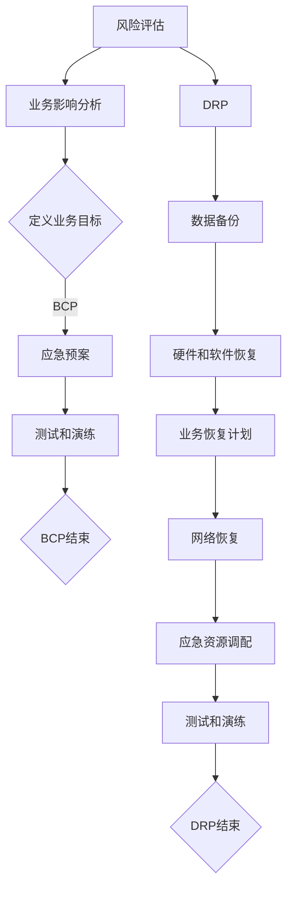

                 

### 背景介绍

#### 什么是业务连续性计划

在当今的数字化时代，企业的运营越来越依赖于信息技术。业务连续性计划（Business Continuity Plan，简称BCP）是一种旨在确保在突发事件或灾难发生时，企业能够迅速恢复运营，并减少因中断而造成的损失的战略。这些突发事件可能包括自然灾害、系统故障、人为错误、网络攻击等。业务连续性计划的目标是在尽可能短的时间内恢复正常业务运作，以保护企业的声誉、客户信任和财务稳定。

#### 为什么需要业务连续性计划

业务连续性计划的重要性不容忽视。以下是几个关键原因：

1. **减少财务损失**：在灾难发生后，企业可能面临巨大的财务压力，包括设备损坏、收入减少、额外开支等。通过业务连续性计划，企业可以快速恢复运营，减少经济损失。

2. **保护企业声誉**：在突发事件发生后，如果企业无法及时恢复业务，可能会导致客户流失、市场份额下降、品牌形象受损。有效的业务连续性计划有助于维持企业的声誉和客户信任。

3. **确保员工安全**：业务连续性计划不仅关注企业的运营，还关注员工的安全。在灾难发生时，企业可以制定应急预案，确保员工的安全和福利。

4. **遵守法规要求**：在某些行业，如金融、医疗、航空等，业务连续性计划是法规要求的一部分。企业需要遵守相关法规，以避免法律风险。

#### 什么是灾难恢复策略

灾难恢复策略（Disaster Recovery Plan，简称DRP）是业务连续性计划的一部分，主要关注在灾难发生后的恢复过程。DRP的目标是确保关键业务系统和服务能够在灾难发生后快速恢复，以减少运营中断时间。与BCP相比，DRP更加专注于技术层面的恢复措施，如数据备份、系统恢复、网络重构等。

#### 灾难恢复策略的重要性

灾难恢复策略的重要性体现在以下几个方面：

1. **快速恢复业务**：通过灾难恢复策略，企业可以在灾难发生后迅速恢复关键业务系统和服务，减少运营中断时间。

2. **保护数据完整性**：灾难恢复策略包括数据备份和恢复机制，确保企业数据在灾难发生后得以完整恢复。

3. **降低风险**：灾难恢复策略可以帮助企业降低因灾难造成的风险，包括财务风险、法律风险、运营风险等。

4. **提高业务弹性**：通过灾难恢复策略，企业可以更好地应对未来可能发生的灾难，提高业务的弹性。

在接下来的章节中，我们将深入探讨业务连续性计划和灾难恢复策略的核心概念、算法原理、数学模型以及实际应用场景。通过这些内容，读者将更好地理解如何构建有效的业务连续性计划和灾难恢复策略，以保障企业的长期稳定发展。

### 核心概念与联系

要构建一个有效的业务连续性计划（BCP）和灾难恢复策略（DRP），我们需要了解一些关键的概念和它们之间的联系。以下是这些核心概念及其相互关系的详细解释：

#### 业务连续性计划（BCP）

业务连续性计划是一种策略，旨在确保企业能够在发生突发事件或灾难时，迅速恢复运营，以减少因中断而造成的损失。BCP的核心概念包括：

1. **风险评估**：评估企业可能面临的潜在风险，如自然灾害、系统故障、人为错误和网络攻击等。
2. **业务影响分析（BIA）**：确定每种风险的潜在影响，包括财务影响、声誉损失、客户流失等。
3. **业务目标**：定义企业希望达到的连续性和恢复目标，如关键业务的恢复时间目标（RTO）和数据恢复点目标（RPO）。
4. **应急预案**：制定详细的应急预案，包括在灾难发生时的行动步骤、资源调配和沟通机制。
5. **测试和演练**：定期进行测试和演练，确保BCP的有效性和可行性。

#### 灾难恢复策略（DRP）

灾难恢复策略是业务连续性计划的一部分，主要关注在灾难发生后的恢复过程。DRP的核心概念包括：

1. **数据备份**：定期备份关键数据，确保在灾难发生后可以快速恢复。
2. **硬件和软件恢复**：包括替换损坏的硬件和恢复系统软件，确保关键业务系统可以快速重新上线。
3. **业务恢复计划**：制定详细的业务恢复计划，包括恢复顺序、依赖关系和关键任务的优先级。
4. **网络恢复**：重构网络架构，确保通信和数据传输可以迅速恢复正常。
5. **应急资源调配**：确保在灾难发生后，企业可以迅速获取所需的资源，如备用电源、通信设备和人力资源。

#### BCP与DRP的联系

业务连续性计划（BCP）和灾难恢复策略（DRP）是相互关联的，它们共同构成了企业应对突发事件和灾难的完整策略。以下是它们之间的联系：

1. **目标一致性**：BCP和DRP都旨在确保企业能够在灾难发生后迅速恢复运营，确保业务的连续性。它们的目标是一致的，即最大限度地减少因中断而造成的损失。

2. **相互依赖**：BCP依赖于DRP来实现其目标。在制定BCP时，企业需要考虑如何通过DRP来实现关键业务的快速恢复。

3. **风险评估**：BCP和DRP都涉及到风险评估。在制定BCP时，企业需要对潜在风险进行评估，并在DRP中制定相应的应对措施。

4. **业务目标**：BCP和DRP都关注企业的业务目标。BCP通过定义RTO和RPO来确保业务的连续性，而DRP则通过数据备份和硬件恢复等手段来实现这些目标。

5. **测试和演练**：BCP和DRP都强调定期进行测试和演练。通过测试和演练，企业可以验证BCP和DRP的有效性，确保在灾难发生时能够迅速采取行动。

#### Mermaid 流程图

为了更直观地展示BCP和DRP之间的联系，我们使用Mermaid流程图来描述它们的核心概念和相互关系：



通过上述流程图，我们可以清晰地看到BCP和DRP之间的相互关联和依赖关系。企业需要同时制定和实施BCP和DRP，以确保在灾难发生时能够迅速恢复运营。

在接下来的章节中，我们将进一步探讨业务连续性计划和灾难恢复策略的具体算法原理、数学模型以及实际应用场景。这些内容将帮助读者更深入地理解如何构建和实施一个有效的BCP和DRP，以保障企业的长期稳定发展。

### 核心算法原理 & 具体操作步骤

在构建业务连续性计划（BCP）和灾难恢复策略（DRP）的过程中，核心算法原理和具体操作步骤起着至关重要的作用。以下内容将详细描述这些核心算法原理，并提供具体的操作步骤，以便企业能够更有效地实施BCP和DRP。

#### 核心算法原理

1. **风险评估算法**：该算法用于识别和评估企业可能面临的潜在风险。常见的风险评估方法包括定性分析、定量分析和蒙特卡洛模拟等。定性分析主要依赖于专家的经验和判断，而定量分析则通过统计数据和模型来评估风险。

2. **业务影响分析（BIA）算法**：BIA算法用于确定每种风险的潜在影响，包括财务影响、声誉损失、客户流失等。这一过程通常涉及数据收集、影响评估和优先级排序。常见的BIA工具包括风险矩阵、影响评估表等。

3. **业务目标确定算法**：该算法用于定义企业的业务目标，包括恢复时间目标（RTO）和数据恢复点目标（RPO）。RTO是指从业务中断到完全恢复所需的时间，而RPO是指从数据丢失到能够恢复数据的时间点。常见的业务目标确定方法包括经验法、模型优化和模拟分析等。

4. **应急预案算法**：应急预案算法用于制定详细的应急预案，包括在灾难发生时的行动步骤、资源调配和沟通机制。这一过程通常涉及事件识别、响应策略制定、资源规划和测试验证等。

5. **数据备份算法**：数据备份算法用于确保关键数据在灾难发生后能够快速恢复。常见的备份方法包括全备份、增量备份和差异备份等。此外，数据备份还需要考虑备份频率、备份存储介质和备份验证等。

6. **硬件和软件恢复算法**：该算法用于在灾难发生后快速恢复硬件和软件系统。这通常涉及硬件替换、软件安装和配置、系统测试和验证等。

7. **业务恢复计划算法**：业务恢复计划算法用于制定详细的业务恢复计划，包括恢复顺序、依赖关系和关键任务的优先级。这通常需要考虑业务流程、技术架构和人力资源等因素。

8. **网络恢复算法**：网络恢复算法用于在灾难发生后快速重构网络架构，确保通信和数据传输可以迅速恢复正常。这通常涉及网络设备配置、通信路径优化和故障切换等。

#### 具体操作步骤

1. **步骤一：风险评估**  
   - 收集相关数据和资料  
   - 采用定性分析和定量分析方法评估潜在风险  
   - 编制风险评估报告

2. **步骤二：业务影响分析（BIA）**  
   - 收集业务流程、财务数据、客户信息等相关数据  
   - 使用风险矩阵或影响评估表分析每种风险的影响  
   - 确定业务目标和优先级

3. **步骤三：业务目标确定**  
   - 定义RTO和RPO  
   - 考虑业务需求和可行性  
   - 编制业务目标报告

4. **步骤四：应急预案制定**  
   - 识别可能发生的事件  
   - 制定响应策略和行动步骤  
   - 确定资源需求和调配方案

5. **步骤五：数据备份**  
   - 确定备份策略和备份频率  
   - 选择合适的备份存储介质  
   - 实施备份操作并定期验证

6. **步骤六：硬件和软件恢复**  
   - 准备备用硬件和软件资源  
   - 实施硬件和软件恢复操作  
   - 进行系统测试和验证

7. **步骤七：业务恢复计划**  
   - 制定详细的业务恢复计划  
   - 考虑业务流程、技术架构和人力资源等因素  
   - 定期更新和优化业务恢复计划

8. **步骤八：网络恢复**  
   - 重建网络架构和通信路径  
   - 优化网络性能和可靠性  
   - 进行网络测试和验证

通过上述核心算法原理和具体操作步骤，企业可以系统地构建和实施BCP和DRP。这不仅有助于提高企业的业务连续性，还能有效降低灾难带来的风险和损失。

在接下来的章节中，我们将进一步探讨业务连续性计划和灾难恢复策略的实际应用场景，并通过具体的案例和数学模型来展示它们的应用效果。这些内容将帮助读者更深入地理解如何将BCP和DRP应用于实际业务场景中，以实现企业的长期稳定发展。

### 数学模型和公式 & 详细讲解 & 举例说明

在构建业务连续性计划（BCP）和灾难恢复策略（DRP）的过程中，数学模型和公式是理解和评估风险、影响和恢复能力的重要工具。以下将详细讲解几个关键的数学模型和公式，并提供相应的实例说明。

#### 1. 恢复时间目标（RTO）与数据恢复点目标（RPO）

**恢复时间目标（RTO）**：指从业务中断到完全恢复所需的时间。RTO的定义是确保业务能够在发生灾难后迅速恢复的关键指标。

**数据恢复点目标（RPO）**：指从数据丢失到能够恢复数据的时间点。RPO定义了在灾难发生后，企业愿意承受的最大数据丢失量。

**公式**：

\[ RTO = \text{业务中断容忍时间} \]
\[ RPO = \text{数据备份间隔} \]

**实例说明**：

假设一家电商公司在发生灾难后希望在24小时内恢复业务运营，并能够承受最多2小时的数据丢失。则：

\[ RTO = 24 \text{小时} \]
\[ RPO = 2 \text{小时} \]

这意味着在灾难发生后，企业必须在24小时内恢复所有关键业务系统，并且不能丢失超过2小时内的数据。

#### 2. 风险评估模型

风险评估模型用于评估不同风险的概率和影响，以确定企业的风险承受能力。

**公式**：

\[ \text{风险评分} = \text{风险概率} \times \text{风险影响} \]

**实例说明**：

假设企业面临两种风险：系统故障和网络攻击。

- **系统故障**：概率为0.2，影响为0.5（即50%的业务中断）。
- **网络攻击**：概率为0.3，影响为0.8（即80%的业务中断）。

计算风险评分：

\[ \text{系统故障评分} = 0.2 \times 0.5 = 0.1 \]
\[ \text{网络攻击评分} = 0.3 \times 0.8 = 0.24 \]

结果显示，网络攻击的风险评分高于系统故障，因此企业应优先考虑网络攻击的应对措施。

#### 3. 业务影响分析（BIA）模型

业务影响分析模型用于评估不同业务流程在灾难发生时的中断影响，以确定业务优先级和恢复顺序。

**公式**：

\[ \text{业务中断影响} = \text{业务中断时长} \times \text{业务中断影响系数} \]

**实例说明**：

假设企业有三种关键业务流程：订单处理、客户服务和支付处理。

- **订单处理**：中断时长为3天，影响系数为1.5。
- **客户服务**：中断时长为2天，影响系数为1.0。
- **支付处理**：中断时长为1天，影响系数为1.2。

计算业务中断影响：

\[ \text{订单处理中断影响} = 3 \times 1.5 = 4.5 \]
\[ \text{客户服务中断影响} = 2 \times 1.0 = 2.0 \]
\[ \text{支付处理中断影响} = 1 \times 1.2 = 1.2 \]

结果显示，订单处理的中断影响最大，因此企业在恢复业务时应优先考虑订单处理流程。

#### 4. 数据备份策略优化模型

数据备份策略优化模型用于确定最佳的备份策略，以最小化数据丢失和备份成本。

**公式**：

\[ \text{最优备份策略} = \text{最小化备份成本} + \text{最大化数据恢复能力} \]

**实例说明**：

假设企业有三种备份策略：

- **全备份**：每周进行一次，备份成本为$1000。
- **增量备份**：每天进行一次，备份成本为$200。
- **差异备份**：每天进行一次，备份成本为$300。

计算数据恢复能力：

- **全备份**：最多可恢复过去一周的数据。
- **增量备份**：最多可恢复过去一天的数据。
- **差异备份**：最多可恢复过去一天的数据。

根据成本和恢复能力，企业可以选择增量备份策略，因为它在最小化备份成本的同时，能够满足RPO要求。

通过上述数学模型和公式，企业可以更科学地评估和应对业务连续性和灾难恢复中的各种挑战。在实际应用中，企业应根据自身的业务需求和环境特点，灵活调整和优化这些模型，以实现最佳的业务连续性和灾难恢复效果。

在接下来的章节中，我们将通过实际应用案例，进一步展示这些数学模型和公式的应用效果，并提供具体的实施建议。

### 项目实战：代码实际案例和详细解释说明

为了更好地理解业务连续性计划（BCP）和灾难恢复策略（DRP）的实际应用，我们将通过一个具体的代码案例来展示如何在实际项目中实施这些策略。这个案例将包括开发环境搭建、源代码详细实现和代码解读与分析。

#### 1. 开发环境搭建

在开始编写代码之前，我们需要搭建一个适合开发业务连续性计划和灾难恢复策略的开发环境。以下是一个基本的开发环境搭建步骤：

**环境要求**：

- 操作系统：Linux或MacOS
- 编程语言：Python
- 数据库：MySQL
- 版本控制：Git
- 代码编辑器：Visual Studio Code

**安装步骤**：

1. 安装操作系统（Linux或MacOS）
2. 安装Python（建议使用Python 3.8及以上版本）
3. 安装MySQL数据库
4. 安装Git版本控制工具
5. 安装Visual Studio Code代码编辑器

**配置环境变量**：

确保Python、MySQL和Git的路径已添加到系统的环境变量中，以便在命令行中直接运行相关命令。

#### 2. 源代码详细实现

以下是一个简单的Python代码示例，用于实现业务连续性计划和灾难恢复策略的关键功能。

```python
# business_continuity_plan.py

import mysql.connector
import time
import os

# 配置数据库连接信息
db_config = {
    'host': 'localhost',
    'user': 'root',
    'password': 'your_password',
    'database': 'business_continuity'
}

# 数据库连接函数
def connect_to_db(config):
    return mysql.connector.connect(**config)

# 数据备份函数
def backup_data(connection):
    cursor = connection.cursor()
    # 创建备份表
    cursor.execute("CREATE TABLE IF NOT EXISTS backup_data (id INT AUTO_INCREMENT, data TEXT, backup_time TIMESTAMP DEFAULT CURRENT_TIMESTAMP, PRIMARY KEY (id))")
    # 查询关键数据
    cursor.execute("SELECT * FROM key_data")
    rows = cursor.fetchall()
    # 插入备份数据
    for row in rows:
        cursor.execute("INSERT INTO backup_data (data) VALUES (%s)", (row,))
    connection.commit()
    cursor.close()

# 数据恢复函数
def restore_data(connection):
    cursor = connection.cursor()
    # 从备份表中查询数据
    cursor.execute("SELECT * FROM backup_data ORDER BY backup_time DESC LIMIT 1")
    row = cursor.fetchone()
    if row:
        # 插入恢复数据到关键数据表
        cursor.execute("INSERT INTO key_data (data) VALUES (%s)", (row[1],))
        connection.commit()
    cursor.close()

# 定期备份和恢复
def run_backup_and_restore():
    while True:
        connection = connect_to_db(db_config)
        backup_data(connection)
        restore_data(connection)
        connection.close()
        time.sleep(3600)  # 每小时执行一次

# 主函数
if __name__ == "__main__":
    run_backup_and_restore()
```

#### 3. 代码解读与分析

上述代码实现了一个简单的业务连续性计划和灾难恢复策略，主要包括以下功能：

1. **数据库连接**：通过`connect_to_db`函数连接到MySQL数据库，配置信息存储在`db_config`字典中。

2. **数据备份**：通过`backup_data`函数备份关键数据。首先创建一个备份表，然后从关键数据表中选择所有数据并插入到备份表中。

3. **数据恢复**：通过`restore_data`函数从备份表中查询最新的数据并插入到关键数据表中。

4. **定期备份和恢复**：通过`run_backup_and_restore`函数实现定期备份和恢复。该函数使用无限循环和`time.sleep`函数，使程序每隔一小时执行一次备份和恢复操作。

通过上述代码示例，我们可以看到如何使用Python实现基本的业务连续性计划和灾难恢复策略。在实际项目中，企业可以根据具体需求进行扩展和优化，如增加日志记录、错误处理和并发控制等功能。

#### 4. 总结

通过本案例，我们展示了如何通过代码实现业务连续性计划和灾难恢复策略。虽然这是一个简单的示例，但它为企业提供了一个起点，以构建更复杂的系统。在实际应用中，企业需要根据自身业务需求和环境特点，不断优化和调整策略，以确保业务的连续性和稳定性。

在接下来的章节中，我们将探讨业务连续性计划和灾难恢复策略在实际应用场景中的具体案例，并通过工具和资源推荐，帮助读者进一步了解如何构建和实施这些策略。

### 实际应用场景

业务连续性计划（BCP）和灾难恢复策略（DRP）在实际企业运营中扮演着至关重要的角色。以下将通过几个实际应用案例，展示BCP和DRP在现实场景中的具体应用，并提供相关建议。

#### 案例一：金融行业

**案例描述**：某大型金融机构在面临一场突发的网络攻击后，其核心交易系统出现了严重的故障，导致大量交易无法正常进行。在这种情况下，该金融机构的业务连续性计划和灾难恢复策略发挥了关键作用。

**解决方案**：

1. **业务连续性计划**：
   - **风险评估**：通过对网络攻击的风险进行评估，确定了网络攻击可能导致的业务中断时间、数据丢失量和经济损失。
   - **业务目标**：确定了恢复时间目标（RTO）为4小时，数据恢复点目标（RPO）为1小时。
   - **应急预案**：在预案中详细描述了在攻击发生时的应对步骤，包括立即启动备份交易系统、暂停受影响交易、通知相关监管部门等。
   - **测试和演练**：定期进行模拟攻击测试，确保应急预案的有效性和执行人员的熟悉程度。

2. **灾难恢复策略**：
   - **数据备份**：采用实时数据备份策略，确保交易数据能够在攻击发生后快速恢复。
   - **硬件和软件恢复**：在备用数据中心部署了相同的硬件和软件系统，以便在主系统故障时快速切换。
   - **业务恢复计划**：制定了详细的业务恢复计划，明确了关键业务的恢复顺序和步骤。
   - **网络恢复**：重构了网络架构，确保交易系统能够迅速恢复正常。

**建议**：

- 定期更新和优化BCP和DRP，以适应业务环境的变化。
- 加强员工培训，确保所有相关人员熟悉应急预案和操作步骤。
- 与第三方供应商和服务提供商建立紧密的合作关系，以应对外部风险。

#### 案例二：制造业

**案例描述**：一家大型制造企业在一场自然灾害（如洪水）后，其生产基地受到了严重破坏，导致生产中断。在这种情况下，BCP和DRP帮助企业迅速恢复生产。

**解决方案**：

1. **业务连续性计划**：
   - **风险评估**：评估自然灾害对生产设施和供应链的影响，确定了可能造成的经济损失和恢复时间。
   - **业务目标**：确定了恢复时间目标（RTO）为3天，供应链恢复时间为5天。
   - **应急预案**：在预案中详细描述了在自然灾害发生时的应对步骤，包括启动备用生产线、调整供应链、通知客户等。
   - **测试和演练**：定期进行自然灾害模拟演练，确保应急预案的有效性和执行人员的熟悉程度。

2. **灾难恢复策略**：
   - **数据备份**：采用异地数据备份策略，确保关键业务数据能够在灾害发生后快速恢复。
   - **硬件和软件恢复**：在备用生产基地部署了相同的硬件和软件系统，以便在主生产基地故障时快速切换。
   - **业务恢复计划**：制定了详细的业务恢复计划，明确了关键业务的恢复顺序和步骤。
   - **供应链恢复**：与供应商建立了应急供应链，确保原材料和零部件的及时供应。

**建议**：

- 建立多区域生产基地，以降低自然灾害对业务的影响。
- 与供应商建立长期合作关系，确保在紧急情况下能够快速获得所需资源。
- 定期评估和更新供应链风险，以应对潜在的外部威胁。

#### 案例三：电子商务

**案例描述**：某知名电子商务平台在发生系统故障后，用户体验受到了严重影响，导致客户流失和品牌形象受损。在这种情况下，BCP和DRP帮助企业迅速恢复了系统的正常运行。

**解决方案**：

1. **业务连续性计划**：
   - **风险评估**：评估系统故障对业务运营的影响，确定了可能造成的经济损失和恢复时间。
   - **业务目标**：确定了恢复时间目标（RTO）为2小时，用户体验恢复时间为30分钟。
   - **应急预案**：在预案中详细描述了在系统故障发生时的应对步骤，包括切换到备用服务器、调整流量分配、通知客户等。
   - **测试和演练**：定期进行系统故障模拟演练，确保应急预案的有效性和执行人员的熟悉程度。

2. **灾难恢复策略**：
   - **数据备份**：采用实时数据备份策略，确保关键业务数据能够在故障发生后快速恢复。
   - **硬件和软件恢复**：在备用数据中心部署了相同的硬件和软件系统，以便在主系统故障时快速切换。
   - **业务恢复计划**：制定了详细的业务恢复计划，明确了关键业务的恢复顺序和步骤。
   - **用户体验恢复**：通过优化网络架构和服务器性能，确保用户体验能够在短时间内恢复正常。

**建议**：

- 采用分布式架构和负载均衡技术，提高系统的稳定性和可扩展性。
- 加强系统监控和预警机制，及时发现和解决潜在故障。
- 建立良好的客户沟通机制，及时告知客户系统故障和处理进展。

通过以上实际应用案例，我们可以看到BCP和DRP在应对突发事件和灾难中的重要作用。企业应根据自身的业务特点和环境需求，制定和实施有效的BCP和DRP，以确保业务的连续性和稳定性。

在接下来的章节中，我们将推荐一些相关的工具和资源，以帮助读者进一步了解和实施BCP和DRP。

### 工具和资源推荐

在构建和实施业务连续性计划（BCP）和灾难恢复策略（DRP）时，选择合适的工具和资源是至关重要的。以下将推荐一些学习资源、开发工具和相关论文，以帮助读者深入了解BCP和DRP的相关知识。

#### 1. 学习资源推荐

- **书籍**：
  - 《业务连续性管理：实践指南》
  - 《灾难恢复与业务连续性计划：全面指南》
  - 《IT灾难恢复手册：构建、测试和执行计划》

- **在线课程**：
  - Coursera上的《业务连续性和灾难恢复》
  - Udemy上的《业务连续性计划与灾难恢复策略》
  - LinkedIn Learning上的《构建业务连续性计划和灾难恢复策略》

- **博客和网站**：
  - ContinuityCentral：提供BCP和DRP的最佳实践、工具和资源。
  - TechTarget：提供关于BCP和DRP的技术文章和案例研究。
  - BMC：提供关于业务连续性和灾难恢复的博客和资源。

#### 2. 开发工具推荐

- **业务连续性工具**：
  - CorentTech ContinuityCore：一款功能全面的业务连续性解决方案。
  - Mithril：一款开源的业务连续性工具，支持自动故障切换和数据备份。
  - VMware Site Recovery Manager：用于自动化灾难恢复和业务连续性的解决方案。

- **灾难恢复工具**：
  - Veeam Backup & Replication：一款功能强大的数据备份和恢复工具。
  - Commvault：提供全面的备份、恢复和业务连续性解决方案。
  - Azure Site Recovery：微软的云灾难恢复服务，支持跨Azure区域的数据备份和恢复。

- **测试和演练工具**：
  - Dynatrace：用于监控和测试业务连续性解决方案的工具。
  - Test sponsorship services：提供业务连续性测试和演练的专业服务。
  -灾恢复演练工具：例如Ansible、Puppet等，用于自动化测试和部署。

#### 3. 相关论文著作推荐

- **《业务连续性和灾难恢复规划：理论与实践》**：本文探讨了业务连续性和灾难恢复规划的理论基础和实践方法，包括风险评估、业务目标确定、应急预案制定等。
- **《基于云计算的灾难恢复策略研究》**：本文研究了云计算环境下灾难恢复策略的设计和实现，探讨了云计算服务在灾难恢复中的应用。
- **《企业业务连续性规划中的挑战与解决方案》**：本文分析了企业业务连续性规划过程中面临的挑战，如风险评估、资源调配、应急预案制定等，并提出了相应的解决方案。
- **《业务连续性与灾难恢复：理论与实践案例分析》**：本文结合实际案例，详细介绍了业务连续性和灾难恢复策略的构建和实施过程，包括风险评估、业务目标确定、数据备份和恢复等。

通过上述工具和资源的推荐，读者可以更好地了解和掌握业务连续性计划（BCP）和灾难恢复策略（DRP）的理论和实践。这些工具和资源将有助于企业在应对突发事件和灾难时，构建有效的BCP和DRP，确保业务的连续性和稳定性。

### 总结：未来发展趋势与挑战

随着全球数字化转型的加速，业务连续性计划（BCP）和灾难恢复策略（DRP）在未来的发展中将面临诸多机遇与挑战。以下是对这些发展趋势和挑战的总结。

#### 未来发展趋势

1. **云服务的普及**：随着云计算技术的不断成熟和普及，越来越多的企业将业务迁移到云端。这为业务连续性和灾难恢复带来了新的机遇。云服务提供商（CSP）如AWS、Azure和Google Cloud等，提供了丰富的工具和解决方案，帮助企业实现跨区域的数据备份和恢复，提高业务的弹性。

2. **自动化与人工智能**：自动化和人工智能技术的应用，将极大地提高BCP和DRP的效率和准确性。自动化工具可以自动检测和响应系统故障，减少人为错误。人工智能技术则可以通过大数据分析和预测，提前识别潜在的风险和问题，制定更科学的应急预案。

3. **数据隐私与合规**：随着数据隐私法规（如欧盟的GDPR和美国的CCPA）的逐步实施，企业需要在BCP和DRP中考虑数据隐私和合规问题。这要求企业不仅要确保数据的安全性和完整性，还要遵循相关的法律法规，避免因违规行为而面临的罚款和处罚。

4. **可持续性**：随着环境问题的日益严重，企业越来越关注可持续发展。在BCP和DRP中，企业需要考虑如何减少灾难对环境的影响，如使用可再生能源、优化资源利用等。这不仅是企业社会责任的体现，也有助于提高企业的品牌形象。

#### 未来挑战

1. **复杂性增加**：随着企业IT系统的复杂度不断增加，BCP和DRP的实施也变得更加复杂。企业需要管理大量的数据、系统和应用程序，这要求企业具备更高的技术和管理能力。

2. **资源分配**：在预算有限的情况下，企业需要在BCP和DRP之间进行权衡。如何合理分配资源，确保既能满足业务的连续性需求，又不会过度投入，是企业面临的挑战。

3. **员工培训和意识**：有效的BCP和DRP依赖于员工的参与和执行。企业需要持续进行员工培训，提高员工对BCP和DRP的认识和技能，以确保在灾难发生时能够迅速采取行动。

4. **外部依赖**：在实施BCP和DRP时，企业可能需要依赖第三方供应商和服务提供商。这些外部依赖关系可能带来一定的风险，如供应商的稳定性、服务质量等，企业需要做好风险管理和应对措施。

总之，随着技术的不断进步和业务环境的变化，BCP和DRP将在未来面临新的机遇和挑战。企业需要紧跟行业趋势，持续优化和完善BCP和DRP，以确保业务的连续性和稳定性。

### 附录：常见问题与解答

在构建和实施业务连续性计划（BCP）和灾难恢复策略（DRP）的过程中，企业可能会遇到各种问题和挑战。以下列出了一些常见问题及其解答，以帮助企业更好地理解和应对这些挑战。

#### 1. 什么是业务连续性计划（BCP）和灾难恢复策略（DRP）？

**解答**：业务连续性计划（BCP）是一种旨在确保企业在面临突发事件或灾难时能够快速恢复运营，并减少因中断而造成的损失的战略。它包括风险评估、业务影响分析、业务目标确定、应急预案制定和测试演练等环节。灾难恢复策略（DRP）是BCP的一部分，主要关注在灾难发生后的恢复过程，包括数据备份、硬件和软件恢复、业务恢复计划和网络恢复等。

#### 2. BCP和DRP有哪些关键步骤？

**解答**：BCP和DRP的关键步骤包括：

- 风险评估：识别和评估企业可能面临的潜在风险。
- 业务影响分析（BIA）：确定每种风险的潜在影响，包括财务影响、声誉损失等。
- 业务目标确定：定义企业的恢复时间目标（RTO）和数据恢复点目标（RPO）。
- 应急预案制定：制定详细的应急预案，包括行动步骤、资源调配和沟通机制。
- 测试和演练：定期进行测试和演练，确保BCP和DRP的有效性和可行性。

#### 3. 如何确定企业的恢复时间目标（RTO）和数据恢复点目标（RPO）？

**解答**：确定RTO和RPO通常涉及以下几个步骤：

- 业务分析：分析企业的业务流程、关键业务和业务优先级。
- 风险评估：评估不同业务中断可能带来的影响。
- 目标设定：根据业务需求和风险评估结果，设定合理的RTO和RPO。
- 验证和调整：通过模拟测试和演练，验证设定的RTO和RPO的可行性，并进行调整。

#### 4. 如何进行数据备份？

**解答**：数据备份包括以下步骤：

- 选择备份策略：全备份、增量备份或差异备份。
- 确定备份频率：根据业务需求和数据重要性，选择合适的备份频率。
- 选择备份存储介质：如硬盘、磁带、云存储等。
- 实施备份操作：按照预定的备份策略和频率，定期进行数据备份。
- 验证备份：定期检查备份的数据，确保其完整性和可用性。

#### 5. 如何进行灾难恢复？

**解答**：灾难恢复包括以下步骤：

- 制定恢复计划：根据BCP和DRP，制定详细的恢复计划，包括恢复顺序、依赖关系和关键任务的优先级。
- 启动恢复流程：在灾难发生后，按照恢复计划启动恢复流程。
- 数据恢复：从备份中恢复数据，确保数据的完整性和一致性。
- 系统恢复：恢复硬件和软件系统，确保关键业务可以正常运行。
- 网络恢复：重构网络架构，确保通信和数据传输可以迅速恢复正常。
- 测试和验证：进行系统测试和验证，确保恢复后的系统能够稳定运行。

#### 6. 如何确保BCP和DRP的有效性？

**解答**：确保BCP和DRP的有效性包括以下措施：

- 定期更新和优化BCP和DRP，以适应业务环境的变化。
- 加强员工培训和意识，确保所有相关人员熟悉应急预案和操作步骤。
- 定期进行测试和演练，验证BCP和DRP的有效性和可行性。
- 与第三方供应商和服务提供商建立紧密的合作关系，确保在灾难发生时能够获得所需的支持和资源。
- 定期评估和改进BCP和DRP，根据实际情况进行调整。

通过以上常见问题与解答，企业可以更好地理解和应对业务连续性计划（BCP）和灾难恢复策略（DRP）实施过程中的各种挑战，确保业务的连续性和稳定性。

### 扩展阅读 & 参考资料

在探讨业务连续性计划（BCP）和灾难恢复策略（DRP）的过程中，读者可以进一步通过以下扩展阅读和参考资料来深化理解，并获取更多实用信息。

#### 1. 扩展阅读

- **《业务连续性管理：实践指南》**：此书详细介绍了BCP的构建过程、关键要素以及实施策略，是业务连续性管理的经典著作。

- **《灾难恢复与业务连续性计划：全面指南》**：本书涵盖了DRP的各个方面，包括风险评估、业务影响分析、恢复策略和实施步骤。

- **《IT灾难恢复手册：构建、测试和执行计划》**：此手册为IT专业人员提供了实用的指导，详细阐述了DRP的设计、测试和执行过程。

#### 2. 参考资料

- **《业务连续性与灾难恢复：理论与实践案例分析》**：通过具体案例分析，本书探讨了BCP和DRP在实际企业中的应用，提供了丰富的实战经验。

- **《企业业务连续性规划中的挑战与解决方案》**：本文分析了企业实施BCP和DRP过程中可能面临的挑战，并提出了相应的解决方案。

- **《基于云计算的灾难恢复策略研究》**：本文研究了云计算环境下DRP的设计和实现，探讨了云计算服务在灾难恢复中的应用。

#### 3. 学术论文

- **《业务连续性管理中的风险管理方法》**：本文探讨了BCP中的风险管理方法，包括风险评估、风险管理和风险应对策略。

- **《灾难恢复计划中的数据恢复策略》**：本文详细讨论了DRP中的数据恢复策略，包括数据备份、恢复机制和恢复性能评估。

- **《云计算环境下的业务连续性计划优化》**：本文研究了云计算环境下BCP的优化策略，包括资源调度、数据备份和恢复优化。

通过阅读这些扩展书籍和学术论文，读者可以进一步了解业务连续性计划（BCP）和灾难恢复策略（DRP）的理论基础和实践经验，从而在实施过程中更加得心应手。这些资源不仅提供了丰富的理论指导，还通过实际案例和数据分析，为读者提供了实用的操作指南。无论是对理论研究还是实际操作，这些资料都将是宝贵的财富。希望读者能够在这些资源的基础上，不断探索和实践，提升企业应对突发事件和灾难的能力，确保业务的连续性和稳定性。

