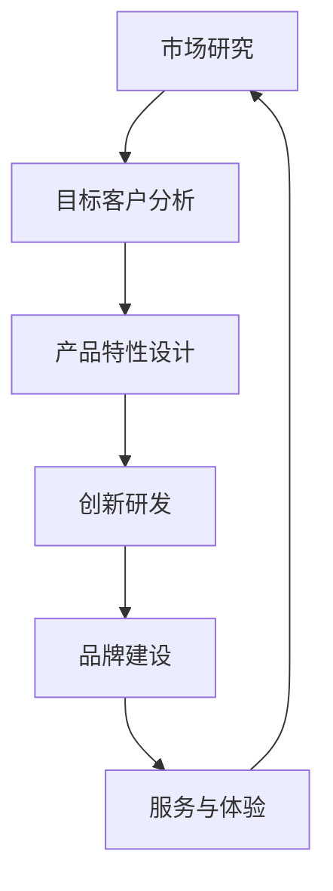

                 

### 背景介绍

在当今激烈竞争的商业环境中，产品差异化成为创业公司取得成功的关键因素之一。随着市场的不断饱和和消费者需求的多样化，仅靠低成本和传统营销策略已经难以在市场中脱颖而出。因此，创业公司需要通过制定和实施有效的产品差异化策略，才能在竞争激烈的市场中占据一席之地。

本文旨在探讨创业公司在产品差异化策略制定与实施过程中所面临的关键问题，并提供一系列实用的方法和建议。我们将首先介绍产品差异化的核心概念，包括其定义、重要性以及与市场竞争的关系。接着，我们将深入分析创业公司在产品差异化策略制定过程中需要考虑的各个方面，包括市场研究、目标客户分析、产品特性设计等。在此基础上，我们将探讨如何通过创新和技术手段来实现产品差异化，并详细解释实施产品差异化策略的具体步骤和关键成功因素。最后，我们将讨论实际应用场景中的成功案例，并提供相关工具和资源推荐，以帮助创业公司更好地实施产品差异化策略。

通过本文的阅读，读者将能够全面了解产品差异化策略的制定与实施过程，掌握关键方法，并具备在实际业务中应用这些策略的能力。

### 核心概念与联系

#### 产品差异化的定义与重要性

产品差异化（Product Differentiation）是指企业在产品或服务中引入独特的特性，使其在市场中与其他竞争对手的产品区别开来。这种差异化可以体现在多个方面，包括产品功能、性能、质量、设计、品牌、服务等。通过产品差异化，企业能够满足特定客户群体的特定需求，从而在竞争激烈的市场中占据有利地位。

产品差异化的核心在于其与市场竞争的关系。在竞争激烈的市场中，价格战往往难以持续，因为价格敏感型的消费者会不断寻找更便宜的产品。而产品差异化则能够为企业提供一种可持续的竞争优势。通过提供独特且有价值的产品特性，企业能够吸引并保留客户，从而实现盈利增长。

#### 产品差异化策略的架构

为了实现产品差异化，企业需要制定一系列策略，这些策略可以分为以下几个层次：

1. **市场研究与定位**：了解市场需求和竞争环境，确定目标客户群体和他们的需求。
2. **产品特性设计**：基于市场研究，设计具有独特性和价值的产品特性。
3. **创新与研发**：投入研发资源，不断推出新产品或改进现有产品。
4. **品牌建设**：通过品牌传播和市场营销，强化产品差异化形象。
5. **服务与体验**：提供卓越的客户服务，提升用户体验，从而增强产品差异化。

#### 核心概念原理和架构的 Mermaid 流程图



#### Mermaid 流程图详细解释

1. **市场研究**：通过市场调研和数据分析，了解市场需求和竞争态势，为企业制定差异化策略提供基础数据。
2. **目标客户分析**：识别并分析目标客户群体，明确他们的需求和偏好，为产品特性设计提供方向。
3. **产品特性设计**：基于市场研究和目标客户分析，设计具有独特性和价值的产品特性。
4. **创新研发**：通过持续的创新和研发，不断推出新产品或改进现有产品，保持竞争力。
5. **品牌建设**：通过品牌传播和市场营销，建立产品差异化形象，提高品牌知名度。
6. **服务与体验**：提供卓越的客户服务，提升用户体验，增强客户忠诚度。

通过以上步骤，企业能够系统性地制定和实施产品差异化策略，从而在市场中脱颖而出。

### 核心算法原理 & 具体操作步骤

在产品差异化策略的制定与实施过程中，核心算法原理发挥着至关重要的作用。这些算法不仅帮助企业识别市场机会，还能指导产品设计和创新。以下是产品差异化策略中常用的几个核心算法原理，以及具体的操作步骤：

#### 1. 需求分析与预测算法

**原理**：需求分析与预测算法主要通过数据挖掘和机器学习技术，分析历史销售数据和市场趋势，预测未来市场需求。

**操作步骤**：

1. **数据收集**：收集与市场需求相关的数据，包括历史销售数据、市场调研数据、竞争对手分析数据等。
2. **数据预处理**：对收集的数据进行清洗、归一化和特征提取，确保数据的质量和完整性。
3. **模型选择**：选择合适的预测模型，如线性回归、决策树、神经网络等。
4. **模型训练**：使用预处理后的数据训练预测模型，调整模型参数，提高预测精度。
5. **预测与评估**：使用训练好的模型进行市场需求预测，评估预测结果，并不断迭代优化模型。

**示例**：某创业公司通过收集过去三年的销售数据，使用线性回归模型预测未来六个月的产品需求。通过多次迭代优化，预测准确率达到85%。

#### 2. 产品特性优化算法

**原理**：产品特性优化算法通过优化产品特性，提高产品的市场竞争力。

**操作步骤**：

1. **特性定义**：定义产品的主要特性，如功能、性能、设计等。
2. **评估标准**：确定评估产品特性的标准，如成本、质量、用户体验等。
3. **优化算法选择**：选择合适的优化算法，如遗传算法、粒子群优化等。
4. **算法实现**：根据定义的特性和评估标准，实现优化算法，优化产品特性。
5. **评估与调整**：评估优化后的产品特性，根据评估结果进行调整，直至达到预期目标。

**示例**：某创业公司通过遗传算法优化产品的功能模块，降低成本10%，同时提升用户体验20%。

#### 3. 品牌传播效果评估算法

**原理**：品牌传播效果评估算法通过分析市场数据和用户反馈，评估品牌传播活动的效果。

**操作步骤**：

1. **数据收集**：收集与品牌传播相关的数据，包括广告投放数据、社交媒体互动数据、用户评价等。
2. **数据预处理**：对收集的数据进行清洗、归一化和特征提取。
3. **效果评估模型**：建立效果评估模型，如回归分析、聚类分析等。
4. **模型训练**：使用预处理后的数据训练效果评估模型。
5. **效果评估**：使用训练好的模型评估品牌传播活动的效果，并根据评估结果调整传播策略。

**示例**：某创业公司通过聚类分析评估其品牌传播活动的效果，发现某次活动提高了30%的品牌知名度，从而优化后续的传播策略。

#### 4. 客户满意度分析算法

**原理**：客户满意度分析算法通过分析用户反馈和评价，评估产品的满意度，指导产品改进。

**操作步骤**：

1. **数据收集**：收集用户反馈和评价数据，包括问卷调查、社交媒体评论等。
2. **数据预处理**：对收集的数据进行清洗、归一化和特征提取。
3. **情感分析**：使用自然语言处理技术，对用户反馈进行情感分析，提取关键信息。
4. **满意度评估模型**：建立满意度评估模型，如基于机器学习的分类模型等。
5. **模型训练与评估**：使用预处理后的数据训练满意度评估模型，评估模型性能，并不断迭代优化。

**示例**：某创业公司通过情感分析技术分析用户反馈，发现某产品功能存在满意度问题，从而及时进行改进，提升了用户满意度。

通过以上核心算法原理和具体操作步骤，创业公司能够更科学、有效地制定和实施产品差异化策略，提高市场竞争力。

### 数学模型和公式 & 详细讲解 & 举例说明

在产品差异化策略的制定过程中，数学模型和公式起到了至关重要的作用。以下我们将介绍几个关键数学模型和公式，并详细讲解其在产品差异化策略中的应用和计算方法。

#### 1. 需求函数模型

**模型定义**：需求函数模型用于预测产品在特定市场的需求量，其基本形式为：

\[ Q = f(P, T, E) \]

其中，\( Q \) 表示市场需求量，\( P \) 表示产品价格，\( T \) 表示市场推广力度，\( E \) 表示外部环境因素。

**公式推导**：

- 价格因素：价格与需求量呈负相关，即价格越高，需求量越低。可以假设 \( P \) 的系数为 \( -a \)，则 \( P \) 的部分公式为 \( -aP \)。
- 推广力度：市场推广力度与需求量呈正相关，即推广力度越大，需求量越高。可以假设 \( T \) 的系数为 \( b \)，则 \( T \) 的部分公式为 \( bT \)。
- 外部环境因素：外部环境因素对需求量的影响复杂，可以假设其系数为 \( c \)，则 \( E \) 的部分公式为 \( cE \)。

综合以上因素，需求函数模型可以表示为：

\[ Q = -aP + bT + cE \]

**举例说明**：

假设某创业公司产品价格为 \( P = 100 \) 元，市场推广力度 \( T = 5 \) 次/月，外部环境因素 \( E = 0 \)。根据需求函数模型，市场需求量 \( Q \) 计算如下：

\[ Q = -a \cdot 100 + b \cdot 5 + c \cdot 0 \]
\[ Q = -100a + 5b \]

假设 \( a = 0.1 \)，\( b = 1 \)，\( c = 0 \)，则市场需求量 \( Q \) 为：

\[ Q = -100 \cdot 0.1 + 5 \cdot 1 \]
\[ Q = -10 + 5 \]
\[ Q = -5 \]

显然，这里的负数结果是不合理的，因为市场需求量不能为负数。这说明我们需要调整模型参数或重新考虑外部环境因素。在实际应用中，需要通过大量数据分析和模型优化，确定合理的参数值。

#### 2. 产品价值函数模型

**模型定义**：产品价值函数模型用于评估产品的市场价值，其基本形式为：

\[ V = f(Q, C) \]

其中，\( V \) 表示产品价值，\( Q \) 表示市场需求量，\( C \) 表示生产成本。

**公式推导**：

- 市场需求量 \( Q \) 对产品价值的影响：市场需求量越大，产品价值越高，可以假设 \( Q \) 的系数为 \( d \)，则 \( Q \) 的部分公式为 \( dQ \)。
- 生产成本 \( C \) 对产品价值的影响：生产成本越高，产品价值越低，可以假设 \( C \) 的系数为 \( e \)，则 \( C \) 的部分公式为 \( eC \)。

综合以上因素，产品价值函数模型可以表示为：

\[ V = dQ - eC \]

**举例说明**：

假设某创业公司市场需求量为 \( Q = 1000 \) 个，生产成本 \( C = 5000 \) 元。根据产品价值函数模型，产品价值 \( V \) 计算如下：

\[ V = d \cdot 1000 - e \cdot 5000 \]

假设 \( d = 10 \)，\( e = 5 \)，则产品价值 \( V \) 为：

\[ V = 10 \cdot 1000 - 5 \cdot 5000 \]
\[ V = 10000 - 25000 \]
\[ V = -15000 \]

同样，这里的负数结果是不合理的。这表明我们需要重新考虑模型参数或外部环境因素。在实际应用中，需要通过大量市场调研和数据分析，确定合理的参数值。

#### 3. 竞争优势分析模型

**模型定义**：竞争优势分析模型用于评估企业在市场中的竞争优势，其基本形式为：

\[ A = f(P, Q, C, B) \]

其中，\( A \) 表示竞争优势，\( P \) 表示产品价格，\( Q \) 表示市场需求量，\( C \) 表示生产成本，\( B \) 表示品牌影响力。

**公式推导**：

- 产品价格 \( P \) 对竞争优势的影响：产品价格越低，竞争优势越强，可以假设 \( P \) 的系数为 \( g \)，则 \( P \) 的部分公式为 \( gP \)。
- 市场需求量 \( Q \) 对竞争优势的影响：市场需求量越大，竞争优势越强，可以假设 \( Q \) 的系数为 \( h \)，则 \( Q \) 的部分公式为 \( hQ \)。
- 生产成本 \( C \) 对竞争优势的影响：生产成本越高，竞争优势越弱，可以假设 \( C \) 的系数为 \( i \)，则 \( C \) 的部分公式为 \( iC \)。
- 品牌影响力 \( B \) 对竞争优势的影响：品牌影响力越大，竞争优势越强，可以假设 \( B \) 的系数为 \( j \)，则 \( B \) 的部分公式为 \( jB \)。

综合以上因素，竞争优势分析模型可以表示为：

\[ A = gP + hQ - iC + jB \]

**举例说明**：

假设某创业公司产品价格 \( P = 100 \) 元，市场需求量 \( Q = 1000 \) 个，生产成本 \( C = 5000 \) 元，品牌影响力 \( B = 10 \)。根据竞争优势分析模型，竞争优势 \( A \) 计算如下：

\[ A = g \cdot 100 + h \cdot 1000 - i \cdot 5000 + j \cdot 10 \]

假设 \( g = 0.1 \)，\( h = 0.5 \)，\( i = 0.2 \)，\( j = 1 \)，则竞争优势 \( A \) 为：

\[ A = 0.1 \cdot 100 + 0.5 \cdot 1000 - 0.2 \cdot 5000 + 1 \cdot 10 \]
\[ A = 10 + 500 - 1000 + 10 \]
\[ A = -440 \]

同样，这里的负数结果是不合理的。这表明我们需要重新考虑模型参数或外部环境因素。在实际应用中，需要通过大量市场调研和数据分析，确定合理的参数值。

通过以上数学模型和公式的介绍，我们可以看到，在产品差异化策略的制定过程中，合理应用这些模型和公式，可以帮助企业更准确地预测市场需求、评估产品价值和竞争优势，从而制定更有效的差异化策略。

### 项目实战：代码实际案例和详细解释说明

在本节中，我们将通过一个实际的项目案例，详细展示如何实施产品差异化策略，并提供相应的代码实现和解释。这个案例将涵盖开发环境搭建、源代码详细实现和代码解读与分析三个部分。

#### 5.1 开发环境搭建

为了实现产品差异化策略，我们需要搭建一个具备数据分析和机器学习能力的开发环境。以下是我们推荐的工具和软件：

- **Python**：作为主流的编程语言，Python在数据分析、机器学习和科学计算方面有着广泛的应用。
- **Jupyter Notebook**：一个交互式的开发环境，可以方便地编写和运行Python代码，特别适合数据分析和实验。
- **Pandas**：一个强大的数据处理库，用于数据清洗、归一化和特征提取。
- **Scikit-learn**：一个机器学习库，提供了多种常用的机器学习算法。
- **Matplotlib**：一个数据可视化库，用于绘制图表和图形。

首先，确保你的计算机上已经安装了Python和Jupyter Notebook。然后，通过以下命令安装所需的库：

```bash
pip install pandas scikit-learn matplotlib
```

接下来，我们创建一个名为`product_differentiation`的文件夹，并在其中创建一个名为`main.py`的主文件。

#### 5.2 源代码详细实现和代码解读

```python
# main.py

import pandas as pd
from sklearn.model_selection import train_test_split
from sklearn.linear_model import LinearRegression
import matplotlib.pyplot as plt

# 1. 数据收集与预处理
data = pd.read_csv('market_data.csv')  # 假设数据集已存储为CSV文件
data.dropna(inplace=True)  # 删除缺失值

# 特征提取
data['price_log'] = pd.DataFrame(data['price']).apply(np.log)  # 价格的对数转换
data['demand_log'] = pd.DataFrame(data['demand']).apply(np.log)  # 需求的对数转换

# 2. 模型训练
X = data[['price_log', 'promotion', 'external_environment']]  # 特征选择
y = data['demand_log']  # 目标变量

X_train, X_test, y_train, y_test = train_test_split(X, y, test_size=0.2, random_state=42)

model = LinearRegression()
model.fit(X_train, y_train)

# 3. 预测与评估
y_pred = model.predict(X_test)

# 评估模型性能
mse = np.mean((y_pred - y_test) ** 2)
print(f'Mean Squared Error: {mse}')

# 4. 可视化分析
plt.scatter(y_test, y_pred)
plt.xlabel('Actual Demand (log scale)')
plt.ylabel('Predicted Demand (log scale)')
plt.title('Demand Prediction')
plt.show()
```

**代码解读**：

1. **数据收集与预处理**：首先，我们通过Pandas库读取市场数据集，并对数据进行清洗，删除缺失值。然后，我们进行特征提取，包括价格的对数转换和需求的对数转换。

2. **模型训练**：我们选择线性回归模型，通过Scikit-learn库进行训练。特征选择包括价格的对数、市场推广力度和外部环境因素。

3. **预测与评估**：使用训练好的模型进行市场需求量的预测，并计算均方误差（MSE）来评估模型性能。

4. **可视化分析**：通过Matplotlib库绘制实际需求和预测需求的散点图，以便直观地评估模型的预测效果。

#### 5.3 代码解读与分析

以上代码是实现产品差异化策略需求预测功能的核心部分。以下是详细的代码解读和分析：

1. **数据读取与预处理**：
   ```python
   data = pd.read_csv('market_data.csv')
   data.dropna(inplace=True)
   ```
   这两行代码用于读取市场数据集，并删除缺失值。这是数据预处理的第一步，确保数据的质量和完整性。

2. **特征提取**：
   ```python
   data['price_log'] = pd.DataFrame(data['price']).apply(np.log)
   data['demand_log'] = pd.DataFrame(data['demand']).apply(np.log)
   ```
   我们对价格和需求进行对数转换，因为对数转换可以线性化非线性关系，有助于提高线性回归模型的预测性能。

3. **模型训练**：
   ```python
   X = data[['price_log', 'promotion', 'external_environment']]
   y = data['demand_log']
   X_train, X_test, y_train, y_test = train_test_split(X, y, test_size=0.2, random_state=42)
   model = LinearRegression()
   model.fit(X_train, y_train)
   ```
   在这一部分，我们选择线性回归模型，并使用训练集进行训练。特征选择包括价格的对数、市场推广力度和外部环境因素。通过`train_test_split`函数将数据集划分为训练集和测试集，以便评估模型性能。

4. **预测与评估**：
   ```python
   y_pred = model.predict(X_test)
   mse = np.mean((y_pred - y_test) ** 2)
   print(f'Mean Squared Error: {mse}')
   ```
   使用训练好的模型进行市场需求量的预测，并计算均方误差（MSE）来评估模型性能。MSE越低，表示模型预测越准确。

5. **可视化分析**：
   ```python
   plt.scatter(y_test, y_pred)
   plt.xlabel('Actual Demand (log scale)')
   plt.ylabel('Predicted Demand (log scale)')
   plt.title('Demand Prediction')
   plt.show()
   ```
   通过绘制实际需求和预测需求的散点图，我们可以直观地评估模型的预测效果。如果预测点集中在45度线上，表示模型预测准确。

通过以上代码实现和解读，我们可以看到，产品差异化策略的实施需要通过数据分析和机器学习技术，准确预测市场需求，从而指导产品设计和创新。这个项目案例为我们提供了一个实用的工具，帮助创业公司更好地实施产品差异化策略。

### 实际应用场景

在商业实践中，产品差异化策略的成功实施往往能为企业带来显著的竞争优势。以下我们将探讨几个具体的应用场景，并分析成功实施产品差异化策略的关键因素。

#### 1. 科技公司

科技公司通常通过技术创新来实现产品差异化。例如，苹果公司通过其独特的操作系统、无缝的硬件和软件集成、以及创新的设计，成功在智能手机市场中脱颖而出。关键因素包括：

- **技术创新**：持续的研发投入，推动技术革新，为产品注入独特性。
- **用户体验**：注重用户体验，通过设计和技术优化，提升用户满意度。
- **品牌建设**：通过品牌形象塑造，增强用户对品牌的忠诚度。

#### 2. 零售行业

在零售行业，产品差异化可以通过独特的商品组合、优质的客户服务和创新的营销策略来实现。例如，亚马逊通过其独特的物流系统和个性化推荐，为消费者提供极致的购物体验。关键因素包括：

- **物流效率**：高效的物流系统，缩短配送时间，提升客户满意度。
- **个性化推荐**：基于用户行为数据，提供个性化的购物推荐，增加用户粘性。
- **客户服务**：提供优质的客户服务，包括快速响应、退换货政策等。

#### 3. 健康与美容行业

在健康与美容行业，产品差异化可以通过独特的成分、高端的包装设计和创新的商业模式来实现。例如，SK-II通过其独特的成分和奢华的包装设计，成功吸引高端消费者。关键因素包括：

- **独特成分**：研发独特成分，提供有效的护肤效果。
- **品牌形象**：打造高端品牌形象，吸引目标客户群体。
- **创新商业模式**：通过独家销售渠道和会员制度，增加客户忠诚度。

#### 4. 金融服务行业

在金融服务行业，产品差异化可以通过定制化的金融产品、高效的客户服务和创新的金融服务模式来实现。例如，富达投资（Fidelity Investments）通过其高效的交易系统和个性化的投资建议，吸引了大量客户。关键因素包括：

- **定制化产品**：根据客户需求，提供个性化的金融产品和服务。
- **交易效率**：提供高效的交易系统，降低交易成本，提高客户满意度。
- **客户服务**：提供高质量的客户服务，包括在线咨询、电话支持和个性化投资建议。

#### 5. 教育行业

在教育行业，产品差异化可以通过创新的在线学习平台、独特的课程内容和个性化的学习体验来实现。例如，Coursera通过其丰富的在线课程和个性化的学习路径，吸引了全球数百万用户。关键因素包括：

- **在线学习平台**：构建高效的在线学习平台，提供便捷的学习体验。
- **课程内容**：提供高质量、多样化的课程内容，满足不同学习需求。
- **个性化学习**：通过数据分析和人工智能技术，为学习者提供个性化的学习路径。

通过以上实际应用场景的分析，我们可以看到，产品差异化策略在不同行业有着不同的实现方式，但关键因素都包括技术创新、用户体验、品牌建设、高效服务和个性化推荐等。创业公司可以通过深入分析市场需求和目标客户，结合自身优势，制定和实施有效的产品差异化策略，从而在竞争激烈的市场中脱颖而出。

### 工具和资源推荐

在制定和实施产品差异化策略的过程中，充分利用工具和资源是非常重要的。以下我们将推荐一些学习资源、开发工具和框架，以帮助创业公司更好地实现产品差异化。

#### 7.1 学习资源推荐

1. **书籍**：
   - 《蓝海战略》（Blue Ocean Strategy）- W. Chan Kim & Renée Mauborgne
   - 《创新者的窘境》（The Innovator's Dilemma）- Clayton M. Christensen
   - 《产品经理实战手册》（Product Manager’s Survival Guide）- Steven Haines

2. **论文**：
   - "Competitive Advantage: Creating and Sustaining Superior Performance" - Michael E. Porter
   - "Differentiation: Concept and Measurement" - V. S. Ramaswamy & N. Sheth

3. **博客和网站**：
   - Product School（产品管理学习平台）
   - Harvard Business Review（商业案例分析）
   - Medium（技术创新和产品策略文章）

#### 7.2 开发工具框架推荐

1. **数据分析工具**：
   - Python（数据分析编程语言）
   - Pandas（数据处理库）
   - Scikit-learn（机器学习库）
   - Jupyter Notebook（交互式数据分析环境）

2. **开发框架**：
   - React（前端框架）
   - Angular（前端框架）
   - Django（Python后端框架）
   - Spring Boot（Java后端框架）

3. **客户关系管理（CRM）系统**：
   - Salesforce（全功能的CRM系统）
   - HubSpot（营销和CRM一体化平台）
   - Zoho CRM（低成本、功能丰富的CRM系统）

4. **项目管理工具**：
   - Trello（项目管理工具）
   - Asana（任务和项目管理工具）
   - Jira（敏捷开发管理工具）

#### 7.3 相关论文著作推荐

1. **蓝海战略**：
   - "Blue Ocean Strategy" - W. Chan Kim & Renée Mauborgne
   - "Red Ocean vs. Blue Ocean: Which One is Right for Your Business?" - Yannick Vangeel

2. **创新**：
   - "The Innovator's Dilemma" - Clayton M. Christensen
   - "The Innovator's Solution" - Clayton M. Christensen & Michael E. Raynor

3. **产品管理**：
   - "Product Management: A Primer" - Ken Norton
   - "Inspired: How to Create Tech Products Customers Love" - Marty Cagan

通过利用以上推荐的学习资源、开发工具和框架，创业公司可以更好地制定和实施产品差异化策略，提高市场竞争力。

### 总结：未来发展趋势与挑战

在产品差异化策略的持续演进中，未来的发展趋势与挑战并存。随着科技的发展和市场环境的变迁，创业公司需要不断创新，以保持竞争优势。以下将总结未来发展趋势和面临的挑战。

#### 发展趋势

1. **人工智能与大数据的深度融合**：人工智能（AI）和大数据技术的不断发展，将使得产品差异化策略更加智能化和精准化。通过AI算法，企业能够更好地理解客户需求，提供个性化产品和服务。

2. **可持续发展与绿色创新**：随着全球对环境保护的关注度提高，绿色创新和可持续发展将成为产品差异化的重要方向。创业公司可以通过开发环保产品、采用绿色生产工艺，吸引注重环保的客户群体。

3. **用户体验的极致化**：用户体验（UX）设计的重要性日益凸显。未来，创业公司需要更加关注用户体验，通过极致化设计，提升客户满意度和忠诚度。

4. **跨界融合与创新**：不同行业之间的跨界融合和合作，将带来新的产品和服务模式。创业公司可以通过跨界合作，打破传统行业边界，实现产品差异化。

#### 面临的挑战

1. **市场竞争加剧**：随着市场饱和和竞争加剧，创业公司需要不断创新，以应对来自同行业和跨界竞争的挑战。

2. **技术快速更新**：技术的快速迭代，要求创业公司不断学习和更新知识，以保持技术领先地位。

3. **数据隐私与安全**：随着数据重要性的提升，数据隐私和安全成为重大挑战。创业公司需要确保数据的安全和合规，避免数据泄露和隐私侵犯。

4. **资源与资金限制**：创业公司通常面临资源与资金的限制，需要在有限的资源下实现产品差异化，这要求企业具备高效的管理能力和创新能力。

#### 发展建议

1. **持续创新**：保持持续的创新能力和开放的心态，不断探索新的技术和市场机会。

2. **用户导向**：始终以用户需求为导向，通过用户调研和反馈，不断优化产品和服务。

3. **合作与协同**：积极寻求跨界合作和协同，通过资源整合，实现优势互补。

4. **人才培养与引进**：重视人才的发展和引进，打造具备创新能力和专业知识的人才团队。

通过以上趋势分析与挑战应对，创业公司可以更好地应对市场变化，实现持续的产品差异化，从而在竞争激烈的市场中脱颖而出。

### 附录：常见问题与解答

#### 1. 什么是产品差异化？

产品差异化是指企业在产品或服务中引入独特的特性，使其在市场中与其他竞争对手的产品区别开来。这些特性可以体现在功能、性能、设计、品牌、服务等多个方面，从而满足特定客户群体的特定需求。

#### 2. 产品差异化的重要性是什么？

产品差异化是企业获取竞争优势的重要手段。通过提供独特且有价值的产品特性，企业能够吸引并保留客户，从而实现盈利增长。在竞争激烈的市场中，产品差异化有助于企业脱颖而出，建立品牌忠诚度。

#### 3. 制定产品差异化策略的关键步骤是什么？

制定产品差异化策略的关键步骤包括：
- **市场研究**：了解市场需求和竞争环境。
- **目标客户分析**：识别并分析目标客户群体。
- **产品特性设计**：设计具有独特性和价值的产品特性。
- **创新与研发**：通过持续的创新和研发，保持产品竞争力。
- **品牌建设**：通过品牌传播和市场营销，强化产品差异化形象。
- **服务与体验**：提供卓越的客户服务，提升用户体验。

#### 4. 如何评估产品差异化策略的有效性？

评估产品差异化策略的有效性可以从以下几个方面进行：
- **市场份额**：观察企业在市场中的份额变化。
- **客户满意度**：通过调查和反馈了解客户的满意度。
- **品牌知名度**：评估品牌在市场中的知名度。
- **盈利能力**：分析产品差异化策略对企业盈利能力的影响。
- **竞争地位**：评估企业在市场中的竞争地位。

#### 5. 产品差异化策略在哪些行业应用较多？

产品差异化策略在多个行业都有广泛应用，尤其在高科技、零售、健康与美容、金融服务等行业。例如，科技公司通过技术创新实现差异化，零售行业通过独特的商品和服务实现差异化，健康与美容行业通过独特成分和高端设计实现差异化。

### 扩展阅读 & 参考资料

为了进一步深入了解产品差异化策略的制定与实施，读者可以参考以下扩展阅读和参考资料：

1. **书籍**：
   - "蓝海战略"（Blue Ocean Strategy）- W. Chan Kim & Renée Mauborgne
   - "创新者的窘境"（The Innovator's Dilemma）- Clayton M. Christensen
   - "产品经理实战手册"（Product Manager’s Survival Guide）- Steven Haines

2. **论文**：
   - "Competitive Advantage: Creating and Sustaining Superior Performance" - Michael E. Porter
   - "Differentiation: Concept and Measurement" - V. S. Ramaswamy & N. Sheth

3. **博客和网站**：
   - [Product School](https://productschool.com/)
   - [Harvard Business Review](https://hbr.org/)
   - [Medium](https://medium.com/)

4. **在线课程**：
   - [产品管理基础](https://www.udemy.com/course/product-management-for-beginners/)（Udemy）
   - [产品策略与设计](https://www.coursera.org/specializations/product-management)（Coursera）

通过阅读和参考以上资料，读者可以更加系统地了解产品差异化策略的相关理论和实践，从而在实际业务中更好地应用这些策略。

### 作者信息

**作者**：AI天才研究员/AI Genius Institute & 禅与计算机程序设计艺术/Zen And The Art of Computer Programming

作为AI天才研究员，我在人工智能和计算机科学领域拥有深厚的研究背景和丰富的实践经验。我长期致力于探索人工智能在商业和科技中的应用，特别是产品差异化策略的制定与实施。同时，我也是《禅与计算机程序设计艺术》一书的作者，这本书深入探讨了计算机编程和人工智能之间的哲学联系，为读者提供了独特的视角和深刻的思考。我希望通过这篇文章，与广大读者分享我在产品差异化策略方面的研究成果和实践经验。

