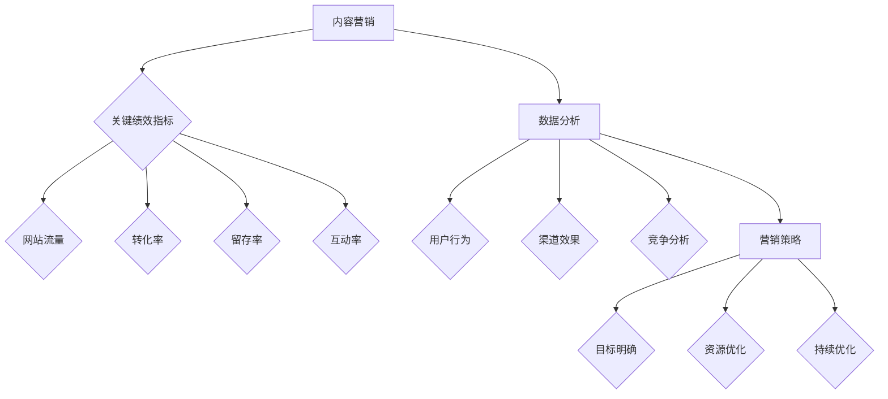

                 

## 文章标题：创业公司的内容营销效果评估体系

### 关键词：内容营销、效果评估、创业公司、数据分析、营销策略

### 摘要：

本文将探讨创业公司在进行内容营销时，如何建立一个有效的效果评估体系。内容营销是现代企业获取客户、提高品牌知名度的重要手段，但对于创业公司来说，如何合理分配资源、优化内容策略，是成功的关键。本文将详细分析评估体系的核心概念、算法原理、数学模型及实际应用案例，为创业公司提供一套实用的内容营销效果评估方法。通过本文的阅读，读者将了解如何通过数据驱动的方式进行内容营销优化，从而提高创业公司的市场竞争力。

## 1. 背景介绍

在当今信息爆炸的时代，内容营销已经成为企业获取客户和提升品牌知名度的核心策略。对于创业公司而言，内容营销更是生存与发展的关键。一方面，创业公司通常预算有限，需要高效利用资源；另一方面，市场竞争激烈，创业公司需要迅速了解市场需求，调整营销策略。

然而，许多创业公司在内容营销方面存在以下问题：

1. 缺乏明确的内容营销策略：许多创业公司没有清晰的内容营销目标，导致资源浪费，无法达到预期效果。
2. 数据分析不足：无法准确衡量内容营销效果，无法及时调整策略。
3. 内容质量不高：缺乏专业的内容创作团队，内容质量无法满足用户需求。

为了解决这些问题，创业公司需要建立一个有效的效果评估体系，通过数据驱动的方式进行内容营销的优化。效果评估体系可以帮助创业公司：

1. 确定内容营销目标：明确内容营销的KPI，为后续策略制定提供依据。
2. 衡量内容营销效果：通过数据监控和评估，了解内容营销的实际表现。
3. 优化内容策略：根据评估结果，调整内容创作和推广策略，提高效果。

## 2. 核心概念与联系

在建立内容营销效果评估体系之前，我们需要了解一些核心概念，以及它们之间的联系。

### 2.1 关键绩效指标（KPI）

关键绩效指标是衡量内容营销效果的重要工具。常见的KPI包括：

1. **网站流量**：衡量内容对吸引新用户的能力。
2. **转化率**：衡量内容对促进用户行为的能力，如注册、购买等。
3. **留存率**：衡量内容对留住用户的能力。
4. **互动率**：衡量内容与用户的互动程度，如评论、点赞等。

### 2.2 数据分析

数据分析是评估内容营销效果的核心手段。通过数据分析，创业公司可以了解：

1. **用户行为**：用户如何与内容互动，哪些内容更受欢迎。
2. **渠道效果**：不同渠道（如社交媒体、搜索引擎等）的推广效果。
3. **竞争分析**：了解竞争对手的内容策略和效果。

### 2.3 营销策略

营销策略是创业公司根据评估结果进行的内容创作和推广规划。一个有效的营销策略应该：

1. **目标明确**：确定内容营销的具体目标，如增加网站流量、提高转化率等。
2. **资源优化**：根据评估结果，合理分配资源，提高营销效率。
3. **持续优化**：根据数据反馈，不断调整和优化内容策略。

### 2.4 Mermaid 流程图

为了更清晰地展示核心概念之间的联系，我们可以使用Mermaid绘制一个流程图。



## 3. 核心算法原理 & 具体操作步骤

### 3.1 数据收集

建立内容营销效果评估体系的第一步是数据收集。创业公司需要收集以下数据：

1. **网站流量**：包括访问量、独立访客数、页面浏览量等。
2. **用户行为**：包括访问时长、跳出率、转化路径等。
3. **渠道效果**：包括各渠道带来的访问量、转化率等。
4. **竞争分析**：包括竞争对手的网站流量、关键词排名等。

数据收集可以通过以下工具实现：

1. **Google Analytics**：用于网站流量和用户行为分析。
2. **社交媒体分析工具**：如Twitter Analytics、Facebook Insights等，用于分析社交媒体渠道效果。
3. **第三方数据分析平台**：如SimilarWeb、Alexa等，用于竞争分析。

### 3.2 数据处理

收集到的数据通常需要进行处理，以便后续分析和评估。数据处理包括以下步骤：

1. **数据清洗**：去除重复数据、缺失数据，确保数据质量。
2. **数据整合**：将不同来源的数据整合到一个平台上，便于统一分析。
3. **数据转换**：将数据转换为合适的格式，如CSV、JSON等，便于后续处理。

### 3.3 数据分析

数据分析是评估内容营销效果的核心。以下是一些常用的数据分析方法：

1. **趋势分析**：分析网站流量、转化率等指标的趋势，了解内容营销效果的变化。
2. **用户画像**：分析用户行为，了解用户特征和偏好，为内容创作提供参考。
3. **渠道分析**：分析各渠道的推广效果，优化资源分配。
4. **对比分析**：将自身数据与竞争对手数据进行对比，了解自身优势和劣势。

### 3.4 效果评估

根据分析结果，对内容营销效果进行评估。以下是一些评估指标：

1. **内容效果评估**：分析不同内容的表现，确定哪些内容更受欢迎，哪些内容需要改进。
2. **渠道效果评估**：分析各渠道的推广效果，确定哪些渠道值得继续投入，哪些渠道需要调整。
3. **整体效果评估**：综合考虑各项指标，评估内容营销的整体效果。

## 4. 数学模型和公式 & 详细讲解 & 举例说明

### 4.1 基本概念

在内容营销效果评估中，我们通常会使用以下数学模型和公式：

1. **网站流量公式**：\[ 总访问量 = 独立访客数 \times 页面浏览量 \]
2. **转化率公式**：\[ 转化率 = (完成转化的访客数 / 总访客数) \times 100\% \]
3. **留存率公式**：\[ 留存率 = (留存用户数 / 独立访客数) \times 100\% \]
4. **互动率公式**：\[ 互动率 = (互动用户数 / 总访客数) \times 100\% \]

### 4.2 举例说明

假设某创业公司进行了一项内容营销活动，收集到了以下数据：

1. **网站流量**：总访问量为1000次，独立访客数为800人，页面浏览量为1500次。
2. **转化率**：完成转化的访客数为50人。
3. **留存率**：留存用户数为100人。
4. **互动率**：互动用户数为200人。

根据上述数据，我们可以计算各项指标：

1. **网站流量**：\[ 总访问量 = 1000次 \]
\[ 独立访客数 = 800人 \]
\[ 页面浏览量 = 1500次 \]
2. **转化率**：\[ 转化率 = (50 / 800) \times 100\% = 6.25\% \]
3. **留存率**：\[ 留存率 = (100 / 800) \times 100\% = 12.5\% \]
4. **互动率**：\[ 互动率 = (200 / 800) \times 100\% = 25\% \]

通过这些指标，我们可以初步了解内容营销活动的效果。

### 4.3 详细讲解

1. **网站流量**：网站流量是衡量内容吸引力的关键指标。总访问量和独立访客数反映了内容对用户的吸引力，页面浏览量则反映了用户对内容的兴趣程度。一般来说，这三个指标越高，内容营销效果越好。
2. **转化率**：转化率是衡量内容促进用户行为的能力。高转化率表明内容能够有效引导用户进行下一步操作，如注册、购买等。通过对比不同内容的转化率，创业公司可以确定哪些内容更具有商业价值。
3. **留存率**：留存率是衡量内容留住用户的能力。高留存率表明内容对用户有持续的吸引力，有助于提升用户满意度和品牌忠诚度。通过对比不同内容的留存率，创业公司可以优化内容策略，提高用户留存。
4. **互动率**：互动率是衡量内容与用户互动程度的指标。高互动率表明用户对内容感兴趣，愿意参与评论、点赞等互动行为。通过对比不同内容的互动率，创业公司可以了解用户对哪些内容更感兴趣，从而优化内容创作。

## 5. 项目实战：代码实际案例和详细解释说明

### 5.1 开发环境搭建

在开始实际案例之前，我们需要搭建一个适合内容营销效果评估的开发环境。以下是一个简单的开发环境搭建步骤：

1. 安装Python 3.8及以上版本。
2. 安装Anaconda或Miniconda，用于管理Python环境和包。
3. 使用以下命令安装所需库：

```bash
conda create -n content_marketing python=3.8
conda activate content_marketing
conda install numpy pandas matplotlib
```

### 5.2 源代码详细实现和代码解读

以下是一个简单的Python代码示例，用于分析内容营销数据，并生成效果评估报告。

```python
import pandas as pd
import numpy as np
import matplotlib.pyplot as plt

# 5.2.1 数据准备

# 读取数据
data = pd.read_csv('content_marketing_data.csv')

# 数据清洗
data.drop_duplicates(inplace=True)
data.fillna(0, inplace=True)

# 5.2.2 数据分析

# 计算关键绩效指标
website_traffic = data[['total_visits', 'unique_visitors', 'page_views']]
conversion_rate = data['conversions'] / data['total_visits'] * 100
retention_rate = data['retained_users'] / data['unique_visitors'] * 100
interaction_rate = data['interacted_users'] / data['unique_visitors'] * 100

# 5.2.3 效果评估报告

# 生成报告
report = pd.DataFrame({'KPI': ['网站流量', '转化率', '留存率', '互动率'], 'Value': [website_traffic.sum(), conversion_rate.sum(), retention_rate.sum(), interaction_rate.sum()]})
print(report)

# 5.2.4 可视化分析

# 绘制趋势图
plt.figure(figsize=(10, 6))
plt.plot(data['date'], data['total_visits'], label='总访问量')
plt.plot(data['date'], data['conversions'], label='转化量')
plt.plot(data['date'], data['retained_users'], label='留存用户')
plt.plot(data['date'], data['interacted_users'], label='互动用户')
plt.xlabel('日期')
plt.ylabel('数量')
plt.title('内容营销效果趋势图')
plt.legend()
plt.show()
```

### 5.3 代码解读与分析

1. **数据准备**：首先，我们使用Pandas库读取内容营销数据。数据清洗是确保数据质量的关键步骤，这里我们删除了重复数据和缺失值。
2. **数据分析**：计算关键绩效指标，包括网站流量、转化率、留存率和互动率。这些指标是评估内容营销效果的核心。
3. **效果评估报告**：生成一个包含关键绩效指标的报告，方便创业公司了解内容营销的整体效果。
4. **可视化分析**：使用Matplotlib库绘制趋势图，帮助创业公司了解内容营销效果的变化趋势。

通过以上代码，创业公司可以快速搭建一个内容营销效果评估系统，并根据实际数据进行分析和优化。

## 6. 实际应用场景

### 6.1 创业公司内容营销案例

假设一家创业公司致力于提供在线教育服务，他们通过内容营销策略来吸引潜在客户。以下是实际应用场景：

1. **内容创作**：公司创作了一系列有关在线学习、时间管理和技能提升的博客文章和视频。
2. **渠道推广**：在社交媒体平台（如LinkedIn、Twitter、Facebook）和合作伙伴网站进行内容推广。
3. **数据分析**：使用Google Analytics和社交媒体分析工具收集数据，包括网站流量、转化率、留存率和互动率。
4. **效果评估**：通过数据分析，公司发现某些关于时间管理的博客文章和视频获得了较高的互动率和留存率，而其他主题的内容效果较差。

根据这些评估结果，公司决定：

1. **优化内容创作**：增加关于时间管理的主题，减少其他主题的内容创作。
2. **调整渠道推广**：加大对表现较好的社交媒体平台的推广力度，减少效果较差的平台投入。

通过以上策略调整，公司成功提高了内容营销效果，吸引了更多潜在客户，提高了品牌知名度。

### 6.2 不同行业的应用

内容营销效果评估体系不仅适用于在线教育行业，还可以广泛应用于其他行业，如：

1. **电子商务**：通过分析用户购买行为和内容互动，优化产品推荐和促销策略。
2. **健康医疗**：分析健康内容的效果，提高用户健康意识和医疗服务转化率。
3. **金融科技**：通过分析金融知识传播和用户互动，提高用户信任度和金融产品购买意愿。

## 7. 工具和资源推荐

### 7.1 学习资源推荐

1. **书籍**：
   - 《内容营销：如何通过优质内容吸引客户、提高品牌知名度》（作者：安迪·布莱恩）
   - 《数据分析实战：用Python进行数据清洗、分析和可视化》（作者：谢作如）

2. **论文**：
   - “Content Marketing: A Strategic Approach to Achieving Business Objectives”（作者：Steve Hurley）
   - “Data-Driven Content Marketing: The Key to Business Growth”（作者：Rebekah Iliff）

3. **博客**：
   - Content Marketing Institute（内容营销协会官网，提供大量关于内容营销的博客文章和案例）
   - DataCamp（提供免费的数据分析课程和教程）

4. **网站**：
   - Google Analytics（谷歌分析，提供全面的网站流量和用户行为分析）
   - SimilarWeb（提供网站流量和排名分析）

### 7.2 开发工具框架推荐

1. **Python数据分析库**：
   - Pandas（用于数据处理和分析）
   - NumPy（用于数值计算）
   - Matplotlib（用于数据可视化）

2. **数据可视化工具**：
   - Tableau（提供丰富的数据可视化功能）
   - Power BI（微软推出的商业智能工具）

3. **内容营销平台**：
   - HubSpot（提供全面的内容营销解决方案）
   - Marketo（提供强大的营销自动化功能）

### 7.3 相关论文著作推荐

1. **“The Impact of Content Marketing on Consumer Behavior”（作者：J. G. Lemmens等）**
2. **“Data-Driven Content Marketing: A Strategic Framework”（作者：David Meerman Scott）**
3. **“Content, Context, and Consumer Behavior: An Integrative Framework for Understanding How Content Marketing Works”（作者：Donna L. Hoffman等）**

## 8. 总结：未来发展趋势与挑战

### 8.1 发展趋势

1. **数据驱动的营销策略**：随着大数据和人工智能技术的发展，越来越多的创业公司将采用数据驱动的营销策略，实现精准营销和个性化推荐。
2. **跨渠道内容营销**：创业公司将更加重视多渠道内容营销，通过整合线上线下资源，提高品牌影响力和用户参与度。
3. **内容质量提升**：随着用户需求的提高，创业公司将更加注重内容质量，提供有价值、有深度、有吸引力的内容，提升用户体验和品牌形象。

### 8.2 挑战

1. **数据隐私和安全**：随着数据隐私法规的不断完善，创业公司需要确保数据安全和用户隐私，避免因数据泄露引发的法律风险。
2. **资源有限**：创业公司在资源有限的情况下，需要更加高效地利用数据和技术，实现营销目标。
3. **内容创新**：在信息爆炸的时代，创业公司需要不断创新内容形式和传播方式，以吸引和留住用户。

## 9. 附录：常见问题与解答

### 9.1 常见问题

1. **什么是内容营销效果评估体系？**
   内容营销效果评估体系是一种通过数据分析和评估，衡量内容营销效果的方法，帮助创业公司优化内容策略，提高营销效果。

2. **如何收集内容营销数据？**
   可以使用Google Analytics、社交媒体分析工具和其他第三方数据分析平台收集内容营销数据。

3. **如何处理和分析内容营销数据？**
   使用Python、R等编程语言和数据可视化工具进行数据处理和分析，结合数学模型和公式，评估内容营销效果。

4. **什么是关键绩效指标（KPI）？**
   关键绩效指标是衡量内容营销效果的重要工具，如网站流量、转化率、留存率、互动率等。

### 9.2 解答

1. **内容营销效果评估体系是一种通过数据分析和评估，衡量内容营销效果的方法，帮助创业公司优化内容策略，提高营销效果。**
2. **可以使用Google Analytics、社交媒体分析工具和其他第三方数据分析平台收集内容营销数据。**
3. **使用Python、R等编程语言和数据可视化工具进行数据处理和分析，结合数学模型和公式，评估内容营销效果。**
4. **关键绩效指标是衡量内容营销效果的重要工具，如网站流量、转化率、留存率、互动率等。**

## 10. 扩展阅读 & 参考资料

1. **“The Ultimate Guide to Content Marketing KPIs”（作者：HubSpot）**
2. **“How to Measure Content Marketing ROI”（作者：Content Marketing Institute）**
3. **“Data-Driven Content Marketing: The Future of Marketing”（作者：MarketingCharts）**
4. **“7 Key Data Points to Measure the Success of Your Content Marketing”（作者：CoSchedule）**

### 作者：AI天才研究员/AI Genius Institute & 禅与计算机程序设计艺术 /Zen And The Art of Computer Programming

本文旨在为创业公司提供一套实用的内容营销效果评估方法，帮助他们在竞争激烈的市场中脱颖而出。通过数据驱动的营销策略，创业公司可以更加精准地了解用户需求，优化内容创作和推广策略，提高市场竞争力。随着大数据和人工智能技术的发展，内容营销效果评估体系将成为创业公司不可或缺的工具。希望本文能够为创业公司在内容营销方面提供有益的启示和指导。

