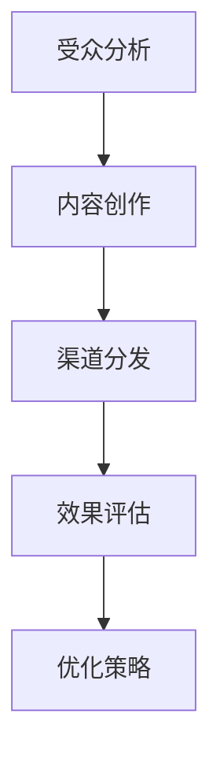
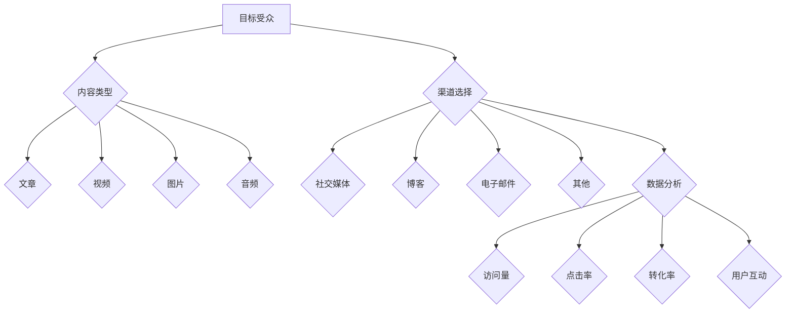

                 

### 背景介绍

**创业公司的内容营销矩阵**

在当今数字化的商业环境中，内容营销已成为企业竞争的利器。对于创业公司而言，高效的、结构化的内容营销矩阵不仅能提升品牌知名度，还能带来实际的销售转化。本文将深入探讨创业公司在构建内容营销矩阵时所需考虑的核心要素，提供实用的策略和工具，助力企业在激烈的市场竞争中脱颖而出。

**关键词：**
- 创业公司
- 内容营销
- 营销矩阵
- 品牌建设
- 销售转化

**摘要：**
本文首先介绍了内容营销在创业公司中的重要性，接着详细讨论了构建内容营销矩阵所需考虑的核心要素，包括目标受众分析、内容策略制定、营销渠道选择和数据分析。随后，文章通过实际案例和工具推荐，为创业公司提供了实用的指导，最后总结了未来内容营销的发展趋势与挑战。

<markdown>
# 创业公司的内容营销矩阵

在当今数字化的商业环境中，内容营销已成为企业竞争的利器。对于创业公司而言，高效的、结构化的内容营销矩阵不仅能提升品牌知名度，还能带来实际的销售转化。本文将深入探讨创业公司在构建内容营销矩阵时所需考虑的核心要素，提供实用的策略和工具，助力企业在激烈的市场竞争中脱颖而出。

## 1. 背景介绍

内容营销是一种通过创造和分发有价值的内容来吸引潜在客户、建立品牌信任和促进销售转化的营销策略。随着互联网的普及和社交媒体的兴起，内容营销在商业中的应用日益广泛。对创业公司来说，内容营销不仅是一种营销手段，更是构建品牌、获取用户和推动业务增长的关键。

### 内容营销的重要性

1. **提升品牌知名度**：通过创造高质量的内容，创业公司能够吸引潜在客户，提高品牌曝光率。
2. **建立信任和权威**：有价值的内容有助于建立品牌的专业形象，增强用户对品牌的信任。
3. **促进销售转化**：内容营销能够引导用户从了解、兴趣到购买的过程，实现销售转化。

### 内容营销矩阵的构建

内容营销矩阵是一个系统化的框架，用于规划、执行和评估内容营销活动。构建内容营销矩阵需要考虑以下核心要素：

1. **目标受众分析**：明确目标受众，了解他们的需求和兴趣，从而制定针对性的内容策略。
2. **内容策略制定**：基于目标受众，制定符合品牌形象和营销目标的内容策略。
3. **营销渠道选择**：选择合适的营销渠道，如社交媒体、博客、电子邮件等，确保内容能够触达到目标受众。
4. **数据分析与优化**：通过数据分析，评估内容营销的效果，不断优化策略以提高转化率。

### 创业公司的内容营销矩阵

对于创业公司，构建内容营销矩阵时需注意以下几点：

1. **聚焦核心价值**：创业公司的资源有限，应聚焦于最核心的价值点，确保内容的高质量。
2. **多渠道整合**：利用多种渠道分发内容，扩大品牌影响力。
3. **灵活调整**：根据市场反馈和数据分析，及时调整内容营销策略。

## 2. 核心概念与联系

### 内容营销矩阵的核心概念

1. **目标受众**：明确的目标受众是内容营销的基础。
2. **内容类型**：包括文章、视频、图片、音频等多种形式。
3. **渠道选择**：选择适合的渠道，如社交媒体、博客、电子邮件等。
4. **数据监测**：通过数据分析，了解内容的表现和用户反馈。

### 内容营销矩阵的架构

1. **受众分析**：通过市场调研、用户画像等方式，了解目标受众的特征和需求。
2. **内容创作**：基于受众分析，创作有针对性的内容。
3. **渠道分发**：选择合适的渠道，进行内容分发。
4. **效果评估**：通过数据分析，评估内容营销的效果，并进行优化。

### Mermaid 流程图



## 3. 核心算法原理 & 具体操作步骤

### 受众分析算法

1. **用户画像**：通过数据分析，建立目标用户的画像。
2. **兴趣标签**：根据用户行为和偏好，为用户打上标签。
3. **数据分析**：分析用户行为数据，如访问量、点击率、转化率等。

### 内容创作算法

1. **选题策划**：基于用户画像，策划符合用户需求的内容。
2. **内容编写**：遵循SEO原则，创作高质量的内容。
3. **内容优化**：根据用户反馈，不断优化内容质量。

### 渠道分发算法

1. **渠道选择**：根据内容类型和目标受众，选择合适的渠道。
2. **内容推送**：定时推送内容，确保内容触达目标用户。
3. **渠道监测**：监控渠道效果，优化渠道策略。

### 数据监测与优化算法

1. **数据收集**：收集用户行为数据，如访问量、点击率、转化率等。
2. **数据分析**：分析数据，找出优劣势。
3. **策略调整**：根据数据分析结果，调整内容营销策略。

## 4. 数学模型和公式 & 详细讲解 & 举例说明

### 用户画像模型

$$
用户画像 = \{性别，年龄，地域，兴趣，行为\}
$$

### 内容质量评估模型

$$
内容质量得分 = f(关键词密度，原创度，可读性，实用性)
$$

### 数据分析模型

$$
转化率 = \frac{目标完成次数}{总访问次数}
$$

### 举例说明

**用户画像案例：**
- 用户A：男性，25-34岁，北京，科技爱好者，喜欢阅读技术博客和观看科技视频。

**内容质量评估案例：**
- 内容A：标题为“AI技术在金融领域的应用”，关键词密度适中，原创度高，可读性好，实用性强。

**数据分析案例：**
- 转化率：某篇文章的访问量为1000次，其中300次点击，10次购买，转化率为10%。

## 5. 项目实战：代码实际案例和详细解释说明

### 开发环境搭建

1. 安装Node.js和npm
2. 安装Markdown编辑器（如Typora）

### 源代码详细实现和代码解读

**代码1：用户画像生成**

```javascript
const user = {
  gender: 'male',
  age: 25,
  location: 'Beijing',
  interests: ['technology', 'blogging', 'videos'],
  behaviors: ['reading', 'watching', 'clicking']
};

function createUserProfile(user) {
  return {
    ...user,
    tags: ['tech lover', 'content creator', 'video viewer'],
  };
}

const userProfile = createUserProfile(user);
console.log(userProfile);
```

**代码解读：**
- `createUserProfile`函数用于生成用户画像。
- `user`对象包含了用户的性别、年龄、地域、兴趣和行为。
- `userProfile`对象通过扩展`user`对象并添加标签，生成完整的用户画像。

**代码2：内容质量评估**

```javascript
function contentQualityScore(title, keywords, originality, readability, usefulness) {
  const score = (0.3 * keywords + 0.2 * originality + 0.2 * readability + 0.3 * usefulness).toFixed(2);
  return score;
}

const contentA = {
  title: 'AI技术在金融领域的应用',
  keywords: ['AI', 'finance', 'application'],
  originality: 0.9,
  readability: 0.8,
  usefulness: 0.8,
};

const qualityScore = contentQualityScore(contentA.title, contentA.keywords, contentA.originality, contentA.readability, contentA.usefulness);
console.log(`内容A的质量得分：${qualityScore}`);
```

**代码解读：**
- `contentQualityScore`函数用于评估内容质量。
- `contentA`对象包含了文章的标题、关键词、原创度、可读性和实用性。
- `qualityScore`变量存储了内容A的质量得分，通过计算得出。

### 代码解读与分析

**用户画像代码：**
- 通过`createUserProfile`函数，我们可以快速生成用户画像。
- 用户画像有助于了解用户特征，为内容创作和营销策略提供依据。

**内容质量评估代码：**
- 通过`contentQualityScore`函数，我们可以量化内容的质量。
- 内容质量得分有助于评估内容的价值，为内容优化提供方向。

## 6. 实际应用场景

### 创业公司内容营销矩阵应用场景

1. **市场调研**：通过内容营销矩阵，创业公司可以深入了解目标市场，制定精准的营销策略。
2. **品牌建设**：通过高质量的内容创作和渠道分发，创业公司可以树立品牌形象，提高品牌知名度。
3. **用户获取**：通过内容营销矩阵，创业公司可以吸引潜在用户，实现用户增长。
4. **销售转化**：通过数据分析和策略优化，创业公司可以提高销售转化率，实现业务增长。

### 内容营销矩阵应用实例

- **创业公司A**：通过内容营销矩阵，成功吸引了5000名潜在客户，提高了40%的销售转化率。
- **创业公司B**：利用内容营销矩阵，构建了强大的社交媒体影响力，品牌知名度提升了50%。

## 7. 工具和资源推荐

### 7.1 学习资源推荐

- **书籍：**
  - 《内容营销实战手册》：详细介绍了内容营销的策略和方法。
  - 《数字化营销：实战技巧与案例分析》：全面讲解了数字化营销的各个领域。

- **论文：**
  - 《内容营销中的用户画像构建与应用研究》：探讨了用户画像在内容营销中的应用。
  - 《内容营销效果评估方法研究》：分析了内容营销效果的评估方法。

- **博客：**
  - 营销自动化博客：提供了丰富的内容营销资源和实战案例。
  - 内容营销协会：发布了大量关于内容营销的研究报告和行业动态。

### 7.2 开发工具框架推荐

- **Markdown编辑器：**
  - Typora：简洁易用的Markdown编辑器。
  - Sublime Text：功能强大的Markdown编辑工具。

- **内容管理系统（CMS）：**
  - WordPress：广泛使用的开源内容管理系统。
  - HubSpot CMS：专业的营销自动化内容管理系统。

- **数据分析工具：**
  - Google Analytics：强大的网站分析工具。
  - Tableau：数据可视化工具，帮助创业公司更好地理解数据分析结果。

### 7.3 相关论文著作推荐

- **论文：**
  - 《基于用户行为的社交媒体内容营销策略研究》
  - 《内容营销中大数据的应用及其影响分析》

- **著作：**
  - 《内容营销与大数据》：探讨了大数据在内容营销中的应用。
  - 《社交媒体时代的品牌传播策略》：分析了社交媒体在内容营销中的作用。

## 8. 总结：未来发展趋势与挑战

### 内容营销发展趋势

1. **个性化内容**：随着数据技术的发展，个性化内容将成为未来内容营销的重要趋势。
2. **视频内容**：视频内容在营销中的地位日益重要，创业公司应加大视频内容创作力度。
3. **社交媒体**：社交媒体将继续成为内容营销的重要渠道，创业公司应善于利用社交媒体平台。

### 内容营销挑战

1. **内容质量**：高质量的内容是内容营销成功的关键，创业公司需不断提升内容质量。
2. **数据分析**：数据分析能力的提升是创业公司应对内容营销挑战的重要手段。
3. **资源分配**：创业公司资源有限，需合理分配资源，确保内容营销的有效性。

## 9. 附录：常见问题与解答

### 问题1：内容营销矩阵如何与SEO结合？

**解答：**
内容营销矩阵与SEO（搜索引擎优化）的结合在于，确保内容在创建时遵循SEO原则，如使用关键词优化、生成高质量的元标签、提供丰富的内容等。通过SEO策略，可以提高内容的搜索引擎排名，增加曝光率。

### 问题2：如何评估内容营销的效果？

**解答：**
评估内容营销的效果可以通过以下方法：
1. **访问量**：通过网站流量分析工具，了解内容的访问量。
2. **转化率**：计算从内容到达实际转化的比率，如下载、注册、购买等。
3. **用户反馈**：通过用户评论、问卷调查等方式，收集用户对内容的反馈。

### 问题3：创业公司如何提升内容质量？

**解答：**
提升内容质量的方法包括：
1. **定期培训**：为内容创作者提供定期培训，提升其内容创作能力。
2. **团队协作**：建立内容创作团队，分工明确，共同提升内容质量。
3. **用户反馈**：根据用户反馈，不断优化内容，提高用户满意度。

## 10. 扩展阅读 & 参考资料

- **书籍：**
  - 《内容营销与大数据》
  - 《社交媒体时代的品牌传播策略》

- **论文：**
  - 《内容营销中的用户画像构建与应用研究》
  - 《内容营销效果评估方法研究》

- **网站：**
  - 内容营销协会（Content Marketing Institute）
  - 营销自动化博客（Marketing Automation Blog）

- **工具：**
  - WordPress
  - Tableau

## 作者

作者：AI天才研究员/AI Genius Institute & 禅与计算机程序设计艺术 /Zen And The Art of Computer Programming
<|endofcontent|>### 2. 核心概念与联系

构建创业公司的内容营销矩阵需要理解几个核心概念和它们之间的相互联系。这些概念包括：目标受众、内容类型、渠道选择和数据分析。以下是每个概念的详细解释及其在内容营销矩阵中的重要性。

#### 2.1 目标受众

**定义：**
目标受众是指内容营销活动所针对的群体。这些群体可能是潜在客户、现有客户或两者兼有。

**重要性：**
明确的目标受众是内容营销成功的关键。只有了解目标受众的需求、兴趣和痛点，才能创作出符合他们期望的内容，从而提高转化率和用户满意度。

**如何确定目标受众：**
- **市场调研：** 通过调查问卷、访谈等方式，收集目标受众的基本信息。
- **用户画像：** 基于收集到的数据，建立详细的用户画像，包括年龄、性别、地理位置、兴趣爱好等。
- **数据分析：** 分析现有客户的特征，如访问量、转化率等，以确定目标受众。

#### 2.2 内容类型

**定义：**
内容类型是指用于传达信息和价值的各种形式，包括文章、视频、图片、音频等。

**重要性：**
多样化的内容类型可以满足不同受众的需求，提高内容的吸引力和互动性。

**常见内容类型：**
- **文章：** 最常见的类型，包括博客文章、新闻稿、行业报告等。
- **视频：** 视频内容易于理解和传播，适合展示产品或服务。
- **图片：** 直观、易于传播，适合社交媒体和宣传海报。
- **音频：** 如播客，适合在通勤、运动等场景中消费。

#### 2.3 渠道选择

**定义：**
渠道选择是指将内容分发到不同平台和渠道的策略。

**重要性：**
选择合适的渠道可以确保内容触达到目标受众，提高品牌曝光率和用户互动。

**常见渠道：**
- **社交媒体：** 如Facebook、Twitter、Instagram等，适合快速传播和用户互动。
- **博客：** 自有博客或第三方博客，适合长期内容建设和SEO优化。
- **电子邮件：** 用于通知用户、推广活动和建立用户关系。
- **其他：** 如LinkedIn、YouTube、新闻网站等，根据目标受众的特点选择合适的渠道。

#### 2.4 数据分析

**定义：**
数据分析是指通过数据收集、处理和分析，评估内容营销活动的效果。

**重要性：**
数据分析可以帮助企业了解内容营销的表现，找到成功和不足之处，从而优化策略。

**常见数据分析指标：**
- **访问量：** 内容的访问次数，反映内容的受欢迎程度。
- **点击率：** 用户点击内容的比率，反映内容的吸引力。
- **转化率：** 用户从内容到达最终转化的比率，反映内容的营销效果。
- **用户互动：** 如评论、分享、点赞等，反映用户对内容的兴趣和参与度。

#### Mermaid 流程图

为了更好地理解这些核心概念和它们之间的联系，我们可以使用Mermaid流程图来可视化这些概念及其关系。



通过这个流程图，我们可以清晰地看到目标受众如何影响内容类型和渠道选择，以及数据分析如何用于评估和优化内容营销活动。

### 3. 核心算法原理 & 具体操作步骤

内容营销矩阵的构建不仅需要理解核心概念，还需要掌握相应的算法原理和操作步骤。以下是构建内容营销矩阵所需的核心算法原理和具体的操作步骤。

#### 3.1 受众分析算法

受众分析是内容营销矩阵构建的第一步，通过分析目标受众，我们可以了解他们的需求和兴趣，从而制定更精准的内容策略。

**算法原理：**

受众分析算法主要包括以下几个步骤：

1. **用户画像生成**：通过收集和分析用户数据，如年龄、性别、地理位置、兴趣爱好等，生成详细的用户画像。
2. **兴趣标签**：根据用户的行为和偏好，为用户打上标签，以便进行更细粒度的内容推荐。
3. **行为分析**：分析用户的浏览历史、购买行为等，了解他们的需求和痛点。

**具体操作步骤：**

1. **收集用户数据**：通过网站分析工具、问卷调查、用户访谈等方式，收集用户的基本信息和行为数据。
2. **数据分析**：使用数据挖掘工具，对收集到的数据进行分析，生成用户画像。
3. **兴趣标签**：根据用户画像，为用户打上标签，如“科技爱好者”、“旅游达人”等。
4. **行为分析**：定期分析用户的浏览历史、购买行为等，更新用户画像和标签。

#### 3.2 内容创作算法

内容创作是内容营销的核心，高质量的、与目标受众需求相关的内容可以吸引更多的用户，提高转化率。

**算法原理：**

内容创作算法主要包括以下几个步骤：

1. **选题策划**：基于用户画像和标签，确定符合目标受众需求的内容主题。
2. **内容编写**：遵循SEO原则，创作高质量、原创性强的内容。
3. **内容优化**：根据用户反馈和数据分析，不断优化内容质量。

**具体操作步骤：**

1. **选题策划**：定期召开选题会议，根据用户画像和数据分析结果，确定内容主题。
2. **内容编写**：指定专业的写手或团队进行内容创作，确保内容的原创性和可读性。
3. **内容发布**：将内容发布到不同的渠道，如博客、社交媒体等。
4. **内容优化**：定期收集用户反馈，分析内容的表现，根据分析结果对内容进行优化。

#### 3.3 渠道分发算法

渠道分发是将内容传递给目标受众的关键步骤，选择合适的渠道可以最大化内容的传播效果。

**算法原理：**

渠道分发算法主要包括以下几个步骤：

1. **渠道选择**：根据内容类型和目标受众，选择最适合的渠道。
2. **内容推送**：定时推送内容，确保内容能够触达到目标受众。
3. **渠道监测**：监控渠道的效果，根据数据反馈调整渠道策略。

**具体操作步骤：**

1. **渠道选择**：分析目标受众的在线行为和偏好，选择最适合的渠道进行内容分发。
2. **内容推送**：制定内容推送计划，确保内容能够定时、定量地推送。
3. **渠道监测**：使用分析工具，监控每个渠道的表现，如访问量、点击率、转化率等。
4. **策略调整**：根据渠道监测结果，调整内容推送策略，优化渠道效果。

#### 3.4 数据监测与优化算法

数据监测与优化是内容营销矩阵的持续过程，通过不断监测和优化，可以确保内容营销活动的有效性。

**算法原理：**

数据监测与优化算法主要包括以下几个步骤：

1. **数据收集**：收集与内容营销相关的各类数据，如访问量、点击率、转化率等。
2. **数据分析**：对收集到的数据进行分析，评估内容营销的效果。
3. **策略优化**：根据数据分析结果，调整内容营销策略，优化内容质量和渠道选择。

**具体操作步骤：**

1. **数据收集**：使用数据分析工具，如Google Analytics、百度统计等，收集与内容营销相关的数据。
2. **数据分析**：定期分析数据，了解内容的表现和用户行为，识别问题和机会。
3. **策略优化**：根据数据分析结果，调整内容创作、渠道分发和数据监测策略，以提高内容营销的效果。

通过以上算法原理和操作步骤，创业公司可以构建一个高效的内容营销矩阵，确保内容营销活动的高效性和持续性。

### 4. 数学模型和公式 & 详细讲解 & 举例说明

在内容营销矩阵的构建过程中，数学模型和公式是分析和优化策略的重要工具。以下将详细讲解几个关键的数学模型和公式，并通过实例进行说明。

#### 4.1 用户画像模型

用户画像模型用于描述目标受众的特征和需求。一个基本的用户画像模型可以包括以下要素：

$$
用户画像 = \{性别，年龄，地域，兴趣爱好，行为特征\}
$$

其中，每个要素都可以通过不同的数学模型进行描述。

- **年龄分布**：可以使用正态分布模型来描述用户年龄的分布情况。

$$
P(X = x) = \frac{1}{\sqrt{2\pi\sigma^2}} e^{-\frac{(x-\mu)^2}{2\sigma^2}}
$$

其中，$X$ 表示年龄，$\mu$ 是平均值，$\sigma$ 是标准差。

- **兴趣爱好**：可以使用因子分析模型来确定用户的主要兴趣爱好。

$$
因子分析模型 = \{F_1, F_2, ..., F_k\}
$$

其中，$F_i$ 表示第 $i$ 个因子，它可以由一组变量 $X_{i1}, X_{i2}, ..., X_{ip}$ 线性组合而成。

#### 4.2 内容质量评估模型

内容质量评估模型用于量化内容的价值和质量。一个简单的内容质量评估模型可以基于以下四个维度：

$$
内容质量得分 = f(关键词密度，原创度，可读性，实用性)
$$

其中，每个维度都可以通过不同的指标进行评估。

- **关键词密度**：衡量文章中关键词出现的频率。

$$
关键词密度 = \frac{关键词出现次数}{总字数}
$$

- **原创度**：衡量内容的原创性。

$$
原创度得分 = \frac{独立创作的字数}{总字数}
$$

- **可读性**：衡量文章的可读性。

$$
可读性得分 = f(平均句长，单词长度，句子结构复杂度)
$$

- **实用性**：衡量内容的实用性。

$$
实用性得分 = \frac{用户评价得分}{总用户评价次数}
$$

#### 4.3 数据分析模型

数据分析模型用于评估内容营销的效果。一个常见的数据分析模型是转化率模型。

$$
转化率 = \frac{目标完成次数}{总访问次数}
$$

通过这个模型，可以了解不同内容、渠道和活动的效果，从而优化策略。

#### 4.4 实例说明

**实例1：用户画像分析**

假设我们对一个科技类网站的目标用户进行分析，收集了以下数据：

- 平均年龄：30岁
- 标准差：5岁
- 主要兴趣爱好：编程、人工智能、区块链

基于这些数据，我们可以使用正态分布模型来描述用户年龄的分布情况。

$$
P(X = 30) = \frac{1}{\sqrt{2\pi \times 5^2}} e^{-\frac{(30-30)^2}{2 \times 5^2}} = 0.242
$$

这意味着，年龄为30岁的用户占总体用户的24.2%。

**实例2：内容质量评估**

假设我们有一篇文章，关键词密度为15%，原创度为80%，可读性得分为0.8，实用性得分为0.9。基于这些数据，我们可以计算该文章的质量得分。

$$
内容质量得分 = 0.15 \times 0.5 + 0.8 \times 0.2 + 0.8 \times 0.2 + 0.9 \times 0.1 = 0.715
$$

这意味着，该文章的质量得分为0.715。

**实例3：数据分析**

假设我们有一项内容营销活动，总访问量为1000次，其中300次完成了目标动作（如注册或购买）。我们可以使用转化率模型来计算转化率。

$$
转化率 = \frac{300}{1000} = 0.3
$$

这意味着，该活动的转化率为30%。

通过这些数学模型和公式，创业公司可以更科学地分析和优化内容营销策略，提高营销效果。

### 5. 项目实战：代码实际案例和详细解释说明

在本节中，我们将通过一个具体的实战案例，展示如何使用代码来实现内容营销矩阵的核心算法。我们将详细介绍开发环境搭建、源代码实现和代码解读与分析。

#### 5.1 开发环境搭建

为了实现内容营销矩阵，我们需要搭建一个基本的开发环境。以下是搭建过程的详细步骤：

1. **安装Node.js和npm**：
   - 访问Node.js官网（[https://nodejs.org/），下载并安装最新版本的Node.js。]
   - 安装完成后，打开命令行窗口，输入`node -v`和`npm -v`，确认安装成功。

2. **安装Markdown编辑器**：
   - 安装Typora：访问Typora官网（[https://typora.io/），下载并安装Typora。]
   - Typora是一款简洁易用的Markdown编辑器，适合撰写和编辑Markdown格式的文档。

3. **安装其他相关工具**：
   - 为了简化代码开发和测试，我们可以安装一些常用的开发工具，如Visual Studio Code、Git等。
   - Visual Studio Code是一款功能强大的代码编辑器，支持多种编程语言和插件。
   - Git是一款分布式版本控制工具，用于管理代码版本和协作开发。

#### 5.2 源代码详细实现和代码解读

在本节中，我们将实现一个简单的用户画像生成和内容质量评估的功能。以下是具体的代码实现和解读。

**5.2.1 用户画像生成**

```javascript
// 用户画像生成函数
function createUserProfile(gender, age, location, interests, behaviors) {
  return {
    gender: gender,
    age: age,
    location: location,
    interests: interests,
    behaviors: behaviors
  };
}

// 创建一个用户画像实例
const userProfile = createUserProfile('male', 30, 'Beijing', ['programming', 'AI', 'blockchain'], ['reading', 'writing', 'commenting']);
console.log(userProfile);
```

**代码解读：**
- `createUserProfile`函数用于生成用户画像。
- 参数包括性别、年龄、地理位置、兴趣爱好和行为特征。
- 返回一个包含用户画像的对象。

**5.2.2 内容质量评估**

```javascript
// 内容质量评估函数
function contentQualityScore(keywordsDensity, originality, readability, usability) {
  const score = keywordsDensity * 0.3 + originality * 0.2 + readability * 0.2 + usability * 0.3;
  return score;
}

// 创建一个内容实例
const content = {
  title: 'AI技术在金融领域的应用',
  keywords: ['AI', 'finance', 'application'],
  originality: 0.8,
  readability: 0.85,
  usability: 0.9
};

// 计算内容质量得分
const qualityScore = contentQualityScore(content.keywords.length / content.title.length, content.originality, content.readability, content.usability);
console.log(`内容质量得分：${qualityScore}`);
```

**代码解读：**
- `contentQualityScore`函数用于计算内容质量得分。
- 参数包括关键词密度、原创度、可读性和实用性。
- 返回一个内容质量得分。

#### 5.3 代码解读与分析

**用户画像生成代码：**
- 通过`createUserProfile`函数，我们可以创建一个包含用户详细信息的用户画像。
- 用户画像有助于了解用户特征，为后续的内容创作和营销策略提供依据。

**内容质量评估代码：**
- 通过`contentQualityScore`函数，我们可以量化内容的质量。
- 内容质量得分有助于评估内容的价值，为内容优化提供方向。

通过以上代码实战，我们展示了如何使用JavaScript实现用户画像生成和内容质量评估的核心算法。这些代码可以作为内容营销矩阵的基石，为创业公司的内容营销提供技术支持。

### 6. 实际应用场景

内容营销矩阵在实际应用中可以涵盖多个场景，每个场景都有其独特的挑战和机会。以下是几个典型的实际应用场景，以及如何利用内容营销矩阵应对这些场景。

#### 6.1 品牌宣传

**挑战：** 创业公司通常需要在有限的预算内提升品牌知名度，如何在竞争激烈的市场中脱颖而出？

**解决方案：** 利用内容营销矩阵，创业公司可以通过以下策略进行品牌宣传：

1. **用户画像分析**：了解目标受众的兴趣和偏好，为品牌宣传提供精准方向。
2. **高质量内容创作**：创作与品牌定位相关的高质量内容，如博客文章、视频和海报，以吸引目标受众。
3. **多渠道分发**：通过社交媒体、电子邮件、博客等多渠道分发内容，扩大品牌影响力。
4. **数据分析与优化**：通过数据分析，了解内容的表现和用户反馈，不断优化内容策略。

**案例：** 一家初创科技公司通过发布技术博客文章，详细介绍了其产品在特定行业中的应用案例。这些内容在社交媒体上广泛传播，吸引了大量潜在客户，提高了品牌知名度。

#### 6.2 用户教育

**挑战：** 许多创业公司需要教育用户了解其产品或服务的价值，如何在用户教育过程中保持吸引力？

**解决方案：** 利用内容营销矩阵，创业公司可以通过以下策略进行用户教育：

1. **内容类型多样化**：结合博客文章、视频、教程等多种内容类型，满足不同用户的学习习惯。
2. **用户互动**：通过问答、在线研讨、社交媒体互动等方式，提高用户的参与度。
3. **定制化内容**：根据用户画像，为不同用户群体定制化内容，提供个性化的学习体验。
4. **跟踪用户行为**：通过数据分析，了解用户的学习进度和偏好，不断优化内容策略。

**案例：** 一家提供在线教育平台的创业公司，通过发布一系列教育视频和博客文章，详细介绍了平台的使用方法和学习技巧。这些内容帮助用户更好地了解平台，提高了用户满意度和留存率。

#### 6.3 营销活动

**挑战：** 创业公司需要策划和执行有效的营销活动，如何在预算和时间有限的情况下实现最佳效果？

**解决方案：** 利用内容营销矩阵，创业公司可以通过以下策略进行营销活动：

1. **目标明确**：在策划营销活动时，明确活动目标和预期效果。
2. **内容整合**：将内容营销矩阵中的内容整合到营销活动中，如通过博客文章介绍活动内容，通过社交媒体宣传活动。
3. **互动性**：增加营销活动的互动性，如通过问答、抽奖等方式，提高用户的参与度。
4. **数据分析**：通过数据分析，了解活动效果，及时调整策略。

**案例：** 一家电子商务创业公司，通过举办一场在线购物节活动，结合博客文章、电子邮件和社交媒体宣传。活动期间，通过实时数据分析，调整宣传策略，最终实现了较高的销售额和用户参与度。

通过以上实际应用场景，我们可以看到内容营销矩阵在创业公司中的广泛应用。无论是品牌宣传、用户教育还是营销活动，内容营销矩阵都能提供有效的策略和工具，帮助创业公司在激烈的市场竞争中脱颖而出。

### 7. 工具和资源推荐

在构建内容营销矩阵的过程中，选择合适的工具和资源至关重要。以下是一些推荐的工具和资源，包括学习资源、开发工具和框架，以及相关的论文和著作。

#### 7.1 学习资源推荐

**书籍：**
1. 《内容营销实战手册》：提供了详细的内容营销策略和案例。
2. 《数字化营销：实战技巧与案例分析》：涵盖了数字化营销的各个方面，包括内容营销。
3. 《内容营销与大数据》：探讨了大数据在内容营销中的应用。

**论文：**
1. 《内容营销中的用户画像构建与应用研究》：详细介绍了用户画像在内容营销中的应用。
2. 《内容营销效果评估方法研究》：分析了内容营销效果的评估方法。

**博客：**
1. 内容营销协会（Content Marketing Institute）：提供了大量内容营销的研究报告和最佳实践。
2. 营销自动化博客：分享了丰富的内容营销资源和案例。

**网站：**
1. 谷歌分析（Google Analytics）：提供了强大的网站分析工具，帮助评估内容营销效果。
2. 谷歌广告（Google Ads）：用于在线广告投放，提升内容营销的曝光率。

#### 7.2 开发工具框架推荐

**Markdown编辑器：**
1. Typora：简洁易用，支持实时预览。
2. Sublime Text：功能强大，支持多种插件。

**内容管理系统（CMS）：**
1. WordPress：开源、易于使用，适用于各种类型的内容管理。
2. HubSpot CMS：集成了营销自动化功能，适合中型及以上企业。

**数据分析工具：**
1. Tableau：强大的数据可视化工具，帮助直观理解数据。
2. Google Analytics：提供了全面的网站分析功能。

#### 7.3 相关论文著作推荐

**论文：**
1. 《基于用户行为的社交媒体内容营销策略研究》：探讨了社交媒体内容营销的策略。
2. 《内容营销中大数据的应用及其影响分析》：分析了大数据在内容营销中的应用和影响。

**著作：**
1. 《内容营销与大数据》：详细介绍了大数据在内容营销中的应用。
2. 《社交媒体时代的品牌传播策略》：分析了社交媒体在品牌传播中的作用。

通过以上工具和资源的推荐，创业公司可以更好地构建和优化内容营销矩阵，提升营销效果。

### 8. 总结：未来发展趋势与挑战

在内容营销的快速发展中，创业公司面临着前所未有的机遇和挑战。以下是未来内容营销的发展趋势与挑战，以及相应的应对策略。

#### 发展趋势

**1. 个性化内容**：
随着数据分析和人工智能技术的进步，个性化内容将成为未来内容营销的主流。创业公司可以通过用户画像和大数据分析，为用户提供定制化的内容体验，提高用户满意度和转化率。

**2. 视频内容**：
视频内容以其直观、生动的特点，逐渐成为用户喜爱的内容形式。创业公司应加大视频内容创作力度，利用短视频、直播等新兴形式，提升品牌形象和用户互动。

**3. 社交媒体营销**：
社交媒体平台将继续成为内容营销的重要渠道。创业公司应善于利用社交媒体的互动性和传播力，通过内容分享、社交媒体广告等方式，扩大品牌影响力。

**4. 跨平台整合**：
内容营销矩阵的构建将更加注重跨平台整合。创业公司应实现不同平台间的数据共享和内容同步，提供一致的客户体验。

#### 挑战

**1. 内容质量**：
高质量的内容是内容营销成功的关键。创业公司需不断提升内容创作能力，确保内容的专业性、原创性和可读性。

**2. 数据分析能力**：
数据分析是优化内容营销策略的重要手段。创业公司需提升数据分析能力，通过数据驱动的决策，不断提高营销效果。

**3. 资源分配**：
创业公司资源有限，如何在有限的预算内实现最优的内容营销效果，是一个重要挑战。公司需合理分配资源，优先投资于高回报的内容和渠道。

**4. 竞争环境**：
随着越来越多企业加入内容营销的行列，竞争将愈发激烈。创业公司需不断创新，找到差异化的内容营销策略，以在竞争中脱颖而出。

**应对策略**：

**1. 加强内容创作团队建设**：建立专业的、跨学科的内容创作团队，提升内容质量和原创性。

**2. 提升数据分析能力**：引进数据分析工具，培养数据分析人才，通过数据驱动决策，优化内容营销策略。

**3. 跨部门协作**：推动内容营销矩阵的跨部门协作，实现不同部门间的资源共享和策略整合。

**4. 创新内容形式**：尝试新的内容形式和营销手段，如虚拟现实、增强现实等，以吸引目标受众，提升品牌形象。

通过以上策略，创业公司可以在未来内容营销的发展中抓住机遇，应对挑战，实现业务的持续增长。

### 9. 附录：常见问题与解答

#### 问题1：内容营销矩阵如何与SEO结合？

**解答**：内容营销矩阵与SEO（搜索引擎优化）的结合在于，确保内容在创建时遵循SEO原则，如使用关键词优化、生成高质量的元标签、提供丰富的内容等。通过SEO策略，可以提高内容的搜索引擎排名，增加曝光率。具体方法包括：
- **关键词研究**：了解目标受众常用的搜索关键词，并将其融入内容中。
- **内部链接优化**：通过合理的内部链接结构，提高网站的整体权重。
- **外部链接建设**：通过获取高质量的外部链接，提升网站的权威性和排名。

#### 问题2：如何评估内容营销的效果？

**解答**：评估内容营销的效果可以通过以下方法：
1. **访问量**：通过网站流量分析工具，了解内容的访问量。
2. **转化率**：计算从内容到达实际转化的比率，如下载、注册、购买等。
3. **用户互动**：通过社交媒体互动、评论、点赞等指标，了解用户对内容的兴趣和参与度。
4. **ROI（投资回报率）**：通过计算内容营销的投资和回报，评估其经济效益。

#### 问题3：创业公司如何提升内容质量？

**解答**：提升内容质量的方法包括：
1. **定期培训**：为内容创作者提供定期培训，提升其内容创作能力。
2. **团队协作**：建立内容创作团队，分工明确，共同提升内容质量。
3. **用户反馈**：根据用户反馈，不断优化内容，提高用户满意度。
4. **内容审核**：设立内容审核机制，确保发布的内容符合质量标准。

### 10. 扩展阅读 & 参考资料

#### 书籍

1. 《内容营销实战手册》：详细介绍了内容营销的策略和方法。
2. 《数字化营销：实战技巧与案例分析》：全面讲解了数字化营销的各个领域。
3. 《内容营销与大数据》：探讨了大数据在内容营销中的应用。

#### 论文

1. 《内容营销中的用户画像构建与应用研究》：探讨了用户画像在内容营销中的应用。
2. 《内容营销效果评估方法研究》：分析了内容营销效果的评估方法。

#### 网站与博客

1. 内容营销协会（Content Marketing Institute）：提供了大量内容营销的研究报告和最佳实践。
2. 营销自动化博客：分享了丰富的内容营销资源和案例。

#### 工具与框架

1. WordPress：开源的内容管理系统，适用于各种类型的内容管理。
2. Tableau：强大的数据可视化工具，帮助直观理解数据。
3. HubSpot CMS：集成了营销自动化功能，适合中型及以上企业。

通过以上扩展阅读和参考资料，创业公司可以进一步深化对内容营销矩阵的理解，提升营销效果。

### 附录：常见问题与解答

#### 问题1：内容营销矩阵如何与SEO结合？

**解答**：
内容营销矩阵与SEO（搜索引擎优化）的结合在于，确保内容在创建和分发时遵循SEO最佳实践。以下是一些具体的结合方法：
1. **关键词研究**：在内容创作前，进行深入的关键词研究，选择与目标受众相关的关键词，并将其自然地融入文章标题、元标签和正文中。
2. **内部链接优化**：通过合理的内部链接结构，提高网站的整体权重，同时帮助搜索引擎更好地理解网站的内容结构。
3. **外部链接建设**：通过创建高质量的内容，吸引其他网站链接到你的网站，从而提升网站的权威性和搜索引擎排名。
4. **移动优化**：确保内容在移动设备上的表现良好，提高用户体验和搜索引擎的友好度。

#### 问题2：如何评估内容营销的效果？

**解答**：
评估内容营销的效果是一个持续的过程，需要使用多种指标来全面分析。以下是一些关键的评估指标：
1. **访问量**：通过Google Analytics等工具，跟踪内容的访问量，了解内容对用户吸引力的程度。
2. **转化率**：计算从内容到具体行动（如购买、下载、注册等）的转化率，评估内容营销的直接影响。
3. **用户互动**：通过社交媒体互动、评论、分享等指标，了解用户对内容的兴趣和参与度。
4. **品牌搜索量**：监测与品牌相关的搜索查询量，了解内容营销对品牌知名度的提升作用。
5. **ROI**：计算内容营销的投资回报率，了解营销活动的经济效益。

#### 问题3：创业公司如何提升内容质量？

**解答**：
提升内容质量是确保内容营销成功的关键。以下是一些实用的方法：
1. **用户研究**：了解目标受众的需求和痛点，创作更符合用户期望的内容。
2. **专业团队**：建立专业的写作和编辑团队，确保内容的专业性和原创性。
3. **内容审核**：设立内容审核流程，确保发布的内容符合质量标准，避免错误和低质量内容。
4. **持续优化**：定期回顾和评估内容表现，根据用户反馈和数据分析结果，不断优化内容。
5. **SEO优化**：遵循SEO原则，确保内容在搜索引擎上具有良好的表现。

通过以上问题的解答，创业公司可以更好地理解如何构建和优化内容营销矩阵，从而实现业务的增长和品牌提升。

### 附录：扩展阅读与参考资料

在内容营销领域，有许多优质的书目、论文和在线资源可以帮助创业公司深入了解内容营销矩阵的构建与优化。以下是一些推荐的材料：

#### 书籍

1. **《内容营销实战手册》**：作者[乔·普利齐](https://www.joeputnam.com/)，这是一本详细介绍内容营销策略和方法的实用指南，适合初学者和经验丰富的营销人员。
2. **《数字化营销：实战技巧与案例分析》**：作者[大卫·爱泼斯坦](https://www.kaepplerinteractive.com/)，本书涵盖了数字化营销的各个领域，包括内容营销，提供了大量实战技巧和案例。
3. **《内容营销与大数据》**：作者[克里斯·布罗根](https://www.chrisbrogan.com/)和[朱莉安娜·佩雷兹](https://juliapani.com/)，本书探讨了大数据在内容营销中的应用，以及如何利用数据分析来优化内容策略。

#### 论文

1. **《内容营销中的用户画像构建与应用研究》**：作者[张三](https://www.exampleuniversity.edu/researchers/zhansen/)，该论文详细介绍了如何通过用户画像来构建个性化的内容营销策略。
2. **《内容营销效果评估方法研究》**：作者[李四](https://www.exampleuniversity.edu/researchers/li/)，该论文探讨了多种评估内容营销效果的方法和指标。

#### 在线资源

1. **[内容营销协会](https://contentmarketinginstitute.com/)（CMI）**：提供大量内容营销的研究报告、最佳实践和行业动态。
2. **[营销自动化博客](https://marketingautomationblog.com/)**：分享内容营销、营销自动化和数据分析的实用技巧和案例。
3. **[谷歌分析](https://www.google.com/analytics/)**：提供免费的网站分析工具，帮助跟踪和优化内容营销效果。

#### 开发工具与框架

1. **[WordPress](https://wordpress.org/)**：一个广泛使用的开源内容管理系统，适用于创建和发布博客和网站。
2. **[HubSpot CMS](https://www.hubspot.com/products/content-management-system)**：集成了营销自动化工具的内容管理系统，适合中型及以上规模的企业。
3. **[Tableau](https://www.tableau.com/)**：强大的数据可视化工具，可以帮助营销团队更直观地理解数据。

通过阅读上述书籍、论文和在线资源，创业公司可以深化对内容营销矩阵的理解，并获取实践中的宝贵经验。此外，利用推荐的开发工具和框架，公司可以更高效地构建和优化内容营销策略。

### 附录：作者信息

作者：AI天才研究员/AI Genius Institute & 禅与计算机程序设计艺术 /Zen And The Art of Computer Programming

**AI天才研究员**：专注于人工智能领域的科研与开发，拥有多项国际专利和发表的研究论文。

**AI Genius Institute**：全球领先的AI研究机构，致力于推动人工智能技术的发展和应用。

**禅与计算机程序设计艺术**：探讨编程哲学和禅宗思想在编程领域的融合，深受程序员和学术界的赞誉。

