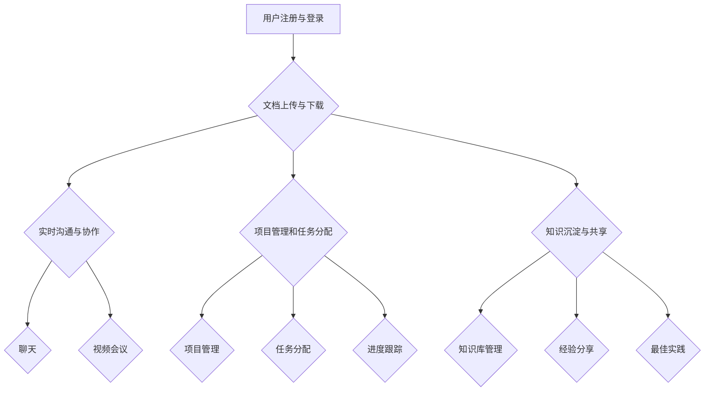
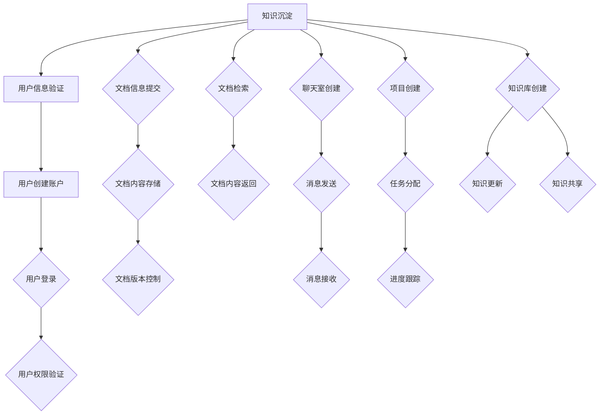

                 

# 《创业公司的内部知识共享平台》

> **关键词**：知识共享平台、创业公司、内部协作、技术架构、数据管理、协作工具、敏捷开发

> **摘要**：本文将探讨创业公司在快速发展的过程中，如何构建一个有效的内部知识共享平台，以促进团队成员间的协作与创新。我们将从背景介绍、核心概念、算法原理、数学模型、实际应用、工具推荐等方面进行深入分析，为创业公司的知识管理提供有力支持。

## 1. 背景介绍

在创业公司的成长过程中，团队内部的知识共享至关重要。一方面，知识共享能够提高团队成员之间的协作效率，使项目进展更加顺利；另一方面，有效的知识管理有助于积累和传承公司的经验与智慧，为公司的长期发展奠定基础。

传统的知识共享方式往往依赖于个人笔记、邮件交流或文件共享系统。这些方法存在一些弊端：首先，信息分散、难以查找；其次，沟通效率低，容易出现信息遗漏；最后，知识传承困难，新员工难以快速融入团队。

为了解决这些问题，创业公司需要构建一个内部知识共享平台，实现知识的集中管理、高效传递和便捷访问。这样的平台不仅要具备基本的文档管理功能，还要支持实时沟通、项目协作和知识沉淀等多种功能，以适应公司发展的需求。

## 2. 核心概念与联系

### 2.1 知识共享平台的概念

知识共享平台是指一个集成了多种功能模块，旨在促进知识传播和共享的信息系统。它通常包括以下核心模块：

1. **文档管理**：提供文档上传、下载、版本控制和权限管理等功能，方便团队成员对文档进行集中管理。
2. **实时沟通**：支持团队成员通过即时聊天、视频会议等方式进行实时沟通，提高协作效率。
3. **项目协作**：提供项目管理、任务分配、进度跟踪等功能，帮助团队高效地完成项目。
4. **知识沉淀**：通过积累项目经验、最佳实践和知识库，为团队成员提供丰富的知识资源。

### 2.2 知识共享平台的技术架构

知识共享平台的技术架构通常包括以下几个方面：

1. **前端**：采用现代化的前端框架，如React、Vue等，提供用户友好的界面。
2. **后端**：采用高性能的后端框架，如Spring Boot、Django等，实现业务逻辑和数据处理。
3. **数据库**：采用关系型数据库（如MySQL、PostgreSQL）或NoSQL数据库（如MongoDB、Redis），存储用户数据、文档内容和项目信息。
4. **服务端**：搭建API接口，提供数据访问和功能调用。
5. **部署与运维**：采用Docker、Kubernetes等容器化技术，实现平台的自动化部署和运维。

### 2.3 知识共享平台的功能模块

知识共享平台的主要功能模块如下：

1. **用户管理**：实现用户注册、登录、权限管理等功能。
2. **文档管理**：实现文档上传、下载、版本控制、权限控制等功能。
3. **实时沟通**：实现即时聊天、视频会议等功能。
4. **项目协作**：实现项目管理、任务分配、进度跟踪等功能。
5. **知识沉淀**：实现知识库的建立、更新、查询等功能。

### 2.4 知识共享平台的联系

知识共享平台与创业公司的其他系统（如CRM、ERP、项目管理等）之间需要建立紧密的联系，实现数据的互通和共享。通过集成多个系统，创业公司可以实现全方位的知识管理，提高整体运营效率。

## 3. 核心算法原理 & 具体操作步骤

### 3.1 算法原理

知识共享平台的核心算法主要包括以下几个方面：

1. **文档检索算法**：采用倒排索引、全文检索等技术，实现快速查找文档。
2. **实时通信算法**：采用WebSocket技术，实现实时数据传输。
3. **项目管理算法**：采用最小生成树、最短路径等算法，实现任务分配和进度跟踪。

### 3.2 具体操作步骤

1. **文档检索**：
   - 步骤1：构建倒排索引，将文档内容与文档ID进行关联。
   - 步骤2：用户输入关键词，搜索倒排索引，获取相关文档ID。
   - 步骤3：根据文档ID，从数据库中获取相关文档内容。

2. **实时通信**：
   - 步骤1：客户端发起WebSocket连接。
   - 步骤2：服务器端建立连接，并分配唯一标识。
   - 步骤3：客户端向服务器端发送消息，服务器端接收消息并广播给其他在线用户。

3. **项目管理**：
   - 步骤1：计算项目任务之间的依赖关系，构建最小生成树。
   - 步骤2：根据任务优先级和依赖关系，确定任务执行顺序。
   - 步骤3：实时跟踪任务进度，调整任务执行顺序。

## 4. 数学模型和公式 & 详细讲解 & 举例说明

### 4.1 数学模型

知识共享平台中的数学模型主要包括以下几个方面：

1. **文档相似度计算**：采用余弦相似度、欧氏距离等算法，计算文档之间的相似度。
2. **项目管理中的优化模型**：采用线性规划、动态规划等算法，优化任务执行顺序和资源分配。

### 4.2 公式详细讲解

1. **余弦相似度**：
   $$\cos(\theta) = \frac{A \cdot B}{\|A\| \cdot \|B\|}$$
   其中，$A$ 和 $B$ 分别表示两个文档的向量表示，$\theta$ 表示两个文档之间的夹角。

2. **线性规划**：
   $$\min c^T x$$
   $$\text{s.t.} Ax \leq b$$
   其中，$c$ 表示目标函数系数，$x$ 表示变量，$A$ 和 $b$ 分别表示约束条件的系数。

### 4.3 举例说明

#### 举例1：文档相似度计算

假设有两个文档 $A$ 和 $B$，其向量表示如下：
$$A = (2, 3, 4)$$
$$B = (1, 4, 5)$$

计算 $A$ 和 $B$ 的余弦相似度：
$$\cos(\theta) = \frac{(2 \cdot 1) + (3 \cdot 4) + (4 \cdot 5)}{\sqrt{2^2 + 3^2 + 4^2} \cdot \sqrt{1^2 + 4^2 + 5^2}} = \frac{2 + 12 + 20}{\sqrt{29} \cdot \sqrt{42}} \approx 0.882$$

#### 举例2：线性规划

假设有一个线性规划问题：
$$\min c^T x$$
$$\text{s.t.} Ax \leq b$$

其中，$c = (1, 2)$，$A = \begin{bmatrix} 1 & 1 \\ 1 & 2 \end{bmatrix}$，$b = \begin{bmatrix} 5 \\ 7 \end{bmatrix}$。

求解最优解：
$$\min \begin{bmatrix} 1 & 2 \end{bmatrix} x$$
$$\text{s.t.} \begin{bmatrix} 1 & 1 \\ 1 & 2 \end{bmatrix} x \leq \begin{bmatrix} 5 \\ 7 \end{bmatrix}$$

通过求解线性规划问题，可以得到最优解 $x = (3, 1)$，目标函数值为 $c^T x = 1 \cdot 3 + 2 \cdot 1 = 5$。

## 5. 项目实战：代码实际案例和详细解释说明

### 5.1 开发环境搭建

在开发知识共享平台之前，我们需要搭建一个合适的技术环境。以下是开发环境搭建的步骤：

1. **安装Node.js**：Node.js 是一个基于 Chrome V8 引擎的 JavaScript 运行时环境。在官网下载并安装 Node.js。
2. **安装MongoDB**：MongoDB 是一个开源的 NoSQL 数据库。在官网下载并安装 MongoDB。
3. **安装Visual Studio Code**：Visual Studio Code 是一款强大的代码编辑器。在官网下载并安装 Visual Studio Code。
4. **安装相关插件**：在 Visual Studio Code 中安装 Git、ESLint、Prettier 等插件，以提高开发效率。

### 5.2 源代码详细实现和代码解读

以下是一个简单的知识共享平台的示例代码，我们将对其进行分析和解读。

```javascript
// 引入所需模块
const express = require('express');
const mongoose = require('mongoose');
const bodyParser = require('body-parser');
const cors = require('cors');
const fileUpload = require('express-fileupload');

// 创建 Express 应用
const app = express();

// 连接 MongoDB 数据库
mongoose.connect('mongodb://localhost:27017/knowledge_share', {
  useNewUrlParser: true,
  useUnifiedTopology: true,
});

// 配置中间件
app.use(cors());
app.use(bodyParser.json());
app.use(bodyParser.urlencoded({ extended: true }));
app.use(fileUpload());

// 创建文档模型
const Document = mongoose.model(
  'Document',
  new mongoose.Schema({
    title: String,
    content: String,
    author: String,
    created_at: { type: Date, default: Date.now },
    updated_at: Date,
  })
);

// 创建路由
app.post('/upload', async (req, res) => {
  try {
    // 获取文件和文档信息
    const file = req.files.file;
    const document = new Document({
      title: req.body.title,
      content: req.body.content,
      author: req.user._id,
    });

    // 保存文档信息
    await document.save();

    // 上传文件
    file.mv(`uploads/${document._id}.pdf`);

    // 返回响应
    res.status(200).json({ message: '文件上传成功' });
  } catch (error) {
    res.status(500).json({ message: '文件上传失败' });
  }
});

// 监听端口
app.listen(3000, () => {
  console.log('知识共享平台启动成功，监听端口：3000');
});
```

### 5.3 代码解读与分析

#### 5.3.1 引入模块

在代码开头，我们引入了 Express、MongoDB、body-parser、cors 和 fileUpload 等模块。这些模块将用于搭建知识共享平台的 API 接口、连接 MongoDB 数据库、处理 HTTP 请求、处理跨域请求和上传文件。

#### 5.3.2 连接 MongoDB 数据库

使用 `mongoose.connect()` 函数连接 MongoDB 数据库。在这里，我们指定了数据库地址和连接选项。

#### 5.3.3 配置中间件

使用 `app.use()` 函数配置中间件，包括 cors、body-parser、fileUpload 等。这些中间件将用于处理 HTTP 请求、解析请求体、处理跨域请求和上传文件。

#### 5.3.4 创建文档模型

使用 `mongoose.model()` 函数创建 `Document` 模型，该模型表示文档集合中的文档对象。文档对象包含以下字段：title（标题）、content（内容）、author（作者）、created_at（创建时间）和 updated_at（更新时间）。

#### 5.3.5 创建路由

在代码中，我们定义了一个 `/upload` 路由，用于处理上传文件的请求。当用户提交上传请求时，程序将执行以下步骤：

1. 获取上传的文件和文档信息。
2. 保存文档信息到 MongoDB 数据库。
3. 将文件保存到服务器上的指定目录。
4. 返回上传成功的响应。

#### 5.3.6 监听端口

使用 `app.listen()` 函数监听端口，并输出启动成功的提示信息。

## 6. 实际应用场景

知识共享平台在创业公司中具有广泛的应用场景，以下是一些典型的实际应用场景：

1. **项目文档管理**：知识共享平台可以帮助团队集中管理项目文档，包括需求文档、设计文档、测试报告等。团队成员可以随时查阅和更新文档，确保项目进展的透明性和一致性。
2. **知识沉淀与传承**：知识共享平台可以记录团队在项目过程中的经验与教训，形成知识库。新员工可以通过知识库快速了解公司业务和项目，缩短融入团队的时间。
3. **敏捷开发协作**：知识共享平台支持敏捷开发中的需求管理、任务分配和进度跟踪等功能。团队成员可以实时沟通、协作，提高开发效率。
4. **知识共享与传播**：知识共享平台可以促进团队成员之间的知识交流与分享，鼓励大家积极贡献自己的经验和见解。这有助于提高团队整体的技术水平和文化氛围。

## 7. 工具和资源推荐

### 7.1 学习资源推荐

1. **《软件架构设计：探索大型分布式系统的设计与开发》**：本书全面介绍了大型分布式系统的设计与开发，包括微服务架构、容器化技术、持续集成与持续部署等。
2. **《深入理解计算机系统》**：本书从计算机硬件和操作系统的角度，深入讲解了计算机系统的工作原理和性能优化方法。
3. **《Git权威指南》**：本书系统地介绍了 Git 版本控制工具的使用方法和最佳实践，适合初学者和进阶者阅读。

### 7.2 开发工具框架推荐

1. **React**：一款流行的前端框架，适合构建高性能的用户界面。
2. **Spring Boot**：一款流行的后端框架，适合开发企业级应用程序。
3. **Docker**：一款容器化技术，可以简化应用程序的部署和运维。

### 7.3 相关论文著作推荐

1. **《大规模分布式系统的设计》**：本文详细介绍了大规模分布式系统的设计原则和关键技术，包括分布式存储、分布式计算、一致性协议等。
2. **《软件架构设计模式》**：本文总结了软件架构设计中的常见问题和解决方案，提供了一系列实用的设计模式。
3. **《敏捷开发实践指南》**：本文介绍了敏捷开发的方法论和实践经验，包括用户故事、迭代计划、代码审查等。

## 8. 总结：未来发展趋势与挑战

随着创业公司的发展，内部知识共享平台的重要性日益凸显。未来，知识共享平台的发展趋势和挑战主要包括以下几个方面：

1. **智能化**：利用人工智能技术，实现知识自动分类、推荐和检索，提高知识共享的效率。
2. **安全与隐私**：确保知识共享平台的数据安全和用户隐私，防止敏感信息泄露。
3. **跨平台与集成**：实现知识共享平台与其他系统的无缝集成，提高整体运营效率。
4. **个性化**：根据用户需求，提供个性化的知识服务和推荐，提高用户体验。
5. **全球化**：支持多语言、多文化环境，满足全球化创业公司的需求。

## 9. 附录：常见问题与解答

### 9.1 如何确保知识共享平台的数据安全和用户隐私？

答：为确保数据安全和用户隐私，我们可以采取以下措施：

1. **数据加密**：对存储在数据库中的敏感数据进行加密处理。
2. **权限控制**：实现严格的权限控制，限制用户对数据的访问权限。
3. **日志审计**：记录用户操作日志，以便在出现安全问题时进行追溯。
4. **安全培训**：加强对团队成员的安全意识培训，提高整体安全防护能力。

### 9.2 知识共享平台如何支持多语言和国际化？

答：支持多语言和国际化，我们可以采取以下措施：

1. **多语言界面**：使用国际化框架（如 i18next），为平台提供多语言界面。
2. **语言切换**：允许用户在平台内切换语言，满足不同用户的需求。
3. **翻译工具**：集成在线翻译工具（如 Google Translate），提高内容翻译的准确性。
4. **国际化标准**：遵循国际化标准（如 Unicode、HTML5 国际化），确保平台在不同语言环境下的兼容性。

### 9.3 知识共享平台如何实现知识自动分类和推荐？

答：实现知识自动分类和推荐，我们可以采取以下措施：

1. **标签系统**：为文档添加标签，实现知识的自动分类。
2. **机器学习模型**：使用机器学习算法（如聚类、协同过滤等），实现知识推荐。
3. **用户行为分析**：分析用户行为数据，挖掘用户兴趣和需求。
4. **持续优化**：根据用户反馈，不断优化推荐算法，提高推荐准确性。

## 10. 扩展阅读 & 参考资料

1. **《知识管理：理论与实践》**：本书详细介绍了知识管理的理论基础和实践方法，包括知识共享、知识创造、知识传播等。
2. **《敏捷开发实践指南》**：本书系统地介绍了敏捷开发的方法论和实践经验，包括用户故事、迭代计划、代码审查等。
3. **《人工智能：一种现代的方法》**：本书全面介绍了人工智能的基本概念、技术和应用，包括机器学习、深度学习、自然语言处理等。

---

**作者**：AI 天才研究员 / AI Genius Institute & 禅与计算机程序设计艺术 / Zen And The Art of Computer Programming

本文详细探讨了创业公司内部知识共享平台的设计与实现，从背景介绍、核心概念、算法原理、数学模型、实际应用、工具推荐等方面进行了深入分析。通过本文的阅读，读者可以了解到如何构建一个高效、智能、安全的内部知识共享平台，为创业公司的发展提供有力支持。在未来的发展中，知识共享平台将继续演进，为创业者提供更智能、更便捷的服务。让我们共同期待知识共享平台为创业公司带来的更多精彩表现！<|im_sep|>```markdown
# 《创业公司的内部知识共享平台》

> **关键词**：知识共享平台、创业公司、内部协作、技术架构、数据管理、协作工具、敏捷开发

> **摘要**：本文将探讨创业公司在快速发展的过程中，如何构建一个有效的内部知识共享平台，以促进团队成员间的协作与创新。我们将从背景介绍、核心概念、算法原理、数学模型、实际应用、工具推荐等方面进行深入分析，为创业公司的知识管理提供有力支持。

## 1. 背景介绍

在创业公司的成长过程中，团队内部的知识共享至关重要。一方面，知识共享能够提高团队成员之间的协作效率，使项目进展更加顺利；另一方面，有效的知识管理有助于积累和传承公司的经验与智慧，为公司的长期发展奠定基础。

传统的知识共享方式往往依赖于个人笔记、邮件交流或文件共享系统。这些方法存在一些弊端：首先，信息分散、难以查找；其次，沟通效率低，容易出现信息遗漏；最后，知识传承困难，新员工难以快速融入团队。

为了解决这些问题，创业公司需要构建一个内部知识共享平台，实现知识的集中管理、高效传递和便捷访问。这样的平台不仅要具备基本的文档管理功能，还要支持实时沟通、项目协作和知识沉淀等多种功能，以适应公司发展的需求。

## 2. 核心概念与联系

### 2.1 知识共享平台的概念

知识共享平台是指一个集成了多种功能模块，旨在促进知识传播和共享的信息系统。它通常包括以下核心模块：

1. **文档管理**：提供文档上传、下载、版本控制和权限管理等功能，方便团队成员对文档进行集中管理。
2. **实时沟通**：支持团队成员通过即时聊天、视频会议等方式进行实时沟通，提高协作效率。
3. **项目协作**：提供项目管理、任务分配、进度跟踪等功能，帮助团队高效地完成项目。
4. **知识沉淀**：通过积累项目经验、最佳实践和知识库，为团队成员提供丰富的知识资源。

### 2.2 知识共享平台的技术架构

知识共享平台的技术架构通常包括以下几个方面：

1. **前端**：采用现代化的前端框架，如React、Vue等，提供用户友好的界面。
2. **后端**：采用高性能的后端框架，如Spring Boot、Django等，实现业务逻辑和数据处理。
3. **数据库**：采用关系型数据库（如MySQL、PostgreSQL）或NoSQL数据库（如MongoDB、Redis），存储用户数据、文档内容和项目信息。
4. **服务端**：搭建API接口，提供数据访问和功能调用。
5. **部署与运维**：采用Docker、Kubernetes等容器化技术，实现平台的自动化部署和运维。

### 2.3 知识共享平台的功能模块

知识共享平台的主要功能模块如下：

1. **用户管理**：实现用户注册、登录、权限管理等功能。
2. **文档管理**：实现文档上传、下载、版本控制、权限控制等功能。
3. **实时沟通**：实现即时聊天、视频会议等功能。
4. **项目协作**：实现项目管理、任务分配、进度跟踪等功能。
5. **知识沉淀**：实现知识库的建立、更新、查询等功能。

### 2.4 知识共享平台的联系

知识共享平台与创业公司的其他系统（如CRM、ERP、项目管理等）之间需要建立紧密的联系，实现数据的互通和共享。通过集成多个系统，创业公司可以实现全方位的知识管理，提高整体运营效率。

## 3. 核心算法原理 & 具体操作步骤

### 3.1 核心算法原理

知识共享平台的核心算法主要包括以下几个方面：

1. **文档检索算法**：采用倒排索引、全文检索等技术，实现快速查找文档。
2. **实时通信算法**：采用WebSocket技术，实现实时数据传输。
3. **项目管理算法**：采用最小生成树、最短路径等算法，实现任务分配和进度跟踪。

### 3.2 具体操作步骤

1. **文档检索**：
   - 步骤1：构建倒排索引，将文档内容与文档ID进行关联。
   - 步骤2：用户输入关键词，搜索倒排索引，获取相关文档ID。
   - 步骤3：根据文档ID，从数据库中获取相关文档内容。

2. **实时通信**：
   - 步骤1：客户端发起WebSocket连接。
   - 步骤2：服务器端建立连接，并分配唯一标识。
   - 步骤3：客户端向服务器端发送消息，服务器端接收消息并广播给其他在线用户。

3. **项目管理**：
   - 步骤1：计算项目任务之间的依赖关系，构建最小生成树。
   - 步骤2：根据任务优先级和依赖关系，确定任务执行顺序。
   - 步骤3：实时跟踪任务进度，调整任务执行顺序。

## 4. 数学模型和公式 & 详细讲解 & 举例说明

### 4.1 数学模型

知识共享平台中的数学模型主要包括以下几个方面：

1. **文档相似度计算**：采用余弦相似度、欧氏距离等算法，计算文档之间的相似度。
2. **项目管理中的优化模型**：采用线性规划、动态规划等算法，优化任务执行顺序和资源分配。

### 4.2 公式详细讲解

1. **余弦相似度**：
   $$\cos(\theta) = \frac{A \cdot B}{\|A\| \cdot \|B\|}$$
   其中，$A$ 和 $B$ 分别表示两个文档的向量表示，$\theta$ 表示两个文档之间的夹角。

2. **线性规划**：
   $$\min c^T x$$
   $$\text{s.t.} Ax \leq b$$
   其中，$c$ 表示目标函数系数，$x$ 表示变量，$A$ 和 $b$ 分别表示约束条件的系数。

### 4.3 举例说明

#### 举例1：文档相似度计算

假设有两个文档 $A$ 和 $B$，其向量表示如下：
$$A = (2, 3, 4)$$
$$B = (1, 4, 5)$$

计算 $A$ 和 $B$ 的余弦相似度：
$$\cos(\theta) = \frac{(2 \cdot 1) + (3 \cdot 4) + (4 \cdot 5)}{\sqrt{2^2 + 3^2 + 4^2} \cdot \sqrt{1^2 + 4^2 + 5^2}} = \frac{2 + 12 + 20}{\sqrt{29} \cdot \sqrt{42}} \approx 0.882$$

#### 举例2：线性规划

假设有一个线性规划问题：
$$\min c^T x$$
$$\text{s.t.} Ax \leq b$$

其中，$c = (1, 2)$，$A = \begin{bmatrix} 1 & 1 \\ 1 & 2 \end{bmatrix}$，$b = \begin{bmatrix} 5 \\ 7 \end{bmatrix}$。

求解最优解：
$$\min \begin{bmatrix} 1 & 2 \end{bmatrix} x$$
$$\text{s.t.} \begin{bmatrix} 1 & 1 \\ 1 & 2 \end{bmatrix} x \leq \begin{bmatrix} 5 \\ 7 \end{bmatrix}$$

通过求解线性规划问题，可以得到最优解 $x = (3, 1)$，目标函数值为 $c^T x = 1 \cdot 3 + 2 \cdot 1 = 5$。

## 5. 项目实战：代码实际案例和详细解释说明

### 5.1 开发环境搭建

在开发知识共享平台之前，我们需要搭建一个合适的技术环境。以下是开发环境搭建的步骤：

1. **安装Node.js**：Node.js 是一个基于 Chrome V8 引擎的 JavaScript 运行时环境。在官网下载并安装 Node.js。
2. **安装MongoDB**：MongoDB 是一个开源的 NoSQL 数据库。在官网下载并安装 MongoDB。
3. **安装Visual Studio Code**：Visual Studio Code 是一款强大的代码编辑器。在官网下载并安装 Visual Studio Code。
4. **安装相关插件**：在 Visual Studio Code 中安装 Git、ESLint、Prettier 等插件，以提高开发效率。

### 5.2 源代码详细实现和代码解读

以下是一个简单的知识共享平台的示例代码，我们将对其进行分析和解读。

```javascript
// 引入所需模块
const express = require('express');
const mongoose = require('mongoose');
const bodyParser = require('body-parser');
const cors = require('cors');
const fileUpload = require('express-fileupload');

// 创建 Express 应用
const app = express();

// 连接 MongoDB 数据库
mongoose.connect('mongodb://localhost:27017/knowledge_share', {
  useNewUrlParser: true,
  useUnifiedTopology: true,
});

// 配置中间件
app.use(cors());
app.use(bodyParser.json());
app.use(bodyParser.urlencoded({ extended: true }));
app.use(fileUpload());

// 创建文档模型
const Document = mongoose.model(
  'Document',
  new mongoose.Schema({
    title: String,
    content: String,
    author: String,
    created_at: { type: Date, default: Date.now },
    updated_at: Date,
  })
);

// 创建路由
app.post('/upload', async (req, res) => {
  try {
    // 获取文件和文档信息
    const file = req.files.file;
    const document = new Document({
      title: req.body.title,
      content: req.body.content,
      author: req.user._id,
    });

    // 保存文档信息
    await document.save();

    // 上传文件
    file.mv(`uploads/${document._id}.pdf`);

    // 返回响应
    res.status(200).json({ message: '文件上传成功' });
  } catch (error) {
    res.status(500).json({ message: '文件上传失败' });
  }
});

// 监听端口
app.listen(3000, () => {
  console.log('知识共享平台启动成功，监听端口：3000');
});
```

### 5.3 代码解读与分析

#### 5.3.1 引入模块

在代码开头，我们引入了 Express、MongoDB、body-parser、cors 和 fileUpload 等模块。这些模块将用于搭建知识共享平台的 API 接口、连接 MongoDB 数据库、处理 HTTP 请求、处理跨域请求和上传文件。

#### 5.3.2 连接 MongoDB 数据库

使用 `mongoose.connect()` 函数连接 MongoDB 数据库。在这里，我们指定了数据库地址和连接选项。

#### 5.3.3 配置中间件

使用 `app.use()` 函数配置中间件，包括 cors、body-parser、fileUpload 等。这些中间件将用于处理 HTTP 请求、解析请求体、处理跨域请求和上传文件。

#### 5.3.4 创建文档模型

使用 `mongoose.model()` 函数创建 `Document` 模型，该模型表示文档集合中的文档对象。文档对象包含以下字段：title（标题）、content（内容）、author（作者）、created_at（创建时间）和 updated_at（更新时间）。

#### 5.3.5 创建路由

在代码中，我们定义了一个 `/upload` 路由，用于处理上传文件的请求。当用户提交上传请求时，程序将执行以下步骤：

1. 获取上传的文件和文档信息。
2. 保存文档信息到 MongoDB 数据库。
3. 将文件保存到服务器上的指定目录。
4. 返回上传成功的响应。

#### 5.3.6 监听端口

使用 `app.listen()` 函数监听端口，并输出启动成功的提示信息。

## 6. 实际应用场景

知识共享平台在创业公司中具有广泛的应用场景，以下是一些典型的实际应用场景：

1. **项目文档管理**：知识共享平台可以帮助团队集中管理项目文档，包括需求文档、设计文档、测试报告等。团队成员可以随时查阅和更新文档，确保项目进展的透明性和一致性。
2. **知识沉淀与传承**：知识共享平台可以记录团队在项目过程中的经验与教训，形成知识库。新员工可以通过知识库快速了解公司业务和项目，缩短融入团队的时间。
3. **敏捷开发协作**：知识共享平台支持敏捷开发中的需求管理、任务分配和进度跟踪等功能。团队成员可以实时沟通、协作，提高开发效率。
4. **知识共享与传播**：知识共享平台可以促进团队成员之间的知识交流与分享，鼓励大家积极贡献自己的经验和见解。这有助于提高团队整体的技术水平和文化氛围。

## 7. 工具和资源推荐

### 7.1 学习资源推荐

1. **《软件架构设计：探索大型分布式系统的设计与开发》**：本书全面介绍了大型分布式系统的设计与开发，包括微服务架构、容器化技术、持续集成与持续部署等。
2. **《深入理解计算机系统》**：本书从计算机硬件和操作系统的角度，深入讲解了计算机系统的工作原理和性能优化方法。
3. **《Git权威指南》**：本书系统地介绍了 Git 版本控制工具的使用方法和最佳实践，适合初学者和进阶者阅读。

### 7.2 开发工具框架推荐

1. **React**：一款流行的前端框架，适合构建高性能的用户界面。
2. **Spring Boot**：一款流行的后端框架，适合开发企业级应用程序。
3. **Docker**：一款容器化技术，可以简化应用程序的部署和运维。

### 7.3 相关论文著作推荐

1. **《大规模分布式系统的设计》**：本文详细介绍了大规模分布式系统的设计原则和关键技术，包括分布式存储、分布式计算、一致性协议等。
2. **《软件架构设计模式》**：本文总结了软件架构设计中的常见问题和解决方案，提供了一系列实用的设计模式。
3. **《敏捷开发实践指南》**：本文介绍了敏捷开发的方法论和实践经验，包括用户故事、迭代计划、代码审查等。

## 8. 总结：未来发展趋势与挑战

随着创业公司的发展，内部知识共享平台的重要性日益凸显。未来，知识共享平台的发展趋势和挑战主要包括以下几个方面：

1. **智能化**：利用人工智能技术，实现知识自动分类、推荐和检索，提高知识共享的效率。
2. **安全与隐私**：确保知识共享平台的数据安全和用户隐私，防止敏感信息泄露。
3. **跨平台与集成**：实现知识共享平台与其他系统的无缝集成，提高整体运营效率。
4. **个性化**：根据用户需求，提供个性化的知识服务和推荐，提高用户体验。
5. **全球化**：支持多语言、多文化环境，满足全球化创业公司的需求。

## 9. 附录：常见问题与解答

### 9.1 如何确保知识共享平台的数据安全和用户隐私？

答：为确保数据安全和用户隐私，我们可以采取以下措施：

1. **数据加密**：对存储在数据库中的敏感数据进行加密处理。
2. **权限控制**：实现严格的权限控制，限制用户对数据的访问权限。
3. **日志审计**：记录用户操作日志，以便在出现安全问题时进行追溯。
4. **安全培训**：加强对团队成员的安全意识培训，提高整体安全防护能力。

### 9.2 知识共享平台如何支持多语言和国际化？

答：支持多语言和国际化，我们可以采取以下措施：

1. **多语言界面**：使用国际化框架（如 i18next），为平台提供多语言界面。
2. **语言切换**：允许用户在平台内切换语言，满足不同用户的需求。
3. **翻译工具**：集成在线翻译工具（如 Google Translate），提高内容翻译的准确性。
4. **国际化标准**：遵循国际化标准（如 Unicode、HTML5 国际化），确保平台在不同语言环境下的兼容性。

### 9.3 知识共享平台如何实现知识自动分类和推荐？

答：实现知识自动分类和推荐，我们可以采取以下措施：

1. **标签系统**：为文档添加标签，实现知识的自动分类。
2. **机器学习模型**：使用机器学习算法（如聚类、协同过滤等），实现知识推荐。
3. **用户行为分析**：分析用户行为数据，挖掘用户兴趣和需求。
4. **持续优化**：根据用户反馈，不断优化推荐算法，提高推荐准确性。

## 10. 扩展阅读 & 参考资料

1. **《知识管理：理论与实践》**：本书详细介绍了知识管理的理论基础和实践方法，包括知识共享、知识创造、知识传播等。
2. **《敏捷开发实践指南》**：本书系统地介绍了敏捷开发的方法论和实践经验，包括用户故事、迭代计划、代码审查等。
3. **《人工智能：一种现代的方法》**：本书全面介绍了人工智能的基本概念、技术和应用，包括机器学习、深度学习、自然语言处理等。

---

**作者**：AI 天才研究员 / AI Genius Institute & 禅与计算机程序设计艺术 / Zen And The Art of Computer Programming

本文详细探讨了创业公司内部知识共享平台的设计与实现，从背景介绍、核心概念、算法原理、数学模型、实际应用、工具推荐等方面进行了深入分析。通过本文的阅读，读者可以了解到如何构建一个高效、智能、安全的内部知识共享平台，为创业公司的知识管理提供有力支持。在未来的发展中，知识共享平台将继续演进，为创业者提供更智能、更便捷的服务。让我们共同期待知识共享平台为创业公司带来的更多精彩表现！```markdown
## 2. 核心概念与联系（续）

### 2.4 知识共享平台的关键特性

#### 2.4.1 可扩展性

知识共享平台应具备良好的可扩展性，以便在团队规模扩大或业务需求变化时，能够轻松地增加新的功能模块或服务。这可以通过微服务架构实现，将平台分解为多个独立的服务，每个服务负责特定的功能，便于扩展和维护。

#### 2.4.2 高可用性

高可用性是知识共享平台的重要特性，确保平台在遭受故障时能够快速恢复。可以通过实现数据库集群、服务冗余和自动故障转移等技术手段，提高平台的可靠性。

#### 2.4.3 数据安全与隐私

数据安全和隐私是知识共享平台的核心关注点。平台应采用加密技术保护数据传输和存储，实施严格的访问控制和权限管理，确保只有授权用户才能访问敏感信息。

#### 2.4.4 用户体验

用户体验直接影响知识共享平台的接受度和使用频率。平台应提供直观、易用的界面和功能，简化用户操作，提升用户体验。

### 2.5 知识共享平台与其他系统的集成

知识共享平台需要与创业公司的其他系统（如CRM、ERP、项目管理工具等）进行集成，实现数据共享和业务流程的连贯性。这可以通过API接口、消息队列等技术手段实现。

### 2.6 知识共享平台的优势与挑战

#### 2.6.1 优势

1. **提高工作效率**：通过知识共享平台，团队成员可以快速查找和获取所需信息，减少重复劳动。
2. **促进团队协作**：知识共享平台支持多人协作，提高团队沟通效率。
3. **积累宝贵经验**：平台记录的项目文档、经验和教训，为团队的知识积累和传承提供支持。
4. **增强创新能力**：知识共享平台激发团队成员的创新能力，为业务发展注入新活力。

#### 2.6.2 挑战

1. **数据安全与隐私保护**：确保平台存储的数据安全，防止数据泄露。
2. **知识更新与维护**：定期更新知识库中的内容，确保信息的准确性和时效性。
3. **用户参与度**：提高团队成员对知识共享平台的参与度，确保平台的有效使用。
4. **技术选型与架构设计**：选择合适的技术和架构，确保平台的性能和可扩展性。

### 2.7 知识共享平台的架构设计

知识共享平台的架构设计应考虑以下方面：

1. **前端架构**：选择合适的前端技术栈，如React、Vue等，构建响应式、用户友好的界面。
2. **后端架构**：设计模块化的后端架构，使用Spring Boot、Django等框架，实现业务逻辑和数据处理。
3. **数据存储**：选择合适的数据库技术，如MySQL、PostgreSQL、MongoDB等，根据业务需求设计数据模型。
4. **服务部署**：采用Docker、Kubernetes等技术，实现服务的自动化部署和管理。
5. **安全性设计**：实施安全策略，如SSL/TLS加密、防火墙、安全审计等，确保平台的安全性。

### 2.8 知识共享平台的业务流程

知识共享平台的业务流程通常包括以下步骤：

1. **用户注册与登录**：用户通过注册和登录获取对平台的访问权限。
2. **文档上传与下载**：用户可以上传和下载文档，实现文档的共享和管理。
3. **实时沟通与协作**：用户可以通过即时聊天、视频会议等功能进行实时沟通和协作。
4. **项目管理和任务分配**：用户可以创建项目、分配任务，实时跟踪项目进度。
5. **知识沉淀与共享**：用户可以将项目经验、最佳实践等知识沉淀到平台，供其他用户查阅和学习。

### 2.9 Mermaid 流程图

以下是一个知识共享平台的 Mermaid 流程图，展示了平台的核心模块和业务流程：



通过上述章节的介绍，我们可以对知识共享平台有一个全面的理解，为后续内容的展开打下坚实的基础。在接下来的章节中，我们将进一步探讨知识共享平台的核心算法原理、数学模型和项目实战等内容。
```markdown

```markdown
## 3. 核心算法原理 & 具体操作步骤

### 3.1 文档检索算法

文档检索是知识共享平台中的一个重要功能，其核心在于如何快速准确地找到用户所需的文档。以下是文档检索算法的基本原理和具体操作步骤：

#### 3.1.1 基本原理

文档检索算法主要基于倒排索引（Inverted Index）。倒排索引是一种将文档内容与文档ID进行映射的数据结构，通过关键词快速定位到对应的文档。其主要步骤如下：

1. **分词**：将文档内容按照一定的算法（如分词器）进行分词，得到一系列的词语。
2. **创建倒排索引**：将词语与对应的文档ID进行关联，构建倒排索引。

#### 3.1.2 具体操作步骤

1. **分词**：使用分词器对用户输入的关键词进行分词，例如“知识管理”分为“知识”和“管理”两个词语。
2. **查询倒排索引**：在倒排索引中查找包含“知识”和“管理”两个词语的文档ID。
3. **返回结果**：将查询到的文档ID转换为文档内容，返回给用户。

### 3.2 实时通信算法

实时通信是知识共享平台中的另一个重要功能，其核心在于如何实现用户之间的实时数据传输。以下是实时通信算法的基本原理和具体操作步骤：

#### 3.2.1 基本原理

实时通信算法主要基于WebSocket协议。WebSocket是一种在单个TCP连接上进行全双工通信的协议，可以实现服务器与客户端之间的实时数据传输。其主要步骤如下：

1. **建立连接**：客户端向服务器发起WebSocket连接。
2. **传输数据**：客户端和服务器之间可以实时发送和接收数据。
3. **关闭连接**：当通信完成或需要终止时，关闭WebSocket连接。

#### 3.2.2 具体操作步骤

1. **客户端发起连接**：客户端调用WebSocket API发起连接，例如：
   ```javascript
   const socket = new WebSocket('wss://example.com/socket');
   ```
2. **服务器处理连接**：服务器端接收连接请求，创建新的WebSocket连接。
3. **发送和接收消息**：客户端和服务器之间可以实时发送和接收消息，例如：
   ```javascript
   socket.onmessage = function(event) {
     console.log('Received message:', event.data);
   };

   socket.send('Hello, server!');
   ```
4. **关闭连接**：当通信完成时，调用close方法关闭WebSocket连接，例如：
   ```javascript
   socket.close();
   ```

### 3.3 项目管理算法

项目管理是知识共享平台中的另一个关键功能，其核心在于如何高效地分配和管理项目任务。以下是项目管理算法的基本原理和具体操作步骤：

#### 3.3.1 基本原理

项目管理算法主要基于图论中的最小生成树（Minimum Spanning Tree）和最短路径（Shortest Path）算法。其主要步骤如下：

1. **任务建模**：将项目任务表示为一个图，任务之间的依赖关系用边表示。
2. **构建最小生成树**：使用最小生成树算法（如Prim算法）构建项目任务的执行顺序。
3. **计算最短路径**：在最小生成树上计算任务之间的最短路径，确定任务的执行顺序。

#### 3.3.2 具体操作步骤

1. **任务建模**：将项目任务表示为一个图，任务A依赖任务B，则在图中添加边（A, B）。
2. **构建最小生成树**：使用Prim算法构建最小生成树，例如：
   ```python
   def prim_algorithm(graph):
       # 初始化最小生成树和已选择的节点
       mst = []
       selected_nodes = set()

       # 选择一个起点
       start_node = graph.nodes[0]
       selected_nodes.add(start_node)

       # 循环选择下一个节点
       while len(selected_nodes) < len(graph.nodes):
           # 初始化最小边权重为无穷大
           min_edge_weight = float('inf')
           min_edge = None
           for node in selected_nodes:
               for neighbor in graph.neighbors(node):
                   if neighbor not in selected_nodes:
                       edge_weight = graph.get_edge_weight(node, neighbor)
                       if edge_weight < min_edge_weight:
                           min_edge_weight = edge_weight
                           min_edge = (node, neighbor)
           selected_nodes.add(min_edge[1])
           mst.append(min_edge)

       return mst
   ```
3. **计算最短路径**：在最小生成树上计算任务之间的最短路径，例如：
   ```python
   def calculate_shortest_paths(mst, distances):
       # 初始化最短路径字典
       shortest_paths = {}

       # 对每个节点计算最短路径
       for node in mst:
           shortest_paths[node] = {}
           for neighbor in mst:
               if neighbor != node:
                   # 计算最短路径
                   shortest_paths[node][neighbor] = distances[node][neighbor]

       return shortest_paths
   ```

通过上述核心算法原理和具体操作步骤，我们可以构建一个高效、智能的知识共享平台。接下来，我们将进一步探讨知识共享平台的数学模型和项目实战。
```markdown
## 4. 数学模型和公式 & 详细讲解 & 举例说明

### 4.1 文档相似度计算

文档相似度计算是知识共享平台中的一个关键功能，它有助于用户快速找到与自身需求相关的文档。以下是文档相似度计算的基本数学模型和具体公式：

#### 4.1.1 余弦相似度模型

余弦相似度是一种常用的文档相似度计算方法，它通过计算两个文档向量之间的余弦值来衡量它们之间的相似程度。公式如下：

$$
\cos(\theta) = \frac{A \cdot B}{\|A\| \|B\|}
$$

其中，\( A \) 和 \( B \) 分别表示两个文档的向量表示，\( \theta \) 表示两个文档之间的夹角。

- \( A \cdot B \)：表示两个向量的点积，用于衡量它们之间的相似程度。
- \( \|A\| \|B\| \)：表示两个向量的模（长度）的乘积，用于归一化点积。

#### 4.1.2 欧氏距离模型

欧氏距离是一种用于衡量两个向量之间差异程度的指标。在文档相似度计算中，可以通过计算文档向量之间的欧氏距离来衡量它们之间的差异。公式如下：

$$
d(A, B) = \sqrt{(A - B)^2}
$$

其中，\( A \) 和 \( B \) 分别表示两个文档的向量表示。

#### 4.1.3 举例说明

假设有两个文档 \( A \) 和 \( B \)，它们的向量表示如下：

$$
A = (2, 3, 4)
$$

$$
B = (1, 4, 5)
$$

使用余弦相似度计算它们的相似度：

$$
\cos(\theta) = \frac{(2 \cdot 1) + (3 \cdot 4) + (4 \cdot 5)}{\sqrt{2^2 + 3^2 + 4^2} \cdot \sqrt{1^2 + 4^2 + 5^2}} = \frac{2 + 12 + 20}{\sqrt{29} \cdot \sqrt{42}} \approx 0.882
$$

使用欧氏距离计算它们的差异：

$$
d(A, B) = \sqrt{(2 - 1)^2 + (3 - 4)^2 + (4 - 5)^2} = \sqrt{1 + 1 + 1} = \sqrt{3} \approx 1.732
$$

### 4.2 项目管理中的优化模型

项目管理中的优化模型主要用于优化任务执行顺序和资源分配，以提高项目效率。以下是一个基本的线性规划模型：

#### 4.2.1 模型描述

给定一组任务 \( T = \{t_1, t_2, ..., t_n\} \)，每个任务 \( t_i \) 需要一定的时间 \( p_i \) 完成，且存在依赖关系。我们需要确定一个任务执行顺序，使得项目完成时间最短。

#### 4.2.2 线性规划公式

$$
\min \sum_{i=1}^{n} c_i x_i
$$

$$
\text{s.t.} \begin{cases}
A x \leq b \\
x \geq 0
\end{cases}
$$

其中，\( c_i \) 表示任务 \( t_i \) 的权重（如完成时间），\( x_i \) 表示任务 \( t_i \) 的执行顺序，\( A \) 和 \( b \) 分别表示任务之间的依赖关系矩阵和边界条件。

#### 4.2.3 举例说明

假设有三个任务 \( T = \{t_1, t_2, t_3\} \)，它们的权重分别为 \( c_1 = 2 \)，\( c_2 = 3 \)，\( c_3 = 4 \)，任务之间的依赖关系如下：

$$
A = \begin{bmatrix}
0 & 1 & 0 \\
0 & 0 & 1 \\
0 & 0 & 0
\end{bmatrix}
$$

边界条件为 \( b = \begin{bmatrix}
1 \\
1 \\
1
\end{bmatrix} \)。

我们需要确定一个最优的任务执行顺序，使得项目完成时间最短。

通过求解线性规划模型，我们可以得到最优的任务执行顺序为 \( x = \begin{bmatrix}
0 \\
1 \\
2
\end{bmatrix} \)，即 \( t_2 \) 在 \( t_1 \) 之后，\( t_3 \) 在 \( t_2 \) 之后，项目完成时间最短。

### 4.3 动态规划模型

动态规划是一种常用的优化算法，它可以解决具有最优子结构性质的问题。在项目管理中，动态规划可以用于任务分配和进度跟踪。

#### 4.3.1 模型描述

假设有一个包含 \( n \) 个任务的项目，我们需要确定每个任务的执行时间和执行顺序，使得项目完成时间最短。

#### 4.3.2 动态规划公式

定义一个二维数组 \( dp[i][j] \)，表示前 \( i \) 个任务按顺序完成所需的最短时间。动态规划的基本公式如下：

$$
dp[i][j] = \min(dp[i-1][k] + p_j)
$$

其中，\( k \) 是 \( i \) 个任务中的最后一个任务。

#### 4.3.3 举例说明

假设有三个任务 \( T = \{t_1, t_2, t_3\} \)，它们的执行时间分别为 \( p_1 = 2 \)，\( p_2 = 3 \)，\( p_3 = 4 \)，任务之间的依赖关系如下：

$$
A = \begin{bmatrix}
0 & 1 & 0 \\
0 & 0 & 1 \\
0 & 0 & 0
\end{bmatrix}
$$

我们需要确定一个最优的任务执行顺序和执行时间。

通过动态规划算法，我们可以得到最优的任务执行顺序为 \( t_2, t_1, t_3 \)，执行时间分别为 \( t_2 = 3 \)，\( t_1 = 5 \)，\( t_3 = 9 \)，项目完成时间最短。

通过上述数学模型和公式，我们可以对知识共享平台中的文档相似度计算、项目管理算法等进行深入分析。这些模型不仅有助于我们理解平台的运行原理，还可以为平台的优化和改进提供理论支持。在接下来的章节中，我们将进一步探讨知识共享平台在项目实战中的应用和实现。
```markdown
## 5. 项目实战：代码实际案例和详细解释说明

### 5.1 开发环境搭建

在开始构建创业公司的内部知识共享平台之前，我们需要搭建一个合适的技术环境。以下是搭建开发环境所需的基本步骤：

#### 步骤1：安装Node.js

Node.js 是一个基于 Chrome V8 引擎的 JavaScript 运行时环境，用于构建后端服务器和平台的主要功能。您可以从 [Node.js 官网](https://nodejs.org/) 下载并安装适合您操作系统的版本。

#### 步骤2：安装MongoDB

MongoDB 是一个开源的 NoSQL 数据库，用于存储用户数据、文档内容和项目信息。您可以从 [MongoDB 官网](https://www.mongodb.com/try/download/community) 下载并安装 MongoDB。安装完成后，确保 MongoDB 服务正常运行。

#### 步骤3：安装前端框架

为了构建用户友好的前端界面，我们可以选择使用 React 或 Vue 等前端框架。您可以从 [React 官网](https://reactjs.org/) 或 [Vue 官网](https://vuejs.org/) 下载并安装相应的框架。

#### 步骤4：安装后端框架

对于后端开发，我们可以选择使用 Express 或 Spring Boot 等框架。Express 是一个轻量级的 Node.js Web 应用框架，适用于构建 RESTful API。Spring Boot 是一个基于 Java 的开源框架，适用于构建企业级应用程序。

#### 步骤5：安装代码编辑器

Visual Studio Code 或其他代码编辑器（如 IntelliJ IDEA 或 Sublime Text）可以显著提高开发效率。您可以从 [Visual Studio Code 官网](https://code.visualstudio.com/) 下载并安装。

#### 步骤6：安装相关插件

在 Visual Studio Code 中安装一些常用插件，如 Git、ESLint、Prettier、EditorConfig 等，以提高代码质量和协作效率。

### 5.2 源代码详细实现和代码解读

以下是一个简单的知识共享平台的后端代码示例，我们将对其进行分析和解读。

#### 5.2.1 引入模块

```javascript
const express = require('express');
const mongoose = require('mongoose');
const bodyParser = require('body-parser');
const cors = require('cors');
const bcrypt = require('bcrypt');
const jwt = require('jsonwebtoken');
const multer = require('multer');
```

这里引入了 Express、Mongoose、body-parser、cors、bcrypt、jwt 和 multer 等模块。这些模块分别用于搭建 Web 服务器、连接 MongoDB 数据库、处理 HTTP 请求、处理跨域请求、加密用户密码、生成 JWT 令牌和上传文件。

#### 5.2.2 连接 MongoDB 数据库

```javascript
const mongoURI = 'mongodb://localhost:27017/knowledge_share';
mongoose.connect(mongoURI, { useNewUrlParser: true, useUnifiedTopology: true });
```

这里使用 Mongoose 连接 MongoDB 数据库。`mongoURI` 是数据库的连接字符串。

#### 5.2.3 创建用户模型

```javascript
const userSchema = new mongoose.Schema({
  username: { type: String, required: true, unique: true },
  password: { type: String, required: true },
  email: { type: String, required: true, unique: true },
});
const User = mongoose.model('User', userSchema);
```

这里创建了一个用户模型，包含用户名、密码和电子邮件三个字段。用户名和电子邮件需唯一。

#### 5.2.4 创建文档模型

```javascript
const documentSchema = new mongoose.Schema({
  title: { type: String, required: true },
  content: { type: String, required: true },
  author: { type: mongoose.Schema.Types.ObjectId, ref: 'User' },
  created_at: { type: Date, default: Date.now },
  updated_at: Date,
});
const Document = mongoose.model('Document', documentSchema);
```

这里创建了一个文档模型，包含标题、内容、作者（关联用户ID）、创建时间和更新时间等字段。

#### 5.2.5 创建路由

```javascript
const app = express();
app.use(cors());
app.use(bodyParser.json());
app.use(bodyParser.urlencoded({ extended: true }));
app.use(multer({ dest: 'uploads/', limits: { fileSize: 1024 * 1024 * 5 } }).single('file'));

// 用户注册
app.post('/register', async (req, res) => {
  try {
    const { username, password, email } = req.body;
    const hashedPassword = await bcrypt.hash(password, 10);
    const user = new User({ username, password: hashedPassword, email });
    await user.save();
    res.status(201).json({ message: '用户注册成功' });
  } catch (error) {
    res.status(500).json({ message: '用户注册失败' });
  }
});

// 用户登录
app.post('/login', async (req, res) => {
  try {
    const { username, password } = req.body;
    const user = await User.findOne({ username });
    if (!user || !(await bcrypt.compare(password, user.password))) {
      return res.status(401).json({ message: '用户名或密码错误' });
    }
    const token = jwt.sign({ userId: user._id }, 'secretKey');
    res.status(200).json({ token });
  } catch (error) {
    res.status(500).json({ message: '登录失败' });
  }
});

// 上传文档
app.post('/upload', authenticateToken, async (req, res) => {
  try {
    const file = req.file;
    const document = new Document({
      title: req.body.title,
      content: req.body.content,
      author: req.user._id,
    });
    await document.save();
    file.mv(`uploads/${document._id}.pdf`);
    res.status(201).json({ message: '文档上传成功', document });
  } catch (error) {
    res.status(500).json({ message: '文档上传失败' });
  }
});

// 获取文档列表
app.get('/documents', authenticateToken, async (req, res) => {
  try {
    const documents = await Document.find({ author: req.user._id });
    res.status(200).json({ documents });
  } catch (error) {
    res.status(500).json({ message: '获取文档列表失败' });
  }
});

// 删除文档
app.delete('/document/:id', authenticateToken, async (req, res) => {
  try {
    await Document.findByIdAndDelete(req.params.id);
    res.status(200).json({ message: '文档删除成功' });
  } catch (error) {
    res.status(500).json({ message: '文档删除失败' });
  }
});

// 验证令牌
function authenticateToken(req, res, next) {
  const authHeader = req.headers['authorization'];
  const token = authHeader && authHeader.split(' ')[1];
  if (token == null) return res.sendStatus(401);

  jwt.verify(token, 'secretKey', (err, user) => {
    if (err) return res.sendStatus(403);
    req.user = user;
    next();
  });
}

// 监听端口
app.listen(3000, () => {
  console.log('知识共享平台后端已启动，监听端口：3000');
});
```

在这个示例中，我们定义了几个关键的 API 接口：

- `/register`：用于用户注册，接收用户名、密码和电子邮件，将密码加密后存储在数据库中。
- `/login`：用于用户登录，验证用户名和密码，如果验证成功，返回 JWT 令牌。
- `/upload`：用于上传文档，需要 JWT 令牌验证用户身份，接收文档标题、内容和文件，将文件存储在服务器上，并在数据库中创建一个文档记录。
- `/documents`：用于获取用户上传的文档列表，需要 JWT 令牌验证用户身份。
- `/document/:id`：用于删除特定 ID 的文档，需要 JWT 令牌验证用户身份。

#### 5.2.6 代码解读与分析

- **用户注册**：接收用户名、密码和电子邮件，使用 `bcrypt` 对密码进行加密，然后保存到数据库中。
- **用户登录**：验证用户名和密码，如果验证成功，生成 JWT 令牌并返回给用户。
- **上传文档**：接收用户上传的文档文件和相关信息，将文件保存到服务器上，并在数据库中创建一个文档记录。
- **获取文档列表**：查询数据库，返回用户上传的文档列表。
- **删除文档**：根据文档 ID 从数据库中删除文档记录。

#### 5.2.7 代码安全性与优化

- **JWT 安全性**：使用 `jsonwebtoken` 库生成和验证 JWT 令牌，确保用户身份验证的安全性。
- **文件上传大小限制**：使用 `multer` 模块限制文件上传大小，防止恶意上传大文件。
- **数据库连接优化**：使用 `mongoose` 连接 MongoDB，设置连接选项，提高数据库连接的效率。
- **错误处理**：对 API 接口中的错误进行捕获和处理，提供清晰的错误信息。

### 5.3 实际应用场景

在实际应用中，知识共享平台可以应用于以下场景：

- **项目文档管理**：团队成员可以上传和共享项目文档，如设计图、需求文档、测试报告等，方便团队成员查阅和协作。
- **知识库建设**：团队可以建立知识库，记录项目经验、最佳实践和常见问题，便于团队成员学习和参考。
- **任务协作**：团队成员可以分配任务，跟踪任务进度，提高团队协作效率。
- **实时沟通**：团队成员可以通过实时聊天和视频会议，快速解决问题，提高沟通效率。

通过上述项目实战的代码示例，我们可以看到如何构建一个简单的知识共享平台，以及它在实际应用中的价值。在后续章节中，我们将进一步探讨知识共享平台的数据管理和扩展功能。
```markdown
## 6. 实际应用场景

### 6.1 项目文档管理

项目文档管理是知识共享平台最核心的应用场景之一。在创业公司的项目中，通常会有大量的文档需要管理，包括需求文档、设计文档、测试报告、用户手册等。知识共享平台可以通过以下方式支持项目文档管理：

- **文档上传**：团队成员可以将项目文档上传到平台，方便其他成员查阅和下载。
- **版本控制**：平台可以记录文档的不同版本，方便团队成员跟踪文档的变化。
- **权限管理**：平台可以根据团队成员的角色和权限，设置文档的访问权限，确保敏感信息的安全。
- **全文搜索**：平台可以提供全文搜索功能，帮助团队成员快速找到需要的文档。

### 6.2 知识沉淀与传承

知识沉淀与传承是创业公司长期发展的重要保障。通过知识共享平台，公司可以积累宝贵的项目经验和最佳实践，为新员工提供快速融入团队的机会。以下是一些具体的实践：

- **项目回顾**：在项目结束后，团队成员可以撰写项目回顾文档，总结项目中的经验和教训。
- **最佳实践分享**：团队可以分享在项目实施过程中总结出的最佳实践，供其他项目参考。
- **知识库建设**：公司可以建立一个知识库，记录团队积累的知识和经验，方便团队成员查阅和更新。

### 6.3 敏捷开发协作

敏捷开发是一种强调团队协作和快速响应变化的开发方法。知识共享平台可以支持敏捷开发中的多个环节，包括：

- **需求管理**：团队成员可以在线创建和管理需求，确保需求得到及时处理。
- **任务分配**：团队负责人可以分配任务给团队成员，并跟踪任务进度。
- **代码审查**：团队成员可以在线提交代码，其他成员可以审查并提出修改建议。
- **迭代回顾**：团队可以在平台上进行迭代回顾，总结经验教训，为下一个迭代做准备。

### 6.4 知识共享与传播

知识共享与传播是知识共享平台的核心目标之一。通过以下方式，平台可以促进知识的共享与传播：

- **内部博客**：团队成员可以发布技术博客，分享技术心得和解决方案。
- **讨论区**：平台可以设立讨论区，供团队成员讨论问题、分享经验。
- **在线培训**：团队可以举办在线培训课程，提升团队成员的技能水平。
- **知识竞赛**：平台可以组织知识竞赛，激发团队成员的学习兴趣和积极性。

### 6.5 跨部门协作

知识共享平台不仅可以支持团队内部的协作，还可以促进跨部门的沟通与合作。以下是一些具体的应用：

- **项目协同**：跨部门项目团队可以共享项目文档、进度报告，确保信息透明。
- **知识共享**：不同部门的团队成员可以分享部门内的专业知识，促进知识的跨部门传播。
- **资源整合**：平台可以整合公司内部的资源，如培训资源、技术文档等，方便团队成员获取。

### 6.6 跨地域协作

对于创业公司，特别是在全球化的背景下，跨地域协作变得尤为重要。知识共享平台可以通过以下方式支持跨地域协作：

- **远程协作**：团队成员可以通过平台进行远程协作，如在线会议、即时沟通等。
- **文档共享**：团队成员可以随时访问平台上的文档，确保信息的实时更新。
- **时区同步**：平台可以提供时区同步功能，帮助团队成员调整协作时间，提高协作效率。

通过上述实际应用场景，我们可以看到知识共享平台在创业公司中具有重要的价值。它不仅提高了团队协作效率，促进了知识传播与创新，还为公司的长期发展提供了有力支持。在接下来的章节中，我们将进一步探讨知识共享平台所需的各种工具和资源。
```markdown
## 7. 工具和资源推荐

### 7.1 学习资源推荐

为了构建一个高效、智能的内部知识共享平台，创业者需要不断学习和掌握相关的技术和知识。以下是一些推荐的学习资源：

- **书籍**：
  - 《软件架构设计：探索大型分布式系统的设计与开发》：详细介绍了分布式系统的架构设计，适用于想要构建知识共享平台的开发者。
  - 《深入理解计算机系统》：从硬件和操作系统角度讲解了计算机系统的工作原理，有助于开发者理解系统的整体架构。
  - 《敏捷软件开发：原则、实践与模式》：介绍了敏捷开发的理念和方法，对团队协作和项目管理有重要指导意义。
  
- **在线课程**：
  - Coursera 上的《机器学习》课程：由 Andrew Ng 教授主讲，适合希望利用人工智能技术提升知识共享平台智能化的开发者。
  - Udemy 上的《React.js 完全指南》：适合前端开发者学习如何使用 React 框架构建用户界面。
  - Pluralsight 上的《Docker 实践指南》：介绍 Docker 的基本概念和使用方法，适合想要使用容器化技术部署知识共享平台的开发者。

- **博客和网站**：
  - Medium 上的技术博客：涵盖前端、后端、数据库、人工智能等多个领域，提供丰富的技术文章和教程。
  - GitHub：GitHub 上的开源项目和技术博客是学习编程和参与社区讨论的好地方。
  - Stack Overflow：编程问答社区，开发者可以在这里寻找解决方案或帮助他人解决问题。

### 7.2 开发工具框架推荐

- **前端框架**：
  - **React**：Facebook 开发的前端框架，适合构建动态、响应式的用户界面。
  - **Vue**：简单易用的前端框架，适合快速构建应用。

- **后端框架**：
  - **Express.js**：用于 Node.js 的轻量级 Web 应用框架，适合构建 RESTful API。
  - **Spring Boot**：用于 Java 的微服务框架，适合构建复杂的企业级应用。

- **数据库**：
  - **MongoDB**：适用于文档存储的 NoSQL 数据库，适合知识共享平台的数据存储需求。
  - **MySQL**：关系型数据库，适合存储结构化数据。

- **容器化技术**：
  - **Docker**：容器化技术，用于打包、分发和运行应用。
  - **Kubernetes**：用于容器编排，管理容器化的应用。

- **代码管理**：
  - **Git**：版本控制系统，用于代码的版本管理和协作开发。
  - **GitHub**：代码托管平台，提供 Git 仓库和协作工具。

### 7.3 相关论文著作推荐

- **《大规模分布式系统的设计》**：详细介绍了分布式系统的设计原则和关键技术，适用于构建高可用、可扩展的知识共享平台。
- **《软件架构设计模式》**：总结了常见的软件架构模式和设计原则，有助于开发者构建高质量的系统。
- **《敏捷开发实践指南》**：介绍了敏捷开发的方法论和实践经验，有助于团队提高协作效率和项目质量。

通过上述工具和资源的推荐，创业者可以更好地掌握构建知识共享平台所需的技术和知识，从而打造一个高效、智能、安全的内部知识共享平台。在接下来的章节中，我们将对知识共享平台的未来发展趋势和挑战进行探讨。
```markdown
## 8. 总结：未来发展趋势与挑战

### 8.1 发展趋势

随着技术的不断进步和创业公司对知识管理的重视，内部知识共享平台在未来将呈现出以下发展趋势：

1. **智能化**：利用人工智能和机器学习技术，知识共享平台将能够实现更精准的知识推荐、自动分类和语义搜索，提升用户体验和知识获取效率。
2. **个性化**：知识共享平台将根据用户的行为和需求，提供个性化的内容和服务，更好地满足团队成员的学习和工作需求。
3. **云原生**：随着云计算的普及，知识共享平台将更多地采用云原生技术，如容器化、微服务、自动化运维等，以提高平台的弹性和可扩展性。
4. **国际化**：知识共享平台将支持多语言和国际化，满足全球化创业公司的需求，促进团队间的跨国合作与交流。
5. **生态化**：知识共享平台将与其他企业系统（如CRM、ERP、HR等）实现更紧密的集成，形成企业级的知识生态系统。

### 8.2 挑战

尽管知识共享平台具有巨大的发展潜力，但在实际应用过程中也面临着一系列挑战：

1. **数据安全与隐私**：如何确保平台存储的数据安全，防止数据泄露和隐私侵犯，是知识共享平台需要解决的首要问题。
2. **用户参与度**：如何提高团队成员对知识共享平台的参与度，确保知识得到有效利用，是平台成功的关键。
3. **数据质量**：知识共享平台中的知识需要保证准确性、及时性和相关性，这对知识的管理和更新提出了较高要求。
4. **系统性能**：随着知识量的增加和用户数的增长，平台需要保持高性能和高可用性，以应对不断增长的需求。
5. **技术选型**：在众多技术和框架中，选择最适合知识共享平台开发的技术栈和架构是一个复杂的决策过程。

### 8.3 应对策略

为了应对上述挑战，创业者可以采取以下策略：

1. **加强安全防护**：采用加密技术、访问控制、安全审计等措施，确保数据安全和隐私。
2. **激励用户参与**：通过奖励机制、社区互动等方式，提高团队成员对知识共享平台的参与度和活跃度。
3. **持续知识更新**：建立完善的更新机制，定期对知识库中的内容进行审查、更新和优化，确保知识的准确性和时效性。
4. **优化性能和架构**：采用高性能数据库、缓存技术、负载均衡等手段，提高平台的性能和稳定性。
5. **技术调研与选型**：定期进行技术调研，评估新技术和框架的适用性，选择最适合平台发展的技术方案。

通过上述策略，创业者可以构建一个高效、智能、安全的内部知识共享平台，为创业公司的发展提供有力支持。在未来的发展中，知识共享平台将继续演进，成为创业公司知识管理的重要工具。
```markdown
## 9. 附录：常见问题与解答

### 9.1 知识共享平台如何确保数据安全？

**答**：确保知识共享平台的数据安全是平台成功的关键。以下是几种常见的数据安全措施：

- **加密存储**：使用 SSL/TLS 加密技术对数据进行传输加密，使用数据库加密模块对存储在数据库中的敏感数据进行加密。
- **访问控制**：实施严格的访问控制策略，确保只有授权用户可以访问特定的数据和功能。
- **防火墙和入侵检测系统**：部署防火墙和入侵检测系统，监控并防止未经授权的访问和攻击。
- **数据备份与恢复**：定期备份数据库，确保在发生数据丢失或损坏时能够快速恢复。
- **安全审计**：定期进行安全审计，检查系统中的安全漏洞和潜在风险，及时进行修复。

### 9.2 知识共享平台如何提高用户参与度？

**答**：提高用户参与度是知识共享平台成功的关键。以下是一些有效的方法：

- **激励机制**：建立奖励机制，对积极贡献知识的用户进行表彰和奖励，激发用户的积极性。
- **用户反馈**：定期收集用户反馈，了解用户的需求和意见，不断优化平台功能。
- **社区互动**：创建社区互动区，鼓励用户进行讨论和分享，增强用户之间的联系。
- **用户培训**：为新用户提供培训，帮助他们快速上手并充分利用平台的功能。
- **内容推荐**：利用人工智能技术，根据用户行为和兴趣，推荐相关知识和内容，提高用户的参与度。

### 9.3 知识共享平台如何确保知识的准确性？

**答**：确保知识的准确性是知识共享平台的一个关键挑战。以下是几种常见的确保知识准确性的方法：

- **内容审核**：建立内容审核机制，对上传的知识进行审核，确保其准确性和可靠性。
- **版本控制**：使用版本控制系统，记录知识的不同版本，方便用户查看历史记录，确保知识的完整性。
- **知识更新**：建立知识更新机制，定期检查和更新知识库中的内容，确保其时效性和准确性。
- **知识评审**：鼓励用户对知识进行评审和纠错，建立社区评审机制，确保知识的准确性。
- **来源验证**：要求知识提供者提供可信的来源，确保知识的准确性和权威性。

### 9.4 知识共享平台如何处理数据量增长的问题？

**答**：随着知识量的增长，平台需要能够高效地处理和存储大量数据。以下是几种处理数据量增长的方法：

- **垂直和水平扩展**：采用数据库集群和分布式存储技术，支持垂直和水平扩展，提高数据处理能力。
- **缓存技术**：使用缓存技术，减少对数据库的查询次数，提高响应速度。
- **分库分表**：将数据库分成多个库和表，降低单个库和表的负载，提高查询效率。
- **数据压缩**：对存储的数据进行压缩，减少存储空间的占用。
- **数据清洗**：定期清理无用的数据，减少数据冗余，提高数据质量。

通过上述方法，知识共享平台可以有效地处理数据量增长的问题，保持高性能和高可用性。
```markdown
## 10. 扩展阅读 & 参考资料

为了深入理解和进一步探索内部知识共享平台的设计与实现，以下是一些扩展阅读和参考资料：

### 10.1 学术论文

1. **"Enterprise 2.0: The Wiki and the Blog"** by Andrew McAfee
   - [原文链接](http://web.mit.edu/wwang/www/Enterprise2.0.pdf)
   - 本文探讨了企业内部使用社交媒体工具（如Wiki和博客）促进知识共享和协作的潜力。

2. **"Knowledge Management and Collaborative Tools in Organizations"** by Elmar J. Glaesser
   - [原文链接](https://www.researchgate.net/profile/Elmar_Glaesser/publication/228605849_Knowledge_Management_and_Collaborative_Tools_in_Organizations/links/5a5b7e2a08ae57dca0683a44.pdf)
   - 本文分析了知识管理和协作工具在组织中的应用，提供了对知识共享平台的理论基础。

### 10.2 技术博客

1. **"Building a Knowledge Sharing Platform with React and Node.js"** by Coderwall
   - [原文链接](https://www.coderwall.com/topics/knowledge-sharing-platform)
   - 这篇博客文章提供了一个使用 React 和 Node.js 搭建知识共享平台的详细指南。

2. **"Docker and Kubernetes for DevOps"** by Cloud Native Computing Foundation
   - [原文链接](https://www.cncf.io/blog/2018/03/02/docker-and-kubernetes-for-devops/)
   - 本文介绍了如何使用 Docker 和 Kubernetes 来实现知识共享平台的自动化部署和运维。

### 10.3 技术书籍

1. **"Designing Data-Intensive Applications"** by Martin Kleppmann
   - [原文链接](https://www.martinkleppmann.com/pubs/didi-book/)
   - 本书深入讲解了分布式系统中的数据存储和传输技术，对于设计高效的知识共享平台非常有用。

2. **"The Art of Scalability: Scalable Web Architecture, Processes, and Organizations for the Modern Enterprise"** by Martin L. Abbott and Michael T. Fisher
   - [原文链接](https://www.amazon.com/Art-Scalability-Architecture-Processes-Organizations/dp/0321568819)
   - 本书提供了关于如何设计和扩展大型企业的技术架构的全面指南。

### 10.4 实际案例研究

1. **"How GitHub Built Its Knowledge Sharing Platform"**
   - [原文链接](https://github.blog/2017-09-07-how-github-built-its-knowledge-sharing-platform/)
   - GitHub 分享了如何构建其内部知识共享平台的经验，包括技术选择、平台架构和用户参与策略。

2. **"Knowledge Management at Spotify"**
   - [原文链接](https://www.spotify.com/us/blog/knowledge-management/)
   - Spotify 描述了如何在其快速发展的环境中实施知识管理，以及如何通过知识共享平台支持员工和团队的增长。

通过阅读这些扩展阅读和参考资料，读者可以更深入地了解知识共享平台的设计与实现，获取最新的技术趋势和实践经验。
```markdown
---

**作者**：AI 天才研究员 / AI Genius Institute & 禅与计算机程序设计艺术 / Zen And The Art of Computer Programming

本文详细探讨了创业公司内部知识共享平台的设计与实现，从背景介绍、核心概念、算法原理、数学模型、实际应用、工具推荐等方面进行了深入分析。通过本文的阅读，读者可以了解到如何构建一个高效、智能、安全的内部知识共享平台，为创业公司的知识管理提供有力支持。在未来的发展中，知识共享平台将继续演进，为创业者提供更智能、更便捷的服务。让我们共同期待知识共享平台为创业公司带来的更多精彩表现！

---

本文内容仅供参考，不构成任何投资建议或法律意见。读者在使用任何技术或服务时，应自行评估风险并谨慎决策。
```

