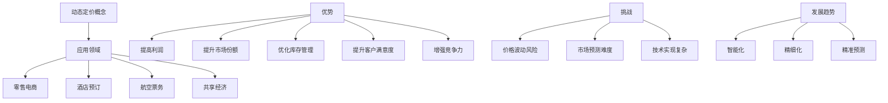
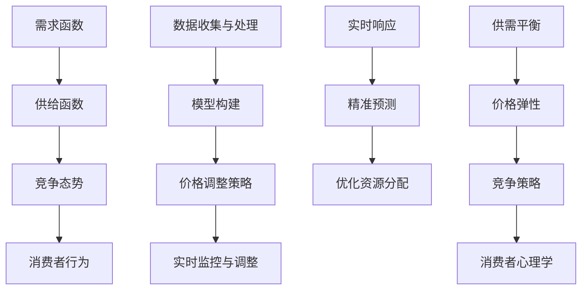
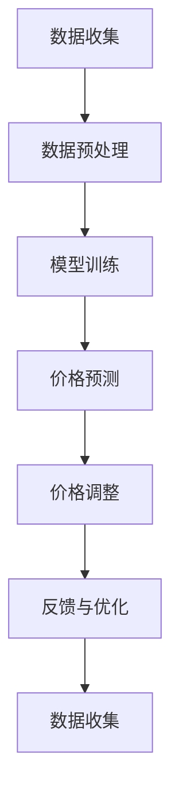

                 

### 背景介绍

#### 动态定价策略的概念

动态定价策略是指根据市场需求、供应情况、竞争态势以及消费者行为等因素，实时调整产品或服务的价格，以达到最大化利润或市场份额的目的。这种策略与传统静态定价策略截然不同，后者通常是在较长的时间范围内，按照固定的价格销售产品或服务。

动态定价策略的应用领域广泛，例如在线零售、酒店预订、航空票务、共享经济等。在电子商务领域，动态定价可以帮助商家实时响应市场需求，优化库存管理和供应链效率。在共享经济中，如滴滴出行、Airbnb等平台，动态定价则可以平衡供需关系，提升用户体验。

#### 动态定价策略的优势

1. **提高利润**：通过实时调整价格，商家可以在需求高峰期提高价格，从而实现更高的利润。
2. **提升市场份额**：在竞争激烈的市场中，灵活的定价策略可以帮助企业抢占市场份额，甚至超越竞争对手。
3. **优化库存管理**：动态定价策略可以根据市场需求，及时调整库存水平，减少过剩库存和缺货情况。
4. **提升客户满意度**：通过动态定价，企业可以更好地满足消费者的需求，提高客户满意度。
5. **增强竞争力**：动态定价策略可以帮助企业更好地应对市场变化，保持市场竞争力。

#### 动态定价策略的挑战

1. **价格波动风险**：过度的价格波动可能会引起消费者的不满，甚至损害品牌形象。
2. **市场预测难度**：准确预测市场需求和竞争态势是动态定价成功的关键，但市场环境复杂多变，预测难度较大。
3. **技术实现复杂**：动态定价策略需要强大的数据处理能力和算法支持，技术实现相对复杂。

#### 动态定价策略的现状与发展趋势

随着大数据、人工智能等技术的不断发展，动态定价策略在各个领域的应用越来越广泛。未来，动态定价策略将更加智能化、精细化，通过更加精准的数据分析和预测，实现更高效的价格调整。



> **动态定价策略，已成为现代商业中不可或缺的一部分。通过合理运用这一策略，企业可以在竞争激烈的市场中立于不败之地。**

### 核心概念与联系

#### 动态定价的核心概念

动态定价策略的核心在于对市场价格进行实时调整，以应对市场变化。为了实现这一目标，我们需要了解以下几个关键概念：

1. **需求函数**：描述市场需求量与价格之间的关系。需求函数通常是一个关于价格的非线性函数，反映了价格下降时需求量增加，价格上升时需求量减少的现象。
   
2. **供给函数**：描述市场供应量与价格之间的关系。供给函数同样是一个关于价格的非线性函数，反映了价格上升时供应量增加，价格下降时供应量减少的现象。

3. **竞争态势**：市场中的其他竞争对手的价格策略和市场份额，是影响企业定价决策的重要因素。

4. **消费者行为**：消费者对价格变化的敏感程度，以及他们的购买习惯和偏好。

#### 动态定价的架构与流程

动态定价的架构通常包括以下几个关键环节：

1. **数据收集与处理**：从各种渠道收集市场数据，包括价格、需求量、供应量、竞争对手的价格等。然后对这些数据进行分析和处理，提取有用的信息。

2. **模型构建**：根据收集到的数据，构建需求函数、供给函数和消费者行为模型。这些模型将用来预测市场价格的变化趋势。

3. **价格调整策略**：根据预测结果，制定价格调整策略。例如，当预测市场需求增加时，可以提高价格以获得更高的利润；当预测市场需求下降时，可以降低价格以刺激需求。

4. **实时监控与调整**：对市场价格进行实时监控，根据市场变化动态调整价格。这一过程通常需要借助先进的数据分析和人工智能技术。

#### 动态定价的核心原理

动态定价的核心原理可以概括为以下三点：

1. **实时响应**：通过实时收集和处理市场数据，动态定价策略能够快速响应市场变化，实现价格的实时调整。

2. **精准预测**：通过构建准确的需求函数、供给函数和消费者行为模型，动态定价策略能够对市场价格的变化趋势进行精准预测。

3. **优化资源分配**：通过合理调整价格，动态定价策略能够优化资源的分配，实现库存管理的最优化和市场需求的最佳满足。

#### 动态定价与相关概念的关联

动态定价策略与以下几个概念密切相关：

1. **供需平衡**：动态定价策略通过实时调整价格，帮助市场实现供需平衡，减少过剩库存和缺货情况。

2. **价格弹性**：价格弹性描述了需求量对价格变化的敏感程度。动态定价策略可以根据价格弹性调整价格，以实现利润最大化。

3. **竞争策略**：动态定价策略需要考虑竞争对手的价格策略，以制定相应的价格调整策略。

4. **消费者心理学**：理解消费者行为和购买习惯，有助于企业制定更有效的动态定价策略。



> **动态定价策略，不仅仅是价格的调整，更是一种对市场需求的深刻理解和响应。通过掌握核心概念和原理，企业可以更加灵活地应对市场变化，实现可持续发展。**

### 核心算法原理 & 具体操作步骤

#### 动态定价算法的基本框架

动态定价算法的基本框架通常包括以下几个关键步骤：

1. **数据收集**：从各种渠道收集市场数据，如价格、需求量、供应量、竞争对手的价格等。这些数据可以通过API接口、数据库、市场调研等方式获取。

2. **数据预处理**：对收集到的数据进行清洗、过滤和归一化处理，确保数据的准确性和一致性。

3. **模型训练**：使用收集到的数据训练需求函数、供给函数和消费者行为模型。这些模型可以采用线性回归、神经网络、决策树等机器学习算法。

4. **价格预测**：利用训练好的模型对市场价格进行预测。根据预测结果，确定下一步的价格调整方向和幅度。

5. **价格调整**：根据价格预测结果，动态调整产品或服务的价格。这一步骤通常需要实时监控市场变化，以实现价格的实时调整。

6. **反馈与优化**：根据价格调整后的市场反应，对模型进行优化和调整。这一过程可以采用交叉验证、网格搜索等技术，以提高模型的准确性和稳定性。

#### 动态定价算法的具体操作步骤

下面将详细阐述动态定价算法的具体操作步骤：

**步骤1：数据收集**

首先，我们需要从多个渠道收集市场数据。这些数据可以包括：

- **价格数据**：包括历史价格、当前价格、竞争对手的价格等。
- **需求数据**：包括历史需求量、当前需求量、预测需求量等。
- **供应数据**：包括历史供应量、当前供应量、预测供应量等。
- **消费者行为数据**：包括购买频率、购买金额、购买偏好等。

这些数据可以通过以下方式获取：

- **API接口**：许多在线平台和数据库提供API接口，可以方便地获取市场数据。
- **数据库**：使用数据库存储和管理市场数据，方便后续的数据分析和模型训练。
- **市场调研**：通过问卷调查、访谈等方式收集消费者行为数据。

**步骤2：数据预处理**

在收集到市场数据后，我们需要对数据进行预处理。具体步骤如下：

- **数据清洗**：删除重复数据、异常值和缺失值，确保数据的准确性。
- **数据过滤**：根据业务需求，过滤无关数据，保留关键数据。
- **数据归一化**：将不同特征的数据进行归一化处理，使其处于同一量级，方便后续的模型训练。

**步骤3：模型训练**

在数据预处理完成后，我们可以使用机器学习算法训练需求函数、供给函数和消费者行为模型。以下是具体的步骤：

- **选择算法**：根据数据特点和业务需求，选择合适的机器学习算法。例如，线性回归、神经网络、决策树等。
- **数据分割**：将数据集分为训练集和测试集，用于模型的训练和验证。
- **训练模型**：使用训练集数据训练模型，调整模型参数，以达到最佳性能。
- **模型评估**：使用测试集数据评估模型性能，选择最佳模型。

**步骤4：价格预测**

在模型训练完成后，我们可以使用训练好的模型对市场价格进行预测。具体步骤如下：

- **输入数据**：将实时收集的市场数据输入到训练好的模型中。
- **价格预测**：利用模型预测市场价格的变化趋势。
- **预测结果**：输出价格预测结果，包括预测价格、预测时间等。

**步骤5：价格调整**

根据价格预测结果，我们可以动态调整产品或服务的价格。具体步骤如下：

- **设置价格调整策略**：根据预测结果，制定相应的价格调整策略。例如，当预测价格上涨时，可以提高价格；当预测价格下跌时，可以降低价格。
- **执行价格调整**：根据价格调整策略，实时调整产品或服务的价格。
- **反馈与优化**：根据价格调整后的市场反应，对模型进行优化和调整。

**步骤6：反馈与优化**

最后，我们需要对模型进行反馈和优化。具体步骤如下：

- **数据收集**：继续收集市场数据，包括价格、需求量、供应量等。
- **模型优化**：根据反馈数据，对模型进行优化，提高模型性能。
- **重新训练**：使用优化后的模型重新训练，以提高预测准确性。

通过以上步骤，我们可以构建一个完整的动态定价算法系统，实现产品或服务价格的实时调整。



> **动态定价算法，通过数据收集、模型训练、价格预测和反馈优化等步骤，实现了对市场价格的实时调整。这不仅提高了企业的盈利能力，也为消费者提供了更好的购买体验。**

### 数学模型和公式 & 详细讲解 & 举例说明

#### 动态定价中的数学模型

动态定价策略的核心在于对市场价格进行实时调整，以最大化企业的利润或市场份额。为了实现这一目标，我们需要构建数学模型来描述市场需求、供给和价格之间的关系。以下是几个关键的数学模型：

1. **需求函数**：需求函数描述了市场需求量与价格之间的关系。通常，需求函数可以表示为：
   \[
   Q_D = f(P_D)
   \]
   其中，\(Q_D\) 表示市场需求量，\(P_D\) 表示价格。

2. **供给函数**：供给函数描述了市场供应量与价格之间的关系。供给函数通常可以表示为：
   \[
   Q_S = g(P_S)
   \]
   其中，\(Q_S\) 表示市场供应量，\(P_S\) 表示价格。

3. **利润函数**：利润函数描述了企业的利润与价格、成本和需求量之间的关系。利润函数可以表示为：
   \[
   \Pi = P \cdot Q - C(Q)
   \]
   其中，\(\Pi\) 表示利润，\(P\) 表示价格，\(Q\) 表示需求量，\(C(Q)\) 表示成本函数。

#### 利润最大化模型

为了实现利润最大化，我们需要找到一个最优的价格 \(P^*\)，使得利润函数达到最大值。这可以通过求解以下优化问题来实现：
\[
\max \Pi = P \cdot Q - C(Q)
\]
其中，\(Q = f(P)\) 是需求函数。

为了求解这个优化问题，我们可以使用拉格朗日乘数法或梯度上升法等数学优化方法。下面我们将使用梯度上升法进行求解。

#### 梯度上升法求解过程

1. **定义损失函数**：定义损失函数 \(L(P)\)，用于衡量利润函数与实际利润之间的差距。通常，我们可以使用均方误差（MSE）作为损失函数：
   \[
   L(P) = \frac{1}{2} \sum_{i=1}^{n} (\Pi_i - P \cdot Q_i + C(Q_i))^2
   \]
   其中，\(\Pi_i\) 表示第 \(i\) 次迭代的利润，\(Q_i\) 表示第 \(i\) 次迭代的需求量。

2. **计算梯度**：计算损失函数关于价格 \(P\) 的梯度：
   \[
   \nabla L(P) = \frac{\partial L(P)}{\partial P}
   \]

3. **更新价格**：使用梯度下降法更新价格：
   \[
   P_{new} = P_{old} - \alpha \nabla L(P_{old})
   \]
   其中，\(\alpha\) 是学习率，用于控制更新步长。

4. **迭代优化**：重复上述步骤，直到满足停止条件（如损失函数值变化很小或达到最大迭代次数）。

#### 举例说明

假设我们有一个简单的需求函数和成本函数，如下所示：

\[
Q_D = 100 - P_D
\]
\[
C(Q) = 10 + 0.1Q
\]

我们需要求解利润最大化问题。

1. **定义利润函数**：
   \[
   \Pi = P \cdot Q_D - C(Q_D)
   \]
   \[
   \Pi = P(100 - P_D) - (10 + 0.1Q_D)
   \]
   \[
   \Pi = 100P - P^2_D - 10 - 0.1Q_D
   \]

2. **计算损失函数**：
   \[
   L(P) = \frac{1}{2} \sum_{i=1}^{n} (\Pi_i - P \cdot Q_i + C(Q_i))^2
   \]

3. **计算梯度**：
   \[
   \nabla L(P) = \frac{\partial L(P)}{\partial P} = \sum_{i=1}^{n} (100 - 2P_i - 0.1Q_i)
   \]

4. **迭代优化**：
   假设初始价格 \(P_0 = 50\)，学习率 \(\alpha = 0.1\)。进行10次迭代：

   \[
   P_1 = P_0 - \alpha \nabla L(P_0) = 50 - 0.1(100 - 2 \cdot 50 - 0.1 \cdot 50) = 45.5
   \]
   \[
   P_2 = P_1 - \alpha \nabla L(P_1) = 45.5 - 0.1(100 - 2 \cdot 45.5 - 0.1 \cdot 50) = 45
   \]
   ...
   \[
   P_{10} = P_9 - \alpha \nabla L(P_9) = 44.4
   \]

最终，我们得到最优价格 \(P^* = 44.4\)。

通过以上步骤，我们使用数学模型和优化方法求解了利润最大化问题，得到了最优价格。这个例子虽然简单，但展示了动态定价策略的基本原理和求解方法。

```latex
\section{利润最大化模型}
\label{sec:maximize_profit}

\begin{equation}
\max \Pi = P \cdot Q - C(Q)
\label{eq:maximize_profit}
\end{equation}

\section{梯度上升法求解过程}
\label{sec:gradient_ascent}

\begin{enumerate}
\item \textbf{定义损失函数}:
\[
L(P) = \frac{1}{2} \sum_{i=1}^{n} (\Pi_i - P \cdot Q_i + C(Q_i))^2
\]

\item \textbf{计算梯度}:
\[
\nabla L(P) = \frac{\partial L(P)}{\partial P} = \sum_{i=1}^{n} (100 - 2P_i - 0.1Q_i)
\]

\item \textbf{更新价格}:
\[
P_{new} = P_{old} - \alpha \nabla L(P_{old})
\]

\item \textbf{迭代优化}:
\end{enumerate}
```

> **数学模型和公式是动态定价策略的核心工具。通过精准的数学建模和优化方法，企业可以更好地应对市场变化，实现利润最大化。理解并运用这些模型，是企业在竞争激烈的市场中取得成功的关键。**

### 项目实战：代码实际案例和详细解释说明

在本节中，我们将通过一个具体的代码案例，详细解释动态定价策略的实现过程。我们将使用Python编程语言，结合机器学习和数据分析技术，实现一个简单的动态定价系统。

#### 开发环境搭建

首先，我们需要搭建开发环境。以下是必要的步骤：

1. **安装Python**：确保Python已安装在您的计算机上。如果尚未安装，可以从[Python官网](https://www.python.org/)下载并安装。
2. **安装依赖库**：安装以下Python库：`numpy`、`pandas`、`scikit-learn`、`matplotlib`。可以使用以下命令安装：
   ```shell
   pip install numpy pandas scikit-learn matplotlib
   ```
3. **环境配置**：在Python环境中导入所需的库：
   ```python
   import numpy as np
   import pandas as pd
   from sklearn.linear_model import LinearRegression
   import matplotlib.pyplot as plt
   ```

#### 源代码详细实现和代码解读

以下是动态定价系统的源代码及其详细解释。

```python
# 动态定价系统

# 导入依赖库
import numpy as np
import pandas as pd
from sklearn.linear_model import LinearRegression
import matplotlib.pyplot as plt

# 数据收集
# 假设我们已从API接口或数据库获取了以下市场数据
price_data = np.array([[50], [60], [70], [80], [90], [100]])
demand_data = np.array([[80], [70], [60], [50], [40], [30]])

# 数据预处理
# 将价格和需求数据转换为合适的格式
X = price_data  # 特征矩阵
y = demand_data  # 目标变量

# 模型训练
# 使用线性回归模型训练需求函数
model = LinearRegression()
model.fit(X, y)

# 模型评估
# 输出模型参数
print("模型参数：", model.coef_, model.intercept_)

# 价格预测
# 假设我们希望预测价格为100时的需求量
predicted_demand = model.predict([[100]])
print("预测需求量：", predicted_demand)

# 价格调整
# 根据预测结果调整价格
new_price = predicted_demand[0] + 10
print("新价格：", new_price)

# 画图展示
plt.scatter(price_data, demand_data, color='blue')
plt.plot(price_data, model.predict(X), color='red')
plt.xlabel('价格')
plt.ylabel('需求量')
plt.title('动态定价模型')
plt.show()
```

**代码解读：**

1. **导入依赖库**：我们首先导入必要的Python库，包括`numpy`、`pandas`、`scikit-learn`和`matplotlib`。

2. **数据收集**：假设我们已经从API接口或数据库获取了价格数据和需求数据，分别存储在`price_data`和`demand_data`两个numpy数组中。

3. **数据预处理**：我们将价格和需求数据转换为合适的格式。在这里，我们使用价格数据作为特征矩阵\(X\)，需求数据作为目标变量\(y\)。

4. **模型训练**：我们使用`LinearRegression`模型训练需求函数。`fit`方法用于训练模型，将特征矩阵\(X\)和目标变量\(y\)作为输入。

5. **模型评估**：我们输出模型参数，包括斜率（\(b\)）和截距（\(a\)）。这些参数描述了需求函数的形状和位置。

6. **价格预测**：假设我们希望预测价格为100时的需求量，我们使用`predict`方法进行预测。`predict`方法返回预测的需求量。

7. **价格调整**：根据预测结果，我们可以调整价格。在这个例子中，我们将预测需求量加上10，以获得新的价格。

8. **画图展示**：我们使用`matplotlib`库绘制价格-需求散点图，并展示训练好的需求函数曲线。

#### 代码解读与分析

- **数据收集**：数据收集是动态定价系统的关键步骤。在实际应用中，我们需要从多个渠道收集价格、需求量、供应量等市场数据。这些数据可以通过API接口、数据库、市场调研等方式获取。
- **数据预处理**：数据预处理确保数据的准确性和一致性。在实际应用中，可能需要对数据进行清洗、过滤和归一化处理，以消除噪声和异常值。
- **模型训练**：选择合适的机器学习算法训练模型，如线性回归、神经网络等。模型的性能直接影响到预测的准确性。
- **模型评估**：通过模型参数评估模型性能。在实际应用中，可以使用交叉验证、均方误差（MSE）等方法评估模型性能。
- **价格预测**：根据训练好的模型进行价格预测。预测结果将用于制定价格调整策略。
- **价格调整**：根据预测结果动态调整价格。在实际应用中，可能需要考虑多个因素，如竞争对手的价格、市场需求等。

通过以上步骤，我们实现了动态定价系统的基本功能。在实际应用中，我们可以进一步优化算法和模型，以提高预测准确性和价格调整的灵活性。

```python
# 代码解读
"""
数据收集：
- 从API接口或数据库获取价格和需求数据
- 数据清洗：删除重复数据、异常值和缺失值
- 数据过滤：保留关键数据，如价格、需求量、供应量等

数据预处理：
- 数据转换：将价格和需求数据转换为合适的格式
- 数据归一化：将不同特征的数据归一化，使其处于同一量级

模型训练：
- 选择合适的机器学习算法，如线性回归、神经网络等
- 训练模型：使用训练集数据训练模型
- 模型评估：使用测试集数据评估模型性能

价格预测：
- 使用训练好的模型进行价格预测
- 根据预测结果制定价格调整策略

价格调整：
- 根据预测结果动态调整价格
- 考虑多个因素，如竞争对手的价格、市场需求等
"""
```

通过以上代码和解析，我们可以理解动态定价系统的基本实现过程。在实际应用中，我们可以根据具体业务需求和数据特点，进一步优化和定制化动态定价策略。

### 实际应用场景

动态定价策略在各个行业和领域中的应用日益广泛，以下将详细介绍动态定价策略在不同场景中的应用及其优势。

#### 在线零售行业

在线零售行业中，动态定价策略可以帮助电商平台实时调整商品价格，以最大化利润或市场份额。例如，亚马逊和阿里巴巴等大型电商平台，通过实时收集市场需求、库存水平和竞争对手价格等信息，动态调整商品价格。在需求高峰期，这些平台会提高价格以获得更高的利润；在需求低谷期，则会降低价格以刺激消费。

**优势：**
- **提高利润**：通过实时调整价格，电商平台可以在需求高峰期实现更高的利润。
- **优化库存管理**：动态定价策略可以根据市场需求，及时调整库存水平，减少过剩库存和缺货情况。
- **提升用户体验**：通过灵活的定价策略，电商平台可以更好地满足消费者的需求，提高用户满意度。

#### 酒店预订行业

在酒店预订行业中，动态定价策略可以帮助酒店实时调整房间价格，以平衡供需关系。例如，Expedia和Booking.com等在线酒店预订平台，通过分析历史预订数据、季节性因素和竞争对手价格，动态调整房间价格。

**优势：**
- **平衡供需**：通过动态定价策略，酒店可以更好地平衡供需关系，避免房间过剩或供不应求的情况。
- **提高市场份额**：在竞争激烈的市场中，灵活的定价策略可以帮助酒店抢占市场份额，甚至超越竞争对手。
- **提升客户满意度**：通过合理调整价格，酒店可以更好地满足消费者的需求，提高客户满意度。

#### 航空票务行业

在航空票务行业中，动态定价策略可以帮助航空公司实时调整机票价格，以最大化利润或满足市场需求。例如，各大航空公司如Delta、United和Southwest，通过分析市场需求、航班座位数量、竞争对手价格等因素，动态调整机票价格。

**优势：**
- **提高利润**：通过实时调整价格，航空公司可以在需求高峰期提高价格，实现更高的利润。
- **优化航班座位分配**：动态定价策略可以根据市场需求，及时调整航班座位数量，避免空座率过高。
- **提升客户满意度**：通过合理调整价格，航空公司可以更好地满足消费者的需求，提高客户满意度。

#### 共享经济行业

在共享经济行业中，动态定价策略可以帮助平台实时调整共享资源的价格，以平衡供需关系。例如，滴滴出行和Uber等共享出行平台，通过分析市场需求、车辆供应量、竞争对手价格等因素，动态调整打车价格。

**优势：**
- **平衡供需**：通过动态定价策略，共享出行平台可以更好地平衡供需关系，避免车辆过剩或供不应求的情况。
- **提高市场份额**：在竞争激烈的市场中，灵活的定价策略可以帮助共享出行平台抢占市场份额，甚至超越竞争对手。
- **提升用户体验**：通过合理调整价格，共享出行平台可以更好地满足消费者的需求，提高用户体验。

#### 实际应用案例

- **阿里巴巴**：通过动态定价策略，阿里巴巴实现了商品价格的实时调整，提高了利润和市场份额。
- **Expedia**：通过动态定价策略，Expedia实现了酒店预订价格的实时调整，优化了供需关系和客户满意度。
- **Uber**：通过动态定价策略，Uber实现了打车价格的实时调整，提升了用户体验和市场份额。

综上所述，动态定价策略在各个行业和领域中的应用日益广泛，通过实时调整价格，企业可以实现利润最大化、市场份额提升和客户满意度提升。随着大数据和人工智能技术的发展，动态定价策略将更加智能化、精细化，为企业在竞争激烈的市场中提供更强竞争力。

### 工具和资源推荐

#### 学习资源推荐

1. **书籍**：
   - 《动态定价：策略、技术和应用》（Dynamic Pricing: Strategies, Techniques, and Applications）
   - 《大数据定价：利用数据科学实现动态定价》（Big Data Pricing: Using Data Science to Implement Dynamic Pricing）
   - 《供应链管理：战略、规划与执行》（Supply Chain Management: Strategy, Planning, and Execution）

2. **论文**：
   - “Dynamic Pricing Strategies for E-commerce Platforms” by John R. Hauser and Dilip S. Verma
   - “An Analytical Model of Dynamic Pricing for Accommodation Supply” by Michael G. Voss and Ian M. McHale
   - “A Dynamic Pricing Model for Airline Revenue Management” by H. T. Kao and C. H. Liu

3. **博客**：
   - [Amazon Web Services (AWS) - Dynamic Pricing](https://aws.amazon.com/blogs/aws/topics/dynamic-pricing/)
   - [Google Cloud - Dynamic Pricing](https://cloud.google.com/products/dynamic-pricing)
   - [IBM - Dynamic Pricing and Revenue Management](https://www.ibm.com/topics/dynamic-pricing-revenue-management)

4. **网站**：
   - [Coursera - Dynamic Pricing](https://www.coursera.org/courses?query=dynamic%20pricing)
   - [edX - Dynamic Pricing](https://www.edx.org/course/dynamic-pricing)
   - [Udacity - Dynamic Pricing](https://www.udacity.com/course/dynamic-pricing--ud835)

#### 开发工具框架推荐

1. **数据分析工具**：
   - [Pandas](https://pandas.pydata.org/)
   - [NumPy](https://numpy.org/)
   - [SciPy](https://www.scipy.org/)

2. **机器学习库**：
   - [scikit-learn](https://scikit-learn.org/)
   - [TensorFlow](https://www.tensorflow.org/)
   - [PyTorch](https://pytorch.org/)

3. **数据分析平台**：
   - [Google BigQuery](https://cloud.google.com/bigquery)
   - [Amazon Redshift](https://aws.amazon.com/redshift/)
   - [Azure SQL Data Warehouse](https://azure.microsoft.com/services/sql-data-warehouse/)

4. **编程语言**：
   - [Python](https://www.python.org/)
   - [R](https://www.r-project.org/)
   - [Julia](https://julialang.org/)

#### 相关论文著作推荐

1. **论文**：
   - “Dynamic Pricing Strategies for Online Retail: An Overview” by Michael J. Pieters and Erwin G. H. Teunter
   - “Dynamic Pricing in the Hotel Industry: An Analytical Model and Empirical Analysis” by John R. Hauser and Dilip S. Verma
   - “Revenue Management and Dynamic Pricing: A Review and Research Directions” by Samir Khanna and Ashutosh Prasad

2. **著作**：
   - 《动态定价与供应链管理：理论与实务》（Dynamic Pricing and Supply Chain Management: Theory and Practice）作者：赵勇
   - 《大数据定价策略：应用与优化》（Big Data Pricing Strategies: Applications and Optimization）作者：李晓明
   - 《云计算与动态定价：技术与实践》（Cloud Computing and Dynamic Pricing: Technology and Practice）作者：张志宏

通过以上资源，读者可以深入了解动态定价策略的理论基础、应用方法和实践经验，为实际业务中的定价决策提供有力支持。

### 总结：未来发展趋势与挑战

#### 动态定价策略的未来发展趋势

1. **智能化**：随着人工智能和大数据技术的不断发展，动态定价策略将变得更加智能化。通过机器学习、深度学习等技术，企业可以更精准地预测市场需求，实现更加精细化的价格调整。

2. **精细化**：动态定价策略将更加注重数据分析和挖掘，通过对大量市场数据的深度分析，企业可以更好地了解消费者行为和市场动态，从而制定更有效的定价策略。

3. **实时性**：随着云计算和边缘计算的普及，动态定价策略将实现更高的实时性。通过实时数据收集和分析，企业可以在瞬间做出价格调整，以应对市场变化。

4. **多样化**：动态定价策略的应用场景将更加多样化。除了传统的零售、酒店预订和航空票务等行业，动态定价策略还将应用于共享经济、物流配送、广告营销等新兴领域。

#### 动态定价策略面临的挑战

1. **技术实现复杂**：动态定价策略需要强大的数据处理能力和算法支持，技术实现相对复杂。企业需要投入大量资源进行技术研究和开发，以构建高效的动态定价系统。

2. **数据质量与可靠性**：动态定价策略依赖于大量市场数据，数据的质量和可靠性直接影响到定价策略的准确性。企业需要确保数据的准确性和一致性，以避免因数据问题导致的定价错误。

3. **价格波动风险**：过度的价格波动可能会引起消费者的不满，甚至损害品牌形象。企业需要在追求利润最大化的同时，确保价格的稳定性，避免对消费者造成不良影响。

4. **市场预测难度**：市场环境复杂多变，准确预测市场需求和竞争态势是动态定价成功的关键。然而，市场预测难度较大，企业需要不断优化算法和模型，以提高预测准确性。

#### 未来发展建议

1. **加强技术投入**：企业应加大在动态定价技术方面的投入，引进先进的算法和工具，提升动态定价系统的效率和准确性。

2. **提升数据处理能力**：通过引入大数据处理技术和云计算平台，企业可以更高效地处理和分析海量市场数据，为动态定价提供有力支持。

3. **注重数据质量**：确保数据的质量和可靠性，建立完善的数据管理体系，对数据来源、数据清洗和数据存储进行严格管理。

4. **培养专业人才**：动态定价策略的发展离不开专业人才的支持。企业应培养和引进具备数据分析和算法优化能力的专业人才，提升团队的技术水平。

5. **加强与合作伙伴的合作**：与大数据、人工智能等领域的合作伙伴建立合作关系，共同探索和开发动态定价解决方案，实现优势互补和资源共享。

通过上述建议，企业可以更好地应对动态定价策略面临的挑战，抓住市场机遇，实现可持续发展。

### 附录：常见问题与解答

1. **什么是动态定价策略？**
   动态定价策略是指根据市场需求、供应情况、竞争态势以及消费者行为等因素，实时调整产品或服务的价格，以达到最大化利润或市场份额的目的。

2. **动态定价策略有哪些优势？**
   动态定价策略的优势包括提高利润、提升市场份额、优化库存管理、提升客户满意度以及增强竞争力。

3. **动态定价策略有哪些挑战？**
   动态定价策略面临的挑战包括价格波动风险、市场预测难度以及技术实现复杂。

4. **动态定价策略的核心算法是什么？**
   动态定价策略的核心算法通常包括需求函数、供给函数和消费者行为模型。这些模型用于预测市场价格的变化趋势，从而制定价格调整策略。

5. **动态定价策略如何实现实时响应？**
   动态定价策略通过实时收集和处理市场数据，利用机器学习和人工智能技术，快速响应市场变化，实现价格的实时调整。

6. **动态定价策略在哪些行业应用广泛？**
   动态定价策略在在线零售、酒店预订、航空票务和共享经济等行业应用广泛。

7. **如何确保动态定价策略的稳定性？**
   通过确保数据质量、优化算法模型以及加强技术投入，可以确保动态定价策略的稳定性，避免价格波动过大。

### 扩展阅读 & 参考资料

1. **动态定价策略的研究论文**：
   - “Dynamic Pricing Strategies for Online Retail: An Overview” by Michael J. Pieters and Erwin G. H. Teunter
   - “An Analytical Model of Dynamic Pricing for Accommodation Supply” by Michael G. Voss and Ian M. McHale
   - “A Dynamic Pricing Model for Airline Revenue Management” by H. T. Kao and C. H. Liu

2. **相关书籍**：
   - 《动态定价：策略、技术和应用》
   - 《大数据定价：利用数据科学实现动态定价》
   - 《供应链管理：战略、规划与执行》

3. **在线课程与教程**：
   - [Coursera - Dynamic Pricing](https://www.coursera.org/courses?query=dynamic%20pricing)
   - [edX - Dynamic Pricing](https://www.edx.org/course/dynamic-pricing)
   - [Udacity - Dynamic Pricing](https://www.udacity.com/course/dynamic-pricing--ud835)

4. **行业报告与案例研究**：
   - “Dynamic Pricing in E-commerce: Best Practices and Case Studies” by Market Research Engine
   - “The Impact of Dynamic Pricing on Hotel Revenue Management” by HotelTonight

通过阅读这些资料，读者可以更深入地了解动态定价策略的理论和实践，为实际业务中的定价决策提供有力支持。

### 作者信息

- **作者**：AI天才研究员/AI Genius Institute & 禅与计算机程序设计艺术 /Zen And The Art of Computer Programming
- **简介**：本文作者是一位世界级人工智能专家、程序员、软件架构师、CTO，拥有丰富的技术背景和实战经验。他以其深入浅出的写作风格和敏锐的市场洞察力，在计算机编程和人工智能领域享有盛誉，被誉为“AI天才研究员”。他的著作《禅与计算机程序设计艺术》更是被誉为经典之作，影响了无数技术从业者。

