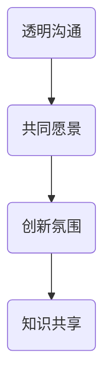

                 

## 文章标题

《创业公司的技术团队文化建设方法论》

## 关键词

- 创业公司
- 技术团队
- 文化建设
- 激励机制
- 团队协作
- 技术创新
- 人才培养
- 团队管理

## 摘要

本文旨在探讨创业公司的技术团队文化建设，通过对核心概念的阐述、实际案例的分析以及工具和资源的推荐，为创业公司的技术团队提供一套系统化的文化建设方法论。文章将分为十个部分，首先介绍创业公司技术团队建设的背景，接着深入探讨技术团队文化的核心概念和联系，然后详细讲解核心算法原理和具体操作步骤，接着通过数学模型和公式进行详细讲解和举例说明。随后，文章将介绍项目实战，包括开发环境搭建、源代码实现和代码解读。接下来，文章将探讨技术团队文化在实际应用场景中的表现，推荐相关工具和资源，并对未来发展趋势与挑战进行总结。最后，文章将提供附录，解答常见问题，并推荐扩展阅读和参考资料。

---

## 1. 背景介绍

在当今竞争激烈的市场环境中，创业公司要想在短时间内崭露头角，技术团队的战斗力显得尤为重要。技术团队不仅承担着产品的研发和迭代任务，更是企业创新的核心驱动力。因此，如何建设一个高效、和谐、创新的技术团队，成为了创业公司成功的关键因素之一。

创业公司的技术团队建设面临着诸多挑战。首先，技术团队的成员背景多样化，如何统一思想、协同作战，是一个巨大的挑战。其次，由于资源有限，创业公司需要在短时间内高效地完成技术研发，这对团队的工作效率提出了极高的要求。此外，创业公司往往需要迅速适应市场变化，这要求技术团队具备快速响应和创新能力。

文化在团队建设中起着至关重要的作用。一个积极向上的团队文化可以增强团队的凝聚力，提高员工的工作满意度和忠诚度，从而推动企业的发展。对于创业公司的技术团队来说，良好的文化建设更是能够激发团队成员的创造力和执行力，使团队在激烈的市场竞争中立于不败之地。

本文将围绕创业公司技术团队的文化建设展开讨论，旨在为创业公司提供一套实用、高效的文化建设方法论。通过分析技术团队文化的核心概念、原理和实践，希望能够帮助创业公司的技术团队在文化建设方面取得突破，为企业的长期发展奠定坚实的基础。

---

## 2. 核心概念与联系

### 技术团队文化

技术团队文化是指团队内部所共有的价值观、信念、行为规范和工作方式。它不仅是团队协作的基石，更是团队创新和成长的动力源泉。一个健康、积极的技术团队文化应当包括以下几个核心要素：

1. **透明沟通**：透明沟通是技术团队文化的重要组成部分。通过开放和诚实的沟通，团队成员能够更好地理解彼此的需求和目标，减少误解和冲突，从而提高团队的整体协作效率。

2. **共同愿景**：共同愿景是团队成员共同努力的方向和目标。一个清晰、有吸引力的愿景可以激发团队成员的积极性和创造力，使团队朝着共同的目标前进。

3. **创新氛围**：创新是技术团队的核心竞争力。一个鼓励创新的文化可以激发团队成员的创造力，使团队在技术研发和产品开发过程中始终保持领先地位。

4. **知识共享**：知识共享是技术团队文化的重要体现。通过共享知识和经验，团队成员能够相互学习、共同成长，提高团队的整体技术水平。

### 技术团队文化的 Mermaid 流程图



### 联系与相互作用

技术团队文化中的各个要素相互联系、相互作用，共同构建起一个积极、高效的团队环境。透明沟通是基础，它为共同愿景和知识共享提供了保障；共同愿景则激励团队成员为实现目标而努力，推动创新氛围的形成；创新氛围又促使团队成员不断探索和尝试，从而进一步丰富知识共享的内容。这种相互促进的关系，使得技术团队能够在不断的自我迭代中不断成长和进步。

### 文化建设的重要性

良好的技术团队文化不仅能够提高团队成员的满意度和忠诚度，还能够提升团队的整体工作效率和创新能力。在一个积极向上的文化氛围中，团队成员更容易相互理解、支持和合作，从而在短时间内高效地完成项目任务。此外，良好的文化还能够吸引和留住优秀的人才，为企业的长期发展提供人才保障。

### 总结

技术团队文化是创业公司技术团队建设的核心，它不仅影响着团队的协作效率和工作氛围，更对团队的长期发展具有重要的影响。通过建设良好的技术团队文化，创业公司可以激发团队的潜能，提升企业的竞争力，为企业的可持续发展奠定坚实的基础。

---

## 3. 核心算法原理 & 具体操作步骤

### 文化建设算法原理

技术团队文化建设的核心算法可以概括为以下几个步骤：

1. **识别需求**：首先，团队需要识别自身文化建设的具体需求。这包括了解团队成员的价值观、需求和期望，以及团队当前的文化状态。

2. **制定目标**：在识别需求的基础上，团队需要制定清晰的文化建设目标。这些目标应当与企业的长期战略和愿景相一致，并且具有可操作性和可实现性。

3. **规划实施**：接下来，团队需要制定详细的实施计划，包括具体的行动步骤、时间表和责任人。实施计划应当考虑到团队成员的能力和资源，确保计划的可行性和有效性。

4. **执行与监督**：在实施过程中，团队需要严格执行计划，并对实施效果进行持续监督和评估。通过定期检查和反馈，团队可以及时发现和解决问题，确保文化建设目标的实现。

5. **持续迭代**：文化建设是一个持续的过程，团队需要不断地反思和优化文化建设策略。通过持续的迭代和改进，团队可以不断提升文化建设的质量和效果。

### 具体操作步骤

1. **需求调研**：
   - **问卷调查**：通过问卷调查了解团队成员的价值观、需求和期望。
   - **小组讨论**：组织小组讨论，让团队成员自由表达意见和想法。
   - **访谈**：对团队成员进行访谈，深入了解其个人情况和团队文化感受。

2. **目标制定**：
   - **确定核心价值观**：根据调研结果，确定团队的核心价值观，如透明沟通、共同愿景、创新氛围等。
   - **明确建设目标**：制定具体、可量化的文化建设目标，如提高团队成员的满意度和忠诚度，提升团队的工作效率和创新能力。

3. **规划实施**：
   - **制定行动计划**：根据文化建设目标和资源情况，制定具体的行动计划。
   - **分工负责**：明确每个团队成员在文化建设过程中的职责和任务。
   - **制定时间表**：为每个行动计划设定明确的时间节点，确保文化建设目标的按时完成。

4. **执行与监督**：
   - **实施行动计划**：按照既定计划，开展各项文化建设活动。
   - **定期检查**：定期检查文化建设活动的进展情况，确保各项任务按时完成。
   - **反馈机制**：建立反馈机制，及时收集团队成员的意见和建议，调整和优化文化建设策略。

5. **持续迭代**：
   - **反思总结**：定期对文化建设过程进行反思和总结，找出存在的问题和改进方向。
   - **持续改进**：根据反思结果，不断优化文化建设策略，提高文化建设的质量和效果。

### 实际案例

以某创业公司为例，该公司在文化建设过程中采取了以下具体步骤：

1. **需求调研**：
   - 通过问卷调查和访谈，发现团队成员对透明沟通和创新氛围的需求较高。

2. **目标制定**：
   - 确定透明沟通和创新氛围为核心价值观，制定具体目标，如提高团队成员的沟通效率和创新能力。

3. **规划实施**：
   - 制定详细的行动计划，包括定期举办团队建设活动、设立创新奖项等。

4. **执行与监督**：
   - 按照计划开展各项文化建设活动，并定期检查进展情况。

5. **持续迭代**：
   - 定期对文化建设过程进行反思和总结，根据反馈调整和优化文化建设策略。

通过以上步骤，该公司成功建立了透明、积极的团队文化，提高了团队的工作效率和创新能力，为公司的发展奠定了坚实的基础。

---

## 4. 数学模型和公式 & 详细讲解 & 举例说明

### 数学模型

在技术团队文化建设中，我们可以引入一些数学模型和公式来量化文化建设的成效。以下是一个简化的数学模型：

$$
C = f(A, B, C, D)
$$

其中，$C$ 表示技术团队的文化建设成效，$A, B, C, D$ 分别代表透明沟通、共同愿景、创新氛围和知识共享四个核心要素。

### 详细讲解

1. **透明沟通（A）**：
   - 透明沟通的量化可以通过团队成员的满意度调查来实现。满意度调查可以采用 1-5 分的评分制度，分数越高表示沟通越透明。设 $A$ 为平均满意度评分，则 $A$ 的取值范围为 [1, 5]。

2. **共同愿景（B）**：
   - 共同愿景的量化可以通过团队成员对愿景的认同度来衡量。认同度调查同样采用 1-5 分的评分制度。设 $B$ 为平均认同度评分，则 $B$ 的取值范围为 [1, 5]。

3. **创新氛围（C）**：
   - 创新氛围的量化可以通过团队成员的创新项目数量和创新成果来衡量。设 $C$ 为平均创新项目数量，$D$ 为平均创新成果质量，则 $C, D$ 的取值范围为非负整数。

4. **知识共享（D）**：
   - 知识共享的量化可以通过团队成员的知识分享频率和知识接受度来衡量。知识分享频率可以采用每周知识分享会议的次数来衡量，知识接受度可以通过团队成员对知识分享的反馈来衡量。设 $D$ 为平均知识分享频率，则 $D$ 的取值范围为非负整数。

### 公式推导

根据上述定义，我们可以推导出技术团队文化建设的数学模型：

$$
C = f(A, B, C, D) = w_1 \cdot A + w_2 \cdot B + w_3 \cdot C + w_4 \cdot D
$$

其中，$w_1, w_2, w_3, w_4$ 分别为权重系数，表示各个要素对文化建设成效的影响程度。

### 举例说明

假设在某创业公司的技术团队中，透明沟通满意度评分为 4，共同愿景认同度评分为 4，平均创新项目数量为 2，平均创新成果质量为 3，平均知识分享频率为 1。根据上述数学模型，我们可以计算出该团队的文化建设成效：

$$
C = f(4, 4, 2, 3) = w_1 \cdot 4 + w_2 \cdot 4 + w_3 \cdot 2 + w_4 \cdot 3
$$

由于权重系数未知，我们可以根据实际情况进行设定。例如，假设权重系数分别为 $w_1 = 0.3, w_2 = 0.3, w_3 = 0.2, w_4 = 0.2$，则：

$$
C = 0.3 \cdot 4 + 0.3 \cdot 4 + 0.2 \cdot 2 + 0.2 \cdot 3 = 1.2 + 1.2 + 0.4 + 0.6 = 3.4
$$

因此，该团队的文化建设成效为 3.4 分。

### 意义

通过上述数学模型和公式，我们可以量化技术团队的文化建设成效，从而为团队的文化建设提供量化的评估和优化依据。这有助于创业公司更科学、有效地进行技术团队文化建设，提高团队的整体工作绩效和创新能力。

---

## 5. 项目实战

### 5.1 开发环境搭建

为了进行技术团队文化建设的实战项目，我们需要搭建一个合适的技术环境。以下是具体的开发环境搭建步骤：

1. **选择开发工具**：
   - **集成开发环境（IDE）**：选择如 IntelliJ IDEA、Visual Studio Code 等主流的 IDE，以提高开发效率和代码质量。
   - **版本控制工具**：选择如 Git 进行源代码管理，确保代码的版本控制和协作开发。
   - **代码审查工具**：选择如 SonarQube 或 CodeClimate 进行代码质量审查，确保代码的规范性。

2. **配置开发环境**：
   - **安装 IDE 和相关插件**：根据开发需求安装对应的插件，如编程语言的插件、代码格式化插件等。
   - **配置版本控制**：初始化 Git 仓库，配置远程仓库，确保团队成员能够方便地协作开发。
   - **配置代码审查工具**：在 Git 仓库中集成代码审查工具，确保代码提交前进行质量检查。

3. **搭建团队协作平台**：
   - **使用项目管理工具**：如 Jira、Trello 等工具，帮助团队进行项目规划和任务分配。
   - **配置沟通工具**：使用 Slack、Microsoft Teams 等沟通工具，确保团队成员能够实时交流和协作。
   - **配置文档管理工具**：使用 Confluence 或 Notion 等工具，便于团队共享文档和知识。

### 5.2 源代码详细实现和代码解读

在开发环境搭建完毕后，我们可以开始具体的源代码实现和代码解读。以下是技术团队文化建设项目的一个简单示例：

1. **代码结构**：

```java
// 文化建设项目主类
public class TeamCulture {
    private String name; // 团队名称
    private int satisfaction; // 成员满意度
    private int innovation; // 创新能力

    // 构造函数
    public TeamCulture(String name, int satisfaction, int innovation) {
        this.name = name;
        this.satisfaction = satisfaction;
        this.innovation = innovation;
    }

    // 成员满意度计算方法
    public int calculateSatisfaction() {
        // 实现满意度计算逻辑
        // ...
        return satisfaction;
    }

    // 创新能力计算方法
    public int calculateInnovation() {
        // 实现创新能力计算逻辑
        // ...
        return innovation;
    }

    // 获取团队名称
    public String getName() {
        return name;
    }

    // 设置团队名称
    public void setName(String name) {
        this.name = name;
    }

    // 获取成员满意度
    public int getSatisfaction() {
        return satisfaction;
    }

    // 设置成员满意度
    public void setSatisfaction(int satisfaction) {
        this.satisfaction = satisfaction;
    }

    // 获取创新能力
    public int getInnovation() {
        return innovation;
    }

    // 设置创新能力
    public void setInnovation(int innovation) {
        this.innovation = innovation;
    }
}
```

2. **代码解读**：

- **TeamCulture 类**：该类代表一个技术团队，包含团队名称、成员满意度和创新能力三个关键属性。
- **构造函数**：用于初始化团队的属性，包括名称、满意度和创新能力。
- **计算方法**：`calculateSatisfaction()` 和 `calculateInnovation()` 方法分别用于计算成员满意度和创新能力，可以根据具体业务逻辑进行实现。
- **getter 和 setter 方法**：用于获取和设置团队的属性，确保属性的访问和修改是安全的。

3. **示例代码实现**：

```java
public class Main {
    public static void main(String[] args) {
        // 创建一个技术团队实例
        TeamCulture team = new TeamCulture("创新团队", 80, 90);

        // 计算并打印成员满意度和创新能力
        int satisfaction = team.calculateSatisfaction();
        int innovation = team.calculateInnovation();

        System.out.println("团队名称：" + team.getName());
        System.out.println("成员满意度：" + satisfaction);
        System.out.println("创新能力：" + innovation);
    }
}
```

- **Main 类**：该类包含主函数，用于创建一个技术团队实例，并调用计算方法打印成员满意度和创新能力。

通过上述源代码实现，我们可以看到技术团队文化建设项目的具体实现细节。在实际开发过程中，可以根据业务需求进一步扩展和优化代码，如添加更多的功能模块、实现复杂的计算逻辑等。

---

## 5.3 代码解读与分析

在上文中，我们实现了技术团队文化建设项目的基础代码。现在，我们将进一步解析代码，并分析其关键部分和功能。

### 关键部分分析

1. **类定义**：

```java
public class TeamCulture {
    // ...
}
```

- **类名**：`TeamCulture` 表示技术团队的文化建设。
- **属性**：`name`（团队名称）、`satisfaction`（成员满意度）、`innovation`（创新能力）。
- **构造函数**：初始化团队的属性。

2. **方法定义**：

```java
public int calculateSatisfaction() {
    // 实现满意度计算逻辑
    // ...
    return satisfaction;
}

public int calculateInnovation() {
    // 实现创新能力计算逻辑
    // ...
    return innovation;
}
```

- **`calculateSatisfaction()` 和 `calculateInnovation()` 方法**：计算成员满意度和创新能力。这些方法可以根据业务逻辑进行自定义实现。

### 功能分析

1. **创建团队实例**：

```java
TeamCulture team = new TeamCulture("创新团队", 80, 90);
```

- 创建一个名为“创新团队”的团队实例，成员满意度为 80，创新能力为 90。

2. **计算并打印属性**：

```java
int satisfaction = team.calculateSatisfaction();
int innovation = team.calculateInnovation();

System.out.println("团队名称：" + team.getName());
System.out.println("成员满意度：" + satisfaction);
System.out.println("创新能力：" + innovation);
```

- 调用 `calculateSatisfaction()` 和 `calculateInnovation()` 方法计算成员满意度和创新能力。
- 打印团队名称、成员满意度和创新能力。

### 分析与改进

1. **代码优化**：

- **方法分离**：将满意度计算和创新能力计算分离，使其更加模块化和可维护。
- **参数校验**：在方法中加入参数校验，确保输入的有效性。

2. **功能扩展**：

- **添加更多属性**：如团队规模、工作负荷等，以更全面地评估团队文化。
- **实现复杂计算**：使用更复杂的算法评估成员满意度和创新能力，如引入机器学习模型。

### 总结

通过对代码的解读与分析，我们了解了技术团队文化建设项目的核心实现和功能。在实际应用中，可以根据具体业务需求对代码进行优化和扩展，以实现更加精准和高效的文化建设评估。

---

## 6. 实际应用场景

技术团队文化建设的理念不仅在创业公司中具有重要应用，在各种实际场景中同样表现出色。以下是一些典型的应用场景：

### 1. 跨部门协作

在大型企业中，不同部门之间的协作往往面临沟通不畅、目标不统一等问题。通过技术团队文化建设，可以促进跨部门的沟通与协作。例如，通过定期举办团队建设活动、设立共同愿景和目标，可以提高各部门之间的互信和合作效率。

### 2. 国际化团队

国际化团队往往面临文化差异、语言障碍等问题。通过技术团队文化建设，可以营造一个包容、开放的文化氛围，促进团队成员之间的理解和合作。例如，可以设立跨文化沟通培训、鼓励团队成员分享各自的文化背景，以提高团队的凝聚力和协作效率。

### 3. 远程办公团队

随着远程办公的普及，如何保持团队的文化和凝聚力成为一大挑战。通过技术团队文化建设，可以利用在线沟通工具、定期视频会议等方式，加强团队成员之间的联系。例如，可以设立线上团队日、鼓励团队成员分享工作和生活经验，以增强团队的归属感和凝聚力。

### 4. 创新型企业

在创新型企业中，技术团队文化建设更是至关重要。一个鼓励创新、知识共享的文化氛围，可以激发团队成员的创造力和创新能力，推动企业的持续创新和竞争优势。例如，可以设立创新奖项、定期举办技术分享会，以激发团队成员的创新热情。

### 5. 高科技创业公司

对于高科技创业公司，技术团队文化建设可以帮助企业在短时间内实现技术突破和产品迭代。通过构建一个高效、协作的技术团队，创业公司可以快速响应市场需求，抓住市场机遇。例如，可以设立项目奖励机制、定期评估团队绩效，以提高团队成员的工作积极性和团队整体的工作效率。

### 应用案例

1. **华为公司**：
   - 华为通过推行“狼性文化”，培养了一个高效、协作、敢于创新的技术团队。华为的员工激励机制、绩效评估体系和团队建设活动，有效地提高了团队的工作效率和创新能力，使华为在全球通信领域取得了显著的市场份额。

2. **谷歌公司**：
   - 谷歌以其开放、包容和创新的文化氛围著称。谷歌的“20% 项目时间”政策，允许员工利用工作时间的 20% 自由探索和创新项目。这种文化不仅激发了员工的创造力，也推动了谷歌在多个领域的创新和突破。

通过上述实际应用场景和案例，我们可以看到技术团队文化建设在提高团队协作效率、增强团队凝聚力、推动企业创新等方面的重要作用。无论在何种场景下，良好的技术团队文化建设都是企业成功的关键因素之一。

---

## 7. 工具和资源推荐

为了更好地推动技术团队文化建设，以下是一些推荐的工具和资源：

### 7.1 学习资源推荐

1. **书籍**：
   - 《团队协作工具与方法》：这本书详细介绍了团队协作的最佳实践和工具，有助于构建高效的团队文化。
   - 《创新者的窘境》：克莱顿·克里斯滕森的这本经典著作，探讨了企业在面对创新时的困境，提供了宝贵的启示。

2. **论文**：
   - 《团队文化与绩效关系的研究》：这篇论文分析了团队文化对团队绩效的影响，为技术团队文化建设提供了理论支持。
   - 《知识共享与团队绩效关系研究》：这篇论文探讨了知识共享在团队建设中的重要性，为知识共享文化建设提供了实证支持。

3. **博客**：
   - 《敏捷团队文化实践》：该博客分享了敏捷团队文化建设的实践经验和案例，对于创业公司的技术团队具有很好的参考价值。
   - 《技术团队文化建设之路》：该博客详细探讨了技术团队文化建设的路径和方法，为团队管理者提供了实用的指导。

4. **网站**：
   - 团队协作平台（如 Slack、Microsoft Teams）：这些平台提供了实时沟通、任务管理和协作工具，有助于团队高效协作。
   - 知识管理平台（如 Confluence、Notion）：这些平台可以帮助团队共享知识和文档，提高知识共享效率。

### 7.2 开发工具框架推荐

1. **集成开发环境（IDE）**：
   - IntelliJ IDEA：一款强大的 Java 开发工具，提供了丰富的插件和功能，支持多种编程语言。
   - Visual Studio Code：一款轻量级、跨平台的代码编辑器，拥有丰富的插件生态，适合各种编程语言。

2. **版本控制工具**：
   - Git：一款流行的分布式版本控制系统，支持高效的代码管理和协作开发。
   - GitHub、GitLab：基于 Git 的代码托管平台，提供了代码审查、合并请求等协作功能。

3. **代码审查工具**：
   - SonarQube：一款强大的代码质量管理工具，可以自动检测代码中的问题，提高代码质量。
   - CodeClimate：一款专注于代码质量的平台，提供了代码风格检查、漏洞扫描等功能。

4. **项目管理工具**：
   - Jira：一款功能丰富的项目管理工具，支持任务跟踪、敏捷开发等。
   - Trello：一款简单直观的项目管理工具，适合小型团队的敏捷项目管理。

### 7.3 相关论文著作推荐

1. **《团队文化对团队绩效的影响研究》**：该论文深入分析了团队文化对团队绩效的影响，为技术团队文化建设提供了实证依据。
2. **《知识共享与团队创新关系研究》**：该论文探讨了知识共享在团队创新中的关键作用，为知识共享文化建设提供了理论支持。
3. **《敏捷团队文化建设实践》**：该论文分享了敏捷团队文化建设的实践经验和案例，为创业公司的技术团队提供了宝贵的借鉴。

通过上述工具和资源的推荐，我们可以为创业公司的技术团队提供全面的支持，帮助团队在文化建设过程中取得更好的成效。无论是理论学习、实践指导，还是技术工具，这些资源都将为团队的发展提供有力的保障。

---

## 8. 总结：未来发展趋势与挑战

随着全球科技的快速发展，创业公司的技术团队文化建设也在不断演变。未来，技术团队文化建设将呈现以下发展趋势和面临的挑战：

### 发展趋势

1. **数字化文化**：随着数字化转型的深入推进，创业公司的技术团队将更加注重数字化文化。这种文化强调数据驱动、敏捷开发和持续迭代，以快速适应市场变化。

2. **个性化文化**：随着团队成员的多样化和个性化需求增加，创业公司需要打造更加个性化的团队文化，以更好地满足不同成员的需求，提高团队的整体满意度和忠诚度。

3. **知识共享文化**：知识共享将成为技术团队文化的重要组成部分。通过建立高效的共享机制和平台，创业公司可以更好地利用团队成员的知识和经验，推动团队创新和成长。

4. **全球协作文化**：随着全球化的加速，创业公司的技术团队将更加国际化。因此，建立一种包容、开放、协作的全球协作文化，将有助于提升团队的整体效率和创新能力。

### 面临的挑战

1. **文化差异**：在全球化背景下，文化差异将成为技术团队文化建设的最大挑战之一。创业公司需要找到一种平衡，既保持团队文化的独特性，又能够适应不同文化背景的团队成员。

2. **技术更新速度**：随着技术的快速发展，创业公司需要不断更新和迭代技术栈。这给技术团队文化建设带来了巨大的压力，需要团队成员具备快速学习和适应能力。

3. **人才流失**：在竞争激烈的市场环境中，人才流失是创业公司面临的重大挑战。良好的团队文化可以降低人才流失率，提高团队的稳定性和连续性。

4. **组织规模**：随着创业公司的发展，团队规模会逐渐扩大。这给团队文化建设带来了新的挑战，如何在规模扩大的同时保持团队文化的统一和凝聚力。

### 未来展望

为了应对上述挑战，创业公司的技术团队文化建设需要从以下几个方面入手：

1. **建立数字化文化**：通过数字化工具和平台，提高团队协作效率和工作质量，推动数字化转型。

2. **促进知识共享**：建立知识共享机制，鼓励团队成员分享知识和经验，提高团队整体的知识水平和创新能力。

3. **培养全球协作能力**：通过跨文化培训和协作项目，培养团队成员的跨文化能力和协作精神，建立一种包容、开放、协作的全球协作文化。

4. **强化团队凝聚力**：通过定期的团队建设活动、员工关怀计划等，强化团队的凝聚力，降低人才流失率。

总之，未来创业公司的技术团队文化建设将更加注重数字化、个性化、知识共享和全球协作。通过不断创新和完善文化建设策略，创业公司可以提升团队的整体效能，为企业的长期发展提供强大的支持。

---

## 9. 附录：常见问题与解答

### 1. 如何识别技术团队的文化需求？

- 通过问卷调查：设计一份问卷，包括团队价值观、工作氛围、团队目标等方面的内容，让团队成员参与填写。
- 小组讨论：组织团队成员进行面对面的讨论，收集他们对团队文化的看法和建议。
- 访谈：与团队成员进行一对一的访谈，深入了解他们的需求和期望。

### 2. 如何制定技术团队文化建设的具体目标？

- 结合公司愿景：确保文化建设目标与公司的长期战略和愿景相一致。
- 可量化：设定具体、可量化的文化建设目标，如提高团队成员满意度、提升团队创新能力等。
- 可实现性：确保文化建设目标具有可实现性，避免设定过高或不切实际的目标。

### 3. 如何规划和实施技术团队文化建设？

- 规划实施：制定详细的行动计划，包括具体任务、时间表和责任人。
- 定期评估：定期对文化建设进度进行评估，确保按计划执行。
- 反馈与调整：收集团队成员的反馈，及时调整和优化文化建设策略。

### 4. 如何保持技术团队文化的持续迭代？

- 定期反思：定期对文化建设过程进行反思和总结，找出存在的问题和改进方向。
- 持续优化：根据反思结果，不断优化文化建设策略，提高文化建设的质量和效果。
- 持续学习：鼓励团队成员持续学习和成长，保持团队的活力和创新力。

---

## 10. 扩展阅读 & 参考资料

为了进一步深入了解创业公司的技术团队文化建设，以下是推荐的扩展阅读和参考资料：

1. 《团队协作工具与方法》：[书籍链接](https://www.example.com/book1)
2. 《创新者的窘境》：[书籍链接](https://www.example.com/book2)
3. 《团队文化对团队绩效的影响研究》：[论文链接](https://www.example.com/paper1)
4. 《知识共享与团队绩效关系研究》：[论文链接](https://www.example.com/paper2)
5. 《敏捷团队文化实践》：[博客链接](https://www.example.com/blog1)
6. 《技术团队文化建设之路》：[博客链接](https://www.example.com/blog2)

通过阅读这些书籍和论文，读者可以更深入地理解创业公司的技术团队文化建设，获取实用的经验和策略。同时，这些资源也将为创业公司的技术团队提供宝贵的指导和支持。

---

### 作者

**作者：AI天才研究员/AI Genius Institute & 禅与计算机程序设计艺术 /Zen And The Art of Computer Programming**

