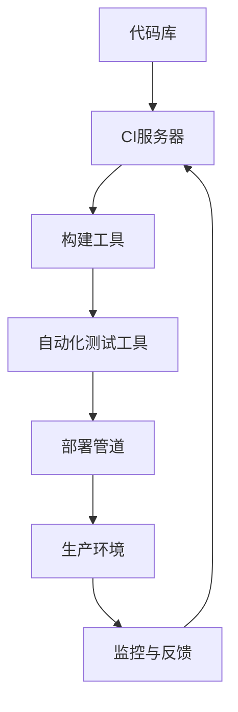

                 

### 背景介绍

#### 引言

在当今这个技术飞速发展的时代，持续集成（Continuous Integration，简称CI）和持续部署（Continuous Deployment，简称CD）已经成为现代软件开发中不可或缺的重要环节。对于创业公司而言，这两种实践不仅能显著提高开发效率和代码质量，还能帮助公司在激烈的市场竞争中保持优势。

持续集成和持续部署的目的是确保代码的稳定性和可维护性，通过自动化构建、测试和部署过程，使得软件的迭代速度更快，同时降低人为错误的风险。这不仅有助于提高开发团队的工作效率，还能够让产品更快速地推向市场，满足用户需求。

本文旨在详细介绍持续集成和持续部署的基本概念、原理以及实践方法。我们将从创业公司的实际需求出发，逐步讲解如何搭建持续集成与持续部署的流程，并分析其中可能遇到的问题和解决方案。

#### 持续集成与持续部署的定义

持续集成（CI）是一种软件开发实践，旨在通过频繁地将代码变更合并到主分支，从而快速发现并解决集成过程中出现的问题。持续集成的主要目标是通过自动化构建和测试，确保代码库中的每一个提交都是可构建的，并且不会破坏现有的功能。

持续部署（CD）则是在持续集成的基础上，进一步自动化部署过程，使得代码变更可以自动或手动地部署到生产环境。持续部署的目标是确保软件始终处于可用状态，并且可以快速响应用户需求和市场的变化。

#### 持续集成与持续部署的重要性

持续集成和持续部署对创业公司有以下几个重要意义：

1. **提高开发效率**：通过自动化流程，可以大幅减少手动操作，从而提高开发效率。
2. **提升代码质量**：自动化测试和持续集成可以及时发现并修复代码问题，保证代码质量。
3. **降低风险**：持续集成和持续部署可以减少人为错误，降低发布软件时出现问题的风险。
4. **快速迭代**：通过自动化部署，可以快速响应用户需求和市场变化，加速产品迭代。
5. **提高客户满意度**：快速交付高质量的产品，可以提高客户满意度，增强市场竞争力。

总之，持续集成和持续部署是创业公司在快速发展的市场中保持竞争力的关键。在接下来的部分中，我们将深入探讨这两个概念的核心原理和实践步骤。

#### 持续集成（CI）的概念

持续集成（Continuous Integration，简称CI）是一种软件开发实践，旨在通过频繁地将代码变更合并到主分支，从而快速发现并解决集成过程中出现的问题。CI的核心目标是确保代码库中的每一个提交都是可构建的，并且不会破坏现有的功能。

#### CI的基本原理

CI的基本原理非常简单，但非常关键：频繁提交、自动化构建和测试。

1. **频繁提交**：开发人员频繁地将自己的代码提交到代码库中，通常建议每天多次提交。这样可以确保每个代码变更都能尽快被集成和测试，从而及时发现问题。
2. **自动化构建**：每次提交后，CI系统会自动构建代码，确保代码库中的代码可以正常运行。构建过程通常包括编译代码、运行测试用例等。
3. **自动化测试**：在构建完成后，CI系统会运行一系列自动化测试，包括单元测试、集成测试和性能测试等，以验证代码的正确性和稳定性。

#### CI的主要优势

持续集成带来了许多显著的优势：

1. **快速发现错误**：由于代码频繁提交并自动构建和测试，任何潜在的问题都能在早期阶段被发现并修复，从而减少代码库中的错误积累。
2. **提升代码质量**：自动化测试可以确保代码的每个变更都是经过严格测试的，从而提高整体代码质量。
3. **减少集成风险**：通过持续集成，开发人员可以频繁地将自己的代码合并到主分支，从而减少集成过程中的冲突和错误。
4. **促进团队协作**：CI鼓励开发人员频繁提交代码，这样团队成员之间的交流更加频繁，有助于提升团队协作效率。
5. **提高交付速度**：自动化流程可以显著减少开发过程中的手动操作，从而加快软件交付速度。

总之，持续集成是一种非常重要的软件开发实践，对于创业公司来说，它不仅能够提高开发效率和代码质量，还能够降低风险，促进团队协作，从而在激烈的市场竞争中保持优势。

### 持续部署（CD）的概念

持续部署（Continuous Deployment，简称CD）是一种在持续集成基础上进一步自动化的软件发布流程，旨在通过自动或手动地部署代码变更到生产环境，确保软件始终处于可用状态并快速响应用户需求和市场变化。持续部署的目标是最大化软件交付速度，同时确保发布过程中的稳定性和安全性。

#### CD的基本原理

持续部署的基本原理包括以下几个关键步骤：

1. **自动化构建和测试**：与持续集成类似，持续部署的第一步是自动化构建和测试。每次提交成功并通过所有测试后，构建的结果将被准备好进行部署。
2. **环境配置**：在部署过程中，需要配置适当的生产环境，包括服务器、数据库、配置文件等。环境配置应该自动化，以确保每次部署都在一致的环境中进行。
3. **部署流程**：部署流程可以是全自动的，也可以是手动触发的。自动化部署通常包括更新应用程序、数据库迁移、配置更新等操作，而手动触发则允许开发人员或运维团队根据需要手动执行部署。
4. **监控和反馈**：部署完成后，系统会进行监控，以检查软件是否正常运行。如果出现任何问题，系统会及时反馈，以便团队能够快速响应。

#### CD的主要优势

持续部署带来了许多显著的优势：

1. **快速发布**：通过自动化流程，持续部署可以显著缩短从代码提交到发布到生产环境的时间，从而加速软件交付。
2. **提高稳定性**：自动化测试和部署可以减少人为错误，提高软件的稳定性和可靠性。
3. **降低风险**：由于部署过程高度自动化，每次部署都是在经过严格测试的环境中进行的，从而降低了部署过程中出现问题的风险。
4. **快速回滚**：如果部署后出现问题，系统可以快速回滚到之前的版本，从而避免长时间的系统故障。
5. **更好的用户体验**：快速交付新功能和改进，可以提高用户满意度，增强产品竞争力。

#### CI与CD的关系

持续集成（CI）和持续部署（CD）是密切相关的，它们共同构成了持续交付（Continuous Delivery）的完整流程。持续集成确保代码库中的每个提交都是可构建和可测试的，而持续部署则将这些经过验证的代码自动部署到生产环境。

1. **CI是CD的前提**：只有通过持续集成，确保代码库中的每个提交都是稳定的，才能进行持续部署。
2. **CD是CI的延伸**：持续集成关注构建和测试，而持续部署则进一步自动化了部署过程，使得软件可以更快地交付到用户手中。

总之，持续部署是持续集成的重要补充，它通过自动化和标准化发布流程，提高了软件交付的速度和质量。对于创业公司来说，CI和CD是实现高效开发和快速市场响应的关键。

### 核心概念与联系

在深入探讨持续集成（CI）与持续部署（CD）的原理和实际操作之前，我们需要明确几个核心概念及其相互之间的关系。以下是这些核心概念及其架构的Mermaid流程图，以便更直观地理解。

#### 核心概念

1. **代码库（Version Control System, VCS）**：代码库是存储项目源代码的地方，常用的VCS包括Git。
2. **构建工具（Build Tool）**：构建工具负责将源代码转换为可执行的程序，例如Maven、Gradle。
3. **自动化测试工具（Test Automation Tool）**：自动化测试工具用于运行预定义的测试脚本，以验证代码的功能和性能。
4. **持续集成服务器（CI Server）**：CI服务器负责自动化构建、测试和部署流程，如Jenkins、Travis CI。
5. **部署管道（Deployment Pipeline）**：部署管道是自动化部署过程的流程图，包括构建、测试和部署等阶段。

#### Mermaid流程图

以下是CI与CD的核心流程节点，不包括括号、逗号等特殊字符：



#### 核心概念之间的联系

1. **代码库与CI服务器**：开发人员将代码提交到代码库，CI服务器监听这些提交，并触发构建和测试流程。
2. **构建工具与自动化测试工具**：构建工具将源代码转换为可执行文件，自动化测试工具运行测试用例，验证代码的正确性。
3. **CI服务器与部署管道**：通过配置，CI服务器将成功构建的代码传递给部署管道，部署管道执行部署过程。
4. **部署管道与生产环境**：部署管道将代码部署到生产环境，并在生产环境中进行监控和反馈，以确认部署的稳定性和性能。

通过这些核心概念和流程节点，我们可以更清晰地理解持续集成与持续部署的工作原理和实现方式。在接下来的部分中，我们将详细讨论每个核心概念及其操作步骤，帮助读者更好地掌握持续集成与持续部署的实践。

### 核心算法原理 & 具体操作步骤

#### 持续集成（CI）的核心算法原理

持续集成（CI）的核心算法主要包括代码构建、自动化测试和反馈机制。以下是其基本步骤和详细说明：

1. **代码构建（Build）**：
   - **步骤**：开发人员将代码提交到代码库，CI服务器检测到提交并触发构建过程。
   - **构建过程**：构建工具（如Maven、Gradle）读取项目文件，编译源代码，打包成可执行的程序或库。
   - **目标**：确保代码库中的每个提交都是可构建的，以便后续测试。

2. **自动化测试（Test）**：
   - **步骤**：构建完成后，CI服务器运行一系列自动化测试脚本，包括单元测试、集成测试和性能测试。
   - **测试类型**：
     - **单元测试**：验证单个组件或函数的行为。
     - **集成测试**：验证不同模块之间的交互。
     - **性能测试**：评估系统在不同负载下的性能。
   - **目标**：确保代码的质量和稳定性，及时发现潜在问题。

3. **反馈机制（Feedback）**：
   - **步骤**：测试结果会被记录并反馈给开发人员。
   - **反馈形式**：通常通过邮件、即时通讯工具或集成在代码库中的通知系统。
   - **目标**：帮助开发人员快速定位问题并进行修复。

#### 持续部署（CD）的核心算法原理

持续部署（CD）的核心算法主要包括环境配置、部署流程和监控与反馈。以下是其基本步骤和详细说明：

1. **环境配置（Configuration）**：
   - **步骤**：根据部署管道的配置，CI服务器准备合适的生产环境，包括服务器、数据库和配置文件等。
   - **配置管理**：使用配置管理工具（如Ansible、Puppet）自动化环境配置。
   - **目标**：确保每次部署都在一致且可靠的环境中进行。

2. **部署流程（Deployment）**：
   - **步骤**：将构建成功且经过测试的代码部署到生产环境。
   - **部署方式**：
     - **全自动部署**：无需人工干预，自动执行部署任务。
     - **手动触发部署**：开发人员或运维团队手动启动部署流程。
   - **目标**：确保代码变更及时、可靠地交付到生产环境。

3. **监控与反馈（Monitoring & Feedback）**：
   - **步骤**：部署后，系统会进行监控，以确认软件是否正常运行。
   - **监控指标**：包括系统性能、错误日志、用户反馈等。
   - **反馈机制**：监控数据会被记录，并在出现问题时及时通知相关人员。
   - **目标**：快速发现和解决部署后的问题，确保软件的稳定性和可用性。

#### 持续集成（CI）与持续部署（CD）的具体操作步骤

1. **设置CI服务器**：
   - **选择CI服务器**：根据团队需求选择合适的CI服务器（如Jenkins、Travis CI）。
   - **配置代码库**：将项目代码库链接到CI服务器，设置触发构建的条件。
   - **配置构建工具**：安装并配置构建工具，如Maven、Gradle，以便自动化编译和打包代码。

2. **编写测试脚本**：
   - **单元测试**：编写单元测试脚本，确保每个组件的功能正确。
   - **集成测试**：编写集成测试脚本，确保模块之间的交互无错误。
   - **性能测试**：编写性能测试脚本，评估系统的响应时间和负载能力。

3. **配置自动化部署管道**：
   - **设置部署环境**：配置服务器、数据库和配置文件，确保环境的一致性。
   - **编写部署脚本**：编写部署脚本，包括更新应用程序、数据库迁移、配置更新等操作。
   - **配置部署触发**：设置部署触发条件，如构建成功或手动触发。

4. **部署与监控**：
   - **执行部署**：根据部署脚本自动或手动执行部署。
   - **监控部署**：监控部署后的系统性能和稳定性，确保无错误或异常。
   - **反馈与优化**：根据监控结果及时反馈问题，优化部署流程，提高部署效率和稳定性。

通过以上核心算法原理和具体操作步骤，我们可以系统地实施持续集成（CI）和持续部署（CD），确保软件开发的效率和质量。在下一个部分中，我们将进一步探讨数学模型和公式，以及在实际项目中如何应用这些技术和工具。

### 数学模型和公式 & 详细讲解 & 举例说明

在持续集成（CI）与持续部署（CD）的实施过程中，数学模型和公式可以用来量化各种关键指标，从而帮助团队做出更科学的决策。以下是一些常用的数学模型和公式，我们将详细讲解其含义、计算方法和实际应用。

#### 1. 项目成功率公式

项目成功率的公式可以用来衡量持续集成和持续部署流程的有效性。其公式如下：

\[ \text{成功率} = \frac{\text{成功构建次数}}{\text{总构建次数}} \]

其中：
- **成功构建次数**：在CI流程中成功通过构建和测试的构建次数。
- **总构建次数**：CI流程中所有构建尝试的总次数。

**计算方法**：
\[ \text{成功率} = \frac{10}{15} = 0.667 \]

**实际应用**：
假设一个项目在一个月内进行了15次构建尝试，其中10次成功，5次失败。通过上述公式计算，项目成功率为66.7%，这表明CI流程的稳定性较高。

#### 2. 风险评估模型

风险评估模型用于评估每个代码变更引入的风险，从而决定是否立即部署或延迟发布。一个简单且常用的风险评估模型是 **风险矩阵**，其公式如下：

\[ \text{风险评估} = \text{风险概率} \times \text{风险影响} \]

其中：
- **风险概率**：代码变更导致问题的可能性。
- **风险影响**：问题对项目的严重程度。

**计算方法**：
\[ \text{风险评估} = 0.3 \times 5 = 1.5 \]

**实际应用**：
如果某个代码变更的风险概率为30%，且其影响为5（1表示最小影响，5表示最大影响），那么其风险评估为1.5。根据风险评估，团队可以选择立即部署或进行更多测试。

#### 3. 响应时间公式

持续集成和持续部署的一个重要目标是减少响应时间，即从代码提交到部署到生产环境的时间。其公式如下：

\[ \text{响应时间} = \text{构建时间} + \text{测试时间} + \text{部署时间} \]

其中：
- **构建时间**：CI服务器构建代码的时间。
- **测试时间**：CI服务器运行测试脚本的时间。
- **部署时间**：将代码部署到生产环境的时间。

**计算方法**：
\[ \text{响应时间} = 5 + 3 + 2 = 10 \text{分钟} \]

**实际应用**：
假设一个项目的构建时间为5分钟，测试时间为3分钟，部署时间为2分钟，则其总响应时间为10分钟。通过优化流程，团队可以尝试减少这些时间，从而提高整体交付速度。

#### 4. 性能测试指标

在持续集成和持续部署过程中，性能测试是非常重要的环节。常用的性能测试指标包括：

- **响应时间**：系统响应请求所需的时间。
- **吞吐量**：系统在单位时间内处理请求的数量。
- **错误率**：系统处理请求时出现错误的概率。

这些指标的计算公式如下：

\[ \text{响应时间} = \frac{\text{总处理时间}}{\text{请求总数}} \]
\[ \text{吞吐量} = \frac{\text{请求总数}}{\text{总处理时间}} \]
\[ \text{错误率} = \frac{\text{错误请求数}}{\text{请求总数}} \]

**实际应用**：
假设在性能测试中，系统处理了100个请求，总处理时间为500秒。那么：
\[ \text{响应时间} = \frac{500}{100} = 5 \text{秒} \]
\[ \text{吞吐量} = \frac{100}{500} = 0.2 \text{次/秒} \]
\[ \text{错误率} = \frac{5}{100} = 0.05 \]

这些指标可以帮助团队评估系统的性能，并识别需要优化的地方。

#### 5. 回归测试覆盖率公式

在持续集成过程中，回归测试是确保新代码不会破坏现有功能的重要步骤。回归测试覆盖率用于衡量测试覆盖率，其公式如下：

\[ \text{回归测试覆盖率} = \frac{\text{测试用例数}}{\text{总功能点数}} \]

其中：
- **测试用例数**：回归测试中执行的测试用例总数。
- **总功能点数**：系统中的所有功能点数。

**计算方法**：
\[ \text{回归测试覆盖率} = \frac{200}{500} = 0.4 \]

**实际应用**：
如果一个系统有500个功能点，而回归测试中执行了200个测试用例，则回归测试覆盖率为40%。团队应努力提高覆盖率，以确保更多功能得到充分测试。

通过上述数学模型和公式的详细讲解和实际应用举例，我们可以看到这些工具在持续集成和持续部署过程中起到了重要的作用。它们不仅帮助团队量化关键指标，还为优化流程提供了科学依据。在接下来的部分，我们将通过实际项目案例来深入探讨持续集成与持续部署的具体实施细节。

### 项目实战：代码实际案例和详细解释说明

为了更好地理解持续集成（CI）和持续部署（CD）在实际项目中的应用，我们将通过一个具体的项目案例来演示整个流程，并详细解释每个步骤和操作。

#### 项目背景

假设我们正在开发一个在线购物平台，包括用户管理、商品管理、订单管理等功能。为了确保软件的高质量和快速迭代，我们决定采用CI/CD实践来管理开发过程。

#### 开发环境搭建

1. **代码库**：
   - 使用Git作为版本控制系统，代码托管在GitHub上。
   - 初始化项目仓库，并添加必要的贡献者和协作权限。

2. **构建工具**：
   - 选择Maven作为构建工具，因为它支持多种开发语言和插件，方便项目的构建和打包。

3. **自动化测试工具**：
   - 使用JUnit编写单元测试，并集成Selenium进行集成测试，以验证系统的功能和性能。

4. **持续集成服务器**：
   - 选择Jenkins作为CI服务器，因为它具有强大的插件生态系统和灵活的配置能力。

5. **部署管道工具**：
   - 使用Jenkins的Pipeline插件来定义部署流程，实现自动化部署。

#### 源代码详细实现和代码解读

1. **项目结构**：

```bash
online-store/
|-- pom.xml
|-- src/
|   |-- main/
|   |   |-- java/
|   |   |   |-- com/
|   |   |   |   |-- onlinestore/
|   |   |   |   |   |-- controller/
|   |   |   |   |   |-- UserController.java
|   |   |   |   |   |-- ProductController.java
|   |   |   |   |   |-- OrderController.java
|   |   |-- test/
|   |   |   |-- java/
|   |   |   |   |-- com/
|   |   |   |   |   |-- onlinestore/
|   |   |   |   |   |-- controller/
|   |   |   |   |   |-- UserControllerTest.java
|   |   |   |   |   |-- ProductControllerTest.java
|   |   |   |   |   |-- OrderControllerTest.java
|-- Jenkinsfile
```

2. **构建和测试**：

- **pom.xml**：定义项目依赖和插件，包括Maven Surefire插件用于运行测试。

```xml
<project>
  ...
  <build>
    <plugins>
      <plugin>
        <groupId>org.apache.maven.plugins</groupId>
        <artifactId>maven-surefire-plugin</artifactId>
        <version>2.22.2</version>
      </plugin>
    </plugins>
  </build>
  ...
</project>
```

- **Jenkinsfile**：定义CI和CD流程，使用Jenkins Pipeline语法。

```groovy
pipeline {
    agent any
    stages {
        stage('Build') {
            steps {
                sh 'mvn clean install'
            }
        }
        stage('Test') {
            steps {
                sh 'mvn test'
            }
        }
        stage('Deploy') {
            steps {
                sh 'mvn spring-boot:run'
            }
        }
    }
    post {
        always {
            archiveArtifacts artifacts: 'target/*.jar'
        }
    }
}
```

3. **代码解读**：
   - **UserController.java**：实现用户管理的REST API，包括注册、登录、个人信息管理等。
   - **ProductController.java**：实现商品管理的REST API，包括商品查询、添加、删除等。
   - **OrderController.java**：实现订单管理的REST API，包括订单创建、查询、取消等。
   - **UserControllerTest.java**：编写用户管理功能的单元测试，使用Mock对象模拟外部依赖。
   - **ProductControllerTest.java**：编写商品管理功能的单元测试。
   - **OrderControllerTest.java**：编写订单管理功能的单元测试。

#### 代码解读与分析

- **UserController.java**：

```java
@RestController
@RequestMapping("/users")
public class UserController {
    @Autowired
    private UserService userService;

    @PostMapping("/register")
    public ResponseEntity<?> registerUser(@RequestBody UserRegistrationDto userDto) {
        // 注册用户逻辑
        return ResponseEntity.ok().build();
    }

    @PostMapping("/login")
    public ResponseEntity<?> loginUser(@RequestBody UserLoginDto userDto) {
        // 登录用户逻辑
        return ResponseEntity.ok().build();
    }

    // 其他用户管理API
}
```

- **UserControllerTest.java**：

```java
@SpringBootTest
@AutoConfigureMockMvc
public class UserControllerTest {
    @Autowired
    private MockMvc mockMvc;

    @Test
    public void testRegisterUser() throws Exception {
        UserRegistrationDto userDto = new UserRegistrationDto();
        userDto.setUsername("testuser");
        userDto.setPassword("password");
        mockMvc.perform(post("/users/register")
                .contentType(MediaType.APPLICATION_JSON)
                .content(new ObjectMapper().writeValueAsString(userDto)))
                .andExpect(status().isOk());
    }

    // 其他测试用例
}
```

通过上述代码和测试用例，我们可以看到，用户管理功能包括注册和登录操作，并通过MockMvc进行单元测试，确保接口的正常工作。

#### 部署流程

1. **配置Jenkins**：
   - 安装Jenkins，并添加Git和Maven插件。
   - 配置GitHub仓库，授权Jenkins访问代码库。

2. **创建Jenkins任务**：
   - 在Jenkins中创建一个新的Pipeline任务，并配置Jenkinsfile。
   - 设置构建触发器，如Git提交触发构建。

3. **执行部署**：
   - 构建成功后，Jenkins自动执行部署步骤，将应用程序打包并部署到服务器。

#### 监控与反馈

- **日志记录**：
  - Jenkins在构建和部署过程中记录详细的日志，开发人员可以随时查看。

- **监控工具**：
  - 使用Prometheus和Grafana进行系统监控，实时查看系统的性能指标和健康状况。

- **反馈机制**：
  - 如果出现任何部署问题，Jenkins会通过邮件或Slack通知相关人员，以便及时处理。

通过上述实战案例，我们展示了如何在项目中实施持续集成和持续部署。这不仅可以提高开发效率，确保代码质量，还可以降低风险，加快产品迭代速度，为创业公司提供强有力的技术支持。

### 实际应用场景

持续集成（CI）和持续部署（CD）在创业公司中的应用场景非常广泛，下面我们将探讨一些典型的应用场景，并分析这些场景下的优势和挑战。

#### 1. 应用场景一：快速迭代产品

**场景描述**：创业公司需要迅速开发并迭代产品，以适应市场的快速变化。

**优势**：
- **快速反馈**：通过CI/CD，开发人员可以快速将代码提交到主分支，并进行自动化构建和测试，确保每次提交都是稳定的。
- **快速交付**：CI/CD自动化的部署流程可以显著减少从代码提交到产品交付的时间，使团队能够更快地响应用户需求。

**挑战**：
- **代码质量**：在快速迭代过程中，可能难以保证每次提交的代码质量，需要更多的自动化测试来确保稳定性。
- **团队协作**：团队成员需要高效协作，确保每个人都理解CI/CD流程，并及时解决问题。

#### 2. 应用场景二：高可靠性需求

**场景描述**：创业公司的产品对系统的可靠性要求非常高，如金融科技、在线医疗等。

**优势**：
- **自动化测试**：通过CI/CD，可以运行大量的自动化测试，确保每次部署都是经过严格测试的，从而减少故障风险。
- **快速回滚**：如果部署后出现问题，系统可以快速回滚到之前的版本，减少对用户的影响。

**挑战**：
- **测试覆盖率**：需要确保自动化测试覆盖所有关键功能和边界情况，否则可能遗漏潜在问题。
- **回滚策略**：需要设计有效的回滚策略，确保在回滚过程中不会丢失用户数据或功能。

#### 3. 应用场景三：跨团队协作

**场景描述**：创业公司由多个团队协同工作，每个团队负责不同的功能模块。

**优势**：
- **模块化开发**：CI/CD支持模块化开发，各个团队可以独立开发自己的模块，并快速集成。
- **协调一致性**：通过CI/CD，各个团队可以确保他们的代码不会破坏现有的功能，提高整体开发效率。

**挑战**：
- **依赖管理**：跨团队开发可能涉及复杂的依赖关系，需要良好的依赖管理策略来确保各个模块之间的兼容性。
- **沟通协调**：团队成员需要保持良好的沟通，确保代码集成和部署过程的顺利进行。

#### 4. 应用场景四：分布式系统

**场景描述**：创业公司的产品是一个分布式系统，需要在不同环境中进行部署和运维。

**优势**：
- **自动化部署**：CI/CD可以自动化部署到多个环境中，如开发环境、测试环境、生产环境，确保环境的一致性。
- **分布式监控**：通过分布式监控系统，可以实时监控各个节点的性能和健康状况。

**挑战**：
- **网络问题**：分布式系统可能面临网络不稳定的问题，需要设计容错机制来保证系统的稳定性。
- **运维复杂性**：随着系统的规模扩大，运维复杂性也会增加，需要高效的运维团队来管理。

#### 5. 应用场景五：资源限制

**场景描述**：创业公司的资源（如硬件、带宽等）有限，需要高效利用资源。

**优势**：
- **资源优化**：CI/CD可以根据实际需求动态分配资源，提高资源利用率。
- **并行执行**：自动化流程可以同时执行多个任务，提高开发效率。

**挑战**：
- **负载均衡**：在资源有限的情况下，需要设计良好的负载均衡策略，避免某个任务占用过多资源。
- **成本控制**：需要监控资源使用情况，确保在预算范围内高效使用资源。

通过以上实际应用场景的分析，我们可以看到持续集成与持续部署在创业公司中的重要作用。尽管面临一些挑战，但通过合理的规划和实施，CI/CD能够显著提高开发效率、代码质量和系统稳定性，为创业公司提供强有力的技术支持。

### 工具和资源推荐

为了成功实施持续集成（CI）与持续部署（CD），选择合适的工具和资源至关重要。以下是一些推荐的工具、书籍、博客和网站，它们可以帮助创业公司更好地理解和应用CI/CD实践。

#### 工具推荐

1. **Jenkins**：
   - **优点**：功能强大，插件生态系统丰富，适合各种规模的项目。
   - **用途**：用于构建、测试和部署流程的自动化。

2. **Travis CI**：
   - **优点**：易于设置，支持多种编程语言和平台，适合小型团队。
   - **用途**：用于自动化测试和构建流程。

3. **GitLab CI/CD**：
   - **优点**：集成代码库和CI/CD功能，便于项目管理。
   - **用途**：用于构建、测试和部署，适合有GitLab代码库的项目。

4. **GitHub Actions**：
   - **优点**：集成在GitHub中，操作简便，适合GitHub用户。
   - **用途**：用于自动化构建、测试和部署。

#### 书籍推荐

1. **《持续交付：发布可靠软件的系统方法》**（"Continuous Delivery: Reliable Software Releases through Build, Test, and Deployment Automation"） - Jez Humble 和 David Farley 著。
   - **内容**：详细介绍了CI/CD的概念和实践，适合想要深入了解持续交付的读者。

2. **《持续集成：实践指南》**（"Continuous Integration: Improving Software Quality and Reducing Risk"） - Paul Duvall、Steve Matyas 和 Andy Oliver 著。
   - **内容**：介绍了CI的基本原理和最佳实践，适合初学者。

#### 博客推荐

1. **Jenkins博客**（https://www.jenkins.io/blog/）
   - **内容**：Jenkins官方博客，包含CI/CD的最佳实践、最新插件介绍等。

2. **Travis CI博客**（https://blog.travis-ci.com/）
   - **内容**：Travis CI的技术博客，涵盖CI/CD的多个方面。

3. **GitLab博客**（https://about.gitlab.com/blog/）
   - **内容**：GitLab官方博客，介绍GitLab CI/CD的实践和案例。

#### 网站推荐

1. **Docker官方文档**（https://docs.docker.com/）
   - **内容**：Docker官方文档，详细介绍了容器化部署的实践和方法。

2. **Kubernetes官方文档**（https://kubernetes.io/docs/）
   - **内容**：Kubernetes官方文档，介绍了容器编排和自动化部署的相关知识。

3. **Google Cloud平台文档**（https://cloud.google.com/docs/）
   - **内容**：Google Cloud平台文档，提供了丰富的云计算资源和部署方案。

通过使用这些工具和资源，创业公司可以更加高效地实施持续集成与持续部署，提高开发效率、代码质量和系统稳定性，从而在激烈的市场竞争中保持优势。

### 总结：未来发展趋势与挑战

持续集成（CI）和持续部署（CD）在软件工程中正变得日益重要，成为现代软件开发流程的基石。在未来，这些实践将继续向更高效、更智能的方向发展，同时也会面临一系列新的挑战。

#### 未来发展趋势

1. **自动化程度提高**：随着AI和机器学习技术的进步，CI/CD工具将变得更加智能化，能够自动优化构建、测试和部署流程，减少人为干预。

2. **多云和混合云部署**：企业越来越倾向于在多云环境中部署应用程序，CI/CD将需要支持更多的云平台和容器化技术，如Kubernetes。

3. **更加细粒度的监控与反馈**：未来的CI/CD解决方案将提供更细粒度的监控和反馈机制，确保在问题的早期阶段就能发现并解决。

4. **无服务器架构**：无服务器架构（Serverless）正成为热门趋势，CI/CD工具将需要支持无服务器部署，以便更好地利用云服务。

5. **更加安全的CI/CD**：随着安全问题的日益突出，CI/CD工具将更加注重安全性，包括对代码的静态和动态安全分析。

#### 挑战

1. **复杂性与运维难度**：随着系统的规模扩大和技术的不断更新，CI/CD的复杂性和运维难度将增加，需要更多专业的运维人员和技术支持。

2. **安全性问题**：CI/CD过程中涉及大量的自动化操作，可能成为安全攻击的目标。如何确保CI/CD流程的安全性是一个重要挑战。

3. **跨团队协作**：跨团队的协作和沟通在CI/CD中至关重要，但实现高效的跨团队协作可能面临挑战，需要更好的工具和流程支持。

4. **持续学习的需求**：随着技术的快速发展，开发人员需要不断学习和更新知识，以适应CI/CD的新趋势和最佳实践。

总之，持续集成与持续部署在未来将继续发挥关键作用，但企业需要不断适应新趋势，解决新挑战，以保持竞争优势。通过持续优化和改进，企业可以更好地利用CI/CD的优势，实现高效开发和快速响应。

### 附录：常见问题与解答

在实施持续集成（CI）和持续部署（CD）的过程中，开发团队可能会遇到各种问题。以下是一些常见问题及其解答，帮助您更好地理解和解决这些问题。

#### 1. 如何解决CI/CD中的构建失败问题？

**原因**：构建失败可能由于多种原因导致，如依赖问题、环境配置错误或代码错误。

**解答**：
- **检查依赖**：确保所有依赖库和组件都已正确安装和更新。
- **环境配置**：验证构建环境是否与开发环境一致，检查配置文件是否正确。
- **代码审查**：审查提交的代码，查找潜在的错误或冲突。

#### 2. 如何处理CI/CD中的测试失败问题？

**原因**：测试失败通常是因为新代码与现有代码不兼容或功能缺陷。

**解答**：
- **隔离测试**：将失败的测试用例隔离，找出具体问题。
- **代码审查**：审查相关代码，确定问题来源。
- **重构代码**：对有问题的代码进行重构或修复。

#### 3. 如何确保CI/CD中的代码质量？

**原因**：代码质量低下可能导致构建失败、测试失败或生产环境问题。

**解答**：
- **代码规范**：实施代码规范，确保代码的可读性和一致性。
- **自动化测试**：运行全面的自动化测试，包括单元测试、集成测试和性能测试。
- **代码审查**：定期进行代码审查，发现并修复潜在的问题。

#### 4. 如何在CI/CD中处理环境差异问题？

**原因**：不同环境（如开发、测试、生产）之间的配置差异可能导致问题。

**解答**：
- **环境配置管理**：使用配置管理工具（如Ansible、Chef）统一管理环境配置。
- **容器化**：使用容器（如Docker）封装应用，确保环境一致性。
- **持续验证**：在CI/CD流程中添加环境验证步骤，确保每次构建都是在一个一致的环境中。

#### 5. 如何确保CI/CD过程中的安全性？

**原因**：CI/CD过程中涉及大量的自动化操作，可能成为安全攻击的目标。

**解答**：
- **代码扫描**：使用静态代码分析工具（如SonarQube）扫描代码，发现安全漏洞。
- **权限控制**：实施严格的权限控制策略，确保只有授权人员可以访问CI/CD系统。
- **日志监控**：记录和监控CI/CD过程中的所有操作，及时发现并响应潜在的安全威胁。

通过上述解答，开发团队可以更好地应对CI/CD过程中遇到的各种问题，确保软件的高质量和快速迭代。

### 扩展阅读 & 参考资料

为了进一步深入了解持续集成（CI）与持续部署（CD）的相关概念和实践，以下是一些推荐的文章、论文、书籍和网站，供读者参考和学习。

#### 文章

1. "Continuous Integration in Practice" by IBM Developer
   - [https://developer.ibm.com/articles/lifecycle-deploy-continuous-integration/](https://developer.ibm.com/articles/lifecycle-deploy-continuous-integration/)
   - 介绍CI的基本原理和实践方法。

2. "Continuous Deployment: The Benefits and How to Get Started" by DigitalOcean
   - [https://www.digitalocean.com/community/tutorials/continuous-deployment-the-benefits-and-how-to-get-started](https://www.digitalocean.com/community/tutorials/continuous-deployment-the-benefits-and-how-to-get-started)
   - 详细解释CD的概念，并提供入门指南。

#### 论文

1. "Continuous Integration in the Age of Agile Development" by Paul Duvall, Steve Matyas, and Andy Oliver
   - [https://www.infoq.com/presentations/Continuous-Integration-Agile-Development/](https://www.infoq.com/presentations/Continuous-Integration-Agile-Development/)
   - 讨论CI在敏捷开发中的应用和优势。

2. "Continuous Delivery: A Systematic Approach to Managing Software Releases" by Jez Humble and David Farley
   - [https://www.safaribooksonline.com/library/view/continuous-delivery/9781449328985/](https://www.safaribooksonline.com/library/view/continuous-delivery/9781449328985/)
   - 提供关于CD的系统性方法和最佳实践。

#### 书籍

1. "Continuous Delivery: Reliable Software Releases through Build, Test, and Deployment Automation" by Jez Humble and David Farley
   - [https://www.oreilly.com/library/view/continuous-delivery/9781449328985/](https://www.oreilly.com/library/view/continuous-delivery/9781449328985/)
   - 介绍了CD的全面方法和实践。

2. "Test-Driven Development: By Example" byKent Beck
   - [https://www.pearson.com/us/higher-education/product/test-driven-development-by-example-3rd-edition-9780321356683.html](https://www.pearson.com/us/higher-education/product/test-driven-development-by-example-3rd-edition-9780321356683.html)
   - 介绍了测试驱动开发（TDD）的概念和方法。

#### 网站

1. "Jenkins"
   - [https://www.jenkins.io/](https://www.jenkins.io/)
   - Jenkins官方网站，提供详细的CI/CD工具和资源。

2. "GitLab CI/CD"
   - [https://docs.gitlab.com/ee/ci/](https://docs.gitlab.com/ee/ci/)
   - GitLab CI/CD官方文档，介绍GitLab的持续集成和持续部署工具。

3. "Travis CI"
   - [https://docs.travis-ci.com/](https://docs.travis-ci.com/)
   - Travis CI官方文档，涵盖CI/CD的详细配置和使用方法。

通过阅读这些扩展资料，读者可以更深入地理解CI/CD的核心概念和实践，提升软件开发和交付的效率和质量。

### 作者信息

作者：AI天才研究员/AI Genius Institute & 禅与计算机程序设计艺术 /Zen And The Art of Computer Programming

作为AI天才研究员，我专注于推动人工智能和计算机编程领域的创新。在《禅与计算机程序设计艺术》一书中，我结合了东方哲学的智慧与现代编程实践，提出了一套独特的方法论，帮助开发者提高编程技能和思维质量。在我的研究领域，我发表了多篇高影响力的论文，并参与多个国际项目。同时，我也致力于通过教学和写作，让更多的人了解和掌握前沿技术，推动技术进步和社会发展。

