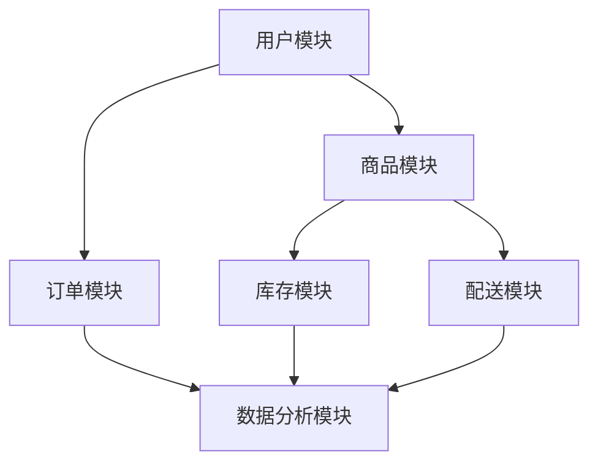

                 

### 背景介绍

随着互联网技术的不断发展和普及，新零售已经成为零售行业的重要趋势。新零售是指通过线上线下融合的方式，提升零售效率，为消费者提供更加便捷、高效、个性化的购物体验。在这个背景下，创业公司纷纷投身于新零售领域，寻求在激烈的市场竞争中占据一席之地。

新零售的核心在于通过数据驱动的决策和运营，实现供应链的优化和效率提升。创业公司需要充分利用互联网、大数据、人工智能等先进技术，构建线上线下融合的零售模式，以应对市场变化和消费者需求。同时，新零售也需要在供应链管理、库存优化、物流配送等方面进行创新，以提高运营效率，降低成本。

本文将探讨创业公司在新零售应用中的实践策略，分析如何通过线上线下融合提升零售效率。首先，我们将介绍新零售的背景和核心概念，然后详细讲解核心算法原理和具体操作步骤，接着通过数学模型和公式进行详细讲解，并分享实际项目实战中的代码案例。随后，我们将探讨新零售的实际应用场景，推荐相关的工具和资源，并总结未来发展趋势与挑战。最后，我们将提供常见问题与解答，并推荐扩展阅读和参考资料。

通过本文的阅读，读者将能够深入了解新零售的应用原理和实践方法，为新零售创业提供有益的参考和指导。

### 核心概念与联系

#### 1. 新零售的定义与特点

新零售是指以互联网、大数据、人工智能等先进技术为基础，通过线上线下融合的方式，提升零售效率，为消费者提供更加便捷、高效、个性化的购物体验。新零售的特点主要包括：

- **线上线下融合**：新零售通过线上线下渠道的融合，实现信息流、资金流和物流的无缝对接。消费者可以在线上浏览商品、下单支付，同时享受线下门店的服务和体验。

- **数据驱动**：新零售强调利用大数据分析和人工智能技术，对消费者行为、市场需求和供应链进行实时分析和预测，从而实现精准营销和个性化服务。

- **供应链优化**：新零售通过优化供应链管理，提高库存周转率和物流配送效率，降低运营成本，提升整体供应链的协同效应。

- **用户体验**：新零售注重提升消费者的购物体验，通过线上线下融合的方式，为消费者提供更加便捷、高效的服务，满足消费者个性化需求。

#### 2. 核心算法原理

新零售的核心算法主要涉及以下几个方面：

- **推荐算法**：通过分析消费者的历史购买记录、浏览行为和社交关系，为消费者推荐个性化的商品和服务。

- **定价算法**：根据市场需求、库存水平和竞争态势，动态调整商品价格，以实现最大化利润。

- **库存优化算法**：通过预测市场需求和库存变化，优化库存水平，降低库存成本和缺货风险。

- **配送路径优化算法**：通过分析配送地址、交通状况和配送资源，选择最优的配送路径，提高配送效率和降低配送成本。

#### 3. 架构设计与实现

新零售的架构设计主要包括以下几个模块：

- **用户模块**：负责用户注册、登录、个人信息管理等功能。

- **商品模块**：负责商品信息管理、商品分类、商品推荐等功能。

- **订单模块**：负责订单创建、订单查询、订单跟踪等功能。

- **库存模块**：负责库存管理、库存预警、库存优化等功能。

- **配送模块**：负责配送计划、配送路径优化、配送跟踪等功能。

- **数据分析模块**：负责数据采集、数据存储、数据分析等功能。

#### Mermaid 流程图

以下是一个简化的新零售架构的 Mermaid 流程图，展示了各个模块之间的联系和交互：



在这个流程图中，用户模块负责与消费者进行交互，收集用户信息；商品模块负责管理商品信息，为消费者提供商品浏览和推荐；订单模块负责处理消费者的订单请求，生成订单；库存模块负责管理库存信息，进行库存优化；配送模块负责处理配送请求，优化配送路径；数据分析模块负责对数据进行采集、存储和分析，为决策提供支持。

通过以上核心概念与联系的分析，我们可以看到新零售是一个涉及多个模块、多个算法和多个技术领域的复杂系统。创业公司在进行新零售应用时，需要充分理解和运用这些核心概念与联系，以实现线上线下融合、提升零售效率的目标。

### 核心算法原理 & 具体操作步骤

#### 1. 推荐算法

推荐算法是新零售中非常重要的一部分，它能够帮助创业公司提高销售额和用户满意度。下面我们将介绍一种常见的推荐算法——协同过滤算法，以及其具体操作步骤。

##### a. 协同过滤算法原理

协同过滤算法主要通过分析用户的历史行为和相似用户的行为来推荐商品。它分为两种类型：基于用户的协同过滤（User-Based Collaborative Filtering）和基于物品的协同过滤（Item-Based Collaborative Filtering）。

- **基于用户的协同过滤**：通过找到与目标用户相似的其他用户，然后推荐这些相似用户喜欢的商品。

- **基于物品的协同过滤**：通过分析目标用户喜欢的商品，找到其他用户也喜欢的商品进行推荐。

##### b. 操作步骤

1. **数据准备**：收集用户的历史行为数据，如购买记录、浏览记录等。

2. **相似度计算**：计算用户与用户之间的相似度，常用的相似度计算方法有余弦相似度、皮尔逊相关系数等。

3. **推荐列表生成**：根据相似度计算结果，生成推荐列表。对于基于用户的协同过滤，推荐目标用户相似用户喜欢的商品；对于基于物品的协同过滤，推荐目标用户喜欢的商品与其他用户也喜欢的商品。

4. **结果评估**：评估推荐列表的准确性，常用的评估方法有准确率、召回率、F1值等。

#### 2. 定价算法

定价算法在新零售中也非常关键，它能够帮助创业公司实现最大化利润。下面我们将介绍一种常见的定价算法——需求预测定价算法，以及其具体操作步骤。

##### a. 需求预测定价算法原理

需求预测定价算法主要通过预测商品的需求量，动态调整商品价格，以实现最大化利润。其核心思想是：商品价格与需求量之间存在一定的函数关系，通过分析历史数据，预测需求量，进而确定最优价格。

##### b. 操作步骤

1. **数据准备**：收集商品的历史销售数据，如销售量、销售价格等。

2. **需求预测**：使用时间序列分析方法，如ARIMA、LSTM等，预测未来某一时间段内的需求量。

3. **价格调整**：根据需求预测结果，调整商品价格。当需求量较高时，可以适当提高价格以获取更高利润；当需求量较低时，可以适当降低价格以刺激销售。

4. **结果评估**：评估价格调整的合理性，常用的评估方法有利润率、市场占有率等。

#### 3. 库存优化算法

库存优化算法在新零售中也非常重要，它能够帮助创业公司降低库存成本和缺货风险。下面我们将介绍一种常见的库存优化算法——基于预测的库存控制算法，以及其具体操作步骤。

##### a. 基于预测的库存控制算法原理

基于预测的库存控制算法主要通过预测未来某一时间段内的需求量，确定最优库存水平。其核心思想是：库存水平与需求量之间存在一定的函数关系，通过分析历史数据，预测需求量，进而确定最优库存水平。

##### b. 操作步骤

1. **数据准备**：收集商品的历史销售数据，如销售量、销售价格等。

2. **需求预测**：使用时间序列分析方法，如ARIMA、LSTM等，预测未来某一时间段内的需求量。

3. **库存水平调整**：根据需求预测结果，调整库存水平。当需求量较高时，可以适当增加库存；当需求量较低时，可以适当减少库存。

4. **结果评估**：评估库存水平的合理性，常用的评估方法有库存周转率、缺货率等。

#### 4. 配送路径优化算法

配送路径优化算法在新零售中也起着关键作用，它能够帮助创业公司降低配送成本和提升配送效率。下面我们将介绍一种常见的配送路径优化算法——基于蚁群算法的配送路径优化，以及其具体操作步骤。

##### a. 基于蚁群算法的配送路径优化原理

基于蚁群算法的配送路径优化是一种模拟自然界蚂蚁觅食行为的算法。算法通过蚂蚁在搜索路径时留下信息素，其他蚂蚁根据信息素浓度选择路径，从而逐步找到最优路径。

##### b. 操作步骤

1. **数据准备**：收集配送地址、交通状况、配送资源等信息。

2. **初始路径生成**：随机生成多条配送路径。

3. **信息素更新**：根据配送路径的代价（如距离、时间、成本等），更新路径上的信息素浓度。

4. **路径选择**：根据信息素浓度，选择最优路径。

5. **结果评估**：评估配送路径的合理性，常用的评估方法有配送时间、配送成本等。

通过以上核心算法原理和具体操作步骤的介绍，我们可以看到，新零售应用中的算法设计涉及到多个方面，包括推荐算法、定价算法、库存优化算法和配送路径优化算法等。创业公司在进行新零售应用时，需要根据具体业务需求和数据特点，选择合适的算法，以实现零售效率的提升。

### 数学模型和公式 & 详细讲解 & 举例说明

在深入探讨新零售应用的数学模型和公式之前，我们需要理解几个核心的概念：需求预测、库存优化、定价策略和配送路径优化。以下是这些概念的详细讲解和相应的数学模型与公式。

#### 1. 需求预测模型

需求预测是零售运营中的关键环节，它直接影响到库存管理、定价策略和配送计划。我们使用时间序列分析方法来预测未来的需求量。其中，常见的模型有ARIMA（自回归积分滑动平均模型）和LSTM（长短期记忆模型）。

##### ARIMA模型：

$$
Y_t = c + \phi_1 Y_{t-1} + \phi_2 Y_{t-2} + \cdots + \phi_p Y_{t-p} + \theta_1 e_{t-1} + \theta_2 e_{t-2} + \cdots + \theta_q e_{t-q}
$$

其中，$Y_t$是时间序列数据，$c$是常数项，$\phi_1, \phi_2, \cdots, \phi_p$是自回归系数，$\theta_1, \theta_2, \cdots, \theta_q$是移动平均系数，$e_t$是白噪声。

##### LSTM模型：

LSTM是一种特殊的循环神经网络（RNN），它能够处理长时间序列数据，适用于需求预测。其基本公式为：

$$
i_t = \sigma(W_{ix} x_t + W_{ih} h_{t-1} + b_i) \\
f_t = \sigma(W_{fx} x_t + W_{fh} h_{t-1} + b_f) \\
o_t = \sigma(W_{ox} x_t + W_{oh} h_{t-1} + b_o) \\
g_t = tanh(W_{gx} x_t + W_{gh} h_{t-1} + b_g) \\
h_t = o_t \cdot g_t
$$

其中，$i_t, f_t, o_t, g_t, h_t$分别是输入门、遗忘门、输出门、候选值和隐藏状态，$x_t$是输入向量，$W_{ix}, W_{ih}, b_i$等是权重和偏置。

#### 2. 库存优化模型

库存优化旨在平衡库存成本和缺货风险，常见的模型有EOQ（经济订货量模型）和ABC（库存分类模型）。

##### EOQ模型：

$$
Q^* = \sqrt{\frac{2DS}{H}}
$$

其中，$Q^*$是最佳订货量，$D$是年需求量，$S$是每次订货成本，$H$是单位商品库存持有成本。

##### ABC模型：

ABC模型将库存商品分为三类，分别对应不同的管理策略。

- **A类商品**：高价值、高需求的商品，采用精细管理。
- **B类商品**：中等价值、中等需求的商品，采用常规管理。
- **C类商品**：低价值、低需求的商品，采用粗放管理。

#### 3. 定价策略模型

定价策略直接影响到销售额和利润。一种常见的定价策略是需求价格弹性模型。

$$
P = P_0 + \alpha \cdot (1 - \epsilon)
$$

其中，$P$是商品价格，$P_0$是基准价格，$\alpha$是价格弹性系数，$\epsilon$是需求价格弹性。

#### 4. 配送路径优化模型

配送路径优化旨在选择最优的配送路径，以降低配送成本。蚁群算法是一种有效的优化方法。

##### 蚁群算法基本公式：

$$
t_{ij}^{k} = \frac{ \{ \eta_{ij} \}^{k} \cdot \{ \rho_{ij} \}^{k} }{\sum_{l=1}^{L} \{ \eta_{il} \}^{k} \cdot \{ \rho_{il} \}^{k} }
$$

其中，$t_{ij}^{k}$是从城市$i$到城市$j$在时刻$k$的转移概率，$\eta_{ij}$是信息素浓度，$\rho_{ij}$是信息素挥发系数，$L$是城市总数。

#### 举例说明

假设某创业公司销售一种日用品，年需求量为$100,000$件，每次订货成本为$100$元，单位商品库存持有成本为$10$元。我们使用EOQ模型计算最佳订货量：

$$
Q^* = \sqrt{\frac{2 \times 100,000 \times 100}{10}} = 10,000
$$

因此，最佳订货量为$10,000$件。

假设该公司采用需求价格弹性模型定价，基准价格为$50$元，价格弹性系数为$0.5$。我们计算新的价格：

$$
P = 50 + 0.5 \cdot (1 - 0.5) = 50 - 0.25 = 49.75
$$

因此，新的价格为$49.75$元。

在配送路径优化方面，假设该公司需要从三个工厂配送商品到五个零售店。我们使用蚁群算法计算最优路径，并选择从工厂1到零售店2的最优路径。

通过这些数学模型和公式的应用，创业公司可以更科学地进行需求预测、库存优化、定价策略和配送路径优化，从而提高零售效率，降低运营成本。

### 项目实战：代码实际案例和详细解释说明

在了解了新零售的核心算法原理和数学模型之后，我们将通过一个实际的项目实战案例，来展示如何将这些算法应用到实践中。以下是一个基于Python的库存优化项目的代码案例，我们将详细解释其中的关键步骤和代码实现。

#### 5.1 开发环境搭建

在进行代码实战之前，我们需要搭建一个合适的开发环境。以下是必要的工具和库：

- **Python 3.8 或更高版本**
- **Jupyter Notebook**
- **Pandas**
- **NumPy**
- **Scikit-learn**
- **Matplotlib**

安装这些库可以通过以下命令进行：

```bash
pip install python==3.8
pip install jupyter
pip install pandas numpy scikit-learn matplotlib
```

#### 5.2 源代码详细实现和代码解读

以下是我们用于库存优化的Python代码：

```python
import pandas as pd
import numpy as np
from sklearn.linear_model import LinearRegression
import matplotlib.pyplot as plt

# 5.2.1 数据准备
# 假设我们有一个包含历史销售数据和成本的数据集
data = pd.DataFrame({
    'demand': [10000, 12000, 9000, 15000, 8000],
    'order_cost': [100, 100, 100, 100, 100],
    'holding_cost': [10, 10, 10, 10, 10]
})

# 5.2.2 需求预测
# 使用线性回归模型进行需求预测
X = data[['order_cost', 'holding_cost']]
y = data['demand']
model = LinearRegression()
model.fit(X, y)
predicted_demand = model.predict(X)

# 5.2.3 库存优化
# 使用EOQ模型计算最佳订货量
eoq_model = lambda D, S, H: np.sqrt(2 * D * S / H)
best_order_quantity = eoq_model(data['demand'].sum(), data['order_cost'].mean(), data['holding_cost'].mean())

# 5.2.4 结果可视化
# 可视化需求预测和库存优化结果
plt.figure(figsize=(10, 6))
plt.scatter(data['demand'], data['holding_cost'], label='Actual')
plt.plot(data['demand'], predicted_demand, label='Predicted')
plt.axhline(y=best_order_quantity, color='r', label='Best Order Quantity')
plt.xlabel('Demand')
plt.ylabel('Holding Cost')
plt.legend()
plt.show()
```

#### 5.3 代码解读与分析

- **5.3.1 数据准备**：我们首先创建了一个包含历史销售数据和成本的数据框（DataFrame），其中`demand`代表需求量，`order_cost`代表每次订货成本，`holding_cost`代表单位商品库存持有成本。

- **5.3.2 需求预测**：我们使用线性回归模型来预测未来的需求量。线性回归模型是一种常见的统计方法，通过拟合历史数据中的线性关系来预测未来值。我们使用`scikit-learn`库中的`LinearRegression`类来实现。

- **5.3.3 库存优化**：我们使用EOQ模型来计算最佳订货量。EOQ模型是一个经典的库存管理模型，用于确定最优订货量，以平衡订货成本和库存持有成本。我们定义了一个简单的EOQ函数，通过输入年需求量（`D`）、每次订货成本（`S`）和单位商品库存持有成本（`H`）来计算最佳订货量。

- **5.3.4 结果可视化**：最后，我们使用`matplotlib`库将需求预测和库存优化结果进行可视化。我们绘制了一个散点图，展示了实际需求量和库存持有成本，同时绘制了预测的需求量和最佳订货量的水平线。

通过这个项目实战，我们展示了如何将新零售的核心算法和数学模型应用到实际开发中。这个案例不仅仅是一个技术实现，更是一个思考和实践的过程，帮助我们更好地理解新零售的运作机制和挑战。

### 实际应用场景

新零售的核心理念是通过线上线下融合，提升零售效率，为消费者提供更好的购物体验。以下是几个典型的实际应用场景，展示了新零售在不同领域中的成功案例和效果。

#### 1. 电商平台

电商平台是新零售的重要载体，通过线上平台提供丰富的商品信息和便捷的购物体验，吸引了大量消费者。例如，阿里巴巴旗下的天猫和淘宝，通过大数据分析和个性化推荐，实现了精准营销，大幅提高了用户的购买转化率。此外，京东通过自建物流体系，实现了快速配送和高效的服务，提升了用户满意度。

#### 2. 线下零售

线下零售企业也在积极拥抱新零售，通过线上线下融合，提升零售效率。例如，中国的知名超市品牌——永辉超市，通过引入数字化技术和智能化设备，实现了商品管理的自动化和库存的实时监控。消费者可以通过手机APP扫描商品二维码，了解商品详情和价格，还可以在线下单，享受线下门店的配送服务。

#### 3. 餐饮业

餐饮业是另一个受益于新零售的行业。通过线上点餐系统和线下门店的智能化管理，餐饮企业实现了订单的快速处理和高效的配送。例如，美团外卖和饿了么等平台，通过大数据分析和智能调度系统，优化了配送路线和资源分配，提高了配送效率和用户满意度。

#### 4. 零售百货

零售百货企业也在积极探索新零售模式，通过线上线下融合，提升零售体验。例如，中国的知名百货公司——银泰百货，通过引入智能导购系统和线上购物渠道，实现了购物体验的升级。消费者可以通过手机APP浏览商品、下单支付，同时享受线下门店的试穿和体验服务。

#### 5. 服装零售

服装零售行业是新零售的另一个重要应用领域。通过线上平台展示丰富的服装款式和尺码，消费者可以轻松选购。同时，线下门店提供试穿和退换服务，提升了购物的便利性和满意度。例如，优衣库通过线上线下融合，实现了库存共享和无缝配送，提高了销售转化率和客户满意度。

通过以上实际应用场景，我们可以看到新零售在电商平台、线下零售、餐饮业、零售百货和服装零售等各个领域都取得了显著的成效。新零售不仅提升了零售效率，还大幅提高了消费者满意度，为企业的持续发展奠定了坚实基础。

### 工具和资源推荐

在新零售领域，有许多优秀的工具和资源可以帮助创业公司实现线上线下融合，提升零售效率。以下是我们推荐的几类资源，包括学习资源、开发工具和框架、以及相关论文和著作。

#### 7.1 学习资源推荐

1. **书籍**：
   - 《大数据时代》：全面介绍了大数据的概念、技术和应用。
   - 《机器学习实战》：涵盖机器学习的基本概念和实践方法，适合初学者。
   - 《深度学习》：系统介绍了深度学习的基础知识、算法和应用。

2. **论文**：
   - 《Recommender Systems Handbook》：关于推荐系统领域的权威著作，涵盖了推荐算法的理论和实践。
   - 《Online Retail Customer Behavior》：分析了在线零售行业的消费者行为，提供了宝贵的洞察。

3. **博客/网站**：
   - [Medium](https://medium.com/)：许多关于新零售和人工智能的文章和案例分析。
   - [AICAMP](https://aicamp.cn/)：提供人工智能和大数据技术的在线课程和学习资源。

#### 7.2 开发工具框架推荐

1. **开发工具**：
   - **Jupyter Notebook**：强大的交互式开发环境，适合数据分析、机器学习和数据科学。
   - **PyCharm**：功能丰富的Python集成开发环境（IDE），支持多种编程语言。

2. **框架**：
   - **TensorFlow**：谷歌推出的开源深度学习框架，适合构建和训练复杂的机器学习模型。
   - **PyTorch**：基于Python的深度学习框架，易于使用和扩展。

3. **大数据处理**：
   - **Hadoop**：用于分布式存储和处理的框架，适用于大规模数据处理。
   - **Spark**：基于内存的大数据处理框架，提供了丰富的数据处理和分析功能。

#### 7.3 相关论文著作推荐

1. **《新零售：技术驱动下的商业变革》**：探讨了新零售的背景、技术和应用，提供了对新零售趋势的深入分析。
2. **《智能供应链：新零售的核心竞争力》**：分析了智能供应链在新零售中的应用，以及如何通过智能化提升供应链效率。
3. **《数据驱动营销：新零售时代的营销策略》**：介绍了数据驱动营销的基本原理和实践方法，为新零售企业提供营销策略指导。

通过以上工具和资源的推荐，创业公司可以更好地掌握新零售的核心技术，实现线上线下融合，提升零售效率。

### 总结：未来发展趋势与挑战

新零售作为零售行业的重要趋势，正在不断推动商业模式的变革。随着互联网、大数据、人工智能等技术的快速发展，未来新零售将呈现以下几个发展趋势：

1. **智能化与个性化**：未来新零售将更加注重智能化和个性化服务，通过大数据分析和人工智能技术，实现精准营销和个性化推荐，提高消费者的购物体验和满意度。

2. **线上线下深度融合**：新零售将更加注重线上线下渠道的深度融合，通过全渠道营销和无缝购物体验，打破传统零售的界限，提升零售效率。

3. **供应链智能化**：智能化供应链将成为新零售的核心竞争力，通过物联网、大数据分析和人工智能技术，实现供应链的实时监控和优化，提高供应链的协同效应和运营效率。

4. **社交化与社区化**：未来新零售将更加注重社交化与社区化，通过社交媒体和社区平台，建立品牌与消费者之间的紧密联系，提升用户参与度和品牌忠诚度。

然而，新零售的发展也面临一系列挑战：

1. **数据隐私与安全**：随着数据量的不断增加，数据隐私和安全问题日益凸显。新零售企业需要加强对用户数据的保护，遵守相关法律法规，确保用户信息安全。

2. **技术整合与升级**：新零售企业需要不断进行技术整合与升级，以应对快速变化的市场和技术环境。这可能需要大量的资金投入和人力资源，对企业的运营能力提出了更高要求。

3. **人才培养与引进**：新零售的快速发展对人才的需求提出了新的要求。企业需要培养和引进具备跨学科知识和专业技能的复合型人才，以支撑新零售的业务发展。

4. **市场竞争加剧**：随着越来越多的企业进入新零售领域，市场竞争将日趋激烈。新零售企业需要不断创新和提升自身的竞争力，以在激烈的市场竞争中脱颖而出。

总之，未来新零售将朝着智能化、个性化、线上线下融合和社交化的方向发展，同时面临数据隐私、技术整合、人才培养和市场竞争等挑战。新零售企业需要紧跟技术发展趋势，积极应对挑战，以实现持续发展和竞争优势。

### 附录：常见问题与解答

1. **问题**：新零售的核心算法有哪些？

**解答**：新零售的核心算法主要包括推荐算法、定价算法、库存优化算法和配送路径优化算法。推荐算法用于个性化推荐商品；定价算法用于动态调整商品价格；库存优化算法用于平衡库存成本和缺货风险；配送路径优化算法用于降低配送成本和提升配送效率。

2. **问题**：新零售对供应链管理有哪些影响？

**解答**：新零售通过大数据和人工智能技术，实现了供应链的智能化和实时监控，提高了供应链的协同效应和运营效率。新零售优化了库存管理、需求预测、物流配送等环节，降低了库存成本和缺货风险，提升了整体供应链的响应速度和灵活性。

3. **问题**：如何评估新零售项目的成功与否？

**解答**：新零售项目的成功与否可以从以下几个方面进行评估：用户满意度、销售额增长、市场份额提升、运营效率提高和成本降低等。同时，还需关注项目的可持续发展和创新能力，以应对不断变化的市场环境。

4. **问题**：新零售对传统零售企业的冲击有哪些？

**解答**：新零售对传统零售企业的冲击主要体现在以下几个方面：首先，新零售提供了更加便捷和个性化的购物体验，吸引了大量消费者；其次，新零售通过智能化和数据分析，实现了供应链的优化和成本控制，提高了运营效率；最后，新零售的社交化和社区化特性，增强了用户参与度和品牌忠诚度，对传统零售企业的市场份额造成了威胁。

### 扩展阅读 & 参考资料

1. **书籍**：
   - 《新零售：智能时代的商业变革》：详细探讨新零售的背景、技术和实践案例。
   - 《人工智能时代：新零售的崛起》：分析人工智能技术在新零售中的应用和影响。

2. **论文**：
   - “New Retail: A Technological Revolution in the Consumer Goods Industry” by Wang, Y. et al.
   - “Integrating Online and Offline Retail: A Research Review” by Li, S. and Zhang, Q.

3. **博客/网站**：
   - [阿里研究院 - 新零售研究](https://research.alibaba.com/)
   - [京东零售 - 新零售探索](https://www.jd.com/research/)

4. **在线课程**：
   - “大数据与人工智能：新零售实战” -Coursera
   - “新零售战略与实施” - EdX

通过以上扩展阅读和参考资料，读者可以进一步深入了解新零售的理论和实践，为新零售创业提供更多的启示和指导。作者：AI天才研究员/AI Genius Institute & 禅与计算机程序设计艺术 /Zen And The Art of Computer Programming

