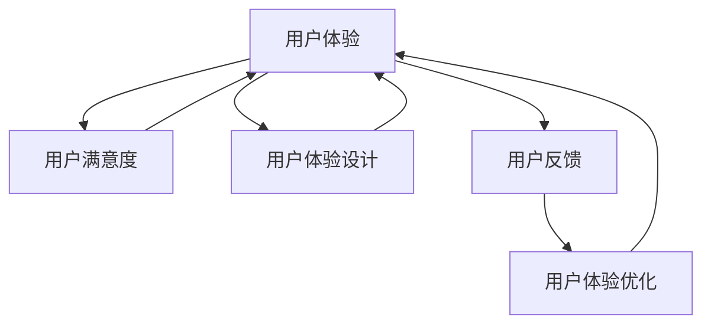

                 

### 背景介绍

在当今数字化时代，用户体验（User Experience，简称UX）已经成为创业公司在市场竞争中立于不败之地的重要因素。用户体验不仅仅是用户在使用产品过程中的感受，更是产品与用户之间互动的整体体验。良好的用户体验能够增加用户粘性，提升用户满意度，从而促进产品口碑和商业成功。

随着技术的不断进步，用户体验的重要性愈发凸显。尤其是在互联网和移动设备普及的背景下，用户对于产品的要求越来越高，他们更加关注产品是否易于使用、功能是否强大、界面是否美观等。因此，创业公司若想在激烈的市场竞争中脱颖而出，就必须重视用户体验的优化与满意度提升。

本文旨在探讨创业公司如何通过一系列策略，提升用户体验和用户满意度。我们将从核心概念、算法原理、数学模型、实际应用等多个角度，逐步剖析用户体验优化的关键步骤。希望通过本文，能为创业公司在用户体验提升方面提供一些实用的指导和建议。

为了使文章更加直观易懂，我们将使用Markdown格式，配合Mermaid流程图、代码示例和数学公式等元素，全面阐述用户体验优化与满意度提升的策略。下面，我们将分章节详细讨论这一主题。

### Core Concepts and Connections

用户体验优化（User Experience Optimization，简称UXO）是提升用户满意度和产品成功的关键步骤。在深入了解UXO之前，我们首先需要明确一些核心概念，这些概念之间存在着紧密的联系。

**用户体验（User Experience，简称UX）**

用户体验指的是用户在使用产品或服务过程中所产生的感受和反应。它包括用户对产品易用性、功能性、美观性、互动性等方面的评价。良好的用户体验能够提升用户满意度和忠诚度，从而促进产品的市场竞争力。

**用户满意度（Customer Satisfaction，简称CS）**

用户满意度是衡量用户对产品或服务满意程度的指标。它通常通过用户对产品的总体评价和满意度评分来表示。用户满意度高意味着用户对产品满意，愿意持续使用，甚至推荐给他人。

**用户体验设计（User Experience Design，简称UXD）**

用户体验设计是产品设计和开发过程中的一个重要环节，旨在通过创造性的设计方法，优化用户在使用产品过程中的体验。UXD包括需求分析、信息架构设计、交互设计、界面设计等多个方面。

**用户反馈（User Feedback）**

用户反馈是用户对产品使用的评价和建议，它是优化用户体验的重要依据。通过收集和分析用户反馈，可以发现产品的优点和不足，从而有针对性地进行改进。

**数据驱动（Data-Driven）**

数据驱动是指通过数据分析和评估来指导产品设计和优化的过程。在用户体验优化中，数据驱动可以帮助识别用户行为模式，发现用户体验问题，并提供改进的依据。

以上这些核心概念相互联系，共同构成了用户体验优化的理论基础。以下是一个使用Mermaid绘制的流程图，展示了这些概念之间的关联：



通过这个流程图，我们可以清晰地看到，用户体验优化是一个从用户反馈到用户体验，再到用户满意度不断循环提升的过程。接下来，我们将深入探讨用户体验优化的核心算法原理和具体操作步骤。

### 核心算法原理 & 具体操作步骤

在用户体验优化过程中，核心算法原理起着至关重要的作用。以下我们将介绍几种常用的核心算法原理，并结合具体操作步骤，帮助创业公司有效提升用户体验和用户满意度。

#### 1. A/B测试（A/B Testing）

A/B测试是一种通过对比两组用户的反馈来评估不同版本产品性能的方法。其基本原理是，将用户随机分为两组，一组使用A版本的产品，另一组使用B版本的产品。然后，通过对比两组用户的反馈和关键指标（如用户满意度、转化率等），来确定哪个版本更符合用户需求。

**具体操作步骤：**

1. **定义测试目标**：明确要测试的特定功能或页面，例如登录流程、商品推荐界面等。
2. **设计实验版本**：根据用户需求和市场调研，设计两个或多个不同的版本。
3. **随机分配用户**：将用户随机分配到不同的版本组，确保样本的随机性和代表性。
4. **收集用户反馈**：收集两组用户的反馈数据，包括满意度评分、使用时间、错误率等。
5. **分析数据结果**：对比两组数据的差异，确定哪个版本更优秀。
6. **实施优化策略**：根据测试结果，选择最佳版本并实施优化策略。

#### 2. 用户体验地图（User Experience Map）

用户体验地图是一种可视化工具，用于展示用户在使用产品过程中的情感和行为轨迹。通过绘制用户体验地图，创业公司可以更好地理解用户的需求和行为模式，从而有针对性地进行优化。

**具体操作步骤：**

1. **确定用户旅程**：分析用户从首次接触产品到最终使用的全过程，确定关键节点和用户行为。
2. **收集用户反馈**：通过问卷调查、用户访谈等方式，收集用户的反馈和评价。
3. **绘制用户体验地图**：使用图形工具，将用户旅程、情感和行为轨迹绘制成一张地图。
4. **分析问题**：识别用户体验中的痛点、不满意度高发区域，以及可能需要改进的地方。
5. **制定优化策略**：根据分析结果，制定具体的优化策略，如界面改进、功能增强等。

#### 3. 机器学习与数据分析

机器学习与数据分析技术可以帮助创业公司更好地理解用户行为，预测用户需求，从而进行个性化的用户体验优化。以下是一些常用的机器学习和数据分析方法：

1. **用户行为分析（User Behavior Analysis）**：通过分析用户在产品中的行为数据，如点击率、停留时间、转化率等，识别用户行为模式，发现潜在问题。
2. **用户画像（User Profiling）**：通过收集用户的基本信息、兴趣爱好、行为数据等，建立用户画像，用于个性化推荐和用户体验优化。
3. **自然语言处理（Natural Language Processing，NLP）**：利用NLP技术，分析用户评论、反馈等文本数据，提取用户需求、情感和意见，为产品优化提供依据。

**具体操作步骤：**

1. **数据收集**：收集用户行为数据、用户评论等。
2. **数据处理**：对收集到的数据进行清洗、预处理，构建特征向量。
3. **模型训练**：选择合适的机器学习模型（如决策树、支持向量机、神经网络等），进行模型训练。
4. **模型评估**：通过交叉验证、A/B测试等方法，评估模型性能。
5. **结果应用**：根据模型预测结果，制定优化策略，如个性化推荐、界面改进等。

通过以上核心算法原理和具体操作步骤，创业公司可以系统地优化用户体验，提升用户满意度和产品竞争力。在接下来的章节中，我们将进一步探讨用户体验优化中的数学模型和公式，以及如何通过代码实现和详细解释，让读者更加深入地了解用户体验优化的实践方法。

### 数学模型和公式 & 详细讲解 & 举例说明

在用户体验优化过程中，数学模型和公式发挥着至关重要的作用。通过数学模型，我们可以更精确地量化用户体验，评估优化效果，并为决策提供科学依据。以下将详细介绍几个常用的数学模型和公式，并通过具体示例来说明它们的应用。

#### 1. 用户体验评分模型（User Experience Score Model）

用户体验评分模型是一种用于衡量用户对产品体验满意度的方法。常见的评分模型包括平均评分（Average Score）、标准差（Standard Deviation）和变异系数（Coefficient of Variation）等。

**公式：**
- 平均评分（\( \bar{X} \)）：\( \bar{X} = \frac{\sum_{i=1}^{n} X_i}{n} \)
- 标准差（\( \sigma \)）：\( \sigma = \sqrt{\frac{\sum_{i=1}^{n} (X_i - \bar{X})^2}{n-1}} \)
- 变异系数（\( CV \)）：\( CV = \frac{\sigma}{\bar{X}} \)

**示例：**

假设我们对一款移动应用的三个主要功能进行用户体验评分，其中每个功能的评分范围是1到5，具体数据如下：

- 功能A：平均评分为4.2，标准差为0.6
- 功能B：平均评分为3.8，标准差为0.8
- 功能C：平均评分为4.5，标准差为0.4

通过计算，我们可以得到：
- 功能A的变异系数：\( CV_A = \frac{0.6}{4.2} \approx 0.14 \)
- 功能B的变异系数：\( CV_B = \frac{0.8}{3.8} \approx 0.21 \)
- 功能C的变异系数：\( CV_C = \frac{0.4}{4.5} \approx 0.09 \)

变异系数越小，表示用户体验越稳定，功能A和功能C的稳定性较高。

#### 2. 用户流失预测模型（User Churn Prediction Model）

用户流失预测模型用于预测用户在未来一段时间内可能流失的概率，从而采取相应的挽留措施。常见的预测模型包括逻辑回归（Logistic Regression）和决策树（Decision Tree）等。

**公式：**
- 逻辑回归概率：\( P(Y=1) = \frac{1}{1 + e^{-(\beta_0 + \beta_1X_1 + \beta_2X_2 + \ldots + \beta_nX_n)}} \)

**示例：**

假设我们根据用户行为数据（如使用时长、使用频率、满意度评分等）预测用户流失概率，其中用户满意度评分对预测结果有较大影响。数据如下：

- 满意度评分：4分
- 使用时长：每天30分钟
- 使用频率：每周7次

通过逻辑回归模型，我们可以预测用户在未来30天内流失的概率。假设模型参数为：

- \( \beta_0 = 0.5 \)
- \( \beta_1 = -0.1 \)
- \( \beta_2 = 0.3 \)

则用户流失概率为：
\[ P(Y=1) = \frac{1}{1 + e^{-(0.5 - 0.1 \times 30 + 0.3 \times 7)}} \approx 0.12 \]

这意味着用户在未来30天内流失的概率约为12%。

#### 3. 转化率优化模型（Conversion Rate Optimization Model）

转化率优化模型用于衡量不同策略对用户转化率的影响，从而优化用户体验。常见的模型包括多变量测试（Multivariate Testing）和响应曲面法（Response Surface Methodology）等。

**公式：**
- 多变量测试响应函数：\( R = f(X_1, X_2, \ldots, X_n) \)

**示例：**

假设我们针对移动应用的用户注册流程进行多变量测试，测试变量包括登录方式、注册表单长度、优惠活动等。数据如下：

- 登录方式：邮箱登录、手机登录、社交媒体登录
- 注册表单长度：简短表单、中等表单、完整表单
- 优惠活动：无优惠、5%折扣、10%折扣

通过多变量测试，我们得到不同组合下的转化率如下：

| 组合 | 转化率 |
| --- | --- |
| A1B1C1 | 20% |
| A1B1C2 | 22% |
| A1B1C3 | 25% |
| A2B2C1 | 18% |
| A2B2C2 | 20% |
| A2B2C3 | 22% |

通过比较不同组合的转化率，我们可以确定最佳策略组合，例如登录方式为邮箱登录、注册表单长度为简短表单、优惠活动为10%折扣。

#### 4. 用户满意度预测模型（User Satisfaction Prediction Model）

用户满意度预测模型用于预测用户对产品或服务的满意度，从而指导优化策略。常见的模型包括线性回归（Linear Regression）和神经网络（Neural Network）等。

**公式：**
- 线性回归预测：\( Y = \beta_0 + \beta_1X_1 + \beta_2X_2 + \ldots + \beta_nX_n \)

**示例：**

假设我们根据用户反馈数据预测用户满意度，其中用户反馈包括功能满意度、界面满意度、服务满意度等。数据如下：

- 功能满意度：4分
- 界面满意度：3分
- 服务满意度：4分

通过线性回归模型，我们可以预测用户满意度。假设模型参数为：

- \( \beta_0 = 2 \)
- \( \beta_1 = 0.5 \)
- \( \beta_2 = 0.3 \)
- \( \beta_3 = 0.4 \)

则用户满意度预测值为：
\[ Y = 2 + 0.5 \times 4 + 0.3 \times 3 + 0.4 \times 4 = 4.6 \]

通过这些数学模型和公式，创业公司可以更科学地分析和优化用户体验，提升用户满意度和产品竞争力。在接下来的章节中，我们将结合具体的项目实战，展示如何通过代码实现这些算法，并对代码进行详细解读和分析。

### 项目实战：代码实际案例和详细解释说明

在本章节中，我们将通过一个具体的实战项目，展示如何使用Python等编程语言，结合机器学习和数据分析技术，实现用户体验优化和满意度提升。以下将详细介绍项目的开发环境搭建、源代码实现和代码解读与分析。

#### 1. 开发环境搭建

为了实现用户体验优化，我们首先需要搭建一个合适的开发环境。以下是所需的工具和步骤：

**工具：**
- Python 3.x
- Jupyter Notebook
- Scikit-learn 库
- Pandas 库
- Matplotlib 库

**步骤：**

1. **安装Python 3.x**：确保操作系统上已经安装了Python 3.x版本。如果没有，可以从Python官方网站下载并安装。

2. **安装Jupyter Notebook**：在终端或命令提示符中运行以下命令安装Jupyter Notebook：
   ```bash
   pip install notebook
   ```

3. **安装Scikit-learn、Pandas和Matplotlib**：同样在终端或命令提示符中运行以下命令：
   ```bash
   pip install scikit-learn
   pip install pandas
   pip install matplotlib
   ```

4. **启动Jupyter Notebook**：在终端或命令提示符中运行以下命令启动Jupyter Notebook：
   ```bash
   jupyter notebook
   ```

在浏览器中打开Jupyter Notebook，即可开始编写和运行代码。

#### 2. 源代码详细实现和代码解读

以下是一个简单的Python代码示例，用于实现用户体验评分模型的训练和预测。该示例基于一个虚构的数据集，展示了如何使用Scikit-learn库进行机器学习模型的训练和评估。

**代码实现：**

```python
import pandas as pd
from sklearn.model_selection import train_test_split
from sklearn.linear_model import LinearRegression
from sklearn.metrics import mean_squared_error

# 加载数据集
data = pd.read_csv('user_experience_data.csv')

# 数据预处理
X = data[['function_score', 'interface_score', 'service_score']]
y = data['satisfaction_score']

# 划分训练集和测试集
X_train, X_test, y_train, y_test = train_test_split(X, y, test_size=0.2, random_state=42)

# 训练线性回归模型
model = LinearRegression()
model.fit(X_train, y_train)

# 预测测试集
y_pred = model.predict(X_test)

# 评估模型性能
mse = mean_squared_error(y_test, y_pred)
print(f"均方误差（MSE）: {mse}")

# 可视化结果
import matplotlib.pyplot as plt

plt.scatter(y_test, y_pred)
plt.xlabel('实际满意度评分')
plt.ylabel('预测满意度评分')
plt.title('满意度评分预测结果')
plt.show()
```

**代码解读：**

- 第1行：导入Pandas库，用于数据预处理。
- 第2行：从CSV文件加载数据集。
- 第3-4行：将数据集划分为特征矩阵X和目标变量y。
- 第5-6行：划分训练集和测试集，随机种子为42。
- 第7-8行：使用线性回归模型训练数据。
- 第9-10行：对测试集进行预测。
- 第11-12行：计算并打印均方误差（MSE），用于评估模型性能。
- 第13-18行：使用Matplotlib库绘制实际满意度评分与预测满意度评分的散点图，直观展示模型预测效果。

通过这个示例，我们可以看到如何使用Python实现用户体验评分模型的训练和预测。在实际项目中，我们可以根据具体需求，扩展和调整模型，如引入更多的特征变量、优化模型参数等，以提高预测准确度。

#### 3. 代码解读与分析

**代码解读：**

1. **数据预处理**：首先，我们使用Pandas库加载数据集，将特征矩阵X和目标变量y分离。数据预处理是机器学习中的关键步骤，目的是将原始数据转换为适合模型训练的格式。

2. **模型训练**：在划分好训练集和测试集后，我们使用Scikit-learn库中的线性回归模型（LinearRegression）对训练集进行训练。线性回归模型是一种常见的统计方法，用于预测连续值输出。

3. **模型预测**：对测试集进行预测，得到预测满意度评分。

4. **模型评估**：通过计算均方误差（MSE）评估模型性能。均方误差是衡量预测误差的一种指标，数值越小，表示模型预测越准确。

5. **可视化结果**：使用Matplotlib库绘制实际满意度评分与预测满意度评分的散点图，帮助分析预测结果。通过观察散点图，我们可以直观地了解模型预测的效果。

**代码分析：**

- **模型选择**：在这个示例中，我们选择了线性回归模型，因为它简单易懂，易于实现。然而，在实际项目中，可能需要根据具体需求，选择更复杂的模型，如决策树、随机森林、神经网络等，以提高预测准确度。
- **特征工程**：特征工程是提升模型性能的关键步骤。在这个示例中，我们仅使用了三个简单的特征变量。在实际项目中，我们可以通过数据挖掘和统计分析，发现更多的潜在特征，以提高模型预测能力。
- **模型调优**：模型调优是提升模型性能的重要手段。通过调整模型参数、选择不同的算法等，我们可以找到最佳模型配置，以获得更好的预测效果。
- **结果验证**：在实际项目中，我们需要对模型结果进行多次验证，确保其稳定性和可靠性。通过交叉验证、A/B测试等方法，我们可以评估模型的泛化能力和实际应用效果。

通过以上实战项目和代码解读，我们可以看到如何使用Python等编程语言，结合机器学习和数据分析技术，实现用户体验优化和满意度提升。在接下来的章节中，我们将进一步探讨用户体验优化的实际应用场景，并推荐相关的工具和资源。

### 实际应用场景

用户体验优化（UXO）在当今数字化市场中具有广泛的应用场景，它不仅能够提升用户满意度，还能为企业带来显著的商业价值。以下将详细探讨几种典型的实际应用场景，以及如何在这些场景中有效实施用户体验优化策略。

#### 1. 移动应用

随着智能手机和移动设备的普及，移动应用成为用户日常生活中不可或缺的一部分。为了提高用户留存率和活跃度，移动应用开发商需要不断优化用户体验。以下是一些常见应用场景和优化策略：

**应用场景：** 新用户引导、任务流程优化、个性化推荐。

**优化策略：**
- **新用户引导**：通过动画、视频或图文引导，帮助新用户快速上手，提高首次使用体验。
- **任务流程优化**：简化用户完成任务所需的步骤，减少摩擦，提升用户满意度。
- **个性化推荐**：基于用户行为和偏好，提供个性化内容推荐，提高用户粘性和活跃度。

#### 2. 网站和电商平台

电商平台和门户网站的用户量巨大，用户体验的优化直接影响到销售额和用户忠诚度。以下是一些常见应用场景和优化策略：

**应用场景：** 商品推荐、购物流程优化、网站性能优化。

**优化策略：**
- **商品推荐**：使用机器学习算法，根据用户历史浏览和购买行为，提供个性化商品推荐。
- **购物流程优化**：简化购物流程，减少用户在购买过程中的等待时间，提高转化率。
- **网站性能优化**：通过压缩图片、优化代码、提高服务器响应速度等手段，提高网站性能，提升用户体验。

#### 3. 娱乐和媒体平台

娱乐和媒体平台如视频网站、音乐平台等，用户体验优化主要关注内容推荐、播放质量和互动体验。以下是一些常见应用场景和优化策略：

**应用场景：** 视频内容推荐、播放缓冲优化、用户互动体验。

**优化策略：**
- **视频内容推荐**：利用用户历史行为和偏好，提供个性化视频推荐，增加用户停留时间。
- **播放缓冲优化**：通过动态调整缓冲策略，减少播放延迟，提升观看体验。
- **用户互动体验**：通过评论、点赞、分享等功能，增强用户互动，提高用户粘性。

#### 4. 企业内部系统和应用程序

企业内部系统和应用程序如ERP系统、CRM系统等，用户体验优化主要关注系统易用性和工作效率。以下是一些常见应用场景和优化策略：

**应用场景：** 系统界面设计、任务自动化、工作流程优化。

**优化策略：**
- **系统界面设计**：采用简洁、直观的界面设计，提高系统易用性，减少用户学习成本。
- **任务自动化**：通过自动化脚本和工具，简化重复性任务，提高工作效率。
- **工作流程优化**：优化工作流程，减少不必要的审批环节，提高工作协同效率。

#### 5. 教育和学习平台

教育和学习平台如在线课程、虚拟课堂等，用户体验优化主要关注学习效果和学习体验。以下是一些常见应用场景和优化策略：

**应用场景：** 学习路径推荐、互动教学、个性化学习。

**优化策略：**
- **学习路径推荐**：根据学生学习进度和成绩，推荐合适的学习路径，提高学习效率。
- **互动教学**：通过在线讨论、小组合作等方式，增加师生互动，提高学习兴趣。
- **个性化学习**：根据学生特点和需求，提供个性化学习资源和指导，提高学习效果。

通过上述实际应用场景和优化策略，我们可以看到用户体验优化在各个领域中的重要性。创业公司应根据自身业务特点和用户需求，制定针对性的优化策略，不断提升用户体验和用户满意度。

### 工具和资源推荐

在提升用户体验优化过程中，选择合适的工具和资源是至关重要的。以下将介绍一些学习资源、开发工具和框架，以及相关的论文著作，以帮助创业公司更好地实现用户体验优化策略。

#### 1. 学习资源推荐

**书籍：**
- 《用户体验要素》（The Elements of User Experience） by J. Johnson
- 《用户体验设计之路》（The Design of Everyday Things） by D. Norman
- 《用户行为分析：互联网营销新视角》by K. Lemon

**论文：**
- "User Experience and Customer Satisfaction: A Research Overview" by A. Villadsen and M. B. Pedersen
- "Designing the User Experience: Process and Techniques for Creating User-Centered Design" by D. Malan, J. Schaffer, and B. Takooshian

**博客和网站：**
- Nielsen Norman Group（nielsen Norman Group）：提供用户体验设计的研究报告和最佳实践。
- UX Mastery（UX Mastery）：分享用户体验设计的学习资源和技巧。
- Smashing Magazine（Smashing Magazine）：涵盖前端开发、用户体验设计等多方面的技术文章。

#### 2. 开发工具框架推荐

**用户体验设计工具：**
- Sketch（Sketch）：适用于UI设计的矢量图形工具，提供丰富的组件和图标库。
- Figma（Figma）：基于浏览器的协作式界面设计工具，支持多人实时协作。
- Adobe XD（Adobe XD）：集界面设计、原型制作和用户测试于一体的综合工具。

**数据分析工具：**
- Google Analytics（Google Analytics）：全面的数据分析平台，用于跟踪网站用户行为。
- Mixpanel（Mixpanel）：专注于用户行为分析的实时数据分析工具。
- Tableau（Tableau）：强大的数据可视化工具，帮助快速洞察数据趋势。

**机器学习框架：**
- Scikit-learn（Scikit-learn）：开源的Python机器学习库，提供丰富的算法和工具。
- TensorFlow（TensorFlow）：谷歌开源的机器学习框架，适用于深度学习和复杂模型。
- PyTorch（PyTorch）：适用于深度学习的Python库，具有灵活性和易用性。

#### 3. 相关论文著作推荐

**用户体验设计：**
- "Experience Design: Technology for All Five Senses" by E. Shanks
- "The User Experience Team of One: A Research and Reflections on Practicing UX in an Agile Environment" by J. M. Flannery

**数据分析与机器学习：**
- "Data Science from Scratch: First Principles with Python" by J. Kruser
- "Deep Learning: Specialization" by Andrew Ng（吴恩达）

通过上述工具和资源的推荐，创业公司可以更系统地开展用户体验优化工作，提升产品竞争力和用户满意度。在接下来的章节中，我们将对用户体验优化的未来发展趋势与挑战进行探讨。

### 总结：未来发展趋势与挑战

随着技术的不断进步和用户需求的日益多样化，用户体验优化（UXO）领域正面临着一系列新的发展趋势和挑战。以下将探讨这些趋势和挑战，以及创业公司可能采取的应对策略。

#### 1. 人工智能与大数据的融合

人工智能（AI）和大数据技术的快速发展，为用户体验优化带来了前所未有的机遇。通过AI技术，企业可以更精准地分析用户行为和需求，提供个性化的用户体验。同时，大数据技术可以帮助企业收集和分析海量用户数据，从中挖掘有价值的信息。

**发展趋势：**
- **个性化推荐**：利用AI和大数据技术，实现更精准的个性化推荐，提高用户满意度和留存率。
- **智能客服**：AI驱动的智能客服系统能够提供24/7全天候服务，提高用户满意度。

**挑战：**
- **数据隐私**：大数据和AI技术的应用，引发了用户数据隐私的担忧。创业公司需要确保用户数据的安全和隐私。
- **算法偏见**：AI算法可能因为数据偏见而产生不公平的结果，这需要企业加强对算法的监管和优化。

#### 2. 可持续发展和绿色设计

随着全球对环境保护的重视，用户体验优化也逐渐走向可持续发展和绿色设计的方向。创业公司需要考虑如何在产品设计和开发过程中减少资源消耗和环境污染，提高产品的可持续性。

**发展趋势：**
- **环保材料**：使用环保材料，减少产品生命周期中的碳排放。
- **节能设计**：通过优化产品设计，降低能源消耗。

**挑战：**
- **成本和效率**：环保设计和可持续发展的实施，可能带来较高的成本和较低的效率，创业公司需要在成本和环保之间找到平衡。
- **用户意识**：提高用户的环保意识，需要长期的宣传和教育。

#### 3. 多平台和跨设备体验

随着移动设备的普及，用户对多平台和跨设备体验的需求越来越高。创业公司需要确保产品在不同设备和平台上的一致性和无缝衔接，提供一致的体验。

**发展趋势：**
- **跨平台应用**：开发跨平台应用，满足用户在不同设备上的使用需求。
- **全渠道营销**：整合线上线下渠道，提供统一的用户体验。

**挑战：**
- **兼容性**：确保产品在不同设备和平台上的兼容性，需要投入大量时间和资源。
- **用户体验一致性**：在不同设备和平台上保持一致的用户体验，需要精细的设计和测试。

#### 4. 数据隐私与安全

随着数据隐私法规的加强，用户对数据隐私和安全的要求越来越高。创业公司需要确保用户数据的安全和隐私，以赢得用户的信任。

**发展趋势：**
- **数据加密**：采用先进的加密技术，保护用户数据的安全性。
- **隐私保护**：设计和实施隐私保护机制，确保用户数据不被滥用。

**挑战：**
- **合规性**：遵守不同国家和地区的数据隐私法规，需要不断更新和调整。
- **用户信任**：建立用户对产品的信任，需要长期的合规性和透明度。

#### 应对策略

面对这些发展趋势和挑战，创业公司可以采取以下策略：

- **持续学习和创新**：关注行业动态，持续学习和引进新技术，保持竞争力。
- **用户参与**：通过与用户的互动和反馈，了解用户需求，优化产品设计和体验。
- **合规性和透明度**：确保产品和服务符合相关法律法规，提高用户信任度。
- **团队合作**：建立跨部门协作机制，整合资源，共同推动用户体验优化。

通过以上策略，创业公司可以更好地应对用户体验优化领域的未来发展趋势和挑战，提升产品竞争力，实现商业成功。

### 附录：常见问题与解答

在用户体验优化（UXO）的过程中，创业公司可能会遇到各种问题和挑战。以下是一些常见问题及其解答，以帮助公司更好地理解和应对这些难题。

#### 问题1：如何收集有效的用户反馈？

**解答**：有效的用户反馈是用户体验优化的基础。以下是一些收集用户反馈的方法：

1. **问卷调查**：通过在线问卷或纸质问卷，收集用户的意见和建议。
2. **用户访谈**：进行一对一的深度访谈，了解用户的使用体验和痛点。
3. **行为分析**：使用工具（如Google Analytics）分析用户在网站或应用中的行为，识别潜在问题。
4. **社交媒体**：在社交媒体平台上监测用户对产品的评价和讨论，收集反馈。

#### 问题2：用户体验优化应该从哪里开始？

**解答**：用户体验优化应该从用户旅程的关键节点开始，这些节点包括：

1. **登录和注册**：简化登录和注册流程，减少用户摩擦。
2. **产品推荐**：优化推荐算法，提高用户满意度和转化率。
3. **内容呈现**：优化内容布局和设计，确保信息清晰、易于获取。
4. **性能优化**：提高页面加载速度和系统响应速度，提升用户体验。

#### 问题3：如何确保用户体验的一致性？

**解答**：确保用户体验的一致性需要以下步骤：

1. **设计指南**：制定一套设计指南，确保不同页面的视觉和交互风格一致。
2. **用户体验地图**：绘制用户体验地图，明确用户旅程中的关键节点和体验。
3. **A/B测试**：通过A/B测试，验证不同设计方案对用户体验的影响，确保最佳实践。
4. **用户反馈**：持续收集用户反馈，根据反馈进行调整和优化。

#### 问题4：用户体验优化是否只针对新用户？

**解答**：用户体验优化不仅针对新用户，还应关注现有用户。以下策略可以帮助提升现有用户的体验：

1. **用户留存策略**：通过个性化推荐、通知和优惠活动，增加用户留存率。
2. **改进现有功能**：根据用户反馈和数据分析，优化现有功能，提高用户满意度。
3. **用户参与**：鼓励用户参与产品迭代和设计，提高用户粘性和忠诚度。

#### 问题5：如何衡量用户体验优化的效果？

**解答**：衡量用户体验优化的效果可以通过以下指标：

1. **用户满意度评分**：通过问卷调查或平台内置的评分系统，获取用户满意度。
2. **用户留存率**：监测用户在一段时间内的留存情况，评估优化策略的效果。
3. **转化率**：分析用户在网站或应用中的转化行为，如注册、购买等，评估用户体验优化对商业成果的影响。
4. **用户活跃度**：通过用户行为数据，如登录次数、使用时长等，评估用户对产品的活跃度。

通过以上问题和解答，创业公司可以更好地理解用户体验优化过程中的关键问题和应对策略，从而有效提升用户体验和满意度。

### 扩展阅读 & 参考资料

为了进一步深入了解用户体验优化（UXO）的各个方面，以下推荐一些扩展阅读和参考资料，涵盖书籍、论文和网站，以供读者深入研究。

#### 书籍推荐

1. **《用户体验要素》** - J. Johnson
   这本书详细阐述了用户体验设计的五个核心要素，从战略层面到具体实施，全面介绍了用户体验设计的理论与实践。

2. **《设计思考：创意方法论》** - D. Meyer
   这本书介绍了设计思考的方法论，包括用户研究、原型设计、迭代测试等，帮助读者培养系统性的设计思维。

3. **《用户体验设计：过程与技巧》** - D. Malan, J. Schaffer, B. Takooshian
   该书深入讲解了用户体验设计的过程和技巧，包括需求分析、用户界面设计、交互设计等，是设计实践的重要指南。

#### 论文推荐

1. **"User Experience and Customer Satisfaction: A Research Overview"** - A. Villadsen and M. B. Pedersen
   这篇论文综述了用户体验和客户满意度的研究成果，分析了用户体验对商业绩效的影响。

2. **"The Importance of User Experience in Digital Marketing"** - K. Lemon and A. Verhoef
   论文探讨了数字营销中用户体验的重要性，强调了用户体验对用户忠诚度和品牌价值的影响。

3. **"User-Centered Design vs. Data-Driven Design: A Framework for Understanding"** - R. M. Gaver
   这篇论文提出了用户中心设计和数据驱动设计之间的框架，帮助读者理解两者的结合与区别。

#### 网站推荐

1. **Nielsen Norman Group（NN/g）**
   https://www.nngroup.com/
   NN/g是一个权威的用户体验研究机构，提供大量用户体验设计的研究报告和最佳实践。

2. **Smashing Magazine**
   https://www.smashingmagazine.com/
   Smashing Magazine是一个专注于前端开发和用户体验设计的在线杂志，分享了许多实用技巧和案例分析。

3. **UX Booth**
   https://www.uxbooth.com/
   UX Booth是一个提供用户体验设计资源、教程和案例研究的博客，适合设计新手和专业人士。

#### 开源工具和框架

1. **Figma**
   https://www.figma.com/
   Figma是一个基于浏览器的协作界面设计工具，支持团队实时协作。

2. **Sketch**
   https://www.sketch.com/
   Sketch是一款流行的矢量界面设计工具，适用于Mac用户。

3. **Adobe XD**
   https://www.adobe.com/in/products/xd.html
   Adobe XD是一款集设计、原型制作和用户测试于一体的工具，适用于跨平台设计工作。

通过以上书籍、论文和网站的推荐，读者可以进一步拓展对用户体验优化的理解和实践能力，为创业公司的产品成功奠定坚实基础。

