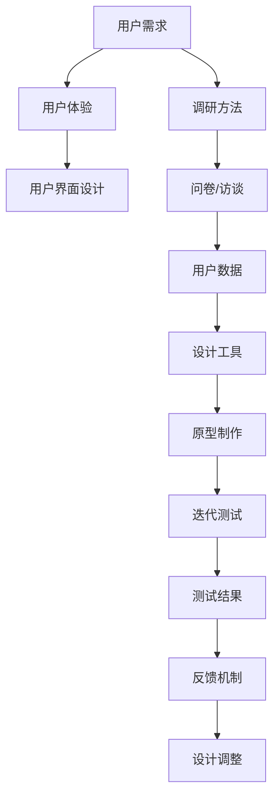
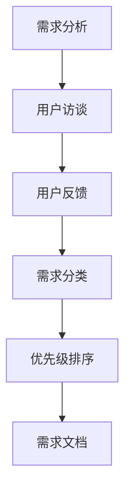
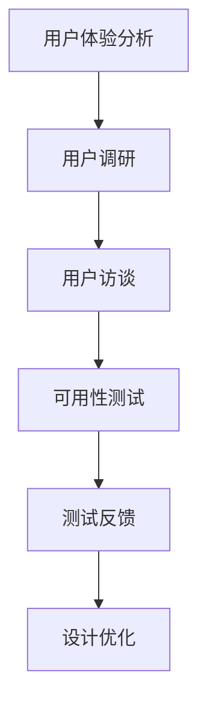
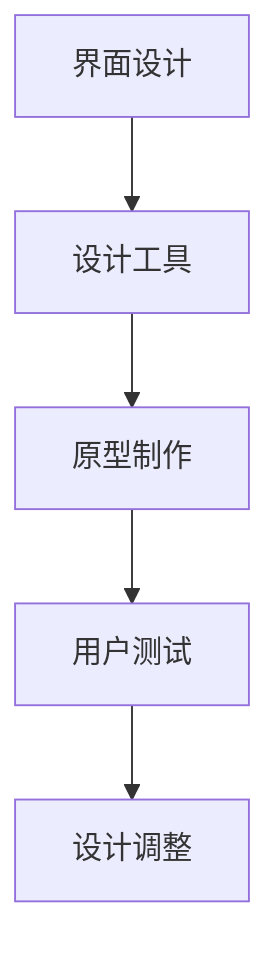
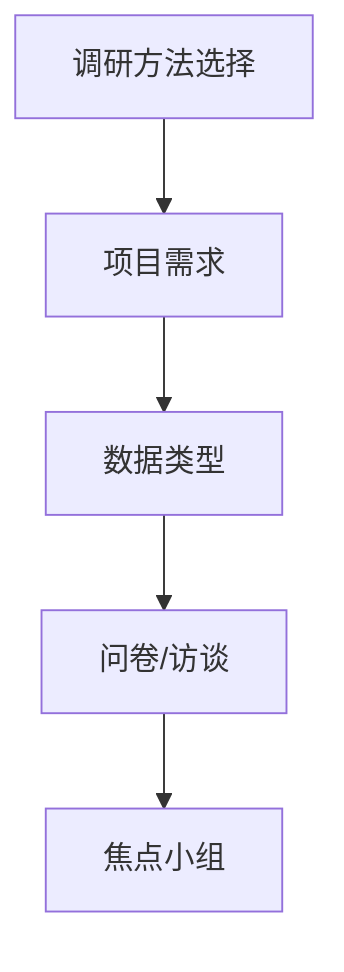
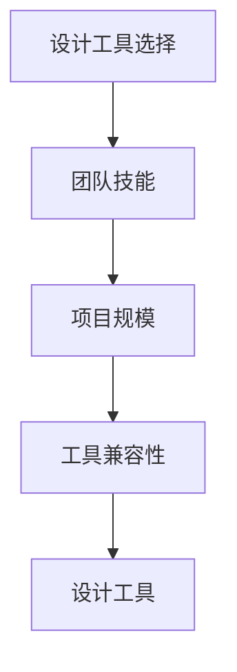
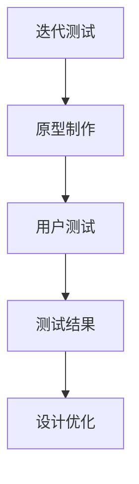
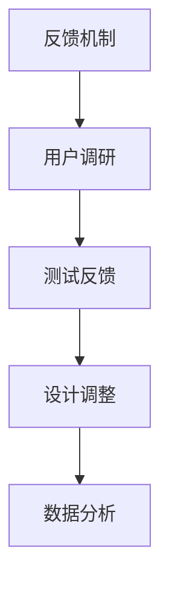

                 

# 创业公司的用户体验设计流程优化

> **关键词**: 用户体验设计，创业公司，流程优化，用户调研，设计工具

> **摘要**: 本文将深入探讨创业公司如何优化用户体验设计流程，包括用户调研的重要性、设计工具的选择、迭代测试和反馈机制的建立，从而提升产品竞争力。

## 1. 背景介绍

创业公司在市场竞争中往往需要迅速适应环境，快速迭代产品。用户体验设计（User Experience Design，简称UXD）在这一过程中扮演着至关重要的角色。一个优秀的用户体验设计不仅能吸引和保留用户，还能提升品牌价值，从而为创业公司带来更多的商业机会。

然而，创业公司的资源和时间通常有限，因此需要高效的流程来优化用户体验设计。本文将围绕以下几个方面展开讨论：

- 用户调研：理解用户需求和行为
- 设计工具：选择合适的设计工具提高效率
- 迭代测试：快速验证设计效果
- 反馈机制：持续优化用户体验

通过这些方法的结合，创业公司可以更有效地优化用户体验设计流程，提高产品的市场竞争力。

### 1.1 用户调研的重要性

用户调研是用户体验设计的基础，是理解用户需求和行为的最佳途径。通过调研，设计团队可以收集到第一手的用户数据，从而做出更准确的设计决策。

调研方法多样，包括问卷调查、访谈、焦点小组等。问卷调查适合大规模数据收集，访谈则能深入了解用户的内心想法，焦点小组可以促进深度讨论。无论选择哪种方法，关键是确保调研过程的客观性和有效性。

### 1.2 设计工具的选择

设计工具是用户体验设计的重要辅助，能够提高设计效率和准确性。常见的工具包括Sketch、Figma、Adobe XD等。这些工具支持界面设计、原型制作、协作共享等功能，有助于设计团队快速迭代设计方案。

选择设计工具时，需要考虑团队的技能水平、项目的规模和需求。例如，Sketch适合独立设计师使用，而Figma更适合团队协作。此外，设计工具的兼容性和扩展性也是选择的重要依据。

### 1.3 迭代测试

迭代测试是用户体验设计的重要环节，通过不断的测试和反馈，设计团队能够发现并解决潜在问题，从而优化设计方案。测试方法包括A/B测试、用户测试、可用性测试等。

A/B测试通过将用户分为两组，分别展示不同的设计方案，从而评估哪种设计更能满足用户需求。用户测试则邀请真实用户参与，通过观察和访谈来评估设计的实际效果。可用性测试则关注设计的易用性，评估用户完成特定任务的能力。

### 1.4 反馈机制

建立有效的反馈机制是持续优化用户体验的关键。通过用户调研、迭代测试和用户反馈，设计团队可以持续改进设计方案。反馈机制应包括用户反馈收集、数据分析、设计调整等环节。

有效的反馈机制不仅能够帮助设计团队及时发现问题，还能增强用户的参与感和满意度，从而提升产品的市场竞争力。

## 2. 核心概念与联系

用户体验设计涉及到多个核心概念，包括用户需求、用户体验、用户界面设计等。以下是一个简单的Mermaid流程图，展示了这些概念之间的联系。



在这个流程中，用户需求是起点，调研方法用于收集用户数据，设计工具用于原型制作和测试，最终通过反馈机制实现设计的优化。

### 2.1 用户需求

用户需求是用户体验设计的核心。理解用户需求可以帮助设计团队确定设计目标和优先级。以下是一个简单的流程图，展示了用户需求分析的过程。



### 2.2 用户体验

用户体验是指用户在使用产品过程中感受到的所有方面，包括易用性、美观性、功能性等。以下是一个简单的流程图，展示了如何通过调研和测试来提升用户体验。



### 2.3 用户界面设计

用户界面设计是用户体验设计的重要组成部分，直接影响用户的操作体验。以下是一个简单的流程图，展示了用户界面设计的流程。



### 2.4 调研方法

调研方法是收集用户数据的关键，包括问卷调查、访谈、焦点小组等。以下是一个简单的流程图，展示了如何选择合适的调研方法。



### 2.5 设计工具

设计工具是用户体验设计的重要辅助，包括Sketch、Figma、Adobe XD等。以下是一个简单的流程图，展示了如何选择合适的设计工具。



### 2.6 迭代测试

迭代测试是用户体验设计的重要环节，通过不断的测试和反馈，设计团队能够发现并解决潜在问题。以下是一个简单的流程图，展示了迭代测试的流程。



### 2.7 反馈机制

反馈机制是持续优化用户体验的关键。通过用户调研、迭代测试和用户反馈，设计团队可以持续改进设计方案。以下是一个简单的流程图，展示了如何建立有效的反馈机制。



## 3. 核心算法原理 & 具体操作步骤

用户体验设计涉及多个核心算法原理，包括可用性测试、A/B测试等。以下将介绍这些算法原理的具体操作步骤。

### 3.1 可用性测试

可用性测试是通过观察用户在使用产品时的行为和反应，评估产品的易用性和用户体验。以下是可用性测试的具体操作步骤：

1. **确定测试目标**：明确测试的目的是为了评估产品的哪个方面，例如导航、表单填写等。
2. **编写测试任务**：根据测试目标，编写具体的测试任务，例如让用户完成一项特定任务。
3. **招募测试参与者**：选择具有代表性的用户作为测试参与者，确保测试结果的准确性。
4. **进行测试**：邀请参与者完成测试任务，观察并记录他们的行为和反应。
5. **收集反馈**：在测试过程中，收集参与者的反馈，包括访谈和问卷。
6. **分析结果**：分析测试结果，识别产品中存在的问题和改进机会。

### 3.2 A/B测试

A/B测试是一种通过将用户分为两组，分别展示不同的设计方案，从而评估哪种设计更能满足用户需求的测试方法。以下是A/B测试的具体操作步骤：

1. **定义测试假设**：明确测试的目标和假设，例如假设方案A比方案B更易于用户操作。
2. **设计测试方案**：根据测试假设，设计两种不同的设计方案。
3. **将用户分为两组**：将用户随机分为两组，分别展示不同的设计方案。
4. **收集数据**：在测试期间，收集用户的行为数据，如点击率、转化率等。
5. **分析数据**：比较两组数据，评估哪种设计方案更能满足用户需求。
6. **实施改进**：根据测试结果，对设计方案进行改进。

## 4. 数学模型和公式 & 详细讲解 & 举例说明

在用户体验设计流程中，数学模型和公式可以帮助我们更准确地分析和优化设计。以下将介绍几个常用的数学模型和公式，并进行详细讲解和举例说明。

### 4.1 问卷调查的数据分析

问卷调查是用户调研的一种常见方法，通过问卷调查可以收集大量用户数据。以下是一个简单的数学模型，用于分析问卷调查数据：

$$
\text{满意度} = \frac{\sum_{i=1}^{n} x_i}{n}
$$

其中，$x_i$ 表示第 $i$ 个用户的满意度评分，$n$ 表示总用户数。这个公式计算了所有用户满意度的平均值，从而得到产品的总体满意度。

举例说明：假设我们进行了一项问卷调查，共有 100 个用户参与，他们的满意度评分分别为 4、5、3、4、5。则产品的满意度为：

$$
\text{满意度} = \frac{4 + 5 + 3 + 4 + 5}{5} = 4.2
$$

这意味着产品的总体满意度为 4.2 分。

### 4.2 A/B测试的转化率分析

A/B测试通过比较两组用户的转化率，来评估哪种设计方案更能满足用户需求。以下是一个简单的数学模型，用于分析A/B测试数据：

$$
\text{转化率} = \frac{\text{成功转化数}}{\text{总参与数}}
$$

其中，成功转化数表示完成特定任务的用户数，总参与数表示参与测试的总用户数。这个公式计算了测试组的转化率。

举例说明：假设我们在A/B测试中，共有100个用户参与，其中方案A有40个用户成功转化，方案B有30个用户成功转化。则方案A的转化率为：

$$
\text{转化率} = \frac{40}{100} = 0.4
$$

方案B的转化率为：

$$
\text{转化率} = \frac{30}{100} = 0.3
$$

这意味着方案A的转化率高于方案B，说明方案A的设计方案更符合用户需求。

### 4.3 用户满意度与转化率的关系

用户满意度与转化率之间存在一定的关系。以下是一个简单的数学模型，用于分析用户满意度与转化率之间的关系：

$$
\text{转化率} = \text{满意度} \times \text{转化概率}
$$

其中，满意度表示用户对产品的满意度评分，转化概率表示用户完成特定任务的概率。这个公式表明，用户满意度越高，转化概率越大。

举例说明：假设用户的满意度评分为4.2，转化概率为0.6。则产品的转化率为：

$$
\text{转化率} = 4.2 \times 0.6 = 2.52
$$

这意味着产品的转化率为 252%，说明用户满意度对转化率有显著影响。

### 4.4 可用性测试的F-measure

可用性测试中，F-measure 是一个常用的指标，用于评估设计的易用性。以下是一个简单的数学模型，用于计算F-measure：

$$
F-measure = \frac{2 \times \text{准确率} \times \text{召回率}}{\text{准确率} + \text{召回率}}
$$

其中，准确率表示正确完成任务的用户比例，召回率表示完成任务的用户比例。这个公式计算了F-measure的值，用于评估设计的易用性。

举例说明：假设在可用性测试中，有 100 个用户参与，其中 60 个用户成功完成任务，40 个用户未能完成任务。则准确率为 60%，召回率为 40%。则F-measure为：

$$
F-measure = \frac{2 \times 0.6 \times 0.4}{0.6 + 0.4} = 0.48
$$

这意味着设计的易用性为 48%，说明设计存在改进空间。

## 5. 项目实战：代码实际案例和详细解释说明

### 5.1 开发环境搭建

在进行用户体验设计优化项目前，我们需要搭建一个合适的技术环境。以下是一个基本的开发环境搭建步骤：

#### 开发工具

- **Figma**: 用于设计原型和界面
- **Git**: 版本控制工具
- **Visual Studio Code**: 代码编辑器

#### 技术栈

- **React**: 用于构建前端界面
- **Node.js**: 后端服务运行环境
- **MongoDB**: 数据库

#### 安装步骤

1. 安装Figma：访问 [Figma官网](https://www.figma.com/)，注册账号并下载安装包。
2. 安装Git：访问 [Git官网](https://git-scm.com/)，根据操作系统下载相应的安装包。
3. 安装Visual Studio Code：访问 [Visual Studio Code官网](https://code.visualstudio.com/)，下载并安装。
4. 安装Node.js：访问 [Node.js官网](https://nodejs.org/zh-cn/)，下载并安装。
5. 安装MongoDB：访问 [MongoDB官网](https://www.mongodb.com/try/mongodb-community)，下载并安装。

### 5.2 源代码详细实现和代码解读

以下是一个简单的React前端应用代码示例，用于展示如何实现一个简单的用户调研表单。

#### 5.2.1 登录界面代码示例

```jsx
import React, { useState } from 'react';
import axios from 'axios';

const LoginForm = () => {
  const [email, setEmail] = useState('');
  const [password, setPassword] = useState('');

  const handleSubmit = async (e) => {
    e.preventDefault();
    try {
      const response = await axios.post('/api/login', { email, password });
      if (response.data.success) {
        alert('登录成功！');
      } else {
        alert('登录失败！');
      }
    } catch (error) {
      console.error('登录请求失败：', error);
    }
  };

  return (
    <form onSubmit={handleSubmit}>
      <label htmlFor="email">邮箱地址：</label>
      <input
        type="email"
        id="email"
        value={email}
        onChange={(e) => setEmail(e.target.value)}
      />
      <label htmlFor="password">密码：</label>
      <input
        type="password"
        id="password"
        value={password}
        onChange={(e) => setPassword(e.target.value)}
      />
      <button type="submit">登录</button>
    </form>
  );
};

export default LoginForm;
```

#### 5.2.2 代码解读

- **React组件**：使用 `React` 的函数组件实现登录界面。
- **状态管理**：使用 `useState` 钩子管理 `email` 和 `password` 的状态。
- **异步请求**：使用 `axios` 发起 POST 请求，将用户输入的邮箱和密码发送到后端进行验证。
- **表单提交**：使用 `form` 的 `onSubmit` 事件处理表单提交，并调用 `handleSubmit` 函数。

### 5.3 代码解读与分析

以上代码展示了如何使用 React 实现一个简单的登录界面。以下是对代码的详细解读和分析：

1. **组件结构**：`LoginForm` 组件是一个无状态组件，由函数定义。
2. **状态管理**：使用 `useState` 钩子初始化 `email` 和 `password` 的状态，并绑定到表单输入框。
3. **表单提交**：使用 `form` 的 `onSubmit` 事件处理表单提交，防止默认行为，并调用 `handleSubmit` 函数。
4. **异步请求**：在 `handleSubmit` 函数中，使用 `axios` 发起异步 POST 请求，将用户输入的邮箱和密码发送到后端进行验证。
5. **错误处理**：使用 `try-catch` 语句捕获并处理异步请求中的错误。

### 5.4 功能优化

在实际项目中，我们可以对登录界面进行以下功能优化：

1. **表单验证**：在表单提交前，对邮箱和密码进行验证，确保输入的有效性。
2. **加载状态**：显示加载指示器，告知用户请求正在处理。
3. **错误提示**：在请求失败时，显示具体的错误提示信息。

## 6. 实际应用场景

用户体验设计流程优化在创业公司的实际应用中具有重要意义。以下是一些典型的应用场景：

1. **产品发布前**：在产品发布前，通过用户调研和可用性测试，优化设计，减少产品缺陷，提升用户体验。
2. **迭代过程中**：在产品迭代过程中，通过持续的用户调研和A/B测试，发现并解决用户痛点，提升用户满意度。
3. **市场反馈**：根据市场反馈，调整设计策略，优化用户界面和交互体验，提升产品的市场竞争力。
4. **用户参与**：鼓励用户参与设计过程，通过反馈机制收集用户意见，增强用户参与感和忠诚度。

### 6.1 优化示例

以下是一个具体的优化示例：

#### 场景：优化产品登录界面

1. **用户调研**：通过问卷调查和用户访谈，发现用户对登录界面的反馈主要关注点包括输入框提示、按钮文字和加载提示。
2. **可用性测试**：邀请用户进行可用性测试，观察用户在登录过程中的行为和反应。
3. **设计调整**：根据用户反馈和测试结果，优化登录界面设计，包括改进输入框提示、修改按钮文字、增加加载提示。
4. **A/B测试**：将优化后的设计方案与原设计方案进行A/B测试，比较两种设计方案的转化率。
5. **结果分析**：分析A/B测试结果，发现优化后的设计方案在用户转化率方面有明显提升。

通过这一系列的优化步骤，创业公司可以显著提升产品的用户体验，从而提高用户满意度和市场竞争力。

## 7. 工具和资源推荐

### 7.1 学习资源推荐

- **书籍**：
  - 《用户体验要素》（The Elements of User Experience）- 乔丹·雷文斯沃斯（Jesse James Garrett）
  - 《设计思考》（Design Thinking：The Basics of Design, Innovation, and Strategy）- 戴维·凯利（David Kelley）

- **论文**：
  - 《用户体验设计中的认知心理学》（Cognitive Psychology and UX Design）- 拉斯·海曼（Lars Hemmung）
  - 《交互设计手册》（The Design of Everyday Things）- 达恩·诺曼（Don Norman）

- **博客**：
  - UX Planet: [https://uxplanet.org/](https://uxplanet.org/)
  - UX Collective: [https://uxdesign.cc/](https://uxdesign.cc/)

- **网站**：
  - Nielsen Norman Group: [https://www.nngroup.com/](https://www.nngroup.com/)
  - UX Mastery: [https://uxmastery.com/](https://uxmastery.com/)

### 7.2 开发工具框架推荐

- **设计工具**：
  - Figma: [https://www.figma.com/](https://www.figma.com/)
  - Sketch: [https://www.sketch.com/](https://www.sketch.com/)
  - Adobe XD: [https://www.adobe.com/xd/](https://www.adobe.com/xd/)

- **前端框架**：
  - React: [https://reactjs.org/](https://reactjs.org/)
  - Vue.js: [https://vuejs.org/](https://vuejs.org/)
  - Angular: [https://angular.io/](https://angular.io/)

- **数据库**：
  - MongoDB: [https://www.mongodb.com/](https://www.mongodb.com/)
  - MySQL: [https://www.mysql.com/](https://www.mysql.com/)
  - PostgreSQL: [https://www.postgresql.org/](https://www.postgresql.org/)

- **版本控制**：
  - Git: [https://git-scm.com/](https://git-scm.com/)
  - GitHub: [https://github.com/](https://github.com/)
  - GitLab: [https://about.gitlab.com/](https://about.gitlab.com/)

### 7.3 相关论文著作推荐

- 《用户体验设计指南》（User Experience Design Guidelines）- 卡拉·德赛纳（Kara Pernice）和布莱恩·罗宾斯（Brian Robbins）
- 《交互设计精髓：设计优秀的用户界面》（The Design of Everyday Things）- 达恩·诺曼（Don Norman）
- 《数字设计原则：构建有意义的产品》（Digital Design Principles: Building Meaningful Products）- 史蒂夫·克拉里（Steve Krug）

## 8. 总结：未来发展趋势与挑战

随着技术的快速发展，用户体验设计也在不断演进。未来，用户体验设计将面临以下发展趋势与挑战：

1. **个性化体验**：随着大数据和人工智能技术的发展，个性化体验将成为未来用户体验设计的重要方向。设计团队需要通过分析用户行为数据，为用户提供更加个性化的体验。
2. **全渠道整合**：用户不再局限于单一的平台或设备，全渠道整合将成为用户体验设计的关键。设计团队需要确保用户在不同渠道之间的体验一致性。
3. **可访问性**：随着用户群体的多样化，可访问性将成为用户体验设计的重要考量因素。设计团队需要确保产品对各种用户群体（包括残障人士）都是可用的。
4. **可持续性**：随着环保意识的提升，用户体验设计也需要考虑可持续性。设计团队需要在产品设计和开发过程中，注重资源的合理利用和环保。

## 9. 附录：常见问题与解答

### 9.1 如何进行有效的用户调研？

- **确定目标**：明确调研的目标和问题，确保调研的方向正确。
- **选择合适的方法**：根据调研目标和问题，选择合适的调研方法，如问卷调查、访谈、焦点小组等。
- **设计调研工具**：设计清晰、简洁的调研工具，确保调研过程顺利进行。
- **数据分析**：对收集到的数据进行系统分析，提取有价值的信息。

### 9.2 如何选择合适的设计工具？

- **团队技能**：考虑团队成员的技能和熟悉程度，选择他们擅长的设计工具。
- **项目需求**：根据项目的规模和需求，选择适合的设计工具，如独立设计师适合使用Sketch，团队协作适合使用Figma。
- **兼容性和扩展性**：考虑设计工具的兼容性和扩展性，确保工具能够满足未来的发展需求。

### 9.3 如何建立有效的反馈机制？

- **用户参与**：鼓励用户参与反馈过程，收集他们的真实意见和感受。
- **数据收集**：设计清晰的数据收集渠道，确保反馈信息的准确性和完整性。
- **定期分析**：定期分析用户反馈数据，识别产品中的问题和改进机会。
- **持续改进**：根据分析结果，持续改进产品设计，提升用户体验。

## 10. 扩展阅读 & 参考资料

- [《用户体验设计基础》](https://www.uxbook.com/)
- [《如何设计用户喜欢的界面》](https://www.smashingmagazine.com/2015/07/how-to-create-ui-elements-people-love/)
- [《用户体验设计实战》](https://www.interaction-design.org/literature/book/the-practice-of-user-experience-design)
- [《用户体验设计手册》](https://www.ux手册.com/)

