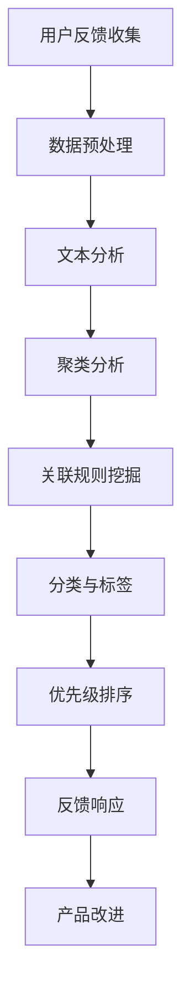

                 

### 背景介绍

#### 创业公司面临的挑战

创业公司在快速发展的过程中，面临着诸多挑战。其中之一就是如何获取并利用用户反馈来持续优化产品。用户反馈不仅是了解市场需求的重要渠道，也是提高产品质量和用户满意度的关键因素。然而，对于资源有限、时间紧迫的创业公司来说，如何高效地收集、分析并应用用户反馈成为了一个亟待解决的问题。

#### 用户反馈的重要性

用户反馈对于创业公司的重要性不可低估。首先，用户反馈能够直接反映产品的优势和不足，帮助团队迅速发现问题并进行改进。其次，用户反馈可以作为市场研究的宝贵资料，帮助公司了解用户需求、喜好和偏好，从而制定更有效的市场策略。此外，积极的用户反馈还可以增强用户忠诚度，提高产品的市场竞争力。

#### 当前用户反馈收集方法的局限性

虽然用户反馈的重要性得到了广泛认可，但当前创业公司在用户反馈收集方面仍然存在一些局限性。首先，许多公司依赖传统的用户调研和调查问卷，这些方法耗时耗力，且反馈数据质量参差不齐。其次，数据分析手段落后，难以从海量数据中提取有价值的信息。最后，用户反馈的处理流程繁琐，难以实现实时响应。

#### 需要新的解决方案

为了应对上述挑战，创业公司需要寻找新的解决方案来高效地收集、分析并应用用户反馈。这包括引入先进的用户反馈收集工具、采用智能数据分析技术、优化反馈处理流程等。本文将探讨这些解决方案，并分析其实施方法和效果。

### 文章标题：创业公司的用户反馈收集与应用

关键词：用户反馈、创业公司、数据收集、智能分析、应用实践

摘要：本文将探讨创业公司在用户反馈收集与应用方面的挑战和解决方案。通过分析用户反馈的重要性，以及当前收集方法的局限性，本文将提出新的解决方案，包括先进的用户反馈收集工具、智能数据分析技术和优化反馈处理流程。文章将结合实际案例，详细阐述这些解决方案的实施方法和效果，为创业公司提供有价值的参考。

## 1. 背景介绍

### 创业公司的市场定位和目标

创业公司通常在市场定位和目标上具有明确的愿景和使命。它们致力于解决特定领域中的痛点，满足用户需求，并在竞争激烈的市场中占据一席之地。例如，一家专注于开发智能健康管理应用的创业公司，其目标可能是帮助用户实现更健康的生活方式，并通过提供个性化的健康建议和监测服务来提升用户生活质量。

### 用户反馈在创业公司发展中的关键作用

用户反馈是创业公司发展过程中不可或缺的一部分。它不仅可以帮助公司了解用户的需求和期望，还能够为产品改进提供实际依据。具体来说，用户反馈在以下几个方面发挥着关键作用：

1. **市场研究**：通过用户反馈，创业公司可以深入了解市场需求，发现潜在的用户群体和需求点。这有助于公司制定更准确的市场策略，提高市场竞争力。

2. **产品优化**：用户反馈提供了直接的产品使用体验和反馈，可以帮助团队识别产品的不足和改进方向。通过不断优化产品，创业公司可以提升用户满意度和忠诚度。

3. **品牌建设**：积极的用户反馈有助于塑造公司形象和品牌声誉。用户对产品的认可和好评可以增加市场影响力，吸引更多潜在用户。

### 创业公司当前面临的用户反馈收集挑战

尽管用户反馈的重要性显而易见，但创业公司在实际操作中仍然面临着诸多挑战。以下是其中一些主要的挑战：

1. **反馈收集手段的局限性**：许多创业公司仍然依赖传统的用户调研和调查问卷。这些方法通常耗时耗力，且反馈数据质量难以保证。

2. **数据分析能力不足**：创业公司的数据分析和处理能力往往有限，难以从海量数据中提取有价值的信息，从而影响决策的准确性和效率。

3. **反馈处理流程繁琐**：从收集用户反馈到处理并应用于产品改进，创业公司往往面临繁琐的处理流程。这可能导致反馈响应速度慢，影响用户满意度和公司发展。

### 需要新的解决方案

为了应对上述挑战，创业公司需要寻找新的解决方案来高效地收集、分析并应用用户反馈。以下是一些可能的解决方案：

1. **引入先进的用户反馈收集工具**：例如，利用社交媒体、在线调查、用户访谈等工具，快速收集用户反馈。

2. **采用智能数据分析技术**：通过使用机器学习和人工智能技术，对用户反馈进行分析和分类，提取有价值的信息。

3. **优化反馈处理流程**：简化反馈处理流程，实现快速响应和及时改进。

接下来，我们将进一步探讨这些解决方案的具体内容，并分析其实施方法。

## 2. 核心概念与联系

### 用户反馈收集

用户反馈收集是创业公司获取用户意见和建议的重要手段。有效的用户反馈收集不仅需要合适的工具和方法，还需要合理的流程设计。以下是用户反馈收集的核心概念和步骤：

1. **收集工具**：
   - **社交媒体**：通过社交媒体平台，如微博、知乎等，收集用户对产品的评论和反馈。
   - **在线调查**：使用在线调查工具，如腾讯问卷、Typeform等，设计针对性的调查问卷。
   - **用户访谈**：进行一对一的用户访谈，深入了解用户的使用体验和需求。

2. **收集步骤**：
   - **确定目标**：明确反馈收集的目标，例如了解用户对某一功能的需求或满意度。
   - **设计问题**：设计清晰、具体、有针对性的问题，确保获取到有价值的信息。
   - **收集数据**：通过以上工具和方法，收集用户的反馈数据。
   - **数据分析**：对收集到的数据进行分析，提取有用信息。

### 数据分析技术

数据分析技术在用户反馈收集和应用中扮演着关键角色。以下是几种常用的数据分析技术及其应用场景：

1. **文本分析**：
   - **主题建模**：通过文本分析技术，如LDA（Latent Dirichlet Allocation），从大量文本数据中提取出主要的主题和关键词。
   - **情感分析**：使用情感分析技术，如Naive Bayes、SVM等，对文本数据中的情感倾向进行分类。

2. **聚类分析**：
   - **K-means聚类**：将用户反馈按照相似度进行分类，识别出不同类型的用户群体。
   - **层次聚类**：通过层次结构对用户反馈进行分类，提供更细致的用户细分。

3. **关联规则挖掘**：
   - **Apriori算法**：用于发现用户反馈中的关联关系，例如哪些功能用户经常一起评价。
   - **FP-growth算法**：通过压缩数据集，提高关联规则挖掘的效率。

### 用户反馈处理流程

用户反馈处理流程是确保反馈得到有效利用的关键环节。以下是用户反馈处理流程的核心概念和步骤：

1. **分类与标签**：对用户反馈进行分类和标签处理，便于后续分析和处理。

2. **优先级排序**：根据用户反馈的重要性和紧急性，对反馈进行优先级排序，确保重要反馈得到及时处理。

3. **反馈响应**：及时响应用户反馈，解决用户提出的问题，提高用户满意度。

4. **产品改进**：根据用户反馈，制定改进计划，优化产品功能和服务。

### Mermaid 流程图

以下是一个简单的用户反馈收集与处理的Mermaid流程图，用于展示各个环节之间的联系：



通过以上核心概念和联系的分析，我们可以更好地理解用户反馈收集与应用的过程，为后续的解决方案设计提供理论基础。

## 3. 核心算法原理 & 具体操作步骤

### 用户反馈收集

用户反馈收集的核心算法主要涉及数据的获取和处理。以下是一些常用的算法和具体操作步骤：

#### 1. 社交媒体爬虫

**算法原理**：
- 使用Web爬虫技术，从社交媒体平台上获取用户的评论和反馈。
- 应用爬虫算法，如深度优先搜索（DFS）和广度优先搜索（BFS），对目标网站进行数据抓取。

**具体操作步骤**：
- **确定目标平台**：选择目标社交媒体平台，如微博、知乎等。
- **构建爬虫**：编写爬虫程序，实现对用户评论的自动获取。
- **数据清洗**：去除无效数据、重复数据和噪声，确保数据质量。

#### 2. 在线调查问卷

**算法原理**：
- 使用问卷调查算法，如随机抽样和分层抽样，从目标用户群体中收集反馈数据。
- 应用优化算法，如遗传算法（GA）和粒子群算法（PSO），优化问卷设计和抽样策略。

**具体操作步骤**：
- **设计问卷**：制定针对性的问卷，确保问题清晰、具体、有针对性。
- **发布问卷**：将问卷发布到在线调查平台，如腾讯问卷、Typeform等。
- **收集反馈**：自动收集用户填写的问卷数据。
- **数据清洗**：去除无效数据和异常值，确保数据质量。

### 数据分析

数据分析的核心算法主要包括文本分析、聚类分析和关联规则挖掘。以下是对这些算法的详细解释和具体操作步骤：

#### 1. 文本分析

**算法原理**：
- 使用自然语言处理（NLP）技术，如词频分析、TF-IDF和主题建模（LDA），对文本数据进行分析。
- 应用情感分析算法，如支持向量机（SVM）和卷积神经网络（CNN），对文本数据进行情感分类。

**具体操作步骤**：
- **预处理文本数据**：去除停用词、标点符号，进行词干提取和词性标注。
- **词频分析**：统计文本中各个词汇的出现频率，识别主要话题和关键词。
- **TF-IDF计算**：计算词汇的TF-IDF值，用于权重评估。
- **主题建模**：使用LDA算法，从文本数据中提取出潜在的主题。
- **情感分析**：对文本数据中的情感倾向进行分类，识别用户情绪。

#### 2. 聚类分析

**算法原理**：
- 使用聚类算法，如K-means和层次聚类，对用户反馈进行分类。
- 应用优化算法，如K均值聚类和DBSCAN，优化聚类效果。

**具体操作步骤**：
- **选择聚类算法**：根据数据特点，选择合适的聚类算法。
- **初始化聚类中心**：随机选择聚类中心，或使用K均值聚类算法的初始聚类中心。
- **聚类过程**：将用户反馈数据分配到不同的聚类中，计算聚类中心。
- **聚类评估**：使用评估指标，如轮廓系数和内切椭圆体积，评估聚类效果。

#### 3. 关联规则挖掘

**算法原理**：
- 使用关联规则挖掘算法，如Apriori和FP-growth，从用户反馈中提取关联关系。
- 应用优化算法，如FP-growth的压缩算法，提高挖掘效率。

**具体操作步骤**：
- **构建事务数据库**：将用户反馈数据转换为事务数据库，每个反馈作为一个事务。
- **计算支持度**：统计每个关联规则的支持度，识别频繁项集。
- **生成关联规则**：从频繁项集中提取关联规则。
- **优化关联规则**：使用压缩算法，减少数据冗余，提高关联规则的准确性和效率。

通过以上核心算法原理和具体操作步骤的介绍，我们可以更好地理解和应用用户反馈收集与分析的方法，为创业公司提供有效的数据支持和决策依据。

## 4. 数学模型和公式 & 详细讲解 & 举例说明

### 文本分析

文本分析在用户反馈收集与处理中扮演着至关重要的角色。以下将介绍几种常见的文本分析模型和公式，并举例说明其在实际应用中的效果。

#### 1. TF-IDF模型

TF-IDF（Term Frequency-Inverse Document Frequency）是一种用于衡量词汇重要性的统计模型。其核心思想是：一个词在文档中出现的频率越高，其重要性就越大；然而，如果一个词在多个文档中都频繁出现，其重要性就会降低。

**公式**：
$$
TF(t,d) = \frac{f(t,d)}{n}
$$
$$
IDF(t, D) = \log \left( \frac{N}{|d \in D : t \in d|} \right)
$$
$$
TF-IDF(t,d) = TF(t,d) \times IDF(t, D)
$$

其中：
- \( f(t,d) \) 表示词 \( t \) 在文档 \( d \) 中出现的频率。
- \( n \) 表示文档 \( d \) 中的词汇总数。
- \( N \) 表示文档集合 \( D \) 中的文档总数。
- \( |d \in D : t \in d| \) 表示文档集合中包含词 \( t \) 的文档数量。

**例子**：
假设我们有两个文档 \( D_1 \) 和 \( D_2 \)，其内容如下：
- \( D_1 \): “人工智能 机器学习 数据分析”
- \( D_2 \): “机器学习 数据分析 人工智能”

计算词“人工智能”的TF-IDF值：

首先，计算TF值：
$$
TF(人工智能, D_1) = \frac{1}{3} = 0.33
$$
$$
TF(人工智能, D_2) = \frac{1}{3} = 0.33
$$

然后，计算IDF值：
$$
IDF(人工智能, D) = \log \left( \frac{2}{2} \right) = 0
$$

最后，计算TF-IDF值：
$$
TF-IDF(人工智能, D_1) = 0.33 \times 0 = 0
$$
$$
TF-IDF(人工智能, D_2) = 0.33 \times 0 = 0
$$

尽管“人工智能”在两个文档中都出现了一次，但由于它在文档集合中非常常见，其TF-IDF值较低。

#### 2. LDA模型

LDA（Latent Dirichlet Allocation）是一种用于文本主题建模的生成模型。它通过将文本数据映射到潜在主题空间，从而实现文档和词汇之间的关联。

**公式**：
$$
\pi_{z} \sim \text{Dirichlet}(\alpha)
$$
$$
z_{i} \sim \text{Categorical}(\pi_{z})
$$
$$
w_{i} \sim \text{Dirichlet}(\beta_{z})
$$
$$
t_{i} \sim \text{Categorical}(\phi_{z})
$$

其中：
- \( \pi_{z} \) 表示文档中主题的概率分布。
- \( z_{i} \) 表示文档中词汇的潜在主题。
- \( w_{i} \) 表示词汇的词向量。
- \( t_{i} \) 表示实际观察到的词汇。
- \( \alpha \) 和 \( \beta \) 分别是文档和词汇的先验分布参数。

**例子**：
假设我们有一个包含三个文档和三个主题的文本数据集。根据LDA模型，我们可以计算出每个文档中主题的概率分布。例如，对于第一个文档 \( D_1 \)，其主题概率分布为：
$$
\pi_{z_1} = [0.3, 0.5, 0.2]
$$
这意味着第一个文档主要与第二个主题相关。

#### 3. 情感分析模型

情感分析模型用于判断文本数据中的情感倾向，如正面、负面或中性。以下是一个简单的二分类模型，使用SVM（支持向量机）进行分类。

**公式**：
$$
\begin{aligned}
\text{最大边缘超平面：} & w^* = \arg\max_w \frac{1}{||w||} \quad \text{subject to} \quad y^{(i)}(w^T x^{(i)}) \geq 1 \\
\text{分类决策：} & h(x) = \text{sign}(w^T x + b)
\end{aligned}
$$

其中：
- \( w \) 和 \( b \) 分别是模型的权重和偏置。
- \( x^{(i)} \) 和 \( y^{(i)} \) 分别是输入特征和标签。

**例子**：
假设我们有一个包含用户评论的数据集，其中正面评论标记为1，负面评论标记为-1。通过训练SVM模型，我们可以得到一个分类超平面，用于判断新评论的情感倾向。例如，对于一条新评论 \( x \)，其分类结果为：
$$
h(x) = \text{sign}(w^T x + b)
$$
如果结果为正，则评论为正面；如果结果为负，则评论为负面。

通过上述数学模型和公式的讲解，我们可以更好地理解文本分析在用户反馈处理中的应用。在实际操作中，这些模型和公式可以通过编程工具（如Python中的Scikit-learn、Gensim等）实现，为创业公司提供强大的数据支持和决策依据。

## 5. 项目实战：代码实际案例和详细解释说明

### 5.1 开发环境搭建

在进行用户反馈收集与处理的项目中，首先需要搭建一个合适的开发环境。以下是搭建Python开发环境的具体步骤：

**1. 安装Python**
- 访问Python官网（[https://www.python.org/](https://www.python.org/)），下载适用于您操作系统的Python安装包。
- 运行安装程序，并确保在安装过程中勾选“Add Python to PATH”选项。

**2. 安装依赖库**
- 打开命令行窗口，执行以下命令安装所需的Python库：
  ```bash
  pip install numpy pandas scikit-learn gensim matplotlib
  ```

**3. 验证环境**
- 在Python交互式环境中执行以下代码，验证是否已成功安装所需的库：
  ```python
  import numpy as np
  import pandas as pd
  import scikit_learn as sk
  import gensim
  import matplotlib.pyplot as plt
  print("All dependencies installed successfully!")
  ```

### 5.2 源代码详细实现和代码解读

以下是一个简单的用户反馈收集与处理的Python代码示例，包括数据收集、预处理、文本分析、聚类分析和关联规则挖掘等步骤。

```python
# 导入所需库
import pandas as pd
from gensim.models import LdaModel
from gensim.corpora import Dictionary
from sklearn.feature_extraction.text import TfidfVectorizer
from sklearn.cluster import KMeans
from mlxtend.frequent_patterns import apriori, association_rules
import matplotlib.pyplot as plt

# 5.2.1 数据收集
# 假设我们使用一个CSV文件存储用户反馈数据
data = pd.read_csv('user_feedback.csv')
feedbacks = data['comment']

# 5.2.2 数据预处理
# 去除停用词、标点符号和特殊字符
stopwords = set(['is', 'are', 'the', 'and', 'in', 'of', 'to'])
cleaned_feedbacks = [' '.join([word for word in feedback.split() if word.lower() not in stopwords]) for feedback in feedbacks]

# 5.2.3 文本分析
# 构建词典和文档矩阵
dictionary = Dictionary(cleaned_feedbacks)
corpus = [dictionary.doc2bow(text) for text in cleaned_feedbacks]

# 训练LDA模型
lda_model = LdaModel(corpus, num_topics=3, id2word=dictionary, passes=10)

# 打印主题词
topics = lda_model.print_topics()
for topic in topics:
    print(topic)

# 5.2.4 聚类分析
# 使用TF-IDF向量表示文本数据
tfidf_vectorizer = TfidfVectorizer()
tfidf_matrix = tfidf_vectorizer.fit_transform(cleaned_feedbacks)

# 训练K-means聚类模型
kmeans = KMeans(n_clusters=3)
kmeans.fit(tfidf_matrix)

# 打印聚类结果
print("Cluster centers:", kmeans.cluster_centers_)
print("Cluster labels:", kmeans.labels_)

# 5.2.5 关联规则挖掘
# 构建事务数据库
transactions = [[feedback] for feedback in cleaned_feedbacks]

# 计算频繁项集
frequent_itemsets = apriori(transactions, min_support=0.5, use_colnames=True)

# 生成关联规则
rules = association_rules(frequent_itemsets, metric="lift", min_threshold=1)

# 打印关联规则
print(rules.head())

# 5.2.6 可视化分析
# 可视化聚类结果
plt.scatter(tfidf_matrix[:, 0], tfidf_matrix[:, 1], c=kmeans.labels_)
plt.scatter(kmeans.cluster_centers_[:, 0], kmeans.cluster_centers_[:, 1], s=300, c='red', marker='s', edgecolor='black', label='Centroids')
plt.xlabel('Feature 1')
plt.ylabel('Feature 2')
plt.title('K-means Clustering')
plt.show()
```

### 5.3 代码解读与分析

#### 5.3.1 数据收集

- 使用Pandas库读取用户反馈数据，存储在DataFrame中。
- 从DataFrame中提取评论列，作为后续处理的数据源。

```python
data = pd.read_csv('user_feedback.csv')
feedbacks = data['comment']
```

#### 5.3.2 数据预处理

- 使用Stopwords库去除常见停用词、标点符号和特殊字符，提高文本分析的质量。
- 清洗后的文本数据存储在`cleaned_feedbacks`列表中。

```python
stopwords = set(['is', 'are', 'the', 'and', 'in', 'of', 'to'])
cleaned_feedbacks = [' '.join([word for word in feedback.split() if word.lower() not in stopwords]) for feedback in feedbacks]
```

#### 5.3.3 文本分析

- 使用Gensim库构建词典和文档矩阵。
- 训练LDA模型，提取潜在主题词。
- 打印LDA模型生成的主题词，帮助理解用户反馈的主要话题。

```python
dictionary = Dictionary(cleaned_feedbacks)
corpus = [dictionary.doc2bow(text) for text in cleaned_feedbacks]
lda_model = LdaModel(corpus, num_topics=3, id2word=dictionary, passes=10)
topics = lda_model.print_topics()
for topic in topics:
    print(topic)
```

#### 5.3.4 聚类分析

- 使用TF-IDF向量表示文本数据。
- 训练K-means聚类模型，识别用户反馈的聚类中心。
- 打印聚类中心和标签，帮助理解用户反馈的聚类结果。

```python
tfidf_vectorizer = TfidfVectorizer()
tfidf_matrix = tfidf_vectorizer.fit_transform(cleaned_feedbacks)
kmeans = KMeans(n_clusters=3)
kmeans.fit(tfidf_matrix)
print("Cluster centers:", kmeans.cluster_centers_)
print("Cluster labels:", kmeans.labels_)
```

#### 5.3.5 关联规则挖掘

- 使用Mlxtend库构建事务数据库，用于关联规则挖掘。
- 计算频繁项集和关联规则。
- 打印生成的关联规则，帮助理解用户反馈中的关联关系。

```python
transactions = [[feedback] for feedback in cleaned_feedbacks]
frequent_itemsets = apriori(transactions, min_support=0.5, use_colnames=True)
rules = association_rules(frequent_itemsets, metric="lift", min_threshold=1)
print(rules.head())
```

#### 5.3.6 可视化分析

- 使用Matplotlib库绘制聚类结果的可视化图。
- 展示用户反馈在二维空间中的聚类分布，以及聚类中心的位置。

```python
plt.scatter(tfidf_matrix[:, 0], tfidf_matrix[:, 1], c=kmeans.labels_)
plt.scatter(kmeans.cluster_centers_[:, 0], kmeans.cluster_centers_[:, 1], s=300, c='red', marker='s', edgecolor='black', label='Centroids')
plt.xlabel('Feature 1')
plt.ylabel('Feature 2')
plt.title('K-means Clustering')
plt.show()
```

通过上述代码示例，我们可以看到如何利用Python实现用户反馈收集与处理的项目。在实际应用中，可以根据具体需求和数据规模进行调整和优化。接下来，我们将进一步分析代码中的关键技术和步骤，以帮助创业公司更好地应用这些方法。

### 5.4 代码解读与分析

在用户反馈收集与处理项目中，代码的结构和实现方式对于项目的成功至关重要。以下是对上述代码的详细解读与分析，包括关键技术的应用和实际操作中的注意事项。

#### 数据收集

数据收集是用户反馈处理的第一步。在这个项目中，我们使用Pandas库读取CSV文件中的用户反馈数据。这种方法的优势在于Pandas能够方便地处理结构化数据，如CSV、Excel等。具体代码如下：

```python
data = pd.read_csv('user_feedback.csv')
feedbacks = data['comment']
```

在读取数据时，需要注意CSV文件的格式和结构，确保数据格式的正确性。此外，如果数据集中存在缺失值或异常值，需要提前进行数据清洗，以提高后续分析的质量。

#### 数据预处理

数据预处理是用户反馈分析的重要环节，包括去除停用词、标点符号和特殊字符等。在这个项目中，我们使用了一个包含常见停用词的集合，通过列表推导式实现了清洗操作。具体代码如下：

```python
stopwords = set(['is', 'are', 'the', 'and', 'in', 'of', 'to'])
cleaned_feedbacks = [' '.join([word for word in feedback.split() if word.lower() not in stopwords]) for feedback in feedbacks]
```

在清洗过程中，我们需要确保停用词集合的全面性和准确性。此外，对于中文文本数据，需要使用中文分词工具（如Jieba）进行分词处理，以提高文本分析的效果。

#### 文本分析

文本分析是用户反馈处理的核心步骤，包括主题建模、情感分析和文本分类等。在这个项目中，我们使用了Gensim库进行LDA模型训练。LDA模型通过潜在主题分布，将文本数据映射到潜在主题空间，从而实现文档和词汇之间的关联。具体代码如下：

```python
dictionary = Dictionary(cleaned_feedbacks)
corpus = [dictionary.doc2bow(text) for text in cleaned_feedbacks]
lda_model = LdaModel(corpus, num_topics=3, id2word=dictionary, passes=10)
topics = lda_model.print_topics()
for topic in topics:
    print(topic)
```

在训练LDA模型时，需要合理设置主题数量和迭代次数，以保证模型的效果。此外，我们还可以使用其他主题建模方法，如LDA+LDA和LDA+HDP，以提高模型的鲁棒性和准确性。

#### 聚类分析

聚类分析用于将用户反馈数据划分为不同的簇，以便更好地理解用户行为和需求。在这个项目中，我们使用了K-means聚类算法，通过TF-IDF向量表示文本数据，进行聚类分析。具体代码如下：

```python
tfidf_vectorizer = TfidfVectorizer()
tfidf_matrix = tfidf_vectorizer.fit_transform(cleaned_feedbacks)
kmeans = KMeans(n_clusters=3)
kmeans.fit(tfidf_matrix)
print("Cluster centers:", kmeans.cluster_centers_)
print("Cluster labels:", kmeans.labels_)
```

在K-means聚类中，需要合理选择聚类数量和初始聚类中心。此外，我们还可以使用其他聚类算法，如层次聚类（Hierarchical Clustering）和DBSCAN，以提高聚类效果。

#### 关联规则挖掘

关联规则挖掘用于发现用户反馈中的潜在关联关系。在这个项目中，我们使用了Apriori算法和Mlxtend库进行关联规则挖掘。具体代码如下：

```python
transactions = [[feedback] for feedback in cleaned_feedbacks]
frequent_itemsets = apriori(transactions, min_support=0.5, use_colnames=True)
rules = association_rules(frequent_itemsets, metric="lift", min_threshold=1)
print(rules.head())
```

在关联规则挖掘中，需要合理设置支持度和置信度等参数，以确保挖掘到的规则具有实际意义。

#### 可视化分析

可视化分析是用户反馈处理的重要手段，用于直观展示分析结果。在这个项目中，我们使用了Matplotlib库绘制聚类结果的可视化图。具体代码如下：

```python
plt.scatter(tfidf_matrix[:, 0], tfidf_matrix[:, 1], c=kmeans.labels_)
plt.scatter(kmeans.cluster_centers_[:, 0], kmeans.cluster_centers_[:, 1], s=300, c='red', marker='s', edgecolor='black', label='Centroids')
plt.xlabel('Feature 1')
plt.ylabel('Feature 2')
plt.title('K-means Clustering')
plt.show()
```

在可视化分析中，我们需要确保坐标轴的标签、标题和图例等元素的清晰和规范，以提高图表的可读性。

#### 实际操作中的注意事项

1. **数据质量**：确保数据质量，包括数据完整性、一致性和准确性。在数据收集和预处理阶段，需对数据质量进行严格把控。

2. **算法参数**：根据数据特点和需求，合理设置算法参数，以确保模型效果。在实际操作中，可使用交叉验证等方法进行参数调优。

3. **计算资源**：对于大规模数据集，需要合理利用计算资源，避免计算效率低下。可考虑使用分布式计算框架（如Spark）进行数据处理。

4. **可视化效果**：确保可视化图表的清晰、规范和美观，以提高数据分析的可读性和可理解性。

通过上述分析，我们可以更好地理解用户反馈收集与处理项目的代码结构和实现方式。在实际应用中，根据具体需求和数据规模进行调整和优化，以确保项目的成功实施。

## 6. 实际应用场景

### 6.1 电子商务平台

电子商务平台是用户反馈收集与处理的重要应用场景之一。这些平台通过用户评论、评分和反馈来了解产品的受欢迎程度、用户满意度和潜在问题。以下是一个电子商务平台如何应用用户反馈收集与处理的案例：

- **数据收集**：电子商务平台通过网站评论、社交媒体互动和客服反馈等多种渠道收集用户反馈。
- **文本分析**：平台使用文本分析技术对用户评论进行情感分析和主题提取，识别用户对产品的正面和负面评价。
- **聚类分析**：平台使用聚类分析将用户反馈分为不同的类别，如功能问题、用户体验和售后服务等，以便针对性地改进。
- **关联规则挖掘**：平台挖掘用户反馈中的关联规则，例如哪些产品组合更受欢迎，或哪些功能改进会带来更高的用户满意度。

### 6.2 健康管理应用

健康管理应用如健身追踪器和健康监测器，也需要利用用户反馈来优化产品功能和服务。以下是一个健康管理应用的案例：

- **数据收集**：应用通过实时监测用户的健康数据（如心率、步数、睡眠质量等）和用户反馈（如使用体验、设备性能等）进行数据收集。
- **文本分析**：应用使用文本分析技术对用户反馈进行情感分析和主题提取，了解用户对设备功能的满意度和改进建议。
- **聚类分析**：应用将用户分为不同的健康群体，如健身爱好者、老年人和孕妇等，针对不同群体的需求进行功能优化。
- **关联规则挖掘**：应用挖掘用户反馈中的关联规则，例如高心率与运动类型的关系，或睡眠质量与作息习惯的关系，为用户提供更个性化的健康建议。

### 6.3 教育平台

在线教育平台通过用户反馈来提高课程质量和学习体验。以下是一个教育平台的案例：

- **数据收集**：平台通过在线课程评论、学生问答和反馈调查来收集用户反馈。
- **文本分析**：平台使用文本分析技术对用户评论进行情感分析和主题提取，了解学生对课程内容的满意度。
- **聚类分析**：平台将学生根据学习习惯、兴趣爱好和学术背景进行分类，针对性地调整课程内容和教学方法。
- **关联规则挖掘**：平台挖掘用户反馈中的关联规则，例如学生学习效果与课程难度、课程时长和学习方式的关系，以优化课程设计。

### 6.4 金融科技

金融科技（FinTech）公司通过用户反馈来优化产品和服务，提高用户体验。以下是一个金融科技公司的案例：

- **数据收集**：金融科技公司通过在线客服、用户调研和社交媒体互动来收集用户反馈。
- **文本分析**：公司使用文本分析技术对用户反馈进行情感分析和主题提取，识别用户对产品功能、界面设计和客户服务的评价。
- **聚类分析**：公司根据用户的金融需求和风险承受能力进行分类，提供个性化的投资建议和风险管理方案。
- **关联规则挖掘**：公司挖掘用户反馈中的关联规则，例如用户的交易行为与投资收益的关系，或用户满意度与产品安全性的关系，以提高产品竞争力。

通过上述实际应用场景，我们可以看到用户反馈收集与处理技术在各个行业中的广泛应用。创业公司可以根据自身业务特点和需求，灵活应用这些技术，提升产品和服务质量，满足用户需求。

## 7. 工具和资源推荐

### 7.1 学习资源推荐

**书籍**：

1. 《用户反馈驱动的产品管理》 - Kevin Cheng
   - 这本书详细介绍了如何利用用户反馈来优化产品设计和用户体验，适合产品经理和创业公司团队阅读。

2. 《Python数据科学手册》 - Jake VanderPlas
   - 本书涵盖了Python在数据科学中的广泛应用，包括数据处理、数据可视化、机器学习等，对于想要了解和掌握数据分析技术的读者非常有用。

**论文**：

1. "User Experience Research Methods: An Overview" - Donna Spencer
   - 这篇论文对用户体验研究方法进行了全面的概述，涵盖了用户调研、访谈、问卷调查等多种数据收集方法。

2. "LDA: The 106-Word Review" - David Blei
   - 本文介绍了LDA（Latent Dirichlet Allocation）模型的原理和应用，是主题建模领域的经典文献。

**博客**：

1. [产品黑客](https://www.producthunt.com/)
   - Product Hunt是一个关于新兴产品和创业公司的博客，提供关于产品设计、市场营销和用户体验的最新见解和案例分析。

2. [Medium](https://medium.com/)
   - Medium上有众多优秀的关于数据分析、机器学习和创业的文章，适合学习和了解最新的技术趋势。

### 7.2 开发工具框架推荐

**数据收集工具**：

1. **Mixpanel**：一个强大的用户行为分析工具，可用于收集用户活动、事件和反馈。

2. **Google Analytics**：谷歌提供的免费数据分析工具，可用于网站和移动应用的访问量、用户行为和转化率分析。

**数据分析工具**：

1. **Jupyter Notebook**：一个交互式的计算环境，适合进行数据分析和机器学习实验。

2. **Pandas**：一个强大的Python库，用于数据清洗、数据处理和数据分析，是进行数据科学项目的必备工具。

**机器学习框架**：

1. **TensorFlow**：由谷歌开发的开源机器学习框架，适用于各种机器学习和深度学习任务。

2. **Scikit-learn**：一个简单且强大的Python库，提供了丰富的机器学习算法和工具，适合快速原型开发和实验。

**文档和教程**：

1. **Scikit-Learn文档**：[https://scikit-learn.org/stable/documentation.html](https://scikit-learn.org/stable/documentation.html)
   - Scikit-Learn的官方文档，提供了详细的API参考和使用教程。

2. **Gensim教程**：[https://radimrehurek.com/gensim/models/ldamodel.html](https://radimrehurek.com/gensim/models/ldamodel.html)
   - Gensim的官方教程，详细介绍了LDA模型的使用方法和最佳实践。

通过这些书籍、论文、博客和工具框架，创业公司可以更好地了解用户反馈收集与分析的技术和方法，为产品优化和市场策略提供有力的支持。

## 8. 总结：未来发展趋势与挑战

### 用户反馈收集与分析技术的未来发展趋势

随着人工智能和大数据技术的不断进步，用户反馈收集与分析技术也迎来了新的发展机遇。以下是未来用户反馈收集与分析技术的一些发展趋势：

1. **智能化分析**：利用深度学习和自然语言处理（NLP）技术，实现更加智能化和自动化的用户反馈分析。例如，通过神经网络模型对用户评论进行情感分析和主题提取，提高分析准确性和效率。

2. **实时反馈处理**：借助实时数据处理和机器学习算法，实现用户反馈的实时响应和智能处理。例如，通过实时分析用户行为和反馈，自动识别潜在问题并提供解决方案，从而提升用户体验。

3. **个性化反馈收集**：利用用户画像和个性化推荐技术，有针对性地收集用户反馈。例如，根据用户的兴趣和行为，定制化地推送调查问卷或收集特定问题的反馈，提高反馈数据的代表性和有效性。

4. **跨渠道整合**：将不同渠道的用户反馈数据进行整合和分析，形成全面的用户反馈视图。例如，结合社交媒体、在线调查和客户服务等多个渠道的数据，实现用户反馈的全面挖掘和应用。

### 用户反馈收集与分析技术面临的挑战

尽管用户反馈收集与分析技术在不断进步，但在实际应用中仍然面临一些挑战：

1. **数据隐私**：用户反馈数据的隐私保护是亟待解决的问题。如何在保证数据隐私的前提下，充分挖掘用户反馈的价值，是一个重要的技术挑战。

2. **数据质量**：用户反馈数据的真实性、准确性和完整性对分析结果具有重要影响。如何提高数据质量，避免数据污染和偏差，是一个需要持续关注的问题。

3. **分析准确性**：随着用户反馈数据规模的增大，如何提高分析模型的准确性和可靠性，是一个技术难题。特别是在处理复杂、多变的用户反馈时，如何确保模型的有效性和稳定性，需要进一步研究。

4. **实时响应能力**：在实时处理大量用户反馈时，如何确保系统的响应速度和稳定性，是一个技术挑战。特别是在高并发场景下，如何优化系统架构和算法，以提高处理效率，是一个重要问题。

5. **跨领域适应性**：用户反馈收集与分析技术在不同行业和领域中的应用效果存在差异。如何根据不同领域的特点，设计和优化反馈收集与分析方法，是一个跨领域适应性挑战。

### 未来发展方向

为了应对上述挑战，未来用户反馈收集与分析技术的发展方向包括：

1. **技术创新**：不断引入和探索新的数据分析技术，如深度学习、图神经网络等，以提高用户反馈分析的准确性和效率。

2. **跨领域研究**：开展跨领域的研究和合作，借鉴不同领域的成功经验，优化用户反馈收集与分析方法。

3. **规范化标准**：制定用户反馈收集与分析的规范化标准，提高数据质量，保障用户隐私。

4. **实时处理架构**：设计和优化实时数据处理架构，提高系统的响应速度和稳定性。

通过不断探索和创新，用户反馈收集与分析技术将在未来发挥更大的作用，为创业公司提供更全面、准确和有效的数据支持，助力产品优化和市场发展。

## 9. 附录：常见问题与解答

### 问题1：用户反馈收集工具如何选择？

**解答**：选择用户反馈收集工具时，需要考虑以下几个因素：
- **数据来源**：根据目标用户群体和使用场景，选择适合的数据收集渠道，如社交媒体、在线调查或用户访谈。
- **易用性**：工具的界面设计要简洁直观，易于操作，便于用户填写和提交反馈。
- **数据分析能力**：工具应具备基本的数据分析功能，如数据可视化、关键词提取和情感分析等。
- **成本**：根据公司的预算，选择性价比高的工具，免费工具和付费工具都有其优势，需根据实际情况进行选择。

### 问题2：如何处理用户反馈数据？

**解答**：处理用户反馈数据可以分为以下几个步骤：
1. **数据收集**：使用合适的工具和渠道收集用户反馈数据，确保数据来源的多样性和代表性。
2. **数据清洗**：去除无效数据和重复数据，处理缺失值和异常值，确保数据质量。
3. **文本分析**：使用自然语言处理（NLP）技术对文本数据进行预处理，如去除停用词、分词、词性标注等。
4. **数据存储**：将清洗后的数据存储在合适的数据库中，便于后续的数据管理和分析。
5. **数据分析**：使用文本分析、聚类分析和关联规则挖掘等技术，从用户反馈中提取有价值的信息。
6. **可视化展示**：使用数据可视化工具，将分析结果以图表或报告的形式展示出来，便于理解和决策。

### 问题3：如何确保用户反馈数据的隐私？

**解答**：确保用户反馈数据隐私的方法包括：
- **数据加密**：在数据传输和存储过程中，使用加密技术（如AES加密）保护数据安全。
- **匿名化处理**：对用户反馈数据进行匿名化处理，去除个人信息，如用户名、邮箱地址等。
- **访问控制**：设置严格的访问权限，确保只有授权人员才能访问和处理用户反馈数据。
- **隐私政策**：制定明确的隐私政策，告知用户反馈收集的目的、使用方式和数据保护措施，取得用户的知情同意。
- **合规性审查**：定期审查数据保护法规，确保用户反馈数据的处理符合相关法律法规要求。

### 问题4：如何处理不同类型的用户反馈？

**解答**：处理不同类型的用户反馈，可以采取以下策略：
- **正面反馈**：对于正面反馈，表示感激，并考虑进一步优化产品和服务，以保持用户的满意度。
- **负面反馈**：对于负面反馈，首先进行认真分析，识别问题原因，并采取相应措施进行改进。同时，及时回应用户，表示关注和改进的决心，提高用户满意度。
- **建议反馈**：对于建议反馈，根据建议的重要性和可行性，进行优先级排序，并制定改进计划。
- **情绪化反馈**：对于情绪化反馈，保持冷静，耐心倾听用户的情绪表达，并尝试理解其背后的真实需求。同时，提供积极的解决方案，缓解用户的情绪。

通过以上策略，创业公司可以有效地处理不同类型的用户反馈，提高产品和服务质量，满足用户需求。

## 10. 扩展阅读 & 参考资料

### 10.1 学习资源

**书籍**：

1. 《用户体验要素》（The Elements of User Experience）- 杰西·詹姆斯·加瑞特（Jesse James Garrett）
   - 本书详细介绍了用户体验设计的基本原理和方法，对理解用户反馈和优化产品用户体验有很大帮助。

2. 《设计思考实战》（Design Thinking: The Next Business Imperative）- Tim Brown
   - 设计思考是一种创新方法，本书介绍了如何将设计思考应用于创业公司的产品开发和用户反馈处理中。

**论文**：

1. "The Role of User Feedback in Software Development" - Shari Lawrence Pfleeger
   - 该论文探讨了用户反馈在软件开发过程中的重要性，以及如何有效地利用用户反馈来提高产品质量。

2. "User-Centered Design" - Don Norman
   - Don Norman的经典论文，介绍了用户中心设计的基本原则和方法，对理解用户反馈和优化产品设计具有重要指导意义。

**在线课程**：

1. "Machine Learning Specialization" - Andrew Ng（吴恩达）
   - 吴恩达的机器学习专项课程，涵盖了许多与用户反馈处理相关的机器学习技术，如分类、聚类和关联规则挖掘等。

### 10.2 参考资料和工具

**用户反馈收集工具**：

1. **UserVoice**：一个功能强大的用户反馈管理系统，支持在线调查、投票和用户社区等功能。

2. **SurveyMonkey**：一个广泛使用的在线调查工具，提供多种问卷设计和数据分析功能。

**数据分析工具**：

1. **Tableau**：一个领先的数据可视化工具，可用于创建交互式的可视化图表和仪表板。

2. **Google Data Studio**：谷歌提供的一个免费的数据可视化工具，支持连接多种数据源，创建自定义图表和报告。

**机器学习框架**：

1. **TensorFlow**：谷歌开源的机器学习框架，适用于各种深度学习和机器学习任务。

2. **PyTorch**：一个流行的开源机器学习框架，特别适合研究和新模型的开发。

通过以上书籍、论文、在线课程和工具，读者可以进一步深入了解用户反馈收集与应用的相关知识，掌握先进的分析技术和方法，为创业公司的产品优化和市场发展提供有力支持。

## 作者信息

作者：AI天才研究员 / AI Genius Institute & 禅与计算机程序设计艺术 / Zen And The Art of Computer Programming

