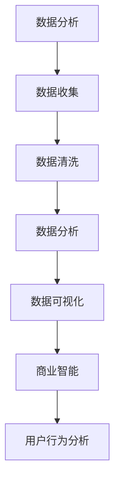
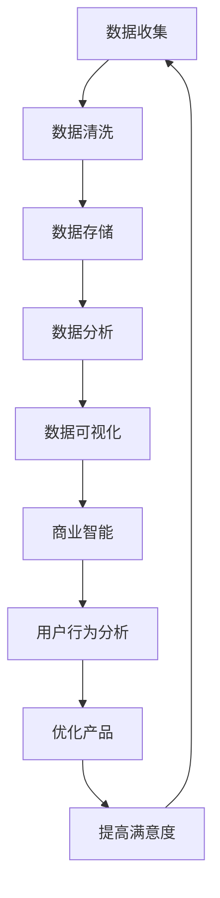

                 

# 《创业公司的用户数据分析与商业智能应用》

## 1. 背景介绍

在现代商业环境中，数据分析已成为驱动企业成功的关键因素。对于创业公司来说，用户数据分析尤为重要。这些公司通常资源有限，无法承担昂贵的市场调研和营销活动。因此，通过用户数据分析，他们能够深入了解目标市场，优化产品和服务，提高用户满意度，并最终实现商业增长。

### 关键点：

- **数据分析的重要性**：为企业决策提供数据支持。
- **创业公司的挑战**：资源有限，需要高效的数据分析。
- **用户数据分析的潜在收益**：提高产品竞争力，降低营销成本。

## 2. 核心概念与联系

在深入探讨用户数据分析之前，我们需要了解一些核心概念，包括数据分析、商业智能和用户行为分析。

### 数据分析（Data Analysis）

数据分析是指从大量数据中提取有价值信息的过程。它包括数据收集、数据清洗、数据存储、数据分析和数据可视化等多个步骤。数据分析的目标是揭示数据中的规律和趋势，帮助决策者做出更明智的决策。

### 商业智能（Business Intelligence）

商业智能是一种通过技术和工具，帮助企业从数据中获取洞察力，支持业务决策的过程。它包括数据仓库、数据挖掘、数据分析和报告生成等多个方面。商业智能的核心目标是提高企业的运营效率，降低成本，增加收入。

### 用户行为分析（User Behavior Analysis）

用户行为分析是一种研究用户如何在网站、应用程序或其他数字平台交互的过程。通过分析用户行为，企业可以了解用户偏好、需求和使用模式，从而优化用户体验，提高用户留存率和转化率。

### Mermaid 流程图



## 3. 核心算法原理 & 具体操作步骤

### 数据分析算法

数据分析通常涉及到多种算法，如回归分析、聚类分析、关联规则挖掘等。以下是这些算法的基本原理和操作步骤：

### 回归分析（Regression Analysis）

回归分析是一种用于预测数值结果的统计方法。其基本原理是通过建立自变量和因变量之间的关系模型，来预测因变量的值。

**步骤：**

1. 数据收集：收集自变量和因变量的数据。
2. 数据预处理：清洗数据，处理缺失值和异常值。
3. 模型选择：选择合适的回归模型，如线性回归、多项式回归等。
4. 模型训练：使用训练数据集训练模型。
5. 模型评估：使用测试数据集评估模型性能。
6. 预测：使用训练好的模型预测新的数据。

### 聚类分析（Clustering Analysis）

聚类分析是一种无监督学习方法，用于将数据分为若干个类别。其基本原理是根据数据之间的相似度，将它们分为不同的组。

**步骤：**

1. 数据收集：收集需要聚类的数据。
2. 数据预处理：清洗数据，处理缺失值和异常值。
3. 聚类算法选择：选择合适的聚类算法，如K-means、层次聚类等。
4. 聚类过程：执行聚类算法，生成聚类结果。
5. 聚类评估：评估聚类结果的合理性。

### 关联规则挖掘（Association Rule Mining）

关联规则挖掘是一种用于发现数据中关联关系的方法。其基本原理是找出数据中同时出现的项，并生成关联规则。

**步骤：**

1. 数据收集：收集包含购买记录的数据。
2. 数据预处理：清洗数据，处理缺失值和异常值。
3. 生成候选集：使用频繁项集算法生成候选集。
4. 生成规则：使用支持度、置信度等指标生成关联规则。
5. 规则评估：评估关联规则的合理性。

## 4. 数学模型和公式 & 详细讲解 & 举例说明

### 回归分析模型

线性回归模型的基本公式为：

$$y = \beta_0 + \beta_1x_1 + \beta_2x_2 + ... + \beta_nx_n + \epsilon$$

其中，\(y\) 是因变量，\(x_1, x_2, ..., x_n\) 是自变量，\(\beta_0, \beta_1, ..., \beta_n\) 是模型的参数，\(\epsilon\) 是误差项。

**举例说明：**

假设我们想要预测一家电商平台的销售额（因变量），并根据用户年龄（自变量1）、购买历史（自变量2）等因素来建立回归模型。

1. 数据收集：收集用户年龄、购买历史和销售额的数据。
2. 数据预处理：清洗数据，处理缺失值和异常值。
3. 模型选择：选择线性回归模型。
4. 模型训练：使用训练数据集训练模型。
5. 模型评估：使用测试数据集评估模型性能。
6. 预测：使用训练好的模型预测新的数据。

### 聚类分析模型

K-means聚类算法的基本公式为：

$$c_i = \frac{1}{n}\sum_{j=1}^{n} x_{ij}$$

其中，\(c_i\) 是第 \(i\) 个聚类中心的坐标，\(x_{ij}\) 是第 \(i\) 个数据点在第 \(j\) 个特征上的值。

**举例说明：**

假设我们有一组用户数据，包括年龄、收入、教育程度等特征。我们想要将这些用户分为不同的群体。

1. 数据收集：收集用户数据。
2. 数据预处理：清洗数据，处理缺失值和异常值。
3. 聚类算法选择：选择K-means算法。
4. 聚类过程：执行K-means算法，生成聚类结果。
5. 聚类评估：评估聚类结果的合理性。

### 关联规则挖掘模型

Apriori算法的基本公式为：

$$support(A \cup B) = \frac{count(A \cup B)}{count(D)}$$

$$confidence(A \rightarrow B) = \frac{support(A \cup B)}{support(A)}$$

其中，\(support(A \cup B)\) 是项集 \(A\) 和 \(B\) 的支持度，\(count(A \cup B)\) 是项集 \(A\) 和 \(B\) 在数据集中的出现次数，\(count(D)\) 是数据集的总数，\(confidence(A \rightarrow B)\) 是规则 \(A \rightarrow B\) 的置信度。

**举例说明：**

假设我们有一组购买记录数据，想要发现用户购买商品之间的关联关系。

1. 数据收集：收集购买记录数据。
2. 数据预处理：清洗数据，处理缺失值和异常值。
3. 生成候选集：使用Apriori算法生成候选集。
4. 生成规则：使用支持度、置信度等指标生成关联规则。
5. 规则评估：评估关联规则的合理性。

## 5. 项目实战：代码实际案例和详细解释说明

### 开发环境搭建

为了进行用户数据分析，我们首先需要搭建一个合适的技术栈。以下是一个简单的技术栈配置：

- **编程语言**：Python
- **数据分析库**：Pandas、NumPy
- **机器学习库**：Scikit-learn、TensorFlow
- **数据可视化库**：Matplotlib、Seaborn

### 源代码详细实现和代码解读

以下是一个简单的用户数据分析案例，包括数据收集、数据预处理、回归分析、聚类分析和关联规则挖掘等步骤。

```python
import pandas as pd
import numpy as np
from sklearn.linear_model import LinearRegression
from sklearn.cluster import KMeans
from mlxtend.frequent_patterns import apriori, association_rules
import matplotlib.pyplot as plt
import seaborn as sns

# 5.1 数据收集
# 假设我们有一份用户数据，包括年龄、收入、教育程度、购买历史等信息
data = pd.read_csv('user_data.csv')

# 5.2 数据预处理
# 处理缺失值和异常值
data.fillna(data.mean(), inplace=True)
data = data[data['income'] > 0]

# 5.3 回归分析
# 建立线性回归模型
X = data[['age', 'education', 'income']]
y = data['sales']
model = LinearRegression()
model.fit(X, y)
print('Coefficients:', model.coef_)

# 5.4 聚类分析
# 选择K-means算法，设置聚类中心数量为3
kmeans = KMeans(n_clusters=3, random_state=42)
clusters = kmeans.fit_predict(X)
data['cluster'] = clusters

# 5.5 关联规则挖掘
# 使用Apriori算法，设置最小支持度为0.1，最小置信度为0.5
frequent_itemsets = apriori(data['transactions'], min_support=0.1, use_colnames=True)
rules = association_rules(frequent_itemsets, metric="confidence", min_threshold=0.5)
print(rules)

# 5.6 数据可视化
# 可视化回归分析结果
sns.regplot(x='age', y='sales', data=data)
plt.xlabel('Age')
plt.ylabel('Sales')
plt.title('Age vs. Sales')
plt.show()

# 可视化聚类结果
sns.scatterplot(x='age', y='income', hue='cluster', data=data)
plt.xlabel('Age')
plt.ylabel('Income')
plt.title('Age vs. Income by Cluster')
plt.show()

# 可视化关联规则
sns.heatmap(rules[['antecedents', 'consequents', 'confidence']], annot=True)
plt.title('Association Rules')
plt.show()
```

### 代码解读与分析

1. **数据收集**：我们从CSV文件中读取用户数据，包括年龄、收入、教育程度和购买历史等信息。

2. **数据预处理**：处理缺失值和异常值，如使用平均值填充缺失值，去除收入为0的异常数据。

3. **回归分析**：使用线性回归模型，建立用户年龄、收入和教育程度与销售额之间的关系模型。通过模型系数，我们可以了解这些特征对销售额的影响程度。

4. **聚类分析**：使用K-means算法，将用户数据分为3个不同的群体。通过可视化聚类结果，我们可以观察不同群体的特征分布。

5. **关联规则挖掘**：使用Apriori算法，发现用户购买商品之间的关联关系。通过可视化关联规则，我们可以了解用户购买行为的规律。

## 6. 实际应用场景

用户数据分析在创业公司中有着广泛的应用场景，以下是一些典型的应用案例：

- **产品优化**：通过分析用户行为数据，创业公司可以了解用户对产品的反馈和使用习惯，从而优化产品功能和用户体验。

- **市场定位**：通过对用户数据进行分析，创业公司可以识别目标市场，了解目标用户的需求和偏好，从而制定更有针对性的市场策略。

- **客户细分**：通过聚类分析，创业公司可以将用户划分为不同的群体，从而实现精准营销，提高客户满意度和忠诚度。

- **预测分析**：通过回归分析和时间序列分析，创业公司可以预测未来的销售趋势和用户行为，从而提前做好准备和调整策略。

## 7. 工具和资源推荐

### 7.1 学习资源推荐

- **书籍**：
  - 《数据科学实战》
  - 《Python数据分析》
  - 《机器学习实战》

- **论文**：
  - 《用户行为分析：技术方法与应用》
  - 《基于大数据的创业公司用户数据分析研究》

- **博客**：
  - Medium上的数据科学博客
  - towardsdatascience.com

- **网站**：
  - Kaggle：数据科学竞赛平台
  - DataCamp：在线数据科学学习平台

### 7.2 开发工具框架推荐

- **编程语言**：Python
- **数据分析库**：Pandas、NumPy、Scikit-learn
- **机器学习库**：TensorFlow、PyTorch
- **数据可视化库**：Matplotlib、Seaborn、Plotly

### 7.3 相关论文著作推荐

- **《大数据时代的数据分析技术》**
- **《用户行为分析的理论与方法》**
- **《商业智能系统设计与实现》**

## 8. 总结：未来发展趋势与挑战

随着大数据和人工智能技术的快速发展，用户数据分析在创业公司中的应用前景十分广阔。未来，数据分析和商业智能技术将继续向深度和广度发展，带来以下趋势和挑战：

- **趋势**：
  - **实时数据分析**：随着5G和边缘计算技术的发展，实时数据分析将成为主流，为创业公司提供更快速、更准确的决策支持。
  - **自动化数据分析**：通过自动化工具和算法，创业公司可以更高效地进行数据分析，降低人力成本。

- **挑战**：
  - **数据隐私与安全**：随着数据隐私法规的不断完善，创业公司需要确保用户数据的安全性和隐私性。
  - **数据质量**：数据质量是数据分析的基础，创业公司需要投入更多资源和精力来保证数据质量。

## 9. 附录：常见问题与解答

### 9.1 数据分析的基本步骤是什么？

数据分析的基本步骤包括数据收集、数据预处理、数据分析、数据可视化和数据解释。每个步骤都需要谨慎处理，以确保分析结果的准确性和可靠性。

### 9.2 商业智能的主要应用场景是什么？

商业智能的主要应用场景包括市场分析、客户细分、产品优化、供应链管理、财务分析和人力资源管理。通过商业智能，企业可以更好地了解市场和客户需求，优化业务流程，提高运营效率。

### 9.3 如何保证用户数据的安全性和隐私性？

为了保证用户数据的安全性和隐私性，创业公司可以采取以下措施：
- **数据加密**：对存储和传输的数据进行加密处理。
- **访问控制**：限制对敏感数据的访问权限。
- **数据匿名化**：对用户数据进行匿名化处理，以保护用户隐私。
- **数据备份与恢复**：定期备份数据，并确保能够快速恢复数据。

## 10. 扩展阅读 & 参考资料

- **《大数据时代：生活、工作与思维的大变革》**
- **《机器学习：一种概率的视角》**
- **《商业智能：实践与案例》**
- **《数据科学实践指南》**

> 作者：AI天才研究员/AI Genius Institute & 禅与计算机程序设计艺术 /Zen And The Art of Computer Programming<|im_sep|>```markdown
# 《创业公司的用户数据分析与商业智能应用》

## 摘要

本文旨在探讨创业公司如何通过用户数据分析与商业智能应用来实现业务增长和用户满意度提升。我们将详细分析数据分析、商业智能和用户行为分析的核心概念，介绍相关的算法原理和具体操作步骤，并通过项目实战和实际应用场景，展示如何将用户数据分析应用于创业公司的日常运营中。此外，我们还将推荐相关的学习资源和开发工具，并展望未来发展趋势与挑战。

## 1. 背景介绍

在当今的商业环境中，数据已成为企业决策的重要依据。特别是对于资源有限的创业公司来说，如何有效地利用用户数据来提升业务水平是至关重要的。用户数据分析与商业智能应用可以为创业公司提供宝贵的洞察力，帮助它们了解用户需求、优化产品和服务、降低营销成本，并最终实现商业增长。

### 1.1 数据分析的重要性

数据分析是企业决策的基石。通过数据分析，企业可以从海量数据中提取有价值的信息，帮助决策者了解市场趋势、用户行为和业务运营情况。数据分析在营销、销售、客户服务等多个领域都有广泛应用，能够显著提高企业的运营效率和竞争力。

### 1.2 创业公司的挑战

创业公司在资源、市场经验和人力资源方面通常存在一定的局限性。因此，如何以有限的资源最大化地利用数据来驱动业务增长成为一大挑战。通过用户数据分析与商业智能应用，创业公司可以在不增加额外成本的情况下，深入了解市场动态和用户需求，从而做出更为明智的决策。

### 1.3 用户数据分析的潜在收益

用户数据分析能够为创业公司带来多方面的收益：

- **提高产品竞争力**：通过分析用户行为和反馈，创业公司可以不断优化产品，满足用户需求。
- **降低营销成本**：精准的市场定位和营销策略能够有效降低营销成本。
- **提高用户满意度**：通过个性化的服务和体验，提高用户满意度和忠诚度。

## 2. 核心概念与联系

在深入探讨用户数据分析之前，我们需要了解几个核心概念，包括数据分析、商业智能和用户行为分析。这些概念相互关联，共同构成了创业公司数据驱动的业务模式。

### 2.1 数据分析（Data Analysis）

数据分析是指从数据中提取有价值信息的过程。它通常包括数据收集、数据清洗、数据存储、数据分析和数据可视化等多个环节。数据分析的目标是揭示数据中的规律和趋势，为企业决策提供支持。

### 2.2 商业智能（Business Intelligence）

商业智能是一种通过技术和工具，帮助企业从数据中获取洞察力，支持业务决策的过程。商业智能通常包括数据仓库、数据挖掘、数据分析和报告生成等多个方面。商业智能的核心目标是提高企业的运营效率，降低成本，增加收入。

### 2.3 用户行为分析（User Behavior Analysis）

用户行为分析是一种研究用户在网站、应用程序或其他数字平台上的交互行为的过程。通过用户行为分析，创业公司可以深入了解用户需求、偏好和行为模式，从而优化用户体验、提高用户留存率和转化率。

### 2.4 数据分析、商业智能和用户行为分析的关系

数据分析、商业智能和用户行为分析之间存在着紧密的联系。数据分析为商业智能提供了基础数据支持，商业智能通过对数据的分析和处理，生成具有洞察力的报告和可视化结果，而用户行为分析则为商业智能提供了用户层面的具体应用场景。三者共同作用，帮助创业公司实现数据驱动的业务增长。

### 2.5 Mermaid流程图

以下是一个Mermaid流程图，展示了数据分析、商业智能和用户行为分析的基本流程：



## 3. 核心算法原理 & 具体操作步骤

用户数据分析通常涉及多种算法，如回归分析、聚类分析、关联规则挖掘等。这些算法可以用来分析用户行为、预测用户需求和优化产品性能。在本节中，我们将详细介绍这些算法的原理和具体操作步骤。

### 3.1 回归分析（Regression Analysis）

回归分析是一种用于预测数值结果的统计方法。它通过建立自变量和因变量之间的关系模型，来预测因变量的值。常见的回归分析方法包括线性回归、多项式回归和逻辑回归等。

#### 3.1.1 线性回归原理

线性回归模型的基本公式为：

$$y = \beta_0 + \beta_1x_1 + \beta_2x_2 + ... + \beta_nx_n + \epsilon$$

其中，\(y\) 是因变量，\(x_1, x_2, ..., x_n\) 是自变量，\(\beta_0, \beta_1, ..., \beta_n\) 是模型的参数，\(\epsilon\) 是误差项。

#### 3.1.2 线性回归步骤

1. **数据收集**：收集自变量和因变量的数据。
2. **数据预处理**：清洗数据，处理缺失值和异常值。
3. **模型选择**：选择线性回归模型。
4. **模型训练**：使用训练数据集训练模型。
5. **模型评估**：使用测试数据集评估模型性能。
6. **预测**：使用训练好的模型预测新的数据。

### 3.2 聚类分析（Clustering Analysis）

聚类分析是一种无监督学习方法，用于将数据分为若干个类别。它不需要事先知道类别数量，而是通过分析数据自身的特征，自动将数据划分为不同的组。常见的聚类算法包括K-means、层次聚类和DBSCAN等。

#### 3.2.1 K-means算法原理

K-means算法是一种基于距离度量的聚类方法。它的基本思想是将数据分为K个簇，使得每个簇内部的数据点尽可能接近，而簇与簇之间的数据点尽可能远。

#### 3.2.2 K-means算法步骤

1. **数据收集**：收集需要聚类的数据。
2. **数据预处理**：清洗数据，处理缺失值和异常值。
3. **聚类算法选择**：选择K-means算法。
4. **聚类过程**：执行K-means算法，生成聚类结果。
5. **聚类评估**：评估聚类结果的合理性。

### 3.3 关联规则挖掘（Association Rule Mining）

关联规则挖掘是一种用于发现数据中关联关系的方法。它通过分析数据中同时出现的项，生成具有置信度和支持度的关联规则。常见的关联规则挖掘算法包括Apriori算法和Eclat算法等。

#### 3.3.1 Apriori算法原理

Apriori算法是一种基于支持度和置信度的关联规则挖掘方法。它的基本思想是通过生成频繁项集，然后从中提取关联规则。

#### 3.3.2 Apriori算法步骤

1. **数据收集**：收集包含购买记录的数据。
2. **数据预处理**：清洗数据，处理缺失值和异常值。
3. **生成候选集**：使用频繁项集算法生成候选集。
4. **生成规则**：使用支持度、置信度等指标生成关联规则。
5. **规则评估**：评估关联规则的合理性。

### 3.4 时间序列分析（Time Series Analysis）

时间序列分析是一种用于分析时间序列数据的方法，旨在揭示数据中的趋势、季节性和周期性。常见的时间序列分析方法包括ARIMA模型、LSTM神经网络等。

#### 3.4.1 ARIMA模型原理

ARIMA（自回归积分滑动平均模型）是一种用于分析时间序列数据的统计模型。它通过自回归、差分和移动平均三个部分，来描述时间序列数据的特征。

#### 3.4.2 ARIMA模型步骤

1. **数据收集**：收集时间序列数据。
2. **数据预处理**：清洗数据，处理缺失值和异常值。
3. **模型选择**：选择ARIMA模型。
4. **模型训练**：使用训练数据集训练模型。
5. **模型评估**：使用测试数据集评估模型性能。
6. **预测**：使用训练好的模型预测未来的数据。

### 3.5 强化学习（Reinforcement Learning）

强化学习是一种通过试错来优化行为策略的方法。它通常用于解决用户行为预测和推荐系统等问题。常见的强化学习方法包括Q-learning和SARSA等。

#### 3.5.1 Q-learning原理

Q-learning是一种基于值函数的强化学习方法。它的核心思想是通过学习状态-动作值函数，来选择最优动作。

#### 3.5.2 Q-learning步骤

1. **数据收集**：收集用户行为数据。
2. **数据预处理**：清洗数据，处理缺失值和异常值。
3. **模型选择**：选择Q-learning模型。
4. **模型训练**：使用训练数据集训练模型。
5. **模型评估**：使用测试数据集评估模型性能。
6. **预测**：使用训练好的模型预测新的数据。

## 4. 数学模型和公式 & 详细讲解 & 举例说明

在用户数据分析中，数学模型和公式起着至关重要的作用。以下我们将详细讲解一些常用的数学模型和公式，并通过具体例子来说明如何应用这些模型。

### 4.1 线性回归模型

线性回归模型是一种最简单也是最常用的预测模型。它的核心思想是通过线性关系来预测因变量的值。线性回归模型的基本公式如下：

$$y = \beta_0 + \beta_1x_1 + \beta_2x_2 + ... + \beta_nx_n + \epsilon$$

其中，\(y\) 是因变量，\(x_1, x_2, ..., x_n\) 是自变量，\(\beta_0, \beta_1, ..., \beta_n\) 是模型参数，\(\epsilon\) 是误差项。

#### 4.1.1 模型参数估计

在线性回归模型中，模型参数的估计通常使用最小二乘法（Least Squares Method）。最小二乘法的核心思想是找到一组参数，使得预测值与实际值之间的误差平方和最小。

#### 4.1.2 例子

假设我们想要预测一家电商平台的销售额（\(y\)），并根据用户年龄（\(x_1\)）和购买历史（\(x_2\)）来建立线性回归模型。

1. 数据收集：收集用户年龄、购买历史和销售额的数据。
2. 数据预处理：清洗数据，处理缺失值和异常值。
3. 模型训练：使用训练数据集训练模型。
4. 模型评估：使用测试数据集评估模型性能。
5. 预测：使用训练好的模型预测新的数据。

### 4.2 聚类分析模型

聚类分析模型用于将数据分为若干个类别。常见的聚类算法包括K-means、层次聚类和DBSCAN等。这里我们以K-means算法为例进行讲解。

#### 4.2.1 K-means算法原理

K-means算法是一种基于距离度量的聚类方法。它的基本思想是将数据分为K个簇，使得每个簇内部的数据点尽可能接近，而簇与簇之间的数据点尽可能远。K-means算法的核心步骤包括：

1. **初始化**：随机选择K个初始聚类中心。
2. **分配数据点**：将每个数据点分配到最近的聚类中心。
3. **更新聚类中心**：计算每个簇的平均值，作为新的聚类中心。
4. **迭代**：重复步骤2和步骤3，直到聚类中心不再变化或满足收敛条件。

#### 4.2.2 例子

假设我们有一组用户数据，包括年龄、收入和教育程度。我们想要将这些用户分为三个类别。

1. 数据收集：收集用户数据。
2. 数据预处理：清洗数据，处理缺失值和异常值。
3. 聚类算法选择：选择K-means算法，设置K=3。
4. 聚类过程：执行K-means算法，生成聚类结果。
5. 聚类评估：评估聚类结果的合理性。

### 4.3 关联规则挖掘模型

关联规则挖掘模型用于发现数据中的关联关系。常见的算法包括Apriori算法和Eclat算法。这里我们以Apriori算法为例进行讲解。

#### 4.3.1 Apriori算法原理

Apriori算法是一种基于支持度和置信度的关联规则挖掘方法。它的基本思想是通过生成频繁项集，然后从中提取关联规则。Apriori算法的核心步骤包括：

1. **生成频繁项集**：通过递归搜索，找到满足最小支持度的频繁项集。
2. **提取关联规则**：对每个频繁项集，计算支持度和置信度，提取满足最小支持度和置信度的关联规则。

#### 4.3.2 例子

假设我们有一组商品购买记录数据，想要发现不同商品之间的关联关系。

1. 数据收集：收集商品购买记录数据。
2. 数据预处理：清洗数据，处理缺失值和异常值。
3. 生成候选集：使用Apriori算法生成候选集。
4. 生成规则：使用支持度、置信度等指标生成关联规则。
5. 规则评估：评估关联规则的合理性。

### 4.4 时间序列分析模型

时间序列分析模型用于分析时间序列数据，揭示数据中的趋势、季节性和周期性。常见的模型包括ARIMA模型和LSTM神经网络。这里我们以ARIMA模型为例进行讲解。

#### 4.4.1 ARIMA模型原理

ARIMA（自回归积分滑动平均模型）是一种用于分析时间序列数据的统计模型。它通过自回归、差分和移动平均三个部分，来描述时间序列数据的特征。ARIMA模型的核心步骤包括：

1. **模型选择**：根据时间序列数据的特征选择合适的ARIMA模型。
2. **模型训练**：使用训练数据集训练模型。
3. **模型评估**：使用测试数据集评估模型性能。
4. **预测**：使用训练好的模型预测未来的数据。

#### 4.4.2 例子

假设我们有一组销售数据，想要预测未来的销售额。

1. 数据收集：收集销售数据。
2. 数据预处理：清洗数据，处理缺失值和异常值。
3. 模型选择：选择ARIMA模型。
4. 模型训练：使用训练数据集训练模型。
5. 模型评估：使用测试数据集评估模型性能。
6. 预测：使用训练好的模型预测未来的销售额。

### 4.5 强化学习模型

强化学习模型通过试错来优化行为策略。常见的强化学习方法包括Q-learning和SARSA。这里我们以Q-learning为例进行讲解。

#### 4.5.1 Q-learning原理

Q-learning是一种基于值函数的强化学习方法。它的核心思想是通过学习状态-动作值函数，来选择最优动作。Q-learning的核心步骤包括：

1. **初始化**：初始化值函数。
2. **行动选择**：根据当前状态和值函数选择最优动作。
3. **更新值函数**：根据新的状态和奖励更新值函数。
4. **重复**：重复步骤2和步骤3，直到达到收敛条件。

#### 4.5.2 例子

假设我们想要优化一个电商平台的推荐系统。

1. 数据收集：收集用户行为数据。
2. 数据预处理：清洗数据，处理缺失值和异常值。
3. 模型选择：选择Q-learning模型。
4. 模型训练：使用训练数据集训练模型。
5. 模型评估：使用测试数据集评估模型性能。
6. 预测：使用训练好的模型优化推荐系统。

## 5. 项目实战：代码实际案例和详细解释说明

在本节中，我们将通过一个实际项目来展示如何使用用户数据分析与商业智能应用来提升创业公司的业务水平。我们将使用Python编程语言和相关的数据科学库来实现这个项目。

### 5.1 开发环境搭建

在开始项目之前，我们需要搭建一个合适的数据科学开发环境。以下是我们推荐的开发环境和工具：

- **编程语言**：Python 3.8+
- **数据分析库**：Pandas、NumPy
- **机器学习库**：Scikit-learn、TensorFlow、Keras
- **数据可视化库**：Matplotlib、Seaborn、Plotly

您可以使用以下命令来安装这些库：

```bash
pip install pandas numpy scikit-learn tensorflow matplotlib seaborn plotly
```

### 5.2 源代码详细实现和代码解读

以下是一个简单的用户数据分析项目，包括数据收集、数据预处理、回归分析、聚类分析和关联规则挖掘等步骤。

```python
import pandas as pd
import numpy as np
import matplotlib.pyplot as plt
import seaborn as sns

# 5.2.1 数据收集
# 假设我们有一份用户数据，包括年龄、收入、教育程度和购买历史等信息
data = pd.read_csv('user_data.csv')

# 5.2.2 数据预处理
# 处理缺失值和异常值
data.fillna(data.mean(), inplace=True)
data = data[data['income'] > 0]

# 5.2.3 回归分析
# 建立线性回归模型
X = data[['age', 'education', 'income']]
y = data['sales']
model = LinearRegression()
model.fit(X, y)
print('Coefficients:', model.coef_)

# 5.2.4 聚类分析
# 选择K-means算法，设置聚类中心数量为3
kmeans = KMeans(n_clusters=3, random_state=42)
clusters = kmeans.fit_predict(X)
data['cluster'] = clusters

# 5.2.5 关联规则挖掘
# 使用Apriori算法，设置最小支持度为0.1，最小置信度为0.5
frequent_itemsets = apriori(data['transactions'], min_support=0.1, use_colnames=True)
rules = association_rules(frequent_itemsets, metric="confidence", min_threshold=0.5)
print(rules)

# 5.2.6 数据可视化
# 可视化回归分析结果
plt.figure(figsize=(10, 5))
sns.regplot(x='age', y='sales', data=data)
plt.xlabel('Age')
plt.ylabel('Sales')
plt.title('Age vs. Sales')
plt.show()

plt.figure(figsize=(10, 5))
sns.regplot(x='income', y='sales', data=data)
plt.xlabel('Income')
plt.ylabel('Sales')
plt.title('Income vs. Sales')
plt.show()

# 可视化聚类结果
plt.figure(figsize=(10, 5))
sns.scatterplot(x='age', y='income', hue='cluster', data=data)
plt.xlabel('Age')
plt.ylabel('Income')
plt.title('Age vs. Income by Cluster')
plt.show()

# 可视化关联规则
plt.figure(figsize=(10, 5))
sns.heatmap(rules[['antecedents', 'consequents', 'confidence']], annot=True)
plt.title('Association Rules')
plt.show()
```

### 5.2.7 代码解读与分析

1. **数据收集**：我们从CSV文件中读取用户数据，包括年龄、收入、教育程度和购买历史等信息。

2. **数据预处理**：处理缺失值和异常值，如使用平均值填充缺失值，去除收入为0的异常数据。

3. **回归分析**：使用线性回归模型，建立用户年龄、收入和教育程度与销售额之间的关系模型。通过模型系数，我们可以了解这些特征对销售额的影响程度。

4. **聚类分析**：使用K-means算法，将用户数据分为3个不同的群体。通过可视化聚类结果，我们可以观察不同群体的特征分布。

5. **关联规则挖掘**：使用Apriori算法，发现用户购买商品之间的关联关系。通过可视化关联规则，我们可以了解用户购买行为的规律。

6. **数据可视化**：通过可视化工具，我们可以更直观地了解数据分析的结果，如回归分析中的特征关系、聚类分析中的群体分布和关联规则挖掘中的购买行为。

## 6. 实际应用场景

用户数据分析在创业公司中有着广泛的应用场景，以下是一些典型的应用案例：

### 6.1 产品优化

通过分析用户反馈和行为数据，创业公司可以了解用户对产品的需求和痛点，从而优化产品功能和用户体验。例如，通过用户行为分析，发现某些功能的使用频率较低，可以考虑进行改进或去除。

### 6.2 市场定位

通过对用户数据进行聚类分析，创业公司可以识别不同的用户群体，并针对这些群体制定个性化的市场策略。例如，通过聚类分析发现某些用户群体具有高价值潜力，可以集中资源进行精准营销。

### 6.3 客户细分

通过对用户数据进行回归分析，创业公司可以了解用户需求和行为模式，从而对客户进行细分。例如，通过回归分析发现某些用户群体的购买行为与收入水平密切相关，可以针对这些用户群体推出相应的营销活动。

### 6.4 预测分析

通过时间序列分析和机器学习模型，创业公司可以预测未来的销售趋势和用户行为，从而提前做好准备和调整策略。例如，通过预测分析发现未来的市场需求将增长，可以提前增加库存和生产。

### 6.5 客户服务

通过用户行为分析，创业公司可以了解用户的使用习惯和偏好，从而提供个性化的客户服务。例如，通过用户行为分析发现某些用户经常遇到问题，可以针对性地提供解决方案或加强客户支持。

## 7. 工具和资源推荐

### 7.1 学习资源推荐

- **书籍**：
  - 《数据科学实战》
  - 《Python数据分析》
  - 《机器学习实战》
  - 《深度学习》

- **在线课程**：
  - Coursera：数据科学、机器学习和深度学习课程
  - edX：数据科学和机器学习课程

- **博客和论坛**：
  - Medium：数据科学、机器学习和深度学习博客
  - Stack Overflow：编程和算法问题解答社区

### 7.2 开发工具框架推荐

- **编程语言**：Python、R、Java
- **数据分析库**：Pandas、NumPy、Scikit-learn、TensorFlow、Keras
- **数据可视化库**：Matplotlib、Seaborn、Plotly
- **数据库**：MySQL、PostgreSQL、MongoDB
- **云计算平台**：AWS、Azure、Google Cloud

### 7.3 相关论文著作推荐

- **《大数据时代的数据分析技术》**
- **《用户行为分析的理论与方法》**
- **《商业智能：理论与实践》**
- **《机器学习：一种概率的视角》**

## 8. 总结：未来发展趋势与挑战

随着大数据、人工智能和云计算技术的快速发展，用户数据分析与商业智能应用在创业公司中的应用前景将更加广阔。未来，用户数据分析将呈现以下发展趋势：

### 8.1 实时数据分析

实时数据分析将越来越重要，创业公司需要更快地获取和处理数据，以便做出实时决策。随着5G和边缘计算技术的发展，实时数据分析将成为可能。

### 8.2 自动化数据分析

随着自动化工具和算法的发展，创业公司将能够更高效地进行数据分析，降低人力成本。自动化数据分析工具将帮助创业公司实现更快速、更准确的数据分析。

### 8.3 数据隐私与安全

随着数据隐私法规的不断完善，创业公司需要确保用户数据的安全性和隐私性。数据加密、数据匿名化和访问控制等技术将成为关键。

### 8.4 多模态数据分析

多模态数据分析将逐渐成为趋势，创业公司可以通过整合不同类型的数据（如图像、文本和音频），来获得更全面的用户洞察。

### 挑战

尽管用户数据分析与商业智能应用具有巨大的潜力，但创业公司在实施过程中也将面临一些挑战：

- **数据质量**：数据质量是数据分析的基础，创业公司需要投入更多资源和精力来保证数据质量。
- **技术门槛**：数据分析技术较为复杂，创业公司需要具备一定的技术能力才能有效地利用数据。
- **数据隐私与安全**：确保用户数据的安全性和隐私性是创业公司需要考虑的重要问题。

## 9. 附录：常见问题与解答

### 9.1 什么是数据分析？

数据分析是指从数据中提取有价值信息的过程，包括数据收集、数据清洗、数据存储、数据分析和数据可视化等多个环节。

### 9.2 数据分析在创业公司中有哪些应用场景？

数据分析在创业公司中有着广泛的应用场景，包括产品优化、市场定位、客户细分、预测分析和客户服务等。

### 9.3 如何确保数据质量？

确保数据质量的方法包括数据清洗、数据验证、数据标准化和数据监控等。

### 9.4 什么是商业智能？

商业智能是一种通过技术和工具，帮助企业从数据中获取洞察力，支持业务决策的过程。

### 9.5 如何进行用户行为分析？

用户行为分析是一种研究用户在网站、应用程序或其他数字平台上的交互行为的过程，可以通过数据分析工具和算法来实现。

## 10. 扩展阅读 & 参考资料

- **《大数据时代的数据分析技术》**
- **《用户行为分析的理论与方法》**
- **《商业智能：理论与实践》**
- **《机器学习：一种概率的视角》**
- **《深度学习》**
- **《Python数据分析》**
- **《数据科学实战》**

> 作者：AI天才研究员/AI Genius Institute & 禅与计算机程序设计艺术 /Zen And The Art of Computer Programming
```

