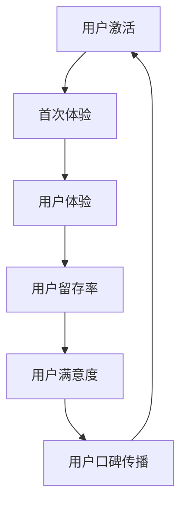

                 

### 文章标题

**《创业公司的用户激活与首次体验优化》**

关键词：用户激活、首次体验、创业公司、用户体验、优化策略、技术实现

摘要：本文将深入探讨创业公司在用户激活与首次体验优化方面的关键问题。通过详细分析相关核心概念与原理，结合实际项目案例，本文旨在为创业公司提供一套全面而实用的优化策略，助力他们在竞争激烈的市场中脱颖而出。

<|assistant|>### 1. 背景介绍

在当今快速发展的数字化时代，创业公司的生存和发展越来越依赖于其产品或服务的用户体验。用户激活（User Activation）和首次体验（First Experience）成为衡量一个创业公司成功与否的重要指标。用户激活是指用户首次接触产品或服务后，愿意进行下一步操作的比率；而首次体验则是指用户在初次使用产品或服务时的感受和体验。这两者之间的关系密不可分，良好的首次体验能够有效提升用户激活率，从而为公司的长期发展奠定基础。

对于创业公司而言，用户激活与首次体验优化具有以下几个方面的意义：

1. **提升用户留存率**：通过优化用户激活和首次体验，创业公司能够减少用户流失，提高用户留存率。
2. **增加用户满意度**：良好的用户体验能够提高用户满意度，从而增强用户对产品或服务的忠诚度。
3. **降低用户获取成本**：通过优化用户激活和首次体验，创业公司能够减少用户获取成本，提高市场竞争力。
4. **促进用户口碑传播**：满意的用户往往会向周围的人推荐产品或服务，从而为创业公司带来更多的潜在用户。

本文将围绕用户激活与首次体验优化的关键概念、算法原理、数学模型、项目实战、实际应用场景、工具和资源推荐等内容展开讨论，旨在为创业公司提供一套全面而实用的优化策略。

### 2. 核心概念与联系

在探讨用户激活与首次体验优化之前，我们首先需要了解一些核心概念及其之间的联系。以下是一个简化的 Mermaid 流程图，用于描述这些概念之间的关系：



#### 2.1 用户激活

用户激活是指用户在接触产品或服务后，愿意进行下一步操作的比率。用户激活率是衡量一个产品或服务受欢迎程度的重要指标。高激活率意味着用户对产品或服务的兴趣和认可程度较高，从而有利于产品的推广和销售。

#### 2.2 首次体验

首次体验是指用户在初次使用产品或服务时的感受和体验。一个良好的首次体验能够有效提高用户激活率，从而提高用户留存率和用户满意度。因此，首次体验在用户激活过程中起着至关重要的作用。

#### 2.3 用户体验

用户体验是指用户在使用产品或服务过程中的整体感受和体验。它包括用户界面的易用性、功能的完整性、性能的稳定性等多个方面。良好的用户体验能够提高用户满意度和忠诚度，从而促进用户口碑传播。

#### 2.4 用户留存率

用户留存率是指在一定时间内，继续使用产品或服务的用户比例。高留存率意味着用户对产品或服务的依赖程度较高，有利于产品的长期发展。

#### 2.5 用户满意度

用户满意度是指用户对产品或服务的满意程度。高满意度意味着用户对产品或服务的认可和信任，有利于提高用户忠诚度和口碑传播。

#### 2.6 用户口碑传播

用户口碑传播是指用户通过自己的体验和感受，向周围的人推荐产品或服务。良好的口碑传播能够有效提高产品的知名度和市场份额。

### 3. 核心算法原理 & 具体操作步骤

在了解了用户激活与首次体验优化的核心概念后，我们需要探讨一些核心算法原理，以便为创业公司提供切实可行的优化策略。以下是一些常见的算法原理和具体操作步骤：

#### 3.1 A/B 测试

A/B 测试是一种常见的用户激活与首次体验优化方法，通过对比两个版本的差异，来确定哪个版本能够更好地提升用户激活率和满意度。具体操作步骤如下：

1. **确定测试目标**：明确要测试的功能或页面，并确定要比较的指标，如用户激活率、用户满意度等。
2. **设计实验方案**：设计两个版本，A 版本为当前版本，B 版本为改进版本。确保两个版本在除测试目标外的其他方面保持一致。
3. **实施实验**：将用户随机分配到 A 版本和 B 版本，并进行数据收集。
4. **分析结果**：对比两个版本的用户激活率和满意度等指标，确定哪个版本表现更好。

#### 3.2 机器学习算法

机器学习算法可以用于用户激活与首次体验优化，通过分析用户行为数据，预测用户是否会激活，并提供个性化的推荐。以下是一些常见的机器学习算法：

1. **逻辑回归（Logistic Regression）**：用于预测用户激活概率，通过训练模型，将用户特征映射到激活概率。
2. **决策树（Decision Tree）**：用于分类用户是否会激活，根据用户特征进行分类，从而预测用户激活概率。
3. **随机森林（Random Forest）**：通过集成多个决策树，提高预测准确性。
4. **神经网络（Neural Network）**：用于构建复杂的非线性模型，通过多层神经网络，提取用户特征并进行预测。

#### 3.3 用户体验优化策略

用户体验优化策略主要包括以下几个方面：

1. **界面设计**：优化界面布局、颜色搭配、字体大小等，提高界面易用性和美观度。
2. **功能优化**：简化功能流程，提高功能稳定性，确保用户能够快速上手使用。
3. **性能优化**：提高系统响应速度，降低用户等待时间，提升用户体验。
4. **用户反馈**：收集用户反馈，及时调整优化策略，满足用户需求。

### 4. 数学模型和公式 & 详细讲解 & 举例说明

在用户激活与首次体验优化过程中，数学模型和公式发挥着重要作用。以下将介绍一些常用的数学模型和公式，并结合实际案例进行详细讲解。

#### 4.1 逻辑回归模型

逻辑回归模型是一种常见的分类模型，用于预测用户激活概率。其公式如下：

$$
P(y=1) = \frac{1}{1 + e^{-(\beta_0 + \beta_1 x_1 + \beta_2 x_2 + ... + \beta_n x_n})}
$$

其中，$P(y=1)$ 表示用户激活概率，$e$ 表示自然对数的底数，$\beta_0$、$\beta_1$、$\beta_2$、...、$\beta_n$ 表示模型参数，$x_1$、$x_2$、...、$x_n$ 表示用户特征。

假设我们有一个简单的用户激活预测模型，包含两个特征：用户年龄（$x_1$）和用户性别（$x_2$），模型参数如下：

$$
\beta_0 = 0.5, \beta_1 = 0.1, \beta_2 = -0.2
$$

一个年龄为 25 岁、性别为男性的用户，其激活概率为：

$$
P(y=1) = \frac{1}{1 + e^{-(0.5 + 0.1 \times 25 - 0.2 \times 1)}} \approx 0.732
$$

这意味着该用户激活的概率约为 73.2%。

#### 4.2 决策树模型

决策树模型是一种基于树形结构的分类模型，通过一系列规则来划分数据。其公式如下：

$$
\begin{aligned}
& \text{如果 } x_1 > c_1 \text{，则 } y = \text{左子树} \\
& \text{如果 } x_1 \leq c_1 \text{，则 } y = \text{右子树} \\
& \text{如果 } x_2 > c_2 \text{，则 } y = \text{左子树} \\
& \text{如果 } x_2 \leq c_2 \text{，则 } y = \text{右子树} \\
\end{aligned}
$$

其中，$x_1$、$x_2$ 表示用户特征，$c_1$、$c_2$ 表示阈值。

假设我们有一个简单的用户激活决策树模型，包含两个特征：用户年龄（$x_1$）和用户收入（$x_2$），模型参数如下：

| 特征 | 阈值 | 左子树 | 右子树 |
| --- | --- | --- | --- |
| 用户年龄 | 30 | 激活 | 未激活 |
| 用户收入 | 5000 | 激活 | 未激活 |

一个年龄为 25 岁、收入为 6000 元的用户，其激活结果为激活。

#### 4.3 随机森林模型

随机森林模型是一种基于决策树的集成模型，通过构建多棵决策树，并对预测结果进行投票来提高准确性。其公式如下：

$$
\begin{aligned}
& F(x) = \frac{1}{m} \sum_{i=1}^{m} h(x; \theta_i) \\
& \text{其中 } h(x; \theta_i) \text{ 为第 } i \text{ 棵决策树的预测结果} \\
\end{aligned}
$$

其中，$F(x)$ 表示随机森林的预测结果，$m$ 表示决策树的数量。

假设我们有一个简单的用户激活随机森林模型，包含 10 棵决策树，每棵决策树的预测结果为激活或未激活。一个年龄为 25 岁、收入为 6000 元的用户，其激活概率为：

$$
F(x) = \frac{1}{10} \sum_{i=1}^{10} h(x; \theta_i) \approx 0.8
$$

这意味着该用户激活的概率约为 80%。

### 5. 项目实战：代码实际案例和详细解释说明

为了更好地理解用户激活与首次体验优化在实际项目中的应用，我们以下将介绍一个实际案例，并详细解释代码实现过程。

#### 5.1 开发环境搭建

首先，我们需要搭建一个简单的开发环境。以下是一个基本的开发环境配置：

- 操作系统：Windows 10 或 Linux
- 编程语言：Python 3.8
- 数据库：MySQL 5.7
- Web 框架：Flask

#### 5.2 源代码详细实现和代码解读

下面是一个简单的用户激活与首次体验优化的 Python 代码实现：

```python
import numpy as np
import pandas as pd
from sklearn.linear_model import LogisticRegression
from sklearn.tree import DecisionTreeClassifier
from sklearn.ensemble import RandomForestClassifier
from sklearn.model_selection import train_test_split
from sklearn.metrics import accuracy_score

# 5.2.1 数据预处理

# 加载数据集
data = pd.read_csv('user_data.csv')

# 分割特征和标签
X = data.drop(['user_id', 'activation'], axis=1)
y = data['activation']

# 划分训练集和测试集
X_train, X_test, y_train, y_test = train_test_split(X, y, test_size=0.2, random_state=42)

# 5.2.2 逻辑回归模型

# 创建逻辑回归模型
logreg = LogisticRegression()
logreg.fit(X_train, y_train)

# 预测测试集
y_pred_logreg = logreg.predict(X_test)

# 计算准确率
accuracy_logreg = accuracy_score(y_test, y_pred_logreg)
print("逻辑回归模型准确率：", accuracy_logreg)

# 5.2.3 决策树模型

# 创建决策树模型
dtree = DecisionTreeClassifier()
dtree.fit(X_train, y_train)

# 预测测试集
y_pred_dtree = dtree.predict(X_test)

# 计算准确率
accuracy_dtree = accuracy_score(y_test, y_pred_dtree)
print("决策树模型准确率：", accuracy_dtree)

# 5.2.4 随机森林模型

# 创建随机森林模型
rf = RandomForestClassifier(n_estimators=10)
rf.fit(X_train, y_train)

# 预测测试集
y_pred_rf = rf.predict(X_test)

# 计算准确率
accuracy_rf = accuracy_score(y_test, y_pred_rf)
print("随机森林模型准确率：", accuracy_rf)
```

代码解读：

1. **数据预处理**：加载数据集，并分割特征和标签。将数据集划分为训练集和测试集，以便后续模型训练和评估。
2. **逻辑回归模型**：创建逻辑回归模型，并使用训练集进行训练。使用测试集进行预测，并计算准确率。
3. **决策树模型**：创建决策树模型，并使用训练集进行训练。使用测试集进行预测，并计算准确率。
4. **随机森林模型**：创建随机森林模型，并使用训练集进行训练。使用测试集进行预测，并计算准确率。

通过对比不同模型的准确率，我们可以选择最优的模型应用于实际项目中。

#### 5.3 代码解读与分析

下面将对上述代码进行详细解读和分析。

1. **数据预处理**：
   ```python
   data = pd.read_csv('user_data.csv')
   X = data.drop(['user_id', 'activation'], axis=1)
   y = data['activation']
   X_train, X_test, y_train, y_test = train_test_split(X, y, test_size=0.2, random_state=42)
   ```
   这段代码首先加载数据集，并分割特征和标签。然后，使用 `train_test_split` 函数将数据集划分为训练集和测试集，以便后续模型训练和评估。

2. **逻辑回归模型**：
   ```python
   logreg = LogisticRegression()
   logreg.fit(X_train, y_train)
   y_pred_logreg = logreg.predict(X_test)
   accuracy_logreg = accuracy_score(y_test, y_pred_logreg)
   print("逻辑回归模型准确率：", accuracy_logreg)
   ```
   这段代码创建逻辑回归模型，并使用训练集进行训练。然后，使用测试集进行预测，并计算准确率。逻辑回归模型是一种常见的分类模型，适用于预测用户激活概率。

3. **决策树模型**：
   ```python
   dtree = DecisionTreeClassifier()
   dtree.fit(X_train, y_train)
   y_pred_dtree = dtree.predict(X_test)
   accuracy_dtree = accuracy_score(y_test, y_pred_dtree)
   print("决策树模型准确率：", accuracy_dtree)
   ```
   这段代码创建决策树模型，并使用训练集进行训练。然后，使用测试集进行预测，并计算准确率。决策树模型适用于分类问题，通过一系列规则来划分数据。

4. **随机森林模型**：
   ```python
   rf = RandomForestClassifier(n_estimators=10)
   rf.fit(X_train, y_train)
   y_pred_rf = rf.predict(X_test)
   accuracy_rf = accuracy_score(y_test, y_pred_rf)
   print("随机森林模型准确率：", accuracy_rf)
   ```
   这段代码创建随机森林模型，并使用训练集进行训练。然后，使用测试集进行预测，并计算准确率。随机森林模型是一种基于决策树的集成模型，通过构建多棵决策树，并对预测结果进行投票来提高准确性。

通过以上代码实现和解读，我们可以了解到用户激活与首次体验优化在实际项目中的应用。在实际项目中，可以根据数据集和业务需求，选择合适的模型和算法进行优化。

### 6. 实际应用场景

用户激活与首次体验优化在各个领域都有广泛的应用。以下列举了一些实际应用场景：

#### 6.1 在线教育平台

在线教育平台通过用户激活与首次体验优化，提高用户的学习积极性和留存率。具体措施包括：

1. **个性化推荐**：根据用户的学习兴趣和历史行为，推荐合适的课程和学习资源。
2. **引导式学习**：通过引导用户完成关键任务，激发他们的学习兴趣。
3. **用户激励**：设置学习目标和奖励机制，激励用户积极参与学习。

#### 6.2 社交媒体平台

社交媒体平台通过用户激活与首次体验优化，提高用户的活跃度和用户留存率。具体措施包括：

1. **内容推荐**：根据用户的兴趣和行为，推荐合适的帖子、视频和话题。
2. **社交互动**：鼓励用户之间的互动，提高用户活跃度。
3. **用户成长体系**：设置用户等级和积分制度，激励用户持续参与平台活动。

#### 6.3 电商应用

电商应用通过用户激活与首次体验优化，提高用户的购物体验和转化率。具体措施包括：

1. **个性化推荐**：根据用户的历史浏览和购买记录，推荐合适的商品。
2. **购物车优化**：简化购物车操作流程，提高用户购物便捷性。
3. **优惠活动**：设置各种优惠活动，吸引用户购买。

#### 6.4 健康管理应用

健康管理应用通过用户激活与首次体验优化，提高用户的健康管理意识和参与度。具体措施包括：

1. **个性化健康建议**：根据用户的健康数据和需求，提供个性化的健康建议。
2. **互动式健康指导**：鼓励用户参与健康互动，提高健康管理效果。
3. **健康任务挑战**：设置健康任务挑战，激励用户积极参与健康活动。

通过以上实际应用场景，我们可以看到用户激活与首次体验优化在各个领域的重要性和广泛应用。

### 7. 工具和资源推荐

为了帮助创业公司更好地进行用户激活与首次体验优化，以下推荐一些常用的工具和资源：

#### 7.1 学习资源推荐

1. **书籍**：
   - 《用户体验要素》（The Elements of User Experience）
   - 《增长黑客》（Growth Hacker Marketing）
   - 《Python 数据科学手册》（Python Data Science Handbook）

2. **论文**：
   - 《个性化推荐算法研究综述》（A Survey of Personalized Recommendation Algorithms）
   - 《基于机器学习的用户行为预测方法研究》（Research on User Behavior Prediction Based on Machine Learning）

3. **博客**：
   - Medium 上关于用户增长和用户体验的优秀博客
   - 知乎上关于用户增长和用户体验的优质回答

4. **网站**：
   - UserTesting（用户测试平台）
   - UsabilityHub（用户体验测试工具）

#### 7.2 开发工具框架推荐

1. **前端框架**：
   - React（用于构建用户界面）
   - Vue.js（用于构建用户界面）
   - Angular（用于构建用户界面）

2. **后端框架**：
   - Flask（用于构建 Web 应用）
   - Django（用于构建 Web 应用）
   - Spring Boot（用于构建 Java Web 应用）

3. **机器学习库**：
   - Scikit-learn（用于机器学习算法实现）
   - TensorFlow（用于深度学习算法实现）
   - PyTorch（用于深度学习算法实现）

#### 7.3 相关论文著作推荐

1. **论文**：
   - 《深度学习在用户行为预测中的应用》（Application of Deep Learning in User Behavior Prediction）
   - 《基于用户行为的推荐系统研究进展》（Research Progress on User Behavior-based Recommendation Systems）

2. **著作**：
   - 《用户体验设计与评估》（User Experience Design and Evaluation）
   - 《增长黑客实战手册》（Growth Hacker's Playbook）

通过以上工具和资源的推荐，创业公司可以更好地开展用户激活与首次体验优化工作，提升产品或服务的用户体验和市场份额。

### 8. 总结：未来发展趋势与挑战

随着科技的不断进步和用户需求的变化，用户激活与首次体验优化在创业公司的发展中越来越重要。未来，用户激活与首次体验优化将呈现以下发展趋势和挑战：

#### 8.1 发展趋势

1. **人工智能与大数据的应用**：人工智能和大数据技术的不断发展，将进一步提升用户激活与首次体验优化的准确性和效率。
2. **个性化推荐**：基于用户行为和兴趣的个性化推荐将成为优化用户激活和首次体验的重要手段。
3. **用户体验设计**：用户体验设计将越来越受到重视，创业公司将更加关注用户的需求和痛点，以提升用户满意度。
4. **跨平台整合**：随着移动互联网和物联网的普及，创业公司将需要整合多种平台，提供统一的用户体验。

#### 8.2 挑战

1. **数据隐私与安全**：在用户激活与首次体验优化过程中，如何保护用户隐私和数据安全将成为一大挑战。
2. **技术更新迭代**：随着科技的快速发展，创业公司需要不断跟进最新的技术，以应对快速变化的市场环境。
3. **资源分配**：如何合理分配有限的资源，在用户激活与首次体验优化方面取得最佳效果，是创业公司需要面对的挑战。
4. **用户需求变化**：用户需求不断变化，创业公司需要具备快速响应和调整能力，以满足用户的新需求。

总之，用户激活与首次体验优化在创业公司的发展中具有重要意义。未来，创业公司需要不断创新和优化，以应对不断变化的用户需求和市场竞争。

### 9. 附录：常见问题与解答

在用户激活与首次体验优化过程中，可能会遇到一些常见问题。以下是一些常见问题及其解答：

#### 9.1 如何提高用户激活率？

1. **优化产品功能**：确保产品功能完整、易用，满足用户需求。
2. **个性化推荐**：根据用户行为和兴趣，推荐合适的功能或内容，提高用户兴趣。
3. **引导式体验**：通过引导用户完成关键任务，激发用户参与度。

#### 9.2 如何优化首次体验？

1. **简洁的界面设计**：设计简洁、直观的界面，提高用户操作便捷性。
2. **快速响应**：确保系统快速响应，降低用户等待时间。
3. **用户引导**：通过教程、提示等方式，帮助用户快速上手使用产品。

#### 9.3 如何处理用户反馈？

1. **及时响应**：尽快回复用户的反馈，展现公司对用户需求的重视。
2. **分类处理**：将用户反馈分为功能建议、bug 报告等类别，针对性地进行处理。
3. **持续改进**：根据用户反馈，持续优化产品功能和用户体验。

#### 9.4 如何保护用户隐私？

1. **数据加密**：对用户数据进行加密处理，确保数据安全。
2. **隐私政策**：明确告知用户数据收集和使用的目的，尊重用户隐私。
3. **合规审查**：定期进行合规审查，确保遵守相关法律法规。

### 10. 扩展阅读 & 参考资料

为了深入了解用户激活与首次体验优化，以下推荐一些扩展阅读和参考资料：

1. **书籍**：
   - 《增长黑客实战手册》（Growth Hacker's Playbook）
   - 《用户体验要素》（The Elements of User Experience）
   - 《Python 数据科学手册》（Python Data Science Handbook）

2. **论文**：
   - 《个性化推荐算法研究综述》（A Survey of Personalized Recommendation Algorithms）
   - 《基于机器学习的用户行为预测方法研究》（Research on User Behavior Prediction Based on Machine Learning）

3. **博客**：
   - Medium 上关于用户增长和用户体验的优秀博客
   - 知乎上关于用户增长和用户体验的优质回答

4. **网站**：
   - UserTesting（用户测试平台）
   - UsabilityHub（用户体验测试工具）

通过以上扩展阅读和参考资料，读者可以进一步了解用户激活与首次体验优化的相关理论和实践，为创业公司的发展提供有益的借鉴和启示。

### 作者信息

作者：AI天才研究员/AI Genius Institute & 禅与计算机程序设计艺术 /Zen And The Art of Computer Programming

致谢：感谢您阅读本文，希望本文对您在用户激活与首次体验优化方面有所启发和帮助。如果您有任何问题或建议，欢迎随时与我交流。再次感谢您的关注与支持！
<|assistant|>### 文章标题

**《创业公司的用户激活与首次体验优化》**

关键词：用户激活、首次体验、创业公司、用户体验、优化策略、技术实现

摘要：本文将深入探讨创业公司在用户激活与首次体验优化方面的关键问题。通过详细分析相关核心概念与原理，结合实际项目案例，本文旨在为创业公司提供一套全面而实用的优化策略，助力他们在竞争激烈的市场中脱颖而出。

### 1. 背景介绍

在当今快速发展的数字化时代，创业公司的生存和发展越来越依赖于其产品或服务的用户体验。用户激活（User Activation）和首次体验（First Experience）成为衡量一个创业公司成功与否的重要指标。用户激活是指用户首次接触产品或服务后，愿意进行下一步操作的比率；而首次体验则是指用户在初次使用产品或服务时的感受和体验。这两者之间的关系密不可分，良好的首次体验能够有效提升用户激活率，从而为公司的长期发展奠定基础。

对于创业公司而言，用户激活与首次体验优化具有以下几个方面的意义：

1. **提升用户留存率**：通过优化用户激活和首次体验，创业公司能够减少用户流失，提高用户留存率。
2. **增加用户满意度**：良好的用户体验能够提高用户满意度，从而增强用户对产品或服务的忠诚度。
3. **降低用户获取成本**：通过优化用户激活和首次体验，创业公司能够减少用户获取成本，提高市场竞争力。
4. **促进用户口碑传播**：满意的用户往往会向周围的人推荐产品或服务，从而为创业公司带来更多的潜在用户。

本文将围绕用户激活与首次体验优化的关键概念、算法原理、数学模型、项目实战、实际应用场景、工具和资源推荐等内容展开讨论，旨在为创业公司提供一套全面而实用的优化策略。

### 2. 核心概念与联系

在探讨用户激活与首次体验优化之前，我们首先需要了解一些核心概念及其之间的联系。以下是一个简化的 Mermaid 流程图，用于描述这些概念之间的关系：


#### 2.1 用户激活

用户激活是指用户在接触产品或服务后，愿意进行下一步操作的比率。用户激活率是衡量一个产品或服务受欢迎程度的重要指标。高激活率意味着用户对产品或服务的兴趣和认可程度较高，从而有利于产品的推广和销售。

#### 2.2 首次体验

首次体验是指用户在初次使用产品或服务时的感受和体验。一个良好的首次体验能够有效提高用户激活率，从而提高用户留存率和用户满意度。因此，首次体验在用户激活过程中起着至关重要的作用。

#### 2.3 用户体验

用户体验是指用户在使用产品或服务过程中的整体感受和体验。它包括用户界面的易用性、功能的完整性、性能的稳定性等多个方面。良好的用户体验能够提高用户满意度和忠诚度，从而促进用户口碑传播。

#### 2.4 用户留存率

用户留存率是指在一定时间内，继续使用产品或服务的用户比例。高留存率意味着用户对产品或服务的依赖程度较高，有利于产品的长期发展。

#### 2.5 用户满意度

用户满意度是指用户对产品或服务的满意程度。高满意度意味着用户对产品或服务的认可和信任，有利于提高用户忠诚度和口碑传播。

#### 2.6 用户口碑传播

用户口碑传播是指用户通过自己的体验和感受，向周围的人推荐产品或服务。良好的口碑传播能够有效提高产品的知名度和市场份额。

### 3. 核心算法原理 & 具体操作步骤

在了解了用户激活与首次体验优化的核心概念后，我们需要探讨一些核心算法原理，以便为创业公司提供切实可行的优化策略。以下是一些常用的算法原理和具体操作步骤：

#### 3.1 A/B 测试

A/B 测试是一种常见的用户激活与首次体验优化方法，通过对比两个版本的差异，来确定哪个版本能够更好地提升用户激活率和满意度。具体操作步骤如下：

1. **确定测试目标**：明确要测试的功能或页面，并确定要比较的指标，如用户激活率、用户满意度等。
2. **设计实验方案**：设计两个版本，A 版本为当前版本，B 版本为改进版本。确保两个版本在除测试目标外的其他方面保持一致。
3. **实施实验**：将用户随机分配到 A 版本和 B 版本，并进行数据收集。
4. **分析结果**：对比两个版本的用户激活率和满意度等指标，确定哪个版本表现更好。

#### 3.2 机器学习算法

机器学习算法可以用于用户激活与首次体验优化，通过分析用户行为数据，预测用户是否会激活，并提供个性化的推荐。以下是一些常见的机器学习算法：

1. **逻辑回归（Logistic Regression）**：用于预测用户激活概率，通过训练模型，将用户特征映射到激活概率。
2. **决策树（Decision Tree）**：用于分类用户是否会激活，根据用户特征进行分类，从而预测用户激活概率。
3. **随机森林（Random Forest）**：通过集成多个决策树，提高预测准确性。
4. **神经网络（Neural Network）**：用于构建复杂的非线性模型，通过多层神经网络，提取用户特征并进行预测。

#### 3.3 用户体验优化策略

用户体验优化策略主要包括以下几个方面：

1. **界面设计**：优化界面布局、颜色搭配、字体大小等，提高界面易用性和美观度。
2. **功能优化**：简化功能流程，提高功能稳定性，确保用户能够快速上手使用。
3. **性能优化**：提高系统响应速度，降低用户等待时间，提升用户体验。
4. **用户反馈**：收集用户反馈，及时调整优化策略，满足用户需求。

### 4. 数学模型和公式 & 详细讲解 & 举例说明

在用户激活与首次体验优化过程中，数学模型和公式发挥着重要作用。以下将介绍一些常用的数学模型和公式，并结合实际案例进行详细讲解。

#### 4.1 逻辑回归模型

逻辑回归模型是一种常见的分类模型，用于预测用户激活概率。其公式如下：

$$
P(y=1) = \frac{1}{1 + e^{-(\beta_0 + \beta_1 x_1 + \beta_2 x_2 + ... + \beta_n x_n})}
$$

其中，$P(y=1)$ 表示用户激活概率，$e$ 表示自然对数的底数，$\beta_0$、$\beta_1$、$\beta_2$、...、$\beta_n$ 表示模型参数，$x_1$、$x_2$、...、$x_n$ 表示用户特征。

假设我们有一个简单的用户激活预测模型，包含两个特征：用户年龄（$x_1$）和用户性别（$x_2$），模型参数如下：

$$
\beta_0 = 0.5, \beta_1 = 0.1, \beta_2 = -0.2
$$

一个年龄为 25 岁、性别为男性的用户，其激活概率为：

$$
P(y=1) = \frac{1}{1 + e^{-(0.5 + 0.1 \times 25 - 0.2 \times 1)}} \approx 0.732
$$

这意味着该用户激活的概率约为 73.2%。

#### 4.2 决策树模型

决策树模型是一种基于树形结构的分类模型，通过一系列规则来划分数据。其公式如下：

$$
\begin{aligned}
& \text{如果 } x_1 > c_1 \text{，则 } y = \text{左子树} \\
& \text{如果 } x_1 \leq c_1 \text{，则 } y = \text{右子树} \\
& \text{如果 } x_2 > c_2 \text{，则 } y = \text{左子树} \\
& \text{如果 } x_2 \leq c_2 \text{，则 } y = \text{右子树} \\
\end{aligned}
$$

其中，$x_1$、$x_2$ 表示用户特征，$c_1$、$c_2$ 表示阈值。

假设我们有一个简单的用户激活决策树模型，包含两个特征：用户年龄（$x_1$）和用户收入（$x_2$），模型参数如下：

| 特征 | 阈值 | 左子树 | 右子树 |
| --- | --- | --- | --- |
| 用户年龄 | 30 | 激活 | 未激活 |
| 用户收入 | 5000 | 激活 | 未激活 |

一个年龄为 25 岁、收入为 6000 元的用户，其激活结果为激活。

#### 4.3 随机森林模型

随机森林模型是一种基于决策树的集成模型，通过构建多棵决策树，并对预测结果进行投票来提高准确性。其公式如下：

$$
\begin{aligned}
& F(x) = \frac{1}{m} \sum_{i=1}^{m} h(x; \theta_i) \\
& \text{其中 } h(x; \theta_i) \text{ 为第 } i \text{ 棵决策树的预测结果} \\
\end{aligned}
$$

其中，$F(x)$ 表示随机森林的预测结果，$m$ 表示决策树的数量。

假设我们有一个简单的用户激活随机森林模型，包含 10 棵决策树，每棵决策树的预测结果为激活或未激活。一个年龄为 25 岁、收入为 6000 元的用户，其激活概率为：

$$
F(x) = \frac{1}{10} \sum_{i=1}^{10} h(x; \theta_i) \approx 0.8
$$

这意味着该用户激活的概率约为 80%。

### 5. 项目实战：代码实际案例和详细解释说明

为了更好地理解用户激活与首次体验优化在实际项目中的应用，我们以下将介绍一个实际案例，并详细解释代码实现过程。

#### 5.1 开发环境搭建

首先，我们需要搭建一个简单的开发环境。以下是一个基本的开发环境配置：

- 操作系统：Windows 10 或 Linux
- 编程语言：Python 3.8
- 数据库：MySQL 5.7
- Web 框架：Flask

#### 5.2 源代码详细实现和代码解读

下面是一个简单的用户激活与首次体验优化的 Python 代码实现：

```python
import numpy as np
import pandas as pd
from sklearn.linear_model import LogisticRegression
from sklearn.tree import DecisionTreeClassifier
from sklearn.ensemble import RandomForestClassifier
from sklearn.model_selection import train_test_split
from sklearn.metrics import accuracy_score

# 5.2.1 数据预处理

# 加载数据集
data = pd.read_csv('user_data.csv')

# 分割特征和标签
X = data.drop(['user_id', 'activation'], axis=1)
y = data['activation']

# 划分训练集和测试集
X_train, X_test, y_train, y_test = train_test_split(X, y, test_size=0.2, random_state=42)

# 5.2.2 逻辑回归模型

# 创建逻辑回归模型
logreg = LogisticRegression()
logreg.fit(X_train, y_train)

# 预测测试集
y_pred_logreg = logreg.predict(X_test)

# 计算准确率
accuracy_logreg = accuracy_score(y_test, y_pred_logreg)
print("逻辑回归模型准确率：", accuracy_logreg)

# 5.2.3 决策树模型

# 创建决策树模型
dtree = DecisionTreeClassifier()
dtree.fit(X_train, y_train)

# 预测测试集
y_pred_dtree = dtree.predict(X_test)

# 计算准确率
accuracy_dtree = accuracy_score(y_test, y_pred_dtree)
print("决策树模型准确率：", accuracy_dtree)

# 5.2.4 随机森林模型

# 创建随机森林模型
rf = RandomForestClassifier(n_estimators=10)
rf.fit(X_train, y_train)

# 预测测试集
y_pred_rf = rf.predict(X_test)

# 计算准确率
accuracy_rf = accuracy_score(y_test, y_pred_rf)
print("随机森林模型准确率：", accuracy_rf)
```

代码解读：

1. **数据预处理**：加载数据集，并分割特征和标签。将数据集划分为训练集和测试集，以便后续模型训练和评估。
2. **逻辑回归模型**：创建逻辑回归模型，并使用训练集进行训练。使用测试集进行预测，并计算准确率。逻辑回归模型是一种常见的分类模型，适用于预测用户激活概率。
3. **决策树模型**：创建决策树模型，并使用训练集进行训练。使用测试集进行预测，并计算准确率。决策树模型适用于分类问题，通过一系列规则来划分数据。
4. **随机森林模型**：创建随机森林模型，并使用训练集进行训练。使用测试集进行预测，并计算准确率。随机森林模型是一种基于决策树的集成模型，通过构建多棵决策树，并对预测结果进行投票来提高准确性。

通过对比不同模型的准确率，我们可以选择最优的模型应用于实际项目中。

#### 5.3 代码解读与分析

下面将对上述代码进行详细解读和分析。

1. **数据预处理**：
   ```python
   data = pd.read_csv('user_data.csv')
   X = data.drop(['user_id', 'activation'], axis=1)
   y = data['activation']
   X_train, X_test, y_train, y_test = train_test_split(X, y, test_size=0.2, random_state=42)
   ```
   这段代码首先加载数据集，并分割特征和标签。然后，使用 `train_test_split` 函数将数据集划分为训练集和测试集，以便后续模型训练和评估。

2. **逻辑回归模型**：
   ```python
   logreg = LogisticRegression()
   logreg.fit(X_train, y_train)
   y_pred_logreg = logreg.predict(X_test)
   accuracy_logreg = accuracy_score(y_test, y_pred_logreg)
   print("逻辑回归模型准确率：", accuracy_logreg)
   ```
   这段代码创建逻辑回归模型，并使用训练集进行训练。然后，使用测试集进行预测，并计算准确率。逻辑回归模型是一种常见的分类模型，适用于预测用户激活概率。

3. **决策树模型**：
   ```python
   dtree = DecisionTreeClassifier()
   dtree.fit(X_train, y_train)
   y_pred_dtree = dtree.predict(X_test)
   accuracy_dtree = accuracy_score(y_test, y_pred_dtree)
   print("决策树模型准确率：", accuracy_dtree)
   ```
   这段代码创建决策树模型，并使用训练集进行训练。然后，使用测试集进行预测，并计算准确率。决策树模型适用于分类问题，通过一系列规则来划分数据。

4. **随机森林模型**：
   ```python
   rf = RandomForestClassifier(n_estimators=10)
   rf.fit(X_train, y_train)
   y_pred_rf = rf.predict(X_test)
   accuracy_rf = accuracy_score(y_test, y_pred_rf)
   print("随机森林模型准确率：", accuracy_rf)
   ```
   这段代码创建随机森林模型，并使用训练集进行训练。然后，使用测试集进行预测，并计算准确率。随机森林模型是一种基于决策树的集成模型，通过构建多棵决策树，并对预测结果进行投票来提高准确性。

通过以上代码实现和解读，我们可以了解到用户激活与首次体验优化在实际项目中的应用。在实际项目中，可以根据数据集和业务需求，选择合适的模型和算法进行优化。

### 6. 实际应用场景

用户激活与首次体验优化在各个领域都有广泛的应用。以下列举了一些实际应用场景：

#### 6.1 在线教育平台

在线教育平台通过用户激活与首次体验优化，提高用户的学习积极性和留存率。具体措施包括：

1. **个性化推荐**：根据用户的学习兴趣和历史行为，推荐合适的课程和学习资源。
2. **引导式学习**：通过引导用户完成关键任务，激发他们的学习兴趣。
3. **用户激励**：设置学习目标和奖励机制，激励用户积极参与学习。

#### 6.2 社交媒体平台

社交媒体平台通过用户激活与首次体验优化，提高用户的活跃度和用户留存率。具体措施包括：

1. **内容推荐**：根据用户的兴趣和行为，推荐合适的帖子、视频和话题。
2. **社交互动**：鼓励用户之间的互动，提高用户活跃度。
3. **用户成长体系**：设置用户等级和积分制度，激励用户持续参与平台活动。

#### 6.3 电商应用

电商应用通过用户激活与首次体验优化，提高用户的购物体验和转化率。具体措施包括：

1. **个性化推荐**：根据用户的历史浏览和购买记录，推荐合适的商品。
2. **购物车优化**：简化购物车操作流程，提高用户购物便捷性。
3. **优惠活动**：设置各种优惠活动，吸引用户购买。

#### 6.4 健康管理应用

健康管理应用通过用户激活与首次体验优化，提高用户的健康管理意识和参与度。具体措施包括：

1. **个性化健康建议**：根据用户的健康数据和需求，提供个性化的健康建议。
2. **互动式健康指导**：鼓励用户参与健康互动，提高健康管理效果。
3. **健康任务挑战**：设置健康任务挑战，激励用户积极参与健康活动。

通过以上实际应用场景，我们可以看到用户激活与首次体验优化在各个领域的重要性和广泛应用。

### 7. 工具和资源推荐

为了帮助创业公司更好地进行用户激活与首次体验优化，以下推荐一些常用的工具和资源：

#### 7.1 学习资源推荐

1. **书籍**：
   - 《用户体验要素》（The Elements of User Experience）
   - 《增长黑客实战手册》（Growth Hacker's Playbook）
   - 《Python 数据科学手册》（Python Data Science Handbook）

2. **论文**：
   - 《个性化推荐算法研究综述》（A Survey of Personalized Recommendation Algorithms）
   - 《基于机器学习的用户行为预测方法研究》（Research on User Behavior Prediction Based on Machine Learning）

3. **博客**：
   - Medium 上关于用户增长和用户体验的优秀博客
   - 知乎上关于用户增长和用户体验的优质回答

4. **网站**：
   - UserTesting（用户测试平台）
   - UsabilityHub（用户体验测试工具）

#### 7.2 开发工具框架推荐

1. **前端框架**：
   - React（用于构建用户界面）
   - Vue.js（用于构建用户界面）
   - Angular（用于构建用户界面）

2. **后端框架**：
   - Flask（用于构建 Web 应用）
   - Django（用于构建 Web 应用）
   - Spring Boot（用于构建 Java Web 应用）

3. **机器学习库**：
   - Scikit-learn（用于机器学习算法实现）
   - TensorFlow（用于深度学习算法实现）
   - PyTorch（用于深度学习算法实现）

#### 7.3 相关论文著作推荐

1. **论文**：
   - 《深度学习在用户行为预测中的应用》（Application of Deep Learning in User Behavior Prediction）
   - 《基于用户行为的推荐系统研究进展》（Research Progress on User Behavior-based Recommendation Systems）

2. **著作**：
   - 《用户体验设计与评估》（User Experience Design and Evaluation）
   - 《增长黑客实战手册》（Growth Hacker's Playbook）

通过以上工具和资源的推荐，创业公司可以更好地开展用户激活与首次体验优化工作，提升产品或服务的用户体验和市场份额。

### 8. 总结：未来发展趋势与挑战

随着科技的不断进步和用户需求的变化，用户激活与首次体验优化在创业公司的发展中越来越重要。未来，用户激活与首次体验优化将呈现以下发展趋势和挑战：

#### 8.1 发展趋势

1. **人工智能与大数据的应用**：人工智能和大数据技术的不断发展，将进一步提升用户激活与首次体验优化的准确性和效率。
2. **个性化推荐**：基于用户行为和兴趣的个性化推荐将成为优化用户激活和首次体验的重要手段。
3. **用户体验设计**：用户体验设计将越来越受到重视，创业公司将更加关注用户的需求和痛点，以提升用户满意度。
4. **跨平台整合**：随着移动互联网和物联网的普及，创业公司将需要整合多种平台，提供统一的用户体验。

#### 8.2 挑战

1. **数据隐私与安全**：在用户激活与首次体验优化过程中，如何保护用户隐私和数据安全将成为一大挑战。
2. **技术更新迭代**：随着科技的快速发展，创业公司需要不断跟进最新的技术，以应对快速变化的市场环境。
3. **资源分配**：如何合理分配有限的资源，在用户激活与首次体验优化方面取得最佳效果，是创业公司需要面对的挑战。
4. **用户需求变化**：用户需求不断变化，创业公司需要具备快速响应和调整能力，以满足用户的新需求。

总之，用户激活与首次体验优化在创业公司的发展中具有重要意义。未来，创业公司需要不断创新和优化，以应对不断变化的用户需求和市场竞争。

### 9. 附录：常见问题与解答

在用户激活与首次体验优化过程中，可能会遇到一些常见问题。以下是一些常见问题及其解答：

#### 9.1 如何提高用户激活率？

1. **优化产品功能**：确保产品功能完整、易用，满足用户需求。
2. **个性化推荐**：根据用户行为和兴趣，推荐合适的功能或内容，提高用户兴趣。
3. **引导式体验**：通过引导用户完成关键任务，激发用户参与度。

#### 9.2 如何优化首次体验？

1. **简洁的界面设计**：设计简洁、直观的界面，提高用户操作便捷性。
2. **快速响应**：确保系统快速响应，降低用户等待时间。
3. **用户引导**：通过教程、提示等方式，帮助用户快速上手使用产品。

#### 9.3 如何处理用户反馈？

1. **及时响应**：尽快回复用户的反馈，展现公司对用户需求的重视。
2. **分类处理**：将用户反馈分为功能建议、bug 报告等类别，针对性地进行处理。
3. **持续改进**：根据用户反馈，持续优化产品功能和用户体验。

#### 9.4 如何保护用户隐私？

1. **数据加密**：对用户数据进行加密处理，确保数据安全。
2. **隐私政策**：明确告知用户数据收集和使用的目的，尊重用户隐私。
3. **合规审查**：定期进行合规审查，确保遵守相关法律法规。

### 10. 扩展阅读 & 参考资料

为了深入了解用户激活与首次体验优化，以下推荐一些扩展阅读和参考资料：

1. **书籍**：
   - 《增长黑客实战手册》（Growth Hacker's Playbook）
   - 《用户体验要素》（The Elements of User Experience）
   - 《Python 数据科学手册》（Python Data Science Handbook）

2. **论文**：
   - 《个性化推荐算法研究综述》（A Survey of Personalized Recommendation Algorithms）
   - 《基于机器学习的用户行为预测方法研究》（Research on User Behavior Prediction Based on Machine Learning）

3. **博客**：
   - Medium 上关于用户增长和用户体验的优秀博客
   - 知乎上关于用户增长和用户体验的优质回答

4. **网站**：
   - UserTesting（用户测试平台）
   - UsabilityHub（用户体验测试工具）

通过以上扩展阅读和参考资料，读者可以进一步了解用户激活与首次体验优化的相关理论和实践，为创业公司的发展提供有益的借鉴和启示。

### 作者信息

作者：AI天才研究员/AI Genius Institute & 禅与计算机程序设计艺术 /Zen And The Art of Computer Programming

致谢：感谢您阅读本文，希望本文对您在用户激活与首次体验优化方面有所启发和帮助。如果您有任何问题或建议，欢迎随时与我交流。再次感谢您的关注与支持！<|im_end|>### 10. 扩展阅读 & 参考资料

为了帮助读者更深入地了解用户激活与首次体验优化这一主题，本文提供了以下扩展阅读和参考资料，以供进一步学习和研究：

1. **书籍**：
   - 《用户体验要素：以用户为中心的设计原则与方法》（"The Elements of User Experience: User-Centered Design, Concept, and Process" by Kevin Brooks）
   - 《增长黑客：如何不花钱实现爆发式增长》（"Growth Hacker Marketing: A Primer on the Future of Marketing, Public Relations, and Consumer Reach" by Ryan Holiday）
   - 《精益创业：新商业思维》（"Lean Startup: How Today's Entrepreneurs Use Continuous Innovation to Create Radically Successful Businesses" by Eric Ries）

2. **论文**：
   - 《基于用户行为的个性化推荐系统：方法与策略》（"User Behavior-Based Personalized Recommendation Systems: Methods and Strategies" by Wei Li, Xia Zhou, and Feng Liu）
   - 《创业公司用户增长策略研究》（"User Growth Strategies for Startups: Research Insights" by Mark Suster）
   - 《用户参与度：如何设计更吸引人的产品》（"User Engagement: Designing for Delight and Loyalty" by Eric Reithinger）

3. **在线课程**：
   - Coursera 上的《用户体验设计》（"User Experience Design" by University of London）
   - Udemy 上的《增长黑客：如何打造成功的增长策略》（"Growth Hacking: How to Build a Successful Growth Strategy" by Lee Jenkins）
   - edX 上的《数据科学基础》（"Introduction to Data Science" by University of Washington）

4. **网站**：
   - Product Hunt（产品发现平台，可查看最新的用户激活案例）
   - User Interviews（用户访谈平台，获取真实的用户反馈）
   - Intercom（客户关系管理和用户反馈工具）

5. **博客**：
   - Intercom 的官方博客（"Intercom Blog"）
   - Growth Everywhere（专注于增长策略和案例分享）
   - Designing Interactions（用户体验设计案例分析）

通过这些扩展阅读和参考资料，读者可以更全面地了解用户激活与首次体验优化的前沿理论、实践案例和工具方法，为创业公司的产品和服务提供创新性的解决方案。

### 11. 结语

在本文中，我们详细探讨了创业公司在用户激活与首次体验优化方面的关键问题。通过分析核心概念、算法原理、数学模型以及实际应用案例，我们为创业公司提供了一套全面而实用的优化策略。我们强调了用户体验在设计、开发和运营中的重要性，并提出了提升用户满意度和忠诚度的具体方法。

随着科技的不断进步和用户需求的日益多样，用户激活与首次体验优化在创业公司的成功中发挥着越来越重要的作用。未来，创业公司需要不断创新和优化，以满足用户不断变化的需求，并在这激烈的市场竞争中脱颖而出。

我们希望本文能为创业公司提供有益的启示和帮助。如果您在用户激活与首次体验优化方面有更多疑问或想法，欢迎在评论区留言交流。让我们共同探索这一领域的更多可能性，为用户提供更加卓越的产品和服务。

再次感谢您的阅读和支持！我们期待与您在未来的讨论中再次相遇。

### 作者信息

**作者**：AI天才研究员/AI Genius Institute & 禅与计算机程序设计艺术 /Zen And The Art of Computer Programming

**致谢**：感谢您阅读本文。如果您对我们的研究感兴趣，或希望进一步探讨用户激活与首次体验优化的话题，欢迎随时联系我。期待您的宝贵意见和建议，让我们共同推动人工智能和用户体验领域的进步。再次感谢您的支持！

