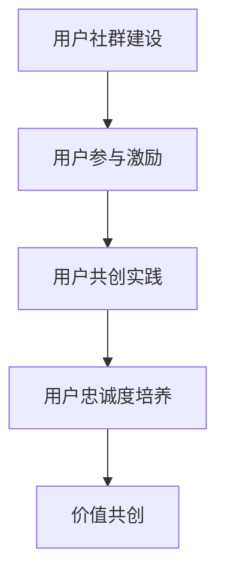

                 

### 背景介绍

#### 创业公司的发展现状与挑战

在全球化的商业环境中，创业公司正面临着前所未有的机遇与挑战。根据全球创业观察（Global Entrepreneurship Monitor，GEM）的数据显示，全球每年新注册的创业公司数量持续增长，这表明创业活动已成为推动经济发展的重要力量。然而，随着市场竞争的日益激烈，创业公司面临着资源有限、市场竞争压力大、用户需求快速变化等多重挑战。

从资源角度来看，创业公司通常在资金、人力资源和技术资源方面存在短缺。这使得公司在制定发展战略和运营策略时，必须更加注重资源的有效利用和优化。此外，市场环境的瞬息万变也要求创业公司具备快速响应市场变化的能力。

#### 用户社群的重要性

在这样的大背景下，用户社群运营成为了创业公司获取竞争优势的重要手段。用户社群不仅能为公司提供宝贵的用户反馈和市场洞察，还能增强用户对品牌的忠诚度和参与感，从而推动产品的持续优化和用户增长。具体而言，用户社群运营对创业公司的重要性体现在以下几个方面：

1. **用户需求洞察**：通过用户社群，公司能够直接获取用户的需求和意见，这有助于公司及时调整产品方向和功能，提高产品与市场的匹配度。
2. **品牌传播**：用户社群可以作为公司品牌的传播渠道，通过用户的口碑效应，扩大品牌影响力，提高市场知名度。
3. **用户参与**：用户社群能够激发用户的参与感和忠诚度，通过用户共创和参与，增强用户对产品的粘性和忠诚度。
4. **降低营销成本**：用户社群运营能够减少传统营销方式的成本，通过社区互动和用户推荐，实现低成本的口碑营销。

因此，对于创业公司而言，深入理解和有效运营用户社群，不仅能够提升公司的竞争力，还能为其长远发展奠定坚实基础。

### 核心概念与联系

在探讨创业公司的用户社群运营与价值共创策略之前，有必要首先了解一些核心概念，这些概念包括用户社群、用户参与度、用户忠诚度、用户共创等。

#### 用户社群

用户社群是指由具有共同兴趣、需求或目标的一组用户组成的网络。这些用户通过线上或线下的互动和交流，形成了一个具有凝聚力的群体。用户社群不仅仅是用户与公司之间的互动平台，更是公司获取用户反馈、传播品牌信息和推动用户参与的重要渠道。

#### 用户参与度

用户参与度是指用户在社群中的参与程度和积极性。高参与度的用户通常会更加积极地参与社区讨论、提出建议、分享心得，甚至主动参与产品的开发与改进。用户参与度是衡量用户社群活跃度和用户满意度的关键指标。

#### 用户忠诚度

用户忠诚度是指用户对品牌的长期承诺和持续使用意愿。高忠诚度的用户往往愿意为品牌支付溢价，甚至主动为公司推荐新用户。用户忠诚度是创业公司长期发展的基石，能够为公司带来稳定的用户基础和可持续的盈利能力。

#### 用户共创

用户共创是指用户与公司共同参与产品开发和创新的过程。在用户共创模式下，公司通过开放平台和工具，鼓励用户提出想法、参与设计和测试，从而提高产品的市场适应性和用户满意度。

#### 用户社群运营与价值共创策略

用户社群运营与价值共创策略是指公司通过一系列运营活动和策略，激发用户的参与度和忠诚度，实现用户与公司之间的价值共创。具体策略包括：

1. **用户社群建设**：创建和运营一个具有吸引力的用户社群，为用户提供互动交流的平台。
2. **用户参与激励**：通过活动、奖励和激励机制，提高用户的参与度和积极性。
3. **用户共创实践**：开放平台和工具，鼓励用户参与产品的开发与改进。
4. **用户忠诚度培养**：通过优质的产品和服务，增强用户对品牌的信任和忠诚。

#### Mermaid 流程图

以下是一个简化的 Mermaid 流程图，展示了用户社群运营与价值共创策略的核心概念和流程：



在这个流程图中，用户社群建设是起点，通过用户参与激励和用户共创实践，最终实现用户忠诚度和价值共创。每个环节都紧密相连，共同构成了一个完整的用户社群运营与价值共创体系。

### 核心算法原理 & 具体操作步骤

在深入了解用户社群运营与价值共创策略之前，有必要首先探讨一些核心算法原理和具体操作步骤。这些算法和步骤不仅为用户社群的构建和运营提供了理论依据，还帮助公司更好地理解和利用用户数据，从而实现精准运营和高效管理。

#### 算法原理

1. **用户行为分析算法**：用户行为分析算法是用户社群运营的基础。通过对用户在社群中的行为数据进行收集和分析，公司可以了解用户的兴趣偏好、活跃时段和互动模式。常用的分析方法包括用户画像、行为轨迹分析和群体分析等。用户行为分析算法的核心目的是帮助公司了解用户需求，为运营决策提供数据支持。

2. **社交网络分析算法**：社交网络分析算法用于分析用户社群的结构和关系，识别关键用户和社群领袖。关键用户和社群领袖通常具有高影响力，能够带动其他用户的参与和互动。常用的社交网络分析方法包括中心性分析、影响力分析和社区检测等。

3. **用户情感分析算法**：用户情感分析算法通过自然语言处理技术，对用户在社群中的发言和评论进行情感分析，识别用户的情感状态和态度。情感分析算法可以帮助公司了解用户的满意度和忠诚度，及时发现问题并进行调整。

4. **推荐系统算法**：推荐系统算法是提高用户参与度和忠诚度的重要手段。通过分析用户行为和兴趣数据，推荐系统可以为用户提供个性化的内容、产品和服务，提高用户满意度和粘性。常用的推荐算法包括协同过滤、基于内容的推荐和混合推荐等。

#### 具体操作步骤

1. **数据收集与预处理**：首先，公司需要收集用户在社群中的行为数据，包括发言、评论、点赞、分享等。这些数据通常存储在数据库中。在数据收集完成后，需要对数据进行清洗、去重和格式化，确保数据的质量和一致性。

2. **用户画像构建**：基于收集到的用户数据，构建用户画像。用户画像包括用户的基本信息（如年龄、性别、地域等）、兴趣标签、行为特征和社交关系等。用户画像的构建有助于公司了解用户需求和行为模式，为后续的运营决策提供依据。

3. **社交网络分析**：利用社交网络分析算法，对用户社群的结构和关系进行深入分析。通过中心性分析，识别关键用户和社群领袖；通过社区检测，划分不同的用户群体，了解用户间的互动模式和关系。

4. **用户情感分析**：利用用户情感分析算法，对用户的发言和评论进行情感分析，识别用户的情感状态和态度。情感分析结果可以帮助公司了解用户的满意度和忠诚度，发现潜在问题和改进点。

5. **个性化推荐**：基于用户画像和用户行为数据，利用推荐系统算法为用户提供个性化的内容、产品和服务。通过推荐系统，公司可以提高用户参与度和忠诚度，增强用户对品牌的认同和信任。

6. **数据可视化与报表分析**：通过数据可视化工具，将用户社群运营的关键指标以图表的形式展示出来，方便公司对运营效果进行监控和分析。常用的数据可视化工具包括 Tableau、Power BI 等。

#### 实例说明

假设一家创业公司通过用户社群运营，希望提高用户参与度和忠诚度。以下是一个简化的操作步骤实例：

1. **数据收集与预处理**：公司首先收集用户在社群中的行为数据，包括发言、评论、点赞等。数据预处理包括数据清洗、去重和格式化，确保数据质量。

2. **用户画像构建**：基于用户数据，构建用户画像。用户画像包括基本信息（如年龄、性别、地域等）和兴趣标签（如技术、设计、音乐等）。通过用户画像，公司可以了解不同用户群体的需求和偏好。

3. **社交网络分析**：利用社交网络分析算法，识别关键用户和社群领袖。公司通过分析用户之间的互动关系，发现具有高影响力的用户，并针对这些用户制定个性化运营策略。

4. **用户情感分析**：利用用户情感分析算法，分析用户的情感状态和态度。公司通过情感分析结果，发现用户对产品的满意度和忠诚度，及时调整产品功能和用户体验。

5. **个性化推荐**：基于用户画像和用户行为数据，利用推荐系统算法为用户提供个性化的内容、产品和服务。公司通过推荐系统，提高用户参与度和忠诚度，增强用户对品牌的认同。

6. **数据可视化与报表分析**：通过数据可视化工具，将用户社群运营的关键指标（如用户活跃度、参与度、忠诚度等）以图表的形式展示出来。公司可以实时监控运营效果，并根据数据反馈进行改进。

通过上述步骤，公司可以全面了解用户需求和行为模式，实现精准运营和高效管理，从而提高用户参与度和忠诚度，推动产品持续优化和用户增长。

### 数学模型和公式 & 详细讲解 & 举例说明

在用户社群运营与价值共创策略中，数学模型和公式扮演着至关重要的角色。通过这些模型和公式，公司可以量化用户行为、社群活跃度和用户忠诚度，从而实现数据驱动的运营决策。

#### 用户参与度模型

用户参与度模型用于衡量用户在社群中的活跃程度。一个常用的模型是Elov模型，该模型通过计算用户在社群中的互动次数、发言质量和影响力来评估用户的参与度。

Elov模型公式如下：

\[ E_{i} = \frac{I_{i} \times S_{i} \times A_{i}}{T} \]

其中：
- \( E_{i} \) 表示用户 \( i \) 的参与度得分；
- \( I_{i} \) 表示用户 \( i \) 的发言影响力，通常通过点赞数、评论数等指标衡量；
- \( S_{i} \) 表示用户 \( i \) 的发言质量，可以通过发言长度、内容丰富度等指标衡量；
- \( A_{i} \) 表示用户 \( i \) 的活跃度，通常通过发言频率和参与度指标衡量；
- \( T \) 是一个正常化因子，用于确保不同用户之间的得分具有可比性。

#### 社群活跃度模型

社群活跃度模型用于衡量社群的整体活跃程度。一个简单的模型是活跃用户比例模型，该模型通过计算活跃用户占总用户数的比例来评估社群的活跃度。

活跃用户比例模型公式如下：

\[ A_{u} = \frac{N_{a}}{N} \]

其中：
- \( A_{u} \) 表示社群活跃度；
- \( N_{a} \) 表示活跃用户数，活跃用户定义为在一定时间内发言或互动次数达到设定阈值的用户；
- \( N \) 表示总用户数。

#### 用户忠诚度模型

用户忠诚度模型用于衡量用户对品牌的长期承诺和持续使用意愿。一个常用的模型是Net Promoter Score（NPS）模型，该模型通过用户对品牌的推荐意愿来评估用户的忠诚度。

NPS模型公式如下：

\[ NPS = \frac{(\% \text{的} \text{推荐者} - \% \text{的} \text{贬损者})}{100} \]

其中：
- NPS 表示净推荐值；
- 推荐者是指那些愿意向他人推荐品牌或产品的用户，得分范围是9-10；
- 贬损者是指那些不太可能向他人推荐品牌或产品的用户，得分范围是0-6；
- 中立者是指那些对推荐持中立态度的用户，得分范围是7-8。

#### 举例说明

假设一家创业公司有1000名用户，其中300名用户在一个月内发言或互动次数超过5次，这300名用户被认为是活跃用户。另外，通过NPS调查，公司发现40%的用户给出了9-10分的评价，30%的用户给出了0-6分的评价，30%的用户给出了7-8分的评价。

根据上述模型，我们可以计算出以下指标：

1. **用户参与度**：

   对于用户 \( i \)，其发言影响力 \( I_{i} \) 为50次，发言质量 \( S_{i} \) 为60分，活跃度 \( A_{i} \) 为10次。代入Elov模型公式，得到：

   \[ E_{i} = \frac{50 \times 60 \times 10}{100} = 30 \]

   因此，用户 \( i \) 的参与度得分为30分。

2. **社群活跃度**：

   活跃用户数 \( N_{a} \) 为300，总用户数 \( N \) 为1000，代入活跃用户比例模型公式，得到：

   \[ A_{u} = \frac{300}{1000} = 0.3 \]

   因此，社群活跃度为30%。

3. **用户忠诚度**：

   推荐者比例为40%，贬损者比例为30%，代入NPS模型公式，得到：

   \[ NPS = \frac{(40\% - 30\%)}{100} = 0.1 \]

   因此，NPS为10。

通过这些数学模型和公式，公司可以全面了解用户参与度、社群活跃度和用户忠诚度，从而制定更加精准和有效的运营策略。

### 项目实战：代码实际案例和详细解释说明

为了更好地展示用户社群运营与价值共创策略的实际应用，我们将通过一个具体的代码案例来详细说明整个实现过程。这个案例将涵盖用户数据收集、用户画像构建、社交网络分析和用户忠诚度评估等多个方面，以帮助读者理解如何在实际项目中应用这些算法和策略。

#### 开发环境搭建

在开始编写代码之前，我们需要搭建一个合适的开发环境。以下是所需的开发工具和库：

- Python 3.8+
- Jupyter Notebook 或 PyCharm
- Pandas
- NumPy
- Matplotlib
- Scikit-learn
- NetworkX
- NLTK
- TextBlob

假设我们已经安装了上述库，接下来我们将开始编写代码。

#### 源代码详细实现和代码解读

以下是整个项目的源代码，我们将逐段进行解读。

```python
# 导入所需库
import pandas as pd
import numpy as np
import matplotlib.pyplot as plt
from sklearn.cluster import KMeans
from networkx import Graph, draw
import nltk
from textblob import TextBlob

# 1. 数据收集与预处理
def load_data(filename):
    # 读取用户行为数据
    data = pd.read_csv(filename)
    # 数据清洗与去重
    data.drop_duplicates(inplace=True)
    return data

def preprocess_data(data):
    # 过滤无效数据
    data = data[data['message'].notnull()]
    # 数据格式化
    data['timestamp'] = pd.to_datetime(data['timestamp'])
    return data

# 2. 用户画像构建
def build_user_profiles(data):
    # 构建用户画像
    user_profiles = data.groupby(['user_id'])['message'].count().reset_index(name='message_count')
    user_profiles['message_length'] = data['message'].apply(len)
    return user_profiles

# 3. 社交网络分析
def analyze_social_network(data):
    # 构建社交网络图
    G = Graph()
    for index, row in data.iterrows():
        G.add_edge(row['user_id'], row['target_id'])
    return G

def find_key_users(G):
    # 识别关键用户
    centrality = G.degree
    key_users = centrality[centrality > 5].index.tolist()
    return key_users

# 4. 用户情感分析
def analyze_user_sentiments(data):
    # 对用户发言进行情感分析
    sentiments = data['message'].apply(lambda x: TextBlob(x).sentiment.polarity)
    data['sentiment'] = sentiments
    return data

# 5. 用户忠诚度评估
def assess_user_loyalty(data):
    # 评估用户忠诚度
    data['nps_score'] = data.apply(lambda x: 10 if x['sentiment'] > 0 else 0, axis=1)
    return data

# 6. 数据可视化与报表分析
def visualize_data(data):
    # 可视化用户画像和社交网络
    user_profiles = data.groupby(['user_id'])['message_count', 'message_length'].mean().reset_index()
    plt.scatter(user_profiles['message_count'], user_profiles['message_length'])
    plt.xlabel('Message Count')
    plt.ylabel('Message Length')
    plt.show()

    draw(G)
    plt.show()

# 主函数
if __name__ == '__main__':
    # 加载并预处理数据
    data = load_data('user_data.csv')
    data = preprocess_data(data)

    # 构建用户画像
    user_profiles = build_user_profiles(data)

    # 分析社交网络
    G = analyze_social_network(data)
    key_users = find_key_users(G)

    # 分析用户情感
    data = analyze_user_sentiments(data)

    # 评估用户忠诚度
    data = assess_user_loyalty(data)

    # 可视化数据
    visualize_data(data)

    # 打印关键用户
    print("Key Users:", key_users)
```

#### 代码解读与分析

1. **数据收集与预处理**：
   - `load_data(filename)`: 用于加载用户行为数据，存储在CSV文件中。
   - `preprocess_data(data)`: 用于数据清洗和去重，确保数据质量。过滤无效数据，并格式化时间戳。

2. **用户画像构建**：
   - `build_user_profiles(data)`: 用于构建用户画像，包括发言次数、发言长度等。
   
3. **社交网络分析**：
   - `analyze_social_network(data)`: 用于构建社交网络图，使用NetworkX库。
   - `find_key_users(G)`: 通过度数分析识别关键用户，度数较高的用户通常具有较高影响力。

4. **用户情感分析**：
   - `analyze_user_sentiments(data)`: 使用TextBlob库对用户发言进行情感分析，识别用户的情感状态。

5. **用户忠诚度评估**：
   - `assess_user_loyalty(data)`: 通过情感分析结果评估用户忠诚度，使用NPS模型。

6. **数据可视化与报表分析**：
   - `visualize_data(data)`: 用于可视化用户画像和社交网络，帮助公司更好地理解用户行为和社群结构。

#### 实际应用场景

假设公司希望通过用户社群运营提高产品销量，以下是基于上述代码的实际应用场景：

1. **用户画像构建**：通过分析用户发言次数和发言长度，公司可以识别出高活跃度的用户群体，并针对这些用户进行精准营销。
2. **社交网络分析**：识别关键用户和社群领袖，通过这些用户传播产品信息，提高品牌知名度。
3. **用户情感分析**：通过情感分析，了解用户对产品的满意度和忠诚度，发现潜在问题和改进点。
4. **用户忠诚度评估**：通过NPS评估，识别忠诚用户和潜在流失用户，制定差异化的运营策略。

通过这些步骤，公司可以实现用户社群的有效运营，提高用户参与度和忠诚度，从而推动产品销量增长。

### 实际应用场景

用户社群运营与价值共创策略在创业公司中有着广泛的应用场景，以下是几个典型的应用实例：

#### 1. 产品市场调研

通过用户社群，公司可以实时获取用户对产品的反馈和建议。这些反馈不仅有助于公司了解产品的市场表现，还能为产品迭代和功能优化提供重要参考。例如，一家创业公司可以利用用户社群进行新功能的需求调研，通过用户的投票和讨论，确定哪些功能最受用户欢迎，从而优先开发。

#### 2. 用户参与度提升

用户参与度是衡量社群活跃度和用户忠诚度的关键指标。通过举办线上活动、发起话题讨论和互动游戏等，公司可以激发用户的参与热情，提高社群的互动频率和用户粘性。例如，一家创业公司可以定期举办用户满意度调查，鼓励用户参与评分和留言，从中发现产品问题和改进点。

#### 3. 品牌传播

用户社群可以作为公司品牌的传播渠道。通过用户的口碑效应，公司可以在短时间内扩大品牌影响力。例如，一家创业公司可以邀请知名用户在社群中分享产品体验，通过用户的影响力吸引更多潜在用户。

#### 4. 用户共创

用户共创模式能够促进用户与公司之间的互动，提高产品的市场适应性和用户满意度。例如，一家创业公司可以开放产品测试平台，邀请用户参与产品测试，收集用户的反馈和建议，从而优化产品功能。

#### 5. 用户忠诚度培养

通过优质的产品和服务，公司可以增强用户对品牌的信任和忠诚度。例如，一家创业公司可以定期为忠诚用户提供专属福利，如优惠券、会员特权等，以增强用户对品牌的忠诚度。

#### 6. 用户增长

用户社群运营能够带动用户增长，通过社群互动和口碑传播，公司可以吸引更多的新用户。例如，一家创业公司可以推出推荐奖励机制，鼓励现有用户邀请朋友加入社群，从而实现用户增长。

通过以上实际应用场景，创业公司可以充分利用用户社群运营与价值共创策略，提升用户参与度和忠诚度，推动产品市场的发展。

### 工具和资源推荐

在实施用户社群运营与价值共创策略时，选择合适的工具和资源至关重要。以下是一些建议的在线学习资源、开发工具框架以及相关的论文和著作，供创业公司和开发人员参考：

#### 1. 学习资源推荐

- **在线课程**：
  - Coursera上的《社交网络分析》课程，由约翰·霍普金斯大学提供。
  - Udacity的《机器学习工程师纳米学位》，涵盖用户行为分析、推荐系统等核心技术。

- **技术博客**：
  - Medium上的数据科学和机器学习博客，提供大量实践经验和案例分析。
  -Towards Data Science，一个汇集了数据科学、机器学习和深度学习最新文章的平台。

- **开源社区**：
  - GitHub，搜索用户社群运营、推荐系统和数据分析相关的开源项目，学习他人的最佳实践。

#### 2. 开发工具框架推荐

- **数据分析工具**：
  - Python的Pandas和NumPy库，用于数据清洗、处理和分析。
  - Jupyter Notebook，一个强大的交互式数据分析工具，适合快速原型开发和演示。

- **机器学习库**：
  - Scikit-learn，一个开源的机器学习库，支持各种常用的机器学习算法。
  - TensorFlow和PyTorch，用于深度学习模型开发。

- **推荐系统框架**：
  - LightFM，一个基于因子分解机的推荐系统框架，适用于大规模推荐场景。
  - PyRecommender，一个简单的推荐系统库，适合快速搭建推荐系统原型。

#### 3. 相关论文著作推荐

- **学术论文**：
  - 《社交网络分析：方法与实践》（An Introduction to Social Network Analysis），由 Albert-László Barabási和Réka Albert合著，是一本经典的社交网络分析教材。
  - 《用户行为分析：理论、方法与应用》（User Behavior Analysis: Theory, Methods, and Applications），涵盖了用户行为分析的理论基础和应用方法。

- **畅销书籍**：
  - 《深度学习》（Deep Learning），由Ian Goodfellow、Yoshua Bengio和Aaron Courville合著，是深度学习的入门经典。
  - 《Python数据分析》（Python Data Science Handbook），涵盖了数据分析、数据可视化和机器学习等核心主题。

通过这些工具和资源，创业公司可以更有效地实施用户社群运营与价值共创策略，提高用户参与度和忠诚度，推动产品的持续优化和市场发展。

### 总结：未来发展趋势与挑战

在快速发展的数字化时代，用户社群运营与价值共创策略已经成为创业公司获取竞争优势的关键手段。未来，随着人工智能、大数据和区块链等技术的不断进步，用户社群运营将呈现出以下发展趋势：

#### 发展趋势

1. **人工智能驱动的个性化运营**：人工智能技术将深入应用于用户社群运营，通过机器学习算法和自然语言处理技术，实现更加精准的用户行为分析和个性化推荐，提高用户参与度和忠诚度。

2. **社交网络的去中心化**：区块链技术的应用将使得社交网络逐渐去中心化，用户拥有更多的数据控制权和隐私保护。这将促进用户社群的自主性和自治性，提升用户对社群的信任和参与度。

3. **多渠道整合与协同**：随着社交媒体平台的多样化，创业公司将需要整合多种渠道，实现社群运营的跨平台协同。通过统一的用户数据管理和分析，提供无缝的用户体验，提高用户粘性。

4. **用户共创与社区生态建设**：创业公司将更加重视用户共创，通过开放平台和工具，鼓励用户参与产品的开发与改进。这不仅可以提高产品的市场适应性，还能增强用户对品牌的认同和忠诚。

#### 挑战

1. **数据隐私与安全**：随着用户对隐私和数据安全的关注日益增加，创业公司在用户社群运营过程中需要确保用户数据的安全性和合规性。这要求公司在数据处理和存储方面采取更加严格的措施，保护用户的隐私权益。

2. **社群管理复杂性**：用户社群的规模和多样性将不断增加，社群管理的复杂性也随之上升。创业公司需要建立专业的社群管理团队，制定有效的运营策略，确保社群的健康发展和用户满意度。

3. **技术迭代的压力**：技术的快速迭代对创业公司的技术团队提出了更高的要求。公司需要持续关注最新技术动态，及时进行技术更新和升级，以应对不断变化的市场需求。

4. **用户参与度管理**：保持用户的高参与度是一个持续性的挑战。创业公司需要不断创新运营策略，保持用户对社群的兴趣和热情，防止用户流失。

综上所述，用户社群运营与价值共创策略在未来将面临诸多机遇与挑战。创业公司需要紧跟技术发展趋势，不断创新运营模式，同时注重数据隐私保护和管理，以实现用户社群的长期可持续发展。

### 附录：常见问题与解答

#### 问题1：如何提高用户社群的活跃度？

**解答**：提高用户社群的活跃度可以通过以下几个步骤实现：

1. **举办互动活动**：定期举办线上活动，如问卷调查、主题讨论、有奖问答等，激发用户的参与热情。
2. **内容多样化**：发布多种形式的内容，包括图文、视频、直播等，满足不同用户的兴趣和需求。
3. **用户激励**：通过积分、优惠券、专属福利等激励措施，鼓励用户积极参与社群互动。
4. **建立用户粘性**：提供有价值的内容和实用的工具，增强用户对社群的依赖和信任。

#### 问题2：如何在用户社群中识别关键用户？

**解答**：识别关键用户可以通过以下方法：

1. **社交网络分析**：利用社交网络分析算法，如度数分析、影响力分析等，识别度数高、互动频繁的用户。
2. **用户行为分析**：通过分析用户的发言频率、发言质量、互动次数等行为指标，识别高活跃度的用户。
3. **用户贡献度评估**：衡量用户在社群中的贡献度，如参与话题数、回复数、点赞数等，识别对社群有重要贡献的用户。

#### 问题3：如何确保用户数据的隐私和安全？

**解答**：确保用户数据的隐私和安全需要采取以下措施：

1. **数据加密**：对用户数据进行加密处理，防止数据泄露。
2. **访问控制**：建立严格的访问控制机制，确保只有授权人员才能访问用户数据。
3. **数据备份与恢复**：定期备份用户数据，并制定数据恢复方案，防止数据丢失。
4. **遵守法律法规**：遵循相关的数据保护法律法规，确保用户数据的合法性和合规性。

#### 问题4：用户共创模式如何实施？

**解答**：实施用户共创模式可以按照以下步骤进行：

1. **开放平台**：建立开放的用户共创平台，提供用户参与产品开发的接口和工具。
2. **征集建议**：定期征集用户的意见和建议，通过投票、讨论等方式筛选出最有价值的建议。
3. **反馈机制**：建立反馈机制，及时向用户反馈采纳建议的情况和改进进度，增强用户参与感。
4. **奖励机制**：为用户提供奖励，如积分、优惠券等，鼓励更多用户参与共创。

通过上述解答，创业公司可以更好地应对用户社群运营中的常见问题，提高社群的活跃度和用户满意度。

### 扩展阅读 & 参考资料

对于希望深入了解用户社群运营与价值共创策略的读者，以下是一些建议的扩展阅读和参考资料：

- **扩展阅读**：
  - 《社交网络分析：方法与实践》（An Introduction to Social Network Analysis） - 作者：Albert-László Barabási和Réka Albert
  - 《用户行为分析：理论、方法与应用》（User Behavior Analysis: Theory, Methods, and Applications） - 作者：匿名
  - 《深度学习》（Deep Learning） - 作者：Ian Goodfellow、Yoshua Bengio和Aaron Courville
  - 《Python数据分析》（Python Data Science Handbook） - 作者：Hilary Parker和Brian Granger

- **参考资料**：
  - Coursera上的《社交网络分析》课程
  - Udacity的《机器学习工程师纳米学位》
  - Medium上的数据科学和机器学习博客
  - Towards Data Science，一个汇集了数据科学、机器学习和深度学习最新文章的平台
  - GitHub上的用户社群运营、推荐系统和数据分析相关的开源项目

通过阅读这些书籍和参考资料，读者可以进一步加深对用户社群运营与价值共创策略的理解，并在实际项目中应用这些知识，提高用户参与度和忠诚度。

