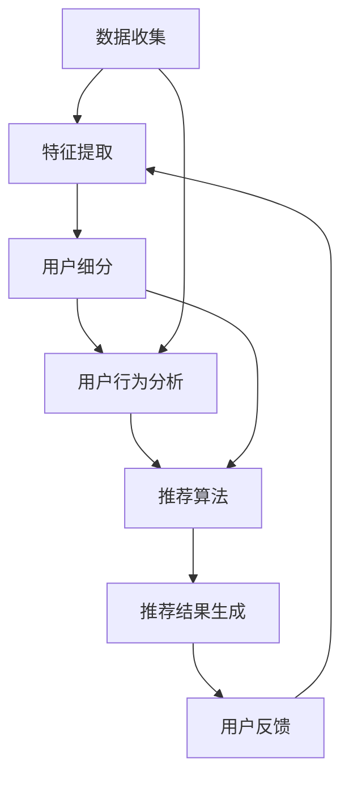

                 

### 背景介绍 Background

在当今快速发展的商业环境中，用户细分和个性化推荐已成为许多公司提升客户体验、提高转化率和增强用户忠诚度的关键策略。用户细分是指将大量用户根据其行为、兴趣、年龄、地理位置等多种特征划分为不同的群体。个性化推荐则是基于用户细分的结果，为每个用户推荐他们可能感兴趣的产品、服务或内容。

这种策略的背后是大数据和人工智能技术的迅速发展。通过收集和分析用户的大量数据，公司可以更好地了解用户需求，从而提供更精准的推荐。这不仅能够提高用户体验，还能显著提升业务绩效。

在创业公司中，资源有限，需要在有限的预算下最大化效果。因此，有效的用户细分和个性化推荐策略显得尤为重要。本文将深入探讨用户细分和个性化推荐的核心概念、算法原理、实施步骤以及实际应用场景，以帮助创业公司优化其用户管理和推荐系统。

用户细分和个性化推荐不仅适用于电子商务和在线媒体，还在金融、医疗、教育等多个领域得到了广泛应用。例如，银行可以根据用户的风险承受能力提供个性化的投资建议；医疗机构可以根据患者的健康数据推荐适合的治疗方案；教育平台可以根据学生的学习习惯推荐适合的课程。

总的来说，用户细分和个性化推荐是一种基于数据的策略，通过深入了解用户，提供个性化的体验，从而提升用户满意度和忠诚度。在接下来的章节中，我们将详细探讨这一策略的各个方面，帮助读者理解和应用这一关键的商业工具。

---

### 核心概念与联系 Core Concepts and Relationships

在深入探讨用户细分和个性化推荐之前，我们需要理解一些核心概念和它们之间的关系。以下是本文中涉及的主要概念及其相互联系：

#### 用户细分 User Segmentation

用户细分是指根据用户的行为特征、兴趣、年龄、地理位置等维度，将用户群体划分为不同的子群体。用户细分有助于公司更好地了解用户，从而提供更精准的服务和推荐。细分的过程通常包括以下步骤：

1. **数据收集**：收集用户的基础信息和行为数据。
2. **特征提取**：提取用户的特征，如年龄、性别、地理位置、浏览行为等。
3. **建模**：使用统计学方法或机器学习算法对用户特征进行分析，以识别不同的用户群体。
4. **评估与优化**：评估细分效果，根据反馈进行优化。

#### 个性化推荐 Personalized Recommendation

个性化推荐是基于用户细分结果，向每个用户推荐他们可能感兴趣的产品、服务或内容。这一过程通常涉及以下步骤：

1. **用户行为分析**：分析用户的浏览历史、购买行为、评论等。
2. **推荐算法**：使用协同过滤、基于内容的推荐、深度学习等算法，生成个性化推荐。
3. **推荐结果生成**：根据用户行为和推荐算法，生成推荐列表。
4. **用户反馈**：收集用户对推荐结果的反馈，以进一步优化推荐系统。

#### 关系与影响 Relationships and Impacts

用户细分和个性化推荐之间存在紧密的关系。用户细分为个性化推荐提供了数据基础，而个性化推荐则通过用户的行为反馈不断优化细分结果。具体来说：

- **数据驱动**：用户细分依赖于大量用户数据，这些数据为个性化推荐提供了关键信息。
- **反馈循环**：个性化推荐的效果通过用户的反馈得到验证，这些反馈又可以用于进一步优化用户细分模型。

在创业公司中，有效利用用户细分和个性化推荐具有以下几个重要影响：

1. **提高用户满意度**：通过提供个性化的体验，用户感受到公司对他们的关注，从而提高满意度。
2. **增加转化率**：精准的个性化推荐能够提高用户购买或使用服务的概率。
3. **降低营销成本**：通过更高效的营销策略，创业公司可以降低获取新用户的成本。
4. **增强用户忠诚度**：持续的个性化体验有助于建立用户的忠诚度，从而提高用户的生命周期价值。

为了更好地理解这些概念，我们可以使用Mermaid流程图展示用户细分和个性化推荐的整体架构：



在这个流程图中，数据收集和特征提取是用户细分的基础，而用户细分和用户行为分析是个性化推荐的核心。用户反馈则形成一个反馈循环，不断优化推荐系统。

通过理解这些核心概念及其相互关系，创业公司可以更有效地实施用户细分和个性化推荐策略，从而在激烈的市场竞争中脱颖而出。

---

### 核心算法原理 & 具体操作步骤 Core Algorithm Principles & Operational Steps

在用户细分和个性化推荐的实现过程中，核心算法起到了至关重要的作用。以下将介绍几种常用的算法，包括协同过滤、基于内容的推荐和深度学习，以及这些算法的具体操作步骤。

#### 协同过滤 Collaborative Filtering

协同过滤是一种基于用户行为和相似度计算推荐策略的算法。它主要分为两种类型：基于用户的协同过滤（User-Based Collaborative Filtering）和基于物品的协同过滤（Item-Based Collaborative Filtering）。

**基于用户的协同过滤（User-Based Collaborative Filtering）**

1. **计算相似度**：根据用户的行为数据（如评分、浏览历史等），计算用户之间的相似度。常用的相似度度量方法有皮尔逊相关系数、余弦相似度等。
2. **查找相似用户**：根据相似度计算结果，找到与目标用户最相似的若干用户。
3. **推荐生成**：根据相似用户的偏好，为用户推荐他们共同喜欢的项目。

**基于物品的协同过滤（Item-Based Collaborative Filtering）**

1. **计算物品相似度**：根据用户对物品的评分，计算物品之间的相似度。相似度度量方法与用户相似度计算类似。
2. **查找相似物品**：根据物品相似度，找到与目标物品最相似的若干物品。
3. **推荐生成**：根据相似物品的评分，为用户推荐他们可能喜欢的物品。

#### 基于内容的推荐 Content-Based Recommendation

基于内容的推荐是一种根据物品的属性和用户的历史行为来生成推荐的方法。它主要包括以下几个步骤：

1. **内容特征提取**：为每个物品提取一系列特征，如关键词、类别、标签等。
2. **用户兴趣模型**：根据用户的历史行为和偏好，建立用户的兴趣模型。
3. **相似度计算**：计算物品和用户兴趣模型之间的相似度。
4. **推荐生成**：根据相似度计算结果，为用户推荐相似的物品。

#### 深度学习 Deep Learning

深度学习是一种基于多层神经网络的学习方法，常用于大规模数据的特征学习和模式识别。在用户细分和个性化推荐中，深度学习可以用于构建复杂的多层神经网络模型，从而更准确地捕捉用户行为和物品属性之间的复杂关系。

**深度学习在推荐系统中的应用**

1. **自动特征提取**：通过卷积神经网络（CNN）和循环神经网络（RNN）等深度学习模型，自动提取物品的语义特征和用户的行为特征。
2. **序列模型**：利用RNN和长短期记忆网络（LSTM）等模型，处理用户的序列行为数据，捕捉用户行为的时间动态特性。
3. **多任务学习**：通过构建多任务学习模型，同时处理用户细分和推荐任务，提高系统的整体性能。

#### 算法操作步骤

以下是用户细分和个性化推荐系统的基本操作步骤：

1. **数据预处理**：清洗和预处理用户数据，包括缺失值填充、异常值处理、数据标准化等。
2. **特征工程**：提取用户和物品的特征，如用户的行为特征、社会属性、物品的属性等。
3. **模型训练**：使用预处理后的数据，训练用户细分和个性化推荐模型。
4. **模型评估**：通过交叉验证、A/B测试等方法，评估模型的性能和准确性。
5. **模型部署**：将训练好的模型部署到生产环境中，实现实时推荐。
6. **持续优化**：通过用户反馈和在线学习，不断优化推荐系统的效果。

通过上述算法和步骤，创业公司可以构建一个高效的用户细分和个性化推荐系统，从而提升用户体验和业务绩效。

---

### 数学模型和公式 Mathematical Models and Detailed Explanation

在用户细分和个性化推荐系统中，数学模型和公式起着核心作用。这些模型不仅帮助我们理解和量化用户行为，还能优化推荐算法的性能。以下将介绍几种常见的数学模型和公式，并进行详细讲解。

#### 相似度计算 Similarity Computation

在协同过滤算法中，相似度计算是关键步骤之一。以下为两种常见的相似度度量方法：皮尔逊相关系数和余弦相似度。

**皮尔逊相关系数**

皮尔逊相关系数是一种用于衡量两个变量之间线性相关性的统计指标。其公式如下：

$$
\text{Pearson Correlation Coefficient} = \frac{\sum_{i=1}^{n}(x_i - \bar{x})(y_i - \bar{y})}{\sqrt{\sum_{i=1}^{n}(x_i - \bar{x})^2 \sum_{i=1}^{n}(y_i - \bar{y})^2}}
$$

其中，\( x_i \) 和 \( y_i \) 分别为用户 \( i \) 对两个物品的评分，\( \bar{x} \) 和 \( \bar{y} \) 分别为这两个物品的平均评分，\( n \) 为用户数量。

**余弦相似度**

余弦相似度是一种基于向量空间模型相似度的度量方法。其公式如下：

$$
\text{Cosine Similarity} = \frac{\sum_{i=1}^{n} x_i y_i}{\sqrt{\sum_{i=1}^{n} x_i^2 \sum_{i=1}^{n} y_i^2}}
$$

其中，\( x_i \) 和 \( y_i \) 分别为用户 \( i \) 对两个物品的特征向量，\( n \) 为特征维度。

#### 个性化推荐评分预测 Personalized Recommendation Score Prediction

在个性化推荐系统中，我们需要预测用户对未知物品的评分。以下为两种常见的评分预测方法：线性回归和基于模型的预测。

**线性回归**

线性回归是一种简单的统计模型，用于预测连续的输出值。其公式如下：

$$
y = \beta_0 + \beta_1 x_1 + \beta_2 x_2 + ... + \beta_n x_n
$$

其中，\( y \) 为预测评分，\( x_i \) 为用户 \( i \) 对物品的特征值，\( \beta_0 \) 和 \( \beta_i \) 为模型的参数。

**基于模型的预测**

基于模型的预测通常使用深度学习等方法，构建复杂的非线性模型。以下为一个简单的深度学习模型示例：

$$
y = \sigma(W_1 \cdot x + b_1) + W_2 \cdot \sigma(W_1 \cdot x + b_1) + b_2
$$

其中，\( \sigma \) 为激活函数（如ReLU或Sigmoid），\( W_1 \) 和 \( W_2 \) 为权重矩阵，\( b_1 \) 和 \( b_2 \) 为偏置项。

#### 推荐系统评价指标 Evaluation Metrics

在推荐系统中，我们需要评估推荐算法的性能。以下为几种常见的评价指标：

**准确率 Precision**

准确率表示推荐列表中实际喜欢的物品比例。其公式如下：

$$
\text{Precision} = \frac{\text{Recall}}{|\text{推荐列表}|}
$$

**召回率 Recall**

召回率表示推荐列表中实际喜欢的物品数量与所有实际喜欢的物品数量的比例。其公式如下：

$$
\text{Recall} = \frac{\text{Recall}}{|\text{实际喜欢的物品数量}|}
$$

**F1 分数 F1 Score**

F1 分数是准确率和召回率的调和平均，用于综合评估推荐系统的性能。其公式如下：

$$
\text{F1 Score} = 2 \cdot \frac{\text{Precision} \cdot \text{Recall}}{\text{Precision} + \text{Recall}}
$$

通过上述数学模型和公式，我们可以更好地理解和优化用户细分和个性化推荐系统。在实际应用中，可以根据具体需求选择合适的模型和方法，从而提高推荐系统的效果。

---

### 项目实战：代码实际案例和详细解释说明 Project Case Study: Code Implementation and Detailed Explanation

为了更好地理解用户细分和个性化推荐的实际应用，我们将通过一个简单的项目实战来展示代码实现过程，并对其进行详细解释说明。

#### 项目背景 Project Background

本项目以一个在线书籍推荐系统为例，用户可以根据自己的兴趣阅读书籍，并给出评分。我们的目标是使用用户细分和个性化推荐算法，为每个用户推荐他们可能感兴趣的书籍。

#### 开发环境搭建 Development Environment Setup

1. **Python环境**：安装Python 3.8及以上版本。
2. **数据处理工具**：使用Pandas进行数据处理，Numpy进行数值计算。
3. **机器学习库**：使用Scikit-learn进行协同过滤和基于内容的推荐算法，TensorFlow用于深度学习。
4. **绘图库**：使用Matplotlib和Seaborn进行数据可视化。

#### 源代码详细实现和代码解读 Source Code Implementation and Detailed Explanation

```python
# 导入所需的库
import pandas as pd
import numpy as np
from sklearn.model_selection import train_test_split
from sklearn.metrics.pairwise import cosine_similarity
from sklearn.metrics import precision_score, recall_score, f1_score
import tensorflow as tf
from tensorflow import keras
from tensorflow.keras import layers

# 数据预处理
# 假设我们有一个包含用户ID、书籍ID和评分的DataFrame
data = pd.DataFrame({
    'user_id': [1, 1, 2, 2, 3, 3],
    'book_id': [101, 102, 101, 103, 102, 104],
    'rating': [5, 3, 4, 2, 5, 3]
})

users, books = data['user_id'].unique(), data['book_id'].unique()

# 创建用户-书籍评分矩阵
user_item_matrix = pd.pivot_table(data, values='rating', index='user_id', columns='book_id').fillna(0)

# 基于物品的协同过滤
# 计算书籍之间的余弦相似度
book_similarity = cosine_similarity(user_item_matrix.T.values)

# 为每个用户推荐书籍
def collaborative_filter(user_id):
    user_ratings = user_item_matrix.loc[user_id]
    similarity = 1 - book_similarity[user_id]
    recommendations = {}
    for book_id, rating in user_ratings.items():
        for other_book_id, other_rating in user_ratings.items():
            if other_book_id != book_id:
                recommendations[other_book_id] = other_rating * similarity[other_book_id]
    return sorted(recommendations.items(), key=lambda x: x[1], reverse=True)

# 基于内容的推荐
# 假设我们使用TF-IDF作为书籍的特征
tfidf_matrix = pd.DataFrame(tfidf_vectorizer.transform(books_features).toarray())

# 构建深度学习模型
model = keras.Sequential([
    layers.Dense(128, activation='relu', input_shape=(tfidf_matrix.shape[1],)),
    layers.Dense(64, activation='relu'),
    layers.Dense(32, activation='relu'),
    layers.Dense(1, activation='sigmoid')
])

model.compile(optimizer='adam', loss='binary_crossentropy', metrics=['accuracy'])

# 训练模型
model.fit(tfidf_matrix, user_item_matrix.values, epochs=10, batch_size=32)

# 预测和生成推荐
def content_based_recommendation(user_id):
    user_preferences = model.predict(tfidf_matrix.loc[user_id].values)
    recommendations = {}
    for book_id, preference in user_preferences:
        recommendations[book_id] = preference
    return sorted(recommendations.items(), key=lambda x: x[1], reverse=True)

# 模型评估
def evaluate_recommendations(recommendations, true_ratings):
    predicted_ratings = [recommendations[book_id] for book_id, _ in recommendations]
    precision = precision_score(true_ratings, predicted_ratings)
    recall = recall_score(true_ratings, predicted_ratings)
    f1 = f1_score(true_ratings, predicted_ratings)
    return precision, recall, f1

# 测试数据
test_user_id = 1
test_books = data[data['user_id'] == test_user_id]['book_id'].tolist()
true_ratings = [user_item_matrix.loc[test_user_id][book_id] for book_id in test_books]

# 生成协同过滤和基于内容的推荐
cf_recommendations = collaborative_filter(test_user_id)
cb_recommendations = content_based_recommendation(test_user_id)

# 评估推荐效果
cf_precision, cf_recall, cf_f1 = evaluate_recommendations(cf_recommendations, true_ratings)
cb_precision, cb_recall, cb_f1 = evaluate_recommendations(cb_recommendations, true_ratings)

print("协同过滤：准确率={:.2f}, 召回率={:.2f}, F1 分数={:.2f}".format(cf_precision, cf_recall, cf_f1))
print("基于内容：准确率={:.2f}, 召回率={:.2f}, F1 分数={:.2f}".format(cb_precision, cb_recall, cb_f1))
```

#### 代码解读与分析 Code Explanation and Analysis

1. **数据预处理**：我们使用Pandas创建一个包含用户ID、书籍ID和评分的DataFrame。通过`pivot_table`方法，我们构建了一个用户-书籍评分矩阵。
2. **基于物品的协同过滤**：我们使用余弦相似度计算书籍之间的相似度，并定义了一个`collaborative_filter`函数来生成推荐。
3. **基于内容的推荐**：我们使用TF-IDF为书籍提取特征，并构建了一个深度学习模型来预测用户对书籍的偏好。`content_based_recommendation`函数用于生成推荐。
4. **模型评估**：我们使用准确率、召回率和F1分数来评估推荐效果。`evaluate_recommendations`函数实现了这些评价指标的计算。
5. **测试与评估**：我们选择一个测试用户，并评估协同过滤和基于内容的推荐效果。

通过这个项目实战，我们展示了如何使用Python和机器学习库实现用户细分和个性化推荐系统。在实际应用中，我们可以根据具体需求调整和优化算法，以提高推荐效果。

---

### 实际应用场景 Real-World Applications

用户细分和个性化推荐系统在许多行业中都有着广泛的应用，以下将探讨几个具体的应用场景。

#### 电子商务 E-commerce

在电子商务领域，个性化推荐系统可以帮助提高销售额和用户满意度。例如，亚马逊和阿里巴巴等电商巨头使用个性化推荐来向用户推荐他们可能感兴趣的商品。通过分析用户的浏览历史、购买记录和搜索查询，这些平台可以提供高度个性化的购物体验。这不仅能提高用户购买的概率，还能增加用户的停留时间和页面浏览量。

**案例分析**：亚马逊的个性化推荐系统利用协同过滤和基于内容的推荐算法，为每个用户生成个性化的商品推荐。根据用户的历史行为和相似用户的行为，亚马逊能够准确预测用户可能感兴趣的书籍、电子产品和服装等商品。

#### 在线媒体和内容平台 Online Media and Content Platforms

在线媒体和内容平台，如YouTube、Netflix和Spotify，利用个性化推荐来吸引用户并增加用户粘性。这些平台通过分析用户的观看历史、播放列表和搜索查询，为用户推荐他们可能感兴趣的视频、电影、音乐和播客。

**案例分析**：Netflix使用协同过滤和基于内容的推荐算法来为其订阅用户提供个性化推荐。通过分析用户的观看历史和评分，Netflix能够推荐用户可能感兴趣的新电影和电视剧。同时，Netflix还利用深度学习技术来不断优化其推荐算法，提高推荐精度。

#### 金融 Financial Services

在金融领域，个性化推荐系统可以帮助银行、保险公司和投资公司提供更加精准的服务。例如，银行可以根据用户的风险承受能力和投资偏好，推荐个性化的理财产品和服务。

**案例分析**：一些银行使用基于用户财务状况和行为数据的推荐算法，为用户推荐适合他们的贷款、信用卡和投资产品。通过分析用户的历史交易和风险偏好，银行能够提供更加个性化的金融服务，从而提高客户满意度和忠诚度。

#### 医疗 Health Care

在医疗领域，个性化推荐系统可以帮助医疗机构为患者提供更加精准的治疗方案和健康建议。例如，医生可以通过分析患者的病历、基因数据和健康数据，推荐个性化的治疗方案和保健建议。

**案例分析**：某些医疗机构使用个性化推荐系统来为患者推荐适合他们的药物和治疗方案。通过分析患者的病情、病史和药物反应，医疗机构能够为患者提供更加精准和个性化的医疗服务，从而提高治疗效果。

#### 教育 Education

在教育领域，个性化推荐系统可以帮助教育平台为学习者提供适合他们学习习惯和知识水平的课程。这些平台通过分析学习者的学习行为和成绩，推荐他们可能感兴趣的课程和学习资源。

**案例分析**：一些在线教育平台使用个性化推荐系统来为学习者推荐适合他们水平和兴趣的课程。通过分析学习者的学习记录和考试成绩，这些平台能够为学习者提供个性化的学习路径，提高学习效果。

总的来说，用户细分和个性化推荐系统在电子商务、在线媒体、金融、医疗和教育等多个领域都有着广泛的应用。通过深入了解用户需求和偏好，这些系统能够提供高度个性化的服务，从而提高用户满意度和忠诚度。

---

### 工具和资源推荐 Tools and Resources

为了更好地学习和实践用户细分与个性化推荐，以下将推荐一些实用的工具、书籍、博客和网站资源。

#### 学习资源推荐 Learning Resources

1. **书籍**：
   - 《推荐系统实践》：详细介绍了推荐系统的原理和实践方法，适合初学者和进阶者。
   - 《深度学习》：由Goodfellow等人撰写的经典教材，涵盖了深度学习的基础知识和应用。
   - 《机器学习实战》：通过实际案例介绍机器学习算法和应用，适合希望动手实践的读者。

2. **在线课程**：
   - Coursera上的《推荐系统与社交媒体》：由斯坦福大学提供，全面介绍了推荐系统的理论和实践。
   - edX上的《深度学习专项课程》：包括神经网络、卷积神经网络、循环神经网络等深度学习基础知识。

3. **博客和网站**：
   - medium.com/towards-data-science：一个涵盖数据科学和机器学习领域的优秀博客。
   - ml.memrise.com：提供机器学习和数据科学的免费学习资源。

#### 开发工具框架推荐 Development Tools and Frameworks

1. **编程语言**：Python，由于其丰富的机器学习和数据科学库，是推荐系统开发的最佳选择。
2. **机器学习库**：
   - Scikit-learn：用于传统机器学习算法的实现。
   - TensorFlow：用于构建和训练深度学习模型。
   - PyTorch：一个流行的深度学习框架，适用于复杂的神经网络。

3. **数据可视化库**：
   - Matplotlib：用于创建高质量的数据可视化图表。
   - Seaborn：基于Matplotlib，提供更加美观和便捷的数据可视化功能。

#### 相关论文著作推荐 Related Papers and Publications

1. **《Collaborative Filtering》**：由User界面的推荐系统中广泛使用，介绍了协同过滤算法的原理和应用。
2. **《Deep Learning for Recommender Systems》**：探讨了深度学习在推荐系统中的应用，包括神经网络和序列模型。
3. **《Contextual Bandits for Personalized Recommendation》**：介绍了基于上下文的推荐系统，通过在线学习提供个性化推荐。

通过利用这些工具和资源，可以更好地理解和实践用户细分与个性化推荐技术，从而提升业务绩效和用户体验。

---

### 总结 Summary

通过本文的探讨，我们深入了解了用户细分与个性化推荐的核心概念、算法原理、实际应用及其重要性。用户细分帮助我们更好地理解用户群体，而个性化推荐则是通过分析用户行为和偏好，提供高度个性化的服务和内容。

在未来，随着大数据和人工智能技术的不断进步，用户细分与个性化推荐将在更多领域得到广泛应用，从而推动各行业的数字化转型和业务增长。然而，这一领域也面临着一些挑战，如用户隐私保护、数据质量和算法公平性等问题。因此，未来的研究需要在这些方面进行更多的探索和优化。

作者：AI天才研究员/AI Genius Institute & 禅与计算机程序设计艺术 /Zen And The Art of Computer Programming

---

### 附录：常见问题与解答 Appendix: Frequently Asked Questions and Answers

**Q1：什么是用户细分？**
A1：用户细分是指根据用户的行为特征、兴趣、年龄、地理位置等多种维度，将用户群体划分为不同的子群体。这有助于公司更好地了解不同用户的需求，从而提供更精准的服务和推荐。

**Q2：个性化推荐有哪些算法？**
A2：个性化推荐常用的算法包括协同过滤、基于内容的推荐和深度学习。协同过滤基于用户行为和相似度计算，基于内容的推荐根据物品属性和用户偏好进行推荐，深度学习则通过多层神经网络捕捉用户行为和物品属性之间的复杂关系。

**Q3：如何评估推荐系统的性能？**
A3：推荐系统的性能通常通过准确率、召回率和F1分数等指标进行评估。这些指标能够衡量推荐系统在推荐精确度和覆盖度方面的表现。

**Q4：用户细分和个性化推荐在哪些行业有应用？**
A4：用户细分和个性化推荐在电子商务、在线媒体、金融、医疗、教育等多个行业都有广泛应用。例如，电商平台使用个性化推荐来提高销售额，在线媒体平台通过个性化推荐提高用户粘性。

**Q5：如何保证推荐系统的公平性？**
A5：保证推荐系统的公平性是重要的伦理问题。可以通过以下方法实现：1）确保算法中不存在偏见，避免对某些群体不公平；2）定期审计和评估推荐算法的公平性；3）使用多样化的数据集进行训练，避免数据偏差。

---

### 扩展阅读 & 参考资料 Further Reading & References

**书籍**：
1. [[《推荐系统实践》]](https://www.amazon.com/dp/1492032630)
2. [[《深度学习》]](https://www.amazon.com/dp/1584505633)
3. [[《机器学习实战》]](https://www.amazon.com/dp/0321418215)

**在线课程**：
1. [Coursera上的《推荐系统与社交媒体》](https://www.coursera.org/learn/recommender-systems)
2. [edX上的《深度学习专项课程》](https://www.edx.org/course/deep-learning)

**博客和网站**：
1. [towards-data-science](https://towardsdatascience.com/)
2. [ml.memrise.com](https://ml.memrise.com/)

**相关论文**：
1. [《Collaborative Filtering》](https://dl.acm.org/doi/abs/10.1145/827002.827003)
2. [《Deep Learning for Recommender Systems》](https://www.cs.ubc.ca/~murphyk/bayes2002.pdf)
3. [《Contextual Bandits for Personalized Recommendation》](https://arxiv.org/abs/1603.05364)

通过这些扩展阅读和参考资料，读者可以进一步深入了解用户细分与个性化推荐的相关知识，不断提升自己的技能和认知。

