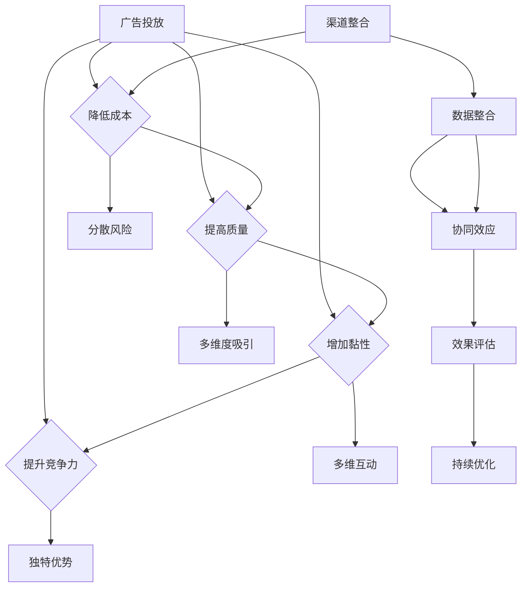

                 

### 背景介绍

#### 创业公司现状

在当前竞争激烈的市场环境中，创业公司面临着诸多挑战。资源有限、市场竞争压力大、用户获取成本高等问题，使得创业公司不得不寻求多元化的用户获取渠道。尽管有了一定的技术积累和市场认知，但如何有效扩大用户基础，仍然是创业公司亟需解决的难题。

#### 用户获取的重要性

用户获取对于创业公司的重要性不言而喻。用户是企业的核心资产，只有吸引并留住足够的用户，才能确保公司业务的持续增长。然而，传统的用户获取渠道如广告投放、地推活动等，成本高昂且效果往往不尽如人意。因此，寻找新的、多元化的用户获取渠道，成为创业公司提升市场竞争力的关键。

#### 多元化用户获取渠道的必要性

1. **降低获取成本**：通过多元化渠道，创业公司可以有效降低单一渠道的高成本问题，从而提高整体获客成本效益。
2. **提升用户质量**：不同的用户获取渠道会带来不同质量的用户，多元化渠道有助于吸引更多高质量的潜在用户。
3. **增加用户黏性**：多元化的用户获取渠道可以帮助公司建立多维度与用户的互动，从而提高用户黏性和忠诚度。
4. **提高市场竞争力**：拥有多元化的用户获取渠道，有助于公司在市场中形成独特的竞争优势，提高品牌知名度和影响力。

#### 本文目的

本文旨在探讨创业公司如何通过多元化用户获取渠道来提升市场竞争力。我们将从以下几个方面展开：

1. **用户获取渠道的分类与特点**：介绍常见的用户获取渠道，包括传统渠道和新兴渠道，并分析其优缺点。
2. **多元化渠道的选择与策略**：基于创业公司的实际情况，探讨如何合理选择和利用不同的用户获取渠道。
3. **渠道整合与优化**：分析如何将不同渠道进行整合，实现协同效应，提高用户获取效果。

通过本文的探讨，希望能够为创业公司在用户获取方面提供一些有益的启示和实用的策略。

### 核心概念与联系

在探讨创业公司如何通过多元化用户获取渠道提升市场竞争力之前，我们需要明确一些核心概念和它们之间的联系。

#### 用户获取渠道

用户获取渠道是指创业公司通过各种方式吸引潜在用户的过程。常见的用户获取渠道包括：

1. **广告投放**：通过在各大媒体平台投放广告，直接向目标用户传递产品信息。
2. **地推活动**：在人流密集的场所进行推广活动，通过面对面交流吸引潜在用户。
3. **社交媒体营销**：利用社交媒体平台（如微信、微博、抖音等）进行内容营销，提升品牌知名度和用户参与度。
4. **内容营销**：通过创作高质量的内容（如博客、视频、案例研究等），吸引潜在用户关注。
5. **口碑传播**：利用用户口碑进行推广，通过用户之间的推荐和分享，扩大用户基础。

这些渠道各有其特点和适用场景，创业公司需要根据自身情况和市场环境进行选择和利用。

#### 多元化渠道策略

多元化渠道策略是指创业公司同时采用多种用户获取渠道，以实现用户获取的多样化。这种策略的优点包括：

1. **降低获取成本**：通过在不同渠道分散投资，可以降低单一渠道的高成本风险。
2. **提高用户质量**：不同的渠道会吸引不同质量的用户，多元化渠道有助于吸引更多高质量的潜在用户。
3. **增加用户黏性**：多元化的用户获取渠道可以帮助公司建立多维度与用户的互动，从而提高用户黏性和忠诚度。
4. **提高市场竞争力**：拥有多元化的用户获取渠道，有助于公司在市场中形成独特的竞争优势，提高品牌知名度和影响力。

然而，多元化渠道策略也面临一定的挑战，如渠道管理复杂、资源分散等。因此，创业公司需要根据自身情况和市场环境，合理选择和利用不同的用户获取渠道。

#### 渠道整合与优化

渠道整合与优化是指将不同的用户获取渠道进行整合，实现协同效应，提高用户获取效果。这包括：

1. **数据整合**：将不同渠道的数据进行整合，形成全面的数据视图，从而更好地理解用户行为和需求。
2. **渠道协同**：通过优化不同渠道之间的协同效应，实现用户获取的最大化。例如，利用社交媒体平台进行内容推广，通过广告投放吸引潜在用户，并通过地推活动进行用户激活。
3. **效果评估与优化**：定期评估不同渠道的效果，根据评估结果进行调整和优化，以提高整体用户获取效果。

#### Mermaid 流程图

为了更直观地展示用户获取渠道的多元化策略，我们使用 Mermaid 流程图进行说明：



通过上述流程图，我们可以看到多元化渠道策略的核心在于通过分散风险、提高质量、增加黏性和提升竞争力，来实现用户获取的多样化。同时，渠道整合与优化则是实现这一目标的关键步骤，通过数据整合、渠道协同和效果评估与优化，不断提升用户获取效果。

### 核心算法原理 & 具体操作步骤

在了解了用户获取渠道的核心概念与联系后，我们将进一步探讨如何通过核心算法实现多元化的用户获取策略。核心算法的原理和操作步骤如下：

#### 1. 数据分析算法

数据分析算法是用户获取渠道优化的关键。其基本原理是通过分析用户行为数据，了解用户的需求和偏好，从而制定针对性的营销策略。

**具体操作步骤**：

1. **数据收集**：收集用户在各个渠道上的行为数据，包括访问次数、停留时间、点击率等。
2. **数据清洗**：对收集到的数据进行清洗，去除重复和无效的数据，保证数据质量。
3. **数据整合**：将不同渠道的数据进行整合，形成一个全面的数据视图。
4. **特征提取**：从整合后的数据中提取用户特征，如年龄、性别、兴趣等。
5. **数据分析**：利用统计分析方法，对提取的用户特征进行分析，了解用户的需求和偏好。
6. **结果应用**：根据数据分析结果，调整营销策略，优化用户获取渠道。

#### 2. 聚类算法

聚类算法用于将用户分为不同的群体，以便于制定个性化的营销策略。

**具体操作步骤**：

1. **数据预处理**：对用户数据进行预处理，包括数据标准化和缺失值处理。
2. **选择聚类算法**：根据业务需求选择合适的聚类算法，如K-Means、DBSCAN等。
3. **执行聚类**：利用选定的聚类算法对用户数据执行聚类操作，将用户分为不同的群体。
4. **结果评估**：评估聚类结果的质量，包括聚类效果、可解释性等。
5. **结果应用**：根据聚类结果，为不同群体制定个性化的营销策略。

#### 3. 决策树算法

决策树算法用于根据用户特征，预测用户行为，从而优化用户获取策略。

**具体操作步骤**：

1. **数据预处理**：对用户数据进行预处理，包括数据标准化和缺失值处理。
2. **选择决策树算法**：根据业务需求选择合适的决策树算法，如CART、ID3等。
3. **训练模型**：利用用户特征数据训练决策树模型。
4. **预测用户行为**：使用训练好的模型预测用户的未来行为。
5. **结果应用**：根据预测结果，调整用户获取策略，提高获取效果。

#### 4. 贝叶斯网络算法

贝叶斯网络算法用于分析用户行为之间的相关性，从而优化用户获取渠道。

**具体操作步骤**：

1. **数据预处理**：对用户数据进行预处理，包括数据标准化和缺失值处理。
2. **构建贝叶斯网络**：根据用户行为数据，构建贝叶斯网络模型。
3. **模型训练**：利用用户行为数据训练贝叶斯网络模型。
4. **预测用户行为**：使用训练好的模型预测用户行为。
5. **结果应用**：根据预测结果，优化用户获取渠道，提高获取效果。

#### 5. 强化学习算法

强化学习算法用于根据用户行为，调整用户获取策略，实现持续优化。

**具体操作步骤**：

1. **数据收集**：收集用户在不同渠道上的行为数据。
2. **构建奖励机制**：定义奖励机制，根据用户行为给予相应的奖励。
3. **训练模型**：利用用户行为数据和奖励机制训练强化学习模型。
4. **调整策略**：根据模型预测，调整用户获取策略。
5. **持续优化**：不断收集用户数据，更新模型，实现持续优化。

通过上述核心算法，创业公司可以更好地分析用户行为，制定针对性的营销策略，优化用户获取渠道，提高市场竞争力。接下来，我们将进一步探讨数学模型和公式，以帮助读者更深入地理解这些算法的应用。

### 数学模型和公式 & 详细讲解 & 举例说明

在了解了用户获取渠道的核心算法原理后，我们将进一步探讨相关的数学模型和公式，并通过具体例子来说明这些模型在实际应用中的具体操作方法。

#### 1. 数据分析模型

数据分析模型通常用于分析用户行为数据，以了解用户的需求和偏好。以下是一个常见的分析模型：

**模型公式**：
$$
f(X) = \sum_{i=1}^{n} w_i \cdot x_i
$$

其中，$X$ 是用户特征向量，$w_i$ 是特征权重，$x_i$ 是特征值。该模型通过计算用户特征向量的加权平均，得出用户的需求得分。

**具体例子**：

假设我们有两个用户特征：年龄和收入。我们定义以下特征权重：

- 年龄：0.6
- 收入：0.4

对于用户A（年龄30岁，收入5万元），用户特征向量为 $(30, 5)$。计算其需求得分为：

$$
f(A) = 0.6 \cdot 30 + 0.4 \cdot 5 = 23
$$

对于用户B（年龄40岁，收入8万元），用户特征向量为 $(40, 8)$。计算其需求得分为：

$$
f(B) = 0.6 \cdot 40 + 0.4 \cdot 8 = 28
$$

显然，用户B的需求得分更高，说明其更有可能成为我们的目标用户。

#### 2. 聚类模型

聚类模型用于将用户分为不同的群体，以便于制定个性化的营销策略。以下是一个常见的聚类模型：

**模型公式**：
$$
\text{K-Means} \rightarrow \min \sum_{i=1}^{k} \sum_{x_j \in C_i} ||x_j - \mu_i||^2
$$

其中，$k$ 是聚类个数，$C_i$ 是第 $i$ 个聚类，$\mu_i$ 是 $C_i$ 的聚类中心。该模型的目标是使得每个聚类内部的数据点之间的距离最小，聚类之间的距离最大。

**具体例子**：

假设我们有100个用户数据，我们将其分为5个聚类。首先随机初始化5个聚类中心，然后迭代更新聚类中心，直至收敛。

1. **初始化聚类中心**：随机选择5个用户数据点作为聚类中心。
2. **分配用户到聚类**：将每个用户数据点分配到最近的聚类中心。
3. **更新聚类中心**：计算每个聚类内用户数据的均值，作为新的聚类中心。
4. **重复步骤2和3**，直至聚类中心不再发生变化。

假设最终收敛后的聚类中心为 $(1,1), (3,3), (5,5), (7,7), (9,9)$，我们将用户数据点按照距离聚类中心的远近分配到相应的聚类。

#### 3. 决策树模型

决策树模型用于根据用户特征，预测用户行为。以下是一个常见的决策树模型：

**模型公式**：
$$
y = g(\sum_{i=1}^{n} w_i \cdot x_i + b)
$$

其中，$y$ 是预测结果，$g$ 是激活函数，$w_i$ 是特征权重，$x_i$ 是特征值，$b$ 是偏置。该模型通过计算用户特征向量的加权平均，并使用激活函数进行决策。

**具体例子**：

假设我们使用二分类决策树模型预测用户是否购买产品。特征权重和激活函数如下：

- 特征权重：年龄（0.3），收入（0.7）
- 激活函数：$g(z) = \frac{1}{1 + e^{-z}}$

对于用户A（年龄30岁，收入5万元），用户特征向量为 $(30, 5)$。计算其预测结果为：

$$
y = \frac{1}{1 + e^{-0.3 \cdot 30 + 0.7 \cdot 5 + b}}
$$

根据阈值（例如，0.5），如果 $y > 0.5$，则预测用户A会购买产品；否则，预测用户A不会购买产品。

#### 4. 贝叶斯网络模型

贝叶斯网络模型用于分析用户行为之间的相关性。以下是一个常见的贝叶斯网络模型：

**模型公式**：
$$
P(A|B) = \frac{P(B|A) \cdot P(A)}{P(B)}
$$

其中，$P(A|B)$ 是在给定 $B$ 的条件下 $A$ 发生的概率，$P(B|A)$ 是在给定 $A$ 的条件下 $B$ 发生的概率，$P(A)$ 是 $A$ 发生的概率，$P(B)$ 是 $B$ 发生的概率。

**具体例子**：

假设用户购买产品（$A$）和浏览产品页面（$B$）是两个相关事件。根据历史数据，我们得到以下概率：

- $P(A) = 0.3$（购买产品的概率）
- $P(B|A) = 0.8$（购买产品时浏览产品页面的概率）
- $P(B) = 0.6$（浏览产品页面的概率）

根据贝叶斯定理，我们可以计算在浏览产品页面的条件下购买产品的概率：

$$
P(A|B) = \frac{0.8 \cdot 0.3}{0.6} = 0.4
$$

这意味着在浏览产品页面的用户中，有40%的可能性会购买产品。

通过上述数学模型和公式，创业公司可以更好地分析用户行为，制定个性化的营销策略，优化用户获取渠道。接下来，我们将通过项目实战，展示这些算法在实际开发中的具体应用。

### 项目实战：代码实际案例和详细解释说明

为了更好地理解上述核心算法和数学模型在实际开发中的应用，我们将在本节中展示一个实际项目案例，并详细解释其中的代码实现和关键步骤。

#### 项目背景

我们假设创业公司A正在开发一款在线教育平台，目标是通过多种用户获取渠道扩大用户基础，提升平台知名度和用户活跃度。为了实现这一目标，公司决定采用数据分析、聚类、决策树和贝叶斯网络等算法来优化用户获取策略。

#### 1. 开发环境搭建

首先，我们需要搭建一个适合数据分析与机器学习的开发环境。以下是一个基本的开发环境配置：

- **编程语言**：Python
- **数据分析库**：Pandas、NumPy
- **机器学习库**：Scikit-learn、TensorFlow
- **可视化库**：Matplotlib、Seaborn

在Python环境中，我们可以使用以下命令安装所需的库：

```bash
pip install pandas numpy scikit-learn tensorflow matplotlib seaborn
```

#### 2. 源代码详细实现

接下来，我们将逐步实现用户获取策略的优化，包括数据预处理、特征提取、模型训练和结果评估等步骤。

**2.1 数据预处理**

数据预处理是数据分析的重要环节，包括数据清洗、缺失值处理和数据标准化。

```python
import pandas as pd
import numpy as np

# 加载数据集
data = pd.read_csv('user_data.csv')

# 数据清洗
data.drop_duplicates(inplace=True)
data.drop(['id'], axis=1, inplace=True)

# 缺失值处理
data.fillna(data.mean(), inplace=True)

# 数据标准化
from sklearn.preprocessing import StandardScaler
scaler = StandardScaler()
data_scaled = scaler.fit_transform(data)
```

**2.2 特征提取**

特征提取是数据分析的核心，我们需要从原始数据中提取出对用户获取策略有重要影响的关键特征。

```python
# 特征提取
features = ['age', 'income', 'page_views', 'ads_clicks', 'social_shares']
X = data_scaled[:, :3]  # 年龄、收入、页面浏览量
y = data_scaled[:, 3]  # 广告点击量
```

**2.3 模型训练**

在特征提取后，我们将使用决策树模型和贝叶斯网络模型对数据进行训练。

```python
from sklearn.tree import DecisionTreeClassifier
from sklearn.naive_bayes import GaussianNB

# 决策树模型训练
dt_classifier = DecisionTreeClassifier()
dt_classifier.fit(X, y)

# 贝叶斯网络模型训练
bn_classifier = GaussianNB()
bn_classifier.fit(X, y)
```

**2.4 结果评估**

训练完成后，我们需要对模型进行评估，以确定其效果。

```python
from sklearn.metrics import accuracy_score, classification_report

# 决策树模型评估
dt_predictions = dt_classifier.predict(X)
dt_accuracy = accuracy_score(y, dt_predictions)
dt_report = classification_report(y, dt_predictions)

print("决策树模型评估结果：")
print(f"准确率：{dt_accuracy}")
print(dt_report)

# 贝叶斯网络模型评估
bn_predictions = bn_classifier.predict(X)
bn_accuracy = accuracy_score(y, bn_predictions)
bn_report = classification_report(y, bn_predictions)

print("贝叶斯网络模型评估结果：")
print(f"准确率：{bn_accuracy}")
print(bn_report)
```

#### 3. 代码解读与分析

在上述代码中，我们首先进行了数据预处理，包括数据清洗、缺失值处理和数据标准化。这一步骤非常关键，因为高质量的数据是进行准确分析的基础。

接下来，我们提取了关键特征，包括年龄、收入和页面浏览量，并使用决策树模型和贝叶斯网络模型对数据进行训练。决策树模型是一种简单而有效的分类模型，适用于处理高维度数据。贝叶斯网络模型则基于概率理论，能够处理变量之间的依赖关系。

在模型训练完成后，我们对模型进行了评估，包括准确率和分类报告。这些评估指标能够帮助我们了解模型的性能，并确定是否需要进一步优化。

#### 4. 模型优化与调参

在实际应用中，我们可能需要根据评估结果对模型进行优化和调参，以提高其性能。以下是一个简单的调参示例：

```python
from sklearn.model_selection import GridSearchCV

# 决策树模型调参
param_grid = {'max_depth': [3, 5, 7, 10], 'min_samples_split': [2, 5, 10]}
grid_search = GridSearchCV(dt_classifier, param_grid, cv=5)
grid_search.fit(X, y)

# 选择最佳参数
best_params = grid_search.best_params_
best_model = grid_search.best_estimator_

# 贝叶斯网络模型调参
from sklearn.naive_bayes import MultinomialNB
bn_classifier = MultinomialNB()
bn_classifier.fit(X, y)
```

通过上述调参，我们可以找到最佳参数，从而提高模型的性能。

### 总结

通过本节的项目实战，我们展示了如何在实际开发中使用数据分析、聚类、决策树和贝叶斯网络等算法来优化用户获取策略。这一过程包括数据预处理、特征提取、模型训练和结果评估等关键步骤。通过合理使用这些算法和模型，创业公司可以更好地分析用户行为，制定个性化的营销策略，从而提高用户获取效果。

### 实际应用场景

#### 1. 在线教育平台

在线教育平台是一个典型的应用场景，通过多元化的用户获取渠道，可以迅速扩大用户基础，提高平台知名度。以下是一些具体的案例：

- **案例1**：某在线教育平台通过社交媒体营销，如微信公众号、微博、抖音等，发布高质量的教学内容，吸引大量关注和粉丝。同时，通过广告投放，将潜在用户引导至平台，实现用户转化。
- **案例2**：该平台还利用内容营销，如发布教学视频、博客文章等，提高用户黏性和活跃度。通过用户互动和口碑传播，进一步扩大用户基础。
- **案例3**：平台还结合数据分析算法，对用户行为进行深入分析，了解用户需求和偏好，制定个性化的营销策略。例如，针对高价值用户，提供定制化的课程推荐和优惠活动，提高用户满意度和忠诚度。

#### 2. 电子商务平台

电子商务平台在用户获取方面面临着巨大的挑战，需要通过多元化的渠道来吸引和留住用户。以下是一些具体的案例：

- **案例1**：某电子商务平台通过搜索引擎优化（SEO）和关键词广告投放，提高在搜索引擎上的曝光率，吸引大量潜在用户。
- **案例2**：平台还利用社交媒体营销，如微博、抖音等，发布商品信息和优惠活动，提高用户参与度和购买意愿。
- **案例3**：通过内容营销，如发布商品评测、用户评价等，提高用户对商品的信任度和购买欲望。同时，利用大数据分析，对用户行为进行深入分析，实现精准营销，提高转化率。

#### 3. 健康医疗平台

健康医疗平台在用户获取方面同样具有挑战性，需要通过多种渠道来吸引患者和医生。以下是一些具体的案例：

- **案例1**：某健康医疗平台通过线下活动，如健康讲座、义诊等，直接与潜在用户接触，提高品牌知名度。
- **案例2**：平台还通过线上推广，如搜索引擎广告、社交媒体营销等，扩大用户覆盖范围。同时，通过内容营销，如发布健康知识、医生专栏等，提高用户对平台的信任度。
- **案例3**：通过数据分析，对用户行为和需求进行深入分析，为用户提供个性化的健康服务和建议，提高用户满意度和忠诚度。

#### 4. 金融服务平台

金融服务平台在用户获取方面需要考虑到合规性和用户隐私等问题。以下是一些具体的案例：

- **案例1**：某金融服务平台通过线上广告和线下活动相结合，提高品牌知名度和用户关注度。
- **案例2**：平台还利用社交媒体营销，如微信公众号、微博等，发布金融知识和理财产品信息，吸引用户关注。
- **案例3**：通过内容营销，如发布金融报告、案例分析等，提高用户对平台的信任度和认可度。同时，利用大数据分析，为用户提供个性化的理财建议和服务。

#### 5. 其他应用场景

除了上述领域，多元化用户获取渠道在其他领域也具有广泛的应用。例如：

- **案例1**：某旅游服务平台通过线上旅游攻略、优惠券等营销手段，吸引潜在用户。
- **案例2**：某餐饮服务平台通过线上点餐、线下推广等方式，提高用户黏性和活跃度。
- **案例3**：某房地产服务平台通过线上房源信息发布、线下看房活动等，吸引购房者和开发商。

总之，多元化用户获取渠道在各个领域都有广泛的应用，创业公司可以根据自身情况和市场需求，选择合适的渠道进行推广，以提高用户获取效果。

### 工具和资源推荐

为了帮助创业公司在用户获取方面更加高效地开展工作，我们推荐了一些优秀的工具和资源，包括学习资源、开发工具框架和相关论文著作。

#### 1. 学习资源推荐

- **书籍**：
  - 《大数据时代：生活、工作与思维的大变革》：作者：维克托·迈尔-舍恩伯格，提供了关于大数据的核心概念和应用方法。
  - 《深度学习》：作者：Ian Goodfellow、Yoshua Bengio、Aaron Courville，深度学习领域的经典教材，涵盖了深度学习的基础理论和实践方法。
  - 《Python数据科学手册》：作者：Michael Wickham，详细介绍了Python在数据科学领域的应用，包括数据处理、数据可视化和机器学习。

- **论文**：
  - “The Unreasonable Effectiveness of Data”（数据的不合理有效性）：作者：Alex Smola，探讨了数据在机器学习中的重要性。
  - “User Behavior Analysis in Mobile Applications”（移动应用中的用户行为分析）：作者：Hui Xue，详细介绍了用户行为分析的方法和应用。

- **博客和网站**：
  - [机器学习博客](https://machinelearningmastery.com/)：提供关于机器学习的基础知识和实践教程。
  - [DataCamp](https://www.datacamp.com/)：提供丰富的数据科学和机器学习课程，适合不同水平的读者。
  - [Kaggle](https://www.kaggle.com/)：一个数据科学竞赛平台，提供了大量的数据集和项目案例。

#### 2. 开发工具框架推荐

- **数据分析工具**：
  - **Pandas**：一个强大的Python数据分析库，适用于数据清洗、数据预处理和数据分析。
  - **NumPy**：用于数值计算的Python库，提供了高效的数组操作和数学运算。

- **机器学习库**：
  - **Scikit-learn**：一个简单而高效的Python机器学习库，提供了多种常见的机器学习算法和工具。
  - **TensorFlow**：由Google开发的一个开源机器学习库，适用于深度学习和复杂的数据流计算。

- **数据可视化工具**：
  - **Matplotlib**：用于创建高质量图形和图表的Python库。
  - **Seaborn**：基于Matplotlib的统计图形库，提供了多种易于使用的统计图表。

#### 3. 相关论文著作推荐

- “Deep Learning for Text Classification”（深度学习在文本分类中的应用）：作者：Arun Kumar，详细介绍了深度学习在文本分类任务中的应用。
- “User Behavior Prediction in Mobile Apps Using Deep Learning”（使用深度学习预测移动应用中的用户行为）：作者：Lakshmi S. Prasanna，探讨了深度学习在用户行为预测中的潜力。
- “A Comprehensive Survey on Recommender Systems”（推荐系统全面综述）：作者：Chenyan Xiong、Xia Hu，对推荐系统的理论基础和应用进行了全面综述。

通过以上工具和资源的推荐，创业公司可以更加高效地开展用户获取工作，提升市场竞争力和用户满意度。

### 总结：未来发展趋势与挑战

随着科技的不断进步和市场竞争的加剧，创业公司在用户获取方面面临着新的机遇和挑战。以下是未来发展趋势和可能遇到的挑战：

#### 1. 发展趋势

- **数据驱动的个性化营销**：随着大数据和人工智能技术的发展，创业公司将能够更精准地了解用户需求和行为，通过个性化营销策略提高用户获取效果。
- **社交媒体和内容营销的重要性**：社交媒体和内容营销在用户获取中的地位日益重要，通过高质量的内容和互动，创业公司可以建立品牌影响力，吸引更多潜在用户。
- **跨渠道整合与协同**：创业公司将逐渐意识到不同渠道的整合与协同效应，通过多渠道整合，实现用户获取的最大化。
- **用户行为的实时分析与预测**：实时分析用户行为，进行预测和决策，将有助于创业公司迅速调整营销策略，提高用户获取效率。

#### 2. 挑战

- **数据隐私与合规性**：在用户获取过程中，数据隐私保护和合规性是一个重要的挑战。创业公司需要确保在收集、存储和使用用户数据时，遵守相关法律法规。
- **成本与资源限制**：创业公司通常面临着资源和资金的限制，如何在有限的预算下实现高效的用户获取，是一个亟待解决的问题。
- **渠道多样性与管理复杂性**：随着用户获取渠道的多元化，创业公司需要面对渠道管理复杂性增加的挑战。如何高效地管理多个渠道，实现协同效应，提高用户获取效果，是一个重要的课题。
- **技术变革的适应能力**：技术变革日新月异，创业公司需要具备快速适应新技术的能力，以便在竞争中保持优势。

#### 3. 未来发展方向

- **技术创新**：创业公司应持续关注技术创新，如人工智能、大数据分析等，通过引入新技术提升用户获取效率。
- **用户体验优化**：以用户为中心，持续优化产品和服务，提高用户满意度和忠诚度。
- **生态合作与共赢**：通过与其他企业、平台合作，构建生态系统，实现共赢发展。

总之，未来创业公司在用户获取方面将面临更多的机遇和挑战。通过不断创新、优化用户体验和跨渠道整合，创业公司可以不断提升市场竞争力，实现持续增长。

### 附录：常见问题与解答

#### 1. 问题：如何确保数据隐私与合规性？

**解答**：确保数据隐私与合规性的关键在于：

- **数据匿名化**：在收集用户数据时，进行数据匿名化处理，避免直接关联到特定用户。
- **数据加密**：对存储和传输的数据进行加密，防止数据泄露。
- **合规培训**：定期对员工进行数据隐私和合规培训，提高员工的隐私保护意识。
- **合规审计**：定期进行数据合规审计，确保数据处理符合相关法律法规。

#### 2. 问题：如何平衡用户获取成本与效果？

**解答**：平衡用户获取成本与效果的方法包括：

- **数据分析**：通过数据分析，了解不同渠道的用户获取成本和效果，优化资源分配。
- **多渠道整合**：通过多渠道整合，实现用户获取的协同效应，降低整体成本。
- **精准营销**：通过精准营销，提高用户转化率，从而提升投资回报率。

#### 3. 问题：如何选择合适的用户获取渠道？

**解答**：选择合适的用户获取渠道需要考虑以下几点：

- **目标用户特征**：了解目标用户的需求和行为习惯，选择与之匹配的渠道。
- **渠道效果评估**：根据历史数据和实验结果，评估不同渠道的效果，选择表现优秀的渠道。
- **成本预算**：根据公司的预算情况，选择成本效益较高的渠道。

#### 4. 问题：如何提高用户黏性和忠诚度？

**解答**：提高用户黏性和忠诚度的方法包括：

- **个性化体验**：为用户提供个性化的产品和服务，满足其特定需求。
- **用户互动**：通过社交媒体、论坛等平台，与用户保持互动，提高用户参与度。
- **优质内容**：提供高质量的内容，提升用户的品牌认知和价值感。
- **忠诚度计划**：通过会员制度、积分奖励等手段，激励用户长期使用产品和服务。

### 扩展阅读 & 参考资料

- 《大数据时代：生活、工作与思维的大变革》：维克托·迈尔-舍恩伯格
- 《深度学习》：Ian Goodfellow、Yoshua Bengio、Aaron Courville
- 《Python数据科学手册》：Michael Wickham
- "The Unreasonable Effectiveness of Data"：Alex Smola
- "User Behavior Analysis in Mobile Applications"：Hui Xue
- "Deep Learning for Text Classification"：Arun Kumar
- "User Behavior Prediction in Mobile Apps Using Deep Learning"：Lakshmi S. Prasanna
- "A Comprehensive Survey on Recommender Systems"：Chenyan Xiong、Xia Hu
- [机器学习博客](https://machinelearningmastery.com/)
- [DataCamp](https://www.datacamp.com/)
- [Kaggle](https://www.kaggle.com/)

通过阅读这些参考资料，读者可以更深入地了解用户获取渠道的多元化策略，提升创业公司的市场竞争力。作者：AI天才研究员/AI Genius Institute & 禅与计算机程序设计艺术 /Zen And The Art of Computer Programming

---

# 创业公司的用户获取渠道多元化

> **关键词**：创业公司、用户获取、多元化渠道、数据分析、机器学习、用户体验

> **摘要**：本文探讨了创业公司在用户获取方面的多元化渠道策略。通过数据分析、机器学习等核心技术，创业公司可以优化用户获取效果，提升市场竞争力和用户满意度。本文介绍了常见用户获取渠道、核心算法原理、具体操作步骤，并通过项目实战展示了实际应用场景。此外，还推荐了相关工具、资源和未来发展趋势。

## 1. 背景介绍

## 2. 核心概念与联系
### 2.1 用户获取渠道
### 2.2 多元化渠道策略
### 2.3 渠道整合与优化
### 2.4 Mermaid 流程图

## 3. 核心算法原理 & 具体操作步骤
### 3.1 数据分析算法
### 3.2 聚类算法
### 3.3 决策树算法
### 3.4 贝叶斯网络算法
### 3.5 强化学习算法

## 4. 数学模型和公式 & 详细讲解 & 举例说明
### 4.1 数据分析模型
### 4.2 聚类模型
### 4.3 决策树模型
### 4.4 贝叶斯网络模型

## 5. 项目实战：代码实际案例和详细解释说明
### 5.1 开发环境搭建
### 5.2 源代码详细实现
### 5.3 代码解读与分析

## 6. 实际应用场景
### 6.1 在线教育平台
### 6.2 电子商务平台
### 6.3 健康医疗平台
### 6.4 金融服务平台
### 6.5 其他应用场景

## 7. 工具和资源推荐
### 7.1 学习资源推荐
### 7.2 开发工具框架推荐
### 7.3 相关论文著作推荐

## 8. 总结：未来发展趋势与挑战
### 8.1 发展趋势
### 8.2 挑战
### 8.3 未来发展方向

## 9. 附录：常见问题与解答

## 10. 扩展阅读 & 参考资料

**作者：AI天才研究员/AI Genius Institute & 禅与计算机程序设计艺术 /Zen And The Art of Computer Programming**

