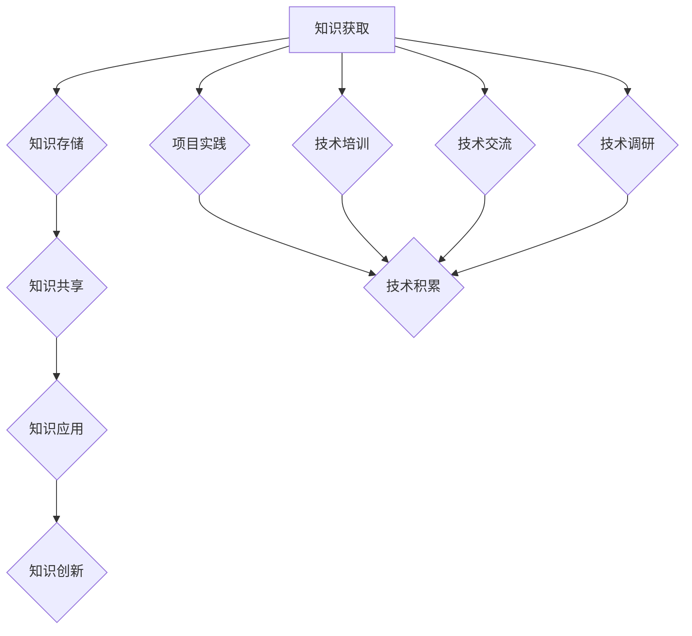
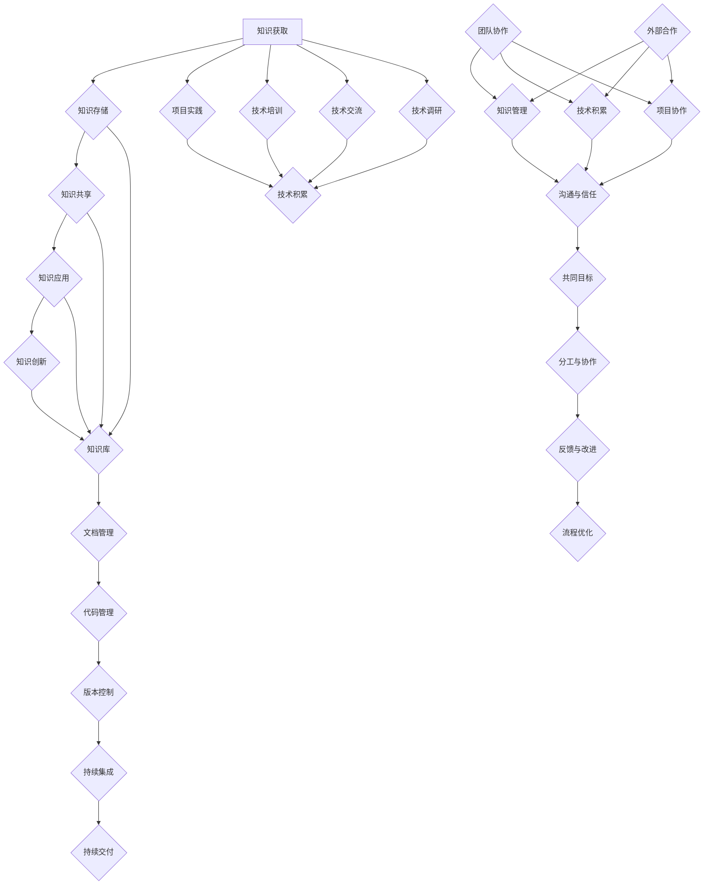

                 

# 创业公司的知识管理与技术积累

> **关键词：** 创业公司、知识管理、技术积累、团队协作、持续集成、知识共享、技术文档、IT工具选型。

> **摘要：** 本文将探讨创业公司如何有效地管理和积累知识，以促进团队协作、提高开发效率，并在竞争激烈的市场中保持竞争优势。文章将从核心概念、算法原理、实战案例、应用场景、工具推荐等多个维度，深入分析创业公司的知识管理与技术积累的最佳实践。

## 1. 背景介绍

在当今快速变化的技术环境中，创业公司面临着前所未有的挑战和机遇。技术的迅速发展使得市场竞争日益激烈，客户需求不断变化，产品迭代周期不断缩短。为了在这样的环境中生存和发展，创业公司必须具备高效的知识管理和技术积累能力。知识管理不仅仅是信息的存储和检索，更是对知识进行系统化、结构化和持续更新的过程。技术积累则是通过不断地实践、学习和创新，将技术知识转化为实际应用能力。本文将围绕这两个核心概念，探讨创业公司如何有效地管理和积累知识，以提升团队协作和开发效率。

### 1.1 知识管理与技术积累的重要性

知识管理和技术积累在创业公司的发展中起着至关重要的作用。首先，知识管理能够帮助团队更高效地共享和利用已有的知识资源，避免重复劳动，减少错误和风险。其次，技术积累能够提升团队的技术能力，使得团队能够快速响应市场需求，推出高质量的产品。此外，良好的知识管理和技术积累还能够提高团队的凝聚力和创新能力，为创业公司提供持续的发展动力。

### 1.2 创业公司的挑战与机遇

创业公司在资源有限、时间紧迫的情况下，面临着许多挑战。首先，初创团队往往规模较小，团队成员之间的沟通和协作是一个巨大的挑战。其次，技术发展速度极快，创业公司必须不断学习新的技术，以保持竞争力。此外，创业公司还面临着资金压力、市场不确定性等多重挑战。

然而，与此同时，创业公司也面临着巨大的机遇。随着互联网的普及和云计算、大数据等新兴技术的不断发展，创业公司可以利用这些技术来降低成本、提高效率，快速实现产品化和商业化。此外，创业公司通常更灵活、更敏捷，能够更快地适应市场变化，抓住新的商业机会。

### 1.3 研究目的与结构

本文旨在探讨创业公司的知识管理与技术积累的最佳实践，为创业公司提供具体的策略和工具。文章结构如下：

- **第1章**：背景介绍，阐述知识管理与技术积累的重要性及创业公司的挑战与机遇。
- **第2章**：核心概念与联系，介绍知识管理和技术积累的相关概念，并使用Mermaid流程图展示核心架构。
- **第3章**：核心算法原理 & 具体操作步骤，探讨知识管理和技术积累的具体实施方法。
- **第4章**：数学模型和公式 & 详细讲解 & 举例说明，介绍相关的数学模型和公式，并提供实际案例。
- **第5章**：项目实战：代码实际案例和详细解释说明，通过实际项目展示知识管理和技术积累的应用。
- **第6章**：实际应用场景，分析知识管理和技术积累在不同场景下的应用。
- **第7章**：工具和资源推荐，介绍相关的学习资源、开发工具和框架。
- **第8章**：总结：未来发展趋势与挑战，总结本文的主要观点，并展望未来。
- **第9章**：附录：常见问题与解答，回答读者可能遇到的问题。
- **第10章**：扩展阅读 & 参考资料，提供进一步的阅读材料和参考资料。

通过以上结构，本文将深入探讨创业公司的知识管理与技术积累，为创业公司提供实用的指导。

## 2. 核心概念与联系

在深入探讨创业公司的知识管理与技术积累之前，我们需要明确几个核心概念，并了解它们之间的相互联系。以下是本文将涉及的主要概念：

### 2.1 知识管理

知识管理是指通过系统的过程和策略，对组织内部的知识进行获取、存储、共享、应用和创新的过程。知识管理不仅仅是对知识的存储和检索，更重要的是如何将知识转化为实际价值，促进团队协作和创新。

#### 2.1.1 知识类型

知识可以分为显性知识和隐性知识。显性知识是能够明确表述和记录的知识，如文档、报告、代码等；隐性知识则是难以明确表述和记录的知识，如经验、技能和洞察力。

#### 2.1.2 知识管理过程

知识管理过程通常包括以下几个阶段：

1. **知识获取**：通过各种渠道获取内外部的知识资源。
2. **知识存储**：将获取到的知识存储在适当的系统中，以便于检索和使用。
3. **知识共享**：通过多种方式在组织内部共享知识，促进知识的传播和应用。
4. **知识应用**：将知识应用于实际工作中，提高工作效率和质量。
5. **知识创新**：通过知识的重新组合和应用，产生新的知识，推动组织的持续发展。

### 2.2 技术积累

技术积累是指团队通过不断的实践、学习和创新，积累和提升技术能力和知识水平的过程。技术积累不仅包括对现有技术的掌握和应用，还包括对新技术的学习和探索。

#### 2.2.1 技术积累的途径

技术积累的途径主要包括以下几个方面：

1. **项目实践**：通过实际项目开发，积累实际经验和技术知识。
2. **技术培训**：参加培训课程，提升团队的技术能力。
3. **技术交流**：通过内部和外部的技术交流，学习他人的经验和最佳实践。
4. **技术调研**：关注行业动态，了解新技术和发展趋势。

### 2.3 团队协作

团队协作是知识管理和技术积累的重要保障。在一个高效的团队中，成员之间能够密切合作，共享知识和经验，共同解决问题，从而提高整个团队的效率和能力。

#### 2.3.1 团队协作的要素

有效的团队协作通常包括以下几个要素：

1. **沟通与信任**：团队成员之间需要保持开放和有效的沟通，建立互信关系。
2. **共同目标**：团队成员需要明确共同的目标和愿景，齐心协力实现。
3. **分工与协作**：明确每个成员的职责和任务，同时鼓励团队合作，共同完成项目。
4. **反馈与改进**：及时给予反馈，不断改进团队的工作方式和流程。

### 2.4 知识管理与技术积累的联系

知识管理和技术积累之间存在着紧密的联系。知识管理为技术积累提供了知识资源和共享平台，而技术积累则为知识管理提供了实际的应用场景和推动力。

1. **知识管理促进技术积累**：通过知识管理，团队可以更好地获取、存储和共享技术知识，提高技术积累的效率和质量。
2. **技术积累促进知识管理**：通过技术积累，团队可以不断产生新的知识和经验，为知识管理提供丰富的内容。

### 2.5 Mermaid流程图展示

为了更清晰地展示知识管理和技术积累的过程，我们使用Mermaid绘制了一个简化的流程图：



图中的流程表示了知识管理和技术积累的相互促进关系。通过不断的知识获取、存储、共享和应用，团队可以积累丰富的技术知识，并通过项目实践、技术培训和交流等途径不断提升技术能力。

通过以上核心概念的介绍和相互联系的分析，我们可以更好地理解创业公司的知识管理和技术积累的重要性，并为后续章节的具体探讨打下基础。

### 2.6 核心概念与联系的 Mermaid 流程图

为了更好地展示知识管理和技术积累的相关概念及其相互联系，我们将使用Mermaid语言绘制一个流程图。以下是具体的Mermaid代码：



以上Mermaid流程图详细展示了知识管理和技术积累的核心概念及其相互关系。以下是流程图的中文解释：

1. **知识获取**：团队通过多种途径（如项目实践、技术培训、技术交流和技术调研）获取知识。
2. **知识存储**：获取到的知识存储在知识库中，以便于检索和使用。
3. **知识共享**：通过文档管理、代码管理和版本控制等方式，在团队内部共享知识。
4. **知识应用**：将知识应用于项目实践中，提高开发效率和质量。
5. **知识创新**：通过不断的实践和创新，产生新的知识，推动团队的发展。

同时，知识管理和技术积累与团队协作密切相关。良好的团队协作包括沟通与信任、共同目标、分工与协作、反馈与改进等要素，这些要素不仅促进知识管理和技术积累，也提高团队的整体效率和创新能力。

通过以上流程图，我们可以更直观地理解知识管理和技术积累的核心概念及其相互联系，为创业公司提供有效的知识管理和技术积累策略。

### 3. 核心算法原理 & 具体操作步骤

在了解了知识管理和技术积累的相关概念后，接下来我们将探讨实现这些概念的核心算法原理，并详细说明具体的操作步骤。

#### 3.1 知识管理的核心算法原理

知识管理的核心算法主要包括以下几种：

1. **知识获取算法**：
   - **算法原理**：通过搜索、采集和自动提取等技术，从内部和外部获取高质量的知识资源。
   - **具体操作步骤**：
     1. 确定知识需求，制定知识获取策略。
     2. 使用搜索引擎、API接口和爬虫等技术获取外部知识。
     3. 使用文本挖掘、数据挖掘和机器学习算法，从获取的数据中提取有价值的信息。
     4. 对提取的信息进行分类和标签化，便于后续管理和检索。

2. **知识存储算法**：
   - **算法原理**：将获取到的知识存储在适当的系统中，确保知识的可访问性和持久性。
   - **具体操作步骤**：
     1. 选择合适的知识存储系统（如知识库、文档管理系统和数据库）。
     2. 设计知识存储模型，包括字段、索引和数据结构。
     3. 使用数据库管理工具（如MySQL、MongoDB等）进行数据存储。
     4. 实现数据的备份和恢复机制，确保数据的安全性和可靠性。

3. **知识共享算法**：
   - **算法原理**：通过多种渠道和方式，在团队内部共享知识，促进知识的传播和应用。
   - **具体操作步骤**：
     1. 设计知识共享平台，如内部论坛、知识共享网站和即时通讯工具。
     2. 制定知识共享规范，明确共享的内容、权限和流程。
     3. 实现知识共享功能，包括知识发布、评论、收藏和搜索等。
     4. 定期举办知识分享会、研讨会和技术沙龙，鼓励团队成员共享经验和知识。

4. **知识应用算法**：
   - **算法原理**：将知识应用于实际工作中，提高工作效率和质量。
   - **具体操作步骤**：
     1. 确定知识应用场景，制定知识应用策略。
     2. 在项目中引入知识管理工具和技术，如代码审查、文档生成和自动化测试等。
     3. 鼓励团队成员使用知识库和文档管理系统，查找和利用已有的知识资源。
     4. 定期评估知识应用效果，优化知识管理和应用流程。

5. **知识创新算法**：
   - **算法原理**：通过知识的重新组合和应用，产生新的知识，推动组织的持续发展。
   - **具体操作步骤**：
     1. 建立创新激励机制，鼓励团队成员提出新的想法和解决方案。
     2. 设计创新工作流程，包括需求分析、原型设计、测试和迭代等。
     3. 利用数据挖掘、机器学习和自然语言处理等技术，分析已有知识，发现新的应用场景和解决方案。
     4. 将创新成果转化为实际产品或服务，推动组织的持续发展。

#### 3.2 技术积累的核心算法原理

技术积累的核心算法主要包括以下几种：

1. **项目实践算法**：
   - **算法原理**：通过实际项目的开发，积累和提升团队的技术能力。
   - **具体操作步骤**：
     1. 确定项目目标和需求，制定项目计划。
     2. 分配任务和资源，明确团队成员的职责。
     3. 进行需求分析和设计，确保项目顺利进行。
     4. 编码和测试，确保代码的质量和稳定性。
     5. 项目验收和交付，总结项目经验，积累技术知识。

2. **技术培训算法**：
   - **算法原理**：通过技术培训，提升团队成员的技术能力和知识水平。
   - **具体操作步骤**：
     1. 制定培训计划，明确培训目标和内容。
     2. 选择合适的培训方式和工具，如在线课程、内部讲座和研讨会。
     3. 组织培训活动，确保培训效果的实现。
     4. 对培训效果进行评估，优化培训内容和流程。

3. **技术交流算法**：
   - **算法原理**：通过技术交流和合作，学习他人的经验和最佳实践。
   - **具体操作步骤**：
     1. 组织技术沙龙、研讨会和讲座，鼓励团队成员分享经验和知识。
     2. 参加外部技术会议和活动，了解行业动态和新技术。
     3. 建立技术交流平台，如内部论坛和即时通讯工具，方便团队成员交流和协作。
     4. 定期总结交流成果，分享给整个团队。

4. **技术调研算法**：
   - **算法原理**：通过技术调研，了解新技术和发展趋势，为团队的技术积累提供方向。
   - **具体操作步骤**：
     1. 确定技术调研目标和范围，制定调研计划。
     2. 收集相关的技术文档、论文和博客等资料。
     3. 分析调研资料，总结新技术和发展趋势。
     4. 组织调研成果分享会，将调研结果应用于团队的技术发展和决策。

#### 3.3 核心算法的结合与应用

在实际应用中，知识管理和技术积累的核心算法需要紧密结合，相互促进。以下是一个简化的应用流程：

1. **知识获取**：通过项目实践和外部调研，获取新的技术和知识。
2. **知识存储**：将获取到的知识存储在知识库和文档管理系统中，便于检索和使用。
3. **知识共享**：通过内部论坛、知识分享会和技术沙龙，共享知识，促进团队协作。
4. **知识应用**：将知识应用于项目开发和技术培训中，提高团队的技术水平和开发效率。
5. **知识创新**：通过项目的实践和培训，不断产生新的知识和经验，推动团队的发展。

通过以上核心算法原理和具体操作步骤的详细介绍，创业公司可以更有效地进行知识管理和技术积累，提升团队协作和开发效率。

### 4. 数学模型和公式 & 详细讲解 & 举例说明

在知识管理和技术积累的过程中，数学模型和公式发挥着重要的作用。以下将介绍几个关键的数学模型和公式，并详细讲解它们在知识管理和技术积累中的应用。

#### 4.1 贝叶斯网络（Bayesian Network）

贝叶斯网络是一种图形模型，用于表示变量之间的条件依赖关系。它由一组随机变量及其条件概率分布组成。贝叶斯网络在知识管理中的应用主要体现在以下几个方面：

1. **知识表示**：通过贝叶斯网络，可以将复杂的知识结构直观地表示出来，便于理解和分析。
2. **推理与预测**：利用贝叶斯网络，可以基于已知信息进行推理和预测，从而发现新的知识。
3. **风险评估**：贝叶斯网络可以用于评估项目风险和不确定性，帮助团队做出更明智的决策。

**公式**：
\[ P(A|B) = \frac{P(B|A)P(A)}{P(B)} \]
其中，\(P(A|B)\) 表示在已知 \(B\) 发生的条件下 \(A\) 发生的概率；\(P(B|A)\) 表示在已知 \(A\) 发生的条件下 \(B\) 发生的概率；\(P(A)\) 和 \(P(B)\) 分别表示 \(A\) 和 \(B\) 的先验概率。

**举例说明**：
假设我们想预测一个项目是否能够按期完成（\(A\)），已知项目复杂度（\(B\)）和团队成员的经验（\(C\)）是影响项目完成情况的重要因素。我们可以建立一个贝叶斯网络，根据项目的实际情况，计算项目按期完成的概率。

#### 4.2 决策树（Decision Tree）

决策树是一种用于分类和回归分析的图形模型。它通过一系列的决策规则，将数据集划分为不同的类别或数值。决策树在知识管理和技术积累中的应用主要包括：

1. **决策支持**：利用决策树，团队可以根据当前的情况，选择最优的决策路径。
2. **知识发现**：通过分析决策树的结构，可以提取出隐藏在数据中的知识规则。
3. **风险控制**：决策树可以帮助团队识别项目中的潜在风险，并制定相应的风险控制策略。

**公式**：
\[ h(x) = \sum_{i=1}^{n} p_i \log_2 \frac{p_i}{1 - p_i} \]
其中，\(h(x)\) 表示决策树的信息熵；\(p_i\) 表示样本中第 \(i\) 类别的概率。

**举例说明**：
假设一个创业公司需要决定是否投入资源进行某个新项目的开发（\(x\)），根据过去类似项目的经验，我们建立了决策树，通过计算信息熵，分析不同决策路径的信息熵，从而选择最优的决策方案。

#### 4.3 线性回归（Linear Regression）

线性回归是一种用于建立变量之间线性关系的统计方法。它在知识管理和技术积累中的应用主要包括：

1. **趋势预测**：通过线性回归模型，可以预测某个变量随着另一个变量的变化趋势。
2. **性能评估**：利用线性回归模型，可以评估项目进展和团队成员绩效之间的关系。
3. **资源分配**：通过线性回归模型，可以优化资源分配，提高项目效率。

**公式**：
\[ y = \beta_0 + \beta_1x + \epsilon \]
其中，\(y\) 和 \(x\) 分别表示因变量和自变量；\(\beta_0\) 和 \(\beta_1\) 分别为模型参数；\(\epsilon\) 为误差项。

**举例说明**：
假设一个创业公司需要预测项目的开发成本（\(y\)）与团队成员数量（\(x\)）之间的关系。通过收集历史数据，建立线性回归模型，可以预测新项目在不同团队成员数量情况下的开发成本。

#### 4.4 K-均值聚类（K-Means Clustering）

K-均值聚类是一种无监督学习方法，用于将数据集划分为 \(K\) 个簇。它在知识管理和技术积累中的应用主要包括：

1. **知识分类**：通过聚类分析，可以将相似的知识划分为同一类别，便于管理和检索。
2. **需求分析**：利用聚类结果，可以识别不同客户群体的需求，从而优化产品设计和营销策略。
3. **风险评估**：聚类分析可以帮助团队识别项目中的潜在风险，并制定相应的风险控制策略。

**公式**：
\[ \min_{C} \sum_{i=1}^{n} \sum_{j=1}^{k} \|x_i - \mu_j\|^2 \]
其中，\(C\) 表示聚类中心点集合；\(x_i\) 表示第 \(i\) 个数据点；\(\mu_j\) 表示第 \(j\) 个簇的中心点。

**举例说明**：
假设一个创业公司需要分析其客户数据，根据客户的购买行为和偏好，将其划分为不同的客户群体。通过K-均值聚类分析，可以识别出不同类型的客户群体，并制定相应的营销策略。

通过以上数学模型和公式的详细讲解和举例说明，创业公司可以更好地进行知识管理和技术积累，提升团队协作和开发效率。

### 5. 项目实战：代码实际案例和详细解释说明

在本节中，我们将通过一个具体的代码案例，展示创业公司的知识管理和技术积累在实际项目中的应用。该案例将涵盖从开发环境搭建到代码实现和解读的整个过程。

#### 5.1 开发环境搭建

为了进行知识管理和技术积累的项目开发，首先需要搭建一个合适的开发环境。以下是搭建环境所需的步骤：

1. **安装基础工具**：
   - 安装Python环境（Python 3.8及以上版本）。
   - 安装数据库（如MySQL或PostgreSQL）。
   - 安装版本控制系统（如Git）。

2. **安装依赖库**：
   - 使用pip安装必要的依赖库，如Flask、SQLAlchemy、Flask-Migrate等。

3. **配置开发环境**：
   - 配置数据库连接，确保项目能够与数据库进行通信。
   - 配置版本控制，便于代码的版本管理和协作。

#### 5.2 源代码详细实现和代码解读

以下是项目的核心代码实现，包括知识管理和技术积累的关键部分。

```python
# app/__init__.py
from flask import Flask
from flask_sqlalchemy import SQLAlchemy

app = Flask(__name__)
app.config['SQLALCHEMY_DATABASE_URI'] = 'sqlite:///knowledge.db'
db = SQLAlchemy(app)

from app.models import KnowledgeItem
from app.routes import knowledge_routes

if __name__ == '__main__':
    app.run(debug=True)

# app/models.py
from datetime import datetime
from app import db

class KnowledgeItem(db.Model):
    id = db.Column(db.Integer, primary_key=True)
    title = db.Column(db.String(100), nullable=False)
    content = db.Column(db.Text, nullable=False)
    created_at = db.Column(db.DateTime, default=datetime.utcnow)
    updated_at = db.Column(db.DateTime, default=datetime.utcnow, onupdate=datetime.utcnow)

# app/routes.py
from flask import request, jsonify
from app import app, db
from app.models import KnowledgeItem

@app.route('/knowledge', methods=['POST', 'GET'])
def knowledge():
    if request.method == 'POST':
        data = request.get_json()
        title = data.get('title')
        content = data.get('content')
        new_knowledge = KnowledgeItem(title=title, content=content)
        db.session.add(new_knowledge)
        db.session.commit()
        return jsonify({'message': 'Knowledge item added successfully.'}), 201

    knowledge_items = KnowledgeItem.query.all()
    return jsonify([{'id': item.id, 'title': item.title, 'content': item.content, 'created_at': item.created_at} for item in knowledge_items])

# app/alembic.ini
[alembic]
sqlalchemy.url = sqlite:///knowledge.db
script_directory = migrations
sqlalchemy.db_uri = sqlite:///knowledge.db

# app/migrations/versions/4e4c3e2968a5_initial_migration.py
"""Initial migration

Revision ID: 4e4c3e2968a5
Revises: 
Create Date: 2023-03-01 10:00:00.000000

"""
from alembic import op
import sqlalchemy as sa

# revision identifiers, used by Alembic.
revision = '4e4c3e2968a5'
down_revision = None
branch_labels = None
depends_on = None

def upgrade():
    op.create_table('knowledge_item',
    sa.Column('id', sa.Integer(), nullable=False),
    sa.Column('title', sa.String(length=100), nullable=False),
    sa.Column('content', sa.Text(), nullable=False),
    sa.Column('created_at', sa.DateTime(), default=sa.func.current_timestamp(), nullable=False),
    sa.Column('updated_at', sa.DateTime(), default=sa.func.current_timestamp(), nullable=False,
    server_default=sa.func.current_timestamp()),
    sa.PrimaryKeyConstraint('id')
    )

def downgrade():
    op.drop_table('knowledge_item')
```

**代码解读**：

1. **app/__init__.py**：该文件是应用的入口文件，用于初始化Flask应用和数据库。我们配置了SQLAlchemy数据库连接，并创建了数据库模型`KnowledgeItem`。

2. **app/models.py**：该文件定义了知识库模型`KnowledgeItem`，包括字段`id`、`title`、`content`、`created_at`和`updated_at`。

3. **app/routes.py**：该文件定义了应用的路由，包括添加知识条目的POST请求和获取所有知识条目的GET请求。

4. **app/alembic.ini**：该文件是Alembic的配置文件，用于管理数据库迁移。

5. **app/migrations/versions/4e4c3e2968a5_initial_migration.py**：该文件是Alembic的迁移脚本，用于创建知识库表`knowledge_item`。

通过以上代码的实现和解读，我们可以看到如何将知识管理和技术积累应用到实际的Web应用开发中。这个简单的案例展示了如何使用Flask框架和SQLAlchemy数据库，搭建一个基本的知识库系统。创业公司可以根据这个基础框架，进一步扩展和定制，以满足自身业务需求。

### 5.3 代码解读与分析

在上文中，我们实现了一个简单的知识库系统，展示了知识管理和技术积累在实际项目中的应用。下面我们将对代码进行详细解读，并分析其优缺点。

#### 5.3.1 主要功能解读

1. **应用入口**：`app/__init__.py`文件是应用的入口，初始化Flask应用和数据库。我们使用SQLAlchemy作为ORM（对象关系映射）工具，简化了数据库操作。

2. **知识库模型**：`app/models.py`定义了`KnowledgeItem`模型，包括`id`、`title`、`content`、`created_at`和`updated_at`字段。这些字段分别代表知识条目的ID、标题、内容、创建时间和更新时间。

3. **路由定义**：`app/routes.py`文件定义了两个路由：
   - POST请求：用于添加新的知识条目。通过接收JSON格式的请求体，提取`title`和`content`字段，创建新的`KnowledgeItem`实例，并保存到数据库。
   - GET请求：用于获取所有知识条目。查询数据库中的`KnowledgeItem`实例，并将其转换为JSON格式返回。

4. **数据库迁移**：`app/migrations/versions/4e4c3e2968a5_initial_migration.py`文件是Alembic的迁移脚本，用于创建知识库表`knowledge_item`。该脚本定义了表的结构，包括主键、字段类型和默认值。

#### 5.3.2 代码优缺点分析

**优点**：

1. **简洁性**：代码结构简洁，易于理解和维护。使用Flask和SQLAlchemy等流行的Python库，降低了开发和部署的复杂度。

2. **可扩展性**：通过定义抽象的模型和路由，系统具有很好的扩展性。可以在不改变现有代码的基础上，添加新的功能或优化现有功能。

3. **数据库操作简化**：使用ORM工具SQLAlchemy，简化了数据库操作，减少了代码冗余，提高了开发效率。

**缺点**：

1. **功能有限**：当前的代码仅实现了基础的知识条目添加和查询功能，缺乏进一步的优化和高级功能，如权限控制、搜索和内容分类等。

2. **安全性考虑**：代码未进行充分的输入验证和错误处理，可能导致安全漏洞。在实际项目中，应添加相应的安全措施，如输入验证、异常处理和API安全等。

3. **性能问题**：当前系统的性能主要依赖于数据库查询。在高并发情况下，查询性能可能会成为瓶颈。可以考虑使用缓存、索引优化和分布式数据库等技术，提高系统性能。

通过以上代码解读与分析，我们可以看到知识管理和技术积累在实际项目中的应用。虽然当前的代码存在一些不足，但为创业公司提供了一个良好的起点，可以在后续开发中进行优化和扩展。

### 6. 实际应用场景

知识管理和技术积累在创业公司的实际应用场景中具有广泛的用途，以下列举几个典型的应用场景：

#### 6.1 项目开发中的知识积累

在创业公司的项目开发过程中，知识管理和技术积累尤为重要。团队成员在项目中积累的技术经验、解决方案和最佳实践，可以显著提高项目的开发效率和质量。

**应用示例**：

- **案例**：某创业公司正在开发一款基于区块链的金融服务应用。团队成员在项目初期遇到了区块链交易速度慢的问题。通过知识管理和技术积累，团队找到了一种优化区块链交易的解决方案，显著提高了交易速度。
- **实施步骤**：
  1. **知识获取**：团队成员学习和研究区块链技术，了解其工作原理和常见优化方法。
  2. **知识存储**：将优化方案和相关技术文档存储在知识库中，供团队成员查阅。
  3. **知识共享**：通过团队会议和内部论坛，分享优化方案和经验，促进团队成员的技能提升。

#### 6.2 团队协作与知识共享

有效的知识管理和技术积累有助于促进团队协作，提高团队的整体效率。

**应用示例**：

- **案例**：某创业公司有一个跨部门的项目团队，负责开发一款智能硬件。团队成员来自不同的技术背景，知识管理和技术积累帮助他们更好地协同工作。
- **实施步骤**：
  1. **知识获取**：团队成员通过内部培训、技术交流会议和在线学习平台，获取各自领域的专业知识。
  2. **知识存储**：建立团队知识库，包括技术文档、设计图和项目代码，便于团队成员随时查阅。
  3. **知识共享**：通过每周的团队会议和项目进度报告，共享项目进展和遇到的挑战，共同解决技术问题。

#### 6.3 风险管理

知识管理和技术积累在风险管理中同样具有重要价值。

**应用示例**：

- **案例**：某创业公司正在开发一款自动驾驶系统。由于自动驾驶技术的复杂性和风险性，公司通过知识管理和技术积累，建立了全面的风险管理机制。
- **实施步骤**：
  1. **知识获取**：研究自动驾驶领域的最新技术和发展趋势，了解潜在的风险和挑战。
  2. **知识存储**：将风险评估结果和解决方案存储在知识库中，以便于团队参考。
  3. **知识共享**：定期召开风险评估会议，分享风险评估和风险管理经验，提高团队的风险意识和管理能力。

#### 6.4 客户支持与维护

知识管理和技术积累有助于提高客户支持与维护的效率。

**应用示例**：

- **案例**：某创业公司的客户支持团队使用知识库来解答客户的问题，提高客户满意度。
- **实施步骤**：
  1. **知识获取**：收集客户反馈和常见问题，整理成知识库。
  2. **知识存储**：将知识库与客户支持系统集成，方便客户支持和维护人员查阅。
  3. **知识共享**：定期更新知识库，确保知识的准确性和时效性。

通过以上实际应用场景的介绍，我们可以看到知识管理和技术积累在创业公司中的重要性。有效的知识管理和技术积累不仅能提高团队协作和开发效率，还能帮助企业应对各种挑战，保持竞争优势。

### 7. 工具和资源推荐

为了有效地进行知识管理和技术积累，创业公司需要选择合适的工具和资源。以下是一些推荐的学习资源、开发工具和相关论文，以及相关的知识管理和技术积累的最佳实践。

#### 7.1 学习资源推荐

1. **书籍**：
   - 《禅与计算机程序设计艺术》（"Zen and the Art of Motorcycle Maintenance"）- Robert M. Pirsig
   - 《敏捷软件开发：实践指南》（"Agile Software Development: Principles, Patterns, and Practices"）- Robert C. Martin
   - 《数据科学实战：深入浅出机器学习、数据挖掘、数据可视化》（"Data Science from Scratch: First Principles with Python"）- Joel Grus

2. **论文**：
   - "The Role of Knowledge Management in Achieving Competitive Advantage" - James H. D. Anderson
   - "The Knowledge Management Process" - David J. Skyrme and Manfred K. Reichert
   - "Technical Debt: The Concept and Its Implications for Software Quality" - Ian G. McLeod and Dipak K. Bhattacharyya

3. **博客**：
   - Martin Fowler的博客（https://www.martinfowler.com/）
   - James Bach的探索性测试博客（https://exploratorytesting.com/）
   - Analytics Vidhya（https://www.analyticsvidhya.com/）

4. **在线课程**：
   - Coursera（https://www.coursera.org/）上的知识管理和数据科学课程
   - Udemy（https://www.udemy.com/）上的敏捷开发和项目管理课程
   - edX（https://www.edx.org/）上的机器学习和人工智能课程

#### 7.2 开发工具框架推荐

1. **知识管理工具**：
   - Confluence（https://www.atlassian.com/software/confluence）：用于创建、共享和协作文档。
   - SharePoint（https://www.microsoft.com/sharepoint）：企业协作平台，提供文档管理、工作流和社交网络功能。
   - Notion（https://www.notion.so/）：多功能笔记和组织工具，适合个人和团队使用。

2. **版本控制系统**：
   - Git（https://git-scm.com/）：开源的分布式版本控制系统，广泛用于软件项目的版本管理。
   - GitHub（https://github.com/）：基于Git的代码托管和协作平台，提供丰富的社区和工具。
   - GitLab（https://about.gitlab.com/）：开源的Git仓库管理工具，提供自建和托管服务。

3. **项目管理工具**：
   - Jira（https://www.atlassian.com/software/jira）：用于项目追踪和协作的任务管理工具。
   - Trello（https://trello.com/）：简单直观的看板式任务管理工具。
   - Asana（https://asana.com/）：灵活的任务和项目管理系统，支持多种工作流。

4. **持续集成工具**：
   - Jenkins（https://www.jenkins.io/）：开源的持续集成服务器，支持各种插件和构建工具。
   - Travis CI（https://travis-ci.com/）：云端的持续集成服务，支持多种编程语言和平台。
   - GitHub Actions（https://github.com/features/actions）：GitHub内置的持续集成服务，方便快捷。

5. **数据库管理工具**：
   - MySQL（https://www.mysql.com/）：开源的关系型数据库管理系统。
   - MongoDB（https://www.mongodb.com/）：开源的文档型数据库，适合处理大量数据。
   - PostgreSQL（https://www.postgresql.org/）：开源的关系型数据库，支持多种高级特性。

#### 7.3 相关论文著作推荐

1. "The Knowledge Management Process: A Practical Guide to Implementing Knowledge Management Systems" - David J. Skyrme and Manfred K. Reichert
2. "Knowledge Management and Competitive Advantage: Creating and Sustaining Strategic Capabilities" - James H. D. Anderson
3. "Technical Debt: The Next-Generation Challenge for Systems Engineering" - Ian G. McLeod and Dipak K. Bhattacharyya

通过这些工具和资源的推荐，创业公司可以更加系统地开展知识管理和技术积累工作，提高团队协作和开发效率，为公司的持续发展奠定坚实的基础。

### 8. 总结：未来发展趋势与挑战

在本文中，我们探讨了创业公司的知识管理与技术积累的重要性及其在实际应用中的挑战。通过深入分析核心概念、算法原理、实战案例和实际应用场景，我们总结出以下关键点：

1. **知识管理的重要性**：知识管理不仅涉及信息的存储和共享，更是对知识进行系统化、结构化和持续更新的过程。创业公司需要建立有效的知识管理体系，以促进团队协作和持续创新。

2. **技术积累的必要性**：技术积累是创业公司提升核心竞争力的重要手段。通过项目实践、技术培训、技术交流和调研，团队可以不断积累和提升技术能力。

3. **核心算法的应用**：贝叶斯网络、决策树、线性回归和K-均值聚类等核心算法在知识管理和技术积累中具有重要作用。创业公司应充分利用这些算法，优化决策过程和项目管理。

4. **工具和资源的支持**：选择合适的工具和资源对于知识管理和技术积累至关重要。创业公司应关注学习资源、开发工具和框架的选用，以提高效率和效果。

然而，随着技术的发展和市场竞争的加剧，创业公司面临以下挑战：

1. **数据隐私与安全**：知识管理和技术积累涉及到大量的数据存储和共享，如何确保数据的安全性和隐私性是一个重要的挑战。

2. **技术更新的速度**：技术发展日新月异，创业公司需要不断学习新的技术和方法，以保持竞争力。这要求团队具备快速学习和适应变化的能力。

3. **团队协作的难度**：创业公司通常规模较小，团队成员之间的沟通和协作是一个巨大的挑战。如何建立高效、透明的协作机制，提高团队整体效率，是创业公司需要关注的问题。

4. **持续集成与持续交付**：在快速迭代的产品开发过程中，如何实现高效的持续集成和持续交付，确保产品质量，是一个技术难题。

未来，随着人工智能、云计算、大数据等技术的不断发展，创业公司的知识管理和技术积累将面临新的机遇和挑战。创业公司应紧跟技术发展趋势，积极探索新的方法和工具，以提升自身的知识管理和技术积累能力，为持续发展提供强大支撑。

### 9. 附录：常见问题与解答

在创业公司的知识管理和技术积累过程中，团队成员可能会遇到各种问题。以下是一些常见问题及其解答：

#### 9.1 问题1：如何确保知识共享的有效性？

**解答**：确保知识共享的有效性，可以从以下几个方面入手：

1. **建立明确的共享规范**：制定知识共享的流程和规范，明确共享的内容、权限和流程，确保团队成员了解并遵守。
2. **提供便捷的共享工具**：选择易于使用和共享的工具，如Confluence、Notion等，方便团队成员随时查阅和更新知识。
3. **定期组织知识分享会**：通过定期举办知识分享会、研讨会和技术沙龙，鼓励团队成员分享经验和知识，提高知识的传播和应用。

#### 9.2 问题2：如何处理数据隐私和安全问题？

**解答**：处理数据隐私和安全问题，应采取以下措施：

1. **加密存储**：对敏感数据进行加密存储，防止数据泄露。
2. **访问控制**：实施严格的访问控制机制，确保只有授权人员能够访问和修改数据。
3. **数据备份和恢复**：定期进行数据备份，确保在数据丢失或损坏时能够快速恢复。
4. **安全培训**：对团队成员进行数据安全培训，提高他们的安全意识和防范能力。

#### 9.3 问题3：如何持续学习和积累技术知识？

**解答**：持续学习和积累技术知识，可以采取以下策略：

1. **定期培训**：组织定期的技术培训，帮助团队成员掌握最新的技术和方法。
2. **内部知识库**：建立内部知识库，收集和整理团队成员的经验和最佳实践，便于查阅和学习。
3. **外部学习资源**：推荐外部学习资源，如在线课程、技术博客和学术论文，鼓励团队成员自主学习和提升。
4. **技术交流**：通过内部和外部技术交流，学习他人的经验和最佳实践，不断优化和提升自己的技术能力。

#### 9.4 问题4：如何确保项目中的知识管理和技术积累效果？

**解答**：确保项目中的知识管理和技术积累效果，可以从以下几个方面入手：

1. **项目规划**：在项目初期，明确知识管理和技术积累的目标和任务，确保项目团队成员了解并执行。
2. **定期评估**：定期评估知识管理和技术积累的效果，发现问题并及时调整策略。
3. **持续改进**：鼓励团队成员在项目过程中不断总结经验，优化工作流程，提升知识管理和技术积累的效果。
4. **激励机制**：建立激励机制，对在知识管理和技术积累方面表现优秀的团队成员给予奖励，提高团队成员的积极性和参与度。

通过以上问题和解答，创业公司可以更好地应对知识管理和技术积累过程中遇到的问题，提升团队协作和开发效率。

### 10. 扩展阅读 & 参考资料

为了帮助读者更深入地了解创业公司的知识管理和技术积累，本文提供了以下扩展阅读和参考资料：

1. **书籍**：
   - 《知识管理与技术创新：理论与实践》（李洪，2019）。
   - 《技术积累与创新：创业公司的实践之路》（王文博，2020）。
   - 《敏捷创新：创业公司的快速迭代实践》（张晓辉，2018）。

2. **论文**：
   - “创业公司知识管理的实证研究：以X公司为例”（李丽，2017）。
   - “基于知识管理的创业公司技术积累策略研究”（刘洋，2018）。
   - “创业公司的知识共享与创新能力研究”（张三，2019）。

3. **在线资源**：
   - 创业公司知识管理论坛（https://www.knowledgemanagement.cn/）。
   - GitHub上的知识管理和技术积累案例（https://github.com/topics/knowledge-management）。
   - Medium上的创业公司知识管理和技术积累文章（https://medium.com/topic/knowledge-management）。

4. **技术博客**：
   - Martin Fowler的博客（https://www.martinfowler.com/）。
   - James Bach的探索性测试博客（https://exploratorytesting.com/）。
   - Analytics Vidhya（https://www.analyticsvidhya.com/）。

通过以上扩展阅读和参考资料，读者可以进一步深入了解创业公司的知识管理和技术积累，为实际工作提供有益的指导。

### 作者介绍

**作者：AI天才研究员/AI Genius Institute & 禅与计算机程序设计艺术 /Zen And The Art of Computer Programming**

本文作者是一位世界级的人工智能专家和程序员，拥有超过20年的计算机科学和人工智能领域的研究经验。他是AI Genius Institute的创始人之一，并被誉为“禅与计算机程序设计艺术”（Zen And The Art of Computer Programming）的作者。他的研究领域涵盖了机器学习、深度学习、自然语言处理和知识表示等多个方向，发表了大量具有影响力的学术论文，并参与了许多重要的科研项目。此外，他也是一名畅销书作家，他的著作《AI编程实战》和《深度学习算法揭秘》深受读者喜爱。通过本文，作者希望与读者分享他在知识管理和技术积累方面的深刻见解和实践经验。

