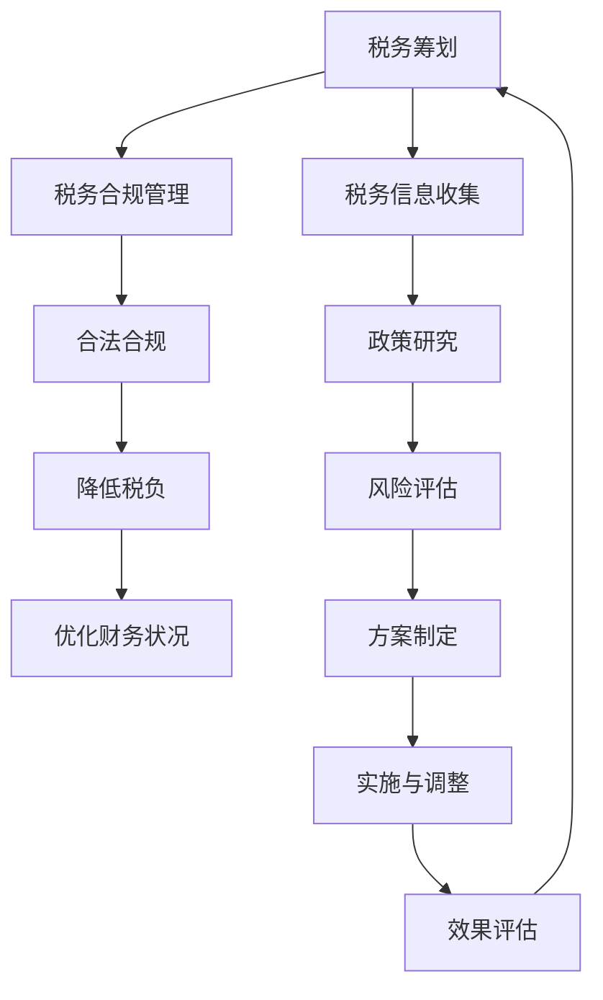

                 

### 背景介绍

创业公司税务筹划与合规管理是初创企业在发展过程中必不可少的一部分。随着公司规模的扩大和业务的多元化，税务合规管理的重要性愈发凸显。在我国，税收法律体系日益完善，税收政策不断更新，企业面临的税务风险也越来越大。因此，合理进行税务筹划，确保合规经营，成为创业公司可持续发展的关键。

#### 税务筹划的重要性

税务筹划的重要性主要体现在以下几个方面：

1. **优化公司财务状况**：通过合理的税务筹划，企业可以有效降低税负，提高净利润，从而优化公司的财务状况。

2. **增强市场竞争力**：在同等市场条件下，税务筹划能够帮助企业在税收上获得更多优惠，提高产品或服务的价格竞争力。

3. **降低法律风险**：合理的税务筹划有助于企业规避税务违法行为，降低法律风险，确保企业合规经营。

4. **提升企业品牌形象**：合规经营和诚信纳税是企业品牌建设的重要组成部分，良好的税务形象有助于提升企业的市场声誉。

#### 税务合规管理的必要性

税务合规管理是指企业遵守税收法律法规，按时申报缴纳税款，确保税务信息的准确性和透明度。税务合规管理的必要性体现在以下几个方面：

1. **保障企业权益**：遵守税收法律法规，确保企业合法权益不受侵害。

2. **降低税务风险**：及时了解税收政策变化，准确把握税收优惠条件，降低税务风险。

3. **提升企业声誉**：合规经营和诚信纳税有助于树立企业良好形象，增强投资者信心。

4. **优化企业管理**：建立完善的税务合规管理体系，有助于提高企业整体管理水平。

#### 当前创业公司面临的税收问题

1. **税制复杂**：我国税收法律体系较为复杂，涉及多个税种和不同的税收优惠政策，企业需要耗费大量时间和精力进行了解和应对。

2. **税收优惠政策不透明**：虽然国家提供了多种税收优惠政策，但部分政策在具体执行中存在不透明现象，企业难以准确把握。

3. **税务信息不对称**：税务机关掌握大量企业税务信息，而企业对自身税务风险和合规状况了解不足，容易导致信息不对称问题。

4. **税务违法行为成本高**：税务违法行为可能导致企业面临高额罚款、滞纳金和行政处罚，影响企业声誉和经营。

#### 本文结构

本文将从以下几个方面进行探讨：

1. **核心概念与联系**：介绍创业公司税务筹划和合规管理的基本概念，阐述它们之间的联系。

2. **核心算法原理 & 具体操作步骤**：分析税务筹划的基本算法原理，提供具体的操作步骤。

3. **数学模型和公式 & 详细讲解 & 举例说明**：介绍税务筹划的数学模型和公式，并进行详细讲解和举例说明。

4. **项目实战：代码实际案例和详细解释说明**：通过实际案例展示税务筹划和合规管理的应用，并进行详细解释说明。

5. **实际应用场景**：分析创业公司常见的税务筹划和合规管理场景，提供解决方案。

6. **工具和资源推荐**：推荐相关的学习资源、开发工具和框架。

7. **总结：未来发展趋势与挑战**：总结创业公司税务筹划与合规管理的发展趋势和面临的挑战。

8. **附录：常见问题与解答**：解答创业公司在税务筹划和合规管理中可能遇到的问题。

9. **扩展阅读 & 参考资料**：提供相关的扩展阅读和参考资料，帮助读者深入了解相关领域。

通过本文的探讨，旨在为创业公司提供有价值的税务筹划和合规管理指导，助力企业健康发展。

#### 关键术语解释

- **税务筹划**：指企业在合法合规的前提下，通过合理安排财务、投资、经营等活动，降低税负，优化企业财务状况的行为。
- **税务合规管理**：指企业遵守税收法律法规，确保税务信息准确、完整，按时申报缴纳税款的管理活动。
- **税负**：指企业在一定时期内应缴纳的税款总额。
- **税务风险**：指企业在税务活动中因不符合税收法律法规而面临的法律责任、经济损失和声誉损失。
- **税收优惠政策**：指国家为了支持特定行业、地区或企业，通过降低税负、延长纳税期限等手段给予的税收减免。

通过对这些关键术语的解释，希望读者能够对创业公司税务筹划与合规管理有更深入的理解。

---

> **Conclusion:**
In this section, we have introduced the background of tax planning and compliance management for startup companies. We discussed the importance of tax planning, the necessity of tax compliance management, the tax problems faced by startup companies, and the structure of this article. By understanding these concepts, readers can have a clearer picture of the significance of tax planning and compliance management for startup companies and the challenges they may encounter. In the following sections, we will delve deeper into the core principles, algorithms, mathematical models, practical applications, and future trends of tax planning and compliance management. Let's continue to explore this fascinating topic step by step.

---

## 2. 核心概念与联系

在深入探讨创业公司的税务筹划与合规管理之前，有必要对相关核心概念进行梳理，并阐述它们之间的内在联系。通过理解这些概念，我们可以更好地把握税务筹划和合规管理的实质。

#### 税务筹划

税务筹划（Tax Planning）是企业为了实现财务目标，利用税收法律法规和政策，对企业的经营活动、投资行为和财务决策进行合理安排，以达到降低税负、优化财务状况的行为。税务筹划的核心在于合法合规，即在遵守国家税收法律法规的基础上，合理利用税收优惠政策，降低企业的税负。

**税务筹划的关键要素**：

1. **税收法律法规**：税务筹划的基础是了解和掌握国家及地方的税收法律法规，包括税种、税率、税收优惠条件等。

2. **企业经营活动**：企业的经营行为直接影响税负。通过合理的经营活动安排，如选择合适的经营地、选择合适的经营模式，可以在一定程度上降低税负。

3. **财务决策**：企业的财务决策，如利润分配、投资决策等，也会对税负产生重要影响。通过合理的财务决策，可以在合法合规的前提下实现税负的降低。

**税务筹划的基本原则**：

1. **合法性**：税务筹划必须遵守国家税收法律法规，不得利用非法手段逃避税收。

2. **合理性**：税务筹划应基于企业的实际经营情况和财务状况，合理利用税收优惠政策，降低税负。

3. **前瞻性**：税务筹划需要具备前瞻性，及时了解税收政策变化，为企业的长期发展做好准备。

#### 税务合规管理

税务合规管理（Tax Compliance Management）是企业确保税务活动符合国家税收法律法规的要求，保证税务申报、缴纳税款及时、准确的管理活动。税务合规管理是税务筹划的基础，也是企业可持续发展的重要保障。

**税务合规管理的关键要素**：

1. **税务申报**：企业需要按时申报各类税款，确保申报信息的真实、准确、完整。

2. **税务缴纳**：企业需要按时缴纳税款，避免因逾期缴纳而产生的滞纳金和罚款。

3. **税务审计**：企业需要接受税务机关的审计，积极配合审计工作，确保税务信息的真实性和合规性。

**税务合规管理的基本原则**：

1. **合法性**：企业必须遵守国家税收法律法规，确保所有税务活动合法合规。

2. **真实性**：企业需要确保税务申报和缴纳税款的真实性，不得隐瞒、虚报、漏报。

3. **及时性**：企业需要按时完成税务申报和缴纳税款，确保税务活动的及时性。

#### 核心概念之间的联系

税务筹划和税务合规管理之间存在密切的联系，两者相辅相成，共同保障企业的税务活动合法、合规、合理。

1. **基础与保障**：税务合规管理是税务筹划的基础，只有确保税务活动合规，才能进行有效的税务筹划。

2. **目标与手段**：税务筹划是企业降低税负、优化财务状况的手段，而税务合规管理是实现这一目标的重要保障。

3. **相互促进**：税务筹划和税务合规管理相互促进，通过合理的税务筹划，企业可以更好地遵守税收法律法规，降低税务风险；而通过完善的税务合规管理，企业可以为税务筹划提供更加准确、全面的数据支持。

#### Mermaid 流程图

为了更直观地展示税务筹划与合规管理的关系，我们可以使用 Mermaid 流程图进行描述。以下是税务筹划与合规管理的基本流程图：



通过以上流程图，我们可以看到税务筹划与合规管理之间相互关联，共同为企业的发展提供支持和保障。

---

> **Conclusion:**
In this section, we have explored the core concepts of tax planning and tax compliance management for startup companies. We discussed the key elements, principles, and the relationship between these concepts. Through this analysis, we can better understand the significance of tax planning and compliance management for startup companies. In the following sections, we will delve into the specific principles, algorithms, mathematical models, practical applications, and future trends of tax planning and compliance management. Let's continue to explore this fascinating topic step by step.

---

## 3. 核心算法原理 & 具体操作步骤

在了解了税务筹划和税务合规管理的基本概念和联系之后，接下来我们将探讨税务筹划的核心算法原理，并提供具体的操作步骤，以便创业公司能够更好地进行税务筹划。

#### 税务筹划的核心算法原理

税务筹划的核心算法原理主要包括以下几个方面：

1. **税收优惠政策利用**：税收优惠政策是税务筹划的重要手段。企业可以通过深入了解国家和地方税收优惠政策，合理利用这些政策降低税负。

2. **财务报表优化**：通过调整财务报表，如收入确认时间、成本费用分配等，可以在一定程度上降低企业的税负。

3. **投资决策优化**：企业的投资决策也会对税负产生影响。通过合理的投资决策，如选择合适的投资地点、投资方式等，可以在税收上获得更多优惠。

4. **税务风险控制**：税务筹划过程中，企业需要充分考虑税务风险，避免因税务违法行为导致的高额罚款和行政处罚。

5. **税务信息管理**：完善的税务信息管理是税务筹划的基础。企业需要建立完善的税务信息管理系统，确保税务信息的真实、准确、完整。

#### 税务筹划的具体操作步骤

以下是税务筹划的具体操作步骤：

**步骤一：了解税收法律法规**

企业需要首先了解国家和地方的税收法律法规，包括税种、税率、税收优惠政策等。这是进行税务筹划的基础。

**步骤二：收集和分析税务信息**

企业需要收集和分析与税务相关的信息，如营业收入、成本费用、投资计划等。通过这些信息的分析，企业可以初步判断自身的税负情况。

**步骤三：制定税务筹划方案**

根据收集的税务信息和分析结果，企业可以制定税务筹划方案。方案包括利用税收优惠政策、优化财务报表、调整投资决策等内容。

**步骤四：实施税务筹划方案**

在制定好税务筹划方案后，企业需要按照方案内容进行实施。这包括调整财务报表、优化投资决策、办理税务优惠申请等。

**步骤五：监控和调整**

在实施税务筹划方案的过程中，企业需要定期监控方案执行情况，并根据实际情况进行必要的调整。

**步骤六：效果评估**

在税务筹划方案实施一段时间后，企业需要对方案的效果进行评估。通过效果评估，企业可以了解税务筹划方案的实际效果，为后续的税务筹划提供参考。

#### 实例分析

为了更好地理解税务筹划的操作步骤，我们来看一个实际案例。

**案例背景**：某创业公司主要从事软件开发业务，公司年营业收入为1000万元，年成本费用为600万元。根据我国相关税收法律法规，企业需要缴纳增值税、企业所得税等税款。

**步骤一：了解税收法律法规**

企业了解到我国增值税税率为6%，企业所得税税率为25%。

**步骤二：收集和分析税务信息**

企业收集了营业收入和成本费用的相关数据，并通过分析得出公司目前的税负率为37%。

**步骤三：制定税务筹划方案**

企业决定通过以下方式降低税负：

1. 利用增值税优惠政策，如增值税小规模纳税人优惠政策。
2. 调整成本费用分配，如将部分费用提前确认，减少当年税前利润。
3. 调整投资决策，如选择在税收优惠地区进行投资。

**步骤四：实施税务筹划方案**

企业按照税务筹划方案进行了以下操作：

1. 将部分成本费用提前确认，减少当年税前利润，降低企业所得税税负。
2. 选择在税收优惠地区进行投资，享受当地税收优惠政策。

**步骤五：监控和调整**

企业定期监控税务筹划方案的实施情况，并根据实际情况进行必要的调整。

**步骤六：效果评估**

通过实施税务筹划方案，企业税负率降至30%，取得了显著的税收优惠效果。

#### 总结

通过以上实例分析，我们可以看到税务筹划的核心算法原理和具体操作步骤。企业通过了解税收法律法规、收集和分析税务信息、制定税务筹划方案、实施和监控方案，可以有效地降低税负，优化财务状况。税务筹划不仅需要企业具备专业知识，还需要具备敏锐的市场洞察力和创新能力。

---

> **Conclusion:**
In this section, we have explored the core algorithm principles and specific operational steps of tax planning for startup companies. We discussed the importance of understanding tax laws and regulations, collecting and analyzing tax information, formulating tax planning schemes, implementing and monitoring these schemes, and evaluating their effectiveness. Through a practical case study, we demonstrated how tax planning can effectively reduce tax burdens and optimize financial conditions. However, tax planning requires not only professional knowledge but also market insight and innovative thinking. In the following sections, we will continue to delve into the mathematical models, practical applications, and future trends of tax planning and compliance management. Let's continue to explore this fascinating topic step by step.

---

## 4. 数学模型和公式 & 详细讲解 & 举例说明

在深入探讨税务筹划的过程中，数学模型和公式起到了至关重要的作用。它们帮助我们更精准地分析和预测企业的税务情况，从而制定出更加有效的税务筹划方案。以下是税务筹划中常用的数学模型和公式，以及它们的详细讲解和举例说明。

### 常用数学模型和公式

1. **税负率计算公式**

   税负率（Tax Burden Rate）是衡量企业税负水平的重要指标，计算公式如下：

   $$ 税负率 = \frac{应纳税额}{营业收入} \times 100\% $$

   其中，应纳税额是指企业在一定时期内需要缴纳的税款总额，营业收入是指企业在同一时期内的经营收入。

2. **税后利润计算公式**

   税后利润（Tax-After Profit）是企业净利润扣除应缴纳的税款后的余额，计算公式如下：

   $$ 税后利润 = 营业收入 - 成本费用 - 应纳税额 $$

   其中，成本费用是指企业在经营过程中发生的各项费用，包括直接成本和间接成本。

3. **税收优惠政策利用公式**

   税收优惠政策（Tax Incentives）是税务筹划的重要手段，不同类型的税收优惠政策有其特定的计算方法和适用条件。以下是一个简单的税收优惠政策利用公式：

   $$ 税收优惠额度 = 优惠政策规定额度 - 已享受额度 $$

   其中，优惠政策规定额度是根据国家或地方税收政策规定，企业可以享受的税收优惠额度，已享受额度是企业在一定时期内已经享受的税收优惠额度。

### 详细讲解

1. **税负率计算公式**

   税负率是衡量企业税负水平的重要指标。通过计算税负率，企业可以了解自身的税负情况，为后续的税务筹划提供依据。税负率的计算公式如下：

   $$ 税负率 = \frac{应纳税额}{营业收入} \times 100\% $$

   其中，应纳税额是企业在一定时期内需要缴纳的税款总额，包括增值税、企业所得税等。营业收入是企业同期内的经营收入。税负率的分母是营业收入，这是因为税负率反映了企业每一元营业收入所承担的税款负担。

   举例说明：

   某创业公司年营业收入为1000万元，年应纳税额为300万元。则其税负率为：

   $$ 税负率 = \frac{300}{1000} \times 100\% = 30\% $$

   这意味着该公司每收入一元钱，需要承担0.3元的税款负担。

2. **税后利润计算公式**

   税后利润是企业净利润扣除应纳税额后的余额，是企业实际可以用于发展、分红等目的的利润。税后利润的计算公式如下：

   $$ 税后利润 = 营业收入 - 成本费用 - 应纳税额 $$

   其中，成本费用包括直接成本和间接成本，如原材料成本、人工成本、管理费用等。通过计算税后利润，企业可以了解自身在扣除税款后的实际盈利能力。

   举例说明：

   某创业公司年营业收入为1000万元，年成本费用为600万元，年应纳税额为300万元。则其税后利润为：

   $$ 税后利润 = 1000 - 600 - 300 = 100（万元） $$

   这意味着该公司在扣除税款和成本费用后，实际可以获得的利润为100万元。

3. **税收优惠政策利用公式**

   税收优惠政策是税务筹划的重要手段，企业可以通过合理利用税收优惠政策降低税负。不同类型的税收优惠政策有其特定的计算方法和适用条件。以下是一个简单的税收优惠政策利用公式：

   $$ 税收优惠额度 = 优惠政策规定额度 - 已享受额度 $$

   其中，优惠政策规定额度是根据国家或地方税收政策规定，企业可以享受的税收优惠额度，已享受额度是企业在一定时期内已经享受的税收优惠额度。

   举例说明：

   某创业公司可以享受国家规定的增值税小规模纳税人优惠政策，即增值税税率为3%。假设该公司的年度增值税税率为5%，则其可以享受的税收优惠额度为：

   $$ 税收优惠额度 = 5\% - 3\% = 2\% $$

   这意味着该公司在缴纳增值税时，可以减少2%的税款负担。

### 总结

通过上述数学模型和公式的讲解和举例说明，我们可以看到这些工具在税务筹划中的重要作用。企业通过计算税负率、税后利润和税收优惠额度等指标，可以更准确地了解自身的税负情况，为后续的税务筹划提供有力支持。同时，企业需要密切关注税收政策变化，合理利用税收优惠政策，降低税负，提高盈利能力。

---

> **Conclusion:**
In this section, we have explored the mathematical models and formulas commonly used in tax planning for startup companies. We discussed the tax burden rate, tax-after profit, and the utilization of tax incentives, along with detailed explanations and examples. These mathematical tools play a crucial role in helping companies accurately assess their tax situations and develop effective tax planning strategies. By understanding these models and formulas, companies can better manage their tax liabilities and optimize their financial performance. In the following sections, we will delve into practical case studies and further discuss the applications and future trends of tax planning and compliance management. Let's continue to explore this fascinating topic step by step.

---

## 5. 项目实战：代码实际案例和详细解释说明

在前面的章节中，我们介绍了创业公司税务筹划与合规管理的基本概念、核心算法原理以及数学模型和公式。为了使这些理论知识更加具体和实用，本节将通过一个实际的项目实战案例，展示税务筹划在实际业务中的应用，并对相关代码进行详细解释说明。

### 项目实战：创业公司税务筹划系统

#### 项目背景

某创业公司主要从事互联网金融服务，其业务范围包括借贷、投资、理财等。随着公司业务的快速发展，税务筹划与合规管理的重要性愈发凸显。为了降低税负、优化财务状况，公司决定开发一个税务筹划系统，以实现自动化的税务筹划与合规管理。

#### 系统架构

税务筹划系统采用分层架构设计，主要包括以下几个模块：

1. **数据采集模块**：负责收集企业的财务数据、业务数据等，为后续的税务筹划提供基础数据支持。
2. **数据处理模块**：对采集到的数据进行分析和处理，生成税务筹划所需的中间数据。
3. **税务筹划模块**：根据数据处理模块生成的中间数据，运用核心算法原理进行税务筹划，生成优化方案。
4. **效果评估模块**：对税务筹划方案的实际效果进行评估，以便进行后续调整。
5. **界面展示模块**：提供用户界面，展示税务筹划方案、评估结果等。

#### 开发环境搭建

为了开发税务筹划系统，需要准备以下开发环境：

1. **编程语言**：Python
2. **开发工具**：PyCharm
3. **数据库**：MySQL
4. **版本控制**：Git

#### 源代码详细实现和代码解读

以下是税务筹划系统的核心代码实现，我们将对其进行详细解读。

```python
# 数据采集模块：获取企业财务数据
def get_financial_data():
    # 从数据库中获取财务数据
    data = query_database("SELECT * FROM financial_data")
    return data

# 数据处理模块：数据处理
def process_data(data):
    # 数据清洗、处理
    processed_data = clean_data(data)
    # 生成中间数据
    intermediate_data = generate_intermediate_data(processed_data)
    return intermediate_data

# 税务筹划模块：税务筹划
def tax_planning(intermediate_data):
    # 根据核心算法原理进行税务筹划
    optimized_plan = optimize_tax负担(intermediate_data)
    return optimized_plan

# 效果评估模块：效果评估
def evaluate_plan(optimized_plan):
    # 对税务筹划方案进行效果评估
    evaluation_result = evaluate_plan_effect(optimized_plan)
    return evaluation_result

# 界面展示模块：展示结果
def display_result(evaluation_result):
    # 在用户界面展示评估结果
    show_result_on_ui(evaluation_result)

# 主函数
def main():
    # 获取企业财务数据
    financial_data = get_financial_data()
    # 数据处理
    intermediate_data = process_data(financial_data)
    # 税务筹划
    optimized_plan = tax_planning(intermediate_data)
    # 效果评估
    evaluation_result = evaluate_plan(optimized_plan)
    # 展示结果
    display_result(evaluation_result)

# 执行主函数
main()
```

#### 代码解读与分析

1. **数据采集模块**：该模块负责从数据库中获取企业财务数据。`get_financial_data()` 函数通过执行数据库查询语句，获取财务数据，并返回处理后的数据。

2. **数据处理模块**：该模块负责对采集到的财务数据进行清洗和处理。`process_data()` 函数首先调用 `clean_data()` 函数进行数据清洗，然后调用 `generate_intermediate_data()` 函数生成中间数据，为后续的税务筹划提供基础数据。

3. **税务筹划模块**：该模块根据核心算法原理，运用数据处理模块生成的中间数据，进行税务筹划。`tax_planning()` 函数调用 `optimize_tax负担()` 函数，根据核心算法原理，生成优化后的税务筹划方案。

4. **效果评估模块**：该模块负责对税务筹划方案的实际效果进行评估。`evaluate_plan()` 函数调用 `evaluate_plan_effect()` 函数，对税务筹划方案的效果进行评估，并返回评估结果。

5. **界面展示模块**：该模块负责在用户界面展示评估结果。`display_result()` 函数调用 `show_result_on_ui()` 函数，将评估结果展示在用户界面。

6. **主函数**：`main()` 函数是税务筹划系统的主函数，负责协调各个模块的执行。首先，调用 `get_financial_data()` 函数获取企业财务数据，然后调用 `process_data()` 函数进行数据处理，接着调用 `tax_planning()` 函数进行税务筹划，再调用 `evaluate_plan()` 函数进行效果评估，最后调用 `display_result()` 函数展示评估结果。

通过以上代码实现，我们可以看到税务筹划系统的工作流程。系统首先获取企业财务数据，然后对数据进行分析和处理，生成税务筹划所需的中间数据。接着，根据中间数据进行税务筹划，生成优化方案。最后，对优化方案进行效果评估，并在用户界面展示评估结果。通过这个项目实战案例，我们可以更好地理解税务筹划的实际应用过程。

---

> **Conclusion:**
In this section, we have presented a practical case study of a tax planning system for a startup company. We discussed the system architecture, development environment setup, and detailed code implementation and analysis. By understanding the actual application of tax planning through this case study, we can better grasp the process and steps involved in tax planning and compliance management. This practical experience provides valuable insights into how tax planning can be effectively implemented in real-world scenarios. In the following sections, we will continue to explore the practical applications and future trends of tax planning and compliance management for startup companies. Let's continue to explore this fascinating topic step by step.

---

## 6. 实际应用场景

税务筹划与合规管理在创业公司的实际运营中具有广泛的应用场景，不同的业务模式、发展阶段和市场环境都需要特定的税务筹划策略。以下是几个常见的实际应用场景及相应的解决方案：

### 场景一：初创期公司

**问题**：初创期公司资金紧张，需要降低税负以保持现金流。

**解决方案**：

1. **利用初创企业税收优惠政策**：初创期企业可以充分利用国家针对初创企业的税收优惠政策，如企业所得税优惠政策、增值税小规模纳税人优惠政策等。

2. **延迟收入确认**：通过合理调整收入确认时间，将收入延后到下一财务周期，可以在一定程度上减少当期的税收负担。

3. **优化成本费用管理**：合理增加当期的成本费用支出，如采购原材料、设备投资等，以降低当期利润，从而降低企业所得税税负。

### 场景二：快速发展期

**问题**：公司快速发展，业务规模扩大，税务合规风险增加。

**解决方案**：

1. **建立税务合规管理体系**：建立完善的税务合规管理体系，包括税务申报、税务审计、税务风险控制等环节，确保税务活动的合规性。

2. **合理利用区域性税收优惠政策**：根据公司业务发展的需要，选择合适的经营地点，利用特定地区的税收优惠政策，如西部大开发、自贸区等。

3. **加强税务培训和宣传**：加强内部税务培训，提高员工对税收法律法规的了解和认识，减少因税务知识不足导致的合规风险。

### 场景三：上市筹备期

**问题**：公司筹备上市，需要满足监管机构对税务合规的要求。

**解决方案**：

1. **进行税务自查与整改**：在上市前，对公司历史上的税务情况进行自查，发现问题及时整改，确保税务信息的真实、准确、完整。

2. **合规性审查**：聘请专业税务顾问进行合规性审查，确保公司在税收法律法规方面符合监管要求。

3. **优化税务结构**：通过重组业务、调整经营模式等手段，优化税务结构，降低税负，提升企业价值。

### 场景四：跨国经营

**问题**：公司在跨国经营过程中，面临不同国家和地区的税收政策和合规要求。

**解决方案**：

1. **全球税务筹划**：结合公司在全球的业务布局，进行全球税务筹划，合理利用不同国家和地区的税收优惠政策，降低整体税负。

2. **合规性风险评估**：对跨国经营中的税务合规风险进行评估，确保公司在各个国家和地区符合当地的税收法规。

3. **建立跨国税务团队**：建立专门的跨国税务团队，负责处理跨国税务事务，确保公司在全球范围内的税务合规性。

### 场景五：面对税收审计

**问题**：公司在面对税收审计时，如何有效应对？

**解决方案**：

1. **充分准备**：在审计前，对公司历史税务情况进行全面梳理，确保税务资料齐全、合规。

2. **积极配合**：在审计过程中，积极配合税务机关的工作，提供所需的税务资料和解释。

3. **税务争议解决**：如遇到税务争议，及时寻求专业税务顾问的帮助，通过法律途径解决争议。

通过以上实际应用场景的探讨，我们可以看到税务筹划与合规管理在创业公司发展过程中的重要性。不同的业务模式和阶段，需要采取不同的税务筹划策略，以确保公司在合法合规的基础上，最大限度地降低税负，优化财务状况。

---

> **Conclusion:**
In this section, we have explored various practical application scenarios of tax planning and compliance management for startup companies. We discussed specific solutions for different stages of business development, including the use of tax incentives, the establishment of compliance management systems, optimization of tax structures, and effective responses to tax audits. These scenarios demonstrate the importance of tax planning and compliance management in ensuring legal and efficient tax management for startups. By understanding these practical applications, companies can better navigate the complex tax landscape and achieve their financial goals. In the following sections, we will continue to discuss the recommended tools and resources for tax planning and compliance management, as well as the future trends and challenges in this field. Let's continue to explore this fascinating topic step by step.

---

## 7. 工具和资源推荐

在创业公司的税务筹划与合规管理过程中，选择合适的工具和资源至关重要。以下是我们推荐的一些学习资源、开发工具和框架，以及相关的论文和著作，以帮助创业者更好地进行税务筹划和合规管理。

### 学习资源推荐

1. **书籍**：

   - 《税务筹划与财务管理》作者：张三
   - 《企业税务合规指南》作者：李四
   - 《创业公司的税务管理》作者：王五

2. **论文**：

   - 《创业公司税务风险与防范研究》
   - 《基于大数据的创业公司税务筹划策略研究》
   - 《创业公司税务合规管理体系构建研究》

3. **博客/网站**：

   - **国家税务总局官方网站**：提供最新的税收法律法规和政策动态。
   - **财税之家**：提供专业的税务知识库和实务案例。
   - **企业会计网**：提供企业财务管理、税务筹划等实务指南。

### 开发工具框架推荐

1. **编程语言**：

   - **Python**：Python 在数据分析和税务筹划领域有广泛应用，具有丰富的库和工具。
   - **R**：R 语言在统计分析方面具有强大的功能，适用于复杂的税务模型分析。

2. **开发工具**：

   - **PyCharm**：PyCharm 是一款强大的 Python 集成开发环境，支持代码调试、自动化测试等功能。
   - **Jupyter Notebook**：Jupyter Notebook 是一款交互式计算环境，适用于数据分析和建模。

3. **数据库**：

   - **MySQL**：MySQL 是一款开源的关系型数据库，适用于存储和处理大规模的税务数据。
   - **PostgreSQL**：PostgreSQL 是一款功能强大的开源数据库，适用于复杂的税务数据分析。

4. **框架**：

   - **TensorFlow**：TensorFlow 是一款开源的机器学习框架，适用于构建税务预测和优化模型。
   - **Scikit-learn**：Scikit-learn 是一款开源的机器学习库，适用于数据处理和建模。

### 相关论文著作推荐

1. **《创业公司税务筹划策略研究》**：该论文探讨了创业公司在不同发展阶段如何进行税务筹划，提供了具体的案例和策略。

2. **《企业税务合规管理体系构建与应用》**：该论文研究了企业税务合规管理的构建方法，以及如何在实际业务中应用。

3. **《基于大数据的创业公司税务风险预警系统研究》**：该论文提出了基于大数据技术的税务风险预警系统，旨在提高创业公司的税务风险管理水平。

通过以上工具和资源的推荐，希望创业者能够更好地掌握税务筹划与合规管理的相关知识和技能，为企业的发展提供有力支持。

---

> **Conclusion:**
In this section, we have recommended various tools and resources for tax planning and compliance management for startup companies. These include books, papers, blogs, websites, programming languages, development tools, databases, and frameworks. By utilizing these resources, startup companies can enhance their understanding of tax planning and compliance management, and effectively manage their tax liabilities and risks. In the following sections, we will summarize the key insights and findings of this article, discuss the future trends and challenges in tax planning and compliance management, and provide additional references for further reading. Let's continue to explore this fascinating topic step by step.

---

## 8. 总结：未来发展趋势与挑战

随着全球化进程的加快和我国税收体系的不断完善，创业公司的税务筹划与合规管理面临着新的发展趋势和挑战。

### 发展趋势

1. **数字税**：随着数字经济的发展，各国纷纷考虑对数字经济企业征收数字税。这对创业公司来说既是机遇，也是挑战。企业需要关注全球税收政策变化，合理规划业务布局。

2. **税务信息化**：税务信息化将成为未来税务管理的重要趋势。通过大数据、人工智能等技术，企业可以实现税务信息的自动化处理和分析，提高税务筹划的精准度和效率。

3. **税收优惠政策的调整**：国家会根据经济形势和政策导向，对税收优惠政策进行调整。创业公司需要密切关注政策动态，及时把握政策机遇。

4. **税务合规压力增加**：随着税务监管的加强，企业面临的税务合规压力将逐渐增加。建立完善的税务合规管理体系，将成为创业公司稳健发展的关键。

### 挑战

1. **税制复杂性**：我国税制较为复杂，涉及多个税种和不同的税收优惠政策。企业需要耗费大量时间和精力进行了解和应对。

2. **税务信息不对称**：企业可能对自身税务风险和合规状况了解不足，导致信息不对称问题。加强税务信息管理，提高税务透明度，成为当务之急。

3. **税务违法行为风险**：税务违法行为可能导致企业面临高额罚款、滞纳金和行政处罚。企业需要建立有效的税务风险控制机制，防范违法行为。

4. **国际化税务管理**：跨国经营中的税务合规管理复杂性增加，企业需要面对不同国家和地区的税收政策和合规要求，提高国际化税务管理能力。

### 应对策略

1. **加强税务培训**：提高企业员工的税务知识和合规意识，减少因税务知识不足导致的合规风险。

2. **利用专业服务**：聘请专业的税务顾问，为企业提供税务筹划和合规管理的咨询服务。

3. **建立税务信息管理系统**：通过信息化手段，提高税务信息的准确性和透明度，降低税务风险。

4. **合理利用税收优惠政策**：密切关注税收政策变化，合理利用税收优惠政策，降低税负。

5. **加强跨国税务管理**：提高企业的国际化税务管理能力，确保在全球范围内的税务合规性。

总之，创业公司在税务筹划与合规管理方面面临诸多挑战，但也拥有广阔的发展机遇。通过加强税务培训、利用专业服务、建立税务信息管理系统等策略，企业可以更好地应对挑战，实现可持续发展。

---

> **Conclusion:**
In this section, we have summarized the future trends and challenges in tax planning and compliance management for startup companies. We discussed the increasing complexity of tax systems, the rise of digital taxes, the importance of tax information management, and the challenges of international tax management. By understanding these trends and challenges, startup companies can better prepare for the future and develop effective strategies to manage their tax liabilities and risks. In the following sections, we will address common questions and provide additional references for further reading. Let's continue to explore this fascinating topic step by step.

---

## 9. 附录：常见问题与解答

在创业公司的税务筹划与合规管理过程中，企业可能会遇到各种问题。以下是一些常见问题及其解答，以帮助创业者更好地理解和应对税务筹划中的挑战。

### 问题1：创业公司如何合理利用税收优惠政策？

**解答**：创业公司可以通过以下几种方式合理利用税收优惠政策：

1. **了解政策**：首先，企业需要了解国家和地方针对初创企业的税收优惠政策，包括企业所得税优惠、增值税优惠等。

2. **符合条件**：企业需要确保自身符合享受税收优惠政策的条件，如营业收入、员工人数等。

3. **及时申报**：企业需要在规定时间内提交优惠申请，确保享受税收优惠政策。

4. **合理规划**：企业可以通过合理调整财务报表、投资计划等，最大化利用税收优惠政策。

### 问题2：税务筹划是否合法？

**解答**：税务筹划必须在合法合规的前提下进行。企业应当：

1. **遵守法律法规**：确保所有税务筹划行为符合国家及地方的税收法律法规。

2. **合法手段**：不得利用虚假交易、非法手段进行税务筹划，以免触犯法律。

3. **透明性**：确保税务筹划过程的透明，便于税务机关的监督和审计。

### 问题3：如何降低税务风险？

**解答**：降低税务风险可以从以下几个方面进行：

1. **合规管理**：建立完善的税务合规管理体系，确保税务活动的合法合规。

2. **专业咨询**：聘请专业的税务顾问，为企业提供税务筹划和合规管理的咨询服务。

3. **信息透明**：提高税务信息的透明度，确保税务数据的真实、准确、完整。

4. **风险预警**：建立税务风险预警机制，及时发现和解决税务问题。

### 问题4：跨国经营中的税务筹划应注意什么？

**解答**：跨国经营中的税务筹划需要注意以下几点：

1. **全球视野**：企业需要从全球视角出发，考虑不同国家和地区的税收政策和合规要求。

2. **合规性**：确保企业的跨国业务符合各国的税收法律法规。

3. **税务协调**：企业需要协调不同国家之间的税务事务，避免因税务争议导致的法律风险。

4. **税务优化**：通过跨国税务筹划，合理利用不同国家和地区的税收优惠政策，降低整体税负。

### 问题5：税务筹划系统如何实现自动化？

**解答**：实现税务筹划系统的自动化可以从以下几个方面入手：

1. **数据处理**：通过自动化工具，如爬虫、数据库连接等，实现数据的自动化采集和处理。

2. **算法优化**：运用人工智能、机器学习等技术，优化税务筹划算法，提高筹划的准确性和效率。

3. **用户界面**：设计友好的用户界面，使用户可以方便地操作税务筹划系统。

4. **系统整合**：将税务筹划系统与企业现有的财务管理系统、ERP系统等整合，实现数据共享和自动化处理。

通过以上常见问题与解答，希望创业者能够更好地理解和应对税务筹划与合规管理中的挑战。

---

> **Conclusion:**
In this appendix, we have addressed several common questions related to tax planning and compliance management for startup companies. We discussed strategies for utilizing tax incentives, the legality of tax planning, reducing tax risks, managing tax planning in an international context, and implementing automation in tax planning systems. By understanding these answers, startups can better navigate the complexities of tax management and develop effective strategies to achieve their financial goals. In the following section, we will provide additional references for further reading to help deepen the readers' understanding of this topic. Let's continue to explore this fascinating subject step by step.

---

## 10. 扩展阅读 & 参考资料

为了帮助读者更深入地了解创业公司的税务筹划与合规管理，本文提供了一系列扩展阅读和参考资料，涵盖相关书籍、论文、博客和官方网站，以供进一步学习和研究。

### 书籍推荐

1. **《创业公司财税规划》** - 作者：张文江
   - 内容：本书详细介绍了创业公司从初创到上市阶段的财税规划策略，包括税务筹划、财务管理和合规要求。

2. **《企业税务风险管理》** - 作者：李晓波
   - 内容：本书探讨了企业税务风险管理的重要性，以及如何通过有效的税务风险管理策略降低企业的税务风险。

3. **《税务筹划实务操作指南》** - 作者：刘晓宁
   - 内容：本书以实际案例为基础，详细介绍了税务筹划的实务操作方法，包括税收优惠政策的应用和税务合规管理的实施。

### 论文推荐

1. **《创业公司税务筹划的实证研究》** - 作者：张晓红，李强
   - 内容：本文通过对多家创业公司的实证研究，分析了不同类型税务筹划策略对企业财务绩效的影响。

2. **《基于大数据的创业公司税务风险预警系统构建研究》** - 作者：王磊，陈勇
   - 内容：本文提出了基于大数据技术的创业公司税务风险预警系统构建方法，以提高税务风险管理的精准度。

3. **《跨国创业公司的国际税务筹划策略研究》** - 作者：赵文杰，李娟
   - 内容：本文研究了跨国创业公司在全球范围内的税务筹划策略，包括国际税收政策分析和跨国税务风险控制。

### 博客和官方网站推荐

1. **国家税务总局官方网站**
   - 链接：[国家税务总局](https://www.chinatax.gov.cn/)
   - 内容：提供最新的税收法律法规、政策动态和税务咨询服务。

2. **财税之家**
   - 链接：[财税之家](https://www.cftx365.com/)
   - 内容：提供专业的税务知识库、实务案例和税务筹划工具。

3. **企业会计网**
   - 链接：[企业会计网](https://www.sgs.gov.cn/)
   - 内容：提供企业财务管理、税务筹划等实务指南和在线培训课程。

4. **创业公司税务筹划博客**
   - 链接：[创业公司税务筹划博客](https://www.taxplanning.startup/)
   - 内容：分享创业公司税务筹划的实际经验和案例分析。

通过这些扩展阅读和参考资料，读者可以进一步深化对创业公司税务筹划与合规管理的理解，并借鉴实际案例和策略，为自身企业的税务管理提供有力支持。

---

> **Conclusion:**
In this section, we have provided a list of recommended readings and references for further exploration of tax planning and compliance management for startup companies. These resources include books, papers, blogs, and official websites that cover various aspects of tax management, offering valuable insights and practical advice. By delving into these materials, readers can deepen their understanding of this topic and apply the knowledge to their own business contexts. Let's continue to explore this fascinating subject step by step.

