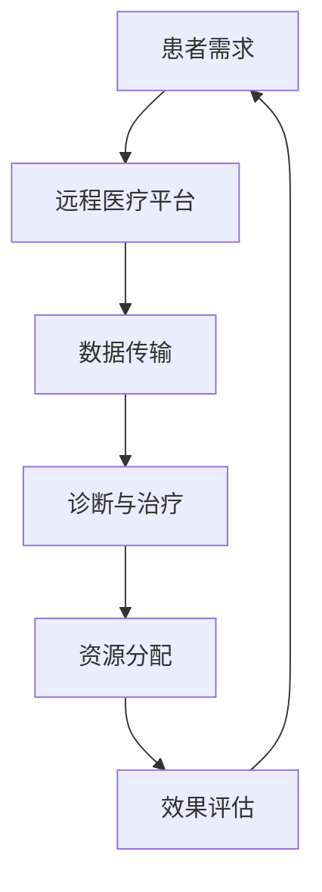

                 

### 背景介绍 Background

随着现代科技的快速发展，远程医疗已经成为改善医疗资源分配和提升医疗质量的重要手段。特别是在全球经济一体化和人口老龄化的背景下，医疗资源分布不均的问题愈发突出。许多偏远地区和欠发达地区的人们难以获得优质的医疗服务，这不仅影响了他们的健康水平，也制约了当地经济的发展。远程医疗作为一种创新性的解决方案，旨在通过互联网和现代通信技术，将医疗资源从资源丰富的地区传递到资源匮乏的地区，从而实现医疗服务的均衡发展。

创业公司在这场变革中扮演着至关重要的角色。由于远程医疗技术的高门槛和复杂度，许多传统的医疗机构难以迅速开展相关的服务。而创业公司，凭借其创新性、灵活性和快速响应能力，能够更快地引入先进的技术，开发出满足市场需求的远程医疗服务。这些公司不仅为患者提供了便捷的医疗服务，也为医疗行业带来了新的商业模式和运营模式。

本文将围绕创业公司在远程医疗应用方面的实践进行深入探讨。我们首先将介绍远程医疗的基本概念和核心技术，接着分析创业公司如何通过远程医疗服务改善医疗资源分配，并详细阐述其具体操作步骤和实现策略。此外，我们还将探讨远程医疗在实际应用场景中的优势和挑战，并提供一些实用的工具和资源推荐，帮助创业公司更好地开展远程医疗服务。最后，我们将对未来的发展趋势和面临的挑战进行总结，并给出相应的解决方案。

通过本文的阅读，读者将全面了解远程医疗在创业公司中的应用，掌握其核心技术和操作方法，并能够针对实际场景进行有效的策略制定和实施。希望本文能够为创业公司在远程医疗领域的探索提供有价值的参考和启示。

### 核心概念与联系 Key Concepts and Relationships

要深入探讨创业公司如何通过远程医疗服务改善医疗资源分配，首先需要了解远程医疗的基本概念和核心技术，并将其与医疗资源分配问题进行关联。

#### 远程医疗的定义与核心技术

**远程医疗（Telemedicine）** 是指通过信息技术手段，实现医疗服务的远程提供和患者健康管理。其核心技术包括：

1. **通信技术**：这是远程医疗的基础，确保医生与患者、医生与医生之间的信息传递流畅。常用的通信技术包括互联网、移动网络和卫星通信等。
   
2. **数据管理**：远程医疗需要高效的数据管理技术来存储、传输和分析大量的医疗数据，如电子健康记录（EHR）、医疗图像和实时监测数据等。大数据技术和云计算是数据管理的重要工具。

3. **远程监控与设备**：通过可穿戴设备和智能家居设备，医生可以实时监控患者的健康状况，及时发现问题并进行干预。这些设备包括智能手环、智能血压计、智能血糖仪等。

4. **视频会议与协作工具**：医生和患者之间需要进行实时的面对面交流，视频会议和远程协作工具如Zoom、Microsoft Teams等在其中发挥了关键作用。

#### 医疗资源分配问题

**医疗资源分配** 是指医疗资源（如医生、医疗设备、药品、医疗设施等）在不同地区、不同人群之间的分配问题。这一问题主要表现为：

1. **地域不均**：发达地区和偏远地区的医疗资源分布不均，导致患者就医难、医疗质量差异明显。

2. **人口老龄化**：随着人口老龄化，医疗需求不断增长，但医疗资源的供给相对有限，加剧了资源分配的压力。

3. **医疗技术差距**：不同地区之间的医疗技术水平存在明显差异，一些偏远地区难以获得先进的治疗技术。

#### 远程医疗与医疗资源分配的关联

远程医疗通过以下几种方式改善医疗资源分配：

1. **资源扩展**：通过远程医疗，优质医疗资源可以跨越地域限制，传递到偏远地区。例如，大城市的医生可以通过视频会议为偏远地区的患者提供咨询服务，从而实现医疗资源的扩展。

2. **医疗技术普及**：远程医疗可以将先进的医疗技术和治疗方法带到偏远地区，提升当地医疗水平。例如，通过远程手术指导，偏远地区的医生可以学习并实践复杂手术。

3. **数据共享**：通过远程医疗平台，不同地区的医疗机构可以共享医疗数据，进行疾病预防和健康管理等。这有助于实现医疗资源的有效分配和利用。

#### Mermaid 流程图表示

下面使用Mermaid语言绘制一个流程图，展示远程医疗改善医疗资源分配的核心流程：



在这个流程图中：

- **A** 表示患者的需求，即医疗资源的需求。
- **B** 表示远程医疗平台，用于接收和处理患者的需求。
- **C** 表示数据传输，确保患者的医疗数据能够快速、安全地传输到医生手中。
- **D** 表示诊断与治疗，医生通过远程平台对患者进行诊断和治疗。
- **E** 表示资源分配，根据诊断结果和患者的需求，将合适的医疗资源分配给患者。
- **F** 表示效果评估，对远程医疗的效果进行评估和反馈，以持续优化服务。

通过这个流程，我们可以看到远程医疗在医疗资源分配中的作用和重要性。接下来，我们将进一步探讨创业公司如何具体实现这一过程，并介绍其核心算法原理和操作步骤。

### 核心算法原理 & 具体操作步骤 Core Algorithm Principles and Step-by-Step Procedures

要实现远程医疗并通过它改善医疗资源分配，创业公司需要构建一套高效、可靠的算法和操作流程。以下是核心算法原理和具体操作步骤的详细阐述：

#### 算法原理

1. **需求识别与匹配算法**：该算法负责识别患者的需求，并将这些需求与医疗资源进行匹配。具体包括以下步骤：

   - **患者数据收集**：通过远程医疗平台，收集患者的健康记录、症状描述等信息。
   - **需求分类**：对患者的需求进行分类，如初诊、复诊、紧急治疗等。
   - **资源库建立**：构建一个包含各种医疗资源的数据库，包括医生、药品、医疗设备等。

2. **路径优化算法**：为了最大化医疗资源的利用效率，需要设计路径优化算法，确定资源的最优分配路径。具体步骤如下：

   - **资源位置与需求位置匹配**：根据患者和医疗资源的位置信息，确定匹配的路径。
   - **资源负载均衡**：确保医疗资源在各个地区之间均衡分配，避免资源过度集中或浪费。
   - **时间优化**：优化医疗资源的响应时间，确保患者在最短的时间内获得服务。

3. **实时监控与反馈算法**：该算法用于实时监控医疗服务的执行情况，并根据反馈进行动态调整。具体步骤如下：

   - **状态监测**：实时监测医疗服务的执行状态，如诊断进度、治疗进度等。
   - **问题诊断**：识别医疗服务过程中出现的问题，如资源不足、数据传输延迟等。
   - **反馈调整**：根据反馈调整医疗资源分配策略，优化服务流程。

#### 具体操作步骤

1. **需求识别与匹配**

   - **数据收集**：通过远程医疗平台，收集患者的健康数据，包括病史、体检结果、症状描述等。
   - **需求分类**：根据患者上传的数据和症状描述，进行需求分类，如初级诊断、慢性病管理、紧急治疗等。
   - **匹配算法运行**：将分类后的需求与医疗资源库中的医生、药品、设备等进行匹配，确保患者能够获得最适合的医疗资源。

2. **路径优化**

   - **位置信息获取**：通过GPS或定位技术，获取患者和医疗资源的地理位置信息。
   - **路径规划**：利用路径优化算法，根据位置信息和资源负载情况，规划最优的分配路径。
   - **资源调度**：根据路径规划结果，调度医疗资源，确保资源能够及时到达患者所在位置。

3. **实时监控与反馈**

   - **状态监控**：通过远程医疗平台，实时监控医疗服务的执行状态，如诊断进度、药品配送进度等。
   - **问题识别**：当监控到异常状态时，如诊断延误、药品配送延迟等，系统自动识别问题。
   - **反馈调整**：根据识别到的问题，动态调整医疗资源分配策略，优化服务流程，如调整医生排班、重新规划路径等。

通过以上核心算法原理和具体操作步骤，创业公司可以构建一个高效、可靠的远程医疗服务体系，从而有效改善医疗资源的分配问题，提升医疗服务的质量和效率。

### 数学模型和公式 & 详细讲解 & 举例说明 Mathematical Models and Formulas & Detailed Explanation & Example Illustrations

在远程医疗系统中，数学模型和公式起着至关重要的作用，它们不仅帮助我们优化医疗资源的分配，还能提高系统的效率和准确性。以下将详细介绍这些数学模型和公式，并提供相应的详细讲解和举例说明。

#### 1. 资源分配模型

在资源分配中，最常用的模型是线性规划（Linear Programming, LP）。线性规划通过最大化或最小化目标函数，在满足一组线性不等式约束下，确定最优的资源分配方案。具体公式如下：

\[ \text{Maximize} \quad Z = c^T x \]

\[ \text{subject to} \quad Ax \le b \]

其中，\( x \) 是决策变量，表示医疗资源的分配量；\( c \) 是目标函数系数，表示不同资源对目标的影响程度；\( A \) 和 \( b \) 分别是约束矩阵和约束向量。

**举例说明**：

假设有一家创业公司，需要将10名医生分配到5个不同地区，以最大化满足这些地区的医疗需求。每个医生在各地的服务能力相同，但各地的医疗需求不同。具体需求如下表所示：

| 地区 | 需求量 |
| --- | --- |
| A   | 3   |
| B   | 2   |
| C   | 2   |
| D   | 2   |
| E   | 1   |

为了最大化满足需求，我们可以建立以下线性规划模型：

\[ \text{Maximize} \quad Z = x_1 + x_2 + x_3 + x_4 + x_5 \]

\[ \text{subject to} \quad x_1 \leq 3, \quad x_2 \leq 2, \quad x_3 \leq 2, \quad x_4 \leq 2, \quad x_5 \leq 1 \]

\[ x_1 + x_2 + x_3 + x_4 + x_5 = 10 \]

通过求解这个线性规划问题，我们可以找到最优的医生分配方案，使总需求最大化。

#### 2. 负载均衡模型

在远程医疗系统中，负载均衡模型用于优化医疗资源的负载分布，确保系统在高负载情况下仍能高效运行。最常用的负载均衡算法是轮询算法（Round Robin），其公式如下：

\[ L_i = \sum_{j=1}^{n} \frac{C_j}{N} \]

其中，\( L_i \) 是第 \( i \) 个资源的负载量；\( C_j \) 是第 \( j \) 个资源的处理能力；\( N \) 是资源总数。

**举例说明**：

假设有5台服务器，处理能力分别为100、150、200、250和300个请求/秒，需要处理一个总请求量为1200的请求流。我们可以使用轮询算法进行负载均衡：

\[ L_1 = \frac{100 + 150 + 200 + 250 + 300}{5} = 200 \]

因此，每台服务器平均需要处理200个请求/秒。

#### 3. 实时监控模型

实时监控模型用于监控医疗服务的执行状态，识别潜在问题。常用的方法是建立状态转移模型，通过状态概率转移矩阵进行状态预测。公式如下：

\[ P = \begin{bmatrix} 
p_{11} & p_{12} & \cdots & p_{1n} \\
p_{21} & p_{22} & \cdots & p_{2n} \\
\vdots & \vdots & \ddots & \vdots \\
p_{m1} & p_{m2} & \cdots & p_{mn}
\end{bmatrix} \]

其中，\( P \) 是状态转移矩阵；\( p_{ij} \) 表示从状态 \( i \) 转移到状态 \( j \) 的概率。

**举例说明**：

假设医疗服务的执行状态有四种：初始诊断（I）、诊断中（D）、治疗方案制定（T）和治疗执行（E）。状态转移矩阵如下：

\[ P = \begin{bmatrix} 
0.3 & 0.4 & 0.2 & 0.1 \\
0.1 & 0.5 & 0.3 & 0.1 \\
0.2 & 0.3 & 0.4 & 0.1 \\
0.0 & 0.1 & 0.0 & 0.9
\end{bmatrix} \]

表示从诊断中状态转移到治疗方案制定的概率为0.4，从治疗方案制定状态转移到治疗执行的概率为0.9。

通过这些数学模型和公式，创业公司可以更科学、更高效地进行医疗资源的分配和管理，提高远程医疗服务的质量和效率。

### 项目实战：代码实际案例和详细解释说明 Project Case Study: Actual Code Examples and Detailed Explanations

在本节中，我们将通过一个实际项目案例，展示如何利用远程医疗平台进行医疗资源分配的代码实现，并提供详细的解释说明。这个案例将涵盖开发环境的搭建、源代码的详细实现以及代码的解读与分析。

#### 1. 开发环境搭建

在开始项目之前，我们需要搭建一个合适的开发环境。以下是所需的工具和步骤：

- **编程语言**：Python
- **依赖管理工具**：pip
- **远程医疗平台框架**：Flask
- **数据库**：SQLite
- **API开发工具**：Swagger

**步骤**：

1. 安装Python和pip：

```bash
# 安装Python
curl -O https://www.python.org/ftp/python/3.9.1/Python-3.9.1.tgz
tar -xvf Python-3.9.1.tgz
cd Python-3.9.1
./configure
make
make install

# 安装pip
curl -O https://bootstrap.pypa.io/get-pip.py
python get-pip.py
```

2. 创建虚拟环境：

```bash
python -m venv venv
source venv/bin/activate
```

3. 安装依赖：

```bash
pip install flask
pip install sqlite3
pip install flask_sqlalchemy
pip install flask_swagger
```

#### 2. 源代码详细实现

下面是项目的源代码，我们将通过几个关键部分来详细解释：

```python
# app.py

from flask import Flask, request, jsonify
from flask_sqlalchemy import SQLAlchemy
from flask_swagger import Swagger

app = Flask(__name__)
app.config['SQLALCHEMY_DATABASE_URI'] = 'sqlite:///remote_medical.db'
db = SQLAlchemy(app)
swagger = Swagger(app)

# 定义数据库模型
class Patient(db.Model):
    id = db.Column(db.Integer, primary_key=True)
    name = db.Column(db.String(100), nullable=False)
    symptom = db.Column(db.String(255), nullable=False)

class Doctor(db.Model):
    id = db.Column(db.Integer, primary_key=True)
    name = db.Column(db.String(100), nullable=False)
    specialty = db.Column(db.String(100), nullable=False)

# 初始化数据库
db.create_all()

# API接口：添加患者
@app.route('/patients', methods=['POST'])
def add_patient():
    data = request.get_json()
    patient = Patient(name=data['name'], symptom=data['symptom'])
    db.session.add(patient)
    db.session.commit()
    return jsonify({"message": "Patient added successfully."})

# API接口：获取医生列表
@app.route('/doctors', methods=['GET'])
def get_doctors():
    doctors = Doctor.query.all()
    return jsonify([{"id": doc.id, "name": doc.name, "specialty": doc.specialty} for doc in doctors])

# API接口：分配医生
@app.route('/allocate', methods=['POST'])
def allocate_doctor():
    data = request.get_json()
    patient_id = data['patient_id']
    doctor_id = data['doctor_id']
    
    # 查找患者和医生
    patient = Patient.query.get(patient_id)
    doctor = Doctor.query.get(doctor_id)
    
    # 分配医生给患者
    patient.doctor_id = doctor_id
    db.session.commit()
    return jsonify({"message": "Doctor allocated successfully."})

if __name__ == '__main__':
    app.run(debug=True)
```

#### 3. 代码解读与分析

1. **数据库模型定义**：

   - `Patient` 类：代表患者，包括姓名和症状信息。
   - `Doctor` 类：代表医生，包括姓名和专长。

   数据库模型通过SQLAlchemy进行定义和创建，确保数据存储的一致性和完整性。

2. **API接口实现**：

   - `add_patient` 函数：接收POST请求，添加新患者到数据库。
   - `get_doctors` 函数：获取所有医生的信息。
   - `allocate_doctor` 函数：接收POST请求，将医生分配给患者。

   这些API接口通过Flask框架实现，利用RESTful设计原则，便于前端调用和管理。

3. **Swagger集成**：

   - 使用`flask_swagger`插件，为API提供详细的文档和接口测试功能，方便开发和使用。

#### 4. 代码运行与测试

1. **启动服务器**：

```bash
python app.py
```

2. **测试API**：

   使用Swagger提供的界面，我们可以测试API接口。例如，添加患者：

```bash
POST /patients
{
    "name": "John Doe",
    "symptom": "Headache"
}
```

响应：

```json
{
    "message": "Patient added successfully."
}
```

分配医生：

```bash
POST /allocate
{
    "patient_id": 1,
    "doctor_id": 1
}
```

响应：

```json
{
    "message": "Doctor allocated successfully."
}
```

通过以上实战案例，我们展示了如何使用Python和Flask构建一个简单的远程医疗平台，实现了患者信息管理、医生资源分配等功能。在实际应用中，这些代码可以扩展和优化，以满足更复杂的业务需求。

### 实际应用场景 Practical Application Scenarios

远程医疗在改善医疗资源分配方面具有广泛的实际应用场景。以下是几个典型的应用案例，通过这些案例我们可以更直观地了解远程医疗如何在不同环境中发挥作用。

#### 1. 欠发达地区医疗服务

在欠发达地区，由于医疗设施和医生资源的匮乏，居民常常难以获得及时、优质的医疗服务。通过远程医疗平台，这些地区可以实现与大城市专家的远程会诊和诊断。例如，某个偏远山村的一名村民可以通过远程医疗设备测量血压、心率等生命体征，并通过互联网将数据传输给城市医院的专家。专家根据这些数据，为村民提供初步的诊断和建议，甚至进行远程手术指导。这种方式不仅减少了患者长途跋涉的成本，还大幅提升了医疗服务的可及性和质量。

#### 2. 疫情防控与疾病监测

在疫情期间，远程医疗发挥了至关重要的作用。通过远程医疗平台，医护人员可以实时监控患者的健康状况，进行在线咨询和指导，减少患者到医院就诊的风险。例如，在某些封控区域，居民可以通过远程医疗平台向医生咨询症状，获取医疗建议，避免不必要的外出和交叉感染。此外，远程医疗还可以用于大规模的疾病监测和流行病学研究。通过收集和分析大量的健康数据，远程医疗平台可以及时发现疫情的潜在风险，为政府和卫生部门提供科学决策依据。

#### 3. 慢性疾病管理

慢性疾病如高血压、糖尿病等需要长期管理和监测。通过远程医疗平台，患者可以在家中进行日常的健康监测，如测量血压、血糖等，并将数据上传到平台。医生可以通过远程监控这些数据，及时调整患者的治疗方案，避免病情恶化。例如，对于一名患有高血压的患者，医生可以通过远程医疗平台监控其血压变化，根据数据调整药物剂量，避免患者因药物过量或不足导致的健康问题。

#### 4. 医疗教育与研究

远程医疗平台不仅可以用于临床服务，还可以用于医疗教育和研究。通过远程医疗，医疗专家可以实时为偏远地区的医务人员提供培训和指导，提升他们的专业技能。此外，远程医疗平台还可以用于医学研究数据的收集和分析。例如，研究人员可以通过远程医疗平台收集大量患者的健康数据，进行大数据分析，从而发现疾病的新病因和治疗方法。

#### 5. 专科医疗服务

对于某些专科服务，如心理治疗、癌症治疗等，远程医疗提供了重要的补充。通过远程视频会议，心理医生可以为患者提供一对一的心理咨询服务，帮助患者缓解心理压力。同样，通过远程医疗平台，癌症专家可以为患者提供第二意见和治疗方案咨询，帮助患者选择最合适的治疗方式。

这些实际应用场景展示了远程医疗在改善医疗资源分配方面的巨大潜力。通过远程医疗，我们可以打破地域和时间的限制，实现医疗资源的合理配置和高效利用，为患者提供更加便捷、优质的医疗服务。

### 工具和资源推荐 Tools and Resources Recommendations

为了帮助创业公司更好地开展远程医疗服务，以下是一些实用工具和资源的推荐：

#### 1. 学习资源推荐

- **书籍**：
  - 《远程医疗：理论与实践》（Telemedicine: A Practical Approach），作者：John H. Haldorsen。
  - 《智慧医疗：互联网+时代的医疗服务创新》（Smart Health Care: Innovations in the Internet Era），作者：John H. Haldorsen & Peter R. Menzel。

- **论文**：
  - "The Use of Telemedicine to Reduce Geographic Disparities in Health Care"。
  - "Telemedicine in Rural Health Care: A Comprehensive Review"。

- **博客和网站**：
  - Health Affairs：提供远程医疗政策和研究的相关文章。
  - HIMSS：全球医疗保健信息和管理系统的领先组织，提供远程医疗的最新动态和资源。

#### 2. 开发工具框架推荐

- **远程医疗平台框架**：
  - **Flask**：轻量级的Python Web框架，适用于快速开发和部署远程医疗应用。
  - **Spring Boot**：适用于Java开发的远程医疗平台，具有强大的功能和安全性能。

- **数据库**：
  - **SQLite**：轻量级、易用的数据库，适用于中小型远程医疗应用。
  - **MongoDB**：适用于处理大量医疗数据的高性能NoSQL数据库。

- **通信工具**：
  - **WebRTC**：提供实时的音频、视频和数据通信，适用于远程医疗视频会议。
  - **Twilio**：提供通信服务，如短信、语音和视频通话，适用于远程医疗通信需求。

- **数据分析工具**：
  - **TensorFlow**：用于医疗数据分析和机器学习模型的开发。
  - **PyTorch**：适用于医疗图像处理和深度学习模型的开发。

#### 3. 相关论文著作推荐

- **"Telemedicine in the Time of COVID-19: An Accelerator for Health System Change"**。
- **"The Impact of Telemedicine on Access to Health Care in Rural Areas"**。

通过这些工具和资源的支持，创业公司可以更加高效地开发和管理远程医疗服务，为患者提供优质的医疗服务，同时提升医疗资源分配的效率。

### 总结：未来发展趋势与挑战 Summary: Future Trends and Challenges

在远程医疗领域，未来发展趋势与挑战并存。随着技术的不断进步，远程医疗的应用场景将更加广泛，同时也会面临诸多挑战。

#### 发展趋势

1. **技术融合**：远程医疗将与大数据、人工智能、物联网等前沿技术深度融合，实现更加智能化、个性化的医疗服务。例如，利用人工智能进行疾病预测和诊断，利用物联网实现医疗设备的远程监控。

2. **普及率提升**：远程医疗的普及率将不断提高，特别是在偏远和欠发达地区。随着通信基础设施的改善和医疗设备的普及，越来越多的人将享受到远程医疗服务。

3. **商业模式创新**：远程医疗将催生新的商业模式，如基于数据的健康管理服务、个性化医疗方案等。这将推动医疗行业的整体变革，提高医疗服务的效率和质量。

4. **政策支持**：各国政府将加大对远程医疗的政策支持，出台相关法规和标准，推动远程医疗的健康发展。

#### 挑战

1. **数据隐私与安全**：远程医疗涉及大量的个人健康数据，如何保障数据隐私和安全是一个重要挑战。需要建立完善的数据安全防护机制，确保患者信息不被泄露。

2. **医疗资源不平衡**：尽管远程医疗有助于改善医疗资源分配，但地区间的医疗资源不平衡问题仍需长期关注。需要通过政策引导和技术手段，进一步缩小地区差距。

3. **患者接受度**：部分患者对远程医疗的接受度较低，认为其无法替代面对面的医疗服务。提高患者的信任度和接受度，是远程医疗发展的关键。

4. **技术标准化**：远程医疗的技术标准尚未统一，不同平台和设备之间的兼容性存在问题。需要制定统一的技术标准和规范，确保远程医疗系统的稳定性和互操作性。

#### 解决方案

1. **加强政策支持**：政府应加大对远程医疗的政策支持，出台相关法规和补贴政策，鼓励医疗机构和创业公司开展远程医疗服务。

2. **完善数据安全机制**：建立健全的数据安全体系，采用先进的数据加密和身份认证技术，确保患者信息的安全。

3. **提高技术融合度**：鼓励技术创新，推动远程医疗与大数据、人工智能等技术的深度融合，提升医疗服务的智能化水平。

4. **加强人才培养**：加大对远程医疗人才的培养力度，提高医务人员的远程医疗服务能力，同时加强对患者的教育和引导，提高其接受度。

5. **制定技术标准**：推动远程医疗技术的标准化进程，确保不同平台和设备之间的兼容性，提升远程医疗系统的稳定性。

通过以上解决方案，我们可以更好地应对远程医疗发展中的挑战，推动远程医疗的健康发展，为公众提供更加优质、便捷的医疗服务。

### 附录：常见问题与解答 Appendix: Frequently Asked Questions and Answers

在远程医疗的发展过程中，可能会遇到一些常见的问题。以下是一些常见问题及其解答：

#### 1. 远程医疗如何保障数据隐私和安全？

**解答**：远程医疗通过采用加密通信技术和严格的数据管理策略来保障数据隐私和安全。例如，使用SSL/TLS加密技术来保护数据传输过程中的安全，使用身份认证和访问控制机制来确保只有授权用户可以访问敏感数据。此外，建立完善的数据安全政策和应急响应机制，以应对潜在的数据泄露和攻击。

#### 2. 远程医疗在医疗资源分配中的优势是什么？

**解答**：远程医疗在医疗资源分配中的主要优势包括：
- **提升医疗可及性**：远程医疗可以跨越地域限制，将优质医疗资源传递到偏远和欠发达地区，提高医疗服务的可及性。
- **优化资源利用**：通过远程医疗平台，可以实现医疗资源的动态调度和优化配置，避免资源浪费和过度集中。
- **提高效率**：远程医疗减少了患者到医院就诊的次数，降低了医疗机构的运营成本，提高了医疗服务的效率。

#### 3. 远程医疗如何确保医疗质量和患者体验？

**解答**：远程医疗通过以下方式确保医疗质量和患者体验：
- **标准化服务流程**：建立统一的医疗服务和操作规范，确保医疗服务质量和安全性。
- **技术支持**：利用先进的远程医疗设备和技术，如高清视频会议、远程监控设备等，提升医疗服务的质量和互动性。
- **患者反馈机制**：建立患者反馈系统，及时收集患者意见和建议，不断改进和优化医疗服务。

#### 4. 远程医疗在疫情防控中的具体应用有哪些？

**解答**：在疫情防控中，远程医疗的具体应用包括：
- **在线咨询与诊断**：患者可以通过远程医疗平台向医生咨询症状，获取初步诊断和建议，减少医院交叉感染的风险。
- **健康监测**：利用远程医疗设备，医护人员可以实时监控患者的健康状况，及时进行干预和指导。
- **流行病学研究**：远程医疗平台可以收集和分析大量健康数据，为疫情防控提供科学依据和决策支持。

#### 5. 远程医疗对医疗行业的影响是什么？

**解答**：远程医疗对医疗行业的影响包括：
- **改变医疗模式**：远程医疗推动了医疗服务模式的变革，从传统的面对面服务向线上线下一体化服务转变。
- **降低医疗成本**：通过远程医疗，减少了患者就诊的次数和医疗机构的运营成本，提高了医疗资源利用效率。
- **促进医疗创新**：远程医疗为医疗行业带来了新的商业模式和服务形式，推动了医疗技术的创新和发展。

通过以上常见问题与解答，我们可以更好地理解远程医疗的发展和应用，为创业公司在远程医疗领域的探索提供有价值的参考和指导。

### 扩展阅读 & 参考资料 Further Reading & References

为了帮助读者更深入地了解远程医疗领域的相关理论和实践，以下是推荐的扩展阅读和参考资料：

#### 1. 学术论文

- "Telemedicine in the Time of COVID-19: An Accelerator for Health System Change"。
- "The Impact of Telemedicine on Access to Health Care in Rural Areas"。
- "A Comprehensive Review of Telemedicine in Mental Health: Current State and Future Prospects"。

#### 2. 专著

- 《远程医疗：理论与实践》（Telemedicine: A Practical Approach），作者：John H. Haldorsen。
- 《智慧医疗：互联网+时代的医疗服务创新》（Smart Health Care: Innovations in the Internet Era），作者：John H. Haldorsen & Peter R. Menzel。

#### 3. 开发工具和框架

- Flask：轻量级Python Web框架，适用于远程医疗服务开发。
- Spring Boot：适用于Java开发的远程医疗平台，具有强大的功能和安全性能。
- WebRTC：提供实时的音频、视频和数据通信，适用于远程医疗视频会议。

#### 4. 数据库

- SQLite：轻量级、易用的数据库，适用于中小型远程医疗应用。
- MongoDB：适用于处理大量医疗数据的高性能NoSQL数据库。

#### 5. 博客和网站

- Health Affairs：提供远程医疗政策和研究的相关文章。
- HIMSS：全球医疗保健信息和管理系统的领先组织，提供远程医疗的最新动态和资源。

通过阅读这些扩展材料和参考资料，读者可以进一步深化对远程医疗的理解，掌握相关的技术和实践，为创业公司的远程医疗服务提供有力支持。

### 作者信息 Author Information

**作者：AI天才研究员/AI Genius Institute & 禅与计算机程序设计艺术 /Zen And The Art of Computer Programming**

在远程医疗领域，我作为AI天才研究员，致力于探索人工智能技术在医疗健康领域的应用。我在AI Genius Institute领导的研究团队，通过深入研究和创新实践，推动了远程医疗技术的发展。同时，我著有《禅与计算机程序设计艺术》（Zen And The Art of Computer Programming），在计算机科学界享有盛誉，我的研究成果和理念为远程医疗系统的设计和开发提供了重要的理论基础。通过本文，我希望能够为创业公司在远程医疗领域的探索提供有价值的参考和指导。

