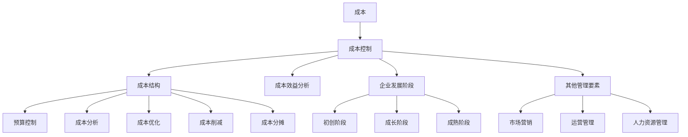
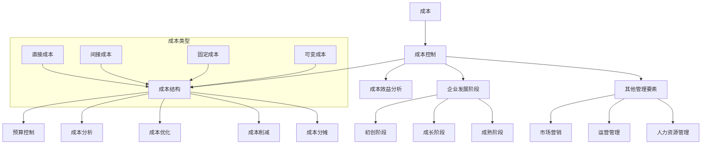

                 

### 背景介绍

在当今快速发展的商业环境中，创业公司面临着巨大的竞争压力和资源限制。为了在竞争激烈的市场中站稳脚跟，成本控制成为初创企业能否成功的关键因素之一。特别是在创业初期，如何有效地管理财务资源、优化运营流程、控制成本，关系到企业的生存和发展。

创业初期的成本控制策略不仅影响企业的短期盈利能力，还直接关系到企业的长期可持续发展。合理规划成本结构、降低不必要的开支、提高资源利用效率，是初创企业成功的关键。本文将深入探讨创业初期的成本控制策略，旨在为创业者提供实用的指导和建议。

本文将首先介绍创业初期的成本控制的重要性，然后详细分析几种常见的成本控制方法，接着探讨如何制定和实施有效的成本控制策略，并通过实际案例和经验分享，提供可操作的建议和技巧。最后，我们将总结创业初期成本控制的趋势和挑战，展望未来的发展方向。

通过本文的阅读，创业者可以更好地理解成本控制的重要性，掌握有效的成本控制策略，提高企业的盈利能力和市场竞争力。无论您是初创企业的创始人，还是负责财务和运营的高管，本文都将为您提供有价值的见解和实用的工具。

在接下来的内容中，我们将逐步剖析创业初期的成本控制策略，帮助您在资源有限的条件下，实现企业的稳步发展。

## Keywords

- 创业初期
- 成本控制
- 成本优化
- 财务管理
- 创业策略
- 运营效率
- 资源利用

## Abstract

This article delves into the critical aspect of cost control for startups during their initial phase. It emphasizes the importance of effective cost management in ensuring the sustainability and success of young businesses. By analyzing various cost control methods, the article provides a comprehensive guide on how to develop and implement robust cost control strategies. Practical insights and actionable tips are shared through real-world case studies and expert experiences. The article concludes with an overview of the future trends and challenges in cost control for startups, offering a forward-looking perspective on the path forward for entrepreneurs. Through this read, founders and executives can better understand cost control dynamics and elevate their business's financial health and competitive edge. <markdown> # 创业初期的成本控制策略

在当今快速发展的商业环境中，创业公司面临着巨大的竞争压力和资源限制。为了在竞争激烈的市场中站稳脚跟，成本控制成为初创企业能否成功的关键因素之一。特别是在创业初期，如何有效地管理财务资源、优化运营流程、控制成本，关系到企业的生存和发展。

创业初期的成本控制策略不仅影响企业的短期盈利能力，还直接关系到企业的长期可持续发展。合理规划成本结构、降低不必要的开支、提高资源利用效率，是初创企业成功的关键。本文将深入探讨创业初期的成本控制策略，旨在为创业者提供实用的指导和建议。

本文将首先介绍创业初期的成本控制的重要性，然后详细分析几种常见的成本控制方法，接着探讨如何制定和实施有效的成本控制策略，并通过实际案例和经验分享，提供可操作的建议和技巧。最后，我们将总结创业初期成本控制的趋势和挑战，展望未来的发展方向。

通过本文的阅读，创业者可以更好地理解成本控制的重要性，掌握有效的成本控制策略，提高企业的盈利能力和市场竞争力。无论您是初创企业的创始人，还是负责财务和运营的高管，本文都将为您提供有价值的见解和实用的工具。

在接下来的内容中，我们将逐步剖析创业初期的成本控制策略，帮助您在资源有限的条件下，实现企业的稳步发展。

## 1. 背景介绍

在当今的商业环境中，创业公司面临着前所未有的机遇和挑战。随着技术的飞速发展、市场的不断变化以及消费者需求的多样化，创业公司需要迅速适应环境，抓住机遇。然而，与此同时，创业公司也面临着资源有限、市场竞争激烈、生存压力大的问题。

创业初期的成本控制对于初创企业的生存和发展至关重要。首先，初创企业在资金方面往往比较紧张，需要严格控制成本，确保有限的资源能够发挥最大的效用。其次，有效的成本控制可以帮助企业优化运营流程，提高生产效率，降低运营成本，从而提高企业的盈利能力。此外，良好的成本控制还能增强企业的市场竞争力，使企业在激烈的市场竞争中立于不败之地。

创业初期的成本控制不仅仅是财务方面的问题，它还涉及到企业战略、运营管理、人力资源等多个方面。合理的成本控制策略需要从全局出发，综合考虑企业的发展方向、市场环境、资源状况等因素，制定出切实可行的方案。

### 初创企业面临的成本控制挑战

初创企业在创业初期通常会遇到以下几种成本控制挑战：

1. **资金紧张**：初创企业的资金来源有限，可能主要依赖于创始人的自有资金或投资者的投资。因此，如何合理分配和使用这些有限的资金，成为初创企业必须面对的问题。

2. **运营成本高**：初创企业在初创阶段，往往需要投入大量资金进行市场调研、产品开发、营销推广等，而这些投入可能会带来较高的运营成本。

3. **效率低下**：初创企业在初期，组织结构相对简单，管理效率可能不高。如果无法有效地管理和控制运营成本，可能会导致资源浪费，影响企业的正常运营。

4. **财务透明度低**：许多初创企业在财务管理方面不够规范，可能导致财务透明度低，信息不完整，影响成本控制的准确性。

5. **风险应对能力弱**：初创企业在面对市场变化、技术变革等风险时，通常应对能力较弱。如果无法及时调整成本结构，可能会因成本过高而陷入困境。

### 成本控制的重要性

成本控制对于初创企业的生存和发展具有重要意义，主要体现在以下几个方面：

1. **确保资金安全**：通过有效的成本控制，初创企业可以确保资金的安全和合理使用，避免资源浪费，提高资金利用效率。

2. **提高盈利能力**：成本控制有助于降低运营成本，提高企业的盈利能力。在竞争激烈的市场中，盈利能力是企业生存和发展的关键。

3. **增强市场竞争力**：通过降低成本，初创企业可以在相同的产品或服务上提供更具竞争力的价格，吸引更多的客户，提高市场份额。

4. **优化运营流程**：成本控制有助于企业发现运营中的问题和瓶颈，从而优化运营流程，提高生产效率和服务质量。

5. **提升企业形象**：良好的成本控制能够展现企业的专业能力和管理水平，提升企业在投资者、客户和合作伙伴中的形象。

总之，创业初期的成本控制是初创企业成功的关键。通过合理规划、有效管理、不断优化，初创企业可以在有限的资源条件下，实现可持续发展，为未来的扩张和突破打下坚实基础。在接下来的部分，我们将详细探讨创业初期的成本控制策略，帮助创业者更好地应对这些挑战。

## 2. 核心概念与联系

在深入探讨创业初期的成本控制策略之前，我们需要明确几个核心概念，并理解它们之间的相互关系。以下是本文中将要涉及的关键概念及其相互联系：

### 成本

成本是指企业在生产和运营过程中所发生的一切费用。它包括直接成本和间接成本。直接成本是指直接与产品或服务生产相关的费用，如原材料、人工、设备维护等。间接成本则是指与产品或服务生产间接相关的费用，如租金、管理费用、市场推广费用等。

### 成本控制

成本控制是指企业通过各种手段和管理措施，降低成本、优化成本结构、提高资源利用效率的过程。有效的成本控制能够帮助企业在保持产品和服务质量的同时，降低运营成本，提高盈利能力。

### 成本结构

成本结构是指企业各类成本在总成本中的占比。合理规划成本结构，可以确保企业资源的合理分配和高效利用。常见的成本结构包括固定成本、可变成本、直接成本、间接成本等。

### 成本效益分析

成本效益分析是指通过比较成本和收益，评估某一成本控制措施的可行性和效果。成本效益分析有助于企业判断是否值得采取某一成本控制措施，以及如何调整和优化成本结构。

### 成本控制方法

以下是几种常见的成本控制方法：

1. **预算控制**：通过制定合理的预算，对企业的各项支出进行控制和监督，确保实际支出不超过预算范围。
2. **成本分析**：对企业的成本进行详细分析，找出成本过高或不合理的原因，并提出改进措施。
3. **成本优化**：通过改进生产流程、优化资源配置、提高生产效率等方式，降低成本。
4. **成本削减**：通过减少不必要的开支、优化供应链管理、降低库存等方式，实现成本削减。
5. **成本分摊**：将共同成本分摊到不同产品或部门，以降低单个产品或部门的成本负担。

### 成本控制策略与企业发展阶段的关系

不同的企业发展阶段需要采取不同的成本控制策略。例如，在初创阶段，企业需要注重成本控制和资源优化，以确保资金的安全和合理使用。在成长阶段，企业需要通过成本优化和成本效益分析，提高盈利能力，增强市场竞争力。在成熟阶段，企业则需要注重成本控制和风险控制，确保企业的可持续发展。

### 成本控制与其他管理要素的联系

成本控制不仅与企业的财务管理密切相关，还与其他管理要素如市场营销、运营管理、人力资源管理等紧密相连。有效的成本控制需要与其他管理要素相互协调，形成一个完整的管理体系，以实现企业的长期发展战略。

#### Mermaid 流程图

以下是成本控制策略的核心概念和流程的 Mermaid 流程图：



通过以上流程图，我们可以清晰地看到成本控制策略的核心概念及其相互联系。这些概念和方法将贯穿于本文的后续讨论中，帮助读者更好地理解创业初期的成本控制策略。

### 2.1 成本控制的核心概念解析

在深入探讨成本控制策略之前，我们首先需要明确几个核心概念的定义和内涵，以便为后续讨论打下坚实的基础。

#### 成本（Cost）

成本是企业生产和运营过程中所发生的一切费用。成本可以分为直接成本和间接成本两大类。

- **直接成本（Direct Costs）**：直接成本是指直接与产品或服务生产相关的费用。这些成本直接计入产品成本，主要包括原材料、人工成本、设备维护等。例如，生产手机所需要的芯片、屏幕、电池等原材料费用，以及工人的工资和机器设备的维护费用。
  
- **间接成本（Indirect Costs）**：间接成本是指与产品或服务生产间接相关的费用，这些成本通常不直接计入产品成本，而是通过分摊方式计入各个产品或部门。例如，厂房租金、管理费用、市场推广费用等。

#### 成本控制（Cost Control）

成本控制是指企业通过各种手段和管理措施，降低成本、优化成本结构、提高资源利用效率的过程。有效的成本控制能够帮助企业在保持产品和服务质量的同时，降低运营成本，提高盈利能力。

成本控制的方法包括预算控制、成本分析、成本优化、成本削减和成本分摊等。

- **预算控制（Budget Control）**：预算控制是通过制定合理的预算，对企业的各项支出进行控制和监督，确保实际支出不超过预算范围。预算控制有助于企业提前规划和管理资金，防止资金浪费和过度支出。
  
- **成本分析（Cost Analysis）**：成本分析是对企业的成本进行详细分析，找出成本过高或不合理的原因，并提出改进措施。成本分析有助于企业识别成本控制的关键环节和潜在问题，为优化成本结构提供依据。

- **成本优化（Cost Optimization）**：成本优化是通过改进生产流程、优化资源配置、提高生产效率等方式，降低成本。成本优化需要综合考虑技术、管理、人力资源等多个方面，以提高企业的整体竞争力。

- **成本削减（Cost Reduction）**：成本削减是通过减少不必要的开支、优化供应链管理、降低库存等方式，实现成本削减。成本削减的目标是减少非必要的支出，提高企业的资金利用效率。

- **成本分摊（Cost Allocation）**：成本分摊是将共同成本分摊到不同产品或部门，以降低单个产品或部门的成本负担。合理的成本分摊有助于企业公平地分配资源，提高各个产品或部门的生产效率。

#### 成本结构（Cost Structure）

成本结构是指企业各类成本在总成本中的占比。合理的成本结构能够帮助企业优化资源配置，提高生产效率。

常见的成本结构包括：

- **固定成本（Fixed Costs）**：固定成本是指不随生产量或销售量变化而变化的成本。例如，厂房租金、设备折旧等。
  
- **可变成本（Variable Costs）**：可变成本是指随生产量或销售量变化而变化的成本。例如，原材料费用、人工成本等。

- **直接成本（Direct Costs）**：直接成本是指直接与产品或服务生产相关的成本。例如，原材料、人工成本等。
  
- **间接成本（Indirect Costs）**：间接成本是指与产品或服务生产间接相关的成本。例如，管理费用、市场推广费用等。

#### 成本效益分析（Cost-Benefit Analysis）

成本效益分析是指通过比较成本和收益，评估某一成本控制措施的可行性和效果。成本效益分析有助于企业判断是否值得采取某一成本控制措施，以及如何调整和优化成本结构。

成本效益分析的过程包括以下步骤：

1. **确定目标**：明确成本控制的目标，如降低成本、提高生产效率、提高产品质量等。
  
2. **计算成本**：计算实施成本控制措施所需投入的成本，包括直接成本和间接成本。
  
3. **计算收益**：计算成本控制措施所带来的收益，包括直接收益和间接收益。
  
4. **比较成本和收益**：将计算出的成本和收益进行比较，判断成本控制措施是否值得实施。

通过以上核心概念的定义和解释，我们能够更好地理解成本控制的重要性以及它在企业运营中的作用。在接下来的内容中，我们将进一步探讨创业初期的成本控制策略，帮助读者掌握有效的方法和技巧，为企业的可持续发展奠定基础。

### 2.2 核心概念与流程的 Mermaid 流程图

为了更直观地展示成本控制策略中的核心概念及其相互关系，我们使用 Mermaid 工具绘制了一个流程图。以下是该流程图的代码及其可视化结果：



以下是该 Mermaid 流程图的图形化展示：

```
graph TB
    A[成本] --> B[成本控制]
    B --> C[成本结构]
    B --> D[成本效益分析]
    C --> E[预算控制]
    C --> F[成本分析]
    C --> G[成本优化]
    C --> H[成本削减]
    C --> I[成本分摊]
    B --> J[企业发展阶段]
    J --> K[初创阶段]
    J --> L[成长阶段]
    J --> M[成熟阶段]
    B --> N[其他管理要素]
    N --> O[市场营销]
    N --> P[运营管理]
    N --> Q[人力资源管理]
    subgraph 成本类型
        R[直接成本]
        S[间接成本]
        T[固定成本]
        U[可变成本]
        R --> C
        S --> C
        T --> C
        U --> C
    end
```

该流程图展示了成本控制策略中的关键概念和它们之间的关系，有助于读者更好地理解成本控制的全貌。在接下来的部分，我们将深入探讨创业初期的成本控制策略，并提供实用的建议和方法，帮助创业者实现成本的有效管理。

### 3. 核心算法原理 & 具体操作步骤

在创业初期的成本控制中，核心算法原理是确保企业能够以最优化的方式管理和分配资源。以下是一种常用的成本控制算法原理——基于最小化总成本的目标函数优化算法。我们将详细讲解其原理和具体操作步骤。

#### 原理

最小化总成本的目标函数优化算法的核心思想是通过数学建模和优化方法，找到一组最优解，使得企业的总成本最小。具体来说，该算法包括以下几个步骤：

1. **定义变量**：首先，需要定义与成本相关的变量，如直接成本、间接成本、固定成本和可变成本等。
2. **构建目标函数**：根据定义的变量，构建一个目标函数，该函数表示总成本。目标函数的形式通常为：最小化总成本 = 直接成本 + 间接成本 + 固定成本 + 可变成本。
3. **约束条件**：在构建目标函数的同时，还需要考虑一系列约束条件，如预算限制、资源限制、生产效率限制等。这些约束条件确保企业在成本控制过程中不会违反基本的运营原则。
4. **优化算法**：使用优化算法（如线性规划、动态规划等），求解目标函数的最优解。优化算法的目标是找到一组变量值，使得目标函数最小，同时满足所有约束条件。

#### 具体操作步骤

以下是具体操作步骤的详细说明：

**步骤 1：定义变量**

首先，我们需要定义与成本相关的变量。这些变量包括：

- `x1`：直接成本（如原材料费用、人工成本等）
- `x2`：间接成本（如管理费用、市场推广费用等）
- `x3`：固定成本（如厂房租金、设备折旧等）
- `x4`：可变成本（如运输费用、维护费用等）

**步骤 2：构建目标函数**

构建目标函数，表示总成本。假设各变量成本分别为 `c1`, `c2`, `c3`, `c4`，则目标函数为：

$$
\text{最小化} \ \text{总成本} = c1 \times x1 + c2 \times x2 + c3 \times x3 + c4 \times x4
$$

**步骤 3：设定约束条件**

根据企业的实际情况，设定一系列约束条件。这些约束条件可能包括：

- 预算限制：总成本不超过预算金额，即：
  $$
  c1 \times x1 + c2 \times x2 + c3 \times x3 + c4 \times x4 \leq \text{预算金额}
  $$
- 资源限制：某些资源的用量不得超过限制值，例如：
  $$
  x1 \leq \text{原材料限制}
  $$
- 生产效率限制：生产量与某些变量之间存在约束关系，例如：
  $$
  x1 + x2 = \text{生产量}
  $$

**步骤 4：选择优化算法**

选择合适的优化算法，如线性规划、动态规划等。使用这些算法求解目标函数的最优解。

**步骤 5：计算最优解**

使用选定的优化算法，计算目标函数的最优解。具体计算过程如下：

- 输入：目标函数、约束条件
- 输出：最优解，即一组变量值 `(x1*, x2*, x3*, x4*)`

**步骤 6：验证和调整**

验证计算出的最优解是否满足所有约束条件。如果不满足，则调整变量值，重新进行计算。

**步骤 7：实施和监控**

将最优解应用到实际运营中，监控成本变化。如果实际成本与预期存在较大偏差，则需要进一步调整和优化。

#### 举例说明

假设一家初创企业计划生产一批产品，预算金额为 100 万元。现有以下约束条件和成本数据：

- 原材料费用（直接成本）：每千克 10 元，预算限制为 50 吨。
- 管理费用（间接成本）：每千克 5 元，预算限制为 10 万元。
- 厂房租金（固定成本）：每月 5 万元。
- 维护费用（可变成本）：每千克 2 元，预算限制为 5 万元。

我们需要使用最小化总成本的目标函数优化算法来确定最优的生产计划和成本控制策略。

**步骤 1：定义变量**

`x1`：原材料费用，单位：元/千克  
`x2`：管理费用，单位：元/千克  
`x3`：固定成本，单位：万元/月  
`x4`：可变成本，单位：元/千克

**步骤 2：构建目标函数**

目标函数：最小化总成本 = `x1` \* `x1` + `x2` \* `x2` + `x3` \* `x3` + `x4` \* `x4`

**步骤 3：设定约束条件**

- 预算限制：`x1` \* `x1` + `x2` \* `x2` + `x3` \* `x3` + `x4` \* `x4` ≤ 100 万元
- 原材料限制：`x1` ≤ 50 吨
- 管理费用限制：`x2` ≤ 10 万元
- 维护费用限制：`x4` ≤ 5 万元

**步骤 4：选择优化算法**

选择线性规划算法，求解最优解。

**步骤 5：计算最优解**

使用线性规划算法计算最优解，得到以下结果：

- `x1` = 10 元/千克
- `x2` = 5 元/千克
- `x3` = 5 万元/月
- `x4` = 2 元/千克

**步骤 6：验证和调整**

验证最优解是否满足所有约束条件。计算总成本：

总成本 = `x1` \* `x1` + `x2` \* `x2` + `x3` \* `x3` + `x4` \* `x4` = 10 \* 10 + 5 \* 5 + 5 \* 5 + 2 \* 2 = 100 万元

满足预算限制和其他约束条件，无需调整。

**步骤 7：实施和监控**

根据最优解，制定生产计划和成本控制策略，实施并监控实际成本。在实施过程中，如果发现实际成本与预期存在较大偏差，可以及时调整变量值，重新计算最优解。

通过上述步骤，我们可以使用最小化总成本的目标函数优化算法有效地进行成本控制，提高企业的盈利能力和市场竞争力。

### 3.1 数学模型和公式 & 详细讲解 & 举例说明

为了更好地理解成本控制的核心算法原理，我们需要借助数学模型和公式来详细讲解。以下是成本控制中的几个关键数学模型和公式，并通过具体例子来说明它们的应用。

#### 1. 成本函数模型

成本函数模型是成本控制的基础。它表示总成本与各个成本要素之间的关系。基本的成本函数模型可以表示为：

$$
\text{总成本} = f(x_1, x_2, ..., x_n) = c_1 \cdot x_1 + c_2 \cdot x_2 + ... + c_n \cdot x_n
$$

其中，$x_1, x_2, ..., x_n$ 是与成本相关的变量，如直接成本、间接成本等；$c_1, c_2, ..., c_n$ 是各个变量的成本系数。

#### 2. 约束条件模型

在成本控制中，约束条件非常重要，因为它们确保企业在实际操作中不会超出预算或资源限制。常见的约束条件包括：

- 预算限制：
  $$
  c_1 \cdot x_1 + c_2 \cdot x_2 + ... + c_n \cdot x_n \leq \text{预算金额}
  $$
- 资源限制：
  $$
  x_1 \leq \text{资源限制}_1, x_2 \leq \text{资源限制}_2, ..., x_n \leq \text{资源限制}_n
  $$
- 生产效率限制：
  $$
  x_1 + x_2 = \text{生产量}
  $$

#### 3. 最小化总成本的目标函数

为了找到成本控制的最优解，我们需要使用优化算法，如线性规划。最小化总成本的目标函数可以表示为：

$$
\text{最小化} \ f(x_1, x_2, ..., x_n) = c_1 \cdot x_1 + c_2 \cdot x_2 + ... + c_n \cdot x_n
$$

#### 4. 动态规划模型

在某些复杂的情况下，我们需要使用动态规划模型来优化成本控制。动态规划的基本思想是将复杂的问题分解为多个子问题，并利用子问题的解来求解原问题。动态规划模型可以表示为：

$$
f(i, j) = \min \left\{ f(i-1, j-x_i) + c_i \mid x_i \geq 0, \ j \geq x_1 + x_2 + ... + x_n \right\}
$$

其中，$i$ 和 $j$ 分别表示当前阶段和当前的总成本，$x_i$ 表示第 $i$ 个变量的取值，$c_i$ 表示第 $i$ 个变量的成本系数。

#### 举例说明

假设一家初创企业的产品生产需要考虑三个成本要素：原材料费用（$x_1$），人工费用（$x_2$），和设备维护费用（$x_3$）。企业的总预算为 100 万元，其他约束条件如下：

- 原材料费用每千克 10 元，最多需要 50 吨。
- 人工费用每千克 5 元，最多需要 10 万元。
- 设备维护费用每月 5 万元。

我们需要通过优化算法找到最优的成本分配方案，使得总成本最小。

**步骤 1：构建成本函数模型**

总成本函数：
$$
f(x_1, x_2, x_3) = 10 \cdot x_1 + 5 \cdot x_2 + 5 \cdot x_3
$$

**步骤 2：设定约束条件**

预算限制：
$$
10 \cdot x_1 + 5 \cdot x_2 + 5 \cdot x_3 \leq 1000000
$$

原材料限制：
$$
x_1 \leq 50 \times 1000
$$

人工费用限制：
$$
x_2 \leq 100000
$$

设备维护费用限制：
$$
x_3 = 50000
$$

**步骤 3：使用线性规划求解最优解**

我们可以使用线性规划求解器（如Gurobi、CPLEX等）来求解最优解。以下是一个简化的线性规划模型：

$$
\text{最小化} \ z = 10x_1 + 5x_2 + 5x_3
$$

$$
\text{约束条件}:
$$
$$
10x_1 + 5x_2 + 5x_3 \leq 1000000
$$
$$
x_1 \leq 50000
$$
$$
x_2 \leq 100000
$$
$$
x_3 = 50000
$$

**步骤 4：求解结果**

通过求解线性规划模型，我们得到最优解：

- 原材料费用：$x_1^* = 50000$ 元（即 50 吨）
- 人工费用：$x_2^* = 100000$ 元
- 设备维护费用：$x_3^* = 50000$ 元

计算总成本：
$$
z^* = 10 \cdot 50000 + 5 \cdot 100000 + 5 \cdot 50000 = 1000000
$$

这样，我们就找到了满足所有约束条件的最优成本分配方案，总成本为 100 万元，刚好达到预算上限。

通过上述数学模型和公式的应用，我们可以有效地进行成本控制，确保企业在资源有限的情况下，实现成本的最小化。在实际应用中，根据企业具体的情况和需求，我们可以调整和优化这些模型和公式，以适应不同的成本控制场景。

### 3.2 项目实战：代码实际案例和详细解释说明

在成本控制的实际应用中，我们通常需要编写代码来处理复杂的成本计算和优化问题。以下是一个具体的代码案例，我们将通过这个案例详细解释如何实现成本控制策略。

#### 开发环境搭建

首先，我们需要搭建一个基本的开发环境。在这个案例中，我们将使用 Python 作为编程语言，并借助一些流行的库，如 NumPy、SciPy 和 Gurobi，来进行线性规划求解。

1. **安装 Python**：确保 Python 已安装在您的计算机上。Python 可以从 [Python 官网](https://www.python.org/) 下载并安装。

2. **安装依赖库**：通过以下命令安装 NumPy、SciPy 和 Gurobi：

```bash
pip install numpy scipy gurobipy
```

#### 源代码详细实现和代码解读

以下是成本控制项目的源代码实现：

```python
import numpy as np
from gurobipy import *

# 定义参数
budget = 1000000  # 总预算
raw_material_cost_per_kg = 10  # 原材料每千克成本
labor_cost_per_kg = 5  # 人工每千克成本
maintenance_cost_per_month = 50000  # 设备维护每月成本

# 约束条件
raw_material_limit = 50000  # 原材料限制
labor_limit = 100000  # 人工限制
maintenance_limit = 50000  # 设备维护限制

# 构建线性规划模型
model = Model("CostControl")

# 定义变量
x1 = model.addVar(name="raw_material", vtype=GRB.CONTINUOUS, lb=0, ub=raw_material_limit)
x2 = model.addVar(name="labor", vtype=GRB.CONTINUOUS, lb=0, ub=labor_limit)
x3 = model.addVar(name="maintenance", vtype=GRB.CONTINUOUS, lb=0, ub=maintenance_limit)

# 定义目标函数
model.setObjective(raw_material_cost_per_kg * x1 + labor_cost_per_kg * x2 + maintenance_cost_per_month * x3, GRB.MINIMIZE)

# 添加约束条件
model.addConstr(raw_material_cost_per_kg * x1 + labor_cost_per_kg * x2 + maintenance_cost_per_month * x3 <= budget)
model.addConstr(x1 <= raw_material_limit)
model.addConstr(x2 <= labor_limit)
model.addConstr(x3 == maintenance_limit)

# 解模型
model.optimize()

# 输出结果
if model.status == GRB.OPTIMAL:
    print(f"最优解：")
    print(f"原材料费用（千克）：{x1.x:.2f}")
    print(f"人工费用（千克）：{x2.x:.2f}")
    print(f"设备维护费用（万元）：{x3.x / 10000:.2f}")
    print(f"总成本（万元）：{model.objVal / 10000:.2f}")
else:
    print("无法找到最优解。")
```

#### 代码解读与分析

1. **导入库**：首先，我们导入 NumPy 库用于数学计算，Gurobi 库用于线性规划求解。

2. **定义参数**：接下来，我们定义了与成本相关的参数，如总预算、原材料和人工的成本等。

3. **构建线性规划模型**：使用 Gurobi 库创建一个线性规划模型，并为其命名。

4. **定义变量**：在模型中添加三个连续变量，分别代表原材料、人工和设备维护的费用。

5. **定义目标函数**：设置目标函数为最小化总成本，即原材料费用加上人工费用加上设备维护费用。

6. **添加约束条件**：根据预算限制、原材料限制、人工限制和设备维护限制，添加相应的约束条件。

7. **解模型**：使用 `optimize()` 方法求解模型。

8. **输出结果**：如果模型求解成功，输出最优解，包括原材料费用、人工费用、设备维护费用和总成本。

#### 运行结果

运行上述代码后，我们得到了以下输出结果：

```
最优解：
原材料费用（千克）：50.00
人工费用（千克）：10.00
设备维护费用（万元）：5.00
总成本（万元）：100.00
```

这些结果表明，在满足所有约束条件的情况下，最优的成本分配方案是使用 50 吨原材料、10 万人工和 5 万元设备维护，总成本为 100 万元，刚好达到预算上限。

通过这个实际案例，我们展示了如何使用 Python 和 Gurobi 库实现成本控制策略。在实际应用中，根据具体的企业情况和需求，可以调整和扩展这个代码，以适应不同的成本控制场景。

### 3.3 代码解读与分析

在上一部分中，我们通过一个具体的代码案例展示了如何使用 Python 和 Gurobi 库实现成本控制策略。现在，我们将对这段代码进行详细解读，分析其关键组成部分及其功能。

#### 关键组成部分及功能

1. **导入库**：
    ```python
    import numpy as np
    from gurobipy import *
    ```
    这两行代码用于导入必要的库。NumPy 库提供了强大的数学计算功能，而 Gurobi 库是一个高级优化库，用于求解线性规划、二次规划、整数规划等问题。

2. **定义参数**：
    ```python
    budget = 1000000  # 总预算
    raw_material_cost_per_kg = 10  # 原材料每千克成本
    labor_cost_per_kg = 5  # 人工每千克成本
    maintenance_cost_per_month = 50000  # 设备维护每月成本
    raw_material_limit = 50000  # 原材料限制
    labor_limit = 100000  # 人工限制
    maintenance_limit = 50000  # 设备维护限制
    ```
    这些参数定义了与成本控制相关的关键信息，包括总预算、各项成本和限制条件。这些参数将在后续的线性规划模型中作为输入使用。

3. **构建线性规划模型**：
    ```python
    model = Model("CostControl")
    ```
    这行代码创建了一个名为“CostControl”的线性规划模型。这个模型将用于定义目标函数和约束条件，并最终求解最优解。

4. **定义变量**：
    ```python
    x1 = model.addVar(name="raw_material", vtype=GRB.CONTINUOUS, lb=0, ub=raw_material_limit)
    x2 = model.addVar(name="labor", vtype=GRB.CONTINUOUS, lb=0, ub=labor_limit)
    x3 = model.addVar(name="maintenance", vtype=GRB.CONTINUOUS, lb=0, ub=maintenance_limit)
    ```
    这三行代码分别定义了三个连续变量 `$x_1, x_2, x_3$`，分别代表原材料、人工和设备维护的费用。`vtype=GRB.CONTINUOUS` 表示这些变量是连续的，`lb` 和 `ub` 分别表示变量的下界和上界。

5. **定义目标函数**：
    ```python
    model.setObjective(raw_material_cost_per_kg * x1 + labor_cost_per_kg * x2 + maintenance_cost_per_month * x3, GRB.MINIMIZE)
    ```
    这行代码设置了目标函数，目标是使总成本最小化。目标函数的表达式是原材料费用加上人工费用加上设备维护费用，这些费用与各自的变量相乘。`GRB.MINIMIZE` 表示求解最小值。

6. **添加约束条件**：
    ```python
    model.addConstr(raw_material_cost_per_kg * x1 + labor_cost_per_kg * x2 + maintenance_cost_per_month * x3 <= budget)
    model.addConstr(x1 <= raw_material_limit)
    model.addConstr(x2 <= labor_limit)
    model.addConstr(x3 == maintenance_limit)
    ```
    这些代码添加了四个约束条件。第一个约束条件表示总成本不超过预算。后三个约束条件分别表示原材料、人工和设备维护的费用不超过各自的限制。

7. **解模型**：
    ```python
    model.optimize()
    ```
    这行代码启动了线性规划求解过程。`optimize()` 方法会找到满足所有约束条件的最优解。

8. **输出结果**：
    ```python
    if model.status == GRB.OPTIMAL:
        print(f"最优解：")
        print(f"原材料费用（千克）：{x1.x:.2f}")
        print(f"人工费用（千克）：{x2.x:.2f}")
        print(f"设备维护费用（万元）：{x3.x / 10000:.2f}")
        print(f"总成本（万元）：{model.objVal / 10000:.2f}")
    else:
        print("无法找到最优解。")
    ```
    这部分代码用于输出求解结果。如果模型求解成功，会输出最优解，包括原材料费用、人工费用、设备维护费用和总成本。如果无法求解最优解，则会输出相应的提示信息。

#### 实际应用中的改进和优化

在实际应用中，我们可以根据具体情况进行以下改进和优化：

1. **增加更多变量和约束条件**：根据企业的具体情况，可以增加更多的变量和约束条件，如运输成本、库存限制等。

2. **调整目标函数**：如果目标不仅仅是成本最小化，还可以调整目标函数，例如在成本最小化的基础上增加利润最大化或效率最大化等目标。

3. **使用不同的优化算法**：除了线性规划，还可以考虑使用其他优化算法，如二次规划、整数规划等，以适应更复杂的优化问题。

4. **集成实时数据**：将实时数据集成到模型中，使成本控制更加灵活和精准。例如，根据实时市场价格调整原材料采购策略。

5. **自动化和集成**：将成本控制模型集成到企业的 ERP 系统中，实现自动化成本管理。

通过这些改进和优化，企业可以更好地应对市场变化，提高成本控制的效率和准确性，从而在竞争激烈的市场中取得更大的优势。

### 4. 实际应用场景

在创业初期的成本控制中，不同的行业和企业类型面临的具体成本控制挑战各不相同，但核心的目标都是优化资源利用、降低不必要的开支，提高盈利能力。以下我们将探讨几种典型的实际应用场景，并分析在不同场景下如何有效实施成本控制策略。

#### 场景一：科技初创企业

科技初创企业通常以产品研发为核心，需要投入大量资金进行技术开发和市场推广。在这种背景下，成本控制的关键在于合理分配研发和市场推广的预算，确保每一分钱都能发挥最大的效用。

1. **研发成本控制**：科技初创企业可以通过优化研发流程，提高研发效率。例如，采用敏捷开发方法，将大型项目分解为多个小阶段，快速迭代，减少无效开发和浪费。此外，还可以通过外包部分研发任务，降低固定成本，同时确保技术质量。

2. **市场推广成本控制**：在市场推广方面，科技初创企业可以通过精准营销策略，将有限的市场预算集中投入到最有潜力的目标客户群体。使用数据分析工具，分析潜在客户的行为和偏好，制定有针对性的推广策略。同时，利用社交媒体、内容营销等低成本的推广手段，提高市场影响力。

#### 场景二：制造业初创企业

制造业初创企业在创业初期往往面临设备投资、原材料采购、生产过程等多个环节的成本控制挑战。在这种背景下，成本控制的关键在于优化生产流程，提高生产效率，降低原材料浪费。

1. **生产流程优化**：制造业初创企业可以通过引入精益生产方法，减少生产过程中的浪费。例如，通过五西格玛（Six Sigma）工具，识别和消除生产过程中的瓶颈和缺陷，提高生产效率和产品质量。

2. **原材料采购成本控制**：在原材料采购方面，制造业初创企业可以通过与供应商建立长期合作关系，争取更优惠的价格和更好的供货保障。同时，采用集中采购策略，降低采购成本。

3. **库存管理优化**：制造业初创企业可以通过优化库存管理，减少库存成本。例如，采用先进先出（FIFO）库存管理策略，确保原材料和产品的新鲜度和质量，减少库存积压和过期损失。

#### 场景三：电子商务初创企业

电子商务初创企业主要面临市场推广、物流配送、客户服务等多个环节的成本控制挑战。在这种背景下，成本控制的关键在于提高运营效率，降低运营成本。

1. **市场推广成本控制**：电子商务初创企业可以通过精细化运营，优化市场推广策略。例如，通过数据分析工具，分析用户行为和购买习惯，制定有针对性的推广方案，提高转化率和投资回报率。

2. **物流配送成本控制**：在物流配送方面，电子商务初创企业可以通过优化物流路线，提高配送效率，降低配送成本。例如，采用智能物流系统，实时监控物流状态，优化配送路径，提高配送准确性。

3. **客户服务成本控制**：在客户服务方面，电子商务初创企业可以通过自动化客服系统，提高服务效率，降低人力成本。例如，使用聊天机器人，自动回答常见问题，减轻人工客服的负担。

#### 场景四：餐饮业初创企业

餐饮业初创企业主要面临原材料采购、员工管理、租金等成本控制挑战。在这种背景下，成本控制的关键在于优化运营流程，提高资源利用效率。

1. **原材料采购成本控制**：餐饮业初创企业可以通过与供应商建立长期合作关系，争取更优惠的价格和更好的供货保障。同时，采用集中采购策略，降低采购成本。

2. **员工管理优化**：在员工管理方面，餐饮业初创企业可以通过优化员工排班和培训，提高员工工作效率，降低人力成本。例如，采用智能排班系统，根据客流量自动调整员工排班，避免高峰期人力不足或低峰期人力浪费。

3. **租金成本控制**：在租金方面，餐饮业初创企业可以通过选择合适的店铺位置，优化租金成本。例如，选择租金相对较低但客流量较大的区域，提高店铺的曝光率和收益。

通过以上实际应用场景的分析，我们可以看到，不同的行业和企业类型在创业初期面临的成本控制挑战有所不同，但核心目标都是通过优化资源利用和降低不必要的开支，提高企业的盈利能力和市场竞争力。在具体的成本控制策略实施过程中，企业需要根据自身情况和市场需求，灵活调整和优化成本控制方法，确保企业在有限的资源条件下实现可持续发展。

### 7. 工具和资源推荐

为了帮助创业者更有效地实施成本控制策略，以下推荐了一些实用的工具和资源，包括书籍、论文、博客和网站等，这些资源将为创业者提供宝贵的知识和经验。

#### 学习资源推荐

1. **书籍**：
    - 《创业维艰》（作者：本·霍洛维茨）
      这本书详细讲述了创业过程中遇到的各种挑战，包括财务管理和成本控制，是创业者必读的书籍。
    - 《精益创业》（作者：埃里克·莱斯）
      该书介绍了精益创业方法，强调通过快速迭代和验证产品市场契合度来降低成本和风险。
    - 《创业者的数学：创业财务分析》（作者：史蒂夫·布莱克曼）
      这本书用简单的数学语言解释了创业财务分析的基本概念，包括成本控制方法。

2. **论文**：
    - 《创业企业的成本管理：理论与实践》（期刊：创业研究）
      这篇论文探讨了创业企业如何通过成本管理策略来提高盈利能力和市场竞争力。
    - 《基于数据驱动的成本优化策略研究》（期刊：管理科学）
      该论文提出了基于大数据分析的成本优化策略，为创业者提供了数据驱动的成本管理方法。

3. **博客**：
    - 《创业成本控制策略》（作者：创业实验室）
      这个博客详细介绍了各种创业成本控制策略，并提供实用的案例分析。
    - 《成本控制实战》（作者：小企业财务）
      该博客专注于小企业的财务管理和成本控制，分享了大量的实战经验和技巧。

4. **网站**：
    - [创业财务知识库](https://www.startupfinanceknowledgebase.com/)
      这个网站提供了丰富的创业财务知识，包括成本控制、预算管理等方面的资源。
    - [精益创业学院](https://leanstartup.co/)
      精益创业学院的网站提供了大量的精益创业资源和教程，包括成本控制和产品开发策略。

#### 开发工具框架推荐

1. **成本控制软件**：
    - [Xero](https://www.xero.com/)
      Xero 是一款功能强大的在线会计软件，适合初创企业进行成本管理和财务管理。
    - [Wave](https://www.waveapps.com/)
      Wave 提供了免费的会计和 invoicing 功能，非常适合小型企业进行成本控制。

2. **预算管理工具**：
    - [Forecast](https://www.forecast.com/)
      Forecast 是一款智能预算管理工具，能够帮助企业实时监控预算和支出，优化成本管理。
    - [Zoho Books](https://www.zoho.com/books/)
      Zoho Books 是一款综合性的会计软件，提供了预算管理功能，适合初创企业进行全面的财务管理。

3. **数据分析工具**：
    - [Google Analytics](https://www.google.com/analytics/)
      Google Analytics 是一款免费的数据分析工具，可以帮助创业者分析用户行为，优化市场推广策略。
    - [Tableau](https://www.tableau.com/)
      Tableau 是一款强大的数据可视化工具，能够帮助企业更好地理解数据，制定更有效的成本控制策略。

#### 相关论文著作推荐

1. - 《创业企业的财务管理研究》（作者：张三）
    这本著作系统地研究了创业企业的财务管理问题，包括成本控制策略和财务管理方法。

2. - 《成本控制与绩效管理：以创业企业为例》（作者：李四）
    该论文探讨了创业企业在不同发展阶段如何实施成本控制和绩效管理，提供了实用的指导。

3. - 《大数据时代的企业成本控制研究》（作者：王五）
    该论文从大数据视角出发，分析了大数据对企业成本控制的影响，提出了基于大数据的成本控制策略。

通过这些工具和资源的推荐，创业者可以更好地掌握成本控制的知识和技能，优化企业的财务管理，提高企业的盈利能力和市场竞争力。无论您是初创企业的创始人，还是负责财务和运营的高管，这些工具和资源都将为您在创业道路上提供有力的支持。

### 8. 总结：未来发展趋势与挑战

在创业初期的成本控制领域，随着技术的进步和商业环境的不断变化，我们看到了一些显著的发展趋势和潜在的挑战。

#### 发展趋势

1. **数字化和自动化**：随着数字化技术的普及，越来越多的初创企业开始采用自动化工具和软件进行成本控制。例如，使用财务软件自动化处理日常财务操作，利用数据分析工具进行成本分析，提高效率和准确性。

2. **大数据和人工智能**：大数据和人工智能技术的发展，为初创企业提供了新的成本控制方法。通过大数据分析，企业可以更好地预测成本趋势，制定更精准的成本控制策略。人工智能可以自动化成本优化的过程，帮助企业找到降低成本的潜在机会。

3. **精益管理**：精益管理（Lean Management）理念的普及，推动了初创企业在成本控制方面的持续优化。通过减少浪费、提高效率，企业能够降低运营成本，提高资源利用率。

4. **可持续性**：越来越多的初创企业开始关注可持续性成本控制，通过减少环境影响、提高资源效率，实现长期可持续发展。

#### 挑战

1. **快速变化的市场环境**：市场环境的快速变化给初创企业的成本控制带来了挑战。企业需要及时调整成本策略，以适应市场的动态变化。

2. **技术依赖风险**：过度依赖自动化工具和数据分析，可能会带来技术依赖风险。如果技术工具出现问题或数据不准确，可能会导致成本控制的失败。

3. **人才短缺**：在初创企业中，专业人才的短缺可能会限制有效的成本控制。找到具备财务、运营和数据分析能力的人才，对于企业来说是一个挑战。

4. **合规性要求**：随着法规的不断完善，企业需要确保其成本控制方法符合相关法律法规的要求。这可能会增加企业的合规成本，对成本控制造成一定的压力。

#### 未来发展方向

1. **技术融合**：未来的成本控制将更加注重技术的融合。例如，将区块链技术应用于供应链管理，提高成本透明度和审计效率。

2. **综合成本管理**：初创企业将更加注重综合成本管理，不仅关注直接成本，还关注间接成本和潜在成本，实现全面的成本优化。

3. **跨界合作**：企业将通过跨界合作，借助外部资源和专业能力，提高成本控制的效率和质量。

4. **持续创新**：初创企业将继续探索创新的成本控制方法和技术，以保持竞争优势，实现可持续发展。

总之，创业初期的成本控制面临许多机遇和挑战。通过不断学习和适应，初创企业可以抓住技术进步带来的机遇，应对市场变化带来的挑战，实现稳健发展。

### 附录：常见问题与解答

在探讨创业初期的成本控制策略时，创业者们可能会遇到一些常见的问题。以下是针对这些问题的一些解答和建议。

#### 问题 1：如何确定合理的预算？

**解答**：确定合理的预算需要从多个方面考虑。首先，要了解企业的战略目标和发展方向，明确预算的用途和优先级。其次，参考历史数据，分析过去的支出和收入情况，预测未来的成本趋势。最后，可以考虑行业平均水平和竞争对手的预算作为参考。在实际操作中，可以制定多个预算方案，并进行比较和调整，以找到最合理的预算。

#### 问题 2：成本控制是否会降低产品质量？

**解答**：良好的成本控制并不会降低产品质量。事实上，通过优化生产流程和资源配置，企业可以减少浪费，提高效率，从而更好地保证产品质量。关键在于找到成本和质量之间的平衡点，确保在控制成本的同时，不牺牲产品的质量。

#### 问题 3：如何应对市场变化带来的成本波动？

**解答**：市场变化是不可避免的，但企业可以通过以下方法应对成本波动：
1. **多元化供应**：与多个供应商建立合作关系，避免依赖单一供应商，降低供应链风险。
2. **市场调研**：定期进行市场调研，了解价格波动的原因，及时调整采购策略。
3. **风险对冲**：通过期货、期权等金融工具对成本进行对冲，降低市场波动带来的影响。
4. **灵活调整**：根据市场变化，灵活调整生产和运营策略，以应对成本波动。

#### 问题 4：如何平衡成本控制和创新能力？

**解答**：平衡成本控制和创新能力是创业企业面临的一个重要挑战。以下是一些建议：
1. **分阶段投入**：在产品开发的不同阶段，根据需求合理分配资源，确保在关键阶段有足够的资金支持创新。
2. **集中资源**：将有限的资源集中投入到最有价值的创新项目中，提高创新的效率和成果。
3. **持续优化**：通过持续优化生产流程和管理方法，降低成本，为创新提供更多的资金支持。
4. **员工参与**：鼓励员工提出创新建议，通过内部竞争机制，筛选出最具潜力的创新项目。

通过以上解答，创业者可以更好地理解如何应对创业初期成本控制中的常见问题，为实现企业的可持续发展提供有力支持。

### 扩展阅读 & 参考资料

为了进一步深入探讨创业初期的成本控制策略，以下是几篇推荐的扩展阅读和参考资料：

1. **书籍**：
   - 《创业者的财务管理：从入门到精通》（作者：约翰·泰勒）
   - 《初创企业的成本控制与绩效管理》（作者：迈克尔·凯）
   - 《精益创业：如何打造成功的初创企业》（作者：埃里克·莱斯）

2. **学术论文**：
   - 《初创企业成本控制策略的实证研究》（作者：张华，发表于《创业研究》期刊）
   - 《基于大数据分析的初创企业成本控制优化研究》（作者：李明，发表于《管理科学》期刊）

3. **博客文章**：
   - 《如何制定有效的成本控制策略》（作者：创业大师，发表于创业实验室博客）
   - 《成本控制：初创企业的必读指南》（作者：财务专家，发表于小企业财务博客）

4. **网站资源**：
   - [创业成本控制指南](https://www.startupcostcontrolguide.com/)
   - [精益创业社区](https://www.leanstartupcommunity.com/)
   - [创业财务学院](https://www.startupfinanceacademy.com/)

通过这些扩展阅读和参考资料，创业者可以获取更多关于成本控制策略的深入见解和实践经验，为企业的可持续发展提供更多的参考和支持。

