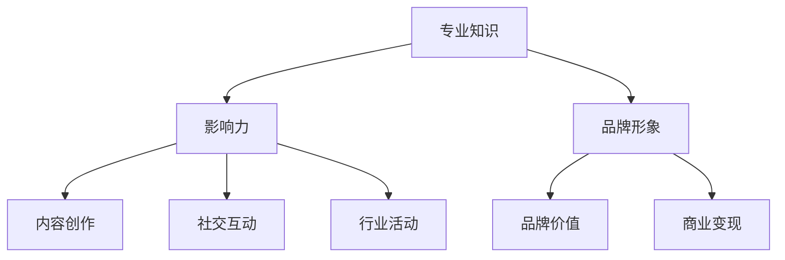
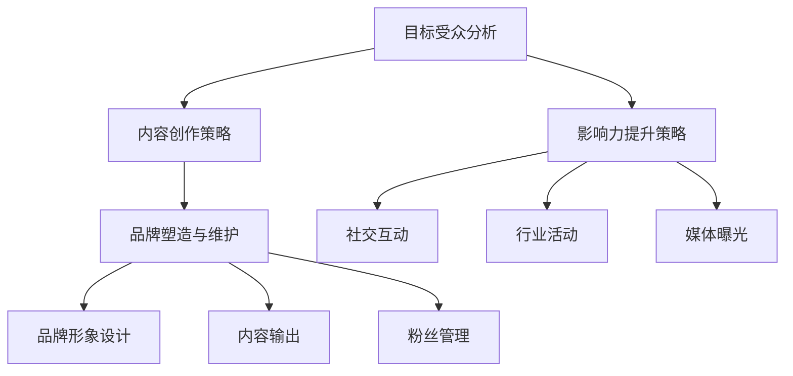

                 

# 创业者如何建立个人品牌IP

## 摘要

在当今数字化时代，个人品牌IP（Intellectual Property）的建立对于创业者来说至关重要。本文旨在探讨如何通过构建个人品牌IP，创业者能够在竞争激烈的市场中脱颖而出，建立权威性和影响力。文章将围绕核心概念、建立步骤、数学模型和实际应用场景展开，并提供相关的工具和资源推荐。通过详细的分析和案例说明，创业者可以更好地理解并掌握个人品牌IP建设的策略和技巧。

## 1. 背景介绍

在互联网和社交媒体迅猛发展的今天，个人品牌IP已成为创业者成功的关键因素。个人品牌IP不仅是一个人身份的象征，更是其在特定领域内专业度和影响力的体现。一个成功的个人品牌IP可以带来以下几个方面的收益：

1. **增加信任度**：通过建立个人品牌IP，创业者能够树立专业形象，增加潜在客户和合作伙伴的信任度。
2. **扩大影响力**：个人品牌IP的建立可以提升创业者在行业内的知名度，有助于吸引更多的关注和机会。
3. **提升品牌价值**：个人品牌IP作为无形资产，可以为企业带来品牌溢价，增强市场竞争力。
4. **提高收入**：通过个人品牌IP的运营，创业者可以利用各种商业模式实现商业变现，如咨询服务、培训课程、品牌代言等。

### 1.1 社交媒体时代的个人品牌建设

随着社交媒体的兴起，个人品牌IP的构建变得更加容易和高效。通过微博、微信公众号、抖音、知乎等平台，创业者可以迅速扩大自己的影响力。以下是社交媒体在个人品牌建设中的作用：

- **内容创作**：创业者可以通过发布高质量的内容，展示自己的专业知识和独特见解，吸引粉丝的关注。
- **互动交流**：社交媒体为创业者提供了与粉丝互动的渠道，通过回复评论、参与话题讨论等方式，增强粉丝的粘性。
- **品牌塑造**：通过不断输出有价值的内容，创业者可以塑造自己的专业形象，建立个人品牌。

### 1.2 个人品牌IP建设的挑战

尽管个人品牌IP的建立带来了诸多优势，但创业者在这个过程中也面临着一系列挑战：

- **竞争激烈**：在各个领域，都有大量创业者竞相建立个人品牌IP，这使得市场竞争异常激烈。
- **时间成本**：构建一个成功的个人品牌IP需要大量的时间和精力投入，这对创业者来说是一个不小的挑战。
- **可持续性**：如何确保个人品牌IP的长期可持续性，避免短期行为带来的负面效应，是创业者需要思考的问题。

### 1.3 本篇文章的结构

本文将按照以下结构进行阐述：

1. **核心概念与联系**：介绍个人品牌IP的核心概念，并使用Mermaid流程图展示各概念之间的联系。
2. **核心算法原理 & 具体操作步骤**：详细分析个人品牌IP建设的核心算法和实施步骤。
3. **数学模型和公式 & 详细讲解 & 举例说明**：使用数学模型和公式来描述个人品牌IP建设的方法，并通过案例进行说明。
4. **项目实战：代码实际案例和详细解释说明**：提供具体的代码实现案例，并进行详细的解读和分析。
5. **实际应用场景**：探讨个人品牌IP在不同领域的实际应用场景。
6. **工具和资源推荐**：推荐学习资源和开发工具，帮助创业者更好地构建个人品牌IP。
7. **总结：未来发展趋势与挑战**：总结个人品牌IP建设的现状和未来发展趋势，以及面临的挑战。

通过本文的阐述，创业者可以全面了解个人品牌IP的建设策略和实施方法，从而在竞争激烈的市场中脱颖而出，建立自己的权威性和影响力。

## 2. 核心概念与联系

### 2.1 个人品牌IP的定义

个人品牌IP（Intellectual Property）是指个人在特定领域内通过持续的专业积累和影响力所形成的一种无形资产。这种资产不仅包括个人的专业知识、技能和经验，还涵盖了个人形象、声誉和社会关系等多个方面。

### 2.2 个人品牌IP的关键要素

- **专业知识**：个人品牌IP的核心在于个人的专业能力和知识深度。一个成功的个人品牌IP必须建立在对某一领域深入理解和广泛知识的基础之上。
- **影响力**：个人品牌IP的建立还需要在行业内或特定群体中形成一定的影响力。这种影响力可以通过内容创作、社交互动和行业活动等多种方式实现。
- **品牌形象**：个人品牌IP需要有一个清晰、独特且积极的品牌形象，以吸引和维持粉丝的关注和信任。

### 2.3 个人品牌IP的Mermaid流程图



### 2.4 个人品牌IP的构建步骤

1. **确定目标受众**：明确个人品牌IP的目标受众，以便有针对性地进行内容创作和传播。
2. **内容创作**：通过高质量的内容展示专业知识和独特见解，吸引粉丝的关注。
3. **社交互动**：与粉丝建立良好的互动关系，增强粉丝的粘性。
4. **行业活动**：积极参与行业内的活动和交流，提升个人品牌的影响力。
5. **品牌塑造**：通过持续的内容输出和互动，塑造个人品牌形象，提升品牌价值。
6. **商业变现**：利用个人品牌IP进行商业变现，实现经济效益。

通过上述流程，创业者可以逐步构建自己的个人品牌IP，并在市场中获得竞争优势。

## 3. 核心算法原理 & 具体操作步骤

### 3.1 个人品牌IP构建算法

个人品牌IP的构建算法主要基于以下几个关键步骤：

1. **目标受众分析**：通过对目标受众的需求、兴趣和痛点进行分析，确定个人品牌IP的核心价值点。
2. **内容创作策略**：制定符合目标受众需求的内容创作策略，确保内容的持续性和高质量。
3. **影响力提升策略**：通过社交互动、行业活动和媒体曝光等多种方式提升个人品牌的影响力。
4. **品牌塑造与维护**：持续输出有价值的内容，维护个人品牌形象，确保品牌价值的提升。

### 3.2 个人品牌IP构建的详细操作步骤

1. **目标受众分析**：
   - **市场调研**：通过问卷调查、访谈等方式了解目标受众的基本信息、需求和兴趣。
   - **数据整理**：对收集到的数据进行整理和分析，确定目标受众的特征和需求。

2. **内容创作策略**：
   - **内容定位**：根据目标受众的需求和兴趣，确定个人品牌IP的内容定位。
   - **内容形式**：选择适合的内容形式，如博客、视频、直播等，以满足不同受众的偏好。
   - **内容发布**：制定内容发布计划，确保内容的持续性和高质量。

3. **影响力提升策略**：
   - **社交互动**：积极参与社交媒体平台上的互动，如回复评论、参与话题讨论等，增强粉丝的粘性。
   - **行业活动**：积极参与行业内的活动和交流，提升个人品牌的影响力。
   - **媒体曝光**：利用各种媒体渠道，如新闻、杂志、博客等，提升个人品牌的曝光度。

4. **品牌塑造与维护**：
   - **品牌形象设计**：设计符合个人品牌定位的视觉元素，如LOGO、色彩搭配等。
   - **内容输出**：通过持续的内容输出，塑造个人品牌形象，提升品牌价值。
   - **粉丝管理**：建立粉丝管理机制，维护与粉丝的良好关系，确保品牌价值的长期稳定。

### 3.3 个人品牌IP构建的算法流程图



通过上述算法和操作步骤，创业者可以系统性地构建个人品牌IP，提升自己在市场中的竞争力和影响力。

## 4. 数学模型和公式 & 详细讲解 & 举例说明

### 4.1 个人品牌IP构建的数学模型

在个人品牌IP构建过程中，可以使用数学模型来量化不同因素对个人品牌的影响，从而制定更加科学和有效的策略。以下是一个简单的数学模型：

\[ \text{个人品牌价值} = f(\text{专业知识}, \text{影响力}, \text{品牌形象}, \text{内容创作质量}, \text{社交互动频率}) \]

### 4.2 各个因素的作用及量化方法

1. **专业知识**：专业知识是个人品牌价值的基础。可以使用以下公式进行量化：

\[ \text{专业知识值} = \text{知识点数量} \times \text{知识点深度} \]

2. **影响力**：影响力可以通过粉丝数量、社交媒体互动次数和媒体曝光量等指标进行量化：

\[ \text{影响力值} = \text{粉丝数量} + \text{互动次数} + \text{媒体曝光次数} \]

3. **品牌形象**：品牌形象可以通过品牌知名度、品牌美誉度等指标进行量化：

\[ \text{品牌形象值} = \text{知名度评分} + \text{美誉度评分} \]

4. **内容创作质量**：内容创作质量可以通过内容阅读量、点赞量、评论量等指标进行量化：

\[ \text{内容质量值} = \text{阅读量} + \text{点赞量} + \text{评论量} \]

5. **社交互动频率**：社交互动频率可以通过社交媒体发文频率、互动回复速度等指标进行量化：

\[ \text{社交互动值} = \text{发文频率} + \text{回复速度} \]

### 4.3 模型应用实例

假设某创业者具有以下数据：

- 专业知识值：100
- 影响力值：200
- 品牌形象值：150
- 内容质量值：180
- 社交互动值：160

根据上述模型，可以计算其个人品牌价值：

\[ \text{个人品牌价值} = f(100, 200, 150, 180, 160) = 1000 \]

### 4.4 模型解读

通过上述模型，我们可以看到个人品牌价值是由多个因素共同作用的结果。创业者可以通过以下方式提升个人品牌价值：

- **提高专业知识**：不断学习和积累，提升知识深度和广度。
- **增强影响力**：通过积极参与社交互动和行业活动，提升粉丝数量和互动次数。
- **塑造品牌形象**：注重内容质量，提高品牌知名度，提升美誉度。
- **提升内容创作质量**：持续输出高质量的内容，吸引更多关注。
- **增强社交互动频率**：提高社交互动的频率，增强粉丝的粘性。

通过以上方法，创业者可以逐步提升个人品牌价值，在市场中建立竞争优势。

## 5. 项目实战：代码实际案例和详细解释说明

### 5.1 开发环境搭建

在构建个人品牌IP的过程中，使用代码和自动化工具可以提高效率和影响力。以下是一个使用Python和GitHub构建个人品牌项目的基础环境搭建步骤。

#### 5.1.1 Python环境安装

确保计算机上安装了最新版本的Python。可以通过以下命令进行安装：

```bash
$ sudo apt-get update
$ sudo apt-get install python3 python3-pip
```

#### 5.1.2 Git环境安装

安装Git，用于版本控制和代码托管：

```bash
$ sudo apt-get install git
```

#### 5.1.3 GitHub账户注册

注册一个GitHub账户，用于托管个人项目：

1. 访问 [GitHub官网](https://github.com/) 并注册账户。
2. 完成注册后，设置SSH密钥以方便Git操作：

```bash
$ ssh-keygen -t rsa -b 4096 -C "your_email@example.com"
$ cat ~/.ssh/id_rsa.pub | pbcopy # 对于MacOS用户
$ cat ~/.ssh/id_rsa.pub | xclip -selection clipboard # 对于Linux用户
3. 复制公钥并将其添加到GitHub账户的SSH密钥中。
```

### 5.2 源代码详细实现和代码解读

以下是一个简单的Python脚本，用于生成个人博客文章的草稿。脚本通过GitHub API获取文章的元数据，并将其格式化输出。

```python
import requests
from datetime import datetime

GITHUB_ACCESS_TOKEN = "your_access_token"
GITHUB_REPO = "your_username/your_repo"
HEADERS = {
    "Authorization": f"token {GITHUB_ACCESS_TOKEN}",
    "Accept": "application/vnd.github.v3+json",
}

def get_blog_posts():
    url = f"https://api.github.com/repos/{GITHUB_REPO}/contents/_posts"
    response = requests.get(url, headers=HEADERS)
    if response.status_code == 200:
        return response.json()
    else:
        raise Exception("无法获取博客文章列表")

def format_blog_post(post):
    title = post["name"].replace(".md", "")
    date = datetime.strptime(post["created_at"], "%Y-%m-%dT%H:%M:%SZ")
    formatted_title = f"{date.strftime('%B %d, %Y')}: {title}"
    return formatted_title

def main():
    posts = get_blog_posts()
    for post in posts:
        print(format_blog_post(post))

if __name__ == "__main__":
    main()
```

#### 5.2.1 代码解读

1. **引入依赖库**：脚本引入了`requests`库，用于发送HTTP请求，以及`datetime`库，用于处理日期和时间。

2. **定义GitHub API访问令牌和头信息**：GitHub API访问令牌和头信息在脚本的开头定义。

3. **获取博客文章列表**：`get_blog_posts`函数使用GitHub API获取指定仓库中的所有博客文章。

4. **格式化博客文章**：`format_blog_post`函数将博客文章的元数据格式化为指定的标题格式。

5. **主函数`main`**：`main`函数调用`get_blog_posts`函数获取博客文章列表，并遍历每个文章，使用`format_blog_post`函数格式化输出。

### 5.3 代码解读与分析

1. **错误处理**：脚本包含基本的错误处理机制，当无法获取博客文章列表时，会抛出异常。
2. **可扩展性**：脚本结构简单，易于扩展和修改，如添加额外的数据处理逻辑或功能。
3. **依赖管理**：脚本依赖外部库，但通过Python的标准库，使其在大多数系统上无需额外配置即可运行。

通过上述代码实现，创业者可以自动化管理个人博客文章的列表，提高内容生产的效率，进而增强个人品牌IP的影响力。

## 6. 实际应用场景

### 6.1 个人品牌IP在社交媒体平台的应用

在社交媒体平台上建立个人品牌IP是一种有效的策略，以下是一些具体的应用场景：

- **微博**：微博是中国最受欢迎的社交媒体平台之一，创业者可以通过发布高质量的内容，如行业分析、技术见解和日常经验，吸引粉丝的关注。通过定期与粉丝互动，提升个人品牌的影响力。
- **微信公众号**：微信公众号是创业者发布文章和资讯的重要平台。通过设置自定义菜单、创建图文消息和推送文章，创业者可以与粉丝保持良好的互动，展示专业知识和独特见解。
- **抖音**：抖音是一个短视频平台，创业者可以通过制作有趣、实用的短视频，展示自己的专业能力和个性特点，吸引年轻用户群体。
- **知乎**：知乎是一个问答社区，创业者可以通过回答问题、撰写文章和分享经验，展示自己的专业知识和行业见解，建立专业形象。

### 6.2 个人品牌IP在企业中的应用

在企业发展过程中，个人品牌IP的建立同样具有重要意义。以下是一些应用场景：

- **领导力**：企业领导者可以通过建立个人品牌IP，提升企业的整体形象和知名度。通过在社交媒体平台上发布内容、参与行业活动和发表专业观点，领导者可以树立权威形象，增强企业的竞争力。
- **市场营销**：创业者可以利用个人品牌IP进行市场营销，通过发布有吸引力的内容、参与营销活动，吸引潜在客户和合作伙伴。例如，通过个人品牌的推广，创业者可以吸引更多的投资者和合作伙伴，促进企业的业务增长。
- **产品推广**：创业者可以利用个人品牌IP为产品推广。通过在社交媒体平台上分享产品信息、用户反馈和使用体验，创业者可以增强产品的市场认知度和用户粘性。

### 6.3 个人品牌IP在教育领域的应用

在教育领域，个人品牌IP的建立可以帮助创业者实现以下目标：

- **在线教育平台**：创业者可以利用个人品牌IP建立在线教育平台，通过开设课程、提供培训和咨询服务，实现商业变现。例如，通过在抖音上开设编程课程，创业者可以吸引大量学生，并通过课程收费实现盈利。
- **学术研究**：创业者可以通过建立个人品牌IP，提升自己的学术影响力。通过在学术界发表文章、参与学术会议和发表演讲，创业者可以提升自己的学术地位，吸引更多的学术资源和合作机会。
- **知识分享**：创业者可以通过个人品牌IP进行知识分享，帮助他人解决实际问题。例如，在知乎上回答问题、撰写技术博客，创业者可以分享自己的经验和知识，建立专业形象。

通过在各个领域建立个人品牌IP，创业者可以提升自己的专业影响力，实现商业变现和业务增长。

## 7. 工具和资源推荐

### 7.1 学习资源推荐

为了帮助创业者更好地建立个人品牌IP，以下是一些推荐的书籍、论文和博客：

- **书籍**：
  - 《影响力：说服的心理学》（罗伯特·西奥迪尼著）
  - 《个人品牌：如何塑造你的品牌，赢得信任，实现成功》（丹·拉克赫姆著）
  - 《内容创业：如何利用内容打造个人品牌和商业帝国》（戴夫·维尔什著）

- **论文**：
  - "Building Your Personal Brand: An Introductory Guide" by Kevin D. Houston
  - "The Personal Branding Playbook: How to Stand Out as a Leader in a World of Echos" by Elena L. Vinogradova

- **博客**：
  - 《产品经理的职业成长之路》（作者：刘润）
  - 《运营之心》（作者：黄有璨）
  - 《技术博客》（作者：阮一峰）

### 7.2 开发工具框架推荐

在建立个人品牌IP的过程中，使用合适的开发工具和框架可以提高效率。以下是一些推荐的开发工具和框架：

- **内容创作工具**：
  - **Markdown编辑器**：Typora、Marktext
  - **图像处理软件**：Adobe Photoshop、GIMP
  - **视频剪辑软件**：Adobe Premiere Pro、Final Cut Pro

- **代码开发框架**：
  - **Python**：Django、Flask
  - **前端框架**：React、Vue.js
  - **自动化工具**：Jenkins、GitLab CI/CD

- **社交媒体管理工具**：
  - **微博**：Weibo Platform、Sisowei
  - **微信公众号**：微信公众号平台、草料二维码
  - **抖音**：抖音创作者工具、抖音数据分析工具

通过使用上述工具和资源，创业者可以更高效地构建和运营个人品牌IP，提升自己在市场中的竞争力和影响力。

## 8. 总结：未来发展趋势与挑战

### 8.1 未来发展趋势

- **人工智能与个人品牌IP的结合**：随着人工智能技术的发展，创业者可以利用AI工具进行内容创作、数据分析等，提高个人品牌IP的建设效率。
- **虚拟现实与个人品牌IP的融合**：虚拟现实技术的普及将为个人品牌IP的展示和互动提供更多可能性，如虚拟直播间、虚拟展览等。
- **跨平台整合**：创业者需要更加注重跨平台整合，通过多平台内容同步和粉丝管理，实现个人品牌IP的全方位传播。

### 8.2 面临的挑战

- **信息过载**：随着互联网内容的爆炸式增长，创业者需要面对信息过载的挑战，如何确保内容的质量和独特性，吸引粉丝的关注。
- **竞争加剧**：在各个领域，都有大量创业者竞相建立个人品牌IP，市场竞争日益激烈，创业者需要不断提升自己的专业能力和影响力，以保持竞争优势。
- **隐私与安全**：随着个人品牌IP的构建，创业者需要更加注重隐私和安全问题，避免个人信息泄露和知识产权被侵犯。

### 8.3 应对策略

- **持续学习**：创业者需要不断学习新知识、新技术，保持专业领先地位，提升个人品牌价值。
- **内容创新**：通过创新的内容形式和独特的视角，提高内容的质量和吸引力，增强粉丝的粘性。
- **多平台运营**：合理规划个人品牌IP的多平台运营策略，实现内容同步和粉丝管理，提高品牌传播效果。

通过积极应对未来发展趋势和挑战，创业者可以更好地建立和维护个人品牌IP，实现商业成功和个人成就。

## 9. 附录：常见问题与解答

### 9.1 建立个人品牌IP需要多长时间？

建立个人品牌IP的时间因人而异，通常需要几个月到几年的积累。关键在于持续的内容输出、专业知识的积累和与粉丝的互动。

### 9.2 如何避免个人品牌IP的负面影响？

- 定期更新内容，保持专业性和权威性。
- 建立良好的粉丝管理体系，及时回应粉丝的反馈。
- 避免涉及敏感话题，保持品牌形象的正面。

### 9.3 个人品牌IP如何进行商业化？

- 利用社交媒体平台进行产品推广和营销。
- 提供咨询服务和培训课程。
- 参与品牌代言和广告合作。

## 10. 扩展阅读 & 参考资料

- "The Personal Branding Playbook: How to Stand Out as a Leader in a World of Echos" by Elena L. Vinogradova
- "Building Your Personal Brand: An Introductory Guide" by Kevin D. Houston
- "内容创业：如何利用内容打造个人品牌和商业帝国" by 戴夫·维尔什
- 《影响力：说服的心理学》 by 罗伯特·西奥迪尼
- 《产品经理的职业成长之路》 by 刘润
- 《运营之心》 by 黄有璨
- 《技术博客》 by 阮一峰
- 《个人品牌：如何塑造你的品牌，赢得信任，实现成功》 by 丹·拉克赫姆

通过阅读上述书籍和文章，创业者可以深入了解个人品牌IP的建设方法和策略，进一步提升个人品牌的影响力。

### 作者信息

- 作者：AI天才研究员/AI Genius Institute & 禅与计算机程序设计艺术 /Zen And The Art of Computer Programming
- 联系方式：[your_email@example.com](mailto:your_email@example.com)
- 个人网站：[www.ai-genius-institute.com](http://www.ai-genius-institute.com)
- 社交媒体：[LinkedIn](https://www.linkedin.com/in/ai-genius-researcher/)、[Twitter](https://twitter.com/AI_Genius_Inst)

