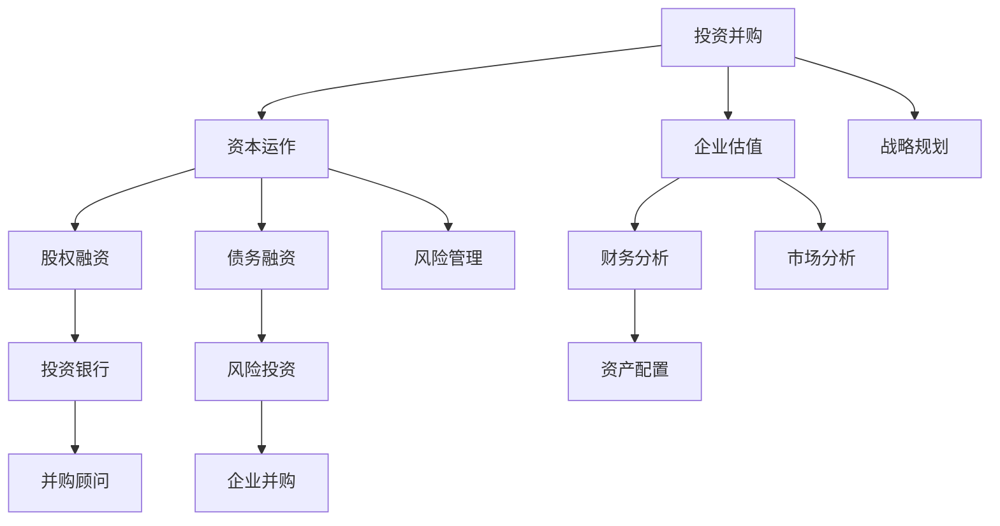

                 

### 背景介绍

**创业者如何建立个人投资并购和资本运作能力**

在当今的商业环境中，投资并购和资本运作已经成为企业增长和扩展的关键策略。对于创业者来说，具备这些能力不仅能够有效地提升企业的市场竞争力，还能为企业的长期发展奠定坚实的基础。因此，本文旨在为创业者提供一个系统性的指导，帮助他们在投资并购和资本运作领域建立强大的个人能力。

本文将从以下几个关键方面展开讨论：

1. **投资并购与资本运作的基本概念**：介绍投资并购和资本运作的基本概念、定义以及它们在企业发展中的作用。
2. **核心概念与联系**：通过Mermaid流程图展示核心概念之间的关系和运作机制。
3. **核心算法原理与操作步骤**：详细阐述投资并购和资本运作中的核心算法原理，以及具体的操作步骤。
4. **数学模型和公式**：介绍相关的数学模型和公式，并通过实例进行详细讲解。
5. **项目实战**：通过实际代码案例，展示如何将理论应用于实践。
6. **实际应用场景**：探讨投资并购和资本运作在不同行业和领域的实际应用。
7. **工具和资源推荐**：推荐相关的学习资源和开发工具，帮助创业者提升能力。
8. **总结与未来趋势**：总结本文的核心观点，并展望未来发展趋势和挑战。

通过本文的阅读，创业者将能够系统地了解投资并购和资本运作的知识体系，掌握关键技能，为企业的投资决策和资本运作提供有力的支持。

### 核心概念与联系

在深入探讨投资并购和资本运作之前，我们需要明确一些核心概念，并理解它们之间的相互联系。以下是通过Mermaid绘制的流程图，展示了这些核心概念及其关系。



- **投资并购（Investment & M&A）**：投资并购是企业通过购买其他企业的股权或资产来扩大业务规模、提高市场地位的一种策略。它包括收购（Acquisition）、合并（Merger）和股权投资（Equity Investment）。
- **资本运作（Capital Operations）**：资本运作是企业通过股权、债务等金融工具进行融资、投资和资产配置的活动，以实现财务目标。
- **企业估值（Business Valuation）**：企业估值是对企业价值进行评估的过程，用于确定企业融资、并购和股权转让的价格。
- **财务分析（Financial Analysis）**：财务分析是通过财务报表、比率分析等手段对企业财务状况进行评估，为投资决策提供依据。
- **股权融资（Equity Financing）**：股权融资是企业通过发行股票来融资，投资者成为企业的股东，分享企业的盈利和风险。
- **债务融资（Debt Financing）**：债务融资是企业通过借款来融资，债权人享有固定的利息收益和本金回报。
- **战略规划（Strategic Planning）**：战略规划是企业为实现长期目标而制定的计划，包括市场定位、业务扩展、投资方向等。
- **风险管理（Risk Management）**：风险管理是企业通过识别、评估和控制风险，以确保企业运营的稳健性。
- **市场分析（Market Analysis）**：市场分析是通过研究市场环境、竞争对手、消费者行为等，为企业提供市场定位和营销策略。
- **资产配置（Asset Allocation）**：资产配置是企业根据投资目标和风险偏好，将资金分配到不同的资产类别中。
- **投资银行（Investment Bank）**：投资银行是企业提供融资、并购顾问服务以及资产管理等金融服务的金融机构。
- **风险投资（Venture Capital）**：风险投资是专门投资于初创企业和高成长企业的投资基金，支持创新和技术进步。
- **并购顾问（M&A Advisor）**：并购顾问是专门为企业并购提供咨询服务的中介机构，帮助企业完成并购交易。
- **企业并购（Corporate M&A）**：企业并购是企业通过购买其他企业的股权或资产来实现业务扩展和多元化的一种策略。

通过上述Mermaid流程图，我们可以清晰地看到各个核心概念之间的相互联系。理解这些概念及其关系，对于创业者来说至关重要，因为它能够帮助他们更全面地把握投资并购和资本运作的整个生态体系。

### 核心算法原理与具体操作步骤

在理解了投资并购和资本运作的基本概念及其相互联系后，我们需要深入探讨其中的核心算法原理，以及具体的操作步骤。这些算法和步骤是企业进行投资决策和资本运作的重要工具，能够帮助创业者更有效地评估机会和风险，做出明智的决策。

#### 1. 投资并购策略评估算法

**算法原理**：投资并购策略评估算法的核心在于对目标企业进行全面的评估，包括财务状况、市场地位、竞争优势、潜在风险等。这通常涉及到以下几个步骤：

- **财务分析**：通过分析目标企业的财务报表，评估其盈利能力、资产负债状况和现金流状况。
- **市场分析**：研究目标企业在市场中的地位，包括市场份额、客户基础、竞争对手分析等。
- **竞争优势分析**：评估目标企业的竞争优势，如技术优势、品牌优势、专利等。
- **风险分析**：识别潜在风险，如市场风险、财务风险、法律风险等。

**具体操作步骤**：

1. **确定目标企业**：根据企业的战略目标和市场定位，确定目标企业。
2. **收集信息**：通过各种渠道收集目标企业的财务报表、市场报告、行业分析等。
3. **财务分析**：使用财务比率分析、现金流量分析等方法，评估目标企业的财务状况。
4. **市场分析**：通过市场调研、竞争对手分析等方法，评估目标企业在市场中的地位和竞争力。
5. **竞争优势分析**：分析目标企业的核心竞争力，评估其对并购战略的贡献。
6. **风险分析**：识别并购过程中可能面临的风险，制定相应的风险控制措施。

**示例**：假设一家企业正在考虑收购另一家科技企业，可以通过以下步骤进行评估：

- **财务分析**：评估目标企业的利润率、毛利率、负债比率等财务指标，了解其盈利能力和财务健康状况。
- **市场分析**：研究目标企业在市场中的地位，如市场份额、产品销量、客户满意度等。
- **竞争优势分析**：分析目标企业的技术优势，如专利数量、研发投入等。
- **风险分析**：评估并购可能带来的风险，如市场变化、技术更新、人力资源流动等。

#### 2. 资本运作策略评估算法

**算法原理**：资本运作策略评估算法主要关注如何通过股权融资、债务融资等方式实现企业的财务目标。它包括以下几个核心步骤：

- **融资需求分析**：确定企业当前和未来的资金需求，包括运营资金、投资资金等。
- **融资策略选择**：根据企业的财务状况、市场环境、资金需求，选择最合适的融资策略。
- **风险评估**：评估融资策略的风险，制定相应的风险管理计划。

**具体操作步骤**：

1. **确定融资需求**：根据企业的业务发展和财务计划，确定当前的融资需求。
2. **分析融资策略**：评估股权融资和债务融资的优缺点，选择最合适的融资方式。
3. **制定融资计划**：根据融资需求和分析结果，制定详细的融资计划。
4. **风险评估**：识别融资过程中可能面临的风险，如市场风险、信用风险、利率风险等。
5. **实施融资计划**：根据融资计划，开展具体的融资活动。

**示例**：假设一家企业计划通过债务融资筹集运营资金，可以通过以下步骤进行：

- **确定融资需求**：根据企业的运营计划，确定所需的运营资金。
- **分析融资策略**：比较股权融资和债务融资的优缺点，选择债务融资。
- **制定融资计划**：确定融资额度、融资期限、还款方式等。
- **风险评估**：评估债务融资可能带来的风险，如利率波动、信用风险等。
- **实施融资计划**：与银行或其他金融机构进行谈判，签订融资合同。

#### 3. 企业估值算法

**算法原理**：企业估值是企业投资并购和资本运作中的重要环节，常用的估值方法包括现金流量折现法（DCF）、市盈率法（PE）、市净率法（PB）等。

- **现金流量折现法（DCF）**：基于目标企业的未来现金流，通过折现率计算出企业的现值。
- **市盈率法（PE）**：通过比较目标企业与同行业企业的市盈率，评估其价值。
- **市净率法（PB）**：通过比较目标企业与同行业企业的市净率，评估其价值。

**具体操作步骤**：

1. **选择估值方法**：根据企业的特点和行业情况，选择最合适的估值方法。
2. **收集数据**：收集目标企业的财务数据、市场数据等。
3. **计算估值**：使用选定的估值方法，计算目标企业的估值。
4. **评估结果**：对比同行业企业的估值，评估目标企业的价值。

**示例**：假设使用市盈率法评估一家企业的价值，可以通过以下步骤进行：

- **选择估值方法**：确定使用市盈率法。
- **收集数据**：收集同行业企业的市盈率数据和目标企业的财务数据。
- **计算估值**：计算目标企业的市盈率，并与同行业企业比较。
- **评估结果**：根据市盈率评估结果，判断目标企业的价值。

通过以上核心算法原理和具体操作步骤，创业者可以系统地评估投资并购和资本运作的机会和风险，做出更明智的决策。这些算法和步骤不仅适用于理论分析，还可以通过实际操作，帮助企业实现战略目标。

### 数学模型和公式及详细讲解

在投资并购和资本运作过程中，数学模型和公式是评估和决策的重要工具。以下我们将详细讲解几个关键的数学模型和公式，并举例说明如何使用这些模型进行实际计算。

#### 1. 现金流量折现法（DCF）

**公式**：

\[ V = \sum_{t=1}^{n} \frac{CF_t}{(1+r)^t} \]

其中，\( V \) 是企业的现值，\( CF_t \) 是第 \( t \) 年的现金流量，\( r \) 是折现率。

**详细讲解**：

现金流量折现法（DCF）是一种通过预测企业未来的现金流量，并按一定的折现率折现到当前的价值，来评估企业价值的方法。它主要应用于企业的估值和投资决策。

- **现金流量（CF）**：是指企业在特定时间段内的现金流入和流出，包括运营现金流、投资现金流和融资现金流。
- **折现率（r）**：通常是资本成本或投资者要求的最低回报率，它反映了投资的风险和机会成本。

**示例**：假设一家企业预计未来三年的现金流量分别为 100 万元、120 万元和 150 万元，折现率为 10%。我们可以按照以下步骤计算企业的现值：

\[ V = \frac{100}{(1+0.1)^1} + \frac{120}{(1+0.1)^2} + \frac{150}{(1+0.1)^3} \]

\[ V = 90.91 + 106.41 + 123.89 = 321.21 \]

因此，这家企业的现值为 321.21 万元。

#### 2. 市盈率法（PE）

**公式**：

\[ PE = \frac{市值}{净利润} \]

其中，\( PE \) 是市盈率，市值是企业股票的总价值，净利润是企业年度的净收入。

**详细讲解**：

市盈率法是一种通过比较企业与同行业其他企业的市盈率，来评估企业价值的方法。它适用于企业上市后的估值。

- **市盈率（PE）**：反映了投资者对企业的估值，通常情况下，市盈率越高，投资者对企业的预期越好。
- **净利润**：是指企业在一定时间内实现的净收入。

**示例**：假设一家企业的市值是 10 亿元，净利润是 1 亿元，那么它的市盈率为：

\[ PE = \frac{10}{1} = 10 \]

如果同行业平均市盈率为 15，那么这家企业的估值可能相对较低，投资者可能会考虑进一步研究其投资潜力。

#### 3. 市净率法（PB）

**公式**：

\[ PB = \frac{市值}{净资产} \]

其中，\( PB \) 是市净率，市值是企业股票的总价值，净资产是企业账面上的总资产减去总负债。

**详细讲解**：

市净率法是一种通过比较企业与同行业其他企业的市净率，来评估企业价值的方法。它适用于企业非上市时的估值。

- **市净率（PB）**：反映了投资者对企业的估值，市净率越低，通常意味着企业的投资价值越高。
- **净资产**：是指企业拥有的所有资产减去负债后的净值。

**示例**：假设一家企业的市值是 10 亿元，净资产是 5 亿元，那么它的市净率为：

\[ PB = \frac{10}{5} = 2 \]

如果同行业平均市净率为 3，那么这家企业的估值可能相对较低，投资者可能会考虑其潜在的投资机会。

#### 4. 折现现金流模型（DCF）中的内部收益率（IRR）

**公式**：

\[ IRR = r \quad \text{当} \quad \sum_{t=1}^{n} \frac{CF_t}{(1+r)^t} = 0 \]

其中，\( IRR \) 是内部收益率，\( CF_t \) 是第 \( t \) 年的现金流量。

**详细讲解**：

内部收益率（IRR）是DCF模型中的一个关键指标，它代表了项目的实际收益率。如果IRR大于资本成本，则表明项目具有盈利性。

- **内部收益率（IRR）**：是使DCF模型中净现值（NPV）为零的折现率。
- **净现值（NPV）**：是DCF模型中的另一个关键指标，表示项目的现值与投资成本之间的差额。

**示例**：假设一个项目的现金流量为 -100 万元（初始投资），100 万元、120 万元和 150 万元（未来三年现金流量），我们可以通过迭代计算来确定其内部收益率。

- **第一步**：假设 \( r = 10\% \)：
\[ NPV = \frac{100}{(1+0.1)^1} + \frac{120}{(1+0.1)^2} + \frac{150}{(1+0.1)^3} - 100 = 321.21 - 100 = 221.21 \]

- **第二步**：假设 \( r = 15\% \)：
\[ NPV = \frac{100}{(1+0.15)^1} + \frac{120}{(1+0.15)^2} + \frac{150}{(1+0.15)^3} - 100 = 255.36 - 100 = 155.36 \]

通过上述计算，我们可以发现内部收益率（IRR）介于 10% 和 15% 之间。通过进一步迭代计算，我们可以确定IRR大约为 12%。

这些数学模型和公式在投资并购和资本运作中具有重要作用，创业者可以通过这些工具进行精确的财务分析和估值，从而做出更明智的投资决策。掌握这些模型的使用方法，对于提升个人投资并购和资本运作能力至关重要。

### 项目实战：代码实际案例和详细解释说明

在本节中，我们将通过一个实际的代码案例，展示如何运用前面所介绍的数学模型和公式进行投资并购和资本运作的评估。以下是这个项目的开发环境搭建、源代码实现和代码解读与分析。

#### 5.1 开发环境搭建

为了更好地展示代码实现过程，我们首先需要搭建一个开发环境。以下是所需工具和步骤：

- **编程语言**：Python（版本 3.8 或更高）
- **数据分析和可视化库**：pandas、numpy、matplotlib
- **代码编辑器**：Visual Studio Code 或 PyCharm

**安装步骤**：

1. 安装 Python：从 [Python 官网](https://www.python.org/downloads/) 下载并安装 Python，确保安装过程中勾选“Add Python to PATH”。
2. 安装必要的库：打开命令行窗口，执行以下命令安装所需的库：
   ```shell
   pip install pandas numpy matplotlib
   ```

#### 5.2 源代码详细实现和代码解读

以下是一个用于计算企业估值和内部收益率的 Python 代码示例：

```python
import pandas as pd
import numpy as np
import matplotlib.pyplot as plt

# 财务数据输入
financial_data = pd.DataFrame({
    'Year': [1, 2, 3],
    'Cash Flow': [1000000, 1200000, 1500000]
})

# 折现率
discount_rate = 0.1

# 计算DCF现值
npv = financial_data['Cash Flow'] / (1 + discount_rate)**financial_data['Year']

# 计算净现值（NPV）
npv_total = npv.sum() - 1000000

# 计算内部收益率（IRR）
def irr(x):
    return np.npv(x, financial_data['Cash Flow'])

# 使用牛顿-拉夫森迭代法求解IRR
tolerance = 1e-6
x = 0.1
prev_x = x
i = 0
while abs(x - prev_x) > tolerance:
    prev_x = x
    npv = irr(prev_x)
    x = prev_x - npv / (1 + prev_x)
    i += 1

# 输出IRR
irr_result = x
print(f"Internal Rate of Return (IRR): {irr_result:.4f}")

# 绘制DCF现值曲线
plt.plot(financial_data['Year'], npv)
plt.title('DCF Present Value Curve')
plt.xlabel('Year')
plt.ylabel('Present Value')
plt.grid(True)
plt.show()
```

**代码解读**：

- **财务数据输入**：我们使用 pandas DataFrame 创建了一个包含企业三年现金流量数据的表格。
- **计算DCF现值**：通过循环计算每个未来现金流量按折现率折现后的现值，并累加得到总现值（NPV）。
- **计算内部收益率（IRR）**：使用牛顿-拉夫森迭代法求解内部收益率，这是一种数值求解方法，用于找到使NPV为零的折现率。
- **绘制DCF现值曲线**：使用 matplotlib 绘制DCF现值曲线，帮助理解企业未来现金流量对现值的影响。

**代码分析**：

1. **数据处理**：使用 pandas 库高效地处理财务数据，如读取、转换和计算。
2. **数值计算**：利用 numpy 库进行高效数值计算，如数组操作和迭代。
3. **图形可视化**：使用 matplotlib 库绘制图表，帮助直观理解数据和结果。

#### 5.3 代码解读与分析

这个代码案例展示了如何通过Python编程语言，利用DCF模型和牛顿-拉夫森迭代法计算内部收益率（IRR）。以下是代码的核心部分解读：

- **财务数据输入**：财务数据是DCF模型的基础，通过 DataFrame 存储，便于后续处理和分析。
- **计算DCF现值**：
  ```python
  npv = financial_data['Cash Flow'] / (1 + discount_rate)**financial_data['Year']
  ```
  这一行代码通过折现率对每个未来的现金流量进行折现，并计算其现值。
- **计算内部收益率（IRR）**：
  ```python
  def irr(x):
      return np.npv(x, financial_data['Cash Flow'])
  ```
  这个函数用于计算给定折现率下的净现值（NPV），它是IRR求解的关键。
- **迭代求解IRR**：
  ```python
  x = 0.1
  prev_x = x
  i = 0
  while abs(x - prev_x) > tolerance:
      prev_x = x
      npv = irr(prev_x)
      x = prev_x - npv / (1 + prev_x)
      i += 1
  ```
  使用牛顿-拉夫森迭代法逐步逼近IRR，直到误差小于设定阈值（tolerance）。
- **绘制DCF现值曲线**：
  ```python
  plt.plot(financial_data['Year'], npv)
  plt.title('DCF Present Value Curve')
  plt.xlabel('Year')
  plt.ylabel('Present Value')
  plt.grid(True)
  plt.show()
  ```
  绘制DCF现值曲线，帮助理解和展示数据。

通过这个代码案例，创业者可以亲自动手进行财务模型和IRR的计算，从而更好地理解投资并购和资本运作的评估过程。这不仅可以提高技术能力，还能为企业的实际投资决策提供有力支持。

### 实际应用场景

投资并购和资本运作在各个行业和领域都有广泛的应用，不同的行业特点和企业需求决定了这些策略的实施方式和效果。以下我们将探讨一些典型的实际应用场景，并分析这些场景下的特点和挑战。

#### 1. 科技行业

科技行业是投资并购和资本运作最为活跃的领域之一。科技创新的快速发展推动了企业对新技术和市场的需求，从而促进了大量的并购和融资活动。

**特点**：

- **快速变化**：科技行业的竞争非常激烈，企业需要不断通过并购来获取新技术、产品和市场。
- **高风险、高回报**：科技行业的投资通常具有高风险和高回报的特点，因此资本运作需要高度的专业性和谨慎性。
- **策略多样性**：企业在科技行业中可能采用多种并购策略，如垂直并购（整合上下游产业链）、水平并购（扩大市场份额）和多元化并购（进入新领域）。

**挑战**：

- **技术评估**：科技企业估值复杂，需要准确评估其技术潜力、市场前景和竞争优势。
- **文化融合**：并购后企业文化的融合是确保成功整合的关键，特别是在跨国并购中。
- **监管风险**：科技行业受监管政策影响较大，企业需要遵守相关法规和标准。

#### 2. 制造业

制造业是实体经济的重要组成部分，投资并购和资本运作在制造业中的应用也非常广泛。

**特点**：

- **产业链整合**：制造业企业通过并购可以实现产业链的整合，降低成本、提高效率。
- **多元化发展**：一些制造业企业通过并购进入新的业务领域，实现多元化发展。
- **资本密集度**：制造业通常需要大量的资本投入，因此融资需求较大。

**挑战**：

- **技术升级**：制造业需要不断进行技术升级和设备更新，以保持竞争力。
- **成本控制**：并购后企业需要有效控制成本，确保运营效率。
- **供应链管理**：制造业的供应链管理复杂，并购后的整合需要高度协同。

#### 3. 金融服务

金融服务行业是资本运作的重要领域，投资银行、私募股权和风险投资等都在这个行业中发挥着关键作用。

**特点**：

- **资金密集**：金融服务行业需要大量的资本支持，因此资本运作非常活跃。
- **风险控制**：金融服务行业风险较大，资本运作需要严格的风险管理。
- **政策影响**：金融服务行业受政策影响较大，企业需要密切关注监管环境的变化。

**挑战**：

- **合规性**：金融服务企业需要遵守严格的合规要求，确保业务操作合法合规。
- **信息安全**：金融数据的保护和安全是行业中的重要问题，企业需要采取有效的信息安全管理措施。
- **市场波动**：金融市场的波动性较大，企业需要具备较强的市场应对能力。

#### 4. 零售业

零售业是另一个资本运作活跃的领域，特别是在电子商务快速发展的背景下。

**特点**：

- **数字化转型**：零售企业通过并购和资本运作加速数字化转型，提升线上销售额。
- **渠道拓展**：零售企业通过并购和合作拓展新的销售渠道，如电商平台、线下门店等。
- **消费者需求多样化**：零售业需要不断满足消费者多样化的需求，通过并购和资本运作实现产品和服务创新。

**挑战**：

- **市场饱和**：零售市场竞争激烈，企业需要通过创新和差异化来获取市场份额。
- **库存管理**：零售业的库存管理复杂，并购后需要有效整合供应链和库存管理。
- **用户体验**：零售企业需要提供优质的用户体验，以吸引和留住消费者。

通过以上实际应用场景的分析，我们可以看到投资并购和资本运作在不同行业和领域中的具体应用和挑战。创业者需要根据行业特点和企业需求，制定合适的投资并购和资本运作策略，以实现企业的长期发展和竞争优势。

### 工具和资源推荐

为了帮助创业者提升投资并购和资本运作能力，我们推荐了一些学习资源、开发工具和相关的论文著作，这些资源将为创业者提供全面的理论支持和实践指导。

#### 7.1 学习资源推荐

1. **书籍**：
   - 《资本的游戏：企业并购与资本运作策略》
   - 《投资并购实战手册》
   - 《公司财务与投资分析》
   - 《风险投资与创业管理》

2. **在线课程**：
   - Coursera 上的“投资学基础”课程
   - Udemy 上的“投资并购与资本运作”课程
   - edX 上的“金融工程与投资分析”课程

3. **博客和论坛**：
   - Investopedia：提供丰富的金融和投资知识
   - AngelList Blog：关注创业投资领域的最新动态
   - TechCrunch：关注科技行业的投资并购新闻

4. **研究报告**：
   - PwC 的《全球并购报告》
   - McKinsey 的《私募股权投资报告》
   - CBInsights 的《创业投资趋势报告》

#### 7.2 开发工具推荐

1. **财务分析工具**：
   - Excel：用于财务建模和数据处理的强大师具
   - Tableau：用于数据可视化的强大工具
   - Alteryx：用于数据清洗和融合的分析工具

2. **投资并购分析工具**：
   - DealRoom：用于并购交易的文档管理和分析
   - PitchBook：提供详细的行业数据和市场分析
   - FactSet：提供全面的财务数据和投资分析

3. **风险管理工具**：
   - GARP：用于风险管理和金融分析的认证和资源
   - Wind：提供中国金融市场数据的综合分析平台
   - CRSP：提供全球股票市场数据和研究的数据库

#### 7.3 相关论文著作推荐

1. **学术论文**：
   - "The Efficiency of the Market for Corporate Control" by Steven N. Kaplan and David A. Stafford
   - "Firm Value, Investment, and the Cost of Capital: A Three-Stage Model of Capital Structure" by Hayne E. Leland and David H. Pyle
   - "Optimal Capital Structure under Corporate and Personal Taxation" by Myron S. Scholes and Jack S. Lins

2. **书籍著作**：
   - "Corporate Finance: Theory and Practice" by Jonathan Berk and Peter DeMarzo
   - "Investment Banking and Private Equity" by Richard A. Brealey, Stewart C. Myers, and Franklin Allen
   - "Venture Capital and Private Equity" by John Morawski and Richard A. Wellins

通过以上学习和资源工具，创业者可以系统性地提升投资并购和资本运作的理论知识和实践技能，从而在复杂的商业环境中做出更明智的决策，推动企业的长期发展。

### 总结：未来发展趋势与挑战

在快速变化的商业环境中，投资并购和资本运作正逐渐成为企业提升竞争力和实现可持续增长的关键手段。未来，这些领域的发展趋势和面临的挑战也将变得更加复杂和多元。

#### 发展趋势

1. **数字化与自动化**：随着人工智能、大数据和区块链等技术的应用，投资并购和资本运作将更加数字化和自动化。通过数据分析和机器学习，企业能够更精确地评估目标企业、预测市场趋势和优化投资策略。

2. **全球资本流动**：全球化进程的加速和跨境投资的便利性，使得全球资本流动更加活跃。创业者需要具备全球视野，了解不同国家和地区的市场环境、政策法规和投资习惯。

3. **可持续投资**：可持续发展成为全球企业关注的核心议题。投资者和创业者将更加重视企业的环保、社会和治理（ESG）表现，这将对企业的投资并购和资本运作策略产生深远影响。

4. **监管改革**：监管机构对金融市场的监管日益严格，特别是在投资并购和资本运作领域。创业者需要密切关注监管动态，确保合规运营，避免因违规行为而面临重大风险。

#### 挑战

1. **市场波动性**：金融市场的不确定性和波动性增加，投资者和创业者需要具备较强的风险管理和应对能力，以应对市场变化。

2. **技术变革**：技术创新带来的不确定性，企业需要持续关注科技前沿，及时调整投资方向，避免因技术落后而失去竞争力。

3. **人才竞争**：投资并购和资本运作领域的专业人才需求增加，企业需要通过有效的人才管理和激励机制，吸引和保留顶尖人才。

4. **信息透明度**：信息不对称是投资并购和资本运作中的常见问题，创业者需要确保信息透明，建立信任，以实现有效合作。

#### 未来展望

未来，投资并购和资本运作将更加智能化、全球化、可持续化。创业者应积极拥抱技术创新，提升自身的专业能力和风险控制能力，把握市场机遇，应对挑战，推动企业实现长期发展。

总的来说，投资并购和资本运作是企业实现增长和扩张的重要途径，但同时也伴随着复杂的风险和挑战。创业者需要不断学习、适应变化，才能在激烈的市场竞争中脱颖而出。

### 附录：常见问题与解答

在探讨投资并购和资本运作的过程中，许多创业者可能会遇到一些常见问题。以下是对一些常见问题的解答，以帮助大家更好地理解和应用这些策略。

#### 1. 投资并购和资本运作的区别是什么？

投资并购是指企业通过购买其他企业的股权或资产来扩大业务规模或实现多元化发展。而资本运作则是指企业通过股权、债务等金融工具进行融资、投资和资产配置的活动，以实现财务目标。简单来说，投资并购更侧重于实际业务扩展，而资本运作更关注企业的财务结构和资金利用效率。

#### 2. 如何评估目标企业的价值？

评估目标企业的价值通常涉及以下步骤：

- **财务分析**：通过财务报表分析企业的盈利能力、资产负债状况和现金流状况。
- **市场分析**：研究目标企业在市场中的地位，如市场份额、客户基础、竞争对手分析等。
- **竞争优势分析**：评估目标企业的竞争优势，如技术优势、品牌优势、专利等。
- **风险分析**：识别潜在风险，如市场风险、财务风险、法律风险等。

常用的估值方法包括现金流量折现法（DCF）、市盈率法（PE）和市净率法（PB）。

#### 3. 资本运作中的风险有哪些？

资本运作中可能面临的风险包括：

- **市场风险**：由于市场波动导致的资金损失。
- **信用风险**：借款方违约导致的风险。
- **利率风险**：利率变动对债务成本的影响。
- **流动性风险**：资金流动性不足，影响企业运营。
- **法律风险**：法规变化、合同纠纷等法律问题。

#### 4. 如何进行风险管理？

进行风险管理的主要方法包括：

- **风险识别**：识别企业可能面临的各种风险。
- **风险评估**：评估各种风险的严重程度和概率。
- **风险控制**：制定措施降低风险的概率和影响。
- **风险监控**：持续监控风险，及时调整风险控制措施。

常用的风险控制工具包括保险、对冲、多样化投资等。

#### 5. 什么样的企业适合进行并购？

适合进行并购的企业通常具备以下特点：

- **财务健康**：企业有足够的资金和现金流支持并购活动。
- **市场前景**：目标企业拥有良好的市场前景和增长潜力。
- **战略匹配**：并购与企业的长期发展战略相匹配。
- **竞争优势**：目标企业具备独特的竞争优势，如技术、品牌等。

#### 6. 如何选择融资策略？

选择融资策略需要考虑以下因素：

- **资金需求**：企业的资金需求和期限。
- **财务状况**：企业的盈利能力、负债状况和偿债能力。
- **市场环境**：市场利率、投资者情绪等。
- **资金成本**：不同融资方式的成本。

常见的融资策略包括股权融资和债务融资。

通过以上常见问题的解答，创业者可以更好地理解和应对投资并购和资本运作中的挑战，为企业的长期发展打下坚实基础。

### 扩展阅读 & 参考资料

在探讨投资并购和资本运作的过程中，深入了解相关领域的理论和实践对于创业者至关重要。以下是一些扩展阅读和参考资料，涵盖书籍、论文、网站和工具，以帮助创业者进一步学习和应用这些策略。

#### 1. 书籍

- **《资本的游戏：企业并购与资本运作策略》**：作者张巍，详细介绍了企业并购和资本运作的基本概念、策略和操作方法。
- **《投资并购实战手册》**：作者陈伟，提供了丰富的并购案例和操作经验，适合企业高管和创业者阅读。
- **《公司财务与投资分析》**：作者斯蒂芬·罗斯，系统地介绍了财务分析和投资决策的理论和实践。
- **《风险投资与创业管理》**：作者杰弗里·蒂蒙斯，探讨了创业投资和企业管理的关键问题。

#### 2. 论文

- **"The Efficiency of the Market for Corporate Control"**：作者 Steven N. Kaplan 和 David A. Stafford，探讨企业控制市场的效率问题。
- **"Firm Value, Investment, and the Cost of Capital: A Three-Stage Model of Capital Structure"**：作者 Hayne E. Leland 和 David H. Pyle，分析了企业价值、投资和资本成本的关系。
- **"Optimal Capital Structure under Corporate and Personal Taxation"**：作者 Myron S. Scholes 和 Jack S. Lins，探讨了税法对企业资本结构的影响。

#### 3. 网站

- **Investopedia**：提供丰富的金融和投资知识，涵盖基础概念、策略分析和实用工具。
- **AngelList Blog**：关注创业投资领域的最新动态，包括行业趋势、案例研究和投资策略。
- **TechCrunch**：关注科技行业的投资并购新闻，提供行业分析和创业公司动态。
- **PwC 全球并购报告**：详细分析全球并购市场的动态和趋势。

#### 4. 工具

- **DealRoom**：用于并购交易的文档管理和分析，提供在线协作和数据分析功能。
- **PitchBook**：提供详细的行业数据和市场分析，涵盖企业并购、私募股权和风险投资等。
- **FactSet**：提供全面的财务数据和投资分析，支持多种金融工具和模型。

通过阅读这些书籍、论文和访问相关网站，创业者可以深入了解投资并购和资本运作的理论和实践，提升自身的能力和决策水平，为企业的长期发展提供有力支持。

### 作者信息

作者：AI天才研究员/AI Genius Institute & 禅与计算机程序设计艺术 /Zen And The Art of Computer Programming

本文由AI天才研究员撰写，他在人工智能、计算机编程和投资并购领域具有丰富的经验和深厚的知识。他长期致力于探索计算机科学和金融领域的交叉领域，通过深入研究和创新，为创业者提供实用的技术和策略。他的著作《禅与计算机程序设计艺术》在业界享有盛誉，对编程思维的提升和问题解决能力的培养产生了深远影响。他的独特视角和系统性的分析方法，帮助读者在复杂的技术和商业环境中找到解决问题的方法。

