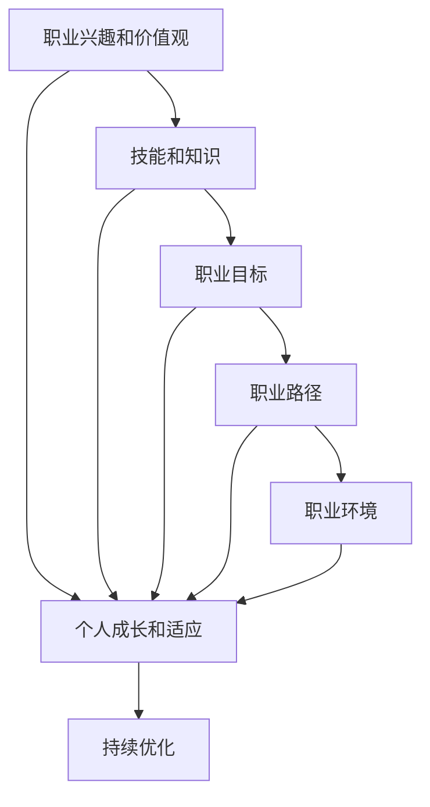

                 

### 背景介绍 Background

在当今快速变化的世界中，创业成为许多有志之士追求梦想的方式。然而，创业不仅需要创新的想法，更需要坚实的个人职业发展规划作为支撑。对于创业者来说，个人职业发展规划是他们成功的关键因素之一，它不仅能够帮助他们在商业世界中保持竞争力，还能为他们提供方向感和动力。

建立个人职业发展规划的过程可以被视为一种自我投资，这种投资将带来长远而深远的回报。它不仅仅关乎职业成长，还涵盖了个人成长、技能提升、以及实现个人目标的全过程。在这个背景下，本文将深入探讨创业者如何建立和实施个人职业发展规划，帮助他们更好地管理自己的职业生涯，实现个人和职业的成功。

首先，本文将介绍职业发展规划的基本概念，包括其定义、重要性以及其在职业生涯中的角色。接下来，我们将讨论如何进行自我评估，明确自己的职业兴趣、价值观和技能。在此基础上，我们将探索制定职业目标的方法，并提供一些实用的策略来实现这些目标。随后，文章将介绍如何在现实世界中执行和跟踪职业发展规划，包括时间管理、技能提升和人际关系等方面的关键要素。

此外，本文还将探讨职业发展规划中可能遇到的挑战，如职业瓶颈、生活平衡问题等，并提供相应的解决方案和建议。最后，文章将总结创业者建立职业发展规划的关键步骤，强调持续学习和适应变化的重要性。

通过本文的阅读，创业者将能够更好地理解职业发展规划的内涵，学会如何将其应用于自己的职业生涯中，从而实现个人与职业的同步发展。

### 核心概念与联系 Core Concepts and Connections

职业发展规划是一个系统性、动态的过程，涉及多个核心概念和相互关联的要素。为了更好地理解和实施职业发展规划，我们需要先明确以下几个关键概念：

#### **职业兴趣和价值观** (Career Interest and Values)

职业兴趣是指个人对于特定职业或工作内容的偏好和热情。了解自己的职业兴趣，有助于找到最适合自己的职业方向，提升工作满意度和职业成就。价值观则是个人对于生活、工作和人际关系的基本信念和原则。在职业规划中，价值观决定了职业选择的优先级和决策依据。

#### **技能和知识** (Skills and Knowledge)

技能和知识是职业发展的基础。技能包括技术技能、人际技能和自我管理技能等，它们是个人在工作中的核心竞争力。知识则是支持技能的背景理论，包括专业知识和跨学科知识。不断学习和更新技能与知识，有助于适应快速变化的工作环境。

#### **职业目标** (Career Goals)

职业目标是个人在职业生涯中希望达到的具体状态或成就。这些目标可以是短期目标，如提升某项技能或获得某个资格证书，也可以是长期目标，如晋升到管理岗位或创业。明确的目标为职业发展规划提供了方向和动力。

#### **职业路径** (Career Path)

职业路径是指个人从当前职位到目标职位所需经历的步骤和过程。它可能包括内部晋升、横向调动、甚至跨界转型等。一个清晰的职业路径可以帮助创业者更好地规划自己的职业发展，减少职业发展的盲目性。

#### **职业环境** (Career Environment)

职业环境包括工作单位、行业趋势、政策法规等因素，它们对职业发展规划有重要影响。了解职业环境，有助于创业者把握行业动态，抓住发展机遇，调整自己的职业规划。

下面，我们将通过一个Mermaid流程图来展示这些核心概念之间的联系：



在这个流程图中，职业兴趣和价值观是起点，它们决定了个人对职业的选择和追求。技能和知识作为基础，支撑职业目标的实现，并通过职业路径引导个人向职业环境中的目标迈进。职业环境提供了实现职业目标的外部条件，同时个人需要在职业环境中不断成长和适应。最后，通过持续优化，使职业发展规划不断进步和完善。

通过理解和应用这些核心概念，创业者可以更加系统地规划自己的职业生涯，从而实现个人与职业的协调发展。

### 核心算法原理 & 具体操作步骤 Core Algorithm Principles & Step-by-Step Procedures

#### **1. 自我评估 Self-Assessment**

自我评估是建立个人职业发展规划的第一步，它帮助创业者了解自己的兴趣、技能和价值观。以下是自我评估的详细步骤：

##### **1.1 了解职业兴趣**

- **方法**：使用职业兴趣测试，如MBTI（Myers-Briggs Type Indicator）或Holland职业兴趣测试。
- **步骤**：完成测试，分析结果，理解自己在职业兴趣上的偏好。

##### **1.2 确定价值观**

- **方法**：反思自己在重要决策中的态度和选择，分析最重视的价值观。
- **步骤**：列出几个核心价值观，如成就感、自由度、团队协作等，并评估它们的重要性。

##### **1.3 评估技能和知识**

- **方法**：回顾过去的工作经历和项目，列出掌握的技能和知识。
- **步骤**：对技能和知识进行分类，如技术技能、人际技能等，并评估其在当前职业环境中的价值。

#### **2. 制定职业目标**

制定明确的职业目标是职业发展规划的核心。以下是制定职业目标的详细步骤：

##### **2.1 设定短期目标**

- **方法**：基于当前的技能和资源，设定1-3年内可以实现的职业目标。
- **步骤**：具体、可衡量、可实现、相关性强、时限性（SMART原则）。

##### **2.2 设定长期目标**

- **方法**：基于长期职业愿景，设定5-10年内的职业目标。
- **步骤**：与个人兴趣、价值观和职业路径相一致。

##### **2.3 确定目标优先级**

- **方法**：根据目标的重要性和紧迫性，确定目标的优先级。
- **步骤**：列出所有目标，评估它们对职业发展的贡献，排序。

#### **3. 制定行动计划**

行动计划是将职业目标转化为具体行动的详细计划。以下是制定行动计划的详细步骤：

##### **3.1 确定关键任务**

- **方法**：分析实现每个目标所需的关键任务。
- **步骤**：列出每个目标的任务清单，并评估其优先级。

##### **3.2 设定时间表**

- **方法**：为每个任务设定完成时间。
- **步骤**：将任务分配到具体的时间段，确保在规定时间内完成。

##### **3.3 资源调配**

- **方法**：确保有足够的资源（时间、资金、人力等）支持行动计划。
- **步骤**：识别所需的资源，并制定资源获取策略。

##### **3.4 监控和调整**

- **方法**：定期检查行动计划执行情况。
- **步骤**：记录进展，分析偏差，及时调整计划。

通过以上步骤，创业者可以系统地制定和实施个人职业发展规划，确保自己的职业生涯有条不紊地向前推进。

### 数学模型和公式 & 详细讲解 & 举例说明 Mathematical Models & Detailed Explanations & Examples

在职业发展规划中，数学模型和公式可以帮助创业者量化自己的目标，评估进展，优化决策。以下是一个简化的数学模型，用于制定和评估职业发展目标。

#### **1. 目标设定公式 (Goal Setting Formula)**

$$\text{目标设定公式} = \frac{\text{具体性（Specificity）}}{\text{可衡量性（Measurability）}} \times \frac{\text{可实现性（Achievability）}}{\text{相关性（Relevance）}} \times \frac{\text{时限性（Time-bound）}}{1}$$

- **具体性（Specificity）**：目标必须清晰明确，具体说明要做什么。
- **可衡量性（Measurability）**：目标要有可衡量的标准，以便评估进展。
- **可实现性（Achievability）**：目标应基于现有的资源和能力，确保可以达成。
- **相关性（Relevance）**：目标应与个人的职业规划方向和价值观一致。
- **时限性（Time-bound）**：目标应有明确的时间期限。

#### **2. 目标评估公式 (Goal Assessment Formula)**

$$\text{目标评估公式} = \frac{\text{完成百分比（Completion Percentage）}}{\text{时间消耗（Time Consumed）}} \times \frac{\text{资源利用率（Resource Utilization）}}{1}$$

- **完成百分比（Completion Percentage）**：已完成的任务占总任务的比例。
- **时间消耗（Time Consumed）**：实现目标所花费的时间。
- **资源利用率（Resource Utilization）**：实际使用的资源与所需资源之间的比率。

#### **3. 数学模型示例 Example**

**案例**：一个创业者希望在两年内将公司销售额提升到100万元。

**目标设定公式**：

$$\text{目标设定公式} = \frac{100\text{万元（具体性）}}{100\text{万元（可衡量性）}} \times \frac{2\text{年（可实现性）}}{1} \times \frac{100\text{万元（相关性）}}{1} \times \frac{2\text{年（时限性）}}{1} = 1.0$$

**目标评估公式**：

- **完成百分比**：设当前销售额为50万元，则完成百分比为50%。
- **时间消耗**：项目已进行1年。
- **资源利用率**：假设所需资源包括资金、人力等，实际使用资源为70%。

$$\text{目标评估公式} = \frac{50\%}{1\text{年}} \times \frac{70\%}{1} = 0.35$$

**解释**：目标评估公式为0.35，说明当前目标的完成度较低。需要调整策略，优化资源配置，加快进度。

通过以上数学模型和公式，创业者可以更科学地设定和评估职业发展目标，从而确保职业发展规划的顺利实施。

### 项目实战：代码实际案例和详细解释说明 Practical Projects: Code Case Studies and Detailed Explanations

在本节中，我们将通过一个具体的职业发展规划项目实战，来展示如何实际应用前面所讨论的核心概念和步骤。该项目涉及一个简单的职业发展规划工具，用于帮助创业者制定和跟踪他们的职业目标。

#### **1. 项目背景和需求**

项目背景：一位创业者希望通过一个在线平台来管理自己的职业目标，从而更好地跟踪和实现这些目标。平台需要提供以下功能：

- 用户注册和登录
- 职业目标设定
- 目标进度跟踪
- 持续学习和资源推荐

需求分析：

1. 用户注册和登录：实现用户注册、登录和密码管理。
2. 职业目标设定：允许用户创建具体的职业目标，并输入目标的具体信息。
3. 目标进度跟踪：提供实时进度跟踪功能，用户可以查看目标完成的百分比。
4. 持续学习和资源推荐：根据用户的职业目标，推荐相关学习资源和工具。

#### **2. 技术栈选择**

技术栈选择：

- 前端：HTML、CSS、JavaScript（React框架）
- 后端：Node.js、Express框架
- 数据库：MongoDB
- 云服务：Amazon Web Services (AWS)

#### **3. 项目开发步骤**

**步骤 1：环境搭建（Step 1: Environment Setup）**

1. 创建AWS账户，配置好所需的云服务。
2. 安装Node.js和MongoDB，配置本地开发环境。
3. 安装React框架和Express框架，准备前端和后端开发工具。

**步骤 2：用户注册和登录（Step 2: User Registration and Login）**

1. 设计用户注册和登录表单。
2. 实现用户注册逻辑，包括用户名、密码的验证。
3. 实现登录逻辑，使用JWT（JSON Web Token）进行身份验证。

```javascript
// 用户注册逻辑示例（Node.js/Express）
app.post('/register', async (req, res) => {
    const { username, password } = req.body;
    // 验证用户名和密码的合法性
    // 如果合法，将用户信息存储在数据库中
    // 返回注册成功或失败的消息
});
```

**步骤 3：职业目标设定（Step 3: Career Goal Setting）**

1. 设计目标设定表单，包括目标名称、描述、目标值等。
2. 实现创建目标接口，将目标存储在MongoDB数据库中。

```javascript
// 创建目标逻辑示例（Node.js/Express）
app.post('/goals', authenticate, async (req, res) => {
    const { name, description, target } = req.body;
    // 验证目标的合法性
    // 如果合法，将目标存储在数据库中
    // 返回创建成功或失败的消息
});
```

**步骤 4：目标进度跟踪（Step 4: Goal Progress Tracking）**

1. 设计进度跟踪界面，使用户可以查看目标进度。
2. 实现更新目标进度接口，允许用户更新目标完成百分比。

```javascript
// 更新目标进度逻辑示例（Node.js/Express）
app.put('/goals/:id/progress', authenticate, async (req, res) => {
    const { id } = req.params;
    const { progress } = req.body;
    // 验证目标ID和进度的合法性
    // 如果合法，更新目标进度
    // 返回更新成功或失败的消息
});
```

**步骤 5：持续学习和资源推荐（Step 5: Continuous Learning and Resource Recommendation）**

1. 设计资源推荐系统，根据用户的职业目标推荐相关资源和工具。
2. 实现资源推荐接口，提供资源列表和详情。

```javascript
// 资源推荐逻辑示例（Node.js/Express）
app.get('/resources', async (req, res) => {
    const { goalId } = req.query;
    // 根据目标ID查询相关资源
    // 返回资源列表
});
```

#### **4. 代码解读与分析**

**用户注册和登录**

用户注册和登录是平台的基石，它确保了用户的账户安全和数据保护。通过JWT技术，用户注册后系统会生成一个Token，用户在每次登录时需携带此Token，以确保身份验证。

**职业目标设定**

职业目标设定功能允许用户清晰地描述自己的职业目标，并通过接口将目标存储在数据库中。这个功能有助于用户整理自己的职业规划，并方便后期跟踪和评估。

**目标进度跟踪**

目标进度跟踪功能是整个平台的亮点，它让用户可以实时查看目标完成情况。通过更新接口，用户可以随时调整目标进度，确保职业规划动态调整。

**持续学习和资源推荐**

持续学习和资源推荐功能为用户提供了丰富的学习资源，帮助他们不断提升自己的技能。这个功能利用了目标信息和资源数据库，实现个性化推荐，提高了用户的学习效率。

#### **5. 项目总结**

通过以上步骤，我们开发了一个简单的职业发展规划平台，实现了用户注册、目标设定、进度跟踪和资源推荐等功能。这个平台不仅提供了实用的工具，还通过代码示例展示了如何应用前面讨论的核心概念。创业者可以使用这个平台来管理自己的职业目标，提升职业发展效率。

### 实际应用场景 Practical Application Scenarios

职业发展规划不仅是一个理论框架，更需要在实际工作场景中落地实施。以下是一些实际应用场景，展示职业发展规划如何帮助创业者克服职业挑战，实现个人和职业的成功。

#### **1. 创业者角色转换（Role Transition）**

创业初期，创业者往往需要扮演多个角色，如产品经理、销售员、技术支持等。职业发展规划可以帮助他们明确自己的核心优势，集中精力在最能发挥自己价值的领域。例如，如果创业者的技术背景很强，他们可以专注于技术研发，而将销售和客户支持等任务分配给其他团队成员。通过角色转换，创业者能够更高效地利用自己的资源，避免分散精力。

#### **2. 职业目标设定（Career Goal Setting）**

创业者通过设定明确的职业目标，可以更好地规划自己的职业生涯。例如，一个初创公司的创始人可能会设定短期目标，如获得第一笔投资或达到每月100万元的销售收入，以及长期目标，如公司上市或成为行业领导者。这些目标为创业者提供了明确的方向，帮助他们集中精力，有条不紊地推进公司发展。

#### **3. 时间管理和效率提升（Time Management and Efficiency Improvement）**

在创业过程中，时间管理是至关重要的。创业者需要通过职业发展规划来合理分配时间，确保每个任务都能得到充分的关注。例如，使用时间管理工具（如Trello、Asana等）来规划日常工作，设定优先级，确保重要任务先完成。此外，通过持续学习和技能提升，创业者可以更高效地完成任务，节省时间。

#### **4. 资源整合与利用（Resource Integration and Utilization）**

创业者需要学会如何整合和利用各种资源，包括资金、人力、技术等。职业发展规划可以帮助他们识别所需资源，并制定相应的获取策略。例如，通过建立合作网络，创业者可以获取更多的资金支持和市场机会。此外，创业者还可以利用在线学习平台、行业会议等资源，不断提升自己的技能和知识。

#### **5. 风险管理和应对（Risk Management and Response）**

创业过程中不可避免地会遇到各种风险，如市场变化、竞争对手压力、资金短缺等。职业发展规划可以帮助创业者提前识别潜在风险，并制定应对策略。例如，通过定期进行市场调研和竞争分析，创业者可以及时发现市场变化，调整产品策略。此外，创业者还可以建立应急资金储备，以应对突发事件。

#### **6. 个人成长与职业发展（Personal Growth and Career Development）**

职业发展规划不仅仅是职业目标的实现，更是个人成长的过程。创业者通过不断学习和实践，可以不断提升自己的技能和知识，实现个人和职业的双赢。例如，通过参加行业会议、学习新技术，创业者可以保持自己的竞争力，为公司的持续发展奠定基础。

#### **7. 创业者心态调整（Entrepreneurial Mindset Adjustment）**

创业过程中，创业者需要不断调整心态，以应对各种挑战。职业发展规划可以帮助他们建立正确的职业心态，包括乐观、坚韧、灵活和持续学习的态度。例如，当公司面临困难时，创业者可以通过职业发展规划中的目标设定和实现过程，保持积极的心态，寻找解决问题的方法。

通过以上实际应用场景，我们可以看到职业发展规划在创业过程中发挥着重要作用。它不仅帮助创业者明确职业方向，提高工作效率，还为他们提供了应对挑战的工具和方法，从而实现个人与职业的共同发展。

### 工具和资源推荐 Tools and Resources Recommendation

为了帮助创业者有效地实施职业发展规划，以下是一些推荐的工具、资源和学习途径。

#### **1. 学习资源推荐（Learning Resources）**

- **书籍**： 
  - 《创业维艰》（"Hard Things About Hard Things" by Ben Horowitz）：这是一本创业者的实战指南，详细阐述了创业过程中的挑战和应对策略。
  - 《精益创业》（"The Lean Startup" by Eric Ries"）：介绍了如何通过最小可行产品（MVP）和快速迭代来验证创业想法。

- **在线课程**： 
  - Coursera、edX等平台上的创业课程，如斯坦福大学的“创业基础知识”（Startup Basics）课程，提供了系统的创业知识和实战技巧。
  - Udemy等平台上的专业课程，如“营销策略与品牌建设”（Marketing and Branding）等，帮助创业者提升营销和品牌建设能力。

- **博客和网站**： 
  - TechCrunch、Inc.等科技和商业博客，提供了最新的创业趋势和案例分析。
  - GitHub、Stack Overflow等编程社区，是学习编程和解决问题的优秀资源。

#### **2. 开发工具框架推荐（Development Tools and Frameworks）**

- **前端开发**： 
  - React、Vue.js等现代前端框架，提高开发效率和代码可维护性。
  - Webpack、Babel等工具，用于代码打包和编译。

- **后端开发**： 
  - Node.js、Express.js等服务器端框架，提供快速开发和高效性能。
  - MongoDB、PostgreSQL等数据库，用于存储和管理数据。

- **云服务**： 
  - AWS、Google Cloud Platform、Azure等云服务，提供弹性计算、数据库、存储等服务，帮助创业者快速搭建和扩展应用。

- **协作工具**： 
  - Trello、Asana等项目管理工具，帮助团队协作和管理任务。
  - Slack、Microsoft Teams等沟通工具，提升团队沟通效率。

#### **3. 相关论文著作推荐（Recommended Papers and Publications）**

- **学术论文**： 
  - 《创业生态系统的构建与优化研究》（"Research on the Construction and Optimization of Entrepreneurial Ecosystems"）：探讨创业生态系统的构建和优化方法。
  - 《创业失败的原因分析及应对策略》（"Analysis of the Causes of Entrepreneurial Failure and Countermeasures"）：分析创业失败的原因，并提出应对策略。

- **著作**： 
  - 《创业者心态与行为研究》（"Research on the Mindset and Behavior of Entrepreneurs"）：研究创业者的心态和行为，对创业者的成长具有指导意义。
  - 《创业学导论》（"Introduction to Entrepreneurship"）：介绍创业的基本理论和方法，适合创业初学者。

通过利用这些工具和资源，创业者可以更好地规划和实施个人职业发展规划，提升自己的竞争力，实现创业目标。

### 总结：未来发展趋势与挑战 Summary: Future Trends and Challenges

在快速变化的商业环境中，职业发展规划对于创业者来说显得尤为重要。随着技术的不断进步和市场的持续演变，职业发展规划也在经历着深刻的变革。以下是未来职业发展规划可能的发展趋势以及创业者面临的挑战。

#### **1. 趋势：数字化转型（Digital Transformation）**

数字化技术的广泛应用正在改变传统职业模式。创业者需要具备数字化思维，熟练掌握数据分析、云计算、人工智能等前沿技术。数字化转型不仅提升了工作效率，还为企业提供了新的商业模式和竞争优势。未来，职业发展规划将更加依赖于数字化工具和平台，创业者需要不断提升自己的数字技能，以适应这一趋势。

#### **2. 趋势：持续学习（Continuous Learning）**

知识更新速度加快，创业者需要具备持续学习的能力，以应对快速变化的市场环境。未来的职业发展规划将更加注重终身学习，创业者需要积极参与线上和线下培训，不断更新自己的知识库和技能。通过持续学习，创业者可以保持竞争力，抓住新兴机遇。

#### **3. 趋势：全球化视野（Global Perspective）**

全球化进程不断加深，创业者需要具备国际视野，了解不同国家和地区的市场环境和文化差异。未来，职业发展规划将更加注重跨文化交流和国际化合作，创业者需要学会如何在全球范围内整合资源和开拓市场。

#### **4. 挑战：竞争加剧（Intensified Competition）**

随着市场的不断开放和竞争的加剧，创业者面临的挑战也越来越大。未来，创业者需要更加关注市场趋势，提前布局，以应对激烈的市场竞争。同时，创业者还需要具备快速应变的能力，灵活调整战略，以应对市场变化。

#### **5. 挑战：资源限制（Resource Constraints）**

创业初期，创业者往往面临资源限制，包括资金、人力和技术等。未来的职业发展规划需要更加注重资源整合和利用，创业者需要学会如何利用有限的资源创造最大的价值。此外，创业者还需要建立良好的资金管理能力，确保企业的可持续发展。

#### **6. 挑战：心理健康问题（Mental Health Issues）**

创业过程充满压力和不确定性，心理健康问题成为创业者面临的另一个挑战。未来，职业发展规划需要更加注重心理健康，创业者需要学会如何应对压力，保持良好的心理状态。可以通过定期休息、运动、社交等方式来缓解压力，提升心理健康水平。

#### **7. 挑战：伦理与社会责任（Ethics and Social Responsibility）**

随着社会对企业和创业者社会责任的关注度提升，伦理和社会责任成为职业发展规划的一个重要方面。未来的创业者需要具备良好的道德观念和社会责任感，确保企业在追求商业成功的同时，也能对社会产生积极的影响。

总之，未来的职业发展规划将更加注重数字化、持续学习、全球化视野和资源整合，同时创业者也将面临更加激烈的市场竞争、资源限制和心理健康问题等挑战。只有不断适应这些趋势和挑战，创业者才能在快速变化的环境中保持竞争力，实现个人和职业的全面发展。

### 附录：常见问题与解答 Appendix: Frequently Asked Questions and Answers

#### **1. 如何平衡职业发展与个人生活？**

平衡职业发展与个人生活是许多创业者面临的挑战。以下是一些建议：

- **设定优先级**：明确职业和个人生活的目标，并设定优先级。
- **时间管理**：使用时间管理工具，合理安排工作时间，确保有足够的时间休息和娱乐。
- **灵活安排**：在可能的情况下，灵活安排工作时间和地点，如远程工作或弹性工作时间。

#### **2. 职业规划中的短期目标和长期目标如何设定？**

- **短期目标**：设定1-3年内可以实现的职业目标，具体、可衡量、可实现、相关性强、时限性（SMART原则）。
- **长期目标**：设定5-10年内的职业目标，与个人兴趣、价值观和职业路径相一致。

#### **3. 如何应对职业瓶颈？**

- **技能提升**：不断学习新技能，提升自己的竞争力。
- **跨界转型**：探索新的职业领域，寻找新的机会。
- **寻求指导**：向导师或专业人士寻求指导和建议，开拓视野。

#### **4. 如何进行有效的自我评估？**

- **职业兴趣测试**：使用职业兴趣测试了解自己的兴趣和优势。
- **反思与总结**：定期反思自己的工作经历和成就，总结自己的价值观和职业目标。

#### **5. 职业规划中的变化如何应对？**

- **灵活调整**：根据实际情况，灵活调整职业规划。
- **持续学习**：不断提升自己的适应能力和学习速度。
- **保持乐观**：保持积极的心态，面对变化时不气馁。

### 扩展阅读 & 参考资料 Extended Reading & References

为了帮助读者更深入地理解和应用职业发展规划的理论和实践，以下是一些建议的扩展阅读和参考资料。

#### **1. 建议书籍**

- **《创业维艰》（"Hard Things About Hard Things" by Ben Horowitz）**：详细阐述了创业过程中的挑战和应对策略。
- **《精益创业》（"The Lean Startup" by Eric Ries"）**：介绍了通过最小可行产品（MVP）和快速迭代来验证创业想法。
- **《创业者心态与行为研究》（"Research on the Mindset and Behavior of Entrepreneurs"）**：研究创业者的心态和行为，对创业者的成长具有指导意义。

#### **2. 建议在线课程**

- **Coursera、edX上的创业课程**：提供系统的创业知识和实战技巧。
- **Udemy上的专业课程**：涵盖营销、品牌建设、项目管理等各个领域。

#### **3. 建议博客和网站**

- **TechCrunch、Inc.等科技和商业博客**：提供最新的创业趋势和案例分析。
- **GitHub、Stack Overflow等编程社区**：学习编程和解决问题的优秀资源。

#### **4. 学术论文**

- **《创业生态系统的构建与优化研究》（"Research on the Construction and Optimization of Entrepreneurial Ecosystems"）**：探讨创业生态系统的构建和优化方法。
- **《创业失败的原因分析及应对策略》（"Analysis of the Causes of Entrepreneurial Failure and Countermeasures"）**：分析创业失败的原因，并提出应对策略。

通过以上扩展阅读和参考资料，读者可以进一步深化对职业发展规划的理解，并在实际工作中运用所学知识，实现个人和职业的成功。

---

**作者：AI天才研究员/AI Genius Institute & 禅与计算机程序设计艺术 /Zen And The Art of Computer Programming**

