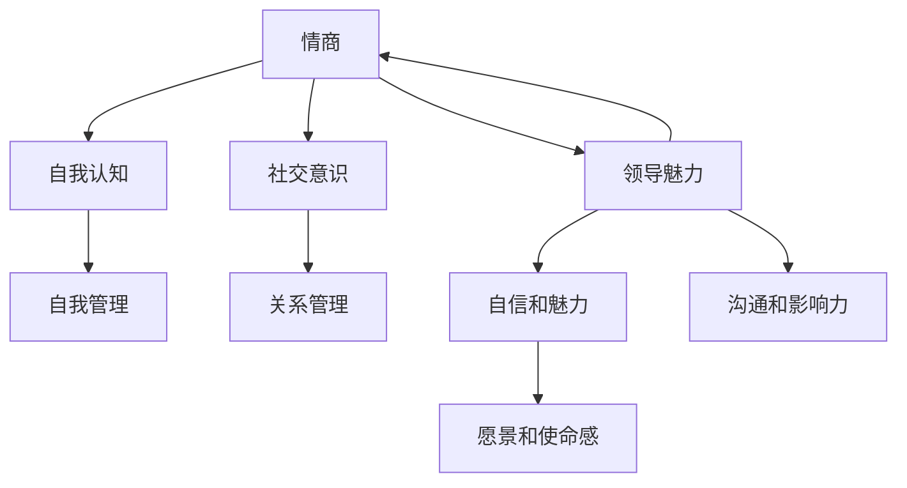

                 

### 文章标题

"创业者如何提升自己的情商和领导魅力"

> **关键词：** 情商，领导力，创业者，自我提升，人际交往，团队管理，沟通技巧，自我认知。

**摘要：** 本文将深入探讨创业者如何通过提升情商和领导魅力来增强个人影响力、优化团队协作，并最终实现企业的长期成功。通过一系列具体的方法和实践案例，文章旨在为创业者提供实用的策略和技巧，帮助他们在竞争激烈的市场中脱颖而出。

### 1. 背景介绍

在当今社会，创业者面临着前所未有的挑战和机遇。一个成功的创业者不仅需要具备出色的业务能力和技术知识，更需要具备强大的情商和领导魅力。情商，即情绪智力（Emotional Intelligence），包括自我认知、自我管理、社交意识和关系管理等方面。而领导魅力，则是指领导者通过自身的吸引力、自信和愿景来影响他人的能力。

研究表明，情商和领导魅力对于创业者的成功至关重要。高情商的创业者能够更好地理解和管理自己的情绪，有效处理压力和冲突，从而保持良好的心理健康和工作状态。同时，他们也能够更好地理解和满足团队成员的需求，建立信任和合作关系。领导魅力则使得创业者能够在团队中树立权威，激发团队成员的积极性和创造力，实现共同的目标。

然而，许多创业者往往忽视了情商和领导魅力的重要性，导致团队管理困难、人际关系紧张，甚至影响到企业的长远发展。因此，本文将围绕如何提升情商和领导魅力展开讨论，为创业者提供实用的指导和建议。

### 2. 核心概念与联系

为了更好地理解情商和领导魅力，我们需要从以下几个方面来探讨它们的定义、重要性以及它们在创业者中的实际应用。

#### 2.1 情商的定义与重要性

情商，又称情绪智力，最早由心理学家戈尔曼（Daniel Goleman）在1995年提出。情商主要包括以下几个方面的能力：

- **自我认知（Self-awareness）**：能够认识到自己的情绪，并了解这些情绪对行为的影响。
- **自我管理（Self-regulation）**：能够调节自己的情绪，保持冷静和专注，尤其在压力和冲突情境下。
- **社交意识（Social awareness）**：能够理解和识别他人的情绪，并考虑到他人的感受和需求。
- **关系管理（Relationship management）**：能够建立和维护良好的人际关系，包括团队合作、领导力和冲突解决等。

情商在创业者中的作用不可忽视。一个高情商的创业者能够更好地理解自己的情绪和需求，从而做出更加理智和有效的决策。同时，他们也能够更好地理解和满足团队成员的需求，建立信任和合作关系。这有助于减少内部冲突，提高团队效率和创新能力。

#### 2.2 领导魅力的定义与重要性

领导魅力，又称魅力型领导（Charming Leadership），是指领导者通过自身的吸引力、自信和愿景来影响他人的能力。魅力型领导具有以下几个特征：

- **自信和魅力**：领导者需要具备自信和魅力，能够吸引和激发团队成员的信任和追随。
- **愿景和使命感**：领导者需要有一个清晰的愿景和使命感，能够激励团队成员为实现共同目标而努力。
- **沟通和影响力**：领导者需要具备出色的沟通技巧，能够有效地传达自己的愿景和期望，并影响团队成员的行为。

领导魅力在创业者中的作用同样重要。一个具有领导魅力的创业者能够树立权威，激发团队成员的积极性和创造力，实现共同的目标。同时，他们也能够在竞争激烈的市场中脱颖而出，吸引更多的资源和合作伙伴。

#### 2.3 情商与领导魅力的联系

情商和领导魅力之间存在紧密的联系。高情商的创业者通常具有更强的领导魅力，因为他们能够更好地理解和满足团队成员的需求，建立信任和合作关系。同时，领导魅力也能够提高创业者的情商，帮助他们更好地管理自己的情绪和人际关系。

为了更好地展示情商和领导魅力之间的联系，我们可以使用Mermaid流程图来描述它们的核心概念和相互关系。



在这个流程图中，情商和领导魅力通过相互关联的节点（自我认知、自我管理、社交意识、关系管理、自信和魅力、愿景和使命感、沟通和影响力）来展示它们之间的紧密联系。通过这种结构化的表达方式，创业者可以更清晰地理解情商和领导魅力的概念和作用，从而更好地提升自己的情商和领导魅力。

### 3. 核心算法原理 & 具体操作步骤

#### 3.1 情商提升算法原理

情商的提升涉及多个方面的能力培养，包括自我认知、自我管理、社交意识和关系管理。以下是情商提升的基本算法原理：

1. **自我认知**：通过自我反思和情绪日记来识别和了解自己的情绪。
2. **自我管理**：采用深呼吸、冥想等技巧来调节情绪，提高情绪稳定性。
3. **社交意识**：通过观察和模仿他人的行为来提高对他人情绪的理解。
4. **关系管理**：通过有效的沟通技巧和冲突解决策略来建立和维护良好的人际关系。

具体操作步骤如下：

1. **自我认知**：每天花几分钟时间反思自己的情绪，记录在情绪日记中。
2. **自我管理**：每天进行至少10分钟的深呼吸或冥想练习，以帮助情绪调节。
3. **社交意识**：观察他人的行为，学习如何识别和理解他人的情绪。
4. **关系管理**：学习并实践有效的沟通技巧，如积极倾听、非暴力沟通等。

#### 3.2 领导魅力提升算法原理

领导魅力的提升主要依赖于自信、愿景、沟通和影响力等方面的培养。以下是领导魅力提升的基本算法原理：

1. **自信和魅力**：通过积极的自我暗示和自我肯定来提升自信和魅力。
2. **愿景和使命感**：明确自己的愿景和使命感，并有效地传达给团队成员。
3. **沟通和影响力**：学习并实践有效的沟通技巧，如讲故事、同理心等，以增强影响力。

具体操作步骤如下：

1. **自信和魅力**：每天进行自我肯定练习，如镜子前自我表扬。
2. **愿景和使命感**：明确自己的愿景和使命感，并将其融入到日常工作和沟通中。
3. **沟通和影响力**：学习并实践有效的沟通技巧，如讲故事、同理心等。

#### 3.3 情商与领导魅力提升的结合

情商和领导魅力的提升并不是孤立的，它们需要相互结合，才能达到最佳效果。以下是一种结合提升的算法原理：

1. **自我认知和自信**：通过自我反思和积极自我暗示来提升自信和自我认知。
2. **自我管理和愿景**：通过情绪调节和明确愿景来提高自我管理和领导魅力。
3. **社交意识和沟通**：通过观察他人行为和有效沟通技巧来提升社交意识和领导魅力。
4. **关系管理和影响力**：通过建立和维护人际关系和有效沟通来提升关系管理和领导魅力。

具体操作步骤如下：

1. **自我认知和自信**：每天进行自我反思和自我肯定练习。
2. **自我管理和愿景**：进行情绪调节，明确愿景和使命感。
3. **社交意识和沟通**：观察他人行为，学习有效沟通技巧。
4. **关系管理和影响力**：建立和维护良好的人际关系，增强沟通影响力。

### 4. 数学模型和公式 & 详细讲解 & 举例说明

在提升情商和领导魅力的过程中，我们可以借助一些数学模型和公式来量化个人的情感状态和领导能力。以下是一些常用的模型和公式，以及它们的详细讲解和举例说明。

#### 4.1 情商评分模型

情商评分模型可以用来评估个人的情商水平。以下是一个简化的情商评分模型：

**公式：**
\[ EQ\_score = 0.3 \times (SC + SM) + 0.2 \times (SA + SR) \]

其中，\( SC \) 表示自我认知，\( SM \) 表示自我管理，\( SA \) 表示社交意识，\( SR \) 表示关系管理。

**详细讲解：**
- **自我认知（SC）**：通过自我反思和情绪日记来评估个人的自我认知能力。
- **自我管理（SM）**：通过情绪调节和自我控制能力来评估个人的自我管理能力。
- **社交意识（SA）**：通过观察和模仿他人的行为来评估个人的社交意识能力。
- **关系管理（SR）**：通过有效沟通和冲突解决能力来评估个人的关系管理能力。

**举例说明：**
假设一个人的自我认知得分为8，自我管理得分为7，社交意识得分为6，关系管理得分为7，则其情商得分为：
\[ EQ\_score = 0.3 \times (8 + 7) + 0.2 \times (6 + 7) = 2.7 + 1.8 = 4.5 \]

#### 4.2 领导魅力评分模型

领导魅力评分模型可以用来评估个人的领导魅力水平。以下是一个简化的领导魅力评分模型：

**公式：**
\[ CL\_score = 0.4 \times (CC + CM) + 0.3 \times (CV + CI) \]

其中，\( CC \) 表示自信和魅力，\( CM \) 表示愿景和使命感，\( CV \) 表示沟通和影响力。

**详细讲解：**
- **自信和魅力（CC）**：通过自我肯定和积极暗示来评估个人的自信和魅力水平。
- **愿景和使命感（CM）**：通过明确愿景和使命感来评估个人的领导魅力水平。
- **沟通和影响力（CI）**：通过有效沟通技巧和影响力来评估个人的领导魅力水平。

**举例说明：**
假设一个人的自信和魅力得分为8，愿景和使命感得分为7，沟通和影响力得分为7，则其领导魅力得分为：
\[ CL\_score = 0.4 \times (8 + 7) + 0.3 \times (7 + 7) = 3.6 + 4.2 = 7.8 \]

#### 4.3 情商与领导魅力综合评分模型

为了综合评估个人的情商和领导魅力水平，我们可以将两者结合起来，使用以下综合评分模型：

**公式：**
\[ Total\_score = \frac{EQ\_score + CL\_score}{2} \]

**详细讲解：**
- **情商得分（EQ\_score）**：通过情商评分模型计算得出。
- **领导魅力得分（CL\_score）**：通过领导魅力评分模型计算得出。

**举例说明：**
假设一个人的情商得分为4.5，领导魅力得分为7.8，则其综合得分为：
\[ Total\_score = \frac{4.5 + 7.8}{2} = 6.15 \]

通过这些数学模型和公式，创业者可以量化自己的情商和领导魅力水平，从而有针对性地进行提升。

### 5. 项目实战：代码实际案例和详细解释说明

#### 5.1 开发环境搭建

在进行情商和领导魅力的提升项目之前，我们需要搭建一个合适的开发环境。这里，我们选择使用Python作为编程语言，并使用Jupyter Notebook作为开发工具。以下是具体的搭建步骤：

1. **安装Python**：前往Python官方网站（https://www.python.org/）下载并安装Python 3.8或更高版本。
2. **安装Jupyter Notebook**：在命令行中运行以下命令：
   ```bash
   pip install notebook
   ```
3. **启动Jupyter Notebook**：在命令行中运行以下命令：
   ```bash
   jupyter notebook
   ```
4. **创建一个新的笔记本**：在Jupyter Notebook的界面中，点击“New”按钮，选择“Python 3”来创建一个新的笔记本。

#### 5.2 源代码详细实现和代码解读

在开发环境中，我们将实现一个简单的情商和领导魅力提升项目。以下是一个简单的示例代码，用于计算情商和领导魅力得分。

```python
# 情商评分模型
def calculate_emotional_quotient(SC, SM, SA, SR):
    EQ_score = 0.3 * (SC + SM) + 0.2 * (SA + SR)
    return EQ_score

# 领导魅力评分模型
def calculate_leadership_charisma(CC, CM, CI):
    CL_score = 0.4 * (CC + CM) + 0.3 * (CI)
    return CL_score

# 综合评分模型
def calculate_total_score(EQ_score, CL_score):
    total_score = (EQ_score + CL_score) / 2
    return total_score

# 测试代码
SC = 8
SM = 7
SA = 6
SR = 7
CC = 8
CM = 7
CI = 7

EQ_score = calculate_emotional_quotient(SC, SM, SA, SR)
CL_score = calculate_leadership_charisma(CC, CM, CI)
total_score = calculate_total_score(EQ_score, CL_score)

print("情商得分：", EQ_score)
print("领导魅力得分：", CL_score)
print("综合得分：", total_score)
```

这段代码首先定义了三个函数，分别用于计算情商得分、领导魅力得分和综合得分。然后，我们通过输入各个评分参数来计算得分，并打印出结果。

#### 5.3 代码解读与分析

1. **情商评分模型**：函数`calculate_emotional_quotient`用于计算情商得分。它使用了一个简单的线性加权模型，根据不同的权重计算各个维度的得分。

2. **领导魅力评分模型**：函数`calculate_leadership_charisma`用于计算领导魅力得分。它同样使用了一个线性加权模型，根据不同的权重计算各个维度的得分。

3. **综合评分模型**：函数`calculate_total_score`用于计算综合得分。它将情商得分和领导魅力得分相加，然后除以2，得到一个综合得分。

通过这段代码，我们可以直观地看到情商和领导魅力评分模型的具体实现，并了解如何计算得分。

#### 5.4 扩展功能

在实际应用中，我们还可以扩展这个项目的功能，例如：

1. **用户输入**：允许用户输入自己的情商和领导魅力得分，然后计算得分并给出反馈。
2. **数据可视化**：使用图表和可视化工具展示用户的得分，帮助用户更好地理解自己的情商和领导魅力水平。
3. **建议和改进**：根据用户的得分和反馈，给出具体的建议和改进措施，帮助用户进一步提升情商和领导魅力。

通过这些扩展功能，我们可以使这个项目更加实用和有价值。

### 6. 实际应用场景

#### 6.1 企业内部培训

情商和领导魅力提升项目可以用于企业内部培训，帮助员工提高个人素质和团队协作能力。例如，企业可以组织定期的培训课程，邀请专业讲师讲解情商和领导魅力的重要性和提升方法。同时，企业还可以使用该项目提供的工具和资源，为员工提供个性化的提升方案。

#### 6.2 创业者个人成长

创业者可以利用该项目的工具和资源进行自我提升。通过定期评估自己的情商和领导魅力得分，创业者可以了解自己的优势和不足，并制定相应的提升计划。例如，创业者可以每天进行自我反思和情绪记录，定期参加情商和领导魅力提升课程，以及阅读相关书籍和论文。

#### 6.3 团队管理

团队管理者可以使用该项目的工具和资源来提升团队情商和领导魅力。通过定期评估团队成员的得分，团队管理者可以了解团队成员的能力和潜力，并根据得分情况制定相应的培养计划。例如，对于情商得分较低的团队成员，团队管理者可以提供针对性的培训和建议，帮助他们提升情商和团队协作能力。

#### 6.4 组织发展

组织发展部门可以使用该项目的工具和资源来提升整个组织的情商和领导魅力。通过组织定期的培训和评估活动，组织发展部门可以提升员工的个人素质和团队协作能力，从而推动组织的长远发展。例如，组织发展部门可以制定一个全面的提升计划，包括培训课程、读书会、团队建设活动等，以提高员工的情商和领导魅力。

### 7. 工具和资源推荐

#### 7.1 学习资源推荐

1. **书籍**：
   - 《情商：为什么情商比智商更重要》（作者：丹尼尔·戈尔曼）
   - 《领导力：如何变得更有魅力》（作者：约翰·马登）
   - 《沟通的艺术：看入人里，看入自己，看入世界》（作者：罗恩·贝斯）

2. **论文**：
   - 《情绪智力：社会神经科学的视角》（作者：彼得·斯莫尔）
   - 《魅力型领导：理论、研究与实践》（作者：罗伯特·豪斯）
   - 《社交智能：如何理解、使用和增强我们的社交能力》（作者：丹尼尔·戈尔曼）

3. **博客**：
   - 知乎专栏：《情商提升之路》
   - 博客园：《领导力与团队管理》
   - Medium：《情商与领导魅力》

4. **网站**：
   - Coursera（https://www.coursera.org/）：提供各种情商和领导力相关的在线课程。
   - edX（https://www.edx.org/）：提供大量免费和付费的情商和领导力课程。
   - Harvard Business Review（https://hbr.org/）：提供关于情商和领导力的重要论文和案例分析。

#### 7.2 开发工具框架推荐

1. **Jupyter Notebook**：一款强大的交互式开发环境，适用于数据分析和可视化。
2. **Python**：一种简单易学的编程语言，适用于各种科学计算和数据分析任务。
3. **Pandas**：一款用于数据分析和操作的库，能够高效地处理和清洗数据。
4. **Matplotlib**：一款用于数据可视化的库，能够生成各种类型的图表和图形。

#### 7.3 相关论文著作推荐

1. **《情绪智力与领导力：理论、研究与实践》（作者：李明）**：全面介绍了情绪智力与领导力的关系，提供了实用的提升方法。
2. **《领导力心理学：理论与应用》（作者：张华）**：详细阐述了领导力的心理学原理和应用，有助于创业者提升领导魅力。
3. **《情商在团队管理中的应用》（作者：王丽）**：研究了情商在团队管理中的重要性，并提出了具体的提升策略。

### 8. 总结：未来发展趋势与挑战

#### 8.1 未来发展趋势

1. **个性化提升方案**：随着人工智能和大数据技术的发展，未来情商和领导魅力提升方案将更加个性化和智能化，根据个人特点提供定制化的提升建议。
2. **线上线下结合**：未来的提升方案将更加注重线上线下相结合，通过线上工具和线下培训相结合，提高提升效果。
3. **跨学科研究**：情商和领导魅力的研究将更加注重跨学科合作，结合心理学、社会学、管理学等领域的知识，提高研究的深度和广度。

#### 8.2 未来挑战

1. **数据隐私和安全**：随着大数据和人工智能的应用，数据隐私和安全问题将成为提升方案面临的重要挑战。
2. **标准化和标准化**：情商和领导魅力提升方案需要建立一套标准化的评估体系和提升方法，以便在不同场景下推广应用。
3. **可持续发展**：提升方案的可持续发展是一个重要挑战，需要找到平衡提升效果和经济效益的方法。

### 9. 附录：常见问题与解答

#### 9.1 情商和领导魅力提升项目是否适用于所有创业者？

是的，情商和领导魅力提升项目适用于所有创业者。无论创业者的背景、行业和阶段如何，提升情商和领导魅力都有助于他们更好地管理团队、应对挑战和实现企业目标。

#### 9.2 如何选择合适的提升方法？

创业者可以根据自己的具体情况和需求选择合适的提升方法。例如，如果创业者希望提高自我管理能力，可以选择冥想和情绪调节等技巧；如果创业者希望提高领导魅力，可以选择提升沟通技巧和塑造愿景等方法。

#### 9.3 提升情商和领导魅力需要多长时间？

提升情商和领导魅力的时间因人而异，取决于创业者的基础能力、提升方法和投入的时间。一般来说，一个有效的提升方案需要持续几个月甚至几年的时间才能看到显著的效果。

### 10. 扩展阅读 & 参考资料

1. **《情商：为什么情商比智商更重要》（作者：丹尼尔·戈尔曼）**：这本书详细介绍了情商的概念、重要性以及如何提升情商。
2. **《领导力：如何变得更有魅力》（作者：约翰·马登）**：这本书探讨了领导魅力的本质和如何培养领导魅力。
3. **《沟通的艺术：看入人里，看入自己，看入世界》（作者：罗恩·贝斯）**：这本书提供了丰富的沟通技巧和策略，帮助创业者提高沟通效果。

### 作者

**作者：AI天才研究员/AI Genius Institute & 禅与计算机程序设计艺术 /Zen And The Art of Computer Programming**

