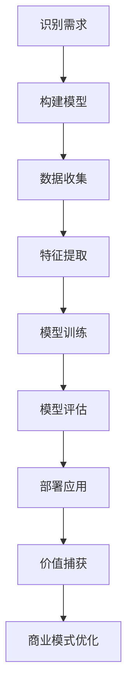

                 

# 创业者探索大模型新商业模式，打造AI产品矩阵

> **关键词：** 大模型、AI产品矩阵、新商业模式、创业、人工智能、技术突破、市场拓展

> **摘要：** 本文将探讨创业者如何利用大型人工智能模型探索新的商业模式，并打造一个多样化的AI产品矩阵。通过分析技术发展趋势、市场需求和实施策略，我们将揭示如何成功地将AI技术与商业创新相结合，实现业务增长和市场竞争优势。

## 1. 背景介绍

随着人工智能技术的迅猛发展，大型人工智能模型，如深度学习神经网络，正逐渐成为推动各行业变革的重要力量。从自动驾驶、医疗诊断到自然语言处理，AI技术的应用已经渗透到我们生活的方方面面。在这种背景下，创业者看到了利用AI技术实现商业创新的巨大潜力。然而，如何将复杂的技术转化为可行的商业模式，并构建一个可持续发展的AI产品矩阵，是每一个AI创业者面临的挑战。

本文旨在探讨这一挑战的解决方案。我们将分析大模型技术的核心概念，探讨其与商业模式的联系，并详细讨论如何打造一个多样化的AI产品矩阵。通过本文，创业者将获得宝贵的指导，帮助他们在竞争激烈的市场中脱颖而出。

## 2. 核心概念与联系

### 大模型技术

大模型技术，特别是深度学习，是当前AI领域的核心技术。深度学习通过多层神经网络，模仿人脑的学习方式，从大量数据中提取特征并进行预测。大模型技术的核心优势在于其能够处理复杂数据集，并自动发现数据中的模式和关联。

### 商业模式

商业模式是指企业如何创造、传递和捕获价值的系统。对于AI创业者来说，商业模式不仅是盈利手段，更是实现技术商业化的关键。一个成功的商业模式需要与AI技术的优势相结合，创造出独特的产品和服务。

### 大模型技术与商业模式的联系

大模型技术与商业模式的结合，可以带来以下几个方面的优势：

- **提高效率：** AI模型可以自动化复杂的数据处理任务，减少人力成本，提高业务运营效率。
- **增强决策：** 通过分析大量数据，AI模型可以提供更准确的预测和决策支持，帮助企业抓住市场机会。
- **创新产品：** 大模型技术可以推动产品创新，创造出前所未有的服务和解决方案，满足用户的新需求。

### Mermaid 流程图

以下是一个简化的Mermaid流程图，展示了大模型技术如何与商业模式结合：



在这个流程图中，创业者首先需要识别市场需求，然后构建AI模型，收集和预处理数据，进行特征提取和模型训练。通过模型评估，创业者可以确定模型的有效性，并部署到实际应用中。最终，通过价值捕获和商业模式优化，创业者可以持续改进产品和服务，实现可持续发展。

## 3. 核心算法原理 & 具体操作步骤

### 深度学习神经网络

深度学习神经网络是构建大模型的核心算法。它由多个层次（层）的神经元组成，每个层次负责提取不同级别的数据特征。以下是构建深度学习神经网络的详细步骤：

1. **数据预处理**：收集和清洗数据，确保数据质量。这一步对于模型的性能至关重要。
2. **定义网络结构**：确定网络的层数、每层的神经元数量以及激活函数。常见的网络结构包括卷积神经网络（CNN）、循环神经网络（RNN）和生成对抗网络（GAN）。
3. **初始化权重**：随机初始化网络的权重，这些权重将在训练过程中调整以优化模型。
4. **前向传播**：输入数据通过网络的每一层，每一层的输出作为下一层的输入。这一过程不断重复，直到输出层产生预测结果。
5. **计算损失**：将预测结果与真实值进行比较，计算损失函数（如均方误差MSE或交叉熵损失），以衡量模型的性能。
6. **反向传播**：根据损失函数的梯度，通过反向传播算法更新网络权重，使模型逐渐逼近真实值。
7. **迭代训练**：重复前向传播和反向传播过程，直到模型达到预定的性能指标。

### 具体操作步骤示例

以下是一个使用TensorFlow构建深度学习模型的简单示例：

```python
import tensorflow as tf
from tensorflow.keras import layers

# 数据预处理
(x_train, y_train), (x_test, y_test) = tf.keras.datasets.mnist.load_data()
x_train = x_train / 255.0
x_test = x_test / 255.0

# 定义网络结构
model = tf.keras.Sequential([
    layers.Flatten(input_shape=(28, 28)),
    layers.Dense(128, activation='relu'),
    layers.Dense(10, activation='softmax')
])

# 编译模型
model.compile(optimizer='adam',
              loss='sparse_categorical_crossentropy',
              metrics=['accuracy'])

# 训练模型
model.fit(x_train, y_train, epochs=5)

# 评估模型
test_loss, test_acc = model.evaluate(x_test, y_test, verbose=2)
print('\nTest accuracy:', test_acc)
```

在这个示例中，我们使用了Keras，一个基于TensorFlow的高级API，构建了一个简单的多层感知机模型，用于手写数字识别。这个模型首先将输入数据展平为二维数组，然后通过一个128个神经元的隐藏层，最后通过一个10个神经元的输出层，产生10个类别的概率分布。

## 4. 数学模型和公式 & 详细讲解 & 举例说明

### 损失函数

在深度学习中，损失函数用于评估模型预测与真实值之间的差异。以下是一些常见的损失函数及其数学公式：

1. **均方误差（MSE）**：
   $$MSE = \frac{1}{n}\sum_{i=1}^{n}(y_i - \hat{y}_i)^2$$
   其中，$y_i$ 是真实值，$\hat{y}_i$ 是预测值，$n$ 是样本数量。

2. **交叉熵损失（Cross-Entropy Loss）**：
   $$H(y, \hat{y}) = -\sum_{i=1}^{n}y_i\log(\hat{y}_i)$$
   其中，$y_i$ 是真实概率分布，$\hat{y}_i$ 是预测概率分布。

3. **对数损失（Log Loss）**：
   $$Log Loss = H(y, \hat{y}) = -\sum_{i=1}^{n}y_i\log(\hat{y}_i)$$
   与交叉熵损失相同。

### 举例说明

假设我们有一个二分类问题，真实值为$y = [0, 1, 0, 1]$，预测概率为$\hat{y} = [0.3, 0.7, 0.1, 0.9]$。我们可以计算交叉熵损失如下：

$$
H(y, \hat{y}) = -[0 \cdot \log(0.3) + 1 \cdot \log(0.7) + 0 \cdot \log(0.1) + 1 \cdot \log(0.9)] \\
\approx -[0 + 0.3567 + 0 + 0.1054] \\
\approx 0.4606
$$

这个值越小，说明模型预测越接近真实值。

### 数学模型在AI产品矩阵中的应用

在构建AI产品矩阵时，数学模型可以用于以下几个方面：

- **用户行为预测**：通过分析用户历史数据，预测用户行为，为个性化推荐和营销策略提供依据。
- **风险评估**：利用机器学习模型，预测金融市场的风险，为投资决策提供支持。
- **供应链优化**：通过优化库存和物流，提高供应链效率，减少成本。

例如，一个电商创业者可以利用用户购买历史和浏览行为，构建一个预测用户偏好的深度学习模型。通过交叉熵损失函数，模型可以不断优化预测精度，从而为个性化推荐提供支持。

## 5. 项目实战：代码实际案例和详细解释说明

### 5.1 开发环境搭建

为了演示如何使用深度学习构建AI产品，我们首先需要搭建一个合适的开发环境。以下是在Ubuntu 20.04上安装TensorFlow所需的步骤：

1. **更新系统软件包**：

   ```bash
   sudo apt update
   sudo apt upgrade
   ```

2. **安装Python**：

   ```bash
   sudo apt install python3 python3-pip
   ```

3. **安装TensorFlow**：

   ```bash
   pip3 install tensorflow
   ```

### 5.2 源代码详细实现和代码解读

以下是一个简单的示例，展示如何使用TensorFlow构建一个用于手写数字识别的AI模型：

```python
import tensorflow as tf
from tensorflow.keras import layers
import numpy as np

# 数据预处理
(x_train, y_train), (x_test, y_test) = tf.keras.datasets.mnist.load_data()
x_train = x_train / 255.0
x_test = x_test / 255.0

# 定义网络结构
model = tf.keras.Sequential([
    layers.Flatten(input_shape=(28, 28)),
    layers.Dense(128, activation='relu'),
    layers.Dense(10, activation='softmax')
])

# 编译模型
model.compile(optimizer='adam',
              loss='sparse_categorical_crossentropy',
              metrics=['accuracy'])

# 训练模型
model.fit(x_train, y_train, epochs=5)

# 评估模型
test_loss, test_acc = model.evaluate(x_test, y_test, verbose=2)
print('\nTest accuracy:', test_acc)
```

**代码解读**：

- **数据预处理**：首先，我们从Keras库中加载MNIST手写数字数据集。然后，将图像数据归一化，使其值介于0和1之间，以优化模型训练过程。

- **定义网络结构**：我们使用`Sequential`模型堆叠层。首先，使用`Flatten`层将图像展平为二维数组。然后，添加一个有128个神经元的隐藏层，使用ReLU激活函数。最后，添加一个输出层，有10个神经元，使用softmax激活函数，以输出每个类别的概率分布。

- **编译模型**：我们使用`compile`方法配置模型。指定使用`adam`优化器和`sparse_categorical_crossentropy`损失函数，以及`accuracy`作为评价指标。

- **训练模型**：使用`fit`方法训练模型。我们传递训练数据和标签，并设置训练轮数（epochs）为5。

- **评估模型**：使用`evaluate`方法评估模型在测试集上的性能。输出测试准确率。

### 5.3 代码解读与分析

在上述代码中，我们首先完成了数据预处理步骤，这是任何机器学习项目的基础。数据预处理包括数据清洗、归一化和数据增强等操作，以确保数据的质量和一致性。对于MNIST数据集，我们只需将其归一化，因为数据已经相当干净。

接下来，我们定义了深度学习模型。我们选择了一个简单的多层感知机（MLP）模型，包括一个输入层、一个隐藏层和一个输出层。输入层使用`Flatten`层将图像展平为一维数组，隐藏层使用ReLU激活函数来增加模型的非线性，输出层使用softmax激活函数来输出每个类别的概率分布。

在模型编译阶段，我们指定了优化器和损失函数。使用`adam`优化器可以自动调整学习率，使模型训练更加高效。`sparse_categorical_crossentropy`是一个常用的分类损失函数，适用于多分类问题。

训练模型时，我们使用了`fit`方法，传递了训练数据和标签，并设置了训练轮数。每次迭代（epoch）中，模型会遍历整个训练集，更新权重以最小化损失函数。

最后，我们使用`evaluate`方法评估模型在测试集上的性能。这有助于我们了解模型在 unseen 数据上的泛化能力。输出测试准确率，我们可以看到模型在测试集上的表现。

## 6. 实际应用场景

### 6.1 电商个性化推荐

在电商领域，创业者可以利用AI产品矩阵实现个性化推荐系统，提高用户满意度和转化率。通过分析用户的历史购买行为和浏览记录，创业者可以构建一个基于深度学习的大型推荐模型，为每个用户推荐他们可能感兴趣的商品。这种个性化的推荐服务不仅能够提高用户粘性，还能够增加销售额。

### 6.2 医疗诊断辅助

医疗领域是AI技术的另一个重要应用场景。创业者可以开发基于深度学习模型的诊断辅助系统，帮助医生更准确地诊断疾病。例如，通过分析大量的医学影像数据，AI模型可以辅助医生识别病变区域，并提供诊断建议。这种技术不仅能够提高诊断的准确性，还能够减轻医生的工作负担。

### 6.3 智能供应链管理

供应链管理是企业运营的关键环节。创业者可以利用AI技术优化供应链管理，提高效率并降低成本。通过分析供应链数据，AI模型可以预测需求变化，优化库存管理，并减少物流成本。此外，AI技术还可以用于预测供应链中断和风险管理，帮助企业更好地应对突发事件。

## 7. 工具和资源推荐

### 7.1 学习资源推荐

- **书籍**：
  - 《深度学习》（Goodfellow, Bengio, Courville）
  - 《Python深度学习》（François Chollet）
  - 《人工智能：一种现代方法》（Stuart Russell & Peter Norvig）

- **论文**：
  - 《A Neural Algorithm of Artistic Style》（GAN论文）
  - 《EfficientNet: Rethinking Model Scaling for Convolutional Neural Networks》（EfficientNet论文）

- **博客**：
  - TensorFlow官方博客
  - Keras官方文档

- **网站**：
  - ArXiv（AI论文数据库）
  - GitHub（AI开源项目）

### 7.2 开发工具框架推荐

- **TensorFlow**：一个广泛使用的高级API，适用于构建和训练深度学习模型。
- **PyTorch**：一个流行的深度学习框架，易于使用和实验。
- **Keras**：一个高层神经网络API，用于快速构建和训练模型。

### 7.3 相关论文著作推荐

- **《生成对抗网络》（GAN）**：这是深度学习领域的重要突破，为生成模型的发展奠定了基础。
- **《EfficientNet》**：通过模型缩放策略，实现了高性能的深度学习模型。
- **《BERT：Pre-training of Deep Bidirectional Transformers for Language Understanding》**：这是一种预训练语言模型，为自然语言处理任务提供了强大的工具。

## 8. 总结：未来发展趋势与挑战

随着AI技术的不断进步，未来创业者将面临更多机遇和挑战。以下是未来发展趋势和挑战的概述：

### 发展趋势

- **技术融合**：AI技术与其他领域（如生物技术、制造业等）的融合，将创造出更多跨界应用。
- **规模化应用**：AI技术将在更多行业得到规模化应用，推动各行业的数字化转型。
- **开源与协作**：开源项目和协作将成为AI技术发展的重要推动力。

### 挑战

- **数据隐私和安全**：随着数据量的增加，如何保护用户隐私和安全成为重要挑战。
- **伦理和法律问题**：AI技术的广泛应用引发了一系列伦理和法律问题，如偏见、责任归属等。
- **技术垄断**：大型科技公司对AI技术的垄断可能导致市场竞争失衡。

创业者需要密切关注这些趋势和挑战，制定相应的策略，以在竞争激烈的市场中脱颖而出。

## 9. 附录：常见问题与解答

### 9.1. 如何选择合适的AI模型？

选择合适的AI模型取决于具体的应用场景和数据类型。以下是一些常见场景的推荐模型：

- **图像识别**：卷积神经网络（CNN）
- **自然语言处理**：循环神经网络（RNN）、Transformer模型
- **推荐系统**：协同过滤、基于模型的推荐（如基于深度学习的模型）
- **分类问题**：多层感知机（MLP）、决策树、随机森林等

### 9.2. 如何处理数据集不平衡问题？

数据集不平衡问题可以通过以下方法解决：

- **重采样**：通过增加少数类别的样本或减少多数类别的样本来平衡数据集。
- **类别权重**：在训练过程中，为少数类别的样本赋予更高的权重。
- **生成对抗网络（GAN）**：使用GAN生成少数类别的样本，从而平衡数据集。

### 9.3. 如何优化AI模型的性能？

以下是一些优化AI模型性能的方法：

- **数据预处理**：确保数据质量，进行适当的归一化和特征工程。
- **模型选择**：根据应用场景选择合适的模型，并进行调优。
- **超参数调优**：通过网格搜索、随机搜索等方法，找到最优的超参数。
- **模型融合**：将多个模型的结果进行融合，提高预测准确性。

## 10. 扩展阅读 & 参考资料

- **《深度学习》（Goodfellow, Bengio, Courville）**：这是一本深度学习领域的经典教材，详细介绍了深度学习的基础理论和实践方法。
- **《Python深度学习》（François Chollet）**：这本书通过大量的实际案例，展示了如何使用Python和Keras实现深度学习。
- **TensorFlow官方文档**：TensorFlow的官方文档提供了丰富的教程和API参考，是学习和使用TensorFlow的宝贵资源。
- **ArXiv**：这是一个学术论文数据库，包含了大量最新的AI论文和研究成果。

### 作者信息

**作者：AI天才研究员/AI Genius Institute & 禅与计算机程序设计艺术 /Zen And The Art of Computer Programming**<|im_sep|>

