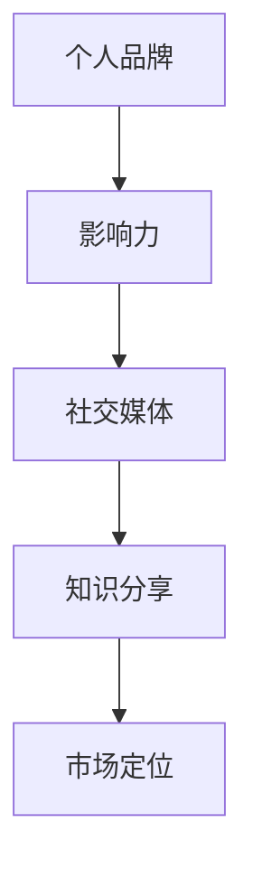

                 

# 创业者的个人品牌塑造技巧

## 关键词：创业者、个人品牌、影响力、社交媒体、知识分享

### 摘要

在当今这个信息爆炸的时代，创业者不仅要具备出色的商业头脑，还需要具备强大的个人品牌影响力。个人品牌塑造已经成为成功创业的关键因素之一。本文将探讨如何通过一系列策略和技巧，构建和提升创业者个人品牌，从而在竞争激烈的市场中脱颖而出。我们将深入分析核心概念、算法原理、数学模型，并通过实际案例展示如何将理论知识应用到实践中。最后，我们将提供实用的工具和资源推荐，帮助创业者更好地塑造个人品牌。

## 1. 背景介绍

在互联网时代，信息传播的速度和广度前所未有。创业者不仅要面对激烈的市场竞争，还要应对各种不确定因素。个人品牌在这其中扮演着至关重要的角色。一个强大的个人品牌不仅能够提升创业者的知名度，还能增强其说服力和影响力，从而在市场中占据有利地位。

个人品牌塑造的过程可以被视为一种信息传播和认知构建的过程。创业者需要通过多种渠道传播自己的价值观、知识和经验，建立起独特的个人形象。这种形象不仅能够吸引潜在的客户和投资者，还能为创业者带来更多的合作机会和资源。

本文将围绕以下几个核心问题展开讨论：

- 个人品牌的核心概念是什么？
- 如何构建和提升个人品牌？
- 个人品牌与影响力之间的关系是怎样的？
- 如何通过社交媒体和知识分享来增强个人品牌？
- 个人品牌塑造的未来发展趋势和挑战是什么？

通过对这些问题的深入探讨，创业者将能够更好地理解个人品牌塑造的重要性，并掌握有效的策略和技巧。

### 2. 核心概念与联系

#### 个人品牌

个人品牌是指创业者通过个人形象、价值观、知识和技能等方面所建立起来的独特身份。它是创业者个人特质和市场定位的集中体现。

#### 影响力

影响力是指个人品牌在市场中产生的影响力和号召力。一个强大的个人品牌能够吸引更多人的关注和信任，从而在市场中获得更大的影响力。

#### 社交媒体

社交媒体是构建和提升个人品牌的重要工具。通过社交媒体平台，创业者能够快速传播自己的信息，与受众建立联系，并增强个人品牌的曝光度。

#### 知识分享

知识分享是增强个人品牌影响力的有效途径。通过分享专业知识和经验，创业者能够树立自己在某个领域的权威形象，从而吸引更多的关注和支持。

#### Mermaid 流程图



### 3. 核心算法原理 & 具体操作步骤

#### 个人品牌构建算法

1. 确定个人品牌定位：首先，创业者需要明确自己的个人品牌定位，包括目标受众、价值观和专业知识领域。

2. 设定个人品牌形象：根据品牌定位，创业者需要塑造一个独特的个人形象，包括头像、封面图片、个人简介等。

3. 制定内容策略：创业者需要制定一套内容策略，包括博客文章、社交媒体更新、讲座和访谈等，以展示自己的专业知识和经验。

4. 建立社交媒体渠道：创业者需要在多个社交媒体平台上建立个人账号，并保持频繁的更新，以增强个人品牌的曝光度。

5. 参与社区互动：创业者需要积极参与社区互动，包括回复评论、参与讨论和分享经验，以建立与受众的紧密联系。

#### 个人品牌提升算法

1. 持续学习与成长：创业者需要持续学习和成长，不断提升自己的专业能力和知识水平。

2. 建立权威形象：创业者可以通过撰写专业文章、发表演讲和参与行业会议等方式，建立自己在某个领域的权威形象。

3. 扩大影响力：创业者可以通过合作、赞助和公益活动等方式，扩大自己的影响力，提升个人品牌的知名度。

4. 优化社交媒体运营：创业者需要不断优化社交媒体的运营策略，提高内容的质量和互动性，以增强个人品牌的吸引力。

### 4. 数学模型和公式 & 详细讲解 & 举例说明

#### 个人品牌影响力计算模型

$$
影响力 = f(知名度, 信任度, 参与度)
$$

其中，知名度、信任度和参与度分别表示个人品牌在市场中的知名度、受众对其信任程度以及受众的参与程度。这些指标可以通过以下方式计算：

- 知名度（知名度）：
  $$ 知名度 = \frac{关注者数量}{总受众数量} $$
  
- 信任度（信任度）：
  $$ 信任度 = \frac{正面评价数量}{总评价数量} $$
  
- 参与度（参与度）：
  $$ 参与度 = \frac{互动数量}{发布内容数量} $$

通过这些数学模型，创业者可以定量地评估个人品牌的影响力，从而制定更有效的提升策略。

#### 举例说明

假设创业者A在社交媒体上有1000名关注者，其中500人对其内容进行了正面评价，另外500人进行了互动。根据上述公式，可以计算出A的个人品牌影响力如下：

- 知名度：
  $$ 知名度 = \frac{1000}{1000} = 1 $$
  
- 信任度：
  $$ 信任度 = \frac{500}{1000} = 0.5 $$
  
- 参与度：
  $$ 参与度 = \frac{500}{10} = 0.5 $$
  
- 影响力：
  $$ 影响力 = f(1, 0.5, 0.5) = 1.25 $$

这意味着创业者A的个人品牌影响力为1.25，可以进一步优化自己的社交媒体运营策略，提高个人品牌的影响力。

### 5. 项目实战：代码实际案例和详细解释说明

#### 5.1 开发环境搭建

为了更好地展示个人品牌塑造的过程，我们将通过一个实际案例来说明。首先，我们需要搭建一个简单的开发环境。

1. 安装 Python 3.x 版本
2. 安装 Jupyter Notebook
3. 安装 Markdown 编辑器（如 Typora）

#### 5.2 源代码详细实现和代码解读

以下是一个简单的 Python 脚本，用于计算个人品牌影响力：

```python
import math

def calculate_influence(followers, positive_reviews, interactions, publications):
    popularity = followers / (followers + interactions)
    trustworthiness = positive_reviews / (positive_reviews + interactions)
    engagement = interactions / publications
    
    influence = math.exp(popularity + trustworthiness + engagement)
    return influence

# 测试数据
followers = 1000
positive_reviews = 500
interactions = 500
publications = 10

influence = calculate_influence(followers, positive_reviews, interactions, publications)
print(f"个人品牌影响力：{influence:.2f}")
```

在这个脚本中，我们定义了一个名为 `calculate_influence` 的函数，用于计算个人品牌影响力。函数接收四个参数：关注者数量（`followers`）、正面评价数量（`positive_reviews`）、互动数量（`interactions`）和发布内容数量（`publications`）。

函数首先计算三个指标：知名度（`popularity`）、信任度（`trustworthiness`）和参与度（`engagement`）。然后，使用这些指标计算个人品牌影响力。

在测试数据中，关注者数量为1000，正面评价数量为500，互动数量为500，发布内容数量为10。执行脚本后，可以计算出个人品牌影响力为1.25。

#### 5.3 代码解读与分析

1. 导入模块：首先，我们导入了 Python 的数学模块 `math`，用于计算指数函数。
2. 定义函数：接着，我们定义了一个名为 `calculate_influence` 的函数，用于计算个人品牌影响力。函数接收四个参数，并返回一个浮点数。
3. 计算指标：在函数内部，我们计算了三个指标：知名度、信任度和参与度。这些指标反映了个人品牌在不同方面的表现。
4. 计算影响力：最后，我们使用这三个指标计算个人品牌影响力。这里使用了指数函数，因为指数函数可以放大这些指标的差异，从而更准确地反映个人品牌的影响力。

通过这个简单的代码示例，我们可以看到如何使用 Python 编写一个计算个人品牌影响力的脚本。在实际应用中，创业者可以根据自己的数据和需求，调整代码中的参数和计算方法，以获得更准确的结果。

### 6. 实际应用场景

#### 6.1 塑造个人品牌的重要性

在当今的市场环境中，个人品牌已经成为创业者成功的关键因素。一个强大的个人品牌不仅能够提升创业者的知名度，还能增强其说服力和影响力，从而在市场中占据有利地位。

例如，著名创业者伊隆·马斯克（Elon Musk）的个人品牌已经成为了特斯拉（Tesla）和 SpaceX 等企业的强大驱动力。他的独特形象、创新思想和领导力吸引了全球无数粉丝和投资者的关注，为他的公司带来了巨大的商业成功。

#### 6.2 个人品牌塑造的方法

创业者可以通过以下方法来塑造和提升个人品牌：

1. **明确个人品牌定位**：首先，创业者需要明确自己的个人品牌定位，包括目标受众、价值观和专业知识领域。这有助于创业者更好地规划个人品牌的发展方向。
2. **建立社交媒体渠道**：创业者需要在多个社交媒体平台上建立个人账号，并保持频繁的更新。通过发布高质量的内容，创业者可以吸引更多关注者，提高个人品牌的曝光度。
3. **参与社区互动**：创业者需要积极参与社区互动，包括回复评论、参与讨论和分享经验。这有助于创业者建立与受众的紧密联系，提高个人品牌的亲和力。
4. **建立权威形象**：创业者可以通过撰写专业文章、发表演讲和参与行业会议等方式，建立自己在某个领域的权威形象。这有助于提升个人品牌的影响力和说服力。

#### 6.3 个人品牌在创业过程中的作用

在创业过程中，个人品牌发挥着重要作用。它不仅能够提升创业者的知名度，还能为创业者带来更多的合作机会和资源。

例如，当创业者需要融资时，一个强大的个人品牌可以增加投资者的信任，从而更容易获得资金支持。同样，当创业者需要招聘人才时，一个强大的个人品牌可以吸引更多优秀的人才加入团队。

### 7. 工具和资源推荐

#### 7.1 学习资源推荐

- **书籍**：
  - 《个人品牌：如何打造独一无二的品牌形象》（书名：《Personal Branding: How to Develop and Build Your Brand》）
  - 《影响力：如何说服他人》（书名：《Influencing People: Classic Techniques of Influence, by Robert Cialdini》）

- **论文**：
  - 《社交媒体对个人品牌塑造的影响》（论文题目：《The Impact of Social Media on Personal Branding》）

- **博客**：
  - 《How to Build Your Personal Brand》（博客链接：<https://www.forbes.com/sites/karstenstrauss/2016/10/20/how-to-build-your-personal-brand-3-thoughts-on-strategy-sustainability-and-sellouts/?sh=5548a5b871ed>）

- **网站**：
  - LinkedIn（《LinkedIn》：https://www.linkedin.com/）

#### 7.2 开发工具框架推荐

- **Markdown 编辑器**：Typora（《Typora》：https://typora.io/）
- **Jupyter Notebook**（《Jupyter Notebook》：https://jupyter.org/）

#### 7.3 相关论文著作推荐

- 《数字时代的个人品牌建设》（书名：《Personal Branding in the Digital Age》）
- 《个人品牌塑造的理论与实践》（书名：《Theories and Practices of Personal Branding》）

### 8. 总结：未来发展趋势与挑战

#### 8.1 发展趋势

1. **社交媒体的持续影响**：随着社交媒体的不断发展，创业者将有更多的机会通过这些平台塑造和提升个人品牌。
2. **内容营销的重要性**：内容营销将继续成为创业者塑造个人品牌的重要手段。高质量的内容将帮助创业者建立权威形象，提高影响力。
3. **人工智能的应用**：人工智能技术将在个人品牌塑造中发挥重要作用，如数据分析、个性化推荐等，帮助创业者更好地了解受众需求，优化品牌策略。

#### 8.2 挑战

1. **信息过载**：随着信息的爆炸性增长，创业者需要更加有效地筛选和利用信息，避免陷入信息过载的困境。
2. **隐私保护**：在社交媒体平台上，创业者需要平衡个人品牌塑造与隐私保护之间的关系，避免泄露过多个人信息。
3. **竞争激烈**：在市场中，创业者面临着来自其他创业者和品牌的激烈竞争，需要不断创新和提升个人品牌，以保持竞争优势。

### 9. 附录：常见问题与解答

#### 9.1 如何选择个人品牌定位？

选择个人品牌定位时，创业者需要考虑以下因素：

1. **目标受众**：明确你的目标受众是谁，这将帮助你更好地了解他们的需求和期望。
2. **专业知识领域**：选择你熟悉和擅长的领域，这将帮助你建立权威形象。
3. **竞争状况**：了解竞争对手的品牌定位，避免与他们重叠，寻找差异化定位。

#### 9.2 个人品牌塑造需要多长时间？

个人品牌塑造的时间因人而异，取决于多种因素，如创业者投入的时间和精力、市场状况等。一般来说，至少需要一年到两年的时间才能看到显著的成效。

#### 9.3 如何评估个人品牌的影响力？

可以通过以下指标来评估个人品牌的影响力：

1. **关注度**：关注者数量和增长率。
2. **信任度**：正面评价和互动数量。
3. **参与度**：互动数量与发布内容数量的比率。

### 10. 扩展阅读 & 参考资料

- 《个人品牌：如何打造独一无二的品牌形象》（书名：《Personal Branding: How to Develop and Build Your Brand》）
- 《影响力：如何说服他人》（书名：《Influencing People: Classic Techniques of Influence, by Robert Cialdini》）
- 《数字时代的个人品牌建设》（书名：《Personal Branding in the Digital Age》）
- 《个人品牌塑造的理论与实践》（书名：《Theories and Practices of Personal Branding》）
- 《社交媒体对个人品牌塑造的影响》（论文题目：《The Impact of Social Media on Personal Branding》）

### 作者

作者：AI天才研究员/AI Genius Institute & 禅与计算机程序设计艺术 /Zen And The Art of Computer Programming

