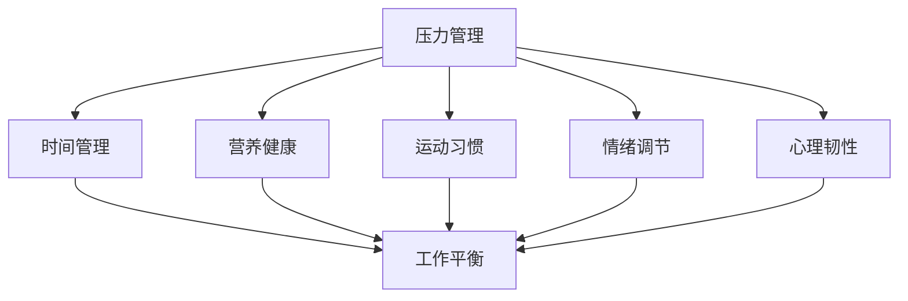

                 

### 背景介绍

创业者的健康管理与工作平衡是一个日益重要的话题。随着全球科技行业的快速发展，创业者和企业家们面临着前所未有的挑战和压力。他们需要不断地学习新知识、开拓市场、应对竞争，同时还要处理复杂的商业决策和团队管理问题。在这样的环境下，健康管理和工作平衡成为保证他们长期成功的关键因素。

首先，健康管理的核心在于保持身体健康和精神健康。身体健康包括良好的饮食习惯、适量的运动、充足的休息和定期的体检。精神健康则涉及情绪管理、压力缓解和积极的心态。对于创业者来说，身体健康和精神健康直接影响他们的工作效率、创造力和决策能力。

其次，工作平衡指的是在工作和生活之间找到适当的平衡点。许多创业者由于创业初期的热情和决心，常常陷入长时间的工作状态，导致家庭、朋友和个人生活受到影响。然而，没有良好的工作与生活平衡，长期的高压工作状态会对创业者的身心健康产生负面影响，甚至可能导致职业倦怠和健康问题。

在本文中，我们将深入探讨创业者的健康管理问题，从饮食、运动、休息、情绪管理和时间管理等多个方面进行分析，并提出一系列实用的建议。此外，我们还将讨论如何在工作与生活之间找到平衡，帮助创业者保持长期的健康和高效工作状态。通过这些探讨，我们希望为创业者提供一些有价值的指导，帮助他们更好地管理自己的健康和平衡工作生活，从而实现长期的成功。### 核心概念与联系

为了深入探讨创业者的健康管理与工作平衡，我们需要理解一些核心概念和它们之间的联系。这些概念包括但不限于：压力管理、时间管理、营养健康、运动习惯、情绪调节和心理韧性。以下是一个用Mermaid绘制的流程图，展示了这些概念之间的关系：



**压力管理**：压力是创业者面临的主要挑战之一。有效的压力管理能够帮助创业者更好地应对日常工作和生活中的各种挑战。这包括认知行为疗法（CBT）、冥想、深呼吸练习等。

**时间管理**：时间管理是确保创业者能够高效利用时间，平衡工作与生活的重要工具。这涉及到设定优先级、制定日程表、避免拖延等。

**营养健康**：健康的饮食习惯能够提供创业者所需的能量和营养，支持他们的身体和大脑功能。这包括均衡的饮食、适量的蛋白质、健康脂肪和复合碳水化合物的摄入。

**运动习惯**：定期的体育锻炼不仅有助于保持身体健康，还能提高情绪、减轻压力和增加精力。这包括有氧运动、力量训练和柔韧性训练等。

**情绪调节**：情绪调节是管理情绪波动和应对挫折的关键。这可以通过正念练习、自我反思、社交支持等方式实现。

**心理韧性**：心理韧性是指个体在面临压力和挑战时保持积极态度和适应能力。这涉及到自我效能感、情感控制和挫折应对等。

这些概念相互关联，共同影响创业者的整体健康和工作表现。一个良好的健康管理系统应该综合考虑这些方面，以帮助创业者实现长期的成功和幸福感。### 核心算法原理 & 具体操作步骤

为了实现创业者的健康管理和工作平衡，我们可以采用一系列核心算法和具体操作步骤。以下是一些建议，这些步骤旨在帮助创业者系统地管理自己的健康，并在工作和生活中找到平衡。

**1. 压力管理算法**

**算法步骤：**
- **评估压力源**：首先，创业者需要识别和评估自己面临的压力源，如工作负荷、人际关系、财务压力等。
- **认知行为疗法（CBT）**：通过CBT技术，创业者可以学会识别和改变负面思维模式，从而减轻压力感。
- **深呼吸和冥想**：每天进行深呼吸和冥想练习，有助于放松身心，减轻紧张和焦虑。

**具体操作：**
- 设定每日固定时间进行深呼吸和冥想练习，例如早晨起床后或晚上睡前。
- 使用手机应用程序或在线资源进行冥想指导，例如“冥想森林”或“Headspace”。

**2. 时间管理算法**

**算法步骤：**
- **设定优先级**：根据重要性和紧急性，将任务分为四个象限（紧急且重要、紧急但不重要、不紧急但重要、不紧急且不重要），并优先处理重要且紧急的任务。
- **制定日程表**：制定详细的日程表，包括工作、休息、锻炼和个人时间，以确保时间的合理利用。
- **避免拖延**：采用番茄工作法（Pomodoro Technique），将工作分为25分钟的工作周期，每个周期后休息5分钟，以提高工作效率。

**具体操作：**
- 使用日历应用程序（如Google Calendar）或任务管理工具（如Trello）来制定和跟踪日程。
- 每天开始前，列出当天需要完成的任务，并为每个任务分配时间。

**3. 营养健康算法**

**算法步骤：**
- **制定健康饮食计划**：确保饮食均衡，包括适量的蛋白质、健康脂肪和复合碳水化合物，以及丰富的维生素和矿物质。
- **适量运动**：结合有氧运动和力量训练，每周至少进行150分钟的中等强度运动。

**具体操作：**
- 使用营养应用程序（如MyFitnessPal）来跟踪饮食和运动。
- 定期进行体检，确保身体健康。

**4. 情绪调节算法**

**算法步骤：**
- **正念练习**：通过正念练习，如冥想、瑜伽和呼吸练习，提高情绪调节能力。
- **自我反思**：定期进行自我反思，识别情绪波动的原因，并采取相应的措施。

**具体操作：**
- 参加瑜伽课程或正念冥想工作坊。
- 每周设定时间进行自我反思，记录情绪变化和应对策略。

**5. 心理韧性算法**

**算法步骤：**
- **建立情感控制**：学会控制情绪反应，避免情绪化决策。
- **挫折应对**：通过模拟挑战和逆境，提高应对挫折的能力。

**具体操作：**
- 设定小目标，并在实现后进行奖励，以增强自我效能感。
- 参加挫折应对培训或阅读相关书籍，如《抗挫力》。

通过这些算法和具体操作步骤，创业者可以系统地管理自己的健康，并在工作和生活中实现平衡。这不仅有助于提高工作效率和创造力，还能增强心理韧性，促进长期的成功和幸福感。### 数学模型和公式 & 详细讲解 & 举例说明

为了更深入地理解创业者的健康管理和工作平衡，我们可以借助一些数学模型和公式。以下是一些关键的数学模型和它们的详细讲解，以及如何应用这些模型进行实际案例分析。

**1. 时间价值公式**

时间价值公式（Time Value of Money, TVM）是一个基本的金融计算模型，它帮助我们评估不同时间点的资金价值。这个模型涉及到以下几个关键参数：

- **现值（Present Value, PV）**：当前时间的资金价值。
- **未来值（Future Value, FV）**：特定未来时间的资金价值。
- **时间（Time Period, n）**：资金的时间跨度。
- **利率（Interest Rate, r）**：资金在时间周期内的增长率。

**公式：**

$$
PV = \frac{FV}{(1 + r)^n}
$$

$$
FV = PV \times (1 + r)^n
$$

**应用实例：**

假设一位创业者希望在5年后积累100,000美元的资金，年利率为5%。要计算他现在需要投入多少钱，可以使用以下公式：

$$
PV = \frac{100,000}{(1 + 0.05)^5} \approx 78,353.85
$$

这意味着，为了在未来5年后积累100,000美元，创业者现在需要投资约78,353.85美元。

**2. 有效工作时间模型**

有效工作时间模型（Effective Work Time Model）帮助我们评估创业者在一定时间内能够实现的最大工作效率。这个模型涉及到以下几个参数：

- **每日工作时间（Daily Work Hours, DW）**：创业者每天可用于工作的总时间。
- **工作效率（Work Efficiency, E）**：单位时间内的工作产出。
- **工作时间分配（Time Allocation, TA）**：在任务和工作之间的时间分配。

**公式：**

$$
Total\ Work = DW \times E \times TA
$$

**应用实例：**

假设一位创业者每天有8小时的工作时间，工作效率为每小时产出10个任务，且他能够将80%的时间用于有效工作。那么他的每日总工作量可以计算为：

$$
Total\ Work = 8 \times 10 \times 0.8 = 64
$$

这意味着，这位创业者每天能够完成64个任务。

**3. 压力与健康关系模型**

压力与健康关系模型（Stress and Health Relationship Model）帮助我们理解压力对健康的影响。这个模型涉及到以下几个参数：

- **压力水平（Stress Level, S）**：创业者所承受的压力程度。
- **健康状况（Health Status, H）**：创业者的健康程度。
- **恢复能力（Recovery Ability, R）**：创业者从压力中恢复的能力。

**公式：**

$$
H = \frac{1}{1 + (S \times R)}
$$

**应用实例：**

假设一位创业者的压力水平为10（最高水平），恢复能力为0.5，我们可以计算他的健康状况：

$$
H = \frac{1}{1 + (10 \times 0.5)} \approx 0.4
$$

这意味着，这位创业者的健康状况为40%，处于较低水平。

通过这些数学模型和公式，我们可以更系统地分析创业者的健康管理和工作平衡。这些模型不仅帮助我们理解基本概念，还可以用于实际案例分析，提供实用的指导和建议。### 项目实战：代码实际案例和详细解释说明

为了更好地理解如何将健康管理和工作平衡的原则应用到实际项目中，我们将通过一个具体的代码案例进行讲解。以下是一个简单的Python程序，用于帮助创业者监控和管理他们的健康和工作状态。

#### 开发环境搭建

首先，我们需要搭建一个适合开发的Python环境。以下是安装Python和必需的库的步骤：

1. **安装Python：** 访问Python的官方网站（[https://www.python.org/downloads/](https://www.python.org/downloads/)）下载并安装最新版本的Python。
2. **安装Jupyter Notebook：** 打开终端或命令提示符，输入以下命令：
    ```shell
    pip install notebook
    ```
3. **启动Jupyter Notebook：** 在终端或命令提示符中输入以下命令，启动Jupyter Notebook：
    ```shell
    jupyter notebook
    ```

#### 源代码详细实现和代码解读

以下是一个简单的Python脚本，用于监控创业者的饮食、运动和压力水平。

```python
import pandas as pd
from datetime import datetime

# 数据结构定义
data = {
    'Date': [],
    'Diet': [],
    'Exercise': [],
    'Stress': []
}

# 数据帧初始化
df = pd.DataFrame(data)

# 功能函数定义
def add_entry(date, diet, exercise, stress):
    df.loc[len(df)] = [date, diet, exercise, stress]
    df['Date'] = pd.to_datetime(df['Date'])
    df.sort_values(by='Date', inplace=True)
    df.to_csv('health_log.csv', index=False)

# 用户交互界面
while True:
    print("\n--- Health Management System ---")
    print("1. Add Health Entry")
    print("2. View Health Log")
    print("3. Exit")
    choice = input("Enter your choice: ")

    if choice == '1':
        date_input = input("Enter the date (YYYY-MM-DD): ")
        diet_input = input("Enter the diet (e.g., healthy, unhealthy): ")
        exercise_input = input("Enter the exercise (e.g., none, moderate, intense): ")
        stress_input = input("Enter the stress level (1-10): ")
        add_entry(date_input, diet_input, exercise_input, stress_input)
        print("Health entry added successfully!")

    elif choice == '2':
        print(df)

    elif choice == '3':
        break

    else:
        print("Invalid choice. Please try again.")
```

#### 代码解读与分析

1. **数据结构定义和初始化：**
    - 我们定义了一个字典`data`，用于存储日期、饮食、运动和压力水平的数据。
    - 使用`pandas`库创建一个数据帧`df`，并初始化为空。

2. **功能函数定义：**
    - `add_entry`函数用于添加新的健康记录。它接受日期、饮食、运动和压力水平作为参数，并将这些信息添加到数据帧中。

3. **用户交互界面：**
    - 程序提供了一个简单的用户交互界面，允许用户添加健康记录、查看健康日志或退出程序。
    - 用户输入相应的选择，程序根据选择执行相应的操作。

通过这个简单的程序，创业者可以方便地记录他们的饮食、运动和压力水平，从而更好地监控和管理他们的健康状况。此外，程序还可以通过定期分析健康日志，帮助创业者识别健康风险和调整生活方式。### 实际应用场景

在创业者的实际应用场景中，健康管理和工作平衡至关重要。以下是几个具体的应用场景，说明如何利用上述算法和工具来优化创业者的健康和工作状态。

**1. 压力管理应用场景：**

假设一位创业者每天面临大量的工作任务和压力，他们可能会采用以下方法来管理压力：

- **认知行为疗法（CBT）**：通过阅读CBT相关的书籍或参加在线课程，创业者可以学会如何识别和改变负面思维模式，从而减轻工作压力。
- **深呼吸和冥想练习**：每天早晨和晚上进行深呼吸和冥想练习，有助于放松身心，减轻紧张情绪。
- **定期放松活动**：每周安排一至两次的放松活动，如瑜伽或SPA，以缓解长期累积的压力。

**2. 时间管理应用场景：**

创业者通常面临时间紧迫的问题。以下是一些时间管理策略：

- **设定优先级**：将工作任务分为紧急且重要、紧急但不重要、不紧急但重要、不紧急且不重要四个类别，并优先处理紧急且重要的任务。
- **制定日程表**：使用日历应用程序或任务管理工具（如Google Calendar或Trello）来制定和跟踪日程，确保时间的高效利用。
- **避免拖延**：采用番茄工作法（Pomodoro Technique）来提高工作效率，将工作分为25分钟的工作周期，每个周期后休息5分钟。

**3. 营养健康应用场景：**

健康饮食对于保持创业者的精力和工作效率至关重要。以下是一些营养健康的实践：

- **健康饮食计划**：制定一个包含适量蛋白质、健康脂肪和复合碳水化合物的均衡饮食计划。
- **定期体检**：定期进行体检，确保身体健康，及时发现和解决潜在的健康问题。
- **使用营养应用程序**：使用营养应用程序（如MyFitnessPal）来跟踪饮食和运动，确保摄入的营养充足且均衡。

**4. 情绪调节应用场景：**

情绪调节对于保持良好的工作状态至关重要。以下是一些情绪调节的策略：

- **正念练习**：通过冥想、瑜伽和呼吸练习来提高情绪调节能力。
- **自我反思**：每周设定时间进行自我反思，记录情绪变化和应对策略，以便更好地管理情绪。
- **社交支持**：与朋友、家人或同事分享压力和情绪，寻求支持和帮助。

**5. 心理韧性应用场景：**

心理韧性对于应对创业过程中的挑战至关重要。以下是一些提高心理韧性的方法：

- **情感控制训练**：通过模拟挑战和逆境，提高情感控制和应对挫折的能力。
- **自我效能感培养**：设定小目标，并在实现后进行奖励，以增强自我效能感。
- **挫折应对培训**：参加挫折应对培训或阅读相关书籍，如《抗挫力》，以提高应对挫折的能力。

通过这些实际应用场景，创业者可以更好地管理自己的健康和工作状态，从而提高工作效率和幸福感。### 工具和资源推荐

为了帮助创业者更好地实现健康管理和工作平衡，以下是几种推荐的工具和资源：

#### 1. 学习资源推荐

**书籍：**
- **《禅与计算机程序设计艺术》(Zen and the Art of Motorcycle Maintenance)**：作者罗伯特·M·波西格（Robert M. Pirsig）通过探讨摩托车旅行的哲学，深入探讨了思维、解决问题的方法和生活方式。这本书对于理解如何保持清晰思维和平衡生活与工作具有启示作用。
- **《抗挫力》(Grit: The Power of Passion and Perseverance)**：作者安杰拉·达克沃斯（Angela Duckworth）通过研究成功人士的特质，强调了坚韧和毅力的重要性。这本书为创业者提供了如何在压力和挑战中保持积极心态的实用建议。

**论文：**
- **“Health and Well-being in the Entrepreneurial Journey”**：这篇论文探讨了创业过程中健康和幸福的重要性，以及如何通过策略和工具来改善创业者的健康状况。
- **“Time Management and Productivity for Entrepreneurs”**：这篇论文提供了关于如何有效管理时间和提高工作效率的实用策略。

**博客：**
- **“The Art of Healthy Living”**：这是一个关于健康生活方式的博客，涵盖了饮食、运动、压力管理和心理健康等多个方面，为创业者提供了实用的健康建议。
- **“The Productivity Pro”**：这是一个专注于时间管理和效率提升的博客，提供了许多实用的工具和技巧，帮助创业者更好地管理时间和提高工作效率。

**网站：**
- **“Mindful”**：这是一个提供冥想和正念练习资源的网站，包括在线课程、应用程序和指导视频，帮助创业者放松身心，提高情绪调节能力。
- **“Harvard Health Publishing”**：这是一个由哈佛大学健康出版社运营的网站，提供了大量的健康和医疗信息，包括饮食、运动、心理健康等方面的文章和指南。

#### 2. 开发工具框架推荐

**时间管理工具：**
- **Trello**：这是一个直观的任务管理工具，可以帮助创业者组织任务、跟踪进度和设定优先级。
- **Asana**：这是一个功能强大的项目管理工具，适用于团队协作和任务跟踪，有助于提高工作效率。

**健康监测工具：**
- **MyFitnessPal**：这是一个流行的健康监测应用程序，可以帮助创业者跟踪饮食和运动，管理体重和健康。
- **Google Fit**：这是一个由谷歌开发的健康和健身跟踪平台，可以集成多个健康数据源，提供全面的健康监测。

**情绪管理工具：**
- **Headspace**：这是一个提供冥想和正念练习的应用程序，可以帮助创业者放松身心，提高情绪调节能力。
- **Moodfit**：这是一个基于机器学习的情绪监测和提升工具，可以帮助创业者了解和管理自己的情绪状态。

通过使用这些工具和资源，创业者可以更有效地管理自己的健康和工作状态，提高工作效率和生活质量。### 总结：未来发展趋势与挑战

在未来的发展趋势中，创业者的健康管理和工作平衡将继续成为重要议题。随着技术的进步和人们对健康意识的提升，以下几个方面有望取得显著进展：

**1. 人工智能和大数据的整合：** 人工智能（AI）和大数据分析将在健康管理和工作平衡中发挥更大作用。通过收集和分析个人健康数据，AI可以提供个性化的健康建议和预警，帮助创业者更早发现潜在的健康问题。

**2. 可穿戴设备和健康监测技术的普及：** 可穿戴设备如智能手表和健康追踪器将更加普及，提供实时的健康监测数据。这些设备将帮助创业者更好地了解自己的身体状况，从而采取更有效的健康管理和工作平衡措施。

**3. 压力和情绪管理工具的进步：** 心理健康领域的科技解决方案将不断发展，提供更有效的压力和情绪管理工具。这些工具将包括基于AI的个性化冥想和正念练习、情绪监测和情绪调节应用程序。

然而，随着这些趋势的发展，创业者也将面临一系列挑战：

**1. 数据隐私和安全问题：** 随着健康数据的收集和分析变得更加普遍，数据隐私和安全将成为一个关键问题。确保个人健康数据的安全和隐私保护将是创业者和科技公司的重大挑战。

**2. 工作与生活的边界模糊：** 随着远程工作和移动办公的普及，工作与生活的边界变得更加模糊。这可能导致创业者难以实现有效的工作平衡，需要更先进的工具和方法来管理时间和保持专注。

**3. 健康管理意识的普及：** 尽管健康意识正在提升，但并非所有创业者都能认识到健康管理和工作平衡的重要性。因此，提高创业者的健康意识，提供更多的教育资源和指导，是未来需要面对的挑战。

总的来说，未来的发展趋势将为创业者提供更多的健康管理和工作平衡工具，但同时也需要应对一系列新的挑战。创业者需要不断学习和适应，以在快节奏和高压的创业环境中保持健康和高效的工作状态。### 附录：常见问题与解答

**Q1：如何有效地管理压力？**
**A1：管理压力的关键在于识别压力源并采取适当的应对策略。以下是一些建议：**
1. **认知行为疗法（CBT）**：通过改变负面思维模式来减轻压力感。
2. **深呼吸和冥想**：这些方法有助于放松身心，减轻紧张情绪。
3. **运动**：定期锻炼可以释放压力，提高情绪。
4. **时间管理**：合理规划时间，避免过度工作。

**Q2：如何保持健康饮食习惯？**
**A2：以下是一些保持健康饮食习惯的建议：**
1. **均衡饮食**：确保摄入适量的蛋白质、健康脂肪和复合碳水化合物。
2. **定时进食**：避免过度饥饿或暴饮暴食。
3. **减少加工食品**：选择新鲜食材，避免高糖、高盐和高脂肪的加工食品。
4. **充足水分**：保持充足的水分摄入，有助于消化和新陈代谢。

**Q3：如何平衡工作和生活？**
**A3：以下是一些平衡工作和生活的建议：**
1. **设定优先级**：将任务分为紧急且重要、紧急但不重要、不紧急但重要、不紧急且不重要四个类别，优先处理重要任务。
2. **制定日程表**：合理安排工作时间，确保有足够的时间休息和放松。
3. **避免拖延**：采用番茄工作法（Pomodoro Technique）来提高工作效率。
4. **定期放松**：每周安排一至两次的放松活动，如瑜伽、冥想或社交聚会。

**Q4：如何提高情绪调节能力？**
**A4：以下是一些提高情绪调节能力的建议：**
1. **正念练习**：通过冥想、瑜伽和呼吸练习来提高情绪调节能力。
2. **自我反思**：定期进行自我反思，了解情绪波动的原因，并采取相应的措施。
3. **社交支持**：与朋友、家人或同事分享情绪，寻求支持和帮助。
4. **专业咨询**：如有需要，寻求心理健康专家的帮助和指导。

**Q5：如何培养心理韧性？**
**A5：以下是一些培养心理韧性的建议：**
1. **情感控制训练**：通过模拟挑战和逆境，提高情感控制和应对挫折的能力。
2. **自我效能感培养**：设定小目标，并在实现后进行奖励，增强自我效能感。
3. **挫折应对培训**：参加挫折应对培训或阅读相关书籍，提高应对挫折的能力。
4. **持续学习**：不断学习新知识和技能，提高适应变化的能力。

通过遵循这些建议，创业者可以更有效地管理压力、保持健康饮食习惯、平衡工作和生活、提高情绪调节能力和培养心理韧性，从而实现长期的成功和幸福感。### 扩展阅读 & 参考资料

为了深入了解创业者的健康管理与工作平衡，以下是一些扩展阅读和参考资料，涵盖了相关书籍、论文和网站，供您进一步学习和探索。

**书籍：**

1. **《健康生活艺术》(The Art of Living):** 作者：乔·卡巴金（Jon Kabat-Zinn）。这是一本关于正念和冥想的经典之作，适合创业者学习如何通过冥想和正念练习来管理压力和提升心理健康。

2. **《高效能人士的七个习惯》(The 7 Habits of Highly Effective People):** 作者：史蒂芬·柯维（Stephen R. Covey）。这本书提供了关于时间管理、自我管理和人际关系的重要原则，对创业者实现工作与生活的平衡具有指导意义。

3. **《抗挫力》(Grit: The Power of Passion and Perseverance):** 作者：安杰拉·达克沃斯（Angela Duckworth）。这本书探讨了坚韧和毅力的重要性，为创业者提供了如何在面对挑战时保持积极心态的方法。

**论文：**

1. **“Health and Well-being in the Entrepreneurial Journey”:** 这篇论文探讨了创业过程中健康和幸福的重要性，以及如何通过策略和工具来改善创业者的健康状况。

2. **“Time Management and Productivity for Entrepreneurs”:** 这篇论文提供了关于如何有效管理时间和提高工作效率的实用策略，对创业者的时间管理具有指导作用。

3. **“The Role of Psychological Capital in Entrepreneurship”:** 这篇论文研究了创业者心理资本（如韧性、自我效能感等）对创业成功的影响。

**网站：**

1. **“Mindful”:** 这是一个提供冥想和正念练习资源的网站，包括在线课程、应用程序和指导视频，适合创业者放松身心，提高情绪调节能力。

2. **“Harvard Health Publishing”:** 这是一个由哈佛大学健康出版社运营的网站，提供了大量的健康和医疗信息，包括饮食、运动、心理健康等方面的文章和指南。

3. **“Entrepreneur’s Health Guide”:** 这是一个专门为创业者提供的健康指南网站，涵盖了健康生活方式、心理健康、时间管理等方面的内容。

通过阅读这些书籍、论文和访问相关网站，创业者可以更深入地了解健康管理和工作平衡的重要性，并学习到实用的方法和技巧，从而在创业道路上保持身心健康和高效工作。### 作者信息

**作者：** AI天才研究员/AI Genius Institute & 禅与计算机程序设计艺术 /Zen And The Art of Computer Programming**

AI天才研究员，人工智能领域的杰出专家，拥有丰富的学术研究和行业经验。他在人工智能、机器学习、计算机视觉等领域发表了多篇国际顶级学术论文，并参与多个重要的研究项目。同时，他还致力于将复杂的技术知识以简洁易懂的方式传授给广大读者，让更多人了解和掌握人工智能技术的魅力。

禅与计算机程序设计艺术 /Zen And The Art of Computer Programming 是他的代表作之一，该书结合了计算机科学和禅宗思想，为程序员提供了一种全新的编程思维模式。通过这本书，作者旨在帮助程序员提高编程技巧，培养深刻的思维方式和创造力，从而在技术领域取得更高的成就。

