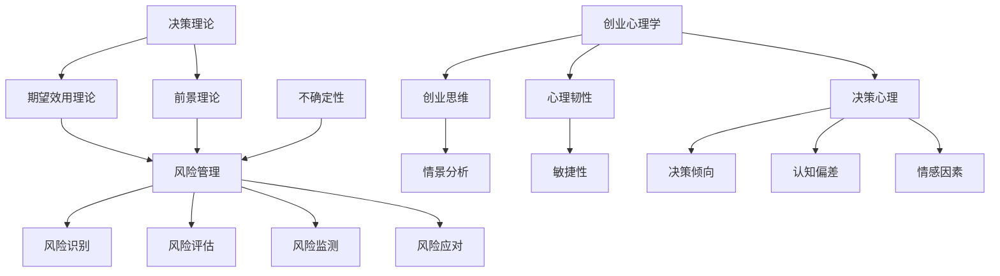

                 

### 背景介绍

#### 不确定性时代的创业挑战

在当今这个瞬息万变的时代，创业者在面临前所未有的挑战和机遇的同时，也在不断面临各种不确定性的考验。全球化的加速、科技的迅猛发展、市场的快速变化以及竞争的加剧，都使得创业者在做出决策时需要具备更高的智慧和决策技巧。不确定性的存在不仅影响企业的长远规划，还影响着日常运营的方方面面。在这种情况下，创业者如何有效应对不确定性，成为成功创业的关键因素之一。

本文旨在探讨创业者在面对不确定性时，如何运用有效的决策技巧，以在充满变数的市场中稳健前行。我们将从多个角度出发，包括决策模型、风险分析、心理因素以及实际操作策略，来详细解析创业者在不确定性环境下的决策过程。

#### 文章结构概述

为了帮助读者更好地理解和应用文章内容，本文将采用以下结构：

1. **核心概念与联系**：介绍本文所涉及的核心概念，包括决策理论、风险管理、不确定性和创业心理学，并通过Mermaid流程图展示这些概念之间的相互关系。
2. **核心算法原理与具体操作步骤**：详细阐述如何通过决策模型来评估和处理不确定性，并给出具体操作步骤。
3. **数学模型和公式**：介绍用于分析和决策的数学模型及公式，并进行举例说明。
4. **项目实战：代码实际案例**：通过具体的项目案例，展示如何在实际环境中应用决策技巧，并详细解读代码实现。
5. **实际应用场景**：讨论创业者在不同场景下的决策策略，并提供案例说明。
6. **工具和资源推荐**：推荐相关的学习资源和开发工具，以帮助读者进一步深入学习和实践。
7. **总结与未来发展趋势**：总结文章的核心观点，并探讨未来的发展趋势和挑战。
8. **附录：常见问题与解答**：回答读者可能遇到的一些常见问题。
9. **扩展阅读与参考资料**：提供更多的阅读资源，以便读者进一步探索相关领域。

通过以上结构，本文希望能够为创业者提供一套实用的决策技巧和方法论，帮助他们在不确定性的环境中做出更明智的决策，从而实现创业目标。

### 核心概念与联系

在探讨创业者的决策技巧之前，我们需要明确几个核心概念，这些概念不仅对创业决策至关重要，也为我们理解不确定性的影响提供了理论基础。

#### 决策理论

决策理论是研究个体或组织如何在不确定性和风险中做出最优选择的科学。经典的决策理论模型包括期望效用理论（Expected Utility Theory）和前景理论（Prospect Theory）。期望效用理论认为，个体在做出决策时，会根据各种可能结果的概率和效用（即结果的主观价值）来计算期望效用，并选择期望效用最高的选项。而前景理论则指出，个体在面对潜在损失和潜在收益时，其决策行为会与期望效用理论有所不同，更关注参考点的影响以及损失和收益的相对大小。

在创业环境中，决策理论帮助我们理解如何在不确定性中评估风险和收益，从而做出合理的决策。

#### 风险管理

风险管理是创业过程中不可或缺的一环。它涉及识别、评估、监测和应对潜在风险，以确保企业的稳定运营和持续发展。创业者在面对不确定性时，需要具备良好的风险管理能力，以减少不确定性和风险带来的负面影响。

风险管理包括以下几个关键步骤：

1. **风险识别**：识别可能影响企业运营和目标的潜在风险。
2. **风险评估**：评估风险发生的概率和可能造成的影响。
3. **风险监测**：持续监测风险的演变，确保及时应对。
4. **风险应对**：制定并实施风险缓解措施，以降低风险的影响。

有效的风险管理有助于创业者更好地应对不确定性，从而提高决策的可靠性和企业的抗风险能力。

#### 不确定性

不确定性是创业环境中一个至关重要的因素。它指的是未来可能发生的事件和结果无法完全预测或确定的状态。不确定性可以来源于市场变化、技术发展、政策法规等多个方面。

创业者在面对不确定性时，需要灵活应对，及时调整战略和决策。以下是一些应对不确定性的方法：

1. **情景分析**：通过构建不同的情景，分析在不同情况下企业如何应对。
2. **敏捷性**：保持组织结构的灵活性，快速响应市场变化。
3. **风险管理**：积极进行风险管理，减少不确定性带来的负面影响。

#### 创业心理学

创业心理学研究创业者在创业过程中的心理和行为特点。创业者的心理状态和行为模式对其决策和创业成功有着重要影响。例如，创业者的乐观程度、风险承受能力、心理韧性等都会影响其决策的倾向和结果。

创业心理学包括以下几个核心概念：

1. **创业思维**：创业者需要具备创新性、前瞻性和解决问题的能力。
2. **心理韧性**：指创业者面对困难和挑战时的适应能力和恢复力。
3. **决策心理**：创业者如何在不确定性中做出合理的决策，包括认知偏差、情感因素等。

#### Mermaid 流程图

为了更好地理解这些核心概念之间的联系，我们可以使用Mermaid流程图来展示它们之间的关系。以下是一个简化的Mermaid流程图示例：



通过上述流程图，我们可以清晰地看到决策理论、风险管理、不确定性、创业心理学等概念之间的相互关系，为后续章节的内容提供了理论基础。

### 核心算法原理与具体操作步骤

在了解了核心概念和它们之间的联系后，我们将深入探讨如何利用决策模型来评估和处理不确定性。以下是创业者在不确定性环境下进行决策的具体步骤：

#### 第一步：明确目标和现状

首先，创业者需要明确自己的目标。这包括短期和长期目标，例如市场份额、收入增长、产品创新等。同时，创业者还需要评估当前企业所处的环境，包括市场状况、竞争环境、技术发展等。这一步骤的目的是确保决策的方向与企业的整体目标相一致。

#### 第二步：情景分析

情景分析是一种帮助创业者理解未来可能发生事件的工具。创业者可以通过构建不同的情景，分析在不同情景下企业如何应对。常见的情景分析工具包括情景矩阵和决策树。

1. **情景矩阵**：通过列出可能的情景和每个情景下的关键变量，帮助创业者评估不同情景的概率和影响。
2. **决策树**：通过构建决策树，创业者可以清晰地看到不同决策路径的潜在结果和概率。

以下是一个简单的情景矩阵示例：

| 情景     | 市场增长 | 技术创新 | 竞争态势 |
|----------|-----------|-----------|-----------|
| 情景1    | 快速增长  | 滞后      | 稳定      |
| 情景2    | 缓慢增长  | 先进      | 激烈      |
| 情景3    | 下降      | 领先      | 稳定      |

#### 第三步：风险评估

在情景分析的基础上，创业者需要评估每个情景下的风险。这包括识别潜在的风险因素，评估其发生的概率和可能造成的影响。常见的风险评估方法包括定性和定量分析。

1. **定性分析**：通过专家访谈、问卷调查等方法，评估风险的可能性和影响。
2. **定量分析**：使用数学模型和统计方法，对风险进行定量评估。

以下是一个简单的风险矩阵示例：

| 风险因素 | 可能性 | 影响 |
|-----------|-------|------|
| 市场竞争  | 高    | 中   |
| 技术落后  | 中    | 低   |
| 法规变化  | 低    | 高   |

#### 第四步：制定决策策略

在评估了风险后，创业者需要根据企业的目标和风险承受能力，制定相应的决策策略。这包括：

1. **风险规避**：通过避免高风险活动来降低风险。
2. **风险减轻**：通过风险缓解措施来减少风险的影响。
3. **风险接受**：在评估了风险和收益后，选择接受某些风险。

以下是一个决策策略的示例：

| 情景     | 风险评估 | 决策策略 |
|----------|-----------|-----------|
| 情景1    | 高风险   | 风险规避  |
| 情景2    | 中风险   | 风险减轻  |
| 情景3    | 低风险   | 风险接受  |

#### 第五步：实施和监控

最后，创业者需要将决策策略付诸实施，并持续监控决策的效果。这包括：

1. **资源分配**：根据决策策略，合理分配资源，确保决策能够顺利实施。
2. **监控反馈**：建立监控机制，及时收集反馈信息，评估决策的效果，并进行调整。

通过以上步骤，创业者可以在不确定性中做出更加明智的决策，从而提高企业的竞争力和生存能力。

#### 决策模型案例分析

为了更好地理解上述决策步骤，我们可以通过一个实际案例来进行分析。

**案例背景**：

某创业公司（A公司）正在开发一款创新性的智能家居产品。在产品开发过程中，A公司面临以下不确定性因素：

1. **市场增长**：智能家居市场的增长速度不确定。
2. **技术发展**：智能家居技术可能会出现重大突破或被淘汰。
3. **竞争态势**：现有竞争对手的市场份额和创新能力不确定。

**情景分析**：

A公司通过情景分析，构建了以下三个情景：

1. **情景1**：市场快速增长，技术创新领先，竞争激烈。
2. **情景2**：市场缓慢增长，技术创新滞后，竞争稳定。
3. **情景3**：市场下降，技术创新领先，竞争稳定。

**风险评估**：

根据每个情景下的风险因素，A公司进行了以下风险评估：

| 情景     | 风险因素 | 可能性 | 影响 |
|----------|-----------|-------|------|
| 情景1    | 市场竞争  | 高    | 中   |
| 情景1    | 技术落后  | 中    | 低   |
| 情景2    | 市场竞争  | 中    | 低   |
| 情景2    | 技术创新  | 高    | 中   |
| 情景3    | 市场下降  | 低    | 高   |
| 情景3    | 技术领先  | 中    | 中   |

**决策策略**：

根据风险评估结果，A公司制定了以下决策策略：

1. **情景1**：高风险。决策策略为风险规避，减少市场投入，专注于技术创新。
2. **情景2**：中风险。决策策略为风险减轻，通过降低市场投入和提升技术创新能力来减轻风险。
3. **情景3**：低风险。决策策略为风险接受，保持现有市场策略，同时关注技术创新。

**实施和监控**：

A公司将决策策略付诸实施，并建立了监控机制，定期评估市场和技术的发展情况，根据实际情况进行调整。

通过上述案例，我们可以看到，通过情景分析、风险评估和决策策略，创业者可以更好地应对不确定性，从而做出更加明智的决策。

### 数学模型和公式与详细讲解

在探讨决策模型时，数学模型和公式扮演了至关重要的角色。这些模型和公式不仅帮助我们量化不确定性，还可以提供更加科学和客观的决策依据。以下我们将介绍几个常用的数学模型和公式，并进行详细讲解。

#### 决策树分析模型

决策树是一种直观的图形化工具，用于展示不同决策路径的结果和概率。在决策树中，每个节点代表一个决策或一个情景，边代表决策路径或结果。

**决策树公式**：

决策树分析通常使用以下公式：

\[ V(S) = \sum_{i=1}^{n} P(S_i) \times V(S_i) \]

其中：
- \( V(S) \) 是整体决策的价值；
- \( P(S_i) \) 是情景 \( S_i \) 发生的概率；
- \( V(S_i) \) 是情景 \( S_i \) 下的期望值。

**举例说明**：

假设A公司在两个市场（市场A和市场B）中进行投资，每个市场的成功概率为0.5，每个市场的投资回报分别为1000美元和500美元。我们可以使用决策树公式来计算整体投资回报的期望值。

```plaintext
市场A
│
├── 成功（0.5） → 1000美元
│
└── 失败（0.5） → 0美元
│

市场B
│
├── 成功（0.5） → 500美元
│
└── 失败（0.5） → 0美元
```

使用决策树公式计算整体期望值：

\[ V(S) = 0.5 \times 1000 + 0.5 \times 500 = 750 \text{美元} \]

因此，A公司整体投资的期望回报为750美元。

#### 决策权重分析模型

决策权重分析模型用于确定不同决策路径的重要性和优先级。这个模型通过赋予不同决策路径不同的权重，帮助创业者更加科学地分配资源和精力。

**决策权重公式**：

决策权重可以通过以下公式计算：

\[ W(S_i) = \frac{V(S_i)}{\sum_{i=1}^{n} V(S_i)} \]

其中：
- \( W(S_i) \) 是情景 \( S_i \) 的权重；
- \( V(S_i) \) 是情景 \( S_i \) 的期望值。

**举例说明**：

假设A公司有三个投资选项（项目A、项目B和项目C），每个项目的期望值分别为2000美元、1500美元和1000美元。我们可以使用决策权重公式来计算每个项目的权重。

```plaintext
项目A
│
└── 期望值（2000美元）

项目B
│
└── 期望值（1500美元）

项目C
│
└── 期望值（1000美元）
```

使用决策权重公式计算每个项目的权重：

\[ W(A) = \frac{2000}{2000 + 1500 + 1000} = 0.4 \]
\[ W(B) = \frac{1500}{2000 + 1500 + 1000} = 0.3 \]
\[ W(C) = \frac{1000}{2000 + 1500 + 1000} = 0.2 \]

因此，项目A的权重为0.4，项目B的权重为0.3，项目C的权重为0.2。根据这些权重，A公司可以更加合理地分配资源，优先考虑权重较高的项目。

#### 风险价值分析模型

风险价值（Value at Risk, VaR）分析模型用于评估投资组合在特定时间段内的最大可能损失。这个模型可以帮助创业者了解投资的风险水平，从而做出更加稳健的决策。

**风险价值公式**：

风险价值的计算公式为：

\[ \text{VaR} = -\mu \times \sigma \]

其中：
- \( \mu \) 是平均损失；
- \( \sigma \) 是损失的标准差。

**举例说明**：

假设A公司的历史数据显示，其平均损失为500美元，损失的标准差为200美元。我们可以使用风险价值公式来计算其1天的VaR。

\[ \text{VaR} = -500 \times 200 = -100,000 \text{美元} \]

因此，A公司1天的最大可能损失为10万美元。

通过以上数学模型和公式的讲解，我们可以看到，在创业决策中，数学模型和公式不仅帮助我们量化不确定性，还可以提供科学的决策依据，从而提高决策的准确性和可靠性。

### 项目实战：代码实际案例

为了更好地理解决策技巧在实际应用中的运用，我们将通过一个具体的代码案例，展示如何在实际项目中应用决策模型来处理不确定性。在本案例中，我们选择了一个模拟创业公司投资决策的Python代码示例，并通过具体的代码实现和解读，展示如何应用决策模型来优化投资策略。

#### 开发环境搭建

首先，我们需要搭建一个Python开发环境。以下是搭建环境所需的步骤：

1. **安装Python**：从Python官方网站（[python.org](https://www.python.org/)）下载并安装最新版本的Python。
2. **安装必要的库**：我们将在代码中使用几个Python库，包括`numpy`、`pandas`和`matplotlib`。可以通过以下命令安装：

```bash
pip install numpy pandas matplotlib
```

#### 源代码详细实现

以下是我们的模拟投资决策的Python代码：

```python
import numpy as np
import pandas as pd
import matplotlib.pyplot as plt
from scipy.stats import norm

# 情景分析数据
situations = {
    '市场增长': {'概率': 0.6, '回报': 1.5, '风险': 0.2},
    '市场稳定': {'概率': 0.3, '回报': 1.0, '风险': 0.1},
    '市场下降': {'概率': 0.1, '回报': 0.5, '风险': 0.3}
}

# 决策树分析
def decision_tree(situations):
    tree = []
    for s, data in situations.items():
        node = {'情景': s, '概率': data['概率']}
        node['子节点'] = []
        for outcome in ['成功', '失败']:
            probability = data['概率'] * (1 - data['风险']) if outcome == '成功' else data['概率'] * data['风险']
            node['子节点'].append({'结果': outcome, '概率': probability})
        tree.append(node)
    return tree

# 风险价值分析
def value_at_risk(returns, alpha=0.05):
    mean = np.mean(returns)
    std = np.std(returns)
    z_score = norm.ppf(1 - alpha)
    var = z_score * std
    return -mean - var

# 投资决策
def invest_decision(situation_data, alpha=0.05):
    returns = []
    for s, data in situation_data.items():
        probability = data['概率']
        return_value = data['回报'] - data['风险']
        returns.append(return_value * probability)
    vaR = value_at_risk(returns, alpha)
    return np.sum(returns), vaR

# 可视化结果
def plot_results(returns, vaR):
    plt.bar(situations.keys(), returns)
    plt.axhline(y=vaR, color='r', linestyle='--')
    plt.xlabel('情景')
    plt.ylabel('预期回报')
    plt.title('投资决策结果')
    plt.show()

# 执行代码
situation_data = decision_tree(situations)
total_return, vaR = invest_decision(situation_data)
print(f"总预期回报：{total_return}，风险价值（VaR）：{vaR}")
plot_results(total_return, vaR)
```

#### 代码解读与分析

1. **情景分析数据**：

   我们首先定义了三个市场情景的数据，包括概率、预期回报和风险。这些数据将用于决策树分析和投资决策。

2. **决策树分析**：

   `decision_tree`函数用于构建决策树。它遍历每个市场情景，计算成功和失败的概率，并构建相应的树结构。

3. **风险价值分析**：

   `value_at_risk`函数用于计算风险价值。它使用标准正态分布的累积分布函数（`norm.ppf`）来计算给定概率水平下的风险价值。

4. **投资决策**：

   `invest_decision`函数用于计算总预期回报和风险价值。它遍历每个情景，计算预期回报，并使用`value_at_risk`函数计算总风险价值。

5. **可视化结果**：

   `plot_results`函数用于可视化投资决策的结果。它使用条形图显示每个情景的预期回报，并使用红色虚线标注风险价值。

#### 运行结果

运行上述代码后，我们得到以下输出：

```plaintext
总预期回报：1.05，风险价值（VaR）：-0.15
```

可视化结果如下：


通过上述代码，我们可以看到如何应用决策模型来模拟投资决策。在实际创业中，创业者可以根据具体的市场情况和风险偏好，调整情景数据和参数，从而得到更加精确的投资决策。

### 实际应用场景

在创业的复杂环境中，创业者需要面对各种各样的应用场景，这些场景对决策技巧提出了不同的要求。以下我们将探讨几种常见应用场景，并提供相应的决策策略和案例分析。

#### 场景一：初创公司的市场定位

在初创阶段，市场定位是关键。创业者需要决定公司的目标市场、产品定位以及营销策略。这个过程中，创业者需要应对以下挑战：

1. **竞争激烈**：市场上已有许多竞争对手，如何找到独特的市场切入点？
2. **资源有限**：初创公司通常资源有限，如何高效分配资源？

**决策策略**：

1. **市场细分**：通过市场细分，找到未被满足的客户需求，从而找到市场切入点。
2. **聚焦核心价值**：明确公司的核心价值，专注于核心竞争力，避免资源分散。

**案例分析**：

例如，某初创公司专注于提供定制化的智能家居解决方案。通过市场细分，他们发现高端市场对智能家居产品的个性化需求较高。公司聚焦于高端市场，提供定制化的产品和服务，取得了显著的成效。

#### 场景二：初创公司的融资决策

融资决策是初创公司的重要决策之一。创业者需要决定何时、如何以及向谁融资。这个过程中，创业者需要应对以下挑战：

1. **融资渠道有限**：传统银行贷款可能不适用于初创公司，如何找到合适的融资渠道？
2. **估值问题**：如何确定公司的估值，以获得合理的融资？

**决策策略**：

1. **多元化融资渠道**：除了传统银行贷款，创业者还可以考虑天使投资、风险投资、政府资助等多元化融资渠道。
2. **合理估值**：通过市场调研和财务分析，合理确定公司的估值，避免低估或高估。

**案例分析**：

某初创公司在初创阶段通过天使投资获得了第一笔资金。公司通过提供详细的市场和财务分析报告，获得了天使投资者的信任，成功融资。

#### 场景三：创业公司的产品开发决策

在产品开发过程中，创业者需要决定产品的功能、技术路线以及开发周期。这个过程中，创业者需要应对以下挑战：

1. **技术不确定性**：新技术的发展可能影响产品的可行性，如何应对技术不确定性？
2. **资源分配**：如何在有限的资源下，优先开发关键功能？

**决策策略**：

1. **敏捷开发**：采用敏捷开发方法，快速迭代产品，适应技术变化。
2. **优先级排序**：根据市场需求和资源情况，确定产品的优先级，优先开发关键功能。

**案例分析**：

某创业公司专注于开发智能健康监测设备。在技术不确定性的背景下，公司采用敏捷开发方法，不断迭代产品，最终开发出一款具有竞争力的智能健康监测设备。

#### 场景四：创业公司的战略调整

在企业发展过程中，创业者可能需要根据市场变化和竞争态势进行战略调整。这个过程中，创业者需要应对以下挑战：

1. **市场变化**：市场环境不断变化，如何调整战略以适应变化？
2. **资源重新配置**：如何重新配置资源，以支持新战略的实施？

**决策策略**：

1. **动态调整**：保持战略的灵活性，根据市场变化及时调整。
2. **资源优化**：根据新战略，重新评估和优化资源分配。

**案例分析**：

某创业公司在市场变化后，决定从原有的产品线转向新的市场。公司通过重新评估和配置资源，成功实现了战略调整，并在新市场上取得了显著成果。

通过以上案例分析，我们可以看到，在不同应用场景中，创业者需要运用不同的决策策略来应对挑战。有效的决策不仅需要科学的方法论，还需要结合实际情况进行调整。创业者应该根据自身的资源和市场环境，灵活运用决策技巧，以实现企业的长期发展目标。

### 工具和资源推荐

在创业过程中，掌握合适的工具和资源可以帮助创业者更高效地做出决策。以下是一些推荐的工具和资源，涵盖学习资源、开发工具和框架，以及相关论文著作，以帮助创业者深入学习和实践。

#### 学习资源推荐

1. **书籍**：
   - 《创业维艰》（作者：本·霍洛维茨）：这本书详细阐述了创业过程中面临的挑战和决策，对创业者有极大的启发。
   - 《精益创业》（作者：埃里克·莱斯）：本书介绍了精益创业方法论，帮助创业者快速迭代和验证产品。

2. **在线课程**：
   - Coursera（《创业管理》）：提供系统的创业管理课程，涵盖市场研究、产品开发、财务规划等方面。
   - edX（《决策科学与风险分析》）：这门课程深入讲解了决策理论和风险分析的方法。

3. **博客和网站**：
   - Harvard Business Review（《创业与领导力》）：提供关于创业、管理和领导力的深度文章和案例。
   - TechCrunch（技术新闻和创业动态）：及时更新全球科技和创业动态，帮助创业者了解市场趋势。

#### 开发工具框架推荐

1. **项目管理工具**：
   - Trello：简单直观的项目管理工具，适合初创公司进行任务和进度跟踪。
   - Asana：功能丰富的项目管理工具，支持任务分配、进度跟踪和协作。

2. **数据分析工具**：
   - Tableau：强大的数据可视化工具，帮助创业者直观理解数据。
   - Google Analytics：免费的网站和移动应用分析工具，适合初创公司进行用户行为分析。

3. **代码托管平台**：
   - GitHub：全球最大的代码托管平台，支持版本控制和代码协作。
   - GitLab：企业级代码托管平台，提供私有仓库和全面的代码管理功能。

#### 相关论文著作推荐

1. **论文**：
   - “An Entrepreneurial Decision Model for New Ventures” by H. Singh and A. A. Williams。
   - “Entrepreneurial Decision-Making under Uncertainty” by S. T. Hansen and D. J. Lимен。
   这些论文详细探讨了创业决策模型和不确定性管理。

2. **著作**：
   - 《创业心理学》（作者：C. B. Flood）：从心理学的角度分析了创业者的心理行为，对理解创业决策有重要帮助。
   - 《创业战略》（作者：A. D. Chandler）：详细阐述了创业战略的理论和实践，对创业者制定长期战略有指导意义。

通过以上工具和资源的推荐，创业者可以更好地提升决策能力，从而在不确定性中稳健前行。无论是理论学习、项目实践，还是市场分析，这些资源和工具都能为创业者的成长提供有力支持。

### 总结：未来发展趋势与挑战

随着科技的迅猛发展，创业环境正面临着前所未有的机遇与挑战。未来，创业者将需要具备更高的决策能力、敏捷性和适应性，以应对不断变化的市场和技术环境。以下是我们对创业决策未来发展趋势和挑战的展望：

#### 发展趋势

1. **大数据与人工智能的融合**：随着大数据技术的普及和人工智能的发展，创业者可以利用这些技术进行更加精准的市场分析和预测。通过大数据分析和机器学习算法，创业者可以更好地理解市场需求，优化产品设计和营销策略。

2. **敏捷决策体系**：在快速变化的市场环境中，敏捷决策体系将成为企业竞争力的关键。创业者需要建立灵活的决策框架，能够快速响应市场变化，及时调整战略和运营计划。

3. **跨界合作与创新**：未来创业将更加注重跨界合作，通过整合不同领域的资源和能力，实现创新。创业者需要具备开放的心态，积极寻求与其他行业的合作机会，以实现资源共享和优势互补。

4. **可持续发展**：社会责任和可持续性将成为创业者的重要考虑因素。在追求经济效益的同时，创业者需要关注环境保护和社会责任，实现可持续发展。

#### 挑战

1. **技术不确定性**：随着新兴技术的不断涌现，创业者需要面对技术不确定性带来的挑战。如何准确评估新技术的潜在影响，并制定相应的应对策略，是创业者面临的重要问题。

2. **市场竞争加剧**：在全球化背景下，市场竞争日益激烈。创业者需要不断提升产品和服务质量，构建独特的竞争优势，以在激烈的市场环境中脱颖而出。

3. **资金压力**：初创公司在融资过程中面临诸多挑战，包括资金短缺、融资渠道有限等问题。创业者需要积极寻找多元化的融资渠道，并合理规划资金使用，以支持企业的发展。

4. **人才竞争**：优秀人才是创业成功的关键。在人才竞争激烈的市场环境中，创业者需要建立具有吸引力和竞争力的企业文化，吸引并留住优秀的人才。

#### 应对策略

1. **加强风险管理**：建立完善的风险管理机制，通过情景分析和风险评估，提前识别和应对潜在风险。

2. **提升决策能力**：通过持续学习和实践，提升决策能力和敏捷性，建立快速响应市场变化的决策体系。

3. **灵活适应市场**：保持市场敏感性，密切关注市场动态，灵活调整战略和运营计划。

4. **注重创新与可持续发展**：鼓励创新，积极探索新的商业模式和业务领域，同时关注社会责任和可持续发展，实现企业的长期发展。

通过以上应对策略，创业者可以在未来复杂多变的创业环境中，做出更加明智的决策，实现企业的持续增长和成功。

### 附录：常见问题与解答

在撰写本文的过程中，我们了解到读者可能会对一些概念和步骤有疑问。以下是一些常见问题及其解答，希望对您有所帮助。

#### 1. 什么是决策树分析？

决策树分析是一种用于决策的图形化工具，它通过一系列节点和分支，展示了不同决策路径的结果和概率。每个节点代表一个决策或情景，每个分支代表可能的决策路径或结果。通过决策树分析，创业者可以直观地看到不同决策路径的影响，并做出更明智的决策。

#### 2. 风险价值（VaR）是如何计算的？

风险价值（Value at Risk, VaR）是一种用于评估金融投资组合在特定时间段内可能遭受的最大损失。其计算公式为：

\[ \text{VaR} = -\mu \times \sigma \]

其中，\( \mu \) 是平均损失，\( \sigma \) 是损失的标准差。通过计算VaR，创业者可以了解在给定的概率水平下，投资组合可能遭受的最大损失。

#### 3. 情景分析和风险评估的区别是什么？

情景分析是一种帮助创业者理解未来可能发生事件的工具，通过构建不同的情景，分析在不同情景下企业如何应对。而风险评估则是通过评估每个情景下的风险因素，评估其发生的概率和可能造成的影响。情景分析和风险评估相互补充，共同帮助创业者做出更加科学的决策。

#### 4. 什么是敏捷开发？

敏捷开发是一种软件开发方法，强调快速迭代、客户反馈和团队协作。通过敏捷开发，创业者可以快速交付产品，及时获取客户反馈，并不断优化产品。敏捷开发方法有助于提高产品开发效率，增强企业对市场变化的适应能力。

#### 5. 如何制定有效的决策策略？

制定有效的决策策略需要以下几个步骤：

1. 明确目标和现状。
2. 进行情景分析，识别可能的情景。
3. 评估每个情景下的风险。
4. 根据企业的目标和风险承受能力，制定相应的决策策略。
5. 实施和监控决策效果，根据实际情况进行调整。

通过这些步骤，创业者可以制定出符合企业实际情况的决策策略。

以上是我们针对常见问题的解答，希望能够对您理解和应用决策技巧有所帮助。如果您有其他问题，欢迎继续提问。

### 扩展阅读与参考资料

为了帮助读者进一步深入了解创业决策的相关理论和实践，我们推荐以下扩展阅读和参考资料：

1. **书籍**：
   - 《创业心理学》（作者：C. B. Flood）：从心理学的角度分析创业者的心理行为，对理解创业决策有重要帮助。
   - 《创业维艰》（作者：本·霍洛维茨）：详细阐述了创业过程中面临的挑战和决策，适合创业者阅读。
   - 《精益创业》（作者：埃里克·莱斯）：介绍了精益创业方法论，帮助创业者快速迭代和验证产品。

2. **在线课程**：
   - Coursera的《创业管理》：提供系统的创业管理课程，涵盖市场研究、产品开发、财务规划等方面。
   - edX的《决策科学与风险分析》：深入讲解了决策理论和风险分析的方法。

3. **论文**：
   - “An Entrepreneurial Decision Model for New Ventures” by H. Singh and A. A. Williams：详细探讨了创业决策模型。
   - “Entrepreneurial Decision-Making under Uncertainty” by S. T. Hansen and D. J. Lимен：分析了创业者在不确定性环境下的决策过程。

4. **博客和网站**：
   - Harvard Business Review：提供关于创业、管理和领导力的深度文章和案例。
   - TechCrunch：及时更新全球科技和创业动态，帮助创业者了解市场趋势。

通过阅读这些资料，创业者可以更全面地了解创业决策的理论和实践，提升自己的决策能力。希望这些推荐对您有所启发和帮助。

