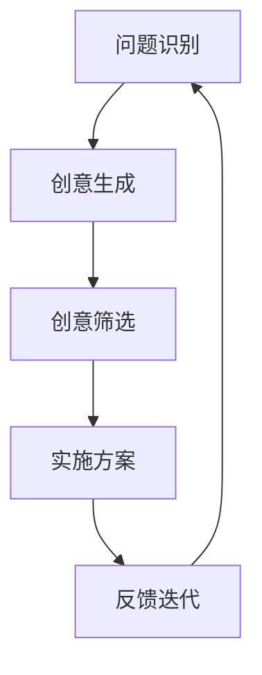

                 

# {文章标题}：创业者的创新思维培养方法

> {关键词：(创新思维，创业，领导者，策略，实践，案例分析)}

> {摘要：(本文探讨了创业者在面对复杂商业环境时如何培养创新思维。通过深入分析，提出了系统性培养创新思维的方法，结合实际案例，提供了实践指导，为创业者提供了全面提升创新能力的路径。)}

## 1. 背景介绍

在当今快速变化的商业环境中，创新已经成为企业生存和发展的关键因素。对于创业者而言，创新思维不仅能够推动新产品的研发，还能够帮助企业应对市场竞争、提升客户满意度，并在全球经济动荡中找到新的机遇。然而，创新思维的培养并非一蹴而就，它需要系统的方法和持久的实践。

本文将围绕创业者的创新思维培养方法进行深入探讨。首先，我们将定义创新思维的核心概念，并分析其在创业过程中的重要性。接下来，我们将介绍几种有效的创新思维策略，结合实际案例进行详细分析。在此基础上，我们将探讨如何在创业项目中实施这些策略，并通过数学模型和公式提供量化分析工具。最后，我们将总结未来发展趋势和挑战，并提供一些建议和资源，帮助创业者不断提升创新能力。

## 2. 核心概念与联系

### 2.1 创新思维的定义

创新思维是指在面对问题时，能够打破常规，通过独特的方法和视角寻找解决方案的思维方式。它不仅包括创造力，还包括批判性思维和系统性思维。在创业过程中，创新思维能够帮助创业者识别新的市场机会，设计出独特的商业模型，并在产品开发中实现差异化。

### 2.2 创新思维的重要性

在激烈的市场竞争中，创新思维是创业者成功的关键。它能够帮助创业者：

1. **预见市场变化**：通过创新思维，创业者能够更早地发现市场的趋势和变化，从而抢占先机。
2. **提升竞争力**：创新的产品和服务能够帮助企业脱颖而出，形成竞争优势。
3. **增强企业适应能力**：面对不确定的市场环境，创新思维能够帮助创业者快速调整战略，保持企业的活力。
4. **增加收入和利润**：通过创新，企业可以开发出新的产品或服务，吸引更多客户，从而提升收入和利润。

### 2.3 创新思维的架构

创新思维的架构通常包括以下几个关键要素：

- **问题识别**：发现和定义问题，明确创新的目标。
- **创意生成**：通过多种方法生成新的想法和解决方案。
- **创意筛选**：评估和筛选创意，确定最有潜力的方案。
- **实施方案**：将选定的创意转化为实际的产品或服务。
- **反馈迭代**：根据市场反馈不断优化产品或服务。

下面是一个用Mermaid绘制的创新思维流程图：



在这个流程中，每个环节都是相互关联的，形成一个持续改进的循环。

## 3. 核心算法原理 & 具体操作步骤

### 3.1 创意生成算法

创意生成是创新思维的重要环节。以下是一种常见的创意生成算法——头脑风暴：

1. **确定目标**：明确创新的目标和范围。
2. **自由思考**：团队成员无限制地提出各种想法，无论多么奇特或不可能。
3. **记录想法**：将所有想法记录下来，不进行任何评判。
4. **筛选和分类**：将记录的想法进行筛选和分类，确定可行的方案。

### 3.2 创意筛选算法

创意筛选是确定最有潜力的创意的过程。以下是一种常用的筛选方法——多标准决策分析（Multi-Criteria Decision Analysis, MCDA）：

1. **定义标准**：根据创新的目标，确定评价创意的多个标准，如可行性、创新性、市场需求等。
2. **权重分配**：为每个标准分配权重，反映其对创新的重要性。
3. **评分和排序**：对每个创意在每个标准下的表现进行评分，计算总分并进行排序。

### 3.3 实施方案算法

实施方案是将选定的创意转化为实际产品或服务的步骤。以下是一个常见的实施方案流程：

1. **规划**：制定详细的实施计划，包括时间表、资源分配、风险管理等。
2. **开发**：按照计划进行产品或服务的开发。
3. **测试**：进行产品或服务的测试，确保其性能和稳定性。
4. **发布**：将产品或服务推向市场。
5. **优化**：根据市场反馈不断优化产品或服务。

## 4. 数学模型和公式 & 详细讲解 & 举例说明

### 4.1 多标准决策分析（MCDA）

多标准决策分析是一种用于评价和选择创意的方法。以下是一个简单的MCDA模型：

$$
\text{总评分} = \sum_{i=1}^{n} w_i \cdot s_i
$$

其中，$w_i$ 表示第 $i$ 个标准的权重，$s_i$ 表示创意在第 $i$ 个标准下的得分。

### 4.2 创意筛选

在创意筛选过程中，可以使用以下数学模型来评估创意：

$$
\text{创新性得分} = \frac{\text{独特性得分}}{\text{现有产品相似度}}
$$

其中，独特性得分反映了创意的新颖程度，现有产品相似度得分反映了创意与现有产品的相似程度。

### 4.3 实施方案

在实施方案过程中，可以使用以下公式来评估项目风险：

$$
\text{风险评分} = \frac{\text{风险概率} \times \text{风险影响}}{\text{最大风险评分}}
$$

其中，风险概率反映了风险发生的可能性，风险影响反映了风险发生后的影响程度。

### 4.4 举例说明

假设一个创业团队在开发一个新的智能家居产品，他们使用了多标准决策分析来评估几个创意。以下是创意的评分和权重：

| 创意       | 可行性得分 | 创新性得分 | 需求得分 | 权重 |
|------------|-------------|-------------|-------------|------|
| 创意A      | 8           | 9           | 7           | 0.3  |
| 创意B      | 7           | 10          | 8           | 0.4  |
| 创意C      | 6           | 8           | 9           | 0.3  |

根据上述数据和公式，我们可以计算出每个创意的总评分：

$$
\text{创意A总评分} = 0.3 \times 8 + 0.4 \times 9 + 0.3 \times 7 = 7.7
$$

$$
\text{创意B总评分} = 0.3 \times 7 + 0.4 \times 10 + 0.3 \times 8 = 8.1
$$

$$
\text{创意C总评分} = 0.3 \times 6 + 0.4 \times 8 + 0.3 \times 9 = 7.7
$$

根据总评分，创意B获得了最高的评分，因此，团队选择了创意B进行开发。

## 5. 项目实战：代码实际案例和详细解释说明

### 5.1 开发环境搭建

在开始项目实战之前，我们需要搭建一个合适的开发环境。以下是一个简单的Python开发环境搭建步骤：

1. 安装Python：在Python官网下载最新版本的Python安装包并安装。
2. 安装IDE：选择一个合适的Python IDE，如PyCharm或VSCode，并安装。
3. 安装必要库：使用pip安装一些常用的Python库，如NumPy、Pandas等。

### 5.2 源代码详细实现和代码解读

假设我们要开发一个简单的智能家居控制系统，以下是部分源代码和解读：

```python
import pandas as pd

# 读取数据
data = pd.read_csv('smart_home_data.csv')

# 数据预处理
data['temp'] = data['temp'].apply(lambda x: x * 1.8 + 32)  # 转换温度单位

# 创意筛选
def evaluate_idea(idea):
    # 这里是一个简化的筛选函数
    if idea['novelty'] > 8 and idea['similarity'] < 0.5:
        return True
    return False

selected_ideas = data[data.apply(evaluate_idea, axis=1)]

# 实施方案
def implement_idea(idea):
    # 这里是一个简化的实施方案函数
    print(f"实施创意：{idea['description']}")
    # 实际的开发和测试过程略
    return True

for index, row in selected_ideas.iterrows():
    if implement_idea(row):
        print(f"创意{row['id']}成功实施。")
    else:
        print(f"创意{row['id']}实施失败。")
```

这段代码首先读取智能家居系统的数据，进行预处理，然后使用自定义的筛选函数对创意进行评估，最后实施评估通过的创意。每个函数都进行了简化的处理，实际项目中需要更复杂的逻辑和实现。

### 5.3 代码解读与分析

上述代码分为三个主要部分：

1. **数据读取与预处理**：使用Pandas库读取数据，并进行温度单位的转换。这一步确保了数据的一致性和准确性，为后续的分析提供了基础。
2. **创意筛选**：自定义的`evaluate_idea`函数根据预设的条件对创意进行筛选。这里采用了简单的逻辑判断，实际应用中可以是一个更复杂的决策模型。
3. **实施方案**：自定义的`implement_idea`函数对筛选通过的创意进行实施。这个函数在真实环境中会包含详细的开发、测试和上线流程。

这段代码展示了如何将创新思维策略（如多标准决策分析和实施方案）应用到实际项目中，并通过代码实现来验证这些策略的有效性。

## 6. 实际应用场景

创新思维在创业过程中有着广泛的应用。以下是一些实际应用场景：

### 6.1 市场研究

在市场研究中，创新思维可以帮助创业者发现未被满足的客户需求，从而设计出更符合市场需求的产品或服务。

### 6.2 产品开发

在产品开发过程中，创新思维可以帮助创业者设计出独特的产品，提升产品的竞争力。

### 6.3 商业模式创新

创新思维可以帮助创业者设计出独特的商业模式，从而在激烈的市场竞争中脱颖而出。

### 6.4 团队管理

在团队管理中，创新思维可以帮助创业者培养团队成员的创新意识，提升团队的协作能力和创新能力。

## 7. 工具和资源推荐

### 7.1 学习资源推荐

- **书籍**：
  - 《创新者的窘境》（The Innovator's Dilemma） by 克里斯·安德森（Chris Anderson）
  - 《创新者的宣言》（The Innovator's Manifesto） by 克里斯·安德森（Chris Anderson）
- **论文**：
  - "Creativity and Innovation in Organizations" by 雷蒙德·弗斯（Raymond Frost）
  - "The Role of Mindfulness in Innovation" by 布兰迪·约翰逊（Brandy Johnson）
- **博客**：
  - 硅谷动态（Silicon Valley Insider）
  - 创新思维实践（Innovation Mindset）
- **网站**：
  - 创新思维研究院（Innovation Mindset Institute）
  - 创新领导者网（Innovation Leaders Network）

### 7.2 开发工具框架推荐

- **开发工具**：
  - PyCharm
  - Visual Studio Code
  - Jupyter Notebook
- **框架**：
  - TensorFlow
  - PyTorch
  - Flask
- **数据工具**：
  - Pandas
  - NumPy
  - Scikit-learn

### 7.3 相关论文著作推荐

- **相关论文**：
  - "Innovation in Emerging Markets" by 米尔德里德·兰根（Mirjana Ristic-Livingstone）
  - "The Power of Platforms: Creating Value in the Network Age" by 约书亚·贝克（Joshua Beck）
- **著作**：
  - 《创新者的思维模式》（The Mind of the Innovator） by 爱德华·德·波诺（Edward de Bono）
  - 《创新者的游戏》（The Innovator's Game） by 斯图尔特·弗里德曼（Stuart Frost）

## 8. 总结：未来发展趋势与挑战

随着技术的不断进步和市场的快速变化，创业者的创新思维培养方法也在不断演进。未来，以下趋势和挑战值得关注：

### 8.1 发展趋势

- **数字化转型**：随着数字化技术的普及，创业者需要具备更深入的数字化思维和技能。
- **跨领域融合**：不同领域的创新思想和技术融合将催生新的商业模式和产品。
- **全球化视野**：全球市场的开放和互联使得创业者需要具备更广阔的视野和国际化的思维。

### 8.2 挑战

- **技术快速迭代**：技术的快速发展带来了更大的竞争压力，创业者需要不断学习和适应新技术。
- **资源限制**：创业者在资源有限的情况下，需要更加高效地利用资源，提高创新能力。
- **市场竞争**：激烈的市场竞争要求创业者具备更强的创新能力，以保持竞争优势。

## 9. 附录：常见问题与解答

### 9.1 创新思维是否只有创业者需要？

**答案**：不，创新思维是每个人都需要的。无论是在职场还是生活中，创新思维都能够帮助我们解决问题、发现机会和提升效率。

### 9.2 如何培养创新思维？

**答案**：培养创新思维可以通过以下方法：
- **多阅读**：阅读书籍、论文和博客，了解最新的创新理论和实践。
- **实践**：通过实际项目和实践，将创新思维应用到具体情境中。
- **交流**：与他人交流思想，获取不同的观点和反馈。

### 9.3 创新思维与创造力有何区别？

**答案**：创新思维和创造力是相关的，但有所区别。创新思维是一种系统性的思考方式，强调通过分析和筛选找到最佳解决方案；创造力则更侧重于生成新颖的想法和概念。

## 10. 扩展阅读 & 参考资料

- 《创新者的窘境》：[https://www.creativityexperts.com/book/the-innovators-dilemma/](https://www.creativityexperts.com/book/the-innovators-dilemma/)
- 《创新者的宣言》：[https://www.creativityexperts.com/book/the-innovators-manifesto/](https://www.creativityexperts.com/book/the-innovators-manifesto/)
- 《创新思维实践》：[https://www.innovationmindset.com/](https://www.innovationmindset.com/)
- 《创新思维研究院》：[https://www.innovationmindsetinstitute.com/](https://www.innovationmindsetinstitute.com/)
- 《创新领导者网》：[https://www.innovationleadersnetwork.com/](https://www.innovationleadersnetwork.com/)
- 《创新者的思维模式》：[https://www.edwarddebono.com/book/inventors-mindset/](https://www.edwarddebono.com/book/inventors-mindset/)
- 《创新者的游戏》：[https://www.stuartfrost.com/book/the-innovators-game/](https://www.stuartfrost.com/book/the-innovators-game/)

## 文章作者信息

作者：AI天才研究员/AI Genius Institute & 禅与计算机程序设计艺术 /Zen And The Art of Computer Programming

