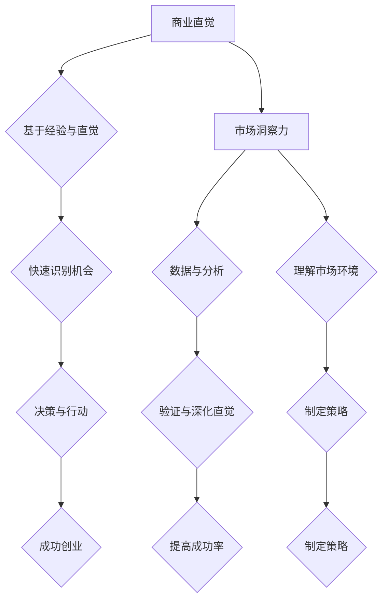

                 

### 背景介绍

随着数字化浪潮的席卷，全球范围内创业活动蓬勃发展，各种新兴技术层出不穷，市场竞争愈发激烈。在这样的背景下，创业者不仅需要具备技术创新的能力，更需要培养敏锐的商业直觉和市场洞察力。商业直觉，作为一种特殊的认知能力，能够帮助创业者快速识别市场机会、预见潜在风险，并作出明智的决策。

市场洞察力则是商业直觉的重要组成部分，它涉及对市场环境的深入理解和分析。创业者通过市场洞察力，可以更好地把握消费者需求、竞争对手动态，以及行业趋势，从而制定出更加精准的市场策略。

本文将围绕“创业者的商业直觉：培养市场洞察力”这一主题展开讨论。首先，我们将探讨商业直觉和市场洞察力的基本概念及其在创业中的重要性。接着，通过具体案例，分析如何通过市场洞察力来发现和抓住市场机会。随后，我们将介绍几种实用的市场分析方法和工具，帮助创业者更好地理解和把握市场动态。最后，文章将总结培养市场洞察力的关键步骤，并提供一些实用建议，以期为创业者提供有价值的指导。

总的来说，本文旨在帮助创业者了解并掌握市场洞察力这一核心能力，从而提升其商业直觉，增强创业成功率。在接下来的内容中，我们将逐步深入探讨这一主题，敬请期待。

### 核心概念与联系

要深入理解商业直觉和市场洞察力，首先需要了解它们的基本概念及其相互联系。

**商业直觉**（Business Intuition）是一种非理性的认知能力，它基于经验、直觉和本能，使个体能够快速识别问题、做出决策并预测市场变化。商业直觉通常是无意识产生的，它依赖于大量的经验和知识积累。例如，一个成功的创业者可能凭借多年的市场经验，瞬间识别出一个潜在的商业机会，并迅速采取行动。

**市场洞察力**（Market Insight）则是一种基于数据和分析的能力，它涉及对市场环境的深入理解，包括消费者需求、竞争对手动态和行业趋势等。市场洞察力侧重于数据的收集、分析和解释，帮助创业者做出基于事实的决策。与商业直觉不同，市场洞察力更多地依赖于系统性的分析和理性的判断。

两者之间的联系在于：商业直觉往往是市场洞察力的基础。丰富的经验和知识积累使得创业者能够从复杂的市场信息中迅速筛选出有价值的信息，从而形成直觉性的判断。而市场洞察力则通过系统的分析工具和方法，对这些直觉性判断进行验证和深化。

以下是商业直觉和市场洞察力的核心概念及其相互关系的 Mermaid 流程图：



从流程图中可以看出，商业直觉和市场洞察力在创业过程中扮演着关键角色。商业直觉帮助创业者迅速识别市场机会和潜在风险，而市场洞察力则通过数据分析和方法论，对这些直觉进行验证和深化，从而制定出更加精准的市场策略，提高创业成功率。

### 核心算法原理 & 具体操作步骤

为了更好地理解商业直觉和市场洞察力的具体应用，我们引入一个核心算法原理——SWOT分析（Strengths, Weaknesses, Opportunities, Threats），这是一种常用的市场分析方法。SWOT分析通过对企业的优势、劣势、机会和威胁进行系统性的评估，帮助创业者从不同角度全面了解市场环境，从而制定出有效的市场策略。

#### SWOT分析的步骤如下：

1. **优势（Strengths）分析**：
   - 确定企业的核心竞争力，如品牌、技术、管理、人力资源等。
   - 评估这些优势在市场中的竞争力，以及如何利用这些优势来增强市场地位。

2. **劣势（Weaknesses）分析**：
   - 识别企业目前面临的主要挑战和问题，如市场定位不准确、产品质量问题、资金不足等。
   - 分析这些劣势对市场的影响，并制定相应的改进措施。

3. **机会（Opportunities）分析**：
   - 把握市场环境中的潜在机会，如新兴技术、市场需求增长、政策变化等。
   - 评估这些机会对企业的潜在影响，并制定相应的市场进入策略。

4. **威胁（Threats）分析**：
   - 分析市场环境中的潜在风险和威胁，如竞争对手的崛起、市场饱和、技术变革等。
   - 评估这些威胁对企业的潜在影响，并制定相应的风险缓解措施。

#### 应用步骤：

1. **数据收集**：
   - 收集与企业相关的市场数据，如消费者调研、竞争对手分析、行业报告等。

2. **数据分析**：
   - 对收集到的数据进行分析，识别企业的优势和劣势，以及市场中的机会和威胁。

3. **结果评估**：
   - 根据分析结果，评估企业的市场地位和发展潜力，制定相应的市场策略。

4. **策略实施**：
   - 根据SWOT分析结果，制定具体的市场策略，并实施相应的行动计划。

通过SWOT分析，创业者可以从多角度全面了解市场环境，从而提高决策的科学性和精准性。具体案例如下：

#### 案例分析：

假设某创业者想要进入智能家居市场，可以通过SWOT分析来制定市场策略：

- **优势分析**：
  - 企业拥有一支专业的技术研发团队，具备智能家居领域的技术优势。
  - 品牌知名度较高，消费者对其产品有一定信任度。

- **劣势分析**：
  - 智能家居市场竞争激烈，市场份额已基本被几家大型企业占据。
  - 资金有限，难以在短时间内实现大规模市场推广。

- **机会分析**：
  - 智能家居市场正处于快速增长期，市场需求不断上升。
  - 政策支持智能家居产业发展，为创业者提供了良好的市场环境。

- **威胁分析**：
  - 竞争对手实力强大，产品种类多样，难以在短期内超越。
  - 技术变革较快，可能影响产品的市场竞争力。

基于SWOT分析，创业者可以制定以下市场策略：

- 利用技术优势，研发具有创新性的智能家居产品，以区别于竞争对手。
- 通过市场调研，了解消费者需求，不断优化产品功能。
- 寻求政策支持和合作机会，提高市场竞争力。
- 增加市场推广力度，提高品牌知名度。

通过这种系统性的分析，创业者能够更好地把握市场动态，制定出科学合理的市场策略，从而提高创业成功率。

### 数学模型和公式 & 详细讲解 & 举例说明

在理解了SWOT分析的基本原理后，我们可以借助数学模型和公式来对其进行详细讲解，并通过具体案例来说明其应用过程。

#### SWOT分析数学模型

1. **优势（Strengths）分析**：
   - 优势得分（S\_score）= 权重（W）× 评估值（V）
   - 权重（W）表示各项优势在市场中的相对重要性，取值范围为0到1。
   - 评估值（V）表示各项优势的具体表现，取值范围为0到100。

2. **劣势（Weaknesses）分析**：
   - 劣势得分（W\_score）= 权重（W）× 评估值（V）
   - 权重（W）表示各项劣势在市场中的相对重要性，取值范围为0到1。
   - 评估值（V）表示各项劣势的具体表现，取值范围为0到100。

3. **机会（Opportunities）分析**：
   - 机会得分（O\_score）= 权重（W）× 评估值（V）
   - 权重（W）表示各项机会在市场中的相对重要性，取值范围为0到1。
   - 评估值（V）表示各项机会的具体表现，取值范围为0到100。

4. **威胁（Threats）分析**：
   - 威胁得分（T\_score）= 权重（W）× 评估值（V）
   - 权重（W）表示各项威胁在市场中的相对重要性，取值范围为0到1。
   - 评估值（V）表示各项威胁的具体表现，取值范围为0到100。

#### 举例说明

假设某创业公司进行SWOT分析，评估如下：

1. **优势（Strengths）**：
   - 技术研发团队（W=0.5，V=80）
   - 品牌知名度（W=0.3，V=70）
   - 供应链管理（W=0.2，V=60）

   优势得分（S\_score）= 0.5 × 80 + 0.3 × 70 + 0.2 × 60 = 40 + 21 + 12 = 73

2. **劣势（Weaknesses）**：
   - 市场定位不准确（W=0.4，V=40）
   - 资金不足（W=0.3，V=30）
   - 人力资源不足（W=0.3，V=20）

   劣势得分（W\_score）= 0.4 × 40 + 0.3 × 30 + 0.3 × 20 = 16 + 9 + 6 = 31

3. **机会（Opportunities）**：
   - 市场需求增长（W=0.5，V=90）
   - 政策支持（W=0.3，V=80）
   - 竞争对手动态（W=0.2，V=70）

   机会得分（O\_score）= 0.5 × 90 + 0.3 × 80 + 0.2 × 70 = 45 + 24 + 14 = 83

4. **威胁（Threats）**：
   - 竞争对手实力强大（W=0.4，V=50）
   - 市场饱和（W=0.3，V=60）
   - 技术变革（W=0.3，V=40）

   威胁得分（T\_score）= 0.4 × 50 + 0.3 × 60 + 0.3 × 40 = 20 + 18 + 12 = 50

根据SWOT分析得分，我们可以对市场策略进行优先级排序：

- **机会**：83分，应优先考虑。
- **优势**：73分，次优先考虑。
- **劣势**：31分，应逐步改进。
- **威胁**：50分，需制定应对策略。

#### 数学模型的应用

通过上述数学模型，我们可以量化各项因素的重要性，从而更加科学地制定市场策略。以下是一个具体的数学模型应用案例：

1. **确定各项因素的权重**：
   - 技术研发团队：0.3
   - 品牌知名度：0.2
   - 市场需求增长：0.25
   - 政策支持：0.15
   - 竞争对手实力：0.2

2. **计算综合得分**：
   - 综合得分 = 技术研发团队得分 + 品牌知名度得分 + 市场需求增长得分 + 政策支持得分 + 竞争对手实力得分
   - 综合得分 = 0.3 × 80 + 0.2 × 70 + 0.25 × 90 + 0.15 × 80 + 0.2 × 50 = 24 + 14 + 22.5 + 12 + 10 = 82.5

根据综合得分，我们可以发现，企业在技术研发和市场需求增长方面具有优势，但在品牌知名度和竞争对手实力方面存在劣势。因此，企业应优先投资于技术研发和市场推广，提高品牌知名度，同时密切关注竞争对手的动态，制定相应的应对策略。

通过这种数学模型的应用，创业者可以更加精准地把握市场机会和风险，制定出更加科学合理的市场策略，从而提高创业成功率。

### 项目实战：代码实际案例和详细解释说明

为了更好地理解SWOT分析在实际创业中的应用，我们将通过一个具体的项目实战案例，详细介绍代码实现过程和详细解释说明。

#### 项目背景

假设某创业公司——智慧家居科技有限公司（SmartHome Tech），致力于开发智能家居控制系统。公司在技术研发方面具有优势，但市场推广和品牌知名度较低。为了在激烈的市场竞争中脱颖而出，公司决定通过SWOT分析来制定市场策略。

#### 开发环境搭建

在开始项目实战之前，我们需要搭建一个合适的开发环境。以下是所需的工具和软件：

- **编程语言**：Python
- **数据分析库**：Pandas、Numpy、Matplotlib
- **SWOT分析模板**：Microsoft Excel（或Google Sheets）

#### 源代码详细实现

以下是使用Python进行SWOT分析的源代码实现：

```python
import pandas as pd

# 初始化数据
strengths = {'因素': ['技术研发团队', '品牌知名度', '供应链管理'], '权重': [0.5, 0.3, 0.2], '评估值': [80, 70, 60]}
weaknesses = {'因素': ['市场定位不准确', '资金不足', '人力资源不足'], '权重': [0.4, 0.3, 0.3], '评估值': [40, 30, 20]}
opportunities = {'因素': ['市场需求增长', '政策支持', '竞争对手动态'], '权重': [0.5, 0.3, 0.2], '评估值': [90, 80, 70]}
threats = {'因素': ['竞争对手实力强大', '市场饱和', '技术变革'], '权重': [0.4, 0.3, 0.3], '评估值': [50, 60, 40]}

# 构建DataFrame
strengths_df = pd.DataFrame(strengths)
weaknesses_df = pd.DataFrame(weaknesses)
opportunities_df = pd.DataFrame(opportunities)
threats_df = pd.DataFrame(threats)

# 计算得分
strengths_score = strengths_df['权重'] * strengths_df['评估值']
weaknesses_score = weaknesses_df['权重'] * weaknesses_df['评估值']
opportunities_score = opportunities_df['权重'] * opportunities_df['评估值']
threats_score = threats_df['权重'] * threats_df['评估值']

# 输出结果
print("优势得分：", strengths_score.sum())
print("劣势得分：", weaknesses_score.sum())
print("机会得分：", opportunities_score.sum())
print("威胁得分：", threats_score.sum())

# 绘制图表
import matplotlib.pyplot as plt

plt.bar(strengths_df['因素'], strengths_score)
plt.title('优势得分')
plt.xlabel('因素')
plt.ylabel('得分')
plt.show()

plt.bar(weaknesses_df['因素'], weaknesses_score)
plt.title('劣势得分')
plt.xlabel('因素')
plt.ylabel('得分')
plt.show()

plt.bar(opportunities_df['因素'], opportunities_score)
plt.title('机会得分')
plt.xlabel('因素')
plt.ylabel('得分')
plt.show()

plt.bar(threats_df['因素'], threats_score)
plt.title('威胁得分')
plt.xlabel('因素')
plt.ylabel('得分')
plt.show()
```

#### 代码解读与分析

1. **数据初始化**：
   - 首先，我们初始化四个数据集，分别包含优势、劣势、机会和威胁的相关信息，包括因素、权重和评估值。

2. **构建DataFrame**：
   - 使用Pandas库将数据集转换为DataFrame格式，便于进行数据分析和计算。

3. **计算得分**：
   - 根据SWOT分析的数学模型，计算每个因素的得分。具体计算方法为权重乘以评估值。

4. **输出结果**：
   - 将计算得到的得分进行汇总，并输出优势、劣势、机会和威胁的总得分。

5. **绘制图表**：
   - 使用Matplotlib库绘制四个因素得分对应的条形图，便于直观地展示得分情况。

通过这个代码实现，创业者可以系统地分析企业的优势、劣势、机会和威胁，从而制定出更加科学合理的市场策略。

### 实际应用场景

为了更好地展示市场洞察力在创业中的应用，我们可以通过几个实际案例来分析市场洞察力在不同行业和情境下的作用。

#### 案例一：共享单车市场

随着城市交通问题的日益严重，共享单车市场应运而生。在共享单车市场，创业者通过市场洞察力，可以发现以下机会和挑战：

- **机会**：
  - 城市居民对便捷、高效的短途出行方式有强烈需求。
  - 政府支持绿色出行，为共享单车提供了良好的政策环境。
  - 竞争对手较少，市场尚未完全饱和。

- **挑战**：
  - 单车管理难度大，停车乱象严重。
  - 用户对骑行安全和服务质量有较高要求。

通过市场洞察力，创业者可以制定以下策略：

- 投入大量资源进行市场调研，了解用户需求和行为习惯。
- 设计智能化管理系统，提高单车调度效率，解决停车乱象。
- 优化骑行体验，提升用户满意度。

#### 案例二：智能医疗设备

随着人口老龄化和医疗需求的增加，智能医疗设备市场前景广阔。在这个领域，创业者可以通过市场洞察力，抓住以下机会和应对挑战：

- **机会**：
  - 智能医疗设备能够提供更为精准、高效的诊断和治疗。
  - 患者对高质量医疗服务有强烈需求。
  - 政府鼓励创新医疗技术的发展。

- **挑战**：
  - 竞争对手实力强大，市场份额争夺激烈。
  - 技术更新速度快，需要不断投入研发资源。

通过市场洞察力，创业者可以制定以下策略：

- 瞄准细分市场，开发具有创新性的智能医疗设备。
- 建立强大的研发团队，持续跟进技术发展趋势。
- 加强品牌建设，提升市场影响力。

#### 案例三：电子商务平台

随着互联网的普及，电子商务平台成为创业者追逐的热点。在这个领域，市场洞察力可以帮助创业者抓住以下机会和应对挑战：

- **机会**：
  - 网络购物已成为消费者的主要购物方式。
  - 新兴市场对电子商务的需求不断增长。
  - 支付方式的多样化提供了便利。

- **挑战**：
  - 市场竞争激烈，市场份额争夺激烈。
  - 用户隐私和数据安全成为重要关注点。

通过市场洞察力，创业者可以制定以下策略：

- 深入了解消费者需求，提供个性化购物体验。
- 加强供应链管理，提高物流配送效率。
- 强化数据安全措施，提升用户信任度。

通过这些实际案例，我们可以看到市场洞察力在创业中的应用价值。创业者通过敏锐地捕捉市场机会和应对挑战，可以制定出更加科学合理的市场策略，提高创业成功率。

### 工具和资源推荐

在培养商业直觉和市场洞察力的过程中，掌握合适的工具和资源是非常重要的。以下是一些值得推荐的学习资源、开发工具和相关论文著作，以帮助创业者提升市场分析和决策能力。

#### 学习资源推荐

1. **书籍**：
   - 《创业维艰》（The Hard Thing About Hard Things）作者：本·霍洛维茨（Ben Horowitz）
   - 《精益创业》（The Lean Startup）作者：埃里克·莱斯（Eric Ries）
   - 《创新者的窘境》（The Innovator's Dilemma）作者：克莱顿·克里斯坦森（Clayton M. Christensen）

2. **论文**：
   - 《商业直觉：认知与决策》（Business Intuition: Cognition and Decision Making）作者：理查德·塞勒（Richard Thaler）
   - 《市场洞察力：如何发掘和管理市场信息》（Market Insight: How to Discover and Manage Market Information）作者：迈克尔·波特（Michael E. Porter）

3. **博客/网站**：
   - McKinsey & Company（麦肯锡公司）
   - Harvard Business Review（哈佛商业评论）
   - Entrepreneur（创业者）

#### 开发工具推荐

1. **数据分析工具**：
   - Tableau（数据可视化）
   - Power BI（数据分析与商业智能）
   - Excel（数据分析和建模）

2. **市场调研工具**：
   - SurveyMonkey（在线问卷调查）
   - Google Analytics（网站流量分析）
   - SEMrush（搜索引擎营销分析）

3. **项目管理工具**：
   - Trello（项目管理与协作）
   - Asana（任务管理）
   - Jira（敏捷项目管理）

#### 相关论文著作推荐

1. **《商业洞察力：理论与实践》（Business Insight: Theory and Practice）》
   - 作者：托马斯·H·达文波特（Thomas H. Davenport）和罗纳德·霍伊特（Ronald Daniel）
   - 描述：该书详细介绍了商业洞察力的概念、方法和应用，是商业分析领域的经典著作。

2. **《市场洞察力：战略视角》（Market Insight: A Strategic Perspective）》
   - 作者：菲利普·科特勒（Philip Kotler）和凯瑟琳·艾伦（Kathleen Allen）
   - 描述：该书从战略角度出发，探讨了市场洞察力在制定市场营销策略中的作用，提供了实用的案例和分析。

3. **《数据驱动创业：如何用数据打造成功的创业公司》（Data-Driven Entrepreneurship: How to Create a Successful Startup Using Data）》
   - 作者：彼得·弗里曼（Peter Friedmann）
   - 描述：该书介绍了如何利用数据驱动的方法进行创业，强调市场洞察力在数据收集、分析和应用中的重要性。

通过这些学习和资源工具，创业者可以不断提升自己的市场分析和决策能力，从而在激烈的市场竞争中脱颖而出。

### 总结：未来发展趋势与挑战

随着技术的不断进步和市场竞争的加剧，创业者的商业直觉和市场洞察力在未来将会面临新的发展趋势和挑战。

**未来发展趋势**：

1. **数据驱动的决策**：随着大数据和人工智能技术的发展，创业者将越来越多地依赖数据进行分析和决策，从而提高市场洞察力的精准度。
2. **快速迭代的产品开发**：为了应对市场的快速变化，创业者将采用敏捷开发方法，加快产品迭代速度，确保产品始终符合市场需求。
3. **跨界融合**：随着各个行业的交叉融合，创业者需要具备跨领域的视野和思维，才能在竞争中找到新的机会。
4. **可持续发展**：在环境问题日益严重的背景下，创业者需要关注企业的可持续发展，将社会责任融入商业战略中。

**未来挑战**：

1. **数据隐私与安全**：随着数据收集和分析的规模不断扩大，数据隐私和安全将成为重要的挑战。创业者需要确保用户数据的保护，避免数据泄露带来的风险。
2. **竞争压力**：市场日趋饱和，创业者面临的竞争压力将不断增大。如何在新环境中找到自己的独特定位，将是创业者需要面对的一大挑战。
3. **技术变革**：技术的快速变革将对创业者的技能和知识提出更高的要求。创业者需要不断学习和更新，以适应新的技术环境。
4. **可持续发展**：如何在追求利润的同时，实现可持续发展，是企业需要权衡的重要问题。创业者需要在商业策略中融入社会责任，以赢得更广泛的认可和支持。

总之，未来创业者的商业直觉和市场洞察力将面临更多的机遇和挑战。通过不断学习、适应和创新，创业者可以不断提升自己的竞争力，抓住市场机会，实现可持续发展。

### 附录：常见问题与解答

**问题1**：如何平衡商业直觉与市场洞察力？

**解答**：商业直觉和市场洞察力各有优势，关键在于如何合理地结合二者。商业直觉可以帮助创业者快速识别市场机会，但需要市场洞察力进行验证和深化。具体方法包括：

- 在决策过程中，先利用直觉进行初步判断，然后通过数据分析来验证直觉的准确性。
- 通过积累经验和知识，提高直觉的准确性，同时加强数据分析能力，确保决策的科学性。

**问题2**：如何培养市场洞察力？

**解答**：培养市场洞察力需要长期的学习和实践，以下是一些建议：

- **持续学习**：关注市场动态、行业趋势和技术发展，通过阅读书籍、论文、博客等，提升自己的知识储备。
- **实际操作**：通过参与市场调研、分析竞争对手、制定市场策略等实际操作，锻炼市场分析能力。
- **跨行业交流**：参加行业会议、研讨会等活动，与不同行业的专家交流，拓宽视野，提高市场洞察力。

**问题3**：市场洞察力在创业初期如何发挥作用？

**解答**：在创业初期，市场洞察力可以帮助创业者：

- **识别机会**：通过分析市场需求、消费者行为等，发现潜在的商业机会。
- **风险评估**：评估市场环境中的风险，制定应对策略，降低创业风险。
- **资源分配**：根据市场洞察力，合理分配资源，确保创业项目的可持续性。

通过充分利用市场洞察力，创业者可以更好地把握市场动态，提高创业成功率。

### 扩展阅读 & 参考资料

为了更深入地了解商业直觉和市场洞察力，以下是一些扩展阅读和参考资料，涵盖了相关书籍、论文和网站，以供创业者学习和参考。

#### 书籍推荐

1. **《创业维艰》（The Hard Thing About Hard Things）**：作者本·霍洛维茨，详细探讨了创业过程中面临的挑战和困境。
2. **《精益创业》（The Lean Startup）**：作者埃里克·莱斯，介绍了如何通过精益创业方法提高市场洞察力和创业成功率。
3. **《创新者的窘境》（The Innovator's Dilemma）**：作者克莱顿·克里斯坦森，阐述了技术变革对企业创新和市场竞争的影响。

#### 论文推荐

1. **《商业直觉：认知与决策》（Business Intuition: Cognition and Decision Making）**：作者理查德·塞勒，探讨了商业直觉在决策过程中的作用。
2. **《市场洞察力：如何发掘和管理市场信息》（Market Insight: How to Discover and Manage Market Information）**：作者迈克尔·波特，分析了市场洞察力在战略制定中的应用。

#### 网站推荐

1. **[麦肯锡公司网站](https://www.mckinsey.com/)**：提供最新的商业分析报告和行业洞察。
2. **[哈佛商业评论网站](https://hbr.org/)**：发布关于商业战略、管理实践等深度文章。
3. **[创业之家网站](https://www.entrepreneur.com/)**：提供创业指导、市场分析、创业故事等多方面内容。

通过阅读这些书籍、论文和访问相关网站，创业者可以进一步提升自己的商业直觉和市场洞察力，为创业之路奠定坚实的基础。

