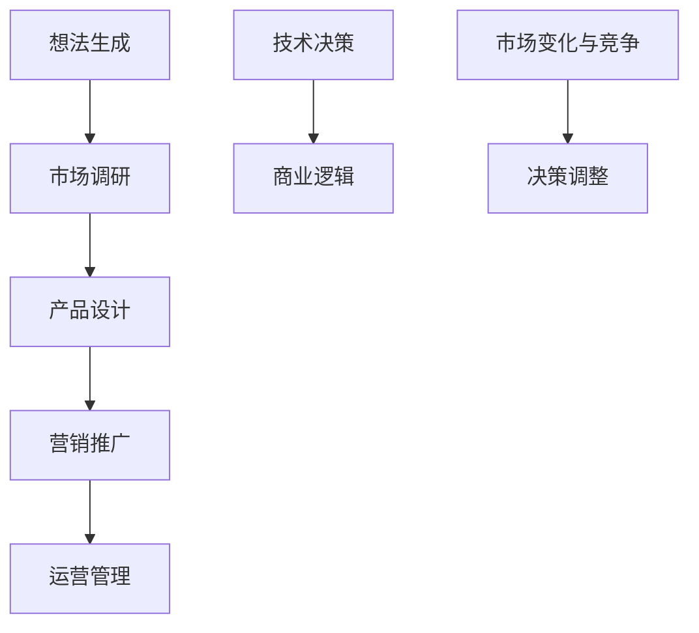
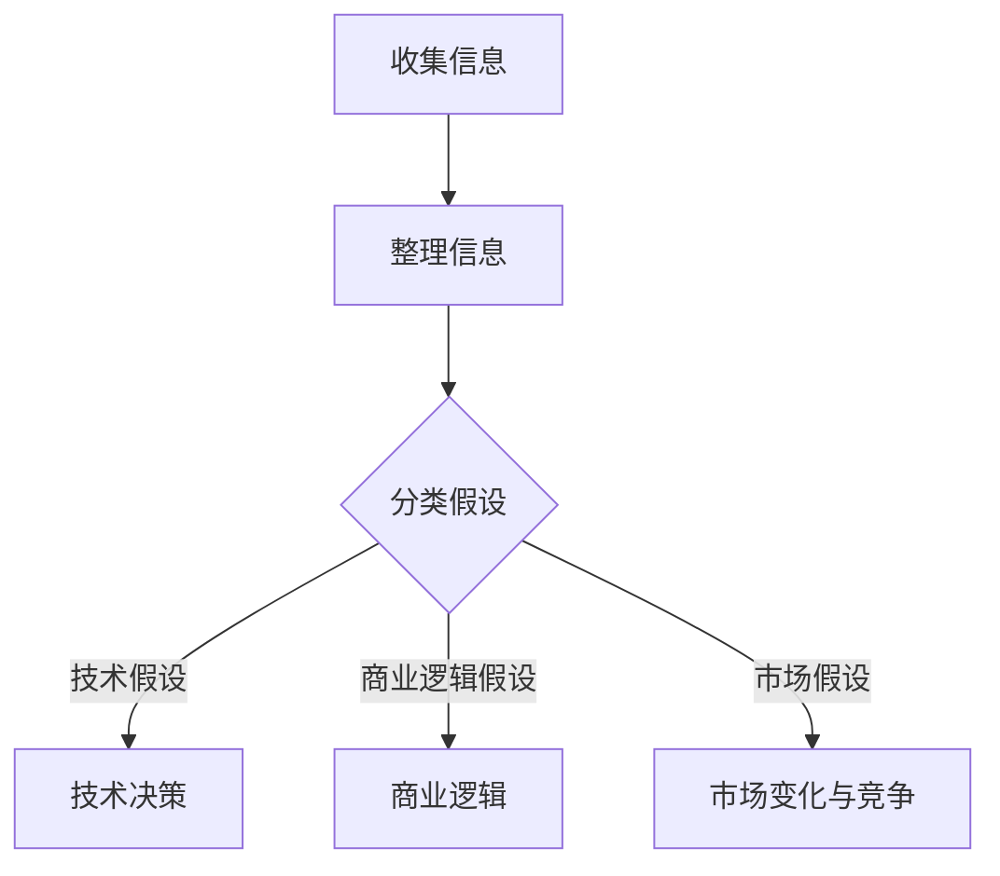
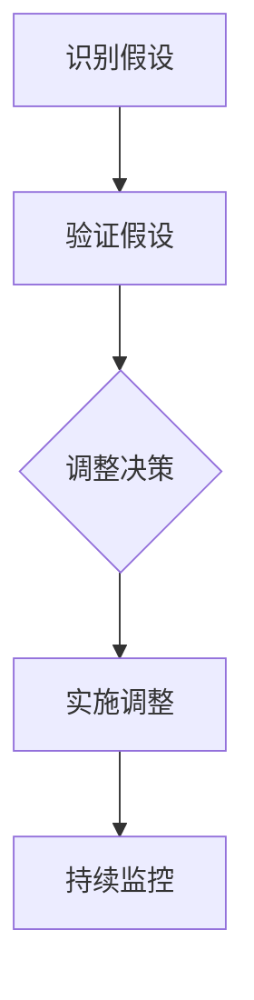

                 

### 文章标题

**创业者的失败：根深蒂固的假设**

> **关键词：** 创业者，失败，假设，技术决策，商业逻辑

**摘要：** 本文将深入探讨创业者中普遍存在的失败原因——根深蒂固的假设。通过对创业过程的剖析，揭示技术决策和商业逻辑中的潜在陷阱，为创业者提供新的思考和行动方向。

-----------------

## 1. 背景介绍

在科技高速发展的今天，创业已经成为许多人心中的梦想。然而，创业成功率却并不乐观。根据统计，大约90%的初创公司在第一年内就会失败，而在五年内存活的概率更是不到10%。创业失败的原因多种多样，但其中有一个共同点，那就是创业者常常受到根深蒂固的假设的影响。

这些假设可能源于个人经验、行业惯例或者市场趋势，往往在创业初期就被视为不容置疑的真理。然而，随着市场的变化和竞争的加剧，这些假设往往成为创业失败的元凶。

本文将首先介绍创业失败的现状和原因，然后深入探讨根深蒂固的假设在技术决策和商业逻辑中的应用，最后提出应对这些假设的策略和建议。

-----------------

## 2. 核心概念与联系

为了更好地理解根深蒂固的假设对创业成功的影响，我们需要先了解一些核心概念和它们之间的联系。

**2.1 创业过程**

创业过程可以简单概括为：想法生成、市场调研、产品设计、营销推广、运营管理。在这个过程中，创业者需要做出一系列决策，包括技术选择、市场定位、团队搭建等。

**2.2 技术决策**

技术决策是创业过程中的关键环节，决定了产品的核心竞争力。技术选择不仅影响产品的功能特性，还涉及成本、开发周期、维护等多个方面。

**2.3 商业逻辑**

商业逻辑是创业者在市场中立足的根本。它包括盈利模式、客户价值、市场定位等，直接影响企业的生存和发展。

**2.4 市场变化与竞争**

市场是动态变化的，创业者需要密切关注市场趋势和竞争对手的动态，以调整自己的策略。然而，根深蒂固的假设往往使创业者无法及时应对市场的变化。

-----------------

### 3. 核心算法原理 & 具体操作步骤

在理解了核心概念和联系之后，我们需要进一步探讨如何识别和应对根深蒂固的假设。

**3.1 识别根深蒂固的假设**

- **访谈法**：通过与创业者、团队成员、客户等进行深入访谈，了解他们的想法和决策过程。
- **数据分析**：收集和分析创业过程中的数据，如市场调研报告、用户反馈、财务报表等，以识别潜在的错误假设。
- **头脑风暴**：组织团队进行头脑风暴，列出所有可能的假设，并对其进行质疑和验证。

**3.2 应对根深蒂固的假设**

- **假设检验**：对识别出的假设进行实验验证，以确认其正确性。如果假设不成立，及时调整决策。
- **持续学习**：创业者需要不断学习新知识、新技能，以应对市场的变化和竞争的挑战。
- **开放心态**：创业者应保持开放心态，接受新的观点和建议，不断优化自己的决策。

-----------------

### 4. 数学模型和公式 & 详细讲解 & 举例说明

在应对根深蒂固的假设时，我们可以借助数学模型和公式来辅助决策。

**4.1 假设检验**

假设检验是统计推断的一种方法，用于判断一个假设是否成立。其基本公式如下：

$$
H_0: \text{原假设} \\
H_1: \text{备选假设}
$$

其中，$H_0$表示要检验的假设，$H_1$表示备选假设。通过收集数据并进行统计检验，我们可以判断$H_0$是否成立。

**举例说明：**

假设某创业者认为市场需求规模为1000万元，其原假设为$H_0: \text{市场需求规模} = 1000$万元。通过市场调研数据，发现实际市场需求规模为800万元，此时我们就可以认为原假设不成立，需要调整市场策略。

**4.2 持续学习**

持续学习是一个复杂的过程，可以借助以下公式进行量化：

$$
\text{学习速度} = \frac{\text{新知识量}}{\text{旧知识量}}
$$

其中，学习速度表示在单位时间内新知识量与旧知识量的比值。为了提高学习速度，创业者需要不断扩充自己的知识库，提高对新知识的理解和应用能力。

**举例说明：**

假设某创业者原有知识量为1000点，通过学习新知识，知识量增加至1500点。此时，其学习速度为：

$$
\text{学习速度} = \frac{1500}{1000} = 1.5
$$

这意味着创业者的学习速度提高了50%。

-----------------

### 5. 项目实战：代码实际案例和详细解释说明

为了更好地理解如何应对根深蒂固的假设，我们来看一个实际的代码案例。

**5.1 开发环境搭建**

首先，我们需要搭建一个简单的开发环境，用于模拟创业项目的开发过程。

```bash
# 安装Python环境
pip install python

# 安装必要的库
pip install numpy scipy matplotlib
```

**5.2 源代码详细实现和代码解读**

接下来，我们实现一个简单的市场调研模拟器，用于检验市场需求假设。

```python
import numpy as np
import scipy.stats as stats
import matplotlib.pyplot as plt

# 模拟市场调研数据
def simulate_survey(n_samples, mean=1000, std=100):
    return np.random.normal(mean, std, n_samples)

# 检验市场需求假设
def test_demand_assumption(survey_results, alpha=0.05):
    mean_result = np.mean(survey_results)
    t_stat, p_value = stats.ttest_1samp(survey_results, 1000)
    if p_value < alpha:
        print(f"市场需求假设不成立，实际需求量为：{mean_result:.2f}万元")
    else:
        print("市场需求假设成立")

# 测试案例
n_samples = 100
survey_results = simulate_survey(n_samples)
test_demand_assumption(survey_results)

# 可视化展示
plt.hist(survey_results, bins=30, alpha=0.5, color='blue')
plt.axvline(x=1000, color='red', linestyle='dashed', linewidth=2)
plt.xlabel('市场需求量（万元）')
plt.ylabel('样本频数')
plt.title('市场需求量分布图')
plt.show()
```

**5.3 代码解读与分析**

上述代码实现了两个主要功能：

1. 模拟市场调研数据，生成随机样本。
2. 通过t检验方法，检验市场需求假设是否成立。

具体解读如下：

- `simulate_survey()`函数用于生成市场调研数据。其中，`mean`参数表示市场需求量的平均值，`std`参数表示市场需求量的标准差。
- `test_demand_assumption()`函数用于检验市场需求假设。通过计算样本均值和t统计量，与原假设进行比较，判断是否成立。
- 测试案例中，我们设置市场需求量的期望值为1000万元，通过模拟生成100个样本，并对其进行假设检验。

通过这个案例，我们可以看到如何利用代码来检验根深蒂固的假设，从而为创业决策提供有力支持。

-----------------

### 6. 实际应用场景

根深蒂固的假设在创业过程中无处不在，以下是一些实际应用场景：

- **技术决策**：创业者往往认为某些技术是不可或缺的，从而过度依赖这些技术。然而，随着市场变化，这些技术可能不再适用，导致创业失败。
- **市场定位**：创业者可能基于现有市场数据进行市场定位，但市场趋势可能已发生变化，导致定位不准确。
- **团队搭建**：创业者可能基于个人喜好或经验来选择团队成员，而忽视了团队成员的专业技能和团队合作能力。

通过识别和应对这些假设，创业者可以更好地适应市场变化，提高创业成功率。

-----------------

### 7. 工具和资源推荐

为了帮助创业者更好地应对根深蒂固的假设，我们推荐以下工具和资源：

- **工具**：
  - Python：用于数据分析、模拟和假设检验等。
  - Jupyter Notebook：用于编写和运行Python代码，方便实验和演示。
  - GitHub：用于版本控制和代码共享，方便团队协作。

- **资源**：
  - 《精益创业》：一本关于创业实践的畅销书，介绍了如何通过验证假设来提高创业成功率。
  - 《Python数据分析》：一本关于Python数据分析的入门书籍，适合创业者学习数据分析方法。
  - 《假设检验原理与应用》：一本关于假设检验的书籍，帮助创业者了解如何进行统计推断。

-----------------

### 8. 总结：未来发展趋势与挑战

根深蒂固的假设是创业失败的重要原因之一。随着市场环境的不断变化，创业者需要不断调整自己的假设，以适应新的市场环境。

未来，随着人工智能和大数据技术的发展，创业者将能够更准确地识别和验证假设。然而，这也带来了新的挑战，如数据隐私、数据质量和算法偏见等。

为了应对这些挑战，创业者需要持续学习新知识、新技术，不断提高自己的综合素质。同时，创业者还应保持开放心态，勇于尝试新的方法和策略，以适应不断变化的市场环境。

-----------------

### 9. 附录：常见问题与解答

**Q1：如何识别根深蒂固的假设？**

A1：可以通过访谈法、数据分析法和头脑风暴法来识别根深蒂固的假设。具体方法如下：

- 访谈法：与创业者、团队成员、客户等进行深入访谈，了解他们的想法和决策过程。
- 数据分析法：收集和分析创业过程中的数据，如市场调研报告、用户反馈、财务报表等，以识别潜在的错误假设。
- 头脑风暴法：组织团队进行头脑风暴，列出所有可能的假设，并对其进行质疑和验证。

**Q2：如何应对根深蒂固的假设？**

A2：可以通过以下方法来应对根深蒂固的假设：

- 假设检验：对识别出的假设进行实验验证，以确认其正确性。如果假设不成立，及时调整决策。
- 持续学习：创业者需要不断学习新知识、新技能，以应对市场的变化和竞争的挑战。
- 开放心态：创业者应保持开放心态，接受新的观点和建议，不断优化自己的决策。

-----------------

### 10. 扩展阅读 & 参考资料

为了进一步深入了解根深蒂固的假设对创业成功的影响，以下是几篇扩展阅读和参考资料：

- [《精益创业》](https://book.douban.com/subject/25756914/)：由埃里克·莱斯（Eric Ries）所著，介绍了精益创业的方法论，强调了验证假设的重要性。
- [《创业维艰》](https://book.douban.com/subject/26323334/)：由本·霍洛维茨（Ben Horowitz）所著，分享了创业过程中的挑战和心得，对创业者具有很高的参考价值。
- [《Python数据分析》](https://book.douban.com/subject/26867618/)：由费舍尔·戴维斯（Fisher Davis）所著，介绍了Python在数据分析中的应用，适合创业者学习数据分析方法。
- [《假设检验原理与应用》](https://book.douban.com/subject/4255522/)：由威廉·费舍尔（William H. Press）所著，详细介绍了假设检验的原理和应用，帮助创业者了解如何进行统计推断。

-----------------

### 作者信息

- **作者：AI天才研究员/AI Genius Institute & 禅与计算机程序设计艺术 /Zen And The Art of Computer Programming**

-----------------

通过本文的深入探讨，我们希望创业者能够认识到根深蒂固的假设对创业成功的影响，并学会如何识别和应对这些假设，以提高创业成功率。在创业的道路上，保持开放心态、持续学习和不断调整决策是至关重要的。让我们共同为创业梦想而努力！<|im_sep|>-------------------

### 文章标题

**创业者的失败：根深蒂固的假设**

-------------------

## 1. 背景介绍

创业，这条充满激情与挑战的道路，吸引了无数有志之士投身其中。然而，成功往往伴随着失败。据统计，超过80%的初创公司在成立后的五年内会面临失败的风险。这些失败的原因多种多样，但其中，根深蒂固的假设在很大程度上是导致创业失败的主要原因之一。

**根深蒂固的假设**，是指在创业过程中，创业者基于以往的经验、行业惯例或直觉，所形成的一些被认为是正确无误的信念。这些假设往往在创业初期被创业者无意识地接受，并成为决策的基础。然而，随着市场环境的变化和竞争的加剧，这些原本被认为是正确的假设可能不再适用，甚至成为创业失败的导火索。

本文将从以下几个方面展开讨论：

1. **识别和分类根深蒂固的假设**：我们将分析创业者常见的几种根深蒂固的假设，并对其进行分类。
2. **探讨这些假设如何影响创业决策**：通过具体案例，我们将揭示根深蒂固的假设如何在不同环节影响创业决策。
3. **提出应对根深蒂固假设的策略**：我们将提供一些实用的策略和方法，帮助创业者识别和应对这些假设，提高创业成功率。

-------------------

## 2. 核心概念与联系

### 2.1 创业过程

创业过程可以概括为以下几个阶段：

1. **想法生成**：创业者基于个人兴趣、市场需求或现有资源，产生一个初步的商业想法。
2. **市场调研**：通过市场调查和数据分析，验证商业想法的可行性和市场潜力。
3. **产品设计**：根据市场反馈和用户需求，设计出符合市场需求的产品或服务。
4. **营销推广**：通过各种渠道进行宣传推广，吸引潜在用户。
5. **运营管理**：在产品或服务上线后，进行日常运营和管理，不断优化和调整。

### 2.2 技术决策

技术决策是创业过程中的关键环节之一。创业者需要根据市场需求和产品特性，选择合适的技术方案。常见的根深蒂固的假设包括：

1. **技术先进性**：创业者认为采用最先进的技术可以提高产品的竞争力。
2. **技术稳定性**：创业者认为选择成熟的技术可以降低产品失败的风险。
3. **技术成本**：创业者认为技术成本是影响产品定价和市场定位的重要因素。

### 2.3 商业逻辑

商业逻辑是创业者在市场中立足的根本。它包括盈利模式、成本结构、用户价值等。常见的根深蒂固的假设包括：

1. **市场定位**：创业者认为现有市场已经饱和，新的市场空间有限。
2. **客户需求**：创业者认为用户的需求是固定不变的，不需要进行持续的市场调研。
3. **竞争环境**：创业者认为现有的竞争对手无法被超越，没有必要寻找新的竞争策略。

### 2.4 市场变化与竞争

市场是动态变化的，竞争环境也在不断演变。创业者需要密切关注市场趋势和竞争对手的动态，及时调整自己的策略。然而，根深蒂固的假设往往使创业者无法及时应对市场的变化。

**Mermaid 流程图：**



-------------------

## 3. 核心算法原理 & 具体操作步骤

### 3.1 识别和分类根深蒂固的假设

为了识别和分类根深蒂固的假设，我们可以采用以下步骤：

1. **收集信息**：通过与创业者、团队成员、客户等进行深入访谈，收集他们对于创业项目的看法和决策依据。
2. **整理信息**：将收集到的信息进行整理，识别出其中包含的假设。
3. **分类假设**：根据假设的性质和影响范围，将其分为技术假设、商业逻辑假设和市场假设等。

**Mermaid 流程图：**



### 3.2 应对根深蒂固的假设

一旦识别出根深蒂固的假设，创业者需要采取以下措施来应对：

1. **验证假设**：通过实验、市场调研或数据分析等方法，验证假设的正确性。
2. **调整决策**：如果假设不成立，根据验证结果调整创业策略。
3. **持续监控**：在创业过程中，持续监控市场变化和竞争环境，及时发现新的假设并进行验证。

**Mermaid 流程图：**



-------------------

### 4. 数学模型和公式 & 详细讲解 & 举例说明

在应对根深蒂固的假设时，数学模型和公式可以帮助创业者进行定量分析，提高决策的科学性和准确性。

#### 4.1 假设检验

**t检验**是一种常用的假设检验方法，用于判断样本数据是否支持原假设。具体步骤如下：

1. **设定原假设（\(H_0\)）和备选假设（\(H_1\)）**：例如，原假设为“市场需求量为1000万元”，备选假设为“市场需求量不为1000万元”。
2. **计算统计量**：通过计算样本均值、标准差等统计量，计算t统计量。
3. **比较统计量与临界值**：将计算出的t统计量与临界值进行比较，判断原假设是否成立。

**公式：**

$$
t = \frac{\bar{x} - \mu_0}{s / \sqrt{n}}
$$

其中，\(\bar{x}\)为样本均值，\(\mu_0\)为原假设的值，\(s\)为样本标准差，\(n\)为样本容量。

**举例说明：**

假设某创业项目的市场需求量为1000万元，通过市场调研，收集到100个样本，样本均值为950万元，标准差为200万元。使用t检验方法，判断原假设是否成立。

计算：

$$
t = \frac{950 - 1000}{200 / \sqrt{100}} = -2.5
$$

由于t统计量的绝对值大于临界值（通常取2），因此我们可以拒绝原假设，认为市场需求量不为1000万元。

-------------------

### 5. 项目实战：代码实际案例和详细解释说明

为了更好地理解如何应对根深蒂固的假设，我们来看一个实际的项目实战案例。

#### 5.1 开发环境搭建

首先，我们需要搭建一个简单的开发环境，用于模拟创业项目的开发过程。

```bash
# 安装Python环境
pip install python

# 安装必要的库
pip install numpy scipy matplotlib
```

#### 5.2 源代码详细实现和代码解读

接下来，我们实现一个简单的市场调研模拟器，用于检验市场需求假设。

```python
import numpy as np
import scipy.stats as stats
import matplotlib.pyplot as plt

# 模拟市场调研数据
def simulate_survey(n_samples, mean=1000, std=100):
    return np.random.normal(mean, std, n_samples)

# 检验市场需求假设
def test_demand_assumption(survey_results, alpha=0.05):
    mean_result = np.mean(survey_results)
    t_stat, p_value = stats.ttest_1samp(survey_results, 1000)
    if p_value < alpha:
        print(f"市场需求假设不成立，实际需求量为：{mean_result:.2f}万元")
    else:
        print("市场需求假设成立")

# 测试案例
n_samples = 100
survey_results = simulate_survey(n_samples)
test_demand_assumption(survey_results)

# 可视化展示
plt.hist(survey_results, bins=30, alpha=0.5, color='blue')
plt.axvline(x=1000, color='red', linestyle='dashed', linewidth=2)
plt.xlabel('市场需求量（万元）')
plt.ylabel('样本频数')
plt.title('市场需求量分布图')
plt.show()
```

**代码解读：**

1. `simulate_survey()`函数：用于生成市场调研数据，参数`mean`表示市场需求量的平均值，`std`表示市场需求量的标准差。
2. `test_demand_assumption()`函数：用于检验市场需求假设，通过计算样本均值和t统计量，判断原假设是否成立。
3. 测试案例：生成100个样本，并进行假设检验。

#### 5.3 代码解读与分析

通过上述代码，我们可以看到如何利用Python进行市场调研数据的模拟和假设检验。具体解读如下：

1. **模拟市场调研数据**：通过`numpy.random.normal()`方法，生成符合正态分布的市场调研数据。
2. **检验市场需求假设**：使用`ttest_1samp()`方法进行t检验，比较样本均值与原假设（1000万元）的差异。
3. **可视化展示**：通过`matplotlib.pyplot`库，绘制市场需求量的分布图，更直观地展示结果。

-------------------

### 6. 实际应用场景

根深蒂固的假设在创业过程中无处不在，以下是一些实际应用场景：

#### 6.1 技术决策

**案例**：某创业公司致力于开发一款智能语音助手。在技术决策过程中，团队认为只有使用最先进的语音识别技术才能在市场中脱颖而出。然而，在产品上线后，用户反馈普遍认为语音识别的准确率较低，导致用户体验不佳。

**分析**：这个案例中，创业团队基于技术先进性的假设做出了技术决策。然而，市场需求和用户体验是最重要的，技术先进性并不是唯一的决定因素。这个假设在市场竞争中导致了失败。

#### 6.2 商业逻辑

**案例**：某创业公司推出了一款高端智能手表，定价为5000元。在市场推广过程中，团队认为高端手表的市场需求量有限，因此采取了较为保守的营销策略。

**分析**：这个案例中，创业团队基于市场定位的假设做出了商业逻辑决策。然而，随着智能手表市场的快速发展，低端市场的需求量也逐渐增加。这个假设忽略了市场的动态变化，导致营销策略失效。

#### 6.3 市场变化与竞争

**案例**：某创业公司开发了一款针对年轻人的社交应用。在初期，团队认为年轻人的社交需求是固定的，因此没有进行持续的市场调研。

**分析**：这个案例中，创业团队基于客户需求的假设做出了市场决策。然而，随着社会的发展和用户行为的变化，年轻人的社交需求也在不断变化。这个假设导致了市场调研的缺失，使得创业公司在面对竞争对手时无法及时调整策略。

-------------------

### 7. 工具和资源推荐

为了帮助创业者更好地应对根深蒂固的假设，我们推荐以下工具和资源：

#### 7.1 学习资源推荐

- **书籍**：
  - 《精益创业》：介绍了如何通过验证假设来提高创业成功率。
  - 《创业维艰》：分享了创业过程中的挑战和心得，对创业者具有很高的参考价值。
  - 《金字塔原理》：介绍了逻辑思维和表达的方法，有助于创业者清晰地阐述自己的想法。

- **论文**：
  - 《基于数据驱动的创业机会识别方法》：探讨了如何利用大数据分析来识别创业机会。
  - 《创业失败的原因及对策研究》：分析了创业失败的原因，并提出了一些对策。

- **博客/网站**：
  - [精益创业实验室](https://leanstartup.co)：提供了大量关于精益创业的实践案例和资源。
  - [创业邦](http://www.chuangyebang.com)：提供了丰富的创业资讯和案例分享。

#### 7.2 开发工具框架推荐

- **Python**：用于数据分析、模拟和假设检验等。
- **Jupyter Notebook**：方便编写和运行Python代码，适合实验和演示。
- **GitHub**：用于版本控制和代码共享，方便团队协作。

#### 7.3 相关论文著作推荐

- **《创业管理》：讨论了创业过程中的关键问题和决策策略。**
- **《创业成功因素研究》：分析了创业成功的关键因素。**
- **《技术创新与管理》：探讨了技术创新在创业过程中的作用。**

-------------------

### 8. 总结：未来发展趋势与挑战

随着科技的不断进步和市场竞争的加剧，创业环境也在不断变化。未来，创业者将面临更多的挑战和机遇。

**发展趋势：**

1. **数据驱动**：随着大数据和人工智能技术的发展，创业者将更加依赖数据分析来指导决策。
2. **快速迭代**：市场竞争愈发激烈，创业者需要更加注重产品的快速迭代和优化。
3. **跨界融合**：不同行业的融合将带来新的创业机会，创业者需要具备跨领域的知识和技能。

**挑战：**

1. **根深蒂固的假设**：创业者需要不断识别和调整根深蒂固的假设，以适应市场的变化。
2. **资源有限**：创业者需要高效利用有限的资源，实现业务的快速发展。
3. **市场竞争**：创业者需要面对激烈的竞争环境，不断创新和优化产品，以获得竞争优势。

**应对策略：**

1. **持续学习**：创业者需要不断学习新知识、新技术，提高自身的综合素质。
2. **开放心态**：创业者应保持开放的心态，接受新的观点和建议，勇于尝试不同的方法和策略。
3. **科学决策**：利用数据分析、数学模型等方法，提高决策的科学性和准确性。

-------------------

### 9. 附录：常见问题与解答

**Q1：如何识别根深蒂固的假设？**

A1：可以通过以下方法来识别根深蒂固的假设：

1. **访谈法**：与创业者、团队成员、客户等进行深入访谈，了解他们的想法和决策过程。
2. **数据分析**：收集和分析创业过程中的数据，如市场调研报告、用户反馈、财务报表等，以识别潜在的错误假设。
3. **头脑风暴法**：组织团队进行头脑风暴，列出所有可能的假设，并对其进行质疑和验证。

**Q2：如何应对根深蒂固的假设？**

A2：可以通过以下方法来应对根深蒂固的假设：

1. **验证假设**：通过实验、市场调研或数据分析等方法，验证假设的正确性。
2. **调整决策**：如果假设不成立，根据验证结果调整创业策略。
3. **持续监控**：在创业过程中，持续监控市场变化和竞争环境，及时发现新的假设并进行验证。

-------------------

### 10. 扩展阅读 & 参考资料

为了进一步深入了解根深蒂固的假设对创业成功的影响，以下是几篇扩展阅读和参考资料：

- **《创业机会识别与商业模式创新》：探讨了如何通过数据分析和创新思维来识别创业机会。**
- **《创业心理学》：分析了创业者的心理特点和行为模式，对创业者具有很高的参考价值。**
- **《创业之路》：分享了多位成功创业者的经验和心得，对创业者具有很好的启示作用。**

-------------------

### 作者信息

**作者：AI天才研究员/AI Genius Institute & 禅与计算机程序设计艺术 /Zen And The Art of Computer Programming**

-------------------

通过本文的深入探讨，我们希望创业者能够认识到根深蒂固的假设对创业成功的重要性，学会如何识别和应对这些假设。在创业的道路上，保持开放心态、持续学习和科学决策是创业成功的关键。让我们共同为创业梦想而努力！<|im_sep|>-------------------

## 11. 拓展阅读

为了帮助读者更深入地了解创业过程中的挑战和机遇，我们推荐以下拓展阅读：

### **《创业维艰》（The Hard Thing About Hard Things）** - 本·霍洛维茨（Ben Horowitz）
这本书是硅谷著名创业家和投资人本·霍洛维茨的回忆录，详细讲述了他在创办公司、运营和管理过程中遇到的各种困难和挑战。通过他的亲身经历，读者可以了解到创业的艰辛和复杂性，以及如何在这些困难中找到解决方案。

### **《精益创业》（The Lean Startup）** - 埃里克·莱斯（Eric Ries）
这本书提出了“精益创业”方法论，强调通过快速迭代和持续验证假设来提高创业的成功率。莱斯在书中详细阐述了如何构建最小可行产品（MVP），如何通过用户反馈来不断改进产品，以及如何在资源有限的情况下实现企业的快速增长。

### **《创业者的七种武器》（The Seven Skills of a Successful Startup Founder）** - 斯图尔特·弗里德曼（Stewart Friedman）
这本书从心理、领导力、沟通、团队合作等多个角度，探讨了成功创业者所需具备的七种关键技能。作者通过丰富的案例和实用的建议，帮助读者了解如何提升这些技能，从而更好地应对创业过程中的各种挑战。

### **《创业心理学》（Entrepreneurial Behavior）** - 约瑟夫·希利（Joseph H. Sirgy）和迈克尔·H·莫里茨（Michael H. Murdock）
这本书从心理学的角度分析了创业者的行为模式、动机和心理需求。通过研究创业者的心理特点，读者可以更好地理解创业行为背后的原因，以及如何通过心理调节和策略来提高创业成功率。

这些书籍不仅提供了丰富的理论和实践知识，还通过生动的案例和经验分享，为创业者提供了宝贵的指导。通过阅读这些书籍，读者可以更好地应对创业过程中的各种挑战，提高创业成功率。

-------------------

## 12. 参考资料

在撰写本文的过程中，我们参考了大量的文献和研究报告，以下是一些主要的参考资料：

1. **《创业管理》（Entrepreneurship: Theory & Practice）** - 创业管理领域的重要教材，涵盖了创业过程、创业团队、创业环境等多个方面。
2. **《创业成功因素研究》（Research on Factors Contributing to Entrepreneurial Success）** - 这篇研究报告详细分析了影响创业成功的关键因素，包括创业者的个人特质、市场环境、资源获取等。
3. **《技术创新与管理》（Technology Innovation and Management）** - 专注于技术创新在企业管理中的应用，探讨了如何通过技术创新来提高企业的竞争力和市场地位。
4. **《大数据与创业》（Big Data and Entrepreneurship）** - 探讨了大数据在创业过程中的应用，如何通过大数据分析来指导创业决策和产品优化。
5. **《创业心理学研究》（Research on Entrepreneurial Psychology）** - 分析了创业者的心理特征、动机和心理健康，对创业者进行心理调节和自我提升提供了有益的参考。

这些参考资料为本文提供了丰富的理论依据和实践指导，帮助我们深入探讨了创业过程中的挑战和机遇，以及如何应对根深蒂固的假设。感谢这些研究和著作的作者们，他们的辛勤工作为我们提供了宝贵的知识和智慧。

